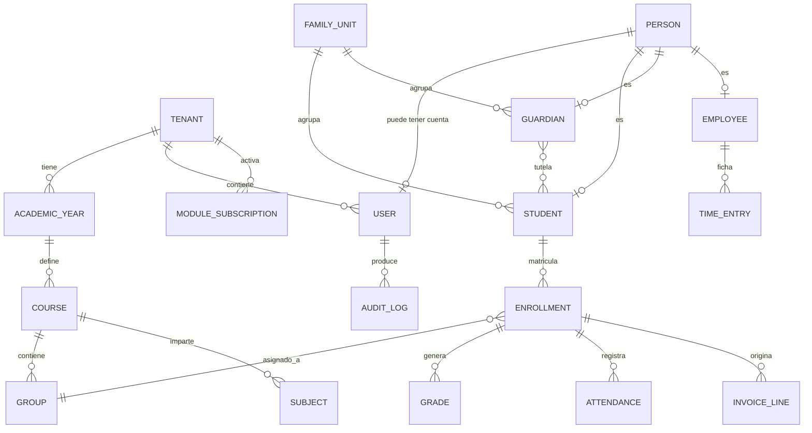

# DOCUMENTO DE REQUISITOS — PLATAFORMA DE GESTIÓN EDUCATIVA MULTI-TENANT

| Campo | Valor |
|-------|-------|
| **Versión** | 3.1.1 |
| **Fecha** | 2026-08-27 |
| **Estado** | Borrador consolidado — pendiente de aprobación |
| **Autor** | Product Owner |
| **Documento sustituye a** | v1.2.0 (mismo contenido, reorganizado y ampliado) |
| **Idioma** | Español (es-ES) |

---

## ÍNDICE

- [0. Guía de uso para implementación (humanos e IA)](#0-guía-de-uso-para-implementación-humanos-e-ia)
- [1. Resumen ejecutivo](#1-resumen-ejecutivo)
- [2. Alcance del proyecto](#2-alcance-del-proyecto)
- [3. Análisis de la competencia](#3-análisis-de-la-competencia)
- [4. Marco regulatorio y normativo](#4-marco-regulatorio-y-normativo)
- [5. Requisitos funcionales (módulos)](#5-requisitos-funcionales-módulos)
- [6. Requisitos no funcionales](#6-requisitos-no-funcionales)
- [7. Requisitos de seguridad y cumplimiento](#7-requisitos-de-seguridad-y-cumplimiento)
- [8. Requisitos de arquitectura](#8-requisitos-de-arquitectura)
- [9. Requisitos de base de datos](#9-requisitos-de-base-de-datos)
- [10. Requisitos de UX/UI y personalización](#10-requisitos-de-uxui-y-personalización)
- [11. Roles y permisos granulares](#11-roles-y-permisos-granulares)
- [12. Multi-tenancy](#12-multi-tenancy)
- [13. Módulos activables/desactivables](#13-módulos-activablesdesactivables)
- [14. Aplicaciones móviles](#14-aplicaciones-móviles)
- [15. Documentación del proyecto](#15-documentación-del-proyecto)
- [16. Modelo de datos conceptual](#16-modelo-de-datos-conceptual)
- [17. Roadmap y fases de entrega](#17-roadmap-y-fases-de-entrega)
- [18. Decisiones abiertas (ADR pendientes)](#18-decisiones-abiertas-adr-pendientes)
- [19. Glosario](#19-glosario)
- [20. Trazabilidad, historial y aprobaciones](#20-trazabilidad-historial-y-aprobaciones)

---

## 0. GUÍA DE USO PARA IMPLEMENTACIÓN (HUMANOS E IA)

> Esta sección es **normativa**. Cualquier agente (humano o IA) que implemente este proyecto debe leerla antes de escribir la primera línea de código.

### 0.1 Cómo leer este documento

1. Lee la **sección 0 completa** (convenciones e invariantes).
2. Lee la **sección 8 (arquitectura)**, **11 (permisos)**, **12 (multi-tenancy)** y **16 (modelo de datos)**: definen el esqueleto sobre el que se apoya todo lo demás.
3. Localiza el módulo asignado en la **sección 5** y lee su bloque de metadatos (`Prioridad`, `Fase`, `Depende de`, `Entidades`).
4. Aplica siempre las **reglas transversales (0.5)**: son requisitos implícitos de *todos* los módulos y no se repiten en cada uno.
5. No implementes nada marcado como `FUTURO` ni resuelvas por tu cuenta las **decisiones abiertas (sección 18)**: pregunta.

### 0.2 Convenciones de identificadores

Todo requisito tiene un ID único e **inmutable**. Nunca se reutiliza ni se renumera un ID; si un requisito desaparece se marca `DEPRECADO`.

| Prefijo | Ámbito |
|---------|--------|
| `REQ-<MOD>-NNN` | Requisito funcional de un módulo (ej. `REQ-CORE-001`) |
| `RNF-<CAT>-NNN` | Requisito no funcional (PERF, UX, MANT, COMP) |
| `RSEC-<NORMA>-NNN` | Requisito de seguridad (ISO, GDPR, OWASP, PENT) |
| `RARQ-<CAT>-NNN` | Requisito de arquitectura (INF, ARC, CLOUD) |
| `RDB-NNN` | Requisito de base de datos |
| `RUX-<CAT>-NNN` | Requisito de UX/UI (RESP, ICON, BRAND, DOM) |
| `RPERM-NNN` | Requisito de permisos |
| `RMT-NNN` | Requisito de multi-tenancy |
| `RMOD-NNN` | Requisito de modularidad |
| `RMOB-<SO>-NNN` | Requisito de app móvil (AND, IOS) |
| `RDOC-NNN` | Requisito de documentación |

**Regla para el implementador**: cada commit, cada PR, cada test y cada issue debe referenciar los IDs que cubre (ej. `feat(auth): login con Google [REQ-AUTH-002]`).

### 0.3 Prioridad y estado

| Prioridad | Significado |
|-----------|-------------|
| `MUST` | Imprescindible. Sin esto no hay producto. |
| `SHOULD` | Importante, pero el producto es viable sin ello en la primera entrega. |
| `COULD` | Deseable. Se implementa si hay margen. |
| `WONT` / `FUTURO` | Fuera del alcance actual. Documentado para no perderlo. |

| Estado | Significado |
|--------|-------------|
| `PROPUESTO` | Escrito, no validado por negocio. |
| `APROBADO` | Validado, listo para implementar. |
| `EN CURSO` / `IMPLEMENTADO` / `VERIFICADO` | Estados de ejecución. |
| `BLOQUEADO` | Depende de una decisión abierta (sección 18). |

### 0.4 Formato de cada módulo

Cada módulo de la sección 5 empieza con un bloque de metadatos:

```
Código: REQ-XXX · Prioridad: MUST · Fase: 1
Depende de: REQ-CORE, REQ-AUTH
Entidades principales: Entidad1, Entidad2
```

Y termina, cuando aplica, con **criterios de aceptación** verificables (formato Gherkin `Dado / Cuando / Entonces`).

### 0.5 Reglas transversales de obligado cumplimiento (INVARIANTES)

> Estas reglas aplican a **todos** los módulos, entidades, endpoints y pantallas. No se repiten en cada requisito. Su incumplimiento invalida la implementación.

| ID | Invariante |
|----|------------|
| `INV-001` | **Aislamiento de tenant**: toda consulta a datos de negocio debe estar filtrada por `tenant_id` a nivel de framework (global scope / row-level security), nunca solo en el controlador. Un fallo aquí es un incidente de seguridad crítico. |
| `INV-002` | **Autorización en cada endpoint**: ningún endpoint responde sin verificar `permiso × recurso × ámbito` del usuario autenticado (ver sección 11). Denegar por defecto. |
| `INV-003` | **Auditoría**: toda operación de creación, modificación o borrado sobre entidades de negocio genera un registro de auditoría inmutable (quién, qué, cuándo, IP, user-agent, valores antes/después). Los valores antes/después se registran **salvo en los atributos clasificados como no registrables por `ADR-035`** (identificadores personales, categoría especial, secretos y valores sobredimensionados), de los que se registra el atributo pero no su valor. |
| `INV-004` | **Soft delete**: las entidades críticas no se borran físicamente; se marcan como eliminadas. El borrado físico solo ocurre en los flujos GDPR de derecho al olvido. |
| `INV-005` | **Campos de auditoría**: toda tabla de negocio incluye `created_at`, `updated_at`, `deleted_at`, `created_by`, `updated_by`. |
| `INV-006` | **API-first**: toda funcionalidad accesible por interfaz debe existir antes como endpoint de API documentado (OpenAPI). La UI es un cliente más. |
| `INV-007` | **Modularidad**: un módulo no puede importar código interno de otro módulo. La comunicación entre módulos se hace por interfaces públicas o eventos de dominio. |
| `INV-008` | **Datos de menores**: cualquier dato personal de un alumno menor de edad exige base legal registrada y consentimiento del tutor legal (ver `RSEC-GDPR-009`). |
| `INV-009` | **i18n**: ningún literal visible por el usuario se escribe directamente en el código. Todo pasa por el sistema de traducción. |
| `INV-010` | **Validación en servidor**: la validación de cliente es solo UX. Toda regla de negocio se valida obligatoriamente en el backend. |
| `INV-011` | **Idempotencia**: los endpoints de escritura críticos (pagos, matrículas, envíos masivos) aceptan clave de idempotencia y no duplican efectos ante reintentos. |
| `INV-012` | **Tareas pesadas asíncronas**: importaciones masivas, generación de PDF en lote, envíos masivos y cálculos de nómina se ejecutan en colas, nunca en el ciclo de petición HTTP. |
| `INV-013` | **Trazabilidad**: cada petición lleva un `request_id` propagado a logs y trazas. |
| `INV-014` | **Consentimiento de imagen**: ninguna imagen de un alumno se publica sin comprobar previamente su consentimiento vigente (ver `REQ-FAM-UNIT-004`). |
| `INV-015` | **Tests**: ningún requisito se considera implementado sin test automatizado que lo cubra y referencie su ID. |

### 0.6 Orden de implementación recomendado

```
1. Infraestructura base + CI/CD + entornos          (sección 8)
2. Esqueleto multi-tenant + modelo de datos núcleo  (secciones 12, 16)
3. REQ-CORE  (tenants, usuarios, config, auditoría)
4. REQ-AUTH  (login local, Google, MFA, sesiones)
5. Sistema de roles y permisos granular             (sección 11)
6. Sistema de módulos activables                    (sección 13)
7. Design System + layout responsive                (sección 10)
8. Módulos de negocio por fase                      (sección 17)
```

**Regla de oro**: los pasos 1–7 son cimientos. Implementar un módulo de negocio antes de tenerlos completos genera deuda técnica que obliga a reescribir.

### 0.7 Definition of Ready / Definition of Done

**Ready** (un requisito puede entrar en desarrollo si):
- Tiene ID, prioridad y estado `APROBADO`.
- Sus dependencias están implementadas o mockeadas.
- Tiene criterios de aceptación verificables.
- No depende de una decisión abierta sin resolver.

**Done** (un requisito se cierra si):
- Cumple todos sus criterios de aceptación.
- Cumple las invariantes de 0.5.
- Tiene tests automatizados (unitarios + integración) que referencian su ID.
- Cobertura global de tests > 80% (`RNF-MANT-001`).
- Endpoint documentado en OpenAPI.
- Pasa lint, análisis estático y escaneo de dependencias.
- Revisado por otra persona (o segunda pasada de revisión independiente si el desarrollo es asistido por IA).
- Textos traducidos a los idiomas activos.
- Accesible según WCAG 2.1 AA (`RNF-UX-002`).

### 0.8 Prompt de arranque sugerido para un agente IA

> Eres el equipo de desarrollo de una plataforma educativa SaaS multi-tenant. Tu única fuente de verdad es `REQUISITOS-PLATAFORMA-EDUCATIVA.md`.
>
> Antes de escribir código: (1) lee la sección 0 completa; (2) lee las secciones 8, 11, 12 y 16; (3) confirma qué decisiones de la sección 18 están resueltas.
>
> Trabaja módulo a módulo siguiendo el orden de 0.6 y el roadmap de la sección 17. Para cada módulo: propón el modelo de datos, los endpoints y las pantallas antes de implementar; espera validación; implementa con tests; referencia los IDs de requisito en cada commit.
>
> No inventes requisitos. Si algo no está definido, márcalo como pregunta abierta y detente en vez de asumir. Aplica siempre las invariantes `INV-001` a `INV-015`.

---

## 1. RESUMEN EJECUTIVO

### 1.1 Propósito

Este documento recoge los requisitos funcionales, no funcionales, de seguridad, arquitectura y experiencia de usuario para el desarrollo de una **plataforma de gestión educativa multi-tenant, modular y escalable**. La plataforma se concibe como alternativa moderna, usable y segura frente a soluciones existentes en el mercado español, que presentan deficiencias en experiencia de usuario, personalización y adaptabilidad.

### 1.2 Audiencia

- Equipo de desarrollo y arquitectura (incluidos agentes de desarrollo asistido por IA).
- Equipo de producto y UX/UI.
- Equipo de seguridad y compliance.
- Administradores de sistemas (DevOps/SysAdmin).
- Stakeholders y dirección.

### 1.3 Propuesta de valor en una frase

> Un único sistema desde el que un centro educativo gestiona su vida académica, económica, administrativa y de comunicación con las familias, con su propia marca y dominio, activando solo los módulos que necesita y pagando solo por ellos.

---

## 2. ALCANCE DEL PROYECTO

### 2.1 Objetivos

- Construir una plataforma de gestión educativa integral que supere las limitaciones de UX de las soluciones actuales.
- Garantizar **modularidad total**: cada funcionalidad es un módulo independiente activable/desactivable.
- Implementar arquitectura **multi-tenant** que permita gestionar múltiples centros desde una única instancia con aislamiento total de datos.
- Cumplir estándares de seguridad: ISO 27001, GDPR/LOPDGDD, OWASP Top 10.
- Ofrecer experiencia de usuario moderna, responsive y personalizable por centro.
- Soportar dominios/subdominios personalizados con certificados SSL gestionados automáticamente.
- Desplegar aplicaciones móviles para Android e iOS (smartphone y tablet).
- Gestionar centros públicos, privados y concertados con adaptación a sus requisitos regulatorios específicos.

### 2.2 Fuera de alcance (esta fase)

- Desarrollo de hardware propio (lectores NFC, terminales de acceso, tornos).
- Integración con sistemas de videovigilancia.
- Módulo de gestión de residencias/albergues (salvo demanda explícita).
- Contabilidad financiera avanzada de nivel ERP (consolidación de grupos, multidivisa compleja).

### 2.3 Supuestos

- El equipo de desarrollo contará con acceso a testers reales de centros educativos.
- Se dispondrá de entornos de staging y producción aislados.
- Se contratará auditoría externa de pentesting antes del lanzamiento.
- La gestión de nóminas se apoyará en normativa española vigente y podrá exportar a gestoras externas.

### 2.4 Riesgos principales identificados

| Riesgo | Impacto | Mitigación |
|--------|---------|------------|
| Alcance excesivo (27 módulos) | Alto | Roadmap por fases (sección 17). MVP acotado a Fase 1. |
| Fuga de datos entre tenants | Crítico | `INV-001` + tests automáticos de aislamiento en CI. |
| Normativa autonómica divergente | Medio | Capa de configuración por CCAA desde el diseño. |
| Complejidad de nóminas y fiscalidad | Alto | Evaluar integración con motor externo antes de desarrollar propio (ver sección 18). |
| Rendimiento con tenants grandes | Medio | Pruebas de carga desde Fase 1; estrategia de particionado definida. |

---

## 3. ANÁLISIS DE LA COMPETENCIA

### 3.1 Módulos habituales en las soluciones existentes

| Módulo | Descripción |
|--------|-------------|
| Gestión Académica | Cursos, asignaturas, horarios, calificaciones, evaluaciones, boletines. |
| Gestión de Alumnos | Matrículas, preinscripciones, expedientes, historial, seguimiento. |
| Gestión de Personal | Empleados, contratos, licencias, evaluaciones de rendimiento. |
| Gestión Económica | Facturación, recibos, cobros, contabilidad, presupuestos, conciliación. |
| Comunicaciones | Notificaciones SMS/email, circulares, mensajería interna, alertas. |
| Portal Familias | Notas, horarios, incidencias, comunicaciones, pagos. |
| Portal Profesores | Asistencia, incidencias, publicación de notas, planificación. |
| Agenda | Calendario escolar, eventos, tutorías, reuniones. |
| Documentación | Expedientes, certificados, permisos, firmas digitales. |
| Tienda Online | e-Commerce para material, cursos, actividades. |
| Aula Virtual | Integración con Moodle y otros LMS. |
| Biblioteca | Catálogo, préstamos, devoluciones. |
| Transporte | Rutas, vehículos, conductores, seguimiento GPS. |
| Comedor | Menús, dietas especiales, control de comidas, pagos. |

### 3.2 Deficiencias detectadas en el mercado

| Área | Problema observado |
|------|--------------------|
| UX/UI | Interfaces poco modernas, poco intuitivas, curva de aprendizaje elevada. |
| Personalización | Sin branding completo ni dominios personalizados por centro. |
| Roles | Sistemas de permisos rígidos, sin roles personalizados. |
| Multi-tenancy | No gestionan múltiples centros con aislamiento total desde una única plataforma. |
| Módulos | Activación/desactivación no gestionable de forma granular por el superadministrador. |
| Escalabilidad | Dificultades reportadas en centros de gran tamaño (>5.000 usuarios). |
| Móvil | Apps con funcionalidad muy limitada respecto al portal web. |
| APIs | Integraciones limitadas, sin API REST pública documentada. |
| Web pública | No incluyen gestión de la web pública del centro. |
| Autorizaciones | No gestionan autorizaciones de salidas con firma digital. |
| Becas | Gestión de becas muy limitada o inexistente. |

### 3.3 Oportunidades de diferenciación (drivers de producto)

1. **UX/UI moderna y minimalista** centrada en el usuario.
2. **Personalización total**: branding, colores, logo, dominio propio y SSL por tenant.
3. **Roles granulares**: RBAC extensible por el propio administrador del centro.
4. **Multi-tenancy nativo** diseñado desde cero.
5. **Módulos realmente independientes** con activación/desactivación sin impacto colateral.
6. **API-first**: toda funcionalidad expuesta vía API.
7. **Escalabilidad cloud-native** con escalado horizontal.
8. **Seguridad de primer nivel**: ISO 27001, GDPR y pentest OWASP como requisito de go-live.
9. **Web pública integrada** gestionada desde la misma plataforma.
10. **Autorizaciones digitales** con firma electrónica.
11. **Gestión integral de becas** públicas y privadas.

---

## 4. MARCO REGULATORIO Y NORMATIVO

### 4.1 Tipos de centro y sus implicaciones

| Tipo de centro | Características | Implicaciones para la plataforma |
|----------------|-----------------|-----------------------------------|
| **Público** | Titularidad de la Administración. Financiación pública. | Integración con sistemas de la Administración educativa. Normativa de transparencia. Rendición de cuentas pública. |
| **Privado** | Titularidad privada. Financiación por cuotas. Autonomía de gestión. | Gestión completa de cuotas, matrículas y servicios. Libertad en oferta educativa y admisiones. |
| **Concertado** | Titularidad privada con financiación pública mediante concierto. | Gestión de unidades concertadas y no concertadas. Control de ratios y plazas. Criterios de admisión públicos. Documentación para inspecciones. |

### 4.2 Requisitos específicos por tipo de centro

#### 4.2.1 Centros concertados

| Requisito | Descripción |
|-----------|-------------|
| Concierto educativo | Duración mínima de 6 años (Primaria) o 4 años (resto). Gestión de vigencia y alertas de renovación. |
| Identificación | Debe constar la condición de "centro privado concertado" en toda documentación y publicidad generada por la plataforma. |
| Admisión | Mismos criterios que centros públicos: listas de espera públicas, baremación objetiva y sorteo electrónico auditable. |
| Ratios | Máx. 25 en Primaria, 30 en ESO, 35 en Bachillerato. Control y alertas de ratio. |
| Gratuidad | Las enseñanzas concertadas son gratuitas. Diferenciación entre conceptos gratuitos (concertados) y de pago (no concertados). |
| Personal | Certificación negativa del Registro Central de Delincuentes Sexuales obligatoria y gestionada por la plataforma. |
| Consejo Escolar | Órgano obligatorio con representación de padres, profesores y administración. Gestión de órganos colegiados. |
| Comisión Económica | Integrada por Director, Profesor y Padre. Informes sobre materias económicas. |
| Rendición de cuentas | Transparencia en la gestión económica. |
| Actividades complementarias | Voluntarias, no lucrativas y fuera del horario lectivo, con aprobación administrativa. |

#### 4.2.2 Centros privados no concertados

| Requisito | Descripción |
|-----------|-------------|
| Autonomía | Libre determinación de régimen interno, admisiones, profesorado, convivencia y régimen económico. |
| Autorización administrativa | Autorización previa de la Consejería de Educación. La plataforma facilita la documentación del expediente. |
| Facultades académicas | Plenas en niveles obligatorios. |
| Exención de IVA | La docencia preuniversitaria está exenta de IVA. Debe reflejarse en la facturación. |
| Deducciones fiscales | Generación de certificados de gastos de escolarización para la declaración de la renta. |

#### 4.2.3 Centros públicos

| Requisito | Descripción |
|-----------|-------------|
| Transparencia | Publicidad activa. Publicación de información pública. |
| Admisión pública | Proceso centralizado según criterios de la comunidad autónoma. |
| Gestión de recursos públicos | Control estricto del gasto y rendición de cuentas. |
| LOMLOE | Cumplimiento en evaluación, competencias y participación. |

### 4.3 Normativa aplicable

| Norma | Aplicación |
|-------|------------|
| LOMLOE (LO 3/2020) | Ordenación del sistema educativo, evaluación por competencias, participación. |
| LODE (LO 8/1985) | Régimen de centros, conciertos educativos, participación. |
| LOPII (LO 8/2021) | Protección integral a la infancia. Certificación negativa de delincuentes sexuales. |
| GDPR (UE 2016/679) / LOPDGDD (LO 3/2018) | Protección de datos de menores y personal. |
| Ley 19/2013 de Transparencia | Centros públicos y concertados. |
| eIDAS (UE 910/2014) | Validez legal de la firma electrónica. |
| Normativa autonómica | Competencias transferidas. La plataforma debe ser configurable por CCAA. |

### 4.4 Centros de régimen mixto

Un mismo centro puede combinar varios regímenes jurídicos simultáneamente. El caso habitual, y el del centro objetivo inicial, es un **centro concertado en las etapas obligatorias con el primer ciclo de Educación Infantil (0-3) en régimen privado**, con plazas no sostenidas con fondos públicos.

Implicaciones directas:

| Ámbito | Etapas concertadas | Primer ciclo de Infantil privado |
|--------|--------------------|----------------------------------|
| Sistema oficial de registro | Raíces (obligatorio) | **La propia plataforma** |
| Evaluación y boletines | Se consignan en Raíces | Generados y publicados por nosotros (`REQ-INF-002`) |
| Admisión | Criterios públicos y baremación | Libre, gestionada por el centro |
| Cuotas | Gratuidad de la enseñanza concertada | Cuota de escolaridad privada |
| Ayudas | Becas públicas de material, comedor, transporte | Beca autonómica y municipal de escolarización 0-3 |
| Portal de familias | Convive con Roble | Único canal hacia la familia |

> **Nota para el implementador**: el régimen jurídico y la comunidad autónoma condicionan reglas de negocio en admisiones, facturación (IVA), ratios, evaluación y documentación generada. Modelarlo como configuración **asociada a la etapa educativa**, resuelta en tiempo de ejecución a partir de la matrícula del alumno, nunca como código condicional disperso ni como bandera global del tenant.

---

## 5. REQUISITOS FUNCIONALES (MÓDULOS)

### 5.0 Catálogo de módulos

Cada módulo es una unidad funcional independiente, activable/desactivable por tenant (ver sección 13).

| # | Código | Módulo | Prioridad | Fase | Depende de |
|---|--------|--------|-----------|------|------------|
| 5.1 | `REQ-CORE` | Core / Plataforma base | MUST | 1 | — |
| 5.2 | `REQ-AUTH` | Autenticación e identidad | MUST | 1 | CORE |
| 5.3 | `REQ-FAM-UNIT` | Unidad familiar, tutores y autorizados | MUST | 1 | CORE, AUTH |
| 5.4 | `REQ-ACAD` | Gestión académica | MUST | 1 | CORE |
| 5.5 | `REQ-CALIF` | Calificaciones y evaluación | MUST | 1 | ACAD |
| 5.6 | `REQ-ALUM` | Alumnos y matrículas | MUST | 1 | CORE, FAM-UNIT |
| 5.7 | `REQ-OFE` | Oferta educativa y preinscripción | SHOULD | 2 | ALUM |
| 5.8 | `REQ-RRHH` | Gestión de personal / RRHH | SHOULD | 2 | CORE |
| 5.9 | `REQ-NOM` | Nóminas | COULD | 3 | RRHH |
| 5.10 | `REQ-FIN` | Gestión económica y financiera | MUST | 2 | CORE, ALUM |
| 5.11 | `REQ-BEC` | Becas, ayudas y descuentos | SHOULD | 2 | FIN |
| 5.12 | `REQ-COM` | Comunicaciones y notificaciones | MUST | 1 | CORE |
| 5.13 | `REQ-AUT` | Autorizaciones y consentimientos | SHOULD | 2 | FAM-UNIT, DOC |
| 5.14 | `REQ-WEB` | Web pública del centro | COULD | 3 | CORE, OFE |
| 5.15 | `REQ-FAM-PORTAL` | Portal familias / tutores | MUST | 1 | FAM-UNIT, CALIF |
| 5.16 | `REQ-PROF` | Portal profesores | MUST | 1 | ACAD, CALIF |
| 5.17 | `REQ-EST` | Portal estudiantes | MUST | 1 | ACAD, CALIF |
| 5.18 | `REQ-LMS` | Aula virtual / e-learning | COULD | 4 | ACAD |
| 5.19 | `REQ-DOC` | Gestión documental | SHOULD | 2 | CORE |
| 5.20 | `REQ-BIB` | Biblioteca | COULD | 4 | CORE |
| 5.21 | `REQ-TRAN` | Transporte escolar | SHOULD | 2 | ALUM, FAM-UNIT, FIN, COM |
| 5.22 | `REQ-COMED` | Comedor / cantina | COULD | 3 | ALUM, FIN |
| 5.23 | `REQ-EXTRA` | Extraescolares | SHOULD | 3 | ACAD, FIN |
| 5.24 | `REQ-SHOP` | Tienda online / e-commerce | COULD | 3 | FIN |
| 5.25 | `REQ-AGENDA` | Calendario y agenda | SHOULD | 1 | CORE, ACAD |
| 5.26 | `REQ-BI` | Analítica e informes (BI) | SHOULD | 2 | Todos |
| 5.27 | `REQ-API` | Integraciones y APIs | SHOULD | 2 | CORE |
| 5.28 | `REQ-CURSO` | Ciclo de vida del curso académico | MUST | 1 | ACAD, ALUM |
| 5.29 | `REQ-CONV` | Convivencia, disciplina y protocolos | MUST | 2 | ACAD, COM |
| 5.30 | `REQ-NEAE` | Atención a la diversidad y orientación | MUST | 2 | ALUM, DOC |
| 5.31 | `REQ-SALUD` | Enfermería y salud escolar | MUST | 2 | ALUM, AUT |
| 5.32 | `REQ-SEC` | Secretaría, certificados y administraciones | MUST | 2 | ALUM, CALIF, DOC |
| 5.33 | `REQ-GOB` | Órganos de gobierno y participación | SHOULD | 3 | CORE, DOC |
| 5.34 | `REQ-JOR` | Registro de jornada y portal del empleado | MUST | 2 | RRHH |
| 5.35 | `REQ-PRL` | Prevención, emergencias y avisos urgentes | MUST | 2 | COM, RRHH |
| 5.36 | `REQ-LIB` | Banco de libros y material curricular | SHOULD | 3 | ALUM, FIN |
| 5.37 | `REQ-ACOG` | Servicios de acogida (aula matinal, permanencias) | SHOULD | 3 | ALUM, FIN |
| 5.38 | `REQ-GUAR` | Guardias y sustituciones | SHOULD | 2 | ACAD, RRHH |
| 5.39 | `REQ-ESP` | Espacios, instalaciones y mantenimiento | COULD | 3 | CORE |
| 5.40 | `REQ-PROV` | Compras, proveedores y gasto | COULD | 3 | FIN |
| 5.41 | `REQ-FCT` | Prácticas en empresa (FCT) y movilidad | COULD | 4 | ACAD, DOC |
| 5.42 | `REQ-ENC` | Encuestas, calidad y mejora continua | COULD | 3 | COM |
| 5.43 | `REQ-CRM` | Captación, CRM de admisiones y alumni | COULD | 4 | OFE |
| 5.44 | `REQ-VIDEO` | Videotutorías y reuniones online | COULD | 3 | AGENDA, COM |
| 5.45 | `REQ-PRIV` | Gobierno de privacidad operativo (GDPR) | MUST | 2 | CORE |
| 5.46 | `REQ-ONB` | Onboarding y migración de datos | MUST | 1 | CORE |
| 5.47 | `REQ-SAAS` | Suscripciones y facturación del SaaS | MUST | 2 | CORE |
| 5.48 | `REQ-SUP` | Soporte, helpdesk e impersonation | MUST | 2 | CORE |
| 5.49 | `REQ-OPS` | Operación del servicio y ciclo de vida del dato | SHOULD | 2 | CORE |
| 5.50 | `REQ-INF` | Primer ciclo de Educación Infantil (0-3) | MUST | 1 | ACAD, CALIF, ALUM, FIN |
| 5.51 | `REQ-BO` | Backoffice de Super Administrador | MUST | 1 | CORE |
| 5.52 | `REQ-BKP` | Copias de seguridad y recuperación | MUST | 1 | CORE, BO |

**Agrupación por bloques funcionales**

- **A. Núcleo transversal**: CORE, AUTH, COM, DOC, AGENDA, API, CURSO
- **B. Académico**: ACAD, CALIF, ALUM, OFE, LMS, NEAE, SEC, FCT, INF
- **C. Económico**: FIN, BEC, NOM, SHOP, LIB, PROV
- **D. Comunidad educativa**: FAM-UNIT, FAM-PORTAL, PROF, EST, AUT, WEB, GOB, CONV, VIDEO, CRM
- **E. Servicios del centro**: COMED, TRAN, EXTRA, BIB, ACOG, ESP
- **F. Personal y cumplimiento**: RRHH, JOR, GUAR, SALUD, PRL, PRIV, ENC
- **G. Operación de la plataforma (SaaS)**: BO, ONB, SAAS, SUP, OPS, BKP
- **H. Inteligencia de negocio**: BI

> **Criterios base de todo módulo** (además de las invariantes de 0.5):
> - Activable/desactivable por el Super Administrador sin afectar a otros módulos.
> - Respeta el aislamiento de datos entre tenants.
> - Expone sus funcionalidades vía API documentada.
> - Se integra con el sistema de roles y permisos granular.
> - Genera logs de auditoría de todas las operaciones CRUD.

---

### 5.1 MÓDULO CORE / PLATAFORMA BASE (`REQ-CORE`)

> **Prioridad**: MUST · **Fase**: 1 · **Depende de**: — 
> **Entidades principales**: `Tenant`, `User`, `Role`, `Permission`, `ModuleSubscription`, `AuditLog`, `Notification`, `Setting`

#### REQ-CORE-001: Gestión de tenants
- El Super Administrador puede crear nuevos tenants (centros educativos).
- Cada tenant tiene: nombre, identificador único (slug), dominio/subdominio asignado, configuración regional (idioma por defecto, idiomas activos, zona horaria, moneda), datos fiscales, logo, paleta de colores y **comunidad autónoma**.
- **El régimen jurídico (público / privado / concertado) se configura por etapa educativa, no a nivel de tenant** (`ADR-020`). Un mismo centro puede ser concertado en Primaria y ESO y privado en el primer ciclo de Infantil, y las reglas de admisión, facturación, evaluación y volcado a la administración deben resolverse en función de la etapa del alumno.
- El Super Administrador puede suspender, reactivar o eliminar un tenant (soft delete con período de gracia de 90 días).
- Cada tenant dispone de un panel de configuración propio.

#### REQ-CORE-002: Panel de administración del tenant
El Administrador de Centro puede:
- Gestionar usuarios y roles del centro.
- Activar/desactivar módulos contratados.
- Configurar branding (logo, colores primario/secundario, favicon).
- Configurar dominio personalizado y certificado SSL.
- Configurar parámetros académicos (cursos lectivos, períodos de evaluación, escalas de calificación).
- Configurar notificaciones y canales de comunicación.
- Gestionar backups y exportaciones de datos.

#### REQ-CORE-003: Gestión de usuarios del sistema
- Alta, baja, modificación y consulta de usuarios.
- Cada usuario pertenece a un único tenant.
- Datos de usuario: nombre, apellidos, email, teléfono, DNI/NIE, foto de perfil, idioma preferido, estado (activo/inactivo/pendiente).
- Importación masiva desde CSV/Excel con validación previa y reporte de errores.
- Invitación por email con enlace de activación caducable.
- Autenticación: email/contraseña, SSO (SAML 2.0, OAuth2/OIDC), 2FA/MFA.
- Gestión de sesiones: timeout configurable, cierre de sesión remoto, historial de accesos.

#### REQ-CORE-004: Roles y permisos granulares
- Roles predefinidos (ver sección 11.1).
- Roles personalizados con permisos a nivel de **recurso × acción × ámbito**.
- Herencia de roles con posibilidad de override.
- Asignación múltiple de roles por usuario.

*Especificación completa en la sección 11.*

#### REQ-CORE-005: Logs de auditoría
- Registro inmutable de todas las operaciones: quién, qué, cuándo, desde dónde (IP, user-agent).
- Filtrado por fecha, usuario, tipo de operación, módulo.
- Exportación a CSV/PDF.
- Retención mínima de 2 años, configurable por compliance.

#### REQ-CORE-006: Internacionalización (i18n)
- **Idiomas obligatorios**: castellano `es-ES` (por defecto), inglés `en`, alemán `de` y francés `fr`. Lenguas cooficiales (`ca`, `eu`, `gl`) previstas en la arquitectura pero no implementadas en fases 1-3 (`ADR-021`).
- Selección de idioma **por usuario**, independiente del idioma por defecto del tenant, y conmutable en cualquier momento sin perder el estado de la sesión.
- Framework de traducción que permite añadir idiomas sin modificar código (`INV-009`).
- La traducción alcanza **tres capas independientes**:
  1. **Interfaz**: literales, menús, mensajes de error, validaciones.
  2. **Documentos y comunicaciones generadas**: boletines, facturas, recibos, autorizaciones, certificados, circulares, plantillas de notificación y correos transaccionales, en el idioma del destinatario.
  3. **Contenido introducido por el centro**: nombres de asignaturas y actividades, textos de branding, condiciones de uso, páginas de la web pública. Campos multi-idioma con idioma de respaldo cuando falte una traducción.
- Fechas, monedas y formatos numéricos adaptados a la localización del usuario; la moneda sigue siendo la del tenant.
- Panel de gestión de traducciones para el Administrador de Centro sobre el contenido propio, sin intervención del proveedor.
- Informe de cobertura de traducción: qué literales y contenidos faltan por idioma.

#### REQ-CORE-007: Notificaciones del sistema
- Notificaciones internas (in-app) y externas (email, SMS, push).
- Plantillas personalizables por tenant.
- Cola de notificaciones con reintentos y confirmación de entrega.
- Preferencias de notificación configurables por usuario.

#### REQ-CORE-008: Zona de cliente / dashboard personalizado
- Al iniciar sesión, cada usuario accede a una zona personalizada según su rol.
- El dashboard muestra únicamente opciones, módulos y acciones permitidas para su rol.
- Widgets configurables: próximos eventos, tareas pendientes, notificaciones, calendario, accesos directos.
- El administrador puede definir dashboards por defecto para cada rol.
- Transiciones fluidas entre secciones sin recarga completa de página (SPA).

**Criterios de aceptación**
- *Dado* un usuario del tenant A, *cuando* solicita por API un recurso del tenant B, *entonces* recibe 404 (no 403, para no revelar existencia) y se registra el intento.
- *Dado* un módulo desactivado, *cuando* el usuario carga su dashboard, *entonces* no aparece ninguna referencia visible a ese módulo.

---

### 5.2 MÓDULO AUTENTICACIÓN Y GESTIÓN DE IDENTIDAD (`REQ-AUTH`)

> **Prioridad**: MUST · **Fase**: 1 · **Depende de**: CORE 
> **Entidades principales**: `User`, `IdentityProvider`, `Session`, `MfaFactor`, `LoginAttempt`

#### REQ-AUTH-001: Autenticación local
- Registro con email y contraseña.
- Validación de email mediante enlace de confirmación.
- Recuperación de contraseña por email con token temporal de un solo uso.
- Política de contraseñas: mínimo 12 caracteres con mayúsculas, minúsculas, números y símbolos.
- Bloqueo de cuenta tras 5 intentos fallidos consecutivos, con desbloqueo por email o por administrador.

#### REQ-AUTH-002: Autenticación con Google (OAuth2 / OIDC)
- Botón "Iniciar sesión con Google" en el login.
- Flujo OAuth2 estándar con scopes `email`, `profile`, `openid`.
- Al autenticarse con Google, el sistema debe:
  1. Verificar si existe un usuario local con el mismo email.
  2. Si existe: **fusionar la cuenta** (vincular el proveedor OAuth al usuario existente) manteniendo datos, roles, historial y configuraciones.
  3. Si no existe: crear un nuevo usuario con los datos de Google (nombre, apellidos, email, foto).
- Desvinculación de la cuenta de Google desde el perfil de usuario.
- Vinculación de Google a una cuenta local existente desde el perfil.

> ⚠️ **Nota de seguridad para el implementador**: la fusión automática por email solo es aceptable si el proveedor devuelve `email_verified = true`. En caso contrario debe requerirse confirmación explícita desde la cuenta local.

#### REQ-AUTH-003: Autenticación multifactor (MFA/2FA)
- **Disponible para todos los usuarios de la plataforma**, sea cual sea su rol: personal, familias y estudiantes. Ningún perfil queda excluido de poder protegerse.
- Activación voluntaria por el propio usuario desde su perfil.
- Métodos soportados: TOTP (Google Authenticator, Authy, Microsoft Authenticator), SMS y email. El tenant puede restringir qué métodos acepta.
- Códigos de respaldo de un solo uso, generados al activar y regenerables.

**Obligatoriedad por rol**
- Cada rol tiene un atributo booleano **`mfa_obligatorio`**, editable por el Administrador de Centro desde el editor de roles.
- El atributo existe tanto en los **roles predefinidos** como en los **roles personalizados** que cree el administrador (`RPERM-005`): es una propiedad de la entidad rol, nunca una lista fija en el código.
- Al clonar un rol se hereda el valor del rol origen (`RPERM-006`).
- **Resolución en usuarios con varios roles**: si *cualquiera* de sus roles exige MFA, el usuario queda obligado. Se aplica el criterio más restrictivo, coherente con `RPERM-007`.
- Vista previa en el editor de roles del número de usuarios que quedarían obligados antes de guardar el cambio.

**Flujo de cumplimiento**
- Al activarse la obligatoriedad, el usuario dispone de un **período de gracia configurable** (por defecto 7 días) con avisos en cada acceso.
- Agotado el plazo, el login desemboca en una pantalla de alta de MFA de la que no se puede salir sin completar el registro.
- El estado de cumplimiento es consultable por el administrador: usuarios obligados, inscritos y pendientes.
- **Excepción temporal nominal**, con motivo, caducidad y registro de auditoría, para casos justificados (usuario sin dispositivo compatible). No existe la exención permanente.

**Recuperación y desactivación**
- Restablecimiento de MFA por el administrador con verificación previa de identidad, motivo obligatorio y notificación al usuario afectado.
- Un usuario nunca puede desactivar su MFA si alguno de sus roles lo exige.
- Toda activación, desactivación, restablecimiento y uso de código de respaldo queda auditado (`INV-003`).

**Recomendaciones de configuración por defecto**
- Obligatorio en los roles con acceso a datos de categoría especial (orientación, enfermería, convivencia) y a operaciones económicas.
- Obligatorio para dirección, secretaría y administración de centro.
- Opcional pero fomentado en docentes, familias y estudiantes.
- En el backoffice de plataforma es **obligatorio sin excepción y sin conmutador** (`REQ-BO-007`).

#### REQ-AUTH-004: Single Sign-On (SSO) institucional
- SAML 2.0 para sistemas de identidad institucionales.
- OIDC para Azure AD / Entra ID, Google Workspace, etc.
- Mapeo automático de atributos SAML/OIDC a campos de usuario.
- Just-in-Time provisioning: creación automática de usuarios en el primer login SSO.

#### REQ-AUTH-005: Gestión de sesiones
- Sesiones con expiración configurable (por defecto 30 minutos de inactividad).
- Cierre de sesión en todos los dispositivos.
- Visualización de sesiones activas con posibilidad de revocarlas.
- Detección de login desde nuevo dispositivo/ubicación con alerta al usuario.

---

### 5.3 MÓDULO UNIDAD FAMILIAR Y TUTORES (`REQ-FAM-UNIT`)

> **Prioridad**: MUST · **Fase**: 1 · **Depende de**: CORE, AUTH 
> **Entidades principales**: `FamilyUnit`, `Guardian`, `GuardianStudentLink`, `TermsAcceptance`, `ImageConsent`, `AuthorizedPickup`, `PickupRecord`

#### REQ-FAM-UNIT-001: Concepto de unidad familiar
- Cada estudiante pertenece a una **Unidad Familiar** identificada por un código único dentro del tenant.
- Una unidad familiar puede tener múltiples tutores (padre, madre, tutor legal, apoderado).
- Cada tutor tiene su propia cuenta de usuario independiente.
- Los tutores comparten acceso a la información de los estudiantes vinculados a su unidad familiar.
- Jerarquía: **Tutor Principal** (gestiona la unidad, añade/elimina tutores, autoriza cambios) y **Tutores Secundarios** (acceso de lectura o lectura/escritura configurable).

#### REQ-FAM-UNIT-002: Vinculación de tutores a estudiante
- Vinculación de múltiples tutores por estudiante con tipo de relación (padre, madre, tutor legal, abuelo, apoderado…).
- Derechos de acceso configurables por tutor sobre la información del alumno.
- Posibilidad de restringir información sensible a ciertos tutores (ej. solo el tutor principal ve datos médicos).
- Notificación a todos los tutores de eventos relevantes (notas, incidencias, autorizaciones pendientes).
- Designación de un tutor como "contacto de emergencia".

> ⚠️ **Nota legal para el implementador**: deben contemplarse situaciones de custodia (divorcios, restricciones judiciales de acceso). El modelo debe permitir revocar el acceso de un tutor concreto a un alumno concreto sin afectar al resto de la unidad familiar.

#### REQ-FAM-UNIT-003: Aceptación de condiciones de uso
- En el primer acceso (o al alta de un nuevo tutor), el sistema presenta las **Condiciones de Uso** del centro.
- Las condiciones son personalizables por el Administrador de Centro.
- Registro de fecha, hora, IP y versión de las condiciones aceptadas.
- Sin aceptar las condiciones, el tutor no puede acceder a la plataforma.
- Posibilidad de requerir re-aceptación cuando se modifiquen las condiciones.
- Historial de versiones aceptadas por cada tutor.

#### REQ-FAM-UNIT-005: Personas autorizadas a recoger al menor
> **Fuente única de verdad** para todos los servicios del centro (`ADR-032`). Ningún módulo mantiene su propia lista.

- Registro por alumno de las **personas autorizadas a recogerlo**: tutores de la unidad familiar y terceros añadidos expresamente (abuelos, personal de apoyo, otra familia).
- Cada persona autorizada incluye: nombre, documento identificativo, relación con el alumno, teléfono de contacto y **fotografía**, para que quien entrega al menor pueda verificar visualmente.
- El alta de un tercero requiere autorización del **tutor principal**, con registro de fecha, hora y versión aceptada.
- **Autorizaciones puntuales** para un día concreto y un motivo, con caducidad automática.
- **Autorización de salida autónoma**: el tutor puede autorizar que el alumno salga solo, con edad mínima configurable por el centro y por etapa. En el primer ciclo de Infantil no se admite excepción.
- **Exclusión automática por restricción judicial**: un tutor con el acceso revocado según `REQ-FAM-UNIT-002` queda excluido de la lista maestra y, por tanto, de todos los servicios a la vez. El sistema lo impide, no lo advierte.
- Revocación con **efecto inmediato** en todos los servicios que consumen la lista.
- Historial completo de altas, bajas y usos: ante un incidente con un menor, el registro es la prueba.

**Consumen esta lista, sin duplicarla**: recogida ordinaria en el centro (`REQ-PRL-004`), transporte escolar (`REQ-TRAN-005`), comedor (`REQ-COMED`), actividades extraescolares (`REQ-EXTRA`), aula matinal (`REQ-ACOG`) y primer ciclo de Infantil (`REQ-INF`). Cada servicio puede **restringir** sobre ella, nunca ampliarla.

#### REQ-FAM-UNIT-004: Gestión del uso de imagen de los tutelados
- Cada tutor gestiona de forma granular el consentimiento de uso de imagen de cada estudiante bajo su tutela.
- **Dos niveles de consentimiento independientes**:
  1. **Portal web del centro**: fotos en la web pública, galerías, publicaciones internas.
  2. **Redes sociales**: Facebook, Instagram, X, LinkedIn, newsletters, prensa.
- Cada nivel puede estar en: **Sí autorizo** / **No autorizo** / **Pendiente de decisión**.
- El sistema **bloquea automáticamente** la publicación de imágenes de estudiantes con consentimiento negativo o pendiente (ver `INV-014`).
- Marcado automático de fotos en galerías según el consentimiento del alumno.
- Informe periódico de consentimientos por unidad familiar.
- Revocación del consentimiento en cualquier momento, con efecto inmediato.
- Auditoría de todos los cambios en consentimientos de imagen.

**Criterios de aceptación**
- *Dado* un alumno con consentimiento de redes sociales en "No autorizo", *cuando* un usuario intenta publicar una foto etiquetada con ese alumno en un canal social, *entonces* el sistema impide la publicación y muestra el motivo.
- *Dado* un consentimiento revocado, *cuando* se consulta la galería pública, *entonces* las imágenes afectadas dejan de ser accesibles inmediatamente.

---

### 5.4 MÓDULO GESTIÓN ACADÉMICA (`REQ-ACAD`)

> **Prioridad**: MUST · **Fase**: 1 · **Depende de**: CORE 
> **Entidades principales**: `AcademicYear`, `EducationLevel`, `Course`, `Group`, `Subject`, `Timetable`, `Attendance`, `TutoringSession`, `Exam`

#### REQ-ACAD-001: Estructura académica
- Gestión de niveles educativos (Infantil, Primaria, ESO, Bachillerato, FP, Universidad).
- Gestión de cursos, grupos/clases y subgrupos.
- Asignación de asignaturas/materias a cursos y grupos.
- Configuración de períodos lectivos (trimestres, cuatrimestres, semestres).
- Configuración de escalas de calificación (numérica 0-10, cualitativa, mixta, personalizable).
- Soporte para evaluación por competencias (LOMLOE).

#### REQ-ACAD-002: Planificación de horarios
- Generador de horarios con detección de conflictos (aulas, profesores, grupos).
- Vista semanal por profesor, aula, grupo y asignatura.
- Exportación de horarios a PDF e importación desde formatos estándar.
- Gestión de horarios especiales (jornada intensiva, festivos, exámenes).
- Reserva de aulas y recursos.

#### REQ-ACAD-003: Control de asistencia
- Paso de lista digital por parte del profesorado.
- Registro de faltas, retrasos y justificaciones.
- Alertas automáticas a tutores por faltas no justificadas (umbral configurable).
- Informes de asistencia por alumno, grupo y período.
- Integración con sistemas de control de acceso (`FUTURO`).

#### REQ-ACAD-004: Tutorías y seguimiento
- Solicitud de tutorías por estudiantes y familias.
- Gestión de citas con calendario compartido.
- Registro de actas de tutoría.
- Planes de mejora individualizados.
- Seguimiento de conducta e incidencias.

#### REQ-ACAD-005: Evaluaciones y exámenes
- Creación de exámenes y bancos de preguntas.
- Calendario de exámenes visible para todos los perfiles.
- Publicación de resultados con control de visibilidad.
- Análisis estadístico de resultados (media, desviación, percentiles).

---

### 5.5 MÓDULO CALIFICACIONES Y EVALUACIÓN (`REQ-CALIF`)

> **Prioridad**: MUST · **Fase**: 1 · **Depende de**: ACAD 
> **Entidades principales**: `Grade`, `EvaluationPeriod`, `Competency`, `ReportCard`, `AcademicRecord`

#### REQ-CALIF-001: Introducción de calificaciones
- Introducción de calificaciones por el profesorado.
- Cálculo automático de medias ponderadas según criterios configurables.
- Evaluación por competencias (LOMLOE) con descriptores.
- Comentarios de evaluación cualitativos.
- Calificaciones provisionales (borrador) y definitivas.
- Control de visibilidad: las calificaciones no son visibles para familias/alumnos hasta que el administrador o jefe de estudios las publique.

#### REQ-CALIF-002: Boletines de notas
- Generación automática de boletines por período de evaluación.
- **Personalización**: logo del centro, datos del centro, información del alumno, firma del tutor, pie de página configurable.
- **Descarga en PDF** con formato profesional.
- Firma digital del boletín por el tutor.
- Historial de boletines por alumno y curso.
- Envío automático por email a los tutores.

#### REQ-CALIF-003: Historial académico
- Historial académico completo por estudiante.
- Seguimiento del progreso con gráficos y alertas.
- Alertas de riesgo académico (suspensos múltiples, bajo rendimiento).
- Comparativas de rendimiento entre períodos.

#### REQ-CALIF-004: Informes de evaluación
- Informes personalizables por el centro.
- Evaluación por competencias clave (LOMLOE).
- Exportación a PDF.
- Plantillas de informes configurables.

**Criterios de aceptación**
- *Dado* un boletín en estado borrador, *cuando* una familia accede a su portal, *entonces* no ve ninguna calificación de ese período.
- *Dado* un boletín publicado, *cuando* se descarga en PDF, *entonces* incluye el branding del tenant y la firma digital del tutor.

---

### 5.6 MÓDULO GESTIÓN DE ALUMNOS Y MATRÍCULAS (`REQ-ALUM`)

> **Prioridad**: MUST · **Fase**: 1 · **Depende de**: CORE, FAM-UNIT 
> **Entidades principales**: `Student`, `StudentFile`, `Enrollment`, `EnrollmentRequest`, `WaitingList`

#### REQ-ALUM-001: Expediente del alumno
- Ficha completa: datos personales, contactos de emergencia, historial médico/alergias, autorizaciones legales, fotografía.
- Documentación adjunta (DNI, certificados, informes) con control de versiones.
- Historial académico completo (centros anteriores, calificaciones, incidencias).
- Seguimiento de becas y ayudas.

#### REQ-ALUM-002: Proceso de matriculación
- Preinscripción online con formulario configurable por el centro.
- Flujo de aprobación: solicitud → revisión → admisión → matriculación.
- Lista de espera con priorización configurable.
- Generación automática del contrato de matrícula.
- Firma digital del contrato.
- Pago de matrícula integrado con pasarelas de pago.

#### REQ-ALUM-003: Gestión de grupos y asignaciones
- Asignación automática de alumnos a grupos según criterios (edad, nivel, preferencias).
- Cambios de grupo con flujo de aprobación.
- Gestión de listas de clase.
- Exportación de listados oficiales.

---

### 5.7 MÓDULO OFERTA EDUCATIVA Y PREINSCRIPCIÓN (`REQ-OFE`)

> **Prioridad**: SHOULD · **Fase**: 2 · **Depende de**: ALUM 
> **Entidades principales**: `EducationalOffer`, `AdmissionPeriod`, `Application`, `ScoringCriteria`, `Lottery`

#### REQ-OFE-001: Publicación de oferta educativa
- El Administrador de Centro publica la oferta educativa del próximo curso.
- Información por nivel: nombre del curso, descripción, plazas disponibles, requisitos de acceso, precio (si aplica).
- Publicación de plazos de preinscripción y matriculación.
- Documentación requerida por nivel.
- Visualización pública de la oferta (integrada con el módulo Web Pública).

#### REQ-OFE-002: Preinscripción online
- Formulario configurable por nivel y curso.
- Campos personalizables: datos del alumno, datos de los tutores, documentación adjunta, preferencias de horario, etc.
- Guardado de borradores.
- Confirmación con número de solicitud.
- Seguimiento del estado de la solicitud por parte de la familia.

#### REQ-OFE-003: Gestión de admisiones
- Panel de gestión de solicitudes para el equipo directivo/administrativo.
- Baremación automática según criterios configurables (hermanos en el centro, proximidad, discapacidad…).
- Sorteo electrónico para desempate, con registro auditable y semilla verificable.
- Lista de admitidos y lista de espera.
- Comunicación automática de resultados a las familias.
- Gestión de renuncias y reasignación de plazas.

#### REQ-OFE-004: Requisitos específicos por tipo de centro
- **Concertados**: criterios de admisión públicos, control de ratios, diferenciación de plazas concertadas vs no concertadas.
- **Públicos**: integración con los sistemas de admisión de la comunidad autónoma.
- **Privados**: libertad de criterios, con entrevistas y pruebas de nivel.

---

### 5.8 MÓDULO GESTIÓN DE PERSONAL / RRHH (`REQ-RRHH`)

> **Prioridad**: SHOULD · **Fase**: 2 · **Depende de**: CORE 
> **Entidades principales**: `Employee`, `Contract`, `Absence`, `Certification`, `Compensation`

#### REQ-RRHH-001: Expediente del empleado
- Datos personales, contratos, categorías profesionales, titulaciones.
- Documentación: contratos, certificados, evaluaciones.
- Historial de puestos y promociones.
- **Certificación negativa del Registro Central de Delincuentes Sexuales** (obligatoria por LOPII para todo personal con contacto con menores).
- Alertas de vencimiento de certificaciones y formaciones obligatorias.

#### REQ-RRHH-002: Gestión de docentes
- Asignación de asignaturas, grupos y horarios.
- Guardias y sustituciones.
- Evaluación del desempeño docente.
- Formación y desarrollo profesional.

#### REQ-RRHH-003: Gestión de ausencias y permisos
- Solicitud de vacaciones, bajas y permisos.
- Flujo de aprobación jerárquico.
- Calendario de ausencias del centro.
- Cálculo de saldos de vacaciones.

#### REQ-RRHH-004: Retribuciones base
- Gestión de complementos, horas extra y dietas.
- Historial de retribuciones.
- Exportación de datos para gestoras de nómina externas.

---

### 5.9 MÓDULO NÓMINAS (`REQ-NOM`)

> **Prioridad**: COULD · **Fase**: 3 · **Depende de**: RRHH 
> **Entidades principales**: `Payroll`, `PayrollConcept`, `PayrollTemplate`, `SocialSecurityRecord` 
> ⚠️ **Decisión abierta**: ver `ADR-006` (motor propio vs integración con gestora externa).

#### REQ-NOM-001: Gestión de nóminas
- Nóminas mensuales por trabajador del centro.
- Configuración de categorías profesionales, grupos de cotización y convenio colectivo.
- Cálculo automático de retenciones de IRPF, cotizaciones a la Seguridad Social y pagas extras (prorrateadas o no).
- Conceptos salariales: salario base, complementos, horas extra, dietas, plus transporte, plus idiomas, antigüedad, etc.
- Descuentos: embargos, anticipos, préstamos, seguros.
- Generación de nóminas individuales en PDF con firma digital del centro.

#### REQ-NOM-002: Personalización de nóminas
- **Logo del centro** en el encabezado.
- **Datos fiscales del centro**: nombre, CIF, dirección, teléfono, email.
- **Datos del trabajador**: nombre completo, DNI, número de la Seguridad Social, categoría profesional.
- **Período de liquidación** claramente indicado.
- **Desglose completo**: percepciones salariales, percepciones no salariales, deducciones, aportaciones empresariales.
- **Pie de página personalizable** con notas legales y condiciones específicas del centro.
- Plantillas de nómina configurables por tenant.

#### REQ-NOM-003: Historial y envío
- Historial de nóminas por trabajador, descargable en cualquier momento.
- Envío automático de la nómina por email al trabajador (configurable).
- Gestión de finiquitos y vacaciones no disfrutadas.
- Cálculo del coste total del trabajador para el centro (coste empresa).
- Exportación a formatos estándar de gestoras de nómina (A3, Sage, etc.).

#### REQ-NOM-004: Gestión de Seguridad Social
- Altas, bajas y modificaciones en la Seguridad Social.
- Alertas de vencimientos: contratos temporales, revisiones salariales, fin de período de prueba.
- Generación de documentación para la Seguridad Social.

---

### 5.10 MÓDULO GESTIÓN ECONÓMICA Y FINANCIERA (`REQ-FIN`)

> **Prioridad**: MUST · **Fase**: 2 · **Depende de**: CORE, ALUM 
> **Entidades principales**: `Fee`, `Invoice`, `InvoiceLine`, `Payment`, `PaymentMethod`, `Mandate`, `AccountingEntry`, `Budget`

#### REQ-FIN-001: Gestión de tarifas y precios
- Configuración de conceptos de cobro (matrícula, mensualidad, comedor, transporte, extraescolares).
- Tarifas por curso, grupo, número de hermanos y becas.
- Descuentos y bonificaciones configurables.

#### REQ-FIN-002: Facturación
- Generación automática de facturas y recibos.
- Numeración de facturas según normativa fiscal del país.
- Factura electrónica (Facturae, UBL, PEPPOL).
- Gestión de rectificativas y abonos.

#### REQ-FIN-003: Facturación mensual consolidada (recibo único)
- Generación automática de **una factura/recibo mensual único por cliente/alumno** que agrupa todos los cargos del período.
- Conceptos incluibles: matrícula, mensualidad, comedor, transporte, extraescolares, material escolar, uniformes, actividades, multas y otros conceptos.
- Configuración por tenant de qué conceptos se consolidan y cuáles se facturan por separado.
- Desglose detallado: cada concepto con importe, cantidad, descuento aplicado y subtotal.
- Fechas de emisión y vencimiento configurables.

#### REQ-FIN-004: Personalización de facturas
- **Logo del centro** en el encabezado.
- **Datos fiscales del centro**: nombre, CIF, dirección, teléfono, email.
- **Datos bancarios** para transferencias.
- **Pie de página personalizable**: notas legales, condiciones de pago, texto libre.
- **Plantillas configurables**: diseño clásico, moderno, minimalista.
- **Colores corporativos del tenant**.
- **Numeración personalizable** por tenant con prefijo/sufijo (ej. `F-2026-0001`).
- Facturas proforma, rectificativas con referencia al original, duplicados marcados.
- Estados: borrador, emitida, enviada, pagada parcialmente, pagada, vencida, anulada.

#### REQ-FIN-005: Cobros y pagos
- Integración con pasarelas de pago (Stripe, Redsys, PayPal, transferencia).
- Domiciliación bancaria SEPA con gestión de mandatos.
- Recordatorios automáticos de pago.
- Gestión de morosidad con escalado de alertas.
- Conciliación bancaria automática.
- Envío automático por email de las facturas mensuales consolidadas.

#### REQ-FIN-006: Contabilidad
- Plan contable configurable.
- Asientos automáticos desde facturas y cobros.
- Libro mayor, libro diario, balance de situación.
- Cierre de ejercicio.
- Exportación a formatos estándar (XML, Excel).
- **Exención de IVA** en docencia preuniversitaria, configurable por tipo de concepto.

#### REQ-FIN-007: Presupuestos
- Elaboración de presupuestos anuales por partidas.
- Seguimiento de ejecución presupuestaria.
- Alertas de desviaciones.

#### REQ-FIN-008: Informes financieros
- Estado de ingresos y gastos.
- Análisis de morosidad.
- Previsiones de tesorería.
- Dashboard financiero en tiempo real.
- **Certificados de gastos de escolarización** para deducciones fiscales en la declaración de la renta.

**Criterios de aceptación**
- *Dado* un alumno con comedor, transporte y una extraescolar activos, *cuando* se ejecuta el cierre mensual, *entonces* se genera **una única** factura consolidada con las tres líneas desglosadas y los descuentos aplicados.
- *Dado* un concepto marcado como docencia preuniversitaria, *cuando* se factura, *entonces* el IVA aplicado es 0% y consta la mención legal de exención.

---

### 5.11 MÓDULO BECAS, AYUDAS Y DESCUENTOS (`REQ-BEC`)

> **Prioridad**: SHOULD · **Fase**: 2 · **Depende de**: FIN 
> **Entidades principales**: `Scholarship`, `ScholarshipApplication`, `Discount`, `DiscountRule`

#### REQ-BEC-001: Gestión de becas públicas
- Registro de becas públicas solicitadas por los estudiantes (Ministerio, comunidad autónoma, ayuntamiento).
- Tipos: becas generales, de excelencia, de transporte, de comedor, de residencia y **becas de escolarización del primer ciclo de Educación Infantil** (autonómicas y municipales).
- Soporte específico para la beca 0-3 de la Comunidad de Madrid y la del Ayuntamiento de Madrid, cuyo comportamiento es distinto al de una beca ordinaria:
  - Importe mensual fijo según tramo de renta, con tope: la beca **no puede superar la cuota de escolaridad** del centro.
  - Se abona **solo en los meses de asistencia efectiva**, por lo que su aplicación en la factura depende del registro de asistencia del alumno.
  - Período de aplicación de 11 mensualidades (septiembre a julio), distinto del curso académico.
  - Compatibilidad y acumulación entre la ayuda autonómica y la municipal, con control del tope conjunto.
  - Registro del medio de cobro entregado por la familia al centro y de su vigencia.
  - Requisito de que la plaza **no esté sostenida con fondos públicos**: validación automática contra el régimen de la etapa (`ADR-020`).
- Seguimiento del estado: solicitada, en trámite, concedida, denegada, pendiente de documentación.
- Documentación requerida por tipo de beca con checklist.
- Alertas de plazos de solicitud y renovación.
- Importe concedido y período de vigencia.
- Aplicación automática de la beca en la facturación (descuento en la mensualidad).
- Informe de becas por curso, nivel y centro para la administración pública.

#### REQ-BEC-002: Gestión de becas y ayudas privadas del centro
- Creación de becas privadas por el centro (excelencia académica, deportivas, por situación económica…).
- Criterios de concesión configurables.
- Solicitud online por las familias con justificación documental.
- Comité de evaluación con flujo de aprobación.
- Importe: **porcentaje sobre el total** (ej. 50%) o **importe fijo** (ej. 500 €).
- Aplicación automática en la facturación mensual consolidada.
- Límite de becas por tipo y curso.
- Renovación anual con reevaluación de criterios.

#### REQ-BEC-003: Descuentos y bonificaciones
- Descuentos por: hermanos en el centro, pago anual anticipado, convenios con empresas, antigüedad.
- Descuentos en **porcentaje** (ej. 10% segundo hermano, 20% tercero) o **importe fijo**.
- Acumulación de descuentos con reglas de prioridad configurables.
- Descuentos por volumen (familia numerosa).
- Descuentos temporales (campañas de matriculación temprana).
- Visualización del desglose de descuentos aplicados en cada factura.

#### REQ-BEC-004: Informes de becas y descuentos
- Becas concedidas por tipo, curso y período.
- Impacto económico de becas y descuentos en la facturación del centro.
- Comparativas entre cursos.
- Exportación a Excel/PDF.

> **Nota para el implementador**: el motor de descuentos debe ser un componente único y probado exhaustivamente (orden de aplicación, acumulación, topes, redondeo). Es la fuente más frecuente de discrepancias en facturación.

---

### 5.12 MÓDULO COMUNICACIONES Y NOTIFICACIONES (`REQ-COM`)

> **Prioridad**: MUST · **Fase**: 1 · **Depende de**: CORE 
> **Entidades principales**: `Message`, `Conversation`, `Circular`, `CircularReceipt`, `NotificationTemplate`, `Post`

#### REQ-COM-001: Mensajería interna
- Mensajería entre usuarios del mismo tenant.
- Conversaciones individuales y grupales.
- Adjuntos de archivos.
- Confirmación de lectura.

#### REQ-COM-002: Circulares y comunicados
- Envío a perfiles específicos (todos, familias de un grupo, profesorado).
- Plantillas de circulares.
- Acuse de recibo obligatorio.
- Historial de circulares enviadas.

#### REQ-COM-003: Notificaciones push / SMS / email
- Envío masivo de notificaciones.
- Programación de envíos.
- Segmentación de destinatarios.
- Estadísticas de entrega y apertura.

#### REQ-COM-004: Blog / noticias del centro
- Publicación de noticias y eventos.
- Comentarios moderados.
- Archivo histórico.

---

### 5.13 MÓDULO AUTORIZACIONES Y CONSENTIMIENTOS (`REQ-AUT`)

> **Prioridad**: SHOULD · **Fase**: 2 · **Depende de**: FAM-UNIT, DOC 
> **Entidades principales**: `Authorization`, `AuthorizationTemplate`, `AuthorizationResponse`, `DigitalSignature`

#### REQ-AUT-001: Autorizaciones para salidas
- Creación de autorizaciones por el centro: excursiones, visitas culturales, teatros, campamentos, actividades deportivas, salidas, etc.
- Cada autorización incluye: tipo de actividad, fecha y hora, destino, medio de transporte, personal acompañante, coste (si aplica), descripción, riesgos y medidas de seguridad.
- Envío a los tutores vía email, push y notificación in-app.
- Los tutores pueden **aceptar o rechazar** digitalmente.
- **Firma digital** por parte del tutor con registro de fecha, hora, IP y dispositivo.
- Estados: pendiente, aceptada, rechazada, caducada.
- Recordatorios automáticos a tutores con autorizaciones pendientes.
- Informe por actividad: quién ha autorizado, quién no y quién no ha respondido.
- **Condiciones especiales** por autorización (medicación, alergias, dieta especial).

#### REQ-AUT-002: Autorizaciones generales
- Autorización general de salida del centro (ej. "autorizo a mi hijo a salir solo").
- Autorización de uso de imagen (detallada en `REQ-FAM-UNIT-004`).
- Autorización de administración de medicación.
- Autorización de participación en actividades deportivas.
- Autorización de uso del transporte escolar.
- Plantillas configurables por el centro.
- Caducidad configurable (válida para todo el curso o para un evento específico).

#### REQ-AUT-003: Historial de autorizaciones
- Registro completo de todas las autorizaciones aceptadas y rechazadas.
- Filtrado por alumno, tutor, tipo de autorización y fecha.
- Exportación a PDF/Excel.
- Revocación de una autorización general en cualquier momento.

---

### 5.14 MÓDULO WEB PÚBLICA DEL CENTRO (`REQ-WEB`)

> **Prioridad**: COULD · **Fase**: 3 · **Depende de**: CORE, OFE 
> **Entidades principales**: `Page`, `PageSection`, `MenuItem`, `Gallery`, `ContactForm`

#### REQ-WEB-001: Gestión de contenidos públicos
El Administrador de Centro gestiona una **web pública** accesible sin login, con secciones típicas de un centro educativo:
- **Inicio**: presentación del centro, valores, imagen corporativa.
- **Quiénes somos**: historia, equipo directivo, filosofía, proyecto educativo.
- **Oferta educativa**: cursos, etapas, especialidades, requisitos de acceso.
- **Admisiones**: plazos, proceso de matriculación, formulario de contacto/preinscripción.
- **Noticias y actualidad**: blog del centro.
- **Calendario escolar**: eventos, festivos, jornadas especiales.
- **Horarios**: atención al público y horario lectivo por niveles.
- **Menús de comedor**: menús semanales publicados.
- **Contacto**: formulario, mapa de ubicación, teléfonos, email.
- **Extraescolares**: catálogo de actividades.
- **Galería de fotos**: actividades e instalaciones (respetando consentimientos de imagen — `INV-014`).
- **Documentos públicos**: reglamento de régimen interno, proyecto educativo, calendario descargable.

#### REQ-WEB-002: Personalización de la web pública
- **Branding completo**: logo, colores corporativos, tipografía, favicon.
- **Imagen de cabecera/banner** personalizable.
- **Diseño responsive** (monitor, tablet, móvil).
- **Menú de navegación** configurable (añadir, eliminar, reordenar secciones).
- **Widgets** arrastrables: últimas noticias, próximos eventos, calendario, galería destacada.
- **SEO básico**: meta títulos, meta descripciones, URLs amigables, `sitemap.xml`.
- **Integración con redes sociales**: enlaces a perfiles y feed de últimas publicaciones.

#### REQ-WEB-003: Dominio y publicación
- Publicación automática en el dominio/subdominio del tenant.
- Posibilidad de usar un **dominio personalizado** para la web pública.
- Certificado SSL automático.
- Modo mantenimiento ("en construcción").

#### REQ-WEB-004: Formularios de contacto y preinscripción
- Formulario de contacto con envío al email del centro.
- Formulario de preinscripción vinculado al módulo de Oferta Educativa (`REQ-OFE`).
- Confirmación automática al remitente.
- Protección anti-spam (rate limiting + captcha) y registro de consentimiento GDPR en el envío.

---

### 5.15 MÓDULO PORTAL FAMILIAS / TUTORES (`REQ-FAM-PORTAL`)

> **Prioridad**: MUST · **Fase**: 1 · **Depende de**: FAM-UNIT, CALIF, FIN 
> **Entidades principales**: reutiliza las de los módulos referenciados

#### REQ-FAM-PORTAL-001: Panel de control del tutor
- Resumen de todos los hijos vinculados a su unidad familiar.
- Acceso a calificaciones, asistencia, incidencias y horarios.
- Visualización de comunicaciones pendientes.
- Acceso a la documentación del alumno.
- Acceso a la web pública del centro.

#### REQ-FAM-PORTAL-002: Comunicación con el centro
- Contacto directo con profesores y tutores.
- Solicitud de citas.
- Respuesta a circulares con acuse de recibo.

#### REQ-FAM-PORTAL-003: Gestión económica
- Visualización de facturas pendientes y pagadas.
- Pago online de recibos.
- Historial de pagos.
- Visualización de becas y descuentos aplicados.

#### REQ-FAM-PORTAL-004: Autorizaciones y formularios
- Firma digital de autorizaciones (excursiones, uso de imagen, medicación).
- Cumplimentación de formularios solicitados por el centro.
- Gestión de consentimientos de imagen (`REQ-FAM-UNIT-004`).

---

### 5.16 MÓDULO PORTAL PROFESORES (`REQ-PROF`)

> **Prioridad**: MUST · **Fase**: 1 · **Depende de**: ACAD, CALIF

#### REQ-PROF-001: Panel docente
- Horario personal.
- Listas de clase asignadas.
- Tareas pendientes (pasar lista, introducir notas, responder mensajes).

#### REQ-PROF-002: Gestión de clase
- Paso de lista.
- Registro de incidencias de comportamiento.
- Publicación de tareas y deberes.
- Subida de recursos educativos.

#### REQ-PROF-003: Evaluación
- Introducción de calificaciones.
- Comentarios de evaluación.
- Generación de informes de tutoría.

#### REQ-PROF-004: Comunicación
- Mensajería con familias y otros profesores.
- Respuesta a tutorías solicitadas.

---

### 5.17 MÓDULO PORTAL ESTUDIANTES (`REQ-EST`)

> **Prioridad**: MUST · **Fase**: 1 · **Depende de**: ACAD, CALIF 
> ⚠️ Los estudiantes pueden ser **menores de edad**: aplicar `INV-008` y restricciones específicas de comunicación y datos.

#### REQ-EST-001: Panel del estudiante
- Horario personal.
- Calificaciones y evaluaciones.
- Tareas y deberes pendientes.
- Recursos de clase.

#### REQ-EST-002: Comunicación
- Contacto con profesores.
- Participación en foros de clase (moderados).

#### REQ-EST-003: Solicitudes
- Solicitud de tutorías.
- Solicitud de certificados.

---

### 5.18 MÓDULO AULA VIRTUAL / e-LEARNING (`REQ-LMS`)

> **Prioridad**: COULD · **Fase**: 4 · **Depende de**: ACAD 
> **Entidades principales**: `LearningUnit`, `Resource`, `Assignment`, `Submission`, `Quiz`, `Rubric`

#### REQ-LMS-001: Contenidos digitales
- Creación de unidades didácticas.
- Subida de materiales (PDF, vídeo, audio, enlaces).
- Organización por temas y sesiones.

#### REQ-LMS-002: Actividades y evaluación online
- Cuestionarios y tests autoevaluables.
- Tareas con entrega de archivos.
- Rúbricas de evaluación.

#### REQ-LMS-003: Integración con LMS externos
- Conector con Moodle (LTI).
- Conector con Google Classroom / Microsoft Teams.
- Sincronización de usuarios, cursos y calificaciones.

---

### 5.19 MÓDULO GESTIÓN DOCUMENTAL (`REQ-DOC`)

> **Prioridad**: SHOULD · **Fase**: 2 · **Depende de**: CORE 
> **Entidades principales**: `Document`, `DocumentVersion`, `Folder`, `Signature`, `RetentionPolicy`

#### REQ-DOC-001: Repositorio de documentos
- Almacenamiento con estructura de carpetas.
- Control de versiones.
- Búsqueda full-text.

#### REQ-DOC-002: Firma digital
- Firma electrónica de documentos (autorizaciones, contratos, actas).
- Validez legal conforme a eIDAS.
- Registro de firmas con sello de tiempo.

#### REQ-DOC-003: Gestión de expedientes
- Expediente digital por alumno, profesor y proveedor.
- Flujos de aprobación de documentos.
- Retención documental según normativa.

---

### 5.20 MÓDULO BIBLIOTECA (`REQ-BIB`)

> **Prioridad**: COULD · **Fase**: 4 · **Depende de**: CORE 
> **Entidades principales**: `LibraryItem`, `Loan`, `Reservation`

#### REQ-BIB-001: Catálogo
- Registro de libros y materiales.
- Categorización (temática, autor, ISBN, ubicación).
- Búsqueda avanzada.

#### REQ-BIB-002: Préstamos
- Préstamo y devolución.
- Renovaciones online.
- Alertas de vencimiento.
- Reservas.

#### REQ-BIB-003: Inventario
- Control de stock.
- Incidencias (daños, pérdidas).

---

### 5.21 MÓDULO TRANSPORTE ESCOLAR (`REQ-TRAN`)

> **Prioridad**: SHOULD · **Fase**: 2 · **Depende de**: ALUM, FAM-UNIT, FIN, COM 
> **Entidades principales**: `TransportCompany`, `Route`, `Stop`, `RouteStop`, `Vehicle`, `Driver`, `Monitor`, `RouteSubscription`, `StopAssignment`, `PickupAuthorization`, `BoardingRecord`, `RouteIncident`, `TransportFee`

> **Reubicado de fase 4 a fase 2** (`ADR-030`). El transporte es un servicio de pago recurrente con implicaciones de seguridad sobre menores: no es un extra opcional.

#### REQ-TRAN-001: Empresas de transporte
- Alta de empresas: razón social, CIF, contacto, vigencia del contrato.
- Un centro puede trabajar con **varias empresas**; una ruta pertenece a una empresa.
- Documentación exigible con fecha de caducidad y aviso previo: seguro obligatorio de viajeros, autorización de transporte escolar, póliza de responsabilidad civil.
- **Contrato de encargado de tratamiento obligatorio** antes de compartir un solo dato de alumno (`REQ-PRIV-005`).
- Registro de qué datos se comparten con cada empresa: **minimización estricta**. La empresa necesita nombre del alumno, parada y contacto de emergencia. No necesita expediente, calificaciones ni datos de salud, salvo los estrictamente necesarios para una emergencia y con base legal explícita.

#### REQ-TRAN-002: Rutas y paradas
- Definición de rutas con nombre, empresa asignada, vehículo y capacidad.
- Paradas con dirección, coordenadas, hora estimada de paso y **orden dentro de la ruta**.
- Rutas de **ida y vuelta independientes**: un alumno puede usar solo una de ellas, y la parada de vuelta puede no ser la de ida.
- Calendario de operación de la ruta, vinculado al calendario escolar (`REQ-AGENDA`): días lectivos, jornada reducida, festivos locales.
- **Validación de capacidad**: no se puede asignar más alumnos que plazas homologadas del vehículo. Bloqueo, no aviso.
- Duplicado de rutas entre cursos académicos al promocionar (`REQ-CURSO`).

#### REQ-TRAN-003: Vehículos, conductores y acompañantes
- Vehículos: matrícula, plazas homologadas, fecha de ITV, seguro, adaptación para movilidad reducida.
- Conductores: licencia, CAP en vigor, formación.
- **Acompañante o monitor de ruta**: figura obligatoria cuando la normativa lo exige según edad del alumnado y características de la ruta. El sistema debe registrar quién acompaña cada servicio.
- **Certificación negativa del Registro Central de Delincuentes Sexuales** obligatoria y con fecha de vigencia para conductores y acompañantes. Sin ella vigente, no se puede asignar a un servicio: bloqueo del sistema, no advertencia.
- Alertas de caducidad de cualquier documento con antelación configurable.

#### REQ-TRAN-004: Asignación de alumnos
- Suscripción de un alumno a una ruta con modalidad: **ida y vuelta, solo ida, solo vuelta**, o días concretos de la semana.
- Parada de subida y parada de bajada, que pueden ser distintas.
- **Altas y bajas a mitad de curso** con fecha de efecto, y prorrateo automático en la facturación.
- **Uso puntual**: alumno no abonado que usa la ruta un día concreto, con autorización previa de la familia y tarifa distinta.
- Compatibilidad con comedor y actividades extraescolares: un alumno en extraescolar no toma la ruta ordinaria de vuelta ese día. El sistema debe reflejarlo y no contarlo como incidencia.
- Lista de espera cuando la ruta está completa.

#### REQ-TRAN-005: Autorizaciones de recogida
> Requisito de seguridad sobre menores. Es la parte del módulo con mayor riesgo.

- Las personas autorizadas se toman de la **lista maestra de la unidad familiar** (`REQ-FAM-UNIT-005`). El módulo de transporte **no mantiene lista propia** (`ADR-032`): selecciona de entre los autorizados quién recoge en la parada.
- Autorización para que un alumno **baje solo** en su parada, con consentimiento expreso del tutor legal y edad mínima configurable por el centro.
- **Respeto obligatorio de las restricciones de custodia**: un tutor excluido por resolución judicial ya no aparece en la lista maestra, así que queda excluido de la parada automáticamente. Es la razón de que la lista sea única.
- Autorizaciones puntuales para un día concreto, con registro de quién la concedió y cuándo.
- Cambio de parada puntual, autorizado por el tutor.

#### REQ-TRAN-006: Registro de subida y bajada
- Registro por servicio de qué alumnos **suben** y **bajan** en cada parada, y a qué hora.
- Marcado de **ausencia prevista** por la familia, para que el acompañante no espere ni genere incidencia.
- **Alerta de discrepancia**: alumno que sube y no consta su bajada. Es el mecanismo que evita el caso del menor olvidado en el vehículo, y debe generar aviso inmediato al centro y a la familia.
- Registro de quién recogió al alumno cuando la recogida requiere persona autorizada.
- Interfaz utilizable **desde el móvil, con conectividad intermitente y sincronización posterior**: el acompañante no siempre tiene cobertura.

#### REQ-TRAN-007: Listados de operación
- **Hoja de ruta por servicio**: paradas en orden, hora prevista, alumnos que suben y bajan en cada una, con contacto de emergencia. Es el documento que usa el acompañante.
- Versión imprimible y versión móvil.
- Listado de alumnos por parada, por ruta y por curso.
- **Listado de emergencia**: alumnos a bordo en un servicio concreto, para uso ante accidente o incidencia grave.
- Los listados contienen datos personales: acceso restringido por permiso propio, descarga auditada y enlace caducable (`REQ-PRIV`).

#### REQ-TRAN-008: Incidencias
- Tipos: retraso de la ruta, avería, alumno ausente en la parada, alumno no recogido en destino, comportamiento, accidente.
- **Notificación automática a las familias afectadas** ante retraso o incidencia que les concierna (`REQ-COM`).
- Escalado al centro según gravedad.
- Registro con responsable, hora y resolución. Trazabilidad completa: ante un incidente con un menor, el registro es la prueba.

#### REQ-TRAN-009: Facturación del servicio
- **Tarifas por ruta, por zona o por parada**, no necesariamente planas.
- Tarifas distintas por modalidad: ida y vuelta, media modalidad, uso puntual.
- Descuento por hermanos, configurable por el centro.
- **Integración con la facturación mensual** (`REQ-FIN`): el importe del transporte aparece como línea propia en la factura del alumno, junto a comedor y otros servicios.
- Prorrateo automático en altas y bajas a mitad de mes.
- Facturación del uso puntual en el mes correspondiente.
- **Subvenciones y ayudas de transporte**: registro de la ayuda concedida y aplicación como descuento sobre la cuota, análogo al tratamiento de las becas (`REQ-BEC`).
- Política ante impago: el sistema **avisa** de la situación pero **no suspende automáticamente** el servicio a un menor. La decisión es del centro y queda registrada.

#### REQ-TRAN-010: Informes
- Ocupación por ruta y evolución, para dimensionar el servicio.
- Alumnos por parada, para decidir altas y bajas de paradas.
- Incidencias por ruta, empresa y período.
- Coste e ingresos por ruta: rentabilidad del servicio.
- Cumplimiento documental: vehículos, conductores y acompañantes con documentación caducada o próxima a caducar.

#### REQ-TRAN-011: Portal de familias
- Consulta de la ruta, parada y horario del alumno.
- Comunicación de ausencia para un día concreto.
- Solicitud de cambio de parada o de uso puntual.
- Consulta del importe del servicio y su reflejo en la factura.
- Aviso de retrasos e incidencias.

#### REQ-TRAN-012: Seguimiento en tiempo real (`FUTURO`)
- Integración con GPS de la empresa de transporte.
- Posición de la ruta y hora estimada de llegada a la parada.
- Notificación de proximidad a la familia.
- **Condicionado a evaluación de impacto en protección de datos**: la geolocalización asociada a menores exige análisis previo y base legal sólida.

---

### 5.22 MÓDULO COMEDOR / CANTINA (`REQ-COMED`)

> **Prioridad**: COULD · **Fase**: 3 · **Depende de**: ALUM, FIN 
> **Entidades principales**: `Menu`, `DietaryRestriction`, `MealBooking`, `MealAttendance`

#### REQ-COMED-001: Menús
- Publicación de menús semanales.
- Gestión de dietas especiales (alergias, religiosas, médicas).

#### REQ-COMED-002: Reservas y control
- Reserva de comidas por día.
- Control de asistencia al comedor.
- Facturación integrada con `REQ-FIN`.

> ⚠️ Las alergias alimentarias son **datos de salud** (categoría especial GDPR). Cifrado en reposo y acceso restringido por rol.

---

### 5.23 MÓDULO EXTRAESCOLARES (`REQ-EXTRA`)

> **Prioridad**: SHOULD · **Fase**: 3 · **Depende de**: ACAD, FIN, ALUM 
> **Entidades principales**: `Activity`, `ActivityGroup`, `ActivityEnrollment`, `Monitor`, `ActivityAttendance`, `ActivityFee`

#### REQ-EXTRA-001: Catálogo de actividades
- Alta, baja y modificación de actividades (deportes, idiomas, música, robótica, arte…).
- Configuración por actividad: nombre, descripción, categoría, edad mínima/máxima, nivel requerido, plazas, lista de espera.
- Temporadas y períodos de inscripción configurables.
- Imágenes, vídeos y documentos informativos adjuntos.
- Publicación/despublicación en el catálogo visible para familias.

#### REQ-EXTRA-002: Gestión de grupos y horarios
- Creación de grupos dentro de cada actividad con horarios específicos.
- Asignación de monitores/profesores especializados.
- Gestión de aulas, instalaciones o espacios asignados.
- Control de capacidad por grupo con alertas de plazas.
- Horarios diarios, semanales o puntuales (campamentos, salidas).
- Gestión de festivos, días de descanso y cancelaciones puntuales.

#### REQ-EXTRA-003: Inscripción y matriculación
- Inscripción online por las familias desde el portal.
- Inscripción masiva o individual por el administrativo.
- Lista de espera con orden de llegada y priorización manual.
- Confirmación de plaza con pago de reserva o matrícula.
- Generación de contrato/ficha de inscripción con firma digital.
- Vinculación con el expediente académico principal del alumno.
- Bajas y cambios de grupo/horario con flujo de aprobación.

#### REQ-EXTRA-004: Control de asistencia
- Paso de lista digital por el monitor.
- Registro de faltas, retrasos y justificaciones específicas de la actividad.
- Alertas automáticas a familias por falta no justificada o retraso.
- Informes de asistencia por alumno, grupo, actividad y período.
- Exportación de listados.

#### REQ-EXTRA-005: Evaluación y seguimiento
- Registro de progreso y observaciones por el monitor.
- Evaluaciones cualitativas o cuantitativas según tipo de actividad.
- Informes de seguimiento periódicos para familias.
- Certificados de participación o logro al finalizar.
- Galería de fotos/vídeos de la actividad (respetando `INV-014`).

#### REQ-EXTRA-006: Monitores y personal
- Fichas de monitores con titulaciones, especialidades y disponibilidad.
- Asignación de grupos y horarios.
- Control de horas trabajadas.
- Evaluación del monitor por el centro y feedback de familias.
- Gestión de contratos y retribuciones específicas.

#### REQ-EXTRA-007: Tarifas y precios
- Tarifas por actividad, grupo o alumno.
- Descuentos por hermanos, becas o matriculación temprana.
- Tarifas diferenciadas por categoría (alumno del centro / externo).
- Gestión de materiales incluidos o con coste adicional.
- Facturación integrada con `REQ-FIN`.

#### REQ-EXTRA-008: Comunicaciones específicas
- Canal de comunicación dedicado por actividad/grupo (familias ↔ monitores).
- Avisos de cambios de horario, cancelaciones y eventos especiales.
- Encuestas de satisfacción post-actividad.
- Boletín informativo de extraescolares.

#### REQ-EXTRA-009: Informes y estadísticas
- Ocupación por actividad y grupo.
- Rentabilidad económica de cada actividad (ingresos vs costes).
- Satisfacción de familias y alumnos.
- Informes de participación anual.
- Comparativas entre temporadas.

#### REQ-EXTRA-010: Integración con el módulo académico
- Los alumnos inscritos visualizan su horario combinado (académico + extraescolar).
- Los profesores/monitores pueden ver el horario completo del alumno para evitar solapamientos.
- Las faltas de extraescolares no afectan al registro académico, salvo configuración explícita.

---

### 5.24 MÓDULO TIENDA ONLINE / e-COMMERCE (`REQ-SHOP`)

> **Prioridad**: COULD · **Fase**: 3 · **Depende de**: FIN 
> **Entidades principales**: `Product`, `ProductVariant`, `Stock`, `Cart`, `Order`, `OrderLine`, `Shipment`, `Return`, `Warehouse`

#### REQ-SHOP-001: Catálogo de productos
- Productos físicos (material escolar, uniformes, libros, merchandising) y digitales (cursos, actividades, licencias).
- Categorías jerárquicas, precios, stock, SKU.
- Variantes de producto (tallas, colores, ediciones).
- Imágenes múltiples por producto.
- Descripciones, especificaciones técnicas y fichas adjuntas.
- Productos destacados, ofertas, packs/bundles.
- Stock por almacén/ubicación y alertas de stock bajo.
- Productos visibles solo para ciertos perfiles (ej. uniformes solo para alumnos matriculados).

#### REQ-SHOP-002: Proceso de compra
- Carrito persistente por usuario.
- Wishlist / lista de deseos.
- Comparador de productos.
- Códigos de descuento y cupones promocionales.
- Pasarelas de pago integradas (Stripe, Redsys, PayPal, transferencia).
- Pago a plazos configurable.
- Confirmación de compra con resumen detallado.
- Facturación automática integrada con `REQ-FIN`.

#### REQ-SHOP-003: Gestión independiente de pedidos
- **Panel de gestión de pedidos independiente del módulo de facturación general**.
- Estados: pendiente, en proceso, preparado, enviado, entregado, cancelado, devuelto.
- Flujo de estados con transiciones controladas y permisos granulares.
- Asignación de pedidos a operarios/almacén para preparación.
- Impresión de albaranes de entrega y etiquetas de envío.
- Gestión de envíos: empresa de transporte, número de seguimiento, fecha estimada de entrega.
- Notificaciones automáticas al cliente en cada cambio de estado.
- Gestión de incidencias: producto dañado, equivocado, falta de stock post-compra.
- Devoluciones y cambios con flujo de aprobación.
- Notas internas por pedido, visibles solo para el personal del centro.
- Filtrado y búsqueda avanzada: por estado, fecha, cliente, producto, método de pago.
- Exportación de listados a Excel/PDF.
- Estadísticas: volumen, ingresos, productos más vendidos, tasa de devolución.
- Integración con inventario: descuento automático de stock al confirmar pedido.
- Reserva de stock durante el proceso de compra (timeout configurable).
- Pedidos recurrentes / suscripciones (ej. material mensual).

#### REQ-SHOP-004: Clientes de la tienda
- Perfil de cliente con historial de compras.
- Direcciones de envío múltiples.
- Fidelización: puntos, descuentos por volumen, clientes VIP.
- Clientes anónimos vs registrados.

#### REQ-SHOP-005: Almacén e inventario
- Gestión de almacenes/ubicaciones.
- Entradas de stock (compras a proveedores).
- Ajustes de inventario con justificación.
- Inventario físico con escaneo de códigos de barras (`FUTURO`).
- Valoración de inventario (FIFO, media ponderada).

---

### 5.25 MÓDULO CALENDARIO Y AGENDA (`REQ-AGENDA`)

> **Prioridad**: SHOULD · **Fase**: 1 · **Depende de**: CORE, ACAD 
> **Entidades principales**: `SchoolCalendar`, `CalendarEvent`, `EventAttendee`, `Reminder`, `CalendarSync`

#### REQ-AGENDA-001: Calendario escolar
- Definición de días lectivos, festivos y vacaciones.
- Eventos del centro (excursiones, reuniones, actos).
- Calendario diferenciado por nivel educativo y grupo.
- Publicación del calendario en la web pública (`REQ-WEB`).

#### REQ-AGENDA-002: Agenda personal
- Eventos privados y compartidos.
- Sincronización con calendarios externos (Google Calendar, Outlook) vía CalDAV/ICS.
- Recordatorios configurables (in-app, email, push).
- Vista unificada: horario lectivo + exámenes + extraescolares + eventos del centro.

---

### 5.26 MÓDULO ANALÍTICA E INFORMES (BI) (`REQ-BI`)

> **Prioridad**: SHOULD · **Fase**: 2 · **Depende de**: todos los módulos de negocio 
> **Entidades principales**: `Dashboard`, `Widget`, `ReportDefinition`, `ScheduledReport`

#### REQ-BI-001: Dashboards
- Paneles de control personalizables por perfil.
- KPIs académicos: tasa de aprobados, absentismo, progreso.
- KPIs financieros: ingresos, morosidad, previsiones.
- KPIs de recursos: ocupación de aulas, ratio alumnos/profesor.

#### REQ-BI-002: Informes personalizados
- Constructor de informes drag-and-drop.
- Filtros avanzados.
- Exportación a PDF, Excel y CSV.
- Programación de envío de informes periódicos.

#### REQ-BI-003: Panel de administrador / dirección
- Dashboard exclusivo para Dirección y Administradores con las métricas clave del centro.
- Rendimiento académico por curso, grupo y asignatura.
- Asistencia y absentismo.
- Métricas económicas: ingresos, gastos, morosidad, previsiones.
- Matriculaciones: plazas ocupadas, lista de espera, tasa de renovación.
- Extraescolares: participación y rentabilidad.
- Comparativas entre cursos y períodos.
- Alertas de indicadores críticos (ej. ratio superada, morosidad elevada).

#### REQ-BI-004: Listados y exportaciones
- Listados de estudiantes filtrables y exportables por aula, grupo, curso, nivel, extraescolar, beca, situación económica, etc.
- Listados de profesorado por departamento, asignatura, horas lectivas y guardias.
- Listados de familias por unidad familiar, morosidad y número de hijos en el centro.
- Exportación masiva a Excel, PDF y CSV.
- Plantillas predefinidas (lista de clase oficial, lista de asistencia, lista de extraescolares).

#### REQ-BI-005: Predicciones (`FUTURO`)
- Alertas de riesgo de abandono escolar.
- Predicción de morosidad.
- Recomendaciones de asignación de recursos.

> ⚠️ **Nota para el implementador**: las exportaciones masivas son una vía habitual de fuga de datos personales. Toda exportación debe: verificar permiso `exportar` sobre el recurso y ámbito, registrarse en auditoría con el detalle de lo exportado, y ejecutarse de forma asíncrona con enlace de descarga caducable.

---

### 5.27 MÓDULO INTEGRACIONES Y APIs (`REQ-API`)

> **Prioridad**: SHOULD · **Fase**: 2 · **Depende de**: CORE 
> **Entidades principales**: `ApiClient`, `ApiKey`, `Webhook`, `WebhookDelivery`, `Integration`

#### REQ-API-001: API REST pública
- Documentación OpenAPI/Swagger completa.
- Autenticación con OAuth2 / API Keys.
- Rate limiting configurable por tenant.
- Versionado de APIs (`/v1`, `/v2`) con política de deprecación documentada.
- Paginación, filtrado y ordenación consistentes en todos los recursos de colección.

#### REQ-API-002: Webhooks
- Configuración de webhooks por evento.
- Reintentos con backoff exponencial.
- Logs de entrega y reenvío manual.
- Firma HMAC de cada payload para verificación de origen.

#### REQ-API-003: Conectores predefinidos
- Moodle / LTI.
- Google Workspace / Microsoft 365.
- Pasarelas de pago (Stripe, Redsys, PayPal).
- Firma digital (DocuSign, Signaturit).
- Sistemas de nómina (A3, Sage).
- Herramientas de automatización (Zapier, Make, n8n) — ver `RNF-COMP-003`.

---

### 5.28 MÓDULO CICLO DE VIDA DEL CURSO ACADÉMICO (`REQ-CURSO`)

> **Prioridad**: MUST · **Fase**: 1 · **Depende de**: ACAD, ALUM 
> **Entidades principales**: `AcademicYear`, `YearRollover`, `PromotionDecision`, `RenewalCampaign`, `YearArchive`

> 🔑 **Módulo estructural**. El curso académico es una **dimensión transversal** de todo el modelo de datos: casi toda entidad de negocio (matrícula, grupo, horario, calificación, tarifa, beca, plaza) está asociada a un curso. Debe diseñarse desde el primer día; añadirlo después obliga a migrar todo el esquema.

#### REQ-CURSO-001: Definición del curso académico
- Alta de curso académico por tenant: código (ej. 2026-2027), fecha de inicio y fin, estado (`planificación`, `activo`, `cerrado`, `archivado`).
- Solo un curso puede estar en estado `activo` por tenant; puede coexistir con uno en `planificación`.
- Selector de curso en la interfaz: el usuario con permiso puede consultar datos de cursos cerrados en modo solo lectura.

#### REQ-CURSO-002: Apertura del curso siguiente (rollover)
- Asistente de creación del curso siguiente que **copia la estructura** del curso actual: niveles, cursos, grupos, asignaturas, plantillas de horario, tarifas, criterios de evaluación.
- Selección de qué elementos se copian y cuáles se crean desde cero.
- Simulación previa (dry-run) con informe de lo que se creará antes de confirmar.
- Ejecución asíncrona con log de resultados y posibilidad de revertir mientras el curso siga en `planificación`.

#### REQ-CURSO-003: Promoción, repetición y titulación
- Registro de la decisión de fin de curso por alumno: promociona, repite, titula, traslada, baja.
- Propuesta automática según criterios configurables (número de suspensos, competencias no superadas), siempre editable por el equipo docente.
- Acta de evaluación final firmada digitalmente por el equipo docente.
- Aplicación masiva de la decisión: asignación del alumno al curso/grupo del año siguiente.

#### REQ-CURSO-004: Campaña de renovación de matrícula
- Envío masivo a las familias de la solicitud de renovación para el curso siguiente.
- Confirmación o baja por parte de la familia desde su portal, con firma digital.
- Selección de servicios opcionales para el curso siguiente (comedor, transporte, extraescolares, aula matinal).
- Panel de seguimiento: renovados, no renovados, sin respuesta.
- Liberación automática de plazas de las bajas hacia la lista de espera (`REQ-OFE`).

#### REQ-CURSO-005: Cierre y archivado
- Cierre del curso: bloqueo de escritura sobre calificaciones, asistencia y facturación del período.
- Generación del paquete de cierre: actas, boletines finales, historiales académicos, cierre contable.
- Archivado del curso a almacenamiento frío manteniendo la consulta histórica (`RDB-010`).
- Checklist de cierre configurable con validaciones bloqueantes (ej. no se puede cerrar con calificaciones sin publicar).

**Criterios de aceptación**
- *Dado* un curso cerrado, *cuando* un profesor intenta modificar una calificación de ese curso, *entonces* el sistema lo impide e indica el motivo.
- *Dado* un rollover ejecutado, *cuando* se consulta el curso nuevo, *entonces* la estructura académica es equivalente a la del curso origen y ningún dato del curso origen ha sido modificado.

---

### 5.29 MÓDULO CONVIVENCIA, DISCIPLINA Y PROTOCOLOS (`REQ-CONV`)

> **Prioridad**: MUST · **Fase**: 2 · **Depende de**: ACAD, COM, DOC 
> **Entidades principales**: `Incident`, `IncidentType`, `Sanction`, `DisciplinaryFile`, `Protocol`, `ProtocolCase` 
> ⚠️ Datos altamente sensibles: acceso restringido, cifrado en reposo y auditoría reforzada.

#### REQ-CONV-001: Partes de incidencia
- Registro de incidencias de conducta por parte del profesorado desde web y móvil, en menos de 30 segundos.
- Tipificación configurable por el centro: leve, grave, muy grave, con catálogo de conductas del Reglamento de Régimen Interno.
- Datos del parte: alumno(s) implicado(s), fecha, hora, lugar, asignatura, descripción, testigos, medidas inmediatas adoptadas.
- Notificación automática a tutor del grupo, jefatura de estudios y familia según la gravedad.
- Acumulación de partes con alertas por umbral configurable.

#### REQ-CONV-002: Expedientes disciplinarios
- Apertura de expediente con instructor asignado.
- Flujo de tramitación con plazos, hitos y alertas de vencimiento.
- Registro de alegaciones de la familia y del alumno.
- Resolución con sanción, medida educativa alternativa o archivo.
- Notificación fehaciente a la familia con acuse de recibo y firma digital.
- Registro de recursos y su resolución.

#### REQ-CONV-003: Sanciones y medidas
- Catálogo de sanciones: amonestación, tareas, privación de recreo, expulsión de aula, suspensión del derecho de asistencia, cambio de grupo.
- Control del cumplimiento de la sanción y de las tareas asociadas.
- Medidas educativas y de reparación (mediación, compromiso de convivencia).
- Caducidad y cancelación de antecedentes según normativa.

#### REQ-CONV-004: Protocolos obligatorios
- Gestión de protocolos con fases, responsables, plazos y documentación asociada:
  - **Acoso escolar y ciberacoso** (LOPII).
  - **Absentismo escolar** con derivación a servicios sociales al superar el umbral legal.
  - **Violencia de género y agresiones**.
  - **Protección del menor y sospecha de maltrato**.
  - **Identidad de género y diversidad afectivo-sexual**.
- Cada caso genera un expediente con trazabilidad completa e inmutable de actuaciones, fechas y responsables.
- Visibilidad restringida al equipo autorizado (director, orientador, jefatura), nunca al claustro completo.
- Generación del informe oficial para inspección educativa y, si procede, para fiscalía o servicios sociales.

#### REQ-CONV-005: Coordinador de bienestar y protección
- Figura de **Coordinador de Bienestar y Protección** (obligatoria por LOPII) con rol y panel propios.
- Panel de casos abiertos, plazos y actuaciones pendientes.
- Registro de formación del personal en protección a la infancia.

#### REQ-CONV-006: Plan de convivencia e informes
- Publicación del plan de convivencia y del Reglamento de Régimen Interno.
- Estadísticas de convivencia por grupo, nivel, tipo de conducta y período.
- Informe anual de convivencia para el Consejo Escolar y la administración educativa.

**Criterios de aceptación**
- *Dado* un caso de protocolo de acoso, *cuando* accede un docente sin rol autorizado, *entonces* el caso no aparece en ninguna vista ni búsqueda y el intento queda auditado.
- *Dado* un alumno que supera el umbral legal de faltas injustificadas, *cuando* se ejecuta el proceso diario, *entonces* se abre automáticamente un caso de protocolo de absentismo y se notifica al responsable.

---

### 5.30 MÓDULO ATENCIÓN A LA DIVERSIDAD Y ORIENTACIÓN (`REQ-NEAE`)

> **Prioridad**: MUST · **Fase**: 2 · **Depende de**: ALUM, DOC, CALIF 
> **Entidades principales**: `SupportNeed`, `PsychoPedagogicalReport`, `CurricularAdaptation`, `SupportPlan`, `OrientationSession` 
> ⚠️ Contiene **datos de salud y discapacidad** (art. 9 GDPR): consentimiento explícito, cifrado y acceso mínimo necesario. 
> ⚠️ **Alcance por `ADR-016`**: en concertados de Madrid, el censo NEAE, los informes de evaluación psicopedagógica y los dictámenes de escolarización se registran oficialmente en Raíces. Este módulo es herramienta de trabajo y seguimiento interno, con exportación hacia Raíces; no es el sistema de registro oficial.

#### REQ-NEAE-001: Identificación de necesidades
- Registro de alumnado con necesidades específicas de apoyo educativo: NEE, dificultades de aprendizaje, TDAH, altas capacidades, incorporación tardía, condiciones personales o de historia escolar.
- Indicador discreto en la ficha del alumno, visible solo para roles autorizados.
- Grado de dictamen y recursos asignados (PT, AL, ATE, apoyo externo).

#### REQ-NEAE-002: Informes psicopedagógicos
- Elaboración, versionado y firma de informes psicopedagógicos por el orientador.
- Adjuntos: informes médicos, externos, valoraciones.
- Control de acceso granular por informe.
- Consentimiento del tutor legal para la evaluación psicopedagógica registrado y auditado.

#### REQ-NEAE-003: Adaptaciones curriculares
- Creación de adaptaciones curriculares significativas y no significativas por asignatura.
- Vinculación de la adaptación con los criterios de evaluación y la escala de calificación del alumno.
- Reflejo automático de la adaptación en boletines y actas (mención legal correspondiente).
- Seguimiento y revisión periódica con histórico de versiones.

#### REQ-NEAE-004: Planes de apoyo y seguimiento
- Plan individualizado con objetivos, medidas, responsables y temporalización.
- Registro de sesiones de apoyo y evolución.
- Coordinación entre orientador, tutor, profesorado de apoyo y familia.
- Informe de seguimiento periódico para la familia.

#### REQ-NEAE-005: Orientación académica y profesional
- Registro de sesiones de orientación individual y grupal.
- Itinerarios y optatividad recomendados por alumno.
- Informe de consejo orientador de fin de etapa.

---

### 5.31 MÓDULO ENFERMERÍA Y SALUD ESCOLAR (`REQ-SALUD`)

> **Prioridad**: MUST · **Fase**: 2 · **Depende de**: ALUM, AUT, COM 
> **Entidades principales**: `HealthRecord`, `Allergy`, `MedicationAuthorization`, `MedicationLog`, `HealthIncident`, `SchoolInsuranceClaim` 
> ⚠️ **Datos de salud**: cifrado en reposo obligatorio, acceso restringido y registro de cada consulta (no solo de cada modificación).

#### REQ-SALUD-001: Ficha de salud del alumno
- Alergias (alimentarias, medicamentosas, ambientales) con nivel de gravedad y protocolo de actuación.
- Enfermedades crónicas, tratamientos habituales, dieta especial.
- Contactos médicos y de emergencia, número de tarjeta sanitaria, mutua.
- Vacunación (según normativa autonómica aplicable).
- Actualización obligatoria por la familia al inicio de cada curso.
- **Propagación automática** de las alergias al módulo de comedor (`REQ-COMED`) y a las salidas escolares (`REQ-AUT`).

#### REQ-SALUD-002: Administración de medicación
- Autorización firmada del tutor legal con prescripción médica adjunta (obligatorio).
- Pauta: medicamento, dosis, horario, vía, duración, condiciones de administración.
- Registro de cada administración: fecha, hora, dosis, persona que administra.
- Alertas al personal responsable en el momento previsto.
- Bloqueo de la administración si no existe autorización vigente.

#### REQ-SALUD-003: Incidencias sanitarias y accidentes
- Registro de incidencias: síntomas, actuación, derivación, traslado a centro sanitario.
- Notificación inmediata a la familia con acuse de recibo.
- Parte de accidente escolar y gestión del **seguro escolar** o póliza del centro.
- Estadísticas de incidencias por tipo, lugar y período (entrada para PRL).

#### REQ-SALUD-004: Botiquín y material sanitario
- Inventario de botiquines por ubicación con control de caducidades.
- Alertas de reposición y de caducidad próxima.

---

### 5.32 MÓDULO SECRETARÍA, CERTIFICADOS Y ADMINISTRACIONES (`REQ-SEC`)

> **Prioridad**: MUST · **Fase**: 2 · **Depende de**: ALUM, CALIF, CURSO, DOC 
> **Entidades principales**: `Certificate`, `CertificateTemplate`, `CertificateRequest`, `OfficialRecord`, `TransferRequest`, `AdminIntegration`

> ⚠️ **Alcance recortado por `ADR-016`**: en el segmento inicial (concertados de Madrid), el sistema oficial de registro es **Raíces**, que genera los documentos oficiales con Código Seguro de Verificación y los publica a las familias vía Roble. Nuestra plataforma **no duplica** esa función. Este módulo cubre: (a) documentación propia del centro, (b) exportación hacia Raíces para evitar la doble grabación, y (c) el registro administrativo interno.

#### REQ-SEC-001: Emisión de certificados propios del centro
- Catálogo de certificados **no reglados**: asistencia a servicios, participación en extraescolares, situación de pagos, certificado de gastos de escolarización, buena conducta, custodia de expediente interno.
- Los certificados académicos oficiales (expediente, calificaciones, traslado) se obtienen de Raíces; la plataforma solo enlaza o adjunta el documento oficial al expediente interno.
- Plantillas configurables por tenant con branding, numeración registral y firma digital del secretario/director.
- Solicitud por parte de familias y alumnos desde su portal, con flujo de aprobación y, si procede, pago de tasa.
- Registro de salida con número, fecha y destinatario.
- **Verificación pública** del certificado mediante código seguro o QR (CSV).

#### REQ-SEC-002: Documentación académica interna
- Expediente académico interno del centro, complementario al oficial.
- Actas internas de evaluación por grupo y período (las oficiales se consignan en Raíces).
- Almacenamiento y vinculación del documento oficial descargado de Raíces al expediente del alumno.
- Historial académico de etapa y consejo orientador.
- Solicitud y expedición de títulos con seguimiento del estado.
- Custodia y retención documental según los plazos legales (`REQ-DOC-003`).

#### REQ-SEC-003: Traslado de expediente
- Solicitud de traslado desde o hacia otro centro.
- Generación del paquete documental de traslado.
- Registro de envío y recepción con trazabilidad.
- Baja del alumno con motivo y fecha efectiva.

#### REQ-SEC-004: Integración con administraciones educativas
- **Conector prioritario y único de fases 1-3: Raíces (Comunidad de Madrid)** (`ADR-017`). El resto de comunidades, en fase 4 o bajo demanda comercial.
- Objetivo del conector: **eliminar la doble grabación**. Todo dato que el centro ya introduce en nuestra plataforma debe poder volcarse a Raíces en el formato admitido, sin reteclearlo.
- Alcance mínimo del volcado: matrícula y grupos, calificaciones de evaluación final, decisiones de promoción y titulación (`REQ-CURSO-003`), y censo NEAE.
- Importación de la admisión centralizada de la Comunidad de Madrid hacia nuestro módulo de matrícula.
- Detección de discrepancias entre nuestros datos y los de Raíces, con informe de conciliación antes de cada volcado.
- Registro de cada intercambio con la administración: fecha, fichero, resultado, incidencias.
- Arquitectura de conectores **enchufable**: añadir una nueva CCAA no debe requerir tocar el núcleo (`INV-007`).

#### REQ-SEC-005: Registro de entrada y salida documental
- Registro administrativo de documentos entrantes y salientes con numeración correlativa.
- Digitalización y vinculación al expediente correspondiente.

> **Nota para el implementador**: este módulo es el principal freno de adopción real. Un centro no migrará de plataforma si no puede seguir cumpliendo con su administración educativa. Priorizar el conector de la CCAA de los primeros clientes.

---

### 5.33 MÓDULO ÓRGANOS DE GOBIERNO Y PARTICIPACIÓN (`REQ-GOB`)

> **Prioridad**: SHOULD · **Fase**: 3 · **Depende de**: CORE, DOC, COM 
> **Entidades principales**: `GoverningBody`, `Member`, `Meeting`, `Minutes`, `Election`, `Vote`

#### REQ-GOB-001: Órganos colegiados
- Gestión del **Consejo Escolar**, **Claustro de Profesores**, **Comisión de Convivencia**, **Comisión Económica** (obligatoria en concertados), equipos de ciclo y departamentos.
- Composición, cargos, representación (padres, profesores, alumnos, PAS, administración, titularidad) y vigencia del mandato.

#### REQ-GOB-002: Convocatorias y actas
- Convocatoria con orden del día, documentación adjunta y acuse de recibo.
- Control de asistencia y quórum.
- Redacción de acta con acuerdos y votaciones.
- Aprobación y firma digital del acta; publicación a los miembros.
- Repositorio histórico de actas y acuerdos, con buscador.

#### REQ-GOB-003: Elecciones a órganos de gobierno
- Censo electoral por sector.
- Presentación y proclamación de candidaturas.
- Votación electrónica con garantías de secreto y trazabilidad de participación (nunca del voto).
- Escrutinio, proclamación de resultados y acta electoral.

#### REQ-GOB-004: AMPA y asociaciones
- Gestión de la AMPA/APA: socios, cuotas, comunicaciones, actividades.
- Espacio propio de comunicación con las familias.
- Integración de las cuotas de AMPA con la facturación consolidada (opcional).

---

### 5.34 MÓDULO REGISTRO DE JORNADA Y PORTAL DEL EMPLEADO (`REQ-JOR`)

> **Prioridad**: MUST · **Fase**: 2 · **Depende de**: RRHH 
> **Entidades principales**: `TimeEntry`, `WorkSchedule`, `TimeBalance`, `OvertimeRecord` 
> ⚠️ **Obligación legal en España** (RD-ley 8/2019, art. 34.9 ET): registro diario de jornada de todo el personal, con conservación 4 años y accesible a trabajadores, representantes e Inspección de Trabajo.

#### REQ-JOR-001: Registro de jornada
- Fichaje de entrada y salida desde web, app móvil y terminal del centro.
- Registro de pausas si el convenio lo exige.
- Fichaje con geolocalización opcional (configurable, informado y proporcional a la finalidad).
- Corrección de fichajes con justificación y aprobación del responsable; el registro original nunca se borra.
- Conservación del registro durante 4 años.

#### REQ-JOR-002: Jornadas y cuadrantes
- Definición de jornadas teóricas por trabajador según contrato y convenio.
- Distinción entre horas lectivas, complementarias y no lectivas del personal docente.
- Cálculo de desviaciones entre jornada teórica y real.
- Gestión de horas extra, horas complementarias y bolsa de horas.

#### REQ-JOR-003: Informes y cumplimiento
- Informe individual mensual de jornada, entregable al trabajador.
- Informe consolidado exportable para Inspección de Trabajo.
- Alertas por exceso de jornada, descanso mínimo entre jornadas no respetado y horas extra por encima del límite legal.

#### REQ-JOR-004: Portal del empleado (autoservicio)
- Consulta y descarga de nóminas (`REQ-NOM`).
- Consulta de fichajes y saldo horario.
- Solicitud de vacaciones, permisos y ausencias con seguimiento del estado.
- Consulta y actualización de datos personales y bancarios (con validación).
- Acceso a documentación laboral, formación y certificaciones con alertas de caducidad.

---

### 5.35 MÓDULO PREVENCIÓN, EMERGENCIAS Y AVISOS URGENTES (`REQ-PRL`)

> **Prioridad**: MUST · **Fase**: 2 · **Depende de**: COM, RRHH, ESP 
> **Entidades principales**: `EmergencyPlan`, `Drill`, `RiskAssessment`, `SafetyIncident`, `EmergencyBroadcast`

#### REQ-PRL-001: Comunicación urgente masiva
- Envío inmediato multicanal (push + SMS + email + llamada opcional) a segmentos definidos: todo el centro, un nivel, un grupo, el personal, una ruta de transporte.
- Plantillas de emergencia preconfiguradas (cierre del centro, confinamiento, evacuación, alerta meteorológica, incidente).
- Panel de confirmación de recepción en tiempo real.
- Prioridad absoluta en la cola de notificaciones: no se encola tras envíos ordinarios.
- Simulación y prueba periódica del canal sin envío real.

#### REQ-PRL-002: Plan de autoprotección y simulacros
- Documentación del plan de autoprotección y evacuación por edificio.
- Planificación y registro de simulacros: fecha, tiempo de evacuación, incidencias, participantes.
- Listas de evacuación por grupo generadas automáticamente desde la asistencia del día.
- Informe de simulacro para la administración.

#### REQ-PRL-003: Prevención de riesgos laborales
- Evaluación de riesgos por puesto y ubicación.
- Registro de formación en PRL del personal con alertas de caducidad.
- Entrega de EPIs y documentación de seguridad con acuse de recibo.
- Registro de accidentes laborales y su investigación.
- Coordinación de actividades empresariales con proveedores externos.

#### REQ-PRL-004: Proceso de entrega y salida de menores
> El **dato** de quién está autorizado vive en `REQ-FAM-UNIT-005`. Este requisito cubre solo el **proceso operativo** en la puerta del centro (`ADR-032`).
> **Adelantado a fase 1**: la recogida ordinaria es una operación diaria de todo el alumnado de Infantil y Primaria.

- Consulta rápida de la lista maestra de autorizados desde conserjería, con fotografía visible.
- **Registro de la salida efectiva**: quién recogió al alumno, a qué hora y quién lo entregó.
- **Alerta inmediata** cuando quien se presenta no figura en la lista, con protocolo de actuación y aviso al tutor principal.
- Registro de entradas y salidas fuera del horario habitual, con motivo y responsable.
- Alerta de alumno no recogido al cierre, con escalado configurable.
- Trazabilidad completa y auditoría de consulta: la lista contiene datos personales de terceros.

---

### 5.36 MÓDULO BANCO DE LIBROS Y MATERIAL CURRICULAR (`REQ-LIB`)

> **Prioridad**: SHOULD · **Fase**: 3 · **Depende de**: ALUM, FIN, BIB 
> **Entidades principales**: `Textbook`, `BookLot`, `BookLoan`, `BookCondition`, `SubsidyProgram`

#### REQ-LIB-001: Listado de libros de texto
- Listado oficial por curso, nivel y asignatura, con ISBN, editorial y precio.
- Publicación del listado en la web pública y en el portal de familias.
- Cambio de libros entre cursos con control de la vigencia mínima legal.

#### REQ-LIB-002: Banco de libros / programa de gratuidad
- Gestión del programa de préstamo de libros (gratuidad autonómica o propio del centro).
- Solicitud de participación por la familia con criterios de adjudicación.
- Adjudicación de lotes por alumno con seguimiento del ejemplar concreto.
- Entrega y devolución con **registro del estado** del libro (nuevo, bueno, aceptable, inservible).
- Penalizaciones o reposición por deterioro o pérdida, integradas con la facturación.
- Informe de justificación del programa para la administración.

#### REQ-LIB-003: Venta de material y libros
- Venta de libros y material curricular integrada con `REQ-SHOP` y `REQ-FIN`.
- Packs por curso con precio cerrado.
- Reserva anticipada por parte de las familias.

---

### 5.37 MÓDULO SERVICIOS DE ACOGIDA (`REQ-ACOG`)

> **Prioridad**: SHOULD · **Fase**: 3 · **Depende de**: ALUM, FIN 
> **Entidades principales**: `CareService`, `CareBooking`, `CareAttendance`

#### REQ-ACOG-001: Configuración de servicios
- Definición de servicios de acogida: aula matinal, permanencias, ludoteca, servicio de tarde, acogida en días no lectivos.
- Horarios, capacidad, personal asignado y espacio.
- Modalidades de contratación: fija mensual, días sueltos, bono de usos.

#### REQ-ACOG-002: Reservas y uso esporádico
- Reserva por la familia desde el portal y la app, con antelación configurable.
- Uso esporádico no reservado con recargo configurable.
- Control de aforo y lista de espera.

#### REQ-ACOG-003: Control de asistencia y facturación
- Registro de entrada y salida del servicio.
- Cálculo automático del cargo según modalidad y uso real.
- Integración con la factura mensual consolidada (`REQ-FIN-003`).
- Informe de uso por servicio, alumno y período.

---

### 5.38 MÓDULO GUARDIAS Y SUSTITUCIONES (`REQ-GUAR`)

> **Prioridad**: SHOULD · **Fase**: 2 · **Depende de**: ACAD, RRHH, JOR 
> **Entidades principales**: `DutyShift`, `Substitution`, `TeacherAvailability`

#### REQ-GUAR-001: Cuadrante de guardias
- Definición de tipos de guardia: aula, patio, biblioteca, transporte, comedor, entrada/salida.
- Generación del cuadrante a partir de los huecos del horario del profesorado, con reparto equitativo.
- Publicación del cuadrante y consulta desde web y móvil.

#### REQ-GUAR-002: Gestión diaria de ausencias del profesorado
- Parte de ausencia del profesor con motivo y previsión de duración.
- **Asignación automática del sustituto** entre el profesorado de guardia disponible, con criterios configurables (departamento, carga acumulada, afinidad de asignatura).
- Notificación push inmediata al sustituto y al grupo afectado.
- Registro de la tarea dejada por el profesor ausente para el grupo.
- Vista diaria de jefatura de estudios: ausencias, sustituciones cubiertas y sin cubrir.

#### REQ-GUAR-003: Seguimiento e informes
- Cómputo de guardias realizadas por profesor y período.
- Informe de absentismo del profesorado y de cobertura de sustituciones.
- Alerta cuando una sesión queda sin cubrir.

---

### 5.39 MÓDULO ESPACIOS, INSTALACIONES Y MANTENIMIENTO (`REQ-ESP`)

> **Prioridad**: COULD · **Fase**: 3 · **Depende de**: CORE, AGENDA 
> **Entidades principales**: `Space`, `Asset`, `SpaceBooking`, `MaintenanceRequest`, `MaintenancePlan`

#### REQ-ESP-001: Inventario de espacios y activos
- Registro de edificios, plantas, aulas, laboratorios, gimnasios, pistas y salas.
- Características por espacio: aforo, equipamiento, accesibilidad.
- Inventario de activos: equipamiento informático, mobiliario, material deportivo y de laboratorio, con etiquetado y ubicación.
- Amortización y valor del activo (opcional, integrado con `REQ-FIN`).

#### REQ-ESP-002: Reserva de espacios y recursos
- Reserva por profesorado y personal, con calendario compartido y detección de conflictos con el horario lectivo (`REQ-ACAD-002`).
- Reglas de prioridad y aprobación por tipo de espacio.
- Cesión de instalaciones a terceros con contrato y facturación (`REQ-FIN`).

#### REQ-ESP-003: Mantenimiento
- Parte de incidencia de mantenimiento desde web y móvil, con foto y ubicación.
- Estados, prioridad, asignación a personal o proveedor externo y coste.
- Mantenimiento preventivo planificado con alertas (extintores, ascensores, calderas, ITV de vehículos).
- Historial de intervenciones por espacio y activo.

---

### 5.40 MÓDULO COMPRAS, PROVEEDORES Y GASTO (`REQ-PROV`)

> **Prioridad**: COULD · **Fase**: 3 · **Depende de**: FIN 
> **Entidades principales**: `Supplier`, `PurchaseRequest`, `PurchaseOrder`, `SupplierInvoice`, `Expense`, `SupplierContract`

#### REQ-PROV-001: Proveedores
- Fichero de proveedores con datos fiscales, contacto, condiciones de pago y documentación (seguro, certificados, RCDS si accede a menores).
- Evaluación y homologación de proveedores.
- Alertas de vencimiento de contratos y certificaciones.

#### REQ-PROV-002: Solicitudes y pedidos de compra
- Solicitud de compra por departamento con flujo de aprobación por importe.
- Comparativa de ofertas.
- Pedido al proveedor y recepción de mercancía (albarán), con entrada de stock (`REQ-SHOP-005`).

#### REQ-PROV-003: Facturas recibidas y gasto
- Registro y digitalización de facturas de proveedor con OCR (opcional).
- Conciliación factura ↔ pedido ↔ albarán.
- Imputación a partida presupuestaria (`REQ-FIN-007`) y a centro de coste.
- Vencimientos, previsión de pagos y remesas.

#### REQ-PROV-004: Contratos de encargado de tratamiento
- Identificación de proveedores que tratan datos personales.
- Contrato de encargado firmado y vigente, vinculado al RAT (`REQ-PRIV`).

---

### 5.41 MÓDULO PRÁCTICAS EN EMPRESA (FCT) Y MOVILIDAD (`REQ-FCT`)

> **Prioridad**: COULD · **Fase**: 4 · **Depende de**: ACAD, DOC, ALUM 
> **Entidades principales**: `Company`, `InternshipAgreement`, `InternshipPlacement`, `CompanyTutor`, `InternshipLog`, `MobilityProgram`

#### REQ-FCT-001: Empresas y convenios
- Fichero de empresas colaboradoras con sectores, plazas y responsables.
- Convenio de colaboración con firma digital y control de vigencia.
- Documentación obligatoria (seguro, PRL, RCDS del tutor de empresa).

#### REQ-FCT-002: Asignación y seguimiento
- Asignación de alumnos a empresas según perfil, preferencias y disponibilidad.
- Programa formativo por plaza con resultados de aprendizaje.
- Diario de prácticas del alumno y visitas del tutor docente.
- Control de horas realizadas y de asistencia.
- Evaluación conjunta del tutor de empresa y del tutor docente, con calificación integrada en `REQ-CALIF`.

#### REQ-FCT-003: FP Dual y movilidad
- Modalidad dual con alternancia y contrato/beca asociados.
- Programas de movilidad (Erasmus+): convocatoria, selección, becas, documentación y reconocimiento.

---

### 5.42 MÓDULO ENCUESTAS, CALIDAD Y MEJORA CONTINUA (`REQ-ENC`)

> **Prioridad**: COULD · **Fase**: 3 · **Depende de**: COM 
> **Entidades principales**: `Survey`, `Question`, `SurveyResponse`, `ImprovementPlan`, `QualityIndicator`, `Complaint`

#### REQ-ENC-001: Constructor de encuestas y formularios
- Creación de encuestas y formularios genéricos con tipos de pregunta variados y lógica condicional.
- Segmentación de destinatarios por rol, grupo, nivel o servicio.
- Respuestas anónimas o identificadas, con aviso claro al participante.
- Recordatorios y control de participación.
- Resultados con gráficos y exportación.

#### REQ-ENC-002: Sugerencias, quejas y reclamaciones
- Canal de sugerencias, quejas y reclamaciones para familias, alumnado y personal.
- Flujo de tramitación con responsable, plazo de respuesta y cierre.
- Registro para auditorías de calidad y para la administración.

#### REQ-ENC-003: Sistema de gestión de la calidad
- Cuadro de indicadores de calidad (ISO 9001 / EFQM) con objetivos y seguimiento.
- Planes de mejora con acciones, responsables, plazos y evidencias.
- No conformidades y acciones correctivas.
- Gestión documental del sistema de calidad con control de versiones (`REQ-DOC`).

---

### 5.43 MÓDULO CAPTACIÓN, CRM DE ADMISIONES Y ALUMNI (`REQ-CRM`)

> **Prioridad**: COULD · **Fase**: 4 · **Depende de**: OFE, WEB, COM 
> **Entidades principales**: `Lead`, `Opportunity`, `Interaction`, `Campaign`, `OpenDayEvent`, `Alumnus`

#### REQ-CRM-001: Captación y embudo de admisiones
- Registro de leads desde la web pública, teléfono, presencial y campañas.
- Embudo con etapas: interés → visita → entrevista → solicitud → matrícula.
- Asignación de responsable, tareas y recordatorios de seguimiento.
- Conversión del lead en solicitud de admisión (`REQ-OFE`) sin reintroducir datos.

#### REQ-CRM-002: Jornadas de puertas abiertas y visitas
- Publicación de jornadas y reserva de plaza online.
- Agenda de visitas guiadas y entrevistas con dirección.
- Recordatorios automáticos y encuesta posterior.

#### REQ-CRM-003: Campañas y analítica de captación
- Campañas por canal con seguimiento de origen del lead.
- Coste de adquisición y tasa de conversión por canal.
- Motivos de no matriculación para análisis.

#### REQ-CRM-004: Antiguos alumnos (alumni)
- Registro de antiguos alumnos con consentimiento explícito de contacto tras la baja.
- Comunicaciones, eventos, mentorías y bolsa de empleo.
- Baja y supresión de datos a petición (`REQ-PRIV`).

---

### 5.44 MÓDULO VIDEOTUTORÍAS Y REUNIONES ONLINE (`REQ-VIDEO`)

> **Prioridad**: COULD · **Fase**: 3 · **Depende de**: AGENDA, COM 
> **Entidades principales**: `VideoSession`, `SessionParticipant`

#### REQ-VIDEO-001: Sesiones online
- Creación de sesiones de videollamada vinculadas a tutorías, reuniones de órganos o clases.
- Integración con proveedores externos (Google Meet, Microsoft Teams, Zoom, Jitsi) mediante conector, sin desarrollar infraestructura propia de vídeo.
- Enlace generado automáticamente y publicado en la cita del calendario.
- Sala de espera y admisión por el anfitrión.

#### REQ-VIDEO-002: Registro y cumplimiento
- Registro de asistencia a la sesión.
- Grabación **desactivada por defecto**; si se activa, requiere consentimiento explícito de todos los participantes y aviso visible, con retención limitada.
- Prohibición de sesiones individuales entre personal adulto y alumno menor sin registro y sin conocimiento del centro (política de protección del menor).

---

### 5.45 MÓDULO GOBIERNO DE PRIVACIDAD OPERATIVO (`REQ-PRIV`)

> **Prioridad**: MUST · **Fase**: 2 · **Depende de**: CORE 
> **Entidades principales**: `ProcessingActivity`, `ConsentRecord`, `DataSubjectRequest`, `DataBreach`, `ProcessorAgreement`, `RetentionRule`

> Este módulo hace **operativos** los requisitos de la sección 7.2, que hoy son solo declarativos. Sin él, el cumplimiento GDPR depende de hojas de cálculo fuera del sistema.

#### REQ-PRIV-001: Registro de actividades de tratamiento (RAT)
- RAT por tenant con finalidad, base legal, categorías de datos e interesados, destinatarios, transferencias internacionales y plazos de conservación.
- Plantilla precargada con los tratamientos típicos de un centro educativo.
- Exportación del RAT en el formato requerido por la AEPD.

#### REQ-PRIV-002: Gestión de consentimientos
- Registro centralizado de todos los consentimientos: imagen, comunicaciones comerciales, evaluación psicopedagógica, salidas, cesión a terceros.
- Versión del texto aceptado, fecha, hora, IP y canal.
- Revocación con efecto inmediato y propagación a los módulos afectados.
- Consentimiento del tutor legal para menores, con verificación de la relación de tutela (`INV-008`).

#### REQ-PRIV-003: Derechos de los interesados
- Bandeja única de solicitudes de acceso, rectificación, supresión, oposición, limitación y portabilidad.
- Plazos legales con alertas de vencimiento.
- **Exportación automática** de todos los datos del interesado en formato estructurado (`RSEC-GDPR-003`).
- **Supresión o anonimización** ejecutable, respetando obligaciones legales de conservación (ver `ADR-004`).
- Registro de la resolución y de la comunicación al interesado.

#### REQ-PRIV-004: Brechas de seguridad
- Registro de incidentes de seguridad con evaluación de riesgo para los interesados.
- Cronómetro de las 72 horas y generación del formulario de notificación a la AEPD.
- Comunicación a los afectados cuando proceda.
- Histórico de brechas y medidas adoptadas.

#### REQ-PRIV-005: Encargados de tratamiento y DPO
- Inventario de encargados y subencargados con contrato vigente (enlazado con `REQ-PROV-004`).
- Datos de contacto del DPO visibles en la plataforma y en la web pública.
- Evaluaciones de impacto (DPIA) documentadas para los tratamientos de alto riesgo.

#### REQ-PRIV-006: Política de retención y ciclo de vida del dato
- Reglas de conservación por tipo de dato y su base legal.
- Ejecución automática y auditada de purgas, anonimizaciones y archivados al vencer el plazo.
- Informe de datos pendientes de purga y de purgas ejecutadas.

---

### 5.46 MÓDULO ONBOARDING Y MIGRACIÓN DE DATOS (`REQ-ONB`)

> **Prioridad**: MUST · **Fase**: 1 · **Depende de**: CORE 
> **Entidades principales**: `OnboardingChecklist`, `ImportJob`, `ImportMapping`, `ImportError`

> Sin este módulo no hay ventas: ningún centro abandona su plataforma actual si tiene que reintroducir a mano miles de alumnos, familias y calificaciones.

#### REQ-ONB-001: Asistente de alta de centro
- Wizard paso a paso: datos del centro, tipo y CCAA, estructura académica, curso activo, branding, dominio, módulos contratados, usuarios iniciales.
- Checklist de puesta en marcha con progreso visible y responsables.
- Carga de **datos de demostración** en un entorno de pruebas, eliminables de una sola acción.

#### REQ-ONB-002: Importación masiva genérica
- Importador universal desde CSV/Excel para las entidades principales: alumnos, familias, personal, grupos, asignaturas, horarios, calificaciones históricas, facturación pendiente.
- **Mapeo visual** de columnas del fichero a campos del sistema, guardable como plantilla reutilizable.
- Validación previa completa con informe de errores fila a fila **antes** de escribir nada.
- Ejecución asíncrona, idempotente y **reversible** (rollback del lote completo).
- Detección y gestión de duplicados con estrategia configurable (omitir, actualizar, crear).

#### REQ-ONB-003: Migración desde la plataforma de origen
- Migradores implementados como **perfiles de mapeo** sobre el importador genérico (`REQ-ONB-002`), no como integraciones API contra el proveedor saliente (`ADR-018`).
- **Perfil prioritario: GQdalya** (plataforma del centro objetivo inicial). Alcance mínimo del perfil:
  - Alumnos y expedientes, tutores y unidades familiares, personal.
  - Estructura académica: niveles, cursos, grupos, asignaturas.
  - Histórico de calificaciones y boletines de cursos cerrados.
  - Datos económicos: tarifas, domiciliaciones SEPA vigentes, saldos y recibos pendientes.
  - Servicios contratados por alumno: comedor, extraescolares, transporte.
  - Documentos adjuntos del expediente.
- Obtención de los datos mediante las exportaciones que el **propio centro** solicite u obtenga de su plataforma actual, amparado en su contrato y en el derecho de portabilidad. No se presupone colaboración del proveedor saliente.
- Migración por fases: primero maestros (personas y estructura), después histórico, por último económico.
- **Convivencia temporal**: el sistema debe soportar un período de funcionamiento en paralelo con la plataforma de origen, con reimportación incremental sin duplicar registros.
- Informe de reconciliación: registros esperados vs importados vs rechazados, firmado por el centro antes del corte definitivo.
- Punto de corte y plan de vuelta atrás documentados antes de iniciar la migración en producción.

> ⚠️ **Dependencia externa bloqueante**: este perfil no puede especificarse ni estimarse sin ficheros de exportación reales. Conseguirlos es tarea comercial previa al desarrollo (hito H0, `ADR-019`).

#### REQ-ONB-004: Formación y adopción
- Tour guiado dentro del producto por rol en el primer acceso.
- Centro de ayuda contextual y videotutoriales embebidos.
- Entorno de pruebas por tenant para formar al personal sin tocar datos reales (`REQ-OPS-003`).

---

### 5.47 MÓDULO SUSCRIPCIONES Y FACTURACIÓN DEL SaaS (`REQ-SAAS`)

> **Prioridad**: MUST · **Fase**: 2 · **Depende de**: CORE 
> **Entidades principales**: `Plan`, `Subscription`, `SubscriptionItem`, `UsageRecord`, `SaasInvoice`, `Trial` 
> ⚠️ No confundir con `REQ-FIN`: aquí el **cliente es el centro** y el proveedor somos nosotros.

#### REQ-SAAS-001: Planes y precios
- Definición de planes (ej. Básico, Profesional, Enterprise) con módulos incluidos y límites.
- Módulos adicionales contratables por separado (`RMOD-007`).
- Precio por tramos de alumnos, por usuario o tarifa plana, configurable.
- Descuentos, promociones y precios negociados por contrato.

#### REQ-SAAS-002: Ciclo de vida de la suscripción
- Alta con período de prueba, activación, ampliación, reducción y baja.
- Prorrateo automático en cambios de plan a mitad de período.
- Renovación automática con aviso previo.
- Estados de la cuenta: prueba, activa, impagada, suspendida, cancelada.

#### REQ-SAAS-003: Facturación y cobro al centro
- Emisión automática de facturas al tenant con la periodicidad contratada.
- Cobro por domiciliación, tarjeta o transferencia.
- Gestión de impagos (*dunning*): reintentos, avisos escalados y suspensión del servicio con período de gracia.
- Portal de facturación para el Administrador de Centro: facturas, método de pago, plan y consumo.

#### REQ-SAAS-004: Medición de consumo y límites
- Medición de usuarios activos, almacenamiento, envíos de SMS/email y llamadas a API por tenant.
- Aviso al aproximarse a los límites del plan (`RMT-005`) y opciones de ampliación.
- Panel de ingresos recurrentes, altas, bajas y *churn* para el Super Administrador.

---

### 5.48 MÓDULO SOPORTE, HELPDESK E IMPERSONATION (`REQ-SUP`)

> **Prioridad**: MUST · **Fase**: 2 · **Depende de**: CORE 
> **Entidades principales**: `Ticket`, `TicketMessage`, `SlaPolicy`, `KnowledgeArticle`, `ImpersonationSession`

#### REQ-SUP-001: Ticketing
- Creación de tickets por los usuarios del tenant desde la propia plataforma, con captura automática del contexto (rol, módulo, navegador, `request_id`).
- Categorías, prioridad, estados y SLA por plan contratado.
- Comunicación bidireccional con historial y adjuntos.
- Encuesta de satisfacción al cierre.

#### REQ-SUP-002: Base de conocimiento
- Artículos de ayuda por rol y módulo, con buscador.
- Ayuda contextual en pantalla enlazada al artículo correspondiente.
- Multi-idioma (`RDOC-005`).

#### REQ-SUP-003: Acceso como usuario (impersonation)
- El personal de soporte autorizado puede acceder temporalmente a la sesión de un usuario para diagnosticar un problema.
- **Requisitos obligatorios**: motivo registrado, duración máxima limitada, banner permanente visible durante toda la sesión, consentimiento previo del Administrador de Centro (configurable por tenant), y registro de auditoría completo de todo lo consultado y modificado.
- Modo solo lectura por defecto; la escritura exige justificación adicional.
- Informe periódico al tenant de todos los accesos de soporte realizados.

#### REQ-SUP-004: Diagnóstico
- Consulta del estado del tenant: módulos activos, jobs en cola, errores recientes, últimas migraciones.
- Reenvío de notificaciones fallidas y reintento de jobs.

---

### 5.49 MÓDULO OPERACIÓN DEL SERVICIO (`REQ-OPS`)

> **Prioridad**: SHOULD · **Fase**: 2 · **Depende de**: CORE 
> **Entidades principales**: `FeatureFlag`, `MaintenanceWindow`, `ServiceIncident`, `TenantExport`, `TenantBackup`

#### REQ-OPS-001: Estado del servicio y mantenimientos
- Página pública de estado del servicio con incidencias y mantenimientos.
- Aviso in-app y por email de mantenimientos programados, con antelación configurable.
- Banner de incidencia activa dentro de la plataforma.
- Comunicación de resolución y post-mortem para incidencias graves.

#### REQ-OPS-002: Feature flags y despliegue progresivo
- Activación de funcionalidades por tenant, por rol o por porcentaje de usuarios.
- Despliegue canario y reversión inmediata sin nuevo despliegue (`RNF-MANT-005`).
- Registro de cambios de flag.

#### REQ-OPS-003: Entorno de pruebas por tenant (sandbox)
- Copia anonimizada de los datos del tenant en un entorno de pruebas aislado (`RSEC-GDPR-010`).
- Uso para formación, validación de configuraciones y pruebas de importación.
- Caducidad automática del sandbox.

#### REQ-OPS-004: Portabilidad y salida del tenant
- **Exportación completa** de todos los datos del tenant en formatos abiertos y documentados (CSV/JSON + ficheros adjuntos), ejecutable por el Administrador de Centro sin intervención del proveedor.
- Exportación programada periódica hacia almacenamiento propio del centro (opcional).
- Procedimiento documentado de baja: exportación final, período de gracia, certificado de destrucción de datos.

> **Nota de producto**: esta funcionalidad reduce la fricción comercial. La resistencia al cambio de plataforma nace del miedo al secuestro de datos; garantizar la salida facilita la entrada.

---

### 5.50 MÓDULO PRIMER CICLO DE EDUCACIÓN INFANTIL 0-3 (`REQ-INF`)

> **Prioridad**: MUST · **Fase**: 1 · **Depende de**: ACAD, CALIF, ALUM, FIN, SALUD 
> **Entidades principales**: `InfantGroup`, `DevelopmentReport`, `DailyLog`, `AdaptationPeriod`, `InfantRatio`, `CareSession`

> 🔑 **En esta etapa la plataforma es el sistema oficial de registro** (`ADR-016`, `ADR-020`). Al tratarse de un ciclo privado con plazas no sostenidas con fondos públicos, no se consigna en Raíces: la evaluación, los informes y su publicación a las familias son responsabilidad íntegra de la plataforma. Es el único bloque del producto donde no hay sistema oficial que nos respalde, y por tanto donde el rigor documental debe ser mayor.

#### REQ-INF-001: Configuración del ciclo
- Etapa configurada en régimen **privado** dentro de un tenant que puede ser concertado en el resto de etapas (`ADR-020`).
- Grupos por tramo de edad (0-1, 1-2, 2-3) con fecha de corte configurable y promoción automática de tramo.
- **Control de ratio legal** por tramo con alerta bloqueante al superarla, y registro histórico de la ratio real por grupo y día.
- Registro de la autorización administrativa del centro para impartir el ciclo, con vigencia y alertas.
- Marcado de plazas sostenidas con fondos públicos frente a plazas privadas, requisito para la validación de becas (`REQ-BEC-001`).

#### REQ-INF-002: Evaluación y publicación de calificaciones
- Evaluación **cualitativa por áreas de desarrollo**, no numérica: crecimiento en armonía, descubrimiento y exploración del entorno, comunicación y representación de la realidad.
- Escalas configurables por el centro (conseguido / en proceso / iniciado, o la que defina su proyecto educativo) con descriptores por tramo de edad.
- Observaciones cualitativas del tutor por área y comentario global.
- **Informe de desarrollo** por período de evaluación, con las mismas garantías que un boletín de etapas regladas:
  - Personalización con branding del centro (`REQ-CALIF-002`).
  - Firma digital del tutor y validación previa de dirección.
  - Generación en PDF y **emisión en el idioma del destinatario** (`ADR-021`).
  - Control de visibilidad: no visible para la familia hasta su publicación expresa.
  - Histórico íntegro e inmutable por alumno y curso.
- Informe final de ciclo y, cuando el alumno continúa en el centro, traspaso de información al segundo ciclo de Infantil.
- Retención documental de los informes conforme a la política del centro (`REQ-PRIV-006`), al no existir custodia por parte de la administración.

#### REQ-INF-003: Agenda diaria del aula
- Registro diario por alumno, cumplimentado por el educador desde tablet o móvil en pocos toques:
  - Comidas: qué ha comido y cantidad, por servicio.
  - Descanso: horas y calidad del sueño.
  - Higiene: cambios de pañal, deposiciones, control de esfínteres.
  - Estado de ánimo y observaciones del día.
  - Hitos y logros del desarrollo.
  - Necesidades de reposición de material (pañales, ropa de cambio).
- Publicación a la familia el mismo día, con notificación push.
- Fotografías del día sujetas a comprobación previa del consentimiento de imagen (`INV-014`), especialmente crítico en esta etapa.
- Registro masivo por grupo para los campos comunes, con excepciones individuales.
- Funcionamiento offline con sincronización posterior (`RMOB-COM-001`): el aula de 0-3 no siempre tiene buena cobertura.
- Histórico consultable por la familia y exportable en PDF.

#### REQ-INF-004: Período de adaptación
- Planificación del período de adaptación por alumno: calendario progresivo de incorporación con horarios crecientes.
- Registro de la evolución diaria durante la adaptación y comunicación reforzada con la familia.
- Facturación proporcional durante el período si así lo define el centro.

#### REQ-INF-005: Entradas, salidas y horario ampliado
- Registro de hora de entrada y salida real de cada alumno.
- **Verificación de la persona que recoge** frente a las personas autorizadas (`REQ-PRL-004`), requisito reforzado en esta etapa.
- Control del horario ampliado y de permanencias con cálculo automático del cargo (`REQ-ACOG`).
- Alerta por recogida fuera de horario y registro de la incidencia.

#### REQ-INF-006: Salud y cuidados
- Ficha de salud reforzada: alergias e intolerancias, pauta de alimentación por edad, medicación (`REQ-SALUD-002`), protocolo de fiebre y de aviso a la familia.
- Registro de incidencias sanitarias del día vinculado a la agenda diaria.
- Menús adaptados por tramo de edad y por dieta especial, integrados con `REQ-COMED`.

#### REQ-INF-007: Cuotas, becas y facturación
- Cuota de escolaridad privada con conceptos propios del ciclo: escolaridad, comedor, horario ampliado, material, adaptación.
- Aplicación de la beca de escolarización 0-3 con sus reglas específicas (`REQ-BEC-001`): tope sobre la cuota, mensualidades condicionadas a asistencia efectiva y acumulación controlada entre ayuda autonómica y municipal.
- Integración con la factura mensual consolidada (`REQ-FIN-003`) y con el certificado de gastos para deducciones fiscales (`REQ-FIN-008`).

#### REQ-INF-008: Comunicación con las familias
- Canal de comunicación directo entre educador y familia por grupo y por alumno.
- Galería del aula con control de consentimiento por alumno: una foto de grupo solo es publicable si **todos** los alumnos identificables tienen consentimiento vigente.
- Comunicaciones y documentos emitidos en el idioma seleccionado por cada tutor legal.

**Criterios de aceptación**
- *Dado* un grupo de 1-2 años, *cuando* la matrícula alcanza la ratio legal máxima, *entonces* el sistema impide matricular más alumnos y exige justificación documentada para cualquier excepción.
- *Dado* un informe de desarrollo sin publicar, *cuando* la familia accede a su portal, *entonces* no ve ningún dato de evaluación de ese período.
- *Dado* un tutor con idioma alemán seleccionado, *cuando* se publica el informe de desarrollo de su hijo, *entonces* el PDF se genera en alemán.
- *Dado* un alumno sin consentimiento de imagen, *cuando* el educador adjunta una foto de grupo que lo incluye, *entonces* el sistema bloquea la publicación e indica el motivo.

---

### 5.51 MÓDULO BACKOFFICE DE SUPER ADMINISTRADOR (`REQ-BO`)

> **Prioridad**: MUST · **Fase**: 1 · **Depende de**: CORE 
> **Entidades principales**: `Tenant`, `TenantLifecycleEvent`, `ModuleSubscription`, `PlatformAdmin`, `AdminActionLog`

> Aplicación **separada del producto** que usan los centros, con su propio dominio, su propia autenticación y sus propios roles. Un usuario de un tenant nunca puede alcanzar este backoffice, ni siquiera con el rol máximo de su centro. 
> Consolida capacidades que hasta ahora estaban repartidas entre `REQ-CORE-001`, `RMOD-002`, `REQ-SAAS`, `REQ-SUP` y `REQ-OPS`.

#### REQ-BO-001: Inventario y ciclo de vida de tenants
- Listado de todos los centros con búsqueda y filtros por estado, plan, número de alumnos, CCAA, régimen y módulos activos.
- **Alta de tenant**: aprovisionamiento completo desde el panel (datos del centro, slug, dominio, plan, idiomas, etapas y su régimen jurídico), que dispara el asistente de onboarding (`REQ-ONB-001`).
- **Estados del tenant** con transiciones controladas y motivo obligatorio:
  - `en_alta` → `activo` → `suspendido` → `activo`
  - `activo` → `en_baja` → `eliminado`
- **Suspensión**: bloquea el acceso de todos los usuarios del centro mostrando un mensaje configurable, pero conserva íntegramente los datos y las tareas programadas críticas. Reversible en un clic.
- **Baja**: período de gracia de 90 días con exportación completa disponible (`REQ-OPS-004`), y solo después eliminación definitiva.
- **Eliminación**: requiere confirmación explícita escribiendo el nombre del tenant y **doble autorización** de dos administradores de plataforma distintos.
- Clonación de un tenant como plantilla para acelerar altas (`RMT-007`).

#### REQ-BO-002: Gestión de módulos por tenant
- Matriz visual **tenant × módulo** con estado de activación.
- Activación y desactivación individual, con resolución automática de dependencias y aviso previo de los efectos (`RMOD-006`).
- Desactivación siempre en modo *soft-disable*: los datos se preservan y la reactivación los restaura (`RMOD-003`, `RMOD-004`).
- Vista previa del impacto antes de aplicar: usuarios afectados, pantallas que desaparecen, integraciones que dejan de funcionar.
- Activación masiva sobre varios tenants a la vez (por ejemplo, al liberar un módulo nuevo a todos los clientes de un plan).

#### REQ-BO-003: Planes, límites y facturación
- Asignación y cambio de plan por tenant, con prorrateo (`REQ-SAAS-002`).
- Configuración de límites por tenant: usuarios, almacenamiento, envíos, llamadas a API (`RMT-005`).
- Ampliación puntual de límites y concesión de excepciones con caducidad.
- Consulta del estado de cobro, impagos y acciones de *dunning* (`REQ-SAAS-003`).

#### REQ-BO-004: Salud y diagnóstico del tenant
- Ficha de estado por centro: versión desplegada, últimas migraciones aplicadas, jobs en cola, jobs fallidos, errores recientes, uso de recursos frente a sus límites.
- Reintento de jobs y reenvío de notificaciones fallidas (`REQ-SUP-004`).
- Estado de los elementos frágiles: certificado SSL y su caducidad, validación del dominio, conectores externos, último volcado a Raíces.
- Acceso a la sesión de un usuario del tenant mediante impersonation auditada (`REQ-SUP-003`).

#### REQ-BO-005: Despliegue y activación progresiva
- Gestión de feature flags por tenant, por rol o por porcentaje (`REQ-OPS-002`).
- Designación de tenants como **early adopters** para recibir novedades antes que el resto.
- Programación y comunicación de ventanas de mantenimiento, globales o por tenant (`REQ-OPS-001`).
- Publicación de avisos y notas de versión dirigidos a uno, varios o todos los centros.

> **Nota para el implementador**: bajo `ADR-001` (base de datos compartida con `tenant_id`), dar de alta un tenant **no es un despliegue**: es una operación de datos y debe completarse en segundos. Solo los tenants enterprise en instancia dedicada (`RMT-004`) implican aprovisionamiento de infraestructura, y ese flujo debe estar claramente separado en el panel para no confundir ambas operaciones.

#### REQ-BO-006: Métricas de plataforma
- Panel agregado: número de tenants por estado, alumnos totales, ingresos recurrentes, altas, bajas y *churn* (`REQ-SAAS-004`).
- Adopción por módulo: qué se usa y qué no, para decidir inversión de producto.
- Consumo de recursos por tenant, para detectar centros que se acercan a sus límites o que degradan el rendimiento del conjunto.
- Alertas de salud comercial: centros con caída de uso, tickets acumulados o impagos.

#### REQ-BO-007: Seguridad del propio backoffice
> El Super Administrador es el rol más peligroso del sistema: un error afecta simultáneamente a todos los centros.

- **MFA obligatorio** para todo administrador de plataforma, sin excepción (`REQ-AUTH-003`).
- Restricción de acceso por lista blanca de IP o red corporativa.
- Roles internos diferenciados: soporte (solo lectura y diagnóstico), operaciones (módulos, límites, flags), comercial (planes y facturación), superadministrador (ciclo de vida y eliminación).
- **Ninguna acción destructiva en un solo paso**: eliminar un tenant, purgar datos o desactivar módulos en masa exigen confirmación reforzada y doble autorización.
- Registro de auditoría **independiente e inmutable** de toda acción del personal de plataforma, no mezclado con la auditoría de los tenants, y consultable por el propio centro en lo que le afecte (`REQ-SUP-003`).
- Acceso a datos personales de los centros restringido al mínimo necesario: el backoffice muestra métricas y estado, no listados de alumnos.
- Sesiones de corta duración con reautenticación para operaciones sensibles.

**Criterios de aceptación**
- *Dado* un tenant suspendido, *cuando* cualquiera de sus usuarios intenta acceder, *entonces* ve el mensaje configurado y ningún dato; al reactivarlo, todo vuelve a estar disponible sin pérdida.
- *Dado* un módulo desactivado desde el backoffice, *cuando* se reactiva meses después, *entonces* los datos históricos están íntegros y accesibles.
- *Dado* un intento de eliminar un tenant con una sola cuenta de administrador, *entonces* el sistema lo impide y exige la autorización de un segundo administrador.
- *Dado* un usuario con rol máximo de su centro, *cuando* intenta acceder al dominio del backoffice, *entonces* es rechazado y el intento queda auditado.

---

### 5.52 MÓDULO COPIAS DE SEGURIDAD Y RECUPERACIÓN (`REQ-BKP`)

> **Prioridad**: MUST · **Fase**: 1 · **Depende de**: CORE, BO 
> **Entidades principales**: `BackupJob`, `BackupArtifact`, `RestoreRequest`, `RestoreTest`, `RetentionPolicy`

> Objetivos de servicio: **RPO < 1 h, RTO < 4 h** (`RSEC-ISO-007`). Una copia que no se ha restaurado nunca no es una copia: es una suposición.

#### REQ-BKP-001: Copia de seguridad de plataforma
- Copia completa de la base de datos con **recuperación a un punto en el tiempo (PITR)**, no solo volcados diarios: es lo único que permite cumplir un RPO de una hora.
- Copia del almacenamiento de objetos (documentos, adjuntos, imágenes) con versionado.
- Copia de la configuración e infraestructura como código, y de los secretos, en un almacén separado.
- **Cifrado en reposo y en tránsito** de todos los artefactos, con claves gestionadas fuera del sistema copiado.
- **Réplica en una segunda región o proveedor distinto**, dentro de la Unión Europea (`RSEC-GDPR-012`).
- Al menos una copia **inmutable** (retención WORM) que no pueda ser borrada ni cifrada por un atacante con credenciales de producción. Es la única defensa real frente a ransomware.
- Retención escalonada configurable: diarias, semanales, mensuales y anuales.
- Catálogo de copias con verificación de integridad por checksum y alerta inmediata ante fallo o ausencia de copia.

#### REQ-BKP-002: Copia de seguridad por tenant
- Copia lógica **por centro**, independiente de la copia de plataforma, con todos sus datos y adjuntos.
- Ejecución programada y bajo demanda desde el backoffice (`REQ-BO-001`) y desde el panel del propio centro.
- **Autoservicio para el Administrador de Centro**: descarga de su copia y envío programado a un almacenamiento propio del centro, sin intervención del proveedor (`REQ-OPS-004`).
- Formato abierto y documentado, restaurable y legible sin nuestra plataforma.
- Registro de cada copia descargada, con quién y cuándo: una copia completa de un centro es un fichero con datos de menores.

#### REQ-BKP-003: Restauración granular
Cuatro niveles, de mayor a menor alcance:
1. **Plataforma completa**: recuperación ante desastre, con procedimiento documentado en `RUNBOOK.md`.
2. **Un solo tenant**: restauración de un centro **sin afectar a los demás** (`RMT-010`, `ADR-022`).
3. **Un conjunto de datos**: entidad y rango de fechas concretos (por ejemplo, las calificaciones de un grupo tras un error de importación).
4. **Registro individual**: deshacer un borrado puntual aprovechando el borrado lógico (`INV-004`).
- Toda restauración se ejecuta primero contra el **entorno sandbox** (`REQ-OPS-003`) para validación por el centro antes de aplicarse a producción.
- Solicitud de restauración con motivo, aprobación y doble autorización cuando afecta a producción.
- Informe posterior: qué se ha restaurado, a qué momento y qué datos posteriores se han perdido o conservado.

#### REQ-BKP-004: Verificación y pruebas
- **Restauración automática de prueba** periódica en entorno aislado, con validación de integridad y comparación de recuentos.
- Simulacro de recuperación ante desastre documentado al menos **semestralmente**, midiendo el RTO real frente al objetivo.
- Panel de estado de copias en el backoffice: última copia correcta por tenant, antigüedad, tamaño, resultado de la última prueba de restauración.
- Alerta cuando un tenant lleva más de un ciclo sin copia verificada.

#### REQ-BKP-005: Copias y protección de datos
- Las copias contienen datos personales: se les aplica la misma política de retención, cifrado y control de acceso que a producción.
- **Interacción con el derecho de supresión** (`ADR-004`): los datos suprimidos permanecen temporalmente en las copias existentes, lo cual es admisible, pero **una restauración nunca debe reintroducir datos ya suprimidos**. Se mantiene un registro de supresiones que se reaplica automáticamente tras cualquier restauración.
- Documentación en el RAT del tratamiento asociado a las copias y de su plazo de conservación (`REQ-PRIV-001`).
- Destrucción certificada de las copias al vencer la retención y en la baja de un tenant.

**Criterios de aceptación**
- *Dado* un borrado accidental de datos de un centro hace 20 minutos, *cuando* se solicita la restauración, *entonces* es posible recuperar el estado previo con una pérdida inferior a una hora y sin afectar a ningún otro tenant.
- *Dado* un alumno cuyos datos fueron suprimidos por derecho al olvido, *cuando* se restaura una copia anterior a la supresión, *entonces* sus datos no reaparecen.
- *Dado* el calendario de pruebas, *cuando* se ejecuta la restauración de verificación, *entonces* queda registro del resultado y del RTO medido.

---

### 5.53 MÓDULO DATOS DE DEMOSTRACIÓN (`REQ-SEED`)

> **Prioridad**: MUST · **Fase**: 1 · **Depende de**: CORE, CURSO, ALUM, RRHH 
> **Entidades principales**: `DemoProfile`, `SeedRun` 
> **Naturaleza**: herramienta interna. No se despliega en producción.

Sin un volumen de datos realista no se puede validar rendimiento, ni probar permisos, ni hacer una demostración comercial, ni verificar el aislamiento entre centros con casos verosímiles.

#### REQ-SEED-001: Perfiles de centro
Tres centros ficticios completos, cada uno con régimen jurídico distinto, para verificar `ADR-020`:

| Centro | Régimen | Particularidad |
|--------|---------|----------------|
| Demo 1 | **Concertado** | Etapas obligatorias concertadas + **primer ciclo de Infantil 0-3 en régimen privado** |
| Demo 2 | **Público** | Sin facturación de enseñanza; solo servicios complementarios |
| Demo 3 | **Privado** | Facturación completa con IVA según etapa |

Cada centro con su propio subdominio, branding, calendario y configuración de módulos activos distinta, para probar `RMOD-008` y `RMOD-009`.

#### REQ-SEED-002: Volumen y distribución del alumnado
- Número de alumnos **aleatorio entre 300 y 1.200** por centro, distinto en cada uno.
- Reparto realista por etapa y curso, con varias líneas por nivel según el tamaño del centro.
- Distribución de edades coherente con el curso, con casos de repetición.
- Altas y bajas a mitad de curso, para probar prorrateos.
- Alumnos con **NEAE**, con datos de categoría especial en su tabla separada.
- Unidades familiares variadas: biparentales, monoparentales, con hermanos en el centro, con custodia compartida y **algún caso con restricción judicial de acceso**, que es lo que permite probar `REQ-FAM-UNIT-002`.
- Consentimientos de imagen en los tres estados, incluido "pendiente".
- Distribución de idioma preferido entre los cuatro soportados.

#### REQ-SEED-003: Personal del centro
Plantilla completa y realista, no solo docentes:

| Ámbito | Puestos |
|--------|---------|
| Equipo directivo | Dirección, jefatura de estudios, secretaría |
| Docentes | Tutores por grupo, especialistas de inglés, música, educación física y religión |
| Atención a la diversidad | Pedagogía terapéutica, audición y lenguaje, orientación |
| Infantil 0-3 | Educadores infantiles y técnicos superiores en educación infantil |
| Administración | Personal administrativo y de secretaría |
| Servicios | Conserjería, mantenimiento, limpieza |
| Cocina y comedor | Jefatura de cocina, ayudantes, monitores de comedor |
| Complementarios | Monitores de extraescolares, acompañantes de ruta |
| Sanitario | Enfermería, si el centro lo tiene |

Con jornadas distintas (completa, parcial, por horas), contratos temporales e indefinidos, y personal de empresa externa para probar la distinción entre plantilla propia y subcontratada.

#### REQ-SEED-004: Datos operativos
Generación coherente de: horarios y asignación docente, asistencia de al menos un trimestre con faltas y retrasos verosímiles, calificaciones de una evaluación completa, incidencias de convivencia, comunicaciones entre centro y familias, y **rutas de transporte con paradas, suscripciones y registros de subida y bajada** (`REQ-TRAN`).

Para el centro concertado, además: cuotas del primer ciclo de Infantil, becas de la Comunidad de Madrid en distintos tramos y facturación mensual con líneas de comedor y transporte.

#### REQ-SEED-005: Convención de datos sintéticos
> Regla de seguridad, no de comodidad. Un dato de prueba que parezca real acaba tratado como real.

- Nombres y apellidos generados con localización española, pero **los centros llevan nombre explícitamente ficticio** (`Colegio Demo Uno`, no un nombre que pueda existir).
- Correos siempre en dominios reservados para documentación (`@example.com`, `@example.org`).
- Teléfonos en rangos no asignables a personas reales.
- Documentos de identidad con **formato válido pero dígito de control deliberadamente incorrecto**: sirven para probar la validación y son inutilizables como identificador real.
- Direcciones de vías inexistentes en municipios reales.
- IBAN de prueba, nunca de una entidad real.
- Fotografías: imágenes generadas o marcadores de posición. **Nunca fotos de personas reales**, ni siquiera de bancos de imágenes.
- Todo registro generado queda marcado como sintético en base de datos, de forma que un informe pueda distinguirlo.

#### REQ-SEED-006: Ejecución y seguridad
- Ejecutable por comando de consola con parámetros: centros a generar, semilla aleatoria y volumen.
- **Semilla reproducible**: la misma semilla genera el mismo conjunto, para poder reproducir un fallo.
- **Bloqueo en producción**: el comando se niega a ejecutarse si el entorno es producción o si detecta datos no sintéticos en la base. Sin excepción ni parámetro para saltarlo.
- Ejecución por lotes en cola, con progreso visible: generar 1.200 alumnos con su historial no es instantáneo.
- Comando complementario de purga de datos sintéticos.
- El generador es también la base de las **pruebas de rendimiento** (`RNF-PERF`): sin volumen realista, medir no sirve de nada.

---

## 6. REQUISITOS NO FUNCIONALES

### 6.1 Rendimiento y disponibilidad

| ID | Requisito | Criterio de aceptación |
|----|-----------|------------------------|
| `RNF-PERF-001` | Tiempo de respuesta | Percentil 95 < 200 ms (API) y < 1 s (páginas web), medido en servidor y excluyendo tareas asíncronas. |
| `RNF-PERF-002` | Capacidad por tenant | Soportar un tenant de hasta **3.000 usuarios registrados** con un pico de **600 usuarios concurrentes**, sin degradación (ver `ADR-005`). |
| `RNF-PERF-003` | Capacidad de plataforma | Soportar **10.000 usuarios concurrentes agregados** en el conjunto de tenants, con escalado horizontal automático ante picos. |
| `RNF-PERF-004` | Escalabilidad | Escalado horizontal automático de la capa de aplicación y de los workers de cola según carga. |
| `RNF-PERF-005` | Disponibilidad | SLA del 99,9 % mensual (máx. 8,76 h de indisponibilidad al año), excluyendo mantenimientos comunicados. |
| `RNF-PERF-006` | Tiempo de carga inicial | < 3 s en conexión 4G (Largest Contentful Paint), < 1,5 s en banda ancha. |
| `RNF-PERF-007` | Operaciones críticas de pico | El paso de lista de un grupo completo se guarda en < 1 s. La publicación de boletines de un curso completo se ejecuta en cola sin afectar al tiempo de respuesta general. |
| `RNF-PERF-008` | Ventanas de pico previsibles | El sistema debe soportar los picos conocidos: inicio de jornada (paso de lista), publicación de notas, apertura de plazo de admisión y campaña de renovación. Pruebas de carga específicas para estos escenarios. |

> ⚠️ **Corrección respecto a la v1.2.0**: el requisito original exigía 10.000 usuarios concurrentes **por tenant**, cifra desproporcionada (un centro grande no supera los 2.500 usuarios totales). Se ha reinterpretado como capacidad agregada de plataforma y se ha añadido una cifra realista por tenant. Ver `ADR-005`.

### 6.2 Usabilidad

| ID | Requisito |
|----|-----------|
| `RNF-UX-001` | Interfaz responsive: escritorio, tablet y móvil. |
| `RNF-UX-002` | Cumplimiento **WCAG 2.2 nivel AA** y EN 301 549. Para tenants del sector público, obligatorio por la Ley 11/2023 (ver `ADR-009`). |
| `RNF-UX-003` | Tiempo de aprendizaje < 30 minutos para las tareas básicas de cada rol. |
| `RNF-UX-004` | Soporte de modo oscuro. |
| `RNF-UX-005` | Feedback inmediato en todas las acciones del usuario (estados de carga, éxito y error). |
| `RNF-UX-006` | Ninguna tarea frecuente del profesorado debe requerir más de 3 clics desde el panel principal. |
| `RNF-UX-007` | Los mensajes de error deben explicar qué ha pasado y qué puede hacer el usuario; nunca mostrar trazas técnicas. |

### 6.3 Mantenibilidad

| ID | Requisito |
|----|-----------|
| `RNF-MANT-001` | Cobertura de tests > 80 %, con cobertura > 95 % en los módulos de facturación, permisos y multi-tenancy. |
| `RNF-MANT-002` | Documentación de código inline obligatoria (`RDOC-001`). |
| `RNF-MANT-003` | Arquitectura limpia / hexagonal con separación de dominio, aplicación e infraestructura. |
| `RNF-MANT-004` | CI/CD con pipelines de build, test, lint, análisis estático y escaneo de seguridad. |
| `RNF-MANT-005` | Despliegue sin downtime (blue-green o canary) y migraciones de base de datos compatibles hacia atrás. |
| `RNF-MANT-006` | Tests automáticos de aislamiento entre tenants ejecutados en cada pipeline (`INV-001`). |
| `RNF-MANT-007` | Toda dependencia externa debe estar aislada tras una interfaz propia (pasarelas de pago, firma, SMS, almacenamiento). |

### 6.4 Compatibilidad

| ID | Requisito |
|----|-----------|
| `RNF-COMP-001` | Navegadores: Chrome, Firefox, Safari y Edge (dos últimas versiones). |
| `RNF-COMP-002` | Móvil: iOS 15+ y Android 10+. |
| `RNF-COMP-003` | APIs compatibles con herramientas de integración (Zapier, Make, n8n). |
| `RNF-COMP-004` | Exportaciones en formatos abiertos: CSV (UTF-8), XLSX, PDF/A para documentos con valor archivístico. |

### 6.5 Límites operativos y cuotas

| ID | Requisito |
|----|-----------|
| `RNF-LIM-001` | Tamaño máximo por fichero adjunto: 25 MB (configurable por plan). Vídeos gestionados por enlace o proveedor externo. |
| `RNF-LIM-002` | Cuota de almacenamiento por tenant según plan, con avisos al 80 % y 95 %. |
| `RNF-LIM-003` | Límite de destinatarios por envío masivo y rate limiting de notificaciones para evitar bloqueos por parte de los proveedores de email. |
| `RNF-LIM-004` | Límite de tamaño y de filas en importaciones y exportaciones, con troceado automático. |
| `RNF-LIM-005` | Rate limiting de API configurable por tenant y por credencial (`REQ-API-001`). |

---

## 7. REQUISITOS DE SEGURIDAD Y CUMPLIMIENTO

### 7.1 ISO 27001

| ID | Requisito |
|----|-----------|
| `RSEC-ISO-001` | Política de seguridad de la información documentada. |
| `RSEC-ISO-002` | Gestión de riesgos de seguridad con evaluación periódica. |
| `RSEC-ISO-003` | Control de acceso basado en el principio de mínimo privilegio. |
| `RSEC-ISO-004` | Cifrado de datos en tránsito (TLS 1.3) y en reposo (AES-256). |
| `RSEC-ISO-005` | Gestión de incidentes de seguridad con procedimiento documentado. |
| `RSEC-ISO-006` | Auditorías internas de seguridad trimestrales. |
| `RSEC-ISO-007` | Plan de continuidad de negocio y recuperación ante desastres (RPO < 1 h, RTO < 4 h), **con pruebas de restauración documentadas al menos semestralmente**. |
| `RSEC-ISO-008` | Cifrado adicional a nivel de campo para datos de categoría especial: salud, alergias, NEAE, protocolos de convivencia. |
| `RSEC-ISO-009` | Gestión de secretos fuera del código (gestor de secretos), con rotación periódica. |

### 7.2 GDPR / LOPDGDD

| ID | Requisito |
|----|-----------|
| `RSEC-GDPR-001` | Consentimiento explícito y registrable para el tratamiento de datos. |
| `RSEC-GDPR-002` | Derecho al olvido: eliminación completa de datos personales bajo petición, con las excepciones legales documentadas (ver `ADR-004`). |
| `RSEC-GDPR-003` | Derecho de portabilidad: exportación de datos en formato estándar. |
| `RSEC-GDPR-004` | Derecho de acceso y rectificación desde el propio panel de usuario. |
| `RSEC-GDPR-005` | Registro de actividades de tratamiento (RAT) por tenant. |
| `RSEC-GDPR-006` | Nombramiento de DPO con contacto visible. |
| `RSEC-GDPR-007` | Notificación de brechas en menos de 72 horas a la AEPD y a los afectados. |
| `RSEC-GDPR-008` | Cláusulas de confidencialidad y contratos con encargados de tratamiento. |
| `RSEC-GDPR-009` | Datos de menores: consentimiento del tutor legal obligatorio. |
| `RSEC-GDPR-010` | Anonimización de datos para entornos de desarrollo y test. |
| `RSEC-GDPR-011` | Gestión granular del consentimiento de imagen (portal web vs redes sociales). |
| `RSEC-GDPR-012` | Alojamiento de datos en la Unión Europea; cualquier transferencia internacional documentada con garantías adecuadas. |
| `RSEC-GDPR-013` | Prohibición de usar datos de tenants para entrenar modelos de IA sin consentimiento contractual explícito. |

> La implementación operativa de esta sección corresponde al módulo `REQ-PRIV`.

### 7.3 OWASP Top 10

| ID | Requisito |
|----|-----------|
| `RSEC-OWASP-001` | Prevención de inyección SQL, NoSQL y de comandos del sistema (parametrización obligatoria). |
| `RSEC-OWASP-002` | Autenticación robusta: contraseñas fuertes, bloqueo tras intentos fallidos, 2FA. |
| `RSEC-OWASP-003` | Gestión segura de sesiones: tokens con expiración y refresh tokens rotativos. |
| `RSEC-OWASP-004` | Control de acceso verificado en cada endpoint (`INV-002`). |
| `RSEC-OWASP-005` | Cabeceras de seguridad: HSTS, CSP, X-Frame-Options, X-Content-Type-Options. |
| `RSEC-OWASP-006` | Protección XSS: sanitización de entradas y salidas, CSP estricta. |
| `RSEC-OWASP-007` | Deserialización segura: validación de tipos y esquemas. |
| `RSEC-OWASP-008` | Escaneo automático de dependencias vulnerables (Snyk, Dependabot o equivalente). |
| `RSEC-OWASP-009` | Logging y monitorización de seguridad: SIEM y alertas de anomalías. |
| `RSEC-OWASP-010` | Prevención de SSRF: validación de URLs y lista blanca de destinos. |
| `RSEC-OWASP-011` | Protección específica contra **IDOR** entre tenants: pruebas automáticas de acceso cruzado en CI. |
| `RSEC-OWASP-012` | Validación de ficheros subidos: tipo real, tamaño, análisis antivirus y almacenamiento fuera de la raíz web. |

### 7.4 Pentesting

| ID | Requisito |
|----|-----------|
| `RSEC-PENT-001` | Pentest externo antes del lanzamiento a producción. |
| `RSEC-PENT-002` | Pentest recurrente: anual o tras cambios arquitectónicos significativos. |
| `RSEC-PENT-003` | Alcance: aplicación web, APIs, aplicaciones móviles e infraestructura. |
| `RSEC-PENT-004` | Remediación de vulnerabilidades críticas y altas antes del go-live. |
| `RSEC-PENT-005` | El alcance incluye explícitamente pruebas de **aislamiento multi-tenant** y de escalada de privilegios entre roles. |

---

## 8. REQUISITOS DE ARQUITECTURA

### 8.1 Infraestructura

| ID | Requisito |
|----|-----------|
| `RARQ-INF-001` | Arquitectura separada en frontend, backend y capa de datos. |
| `RARQ-INF-002` | Protección mediante proxy inverso (nginx / Traefik). |
| `RARQ-INF-003` | Balanceo de carga de nivel 7 con health checks. |
| `RARQ-INF-004` | CDN para assets estáticos. |
| `RARQ-INF-005` | Contenerización (Docker) de todos los servicios. |
| `RARQ-INF-006` | Orquestación con auto-escalado. **Obligatorio a partir de la fase 2**; en fase 1 es admisible una plataforma gestionada más simple (ver `ADR-003`). |
| `RARQ-INF-007` | Almacenamiento de ficheros en servicio compatible con S3, nunca en el sistema de ficheros de la aplicación (`ADR-013`). |
| `RARQ-INF-008` | Cola de mensajes y workers separados del ciclo de petición HTTP (`INV-012`). |

### 8.2 Estilo arquitectónico

| ID | Requisito |
|----|-----------|
| `RARQ-ARC-001` | **Decisión tomada** (`ADR-002`): monolito modular desacoplado organizado por bounded contexts. Se descarta microservicios en las fases 1–3. |
| `RARQ-ARC-002` | Separación clara por bounded contexts, con comunicación entre módulos vía interfaces públicas y eventos internos de dominio (`INV-007`). |
| `RARQ-ARC-003` | Cada módulo debe poder extraerse a servicio independiente en el futuro sin reescribir su dominio: sin dependencias circulares ni acceso directo a tablas ajenas. |
| `RARQ-ARC-004` | Service mesh: no aplicable mientras se mantenga el monolito modular. |
| `RARQ-ARC-005` | Circuit breaker, timeouts y políticas de reintento en **todas las llamadas a servicios externos** (pagos, firma, SMS, administraciones). |
| `RARQ-ARC-006` | Bus de eventos de dominio interno que permita a un módulo reaccionar a hechos de otro sin acoplamiento (ej. `MatriculaCreada` → generar cargo). |

### 8.3 Cloud y operación

| ID | Requisito |
|----|-----------|
| `RARQ-CLOUD-001` | Despliegue cloud-agnostic: sin dependencias propietarias que impidan migrar de proveedor. |
| `RARQ-CLOUD-002` | Infraestructura como código (Terraform / Pulumi). |
| `RARQ-CLOUD-003` | Observabilidad centralizada: métricas, logs y trazas correlacionadas por `request_id` (`INV-013`). |
| `RARQ-CLOUD-004` | Backups automáticos diarios con retención configurable y **restauración granular por tenant**. |
| `RARQ-CLOUD-005` | Entornos: desarrollo, staging, preproducción y producción. |
| `RARQ-CLOUD-006` | Alojamiento en región de la Unión Europea (`RSEC-GDPR-012`). |
| `RARQ-CLOUD-007` | Alertas operativas con umbrales definidos y guardia asignada para incidencias de severidad alta. |

### 8.4 Despliegue sin interrupción (zero downtime)

> Requisito estructural, no una práctica opcional. Un centro con 900 familias no tiene ventana de mantenimiento aceptable en horario lectivo, y el paso de lista ocurre a las 9:00 de cada mañana.

| ID | Requisito |
|----|-----------|
| `RARQ-DEP-001` | Despliegue mediante sustitución progresiva de instancias (rolling, blue-green o canary), nunca parada y arranque. |
| `RARQ-DEP-002` | Aplicación **stateless**: sin sesión ni ficheros en disco local, de modo que cualquier instancia pueda atender cualquier petición. |
| `RARQ-DEP-003` | **Migraciones expand/contract**: toda migración se divide en fases compatibles hacia atrás. Primero se añade (columna nueva, nullable), luego se despliega el código que la usa, y solo en una versión posterior se elimina lo antiguo. Nunca renombrar ni borrar columnas en la misma entrega que las deja de usar. |
| `RARQ-DEP-004` | Prohibidas las migraciones que bloqueen tablas grandes. Creación de índices sin bloqueo y cambios de esquema con tiempo de espera acotado y reversión automática. |
| `RARQ-DEP-005` | Durante el despliegue conviven la versión anterior y la nueva: el esquema de base de datos debe ser compatible con **ambas** simultáneamente. |
| `RARQ-DEP-006` | Los workers de cola deben poder procesar trabajos encolados por la versión anterior. Los cambios de contrato de un job se hacen añadiendo un job nuevo, no modificando el existente. |
| `RARQ-DEP-007` | Apagado ordenado (*graceful shutdown*): la instancia retirada termina las peticiones y los jobs en curso antes de cerrarse. |
| `RARQ-DEP-008` | Sondas de vida y de disponibilidad; una instancia no recibe tráfico hasta estar realmente lista. Reversión automática si las sondas fallan. |
| `RARQ-DEP-009` | Assets versionados por huella, servidos desde CDN, manteniendo disponibles los de la versión anterior durante la transición. |
| `RARQ-DEP-010` | **Despliegue desacoplado de la activación**: el código se despliega apagado tras un feature flag y se activa después (`REQ-OPS-002`). Permite revertir una funcionalidad sin revertir el despliegue. |
| `RARQ-DEP-011` | Versionado de API con período de solape: los clientes móviles antiguos siguen funcionando hasta la fecha de deprecación anunciada (`REQ-API-001`). |
| `RARQ-DEP-012` | Ensayo obligatorio de cada despliegue en preproducción con una copia reciente de datos anonimizados. |
| `RARQ-DEP-013` | Cada entrega incluye su procedimiento de reversión probado. Si una migración no es reversible, se documenta y requiere aprobación explícita. |

---

## 9. REQUISITOS DE BASE DE DATOS

### 9.1 Diseño y optimización

| ID | Requisito |
|----|-----------|
| `RDB-001` | Esquema optimizado para grandes volúmenes: índices estratégicos y particionamiento por curso académico en las tablas de mayor crecimiento (asistencia, calificaciones, auditoría, notificaciones). |
| `RDB-002` | Soporte de miles de estudiantes, profesores y familias por tenant sin degradación de rendimiento. |
| `RDB-003` | **Decisión tomada** (`ADR-001`): base de datos compartida con discriminador `tenant_id` y seguridad a nivel de fila. Schema o instancia dedicada disponible como opción enterprise (`RMT-004`). |
| `RDB-004` | Replicación primario/réplica con enrutamiento de lecturas pesadas (informes, BI) a réplica. |
| `RDB-005` | Sharding: no se implementa en las fases 1–3. Se documenta la estrategia y el diseño no debe impedirlo (`ADR-011`). |
| `RDB-006` | Migraciones versionadas, reversibles y compatibles hacia atrás (despliegue sin downtime). |
| `RDB-007` | Soft delete en todas las entidades críticas (`INV-004`), compatible con el borrado GDPR según `ADR-004`. |
| `RDB-008` | Campos de auditoría automáticos: `created_at`, `updated_at`, `deleted_at`, `created_by`, `updated_by` (`INV-005`). |
| `RDB-009` | Toda entidad de negocio incluye `tenant_id` y, cuando aplica, `academic_year_id`, con índices compuestos por ambos. |
| `RDB-010` | Claves foráneas y restricciones de integridad declaradas en base de datos, no solo en la aplicación. |

### 9.2 Datos masivos y búsqueda

| ID | Requisito |
|----|-----------|
| `RDB-011` | Carga masiva de datos con procesamiento asíncrono mediante colas. |
| `RDB-012` | Archivado de datos históricos (almacenamiento frío) para mantener el rendimiento, con consulta de solo lectura. |
| `RDB-013` | Búsqueda full-text: motor nativo de la base de datos en fase 1; motor dedicado (OpenSearch/Elasticsearch) cuando el volumen lo justifique (`ADR-010`). |
| `RDB-014` | Los informes y exportaciones pesadas no bloquean las tablas transaccionales. |

---

## 10. REQUISITOS DE UX/UI Y PERSONALIZACIÓN

### 10.1 Diseño de interfaz

| ID | Requisito |
|----|-----------|
| `RUX-001` | Diseño moderno, limpio y minimalista con jerarquía visual clara. |
| `RUX-002` | Design System documentado con componentes reutilizables y tokens de diseño. |
| `RUX-003` | Navegación intuitiva con breadcrumb y menús contextuales. |
| `RUX-004` | Accesibilidad: lectores de pantalla, navegación por teclado, contraste suficiente. |
| `RUX-005` | Animaciones sutiles que mejoren la experiencia sin distraer, respetando `prefers-reduced-motion`. |
| `RUX-006` | Estados vacíos, de carga y de error diseñados explícitamente para cada vista. |

### 10.2 Diseño responsive

| ID | Requisito |
|----|-----------|
| `RUX-RESP-001` | Interfaz responsive con breakpoints en 320, 768, 1024, 1440 y 1920 px. |
| `RUX-RESP-002` | Layout fluido con grid y flexbox. |
| `RUX-RESP-003` | Menús adaptativos: sidebar en escritorio, hamburguesa en móvil, drawer en tablet. |
| `RUX-RESP-004` | Tablas con scroll horizontal en móvil o vista alternativa de tarjetas. |
| `RUX-RESP-005` | Formularios optimizados para entrada táctil. |
| `RUX-RESP-006` | Tipografía escalable (rem/em). |
| `RUX-RESP-007` | Objetivos táctiles de mínimo 44 × 44 px. |

### 10.3 Iconografía e imágenes

| ID | Requisito |
|----|-----------|
| `RUX-ICON-001` | Iconos de librerías públicas: Lucide, Phosphor, Heroicons, Tabler o FontAwesome (versión gratuita). |
| `RUX-ICON-002` | Iconos consistentes en todo el sistema (mismo set y estilo). |
| `RUX-ICON-003` | Iconos con significado semántico y tooltip explicativo. |
| `RUX-ICON-004` | Imágenes de librerías públicas gratuitas (Unsplash, Pexels, Pixabay) para ejemplos y placeholders. |
| `RUX-ICON-005` | Ilustraciones de librerías públicas (unDraw, Humaaans, Blush) para estados vacíos y onboarding. |
| `RUX-ICON-006` | Iconos accesibles con atributos ARIA y textos alternativos. |
| `RUX-ICON-007` | Verificación y registro de la licencia de todo recurso gráfico incorporado al producto. |

### 10.4 Personalización por centro

| ID | Requisito |
|----|-----------|
| `RUX-BRAND-001` | Subida del logo del centro (SVG/PNG). |
| `RUX-BRAND-002` | Configuración de paleta de colores primaria y secundaria. |
| `RUX-BRAND-003` | Favicon personalizado. |
| `RUX-BRAND-004` | Imagen de fondo de login opcional. |
| `RUX-BRAND-005` | Textos y mensajes del sistema personalizables. |
| `RUX-BRAND-006` | Validación automática de contraste de la paleta elegida para no romper la accesibilidad (`RNF-UX-002`). |

### 10.5 Dominio y SSL personalizado

| ID | Requisito |
|----|-----------|
| `RUX-DOM-001` | Subdominio por defecto: `{slug}.plataforma.com`. |
| `RUX-DOM-002` | Dominio personalizado configurable: `gestion.centroeducativo.es`. |
| `RUX-DOM-003` | Gestión automática de certificados SSL (Let's Encrypt o similar). |
| `RUX-DOM-004` | Renovación automática de certificados con alerta ante fallo. |
| `RUX-DOM-005` | Redirección HTTPS forzada. |
| `RUX-DOM-006` | Validación de la propiedad del dominio antes de activarlo. |

---

## 11. ROLES Y PERMISOS GRANULARES

### 11.1 Roles predefinidos

| Rol | Descripción |
|-----|-------------|
| **Super Administrador** | Gestión global de la plataforma desde un backoffice separado (`REQ-BO`): ciclo de vida de tenants, módulos, planes, límites, flags y logs de sistema. |
| **Administrador de Centro** | Gestión completa de su tenant: usuarios, roles, módulos, configuración, branding, dominio. |
| **Dirección / Jefatura de Estudios** | Informes académicos, horarios, aprobaciones, panel de métricas, convivencia. |
| **Secretaría** | Documentación oficial, certificados, matrícula, traslados, registro. |
| **Docente** | Sus clases, alumnos, calificaciones, asistencia, comunicaciones. |
| **Tutor de grupo** | Docente con acceso ampliado a su grupo: seguimiento, tutorías, boletines. |
| **Orientador** | Atención a la diversidad, informes psicopedagógicos, casos de protocolo. |
| **Coordinador de Bienestar y Protección** | Protocolos de protección del menor (LOPII). |
| **Estudiante** | Su información académica, tareas, horarios, comunicaciones. |
| **Tutor legal / Familia** | Información de los estudiantes vinculados, comunicaciones, pagos, autorizaciones. |
| **Administrativo** | Matrículas, facturación, documentación, nóminas. |
| **Responsable económico** | Gestión económica completa, presupuestos, contabilidad. |
| **Bibliotecario** | Catálogo, préstamos, inventario, banco de libros. |
| **Monitor de extraescolares** | Sus actividades, asistencia y seguimiento. |
| **Personal sanitario / Enfermería** | Fichas de salud, medicación, incidencias sanitarias. |
| **Conserjería / PAS** | Acceso limitado según funciones: control de accesos, avisos de mantenimiento. |
| **Soporte de la plataforma** | Rol interno del proveedor, con impersonation auditada (`REQ-SUP-003`). |

### 11.2 Sistema de permisos granular

| ID | Requisito |
|----|-----------|
| `RPERM-001` | Matriz de permisos: **recurso × acción × ámbito**. |
| `RPERM-002` | Recursos: alumnos, calificaciones, facturas, usuarios, horarios, documentos, incidencias, informes, configuración, etc. |
| `RPERM-003` | Acciones: crear, leer, actualizar, eliminar, exportar, importar, aprobar, firmar, publicar. |
| `RPERM-004` | Ámbitos: todos, propios, departamento, grupo, clase, unidad familiar. |
| `RPERM-005` | Creación de roles personalizados desde interfaz gráfica. |
| `RPERM-006` | Clonación de roles como punto de partida. |
| `RPERM-007` | Asignación múltiple de roles por usuario con resolución de conflictos (**deny sobrescribe allow**). |
| `RPERM-008` | Permisos condicionales (ej. "solo durante el período de evaluación"). |
| `RPERM-009` | Vista previa de permisos efectivos por usuario. |
| `RPERM-010` | Auditoría de todos los cambios en roles y permisos. |
| `RPERM-011` | Denegación por defecto: todo permiso no concedido explícitamente está denegado (`INV-002`). |
| `RPERM-012` | Permisos sobre **datos de categoría especial** (salud, NEAE, convivencia) separados del resto y no incluidos en ningún rol por defecto. |
| `RPERM-013` | Un usuario nunca puede conceder un permiso que él mismo no posee. |
| `RPERM-014` | Todo rol, predefinido o personalizado, incluye el atributo `mfa_obligatorio` (`REQ-AUTH-003`). |
| `RPERM-015` | Todo rol incluye el atributo `acceso_datos_especiales`, que condiciona la visibilidad de salud, NEAE y convivencia y activa auditoría reforzada de lectura. |

---

## 12. MULTI-TENANCY

| ID | Requisito |
|----|-----------|
| `RMT-001` | Aislamiento total de datos entre tenants. |
| `RMT-002` | Un usuario no puede acceder a datos de otro tenant bajo ninguna circunstancia (`INV-001`). |
| `RMT-003` | Recursos de infraestructura compartidos pero datos aislados. |
| `RMT-004` | Posibilidad de migrar un tenant a instancia dedicada (plan enterprise). |
| `RMT-005` | Límites de recursos configurables por tenant: usuarios, almacenamiento, ancho de banda, envíos. |
| `RMT-006` | Facturación por tenant al Super Admin (modelo SaaS), implementada en `REQ-SAAS`. |
| `RMT-007` | Plantillas de tenant para acelerar el alta de nuevos centros (`REQ-ONB-001`). |
| `RMT-008` | Resolución del tenant por subdominio o dominio personalizado, resuelta antes de cualquier consulta de datos (`ADR-014`). |
| `RMT-009` | Personal que trabaja en varios centros: cuentas independientes por tenant, con selector de centro si comparte identidad federada. Nunca sesión simultánea con datos mezclados. |
| `RMT-010` | Backup y restauración granular por tenant sin afectar al resto. |

---

## 13. MÓDULOS ACTIVABLES / DESACTIVABLES

| ID | Requisito |
|----|-----------|
| `RMOD-001` | Cada módulo es una unidad funcional independiente y desplegable (`RARQ-ARC-003`). |
| `RMOD-002` | El Super Admin puede activar/desactivar módulos por tenant desde el panel de administración. |
| `RMOD-003` | La desactivación no afecta a los datos existentes (soft-disable, datos preservados). |
| `RMOD-004` | La reactivación restaura el acceso a los datos históricos. |
| `RMOD-005` | Los módulos desactivados no consumen recursos de computación (sin jobs programados ni listeners activos). |
| `RMOD-006` | Dependencias entre módulos gestionadas automáticamente: no se puede activar un módulo sin sus dependencias, ni desactivar uno del que otro depende sin aviso explícito. |
| `RMOD-007` | Precios de módulos configurables por plan de suscripción (`REQ-SAAS-001`). |
| `RMOD-008` | Módulos ocultos en la interfaz cuando están desactivados (sin enlaces muertos). |
| `RMOD-009` | Las APIs de módulos desactivados responden 403 con mensaje informativo. |
| `RMOD-010` | Los eventos de dominio emitidos por un módulo desactivado simplemente no se emiten; ningún otro módulo debe fallar por ello. |

---

## 14. APLICACIONES MÓVILES

> **Decisión** (`ADR-008`): desarrollo **cross-platform** con una única base de código. Fase 1 cubierta por PWA responsive; apps nativas empaquetadas en fase 3.

### 14.1 Android

| ID | Requisito |
|----|-----------|
| `RMOB-AND-001` | App cross-platform (Flutter o React Native), stack concretado en `ADR-007`. |
| `RMOB-AND-002` | Soporte de smartphone y tablet Android 10+ (API 29+). |
| `RMOB-AND-003` | Diseño adaptativo: una columna en smartphone, dos en tablet, sidebar en tablet apaisada. |
| `RMOB-AND-004` | Notificaciones push (FCM). |
| `RMOB-AND-005` | Funcionamiento offline con sincronización posterior. |
| `RMOB-AND-006` | Biometría para acceso rápido. |

### 14.2 iOS

| ID | Requisito |
|----|-----------|
| `RMOB-IOS-001` | App cross-platform con la misma base de código. |
| `RMOB-IOS-002` | Soporte de smartphone y tablet iOS 15+. |
| `RMOB-IOS-003` | Diseño adaptativo: una columna en iPhone, split view en iPad, sidebar en apaisado. |
| `RMOB-IOS-004` | Notificaciones push (APNs). |
| `RMOB-IOS-005` | Funcionamiento offline con sincronización. |
| `RMOB-IOS-006` | Face ID / Touch ID. |

### 14.3 Requisitos comunes

| ID | Requisito |
|----|-----------|
| `RMOB-COM-001` | El **paso de lista offline** es el caso de uso crítico: debe funcionar sin cobertura y sincronizar al recuperarla, con resolución de conflictos definida. |
| `RMOB-COM-002` | Actualización forzada de versión cuando existan cambios incompatibles de API. |
| `RMOB-COM-003` | Sin almacenamiento local de datos sensibles en claro; almacenamiento seguro del dispositivo para credenciales. |
| `RMOB-COM-004` | Borrado de datos locales al cerrar sesión o tras revocación remota. |
| `RMOB-COM-005` | Cumplimiento de las políticas de las tiendas respecto a apps con datos de menores. |

### 14.4 Funcionalidades móviles por perfil

| Perfil | Funcionalidades |
|--------|-----------------|
| **Docente** | Paso de lista, incidencias, mensajería, consulta de horario, guardias y sustituciones. |
| **Familia** | Notas, asistencia, pagos, comunicaciones, autorizaciones, reservas de servicios, avisos urgentes. |
| **Estudiante** | Horario, tareas, notas, mensajería. |
| **Personal** | Fichaje de jornada, nóminas, solicitudes de ausencia. |

---

## 15. DOCUMENTACIÓN DEL PROYECTO

### 15.1 Documentos requeridos

| Documento | Contenido |
|-----------|-----------|
| `README.md` | Descripción, instalación rápida, requisitos previos, comandos básicos, estructura de carpetas, licencia. |
| `ARCHITECTURE.md` | Diagramas C4 (contexto, contenedores, componentes, código), ADRs, diagramas de secuencia, modelo de datos, diagrama de red. |
| `SYSADMIN.md` | Instalación, configuración de servidores, despliegue, monitorización, backups, recuperación ante desastres, troubleshooting, hardening. |
| Manual de usuario | Guías paso a paso por perfil, FAQ y videotutoriales. |
| Documentación de API | OpenAPI/Swagger completo con ejemplos, autenticación, rate limits y códigos de error. |
| `CHANGELOG.md` | Historial de versiones con cambios, correcciones y breaking changes. |
| `CONTRIBUTING.md` | Estilo de código, flujo de trabajo Git, revisión de código. |
| `SECURITY.md` | Política de seguridad, reporte de vulnerabilidades, contacto. |
| `PRIVACY.md` | Tratamientos, bases legales, retención y procedimientos de derechos (base del RAT). |
| `RUNBOOK.md` | Procedimientos operativos ante incidencias frecuentes y guardias. |

### 15.2 Estándares de documentación

| ID | Requisito |
|----|-----------|
| `RDOC-001` | Todo el código documentado (JSDoc, PHPDoc, docstrings). |
| `RDOC-002` | Diagramas actualizados con cada cambio arquitectónico significativo. |
| `RDOC-003` | Documentación versionada junto al código. |
| `RDOC-004` | Búsqueda full-text en la documentación de usuario. |
| `RDOC-005` | Documentación de usuario multi-idioma (es, en, de, fr). Documentación técnica en es y en. |
| `RDOC-006` | Cada decisión arquitectónica relevante se registra como ADR numerado e inmutable. |

---

## 16. MODELO DE DATOS CONCEPTUAL

> Modelo de referencia para orientar la implementación. No sustituye al diseño detallado de cada módulo, pero **sí fija las entidades núcleo y sus relaciones**, que no deben modificarse sin ADR.

### 16.1 Entidades núcleo

| Entidad | Descripción | Notas críticas |
|---------|-------------|----------------|
| `Tenant` | Centro educativo. | Raíz del aislamiento. Tipo de centro y CCAA condicionan reglas. |
| `AcademicYear` | Curso académico del tenant. | Dimensión transversal (`REQ-CURSO`). |
| `User` | Cuenta de acceso. | Pertenece a un único tenant. |
| `Role` / `Permission` | Autorización granular. | Recurso × acción × ámbito. |
| `Person` | Datos personales. | Base común de alumno, tutor y empleado; evita duplicar datos de una misma persona con varios papeles. |
| `Student` | Alumno. | Vinculado a `Person` y a `FamilyUnit`. |
| `Guardian` | Tutor legal. | Vinculado a `Person`; relación N:M con `Student`. |
| `Employee` | Personal del centro. | Vinculado a `Person`. |
| `FamilyUnit` | Unidad familiar. | Agrupa tutores y alumnos. |
| `Enrollment` | Matrícula de un alumno en un curso académico y grupo. | Entidad bisagra entre alumno y estructura académica. |
| `Group` / `Course` / `Subject` | Estructura académica. | Siempre por `AcademicYear`. |
| `AuditLog` | Registro inmutable de operaciones. | Append-only. |
| `ModuleSubscription` | Módulos activos por tenant. | Controla visibilidad y APIs. |

### 16.2 Relaciones principales



### 16.3 Reglas de modelado obligatorias

1. **`Person` separada de `User`**: una misma persona puede ser madre de un alumno y profesora del centro. Duplicar sus datos personales genera inconsistencias y problemas de GDPR.
2. **`tenant_id` en toda tabla de negocio**, con índice compuesto como primera columna en las consultas frecuentes.
3. **`academic_year_id`** en toda entidad que dependa del curso. Sin esto, el cierre y la consulta histórica son inviables.
4. **`Enrollment` como eje**: calificaciones, asistencia, facturación y servicios cuelgan de la matrícula, no directamente del alumno. Así un alumno que repite o cambia de centro mantiene historiales separados y coherentes.
5. **Datos de categoría especial en tablas separadas** con cifrado a nivel de campo y permisos propios: salud, NEAE, convivencia.
6. **Tablas append-only** para auditoría, fichajes, consentimientos y firmas: no se actualizan ni se borran, se añaden versiones.
7. **Importes en enteros** (céntimos) o decimal exacto, nunca en coma flotante.
8. **Fechas en UTC** en base de datos, convertidas a la zona horaria del tenant en presentación.

---

## 17. ROADMAP Y FASES DE ENTREGA

> Estimaciones orientativas para un equipo de 4–6 personas. El objetivo de la fase 1 es un producto **utilizable por un centro piloto real**, no una demo.

### Fase 0 — Cimientos (4–6 semanas)
Infraestructura, CI/CD, entornos, esqueleto multi-tenant, modelo de datos núcleo, Design System base, autenticación.
**Entregable**: plataforma vacía desplegable, con alta de tenant y login.

### Fase 1 — MVP operativo (4–6 meses)
`CORE`, `AUTH`, `FAM-UNIT`, `ACAD`, `CALIF`, `ALUM`, `COM`, `AGENDA`, `CURSO`, `FAM-PORTAL`, `PROF`, `EST`, `ONB`.
**Entregable**: un centro puede gestionar su curso completo: matrícula, horarios, asistencia, notas, boletines y comunicación con familias. **Criterio de salida**: un centro piloto opera un trimestre real sin sistema paralelo.

### Fase 2 — Cumplimiento y gestión (4–5 meses)
`FIN`, `BEC`, `OFE`, `DOC`, `AUT`, `RRHH`, `JOR`, `GUAR`, `CONV`, `NEAE`, `SALUD`, `SEC`, `PRL`, `PRIV`, `BI`, `API`, `SAAS`, `SUP`, `OPS`.
**Entregable**: el centro cumple sus obligaciones legales y factura desde la plataforma. **Criterio de salida**: pentest superado y go-live comercial.

### Fase 3 — Servicios y diferenciación (3–4 meses)
`EXTRA`, `COMED`, `ACOG`, `LIB`, `SHOP`, `WEB`, `NOM`, `ESP`, `PROV`, `GOB`, `ENC`, `VIDEO`, apps móviles nativas.
**Entregable**: cobertura completa de la operativa diaria de un centro.

### Fase 4 — Ampliación (continuo)
`LMS`, `BIB`, `TRAN`, `FCT`, `CRM`, predicciones de `BI-005`, seguimiento GPS, inventario con códigos de barras.

### Hitos de control

| Hito | Cuándo | Criterio |
|------|--------|----------|
| **H0** | **Fin fase 0** | **Carta de intenciones del centro piloto y ficheros reales de exportación de su plataforma actual en nuestro poder.** Sin esto, `REQ-ONB-003` queda congelado. |
| H1 | Fin fase 0 | Aislamiento multi-tenant verificado por tests automáticos. |
| H2 | Fin fase 1 | Centro piloto operando un trimestre completo. |
| H3 | Mitad fase 2 | Facturación consolidada validada contra un mes real del centro piloto. |
| H4 | Fin fase 2 | Pentest externo sin vulnerabilidades críticas ni altas. |
| H5 | Fin fase 3 | Tres centros en producción con módulos distintos activados. |

---

## 18. DECISIONES ARQUITECTÓNICAS (ADR)

> Estado: **PROPUESTA** — decisiones razonadas pendientes de ratificación por el Arquitecto de Software y el Product Owner. Una vez ratificadas pasan a `ACEPTADA` y solo se cambian con un nuevo ADR.

### ADR-001 · Estrategia de aislamiento multi-tenant
**Decisión**: base de datos compartida con columna discriminadora `tenant_id` y seguridad a nivel de fila, aplicada en el framework mediante un scope global obligatorio. Schema o instancia dedicada solo como opción enterprise. 
**Motivo**: schema por tenant multiplica el coste de cada migración por el número de centros (con 200 tenants, cada migración son 200 ejecuciones) y complica los informes agregados. La columna discriminadora escala mejor operativamente. 
**Consecuencia**: el aislamiento pasa a depender de la disciplina del código, por lo que `RNF-MANT-006` (tests automáticos de aislamiento) es obligatorio y no negociable.

### ADR-002 · Monolito modular frente a microservicios
**Decisión**: monolito modular desacoplado por bounded contexts, con despliegue único, hasta la fase 3. 
**Motivo**: 49 módulos en microservicios con un equipo de 4–6 personas es inviable: multiplica la complejidad operativa, la latencia y el coste sin aportar beneficio a este volumen. Los límites de módulo bien definidos permiten extraer servicios más adelante si algún módulo lo justifica. 
**Consecuencia**: `INV-007` (prohibición de acoplamiento entre módulos) es la salvaguarda que mantiene abierta la puerta a extraer servicios. `RARQ-ARC-004` (service mesh) queda sin efecto.

### ADR-003 · Orquestación e infraestructura
**Decisión**: contenedores desde el día uno; en fase 1, plataforma gestionada sencilla (contenedores gestionados o PaaS). Kubernetes gestionado a partir de la fase 2, cuando exista carga y equipo de operación. 
**Motivo**: adoptar Kubernetes en fase 0 consume semanas de un equipo que aún no tiene producto. 
**Consecuencia**: la aplicación debe ser stateless desde el principio para que la migración sea trivial.

### ADR-004 · Soft delete frente a derecho al olvido
**Decisión**: tres niveles diferenciados. 
1. **Soft delete** (operativo): marca `deleted_at`, reversible, es el borrado habitual del usuario. 
2. **Anonimización** (GDPR estándar): se sustituyen los identificadores personales por valores irreversibles, conservando los registros necesarios por obligación legal (contabilidad, actas, historial académico). 
3. **Purga física**: solo para datos sin obligación legal de conservación y una vez vencidos los plazos. 
**Motivo**: soft delete y derecho al olvido no son incompatibles, son capas distintas. Un centro **no puede** borrar una factura o un acta de evaluación aunque la familia lo solicite: existe obligación legal de conservación que prevalece. 
**Consecuencia**: cada entidad debe declarar su regla de retención y su estrategia de supresión en el catálogo de `REQ-PRIV-006`. Esto resuelve el conflicto entre `INV-004` y `RSEC-GDPR-002`.

### ADR-005 · Objetivos de capacidad realistas
**Decisión**: 3.000 usuarios registrados y 600 concurrentes por tenant; 10.000 concurrentes agregados en plataforma. 
**Motivo**: la cifra original (10.000 concurrentes por tenant) excede en un orden de magnitud el tamaño de cualquier centro español y llevaría a sobredimensionar y sobrediseñar. 
**Consecuencia**: se sustituye `RNF-PERF-002` y se añade `RNF-PERF-003`. Las pruebas de carga se centran en los picos reales (`RNF-PERF-008`).

### ADR-006 · Motor de nóminas
**Decisión**: no desarrollar motor de cálculo propio. Integrar con una gestoría o software de nóminas homologado, y cubrir en plataforma el expediente, los conceptos, la distribución de la nómina y el portal del empleado. 
**Motivo**: el cálculo de retenciones y cotizaciones cambia cada año, tiene enorme casuística por convenio y un error tiene consecuencias legales directas. No es un diferenciador del producto. 
**Consecuencia**: `REQ-NOM-001` se reorienta a integración; `REQ-NOM-002`, `003` y `004` se mantienen.

### ADR-007 · Stack tecnológico
**Decisión propuesta**: backend en un framework maduro con ecosistema fuerte de multi-tenancy, colas y permisos; base de datos **PostgreSQL** (por particionado nativo, RLS, JSONB y búsqueda full-text); frontend SPA con TypeScript y un sistema de componentes accesible; Redis para caché y colas; almacenamiento compatible con S3. 
**Decisión cerrada**: Laravel (PHP 8.4+) como API REST modular, Vue 3 + TypeScript + Vite como SPA independiente, PostgreSQL 17+, Redis con Horizon, almacenamiento compatible con S3 y servicio contenerizado de generación de PDF. Monorepo con separación real de despliegue (opción A3). 
**Motivo**: PostgreSQL cubre por sí solo `RDB-001`, `RDB-003`, `RDB-013` y el PITR de `REQ-BKP` sin añadir piezas. Laravel resuelve de serie colas, permisos, MFA, i18n y generación documental, que en otros stacks habría que ensamblar y mantener uno a uno: en desarrollo en solitario, eso decide el proyecto. La separación en monorepo da la arquitectura de tres capas y la preparación para equipo sin pagar todavía dos repositorios y dos ciclos de release. 
**Consecuencia**: cierra `OPEN-05`. El detalle completo, incluidas las medidas de actualizabilidad del stack, está en `ARCHITECTURE.md`.

### ADR-008 · Estrategia de aplicaciones móviles
**Decisión**: PWA responsive en fase 1; app cross-platform empaquetada en fase 3. Una sola base de código. 
**Motivo**: dos apps nativas duplican el coste de desarrollo y mantenimiento. Solo las notificaciones push fiables, la biometría y el offline robusto justifican empaquetar. 
**Consecuencia**: `RMOB-AND-001` y `RMOB-IOS-001` quedan fijados como cross-platform.

### ADR-009 · Nivel de accesibilidad
**Decisión**: WCAG 2.2 nivel AA y EN 301 549. 
**Motivo**: WCAG 2.1 quedó superada en 2023 y la normativa española de accesibilidad aplica de forma obligatoria a los centros públicos, que son parte del mercado objetivo. 
**Consecuencia**: se actualiza `RNF-UX-002`; se añade validación de contraste en el branding (`RUX-BRAND-006`).

### ADR-010 · Motor de búsqueda
**Decisión**: búsqueda full-text nativa de PostgreSQL en fases 1–2; motor dedicado solo cuando un caso de uso concreto lo exija. 
**Motivo**: introducir un motor externo desde el inicio añade sincronización, coste y un punto de fallo para un volumen que la base de datos absorbe sin dificultad. 
**Consecuencia**: la búsqueda se implementa tras una interfaz propia (`RNF-MANT-007`) para poder cambiar de motor sin tocar los módulos.

### ADR-011 · Sharding
**Decisión**: no implementar sharding. Documentar la estrategia y evitar decisiones que lo impidan (identificadores globalmente únicos, ausencia de joins entre tenants). 
**Motivo**: es una optimización para una escala que este producto no alcanzará en años, y encarece todo desde el primer día. 
**Consecuencia**: se reformula `RDB-005`.

### ADR-012 · Firma electrónica
**Decisión**: integrar un prestador cualificado de servicios de confianza para las firmas con valor probatorio (contratos, actas, autorizaciones). No desarrollar criptografía propia. 
**Motivo**: la validez eIDAS exige sello de tiempo cualificado y evidencia custodiada por un tercero. 
**Consecuencia**: `REQ-DOC-002` se implementa como conector; el proveedor es un encargado de tratamiento (`REQ-PRIV-005`).

### ADR-013 · Almacenamiento de ficheros
**Decisión**: almacenamiento compatible con S3, con URLs firmadas de caducidad corta y sin acceso público directo. 
**Motivo**: los ficheros incluyen documentos de menores, informes psicopedagógicos y datos de salud. El sistema de ficheros local impide escalar horizontalmente y complica los backups por tenant. 
**Consecuencia**: toda descarga pasa por una comprobación de permisos previa a la generación de la URL firmada.

### ADR-014 · Resolución del tenant
**Decisión**: resolución por subdominio o dominio personalizado, ejecutada en un middleware previo a cualquier acceso a datos. Nunca por parámetro en la URL ni por selección del usuario tras autenticarse. 
**Motivo**: reduce la superficie de error para `INV-001` y simplifica el branding y las cookies de sesión. 
**Consecuencia**: la gestión automática de certificados (`RUX-DOM-003`) es requisito de infraestructura desde la fase 1.

### ADR-015 · Segmento y mercado inicial (resuelve `OPEN-01`, `OPEN-02`)
**Decisión**: centros **concertados de la Comunidad de Madrid**. Centro objetivo inicial: Colegio Miramadrid, actualmente usuario de GQdalya. 
**Motivo**: el concertado madrileño está obligado a usar Raíces para lo oficial pero carece de herramienta para toda su gestión propia (cuotas, facturación, servicios, comunicación), y decide y paga por su cuenta. 
**Consecuencia**: `REQ-SEC` se reduce (ver `ADR-016`), `REQ-OFE` debe respetar la admisión centralizada de Madrid y `REQ-FIN` gana peso como diferenciador principal.

### ADR-016 · Posicionamiento frente a Raíces/Roble
**Decisión**: **no competir con Raíces**. Raíces es el sistema oficial de registro para matrícula, evaluación final, promoción/titulación, NEAE, dictámenes de escolarización y documentos oficiales con CSV; Roble es el canal oficial hacia las familias para esa información. Nuestra plataforma es el sistema de gestión **interna** del centro y su propuesta de valor es **eliminar la doble grabación**. 
**Motivo**: intentar sustituir un sistema de uso obligatorio es imposible y además innecesario: el dolor real del centro es teclear los mismos datos dos veces. 
**Excepción**: el **primer ciclo de Educación Infantil en régimen privado queda fuera de Raíces**. En esa etapa somos el sistema de registro: evaluación, informes de desarrollo y publicación a familias son responsabilidad íntegra de la plataforma (`REQ-INF`). 
**Consecuencia**: 
- `REQ-SEC-001` y `REQ-SEC-002`: los certificados y documentos oficiales de las etapas regladas **no se generan** en nuestra plataforma; se generan en Raíces. Nuestro módulo cubre solo la documentación propia del centro (certificados de pago, de servicios, de extraescolares, de participación). 
- `REQ-NEAE`: pasa a ser herramienta interna de trabajo y seguimiento, no sistema de registro oficial. El informe psicopedagógico y el dictamen viven en Raíces. 
- `REQ-CURSO-003`: las decisiones de promoción y titulación deben poder **exportarse** hacia Raíces en el formato admitido. 
- `REQ-FAM-PORTAL`: convive con Roble; nuestro portal aporta lo que Roble no cubre (pagos, servicios, autorizaciones, extraescolares, comunicación rica).

### ADR-017 · Prioridad de conectores con la administración (`REQ-SEC-004`)
**Decisión**: único conector en fases 1–3: **Raíces (Comunidad de Madrid)**, y en modo exportación/sincronización de salida. El resto de comunidades queda para fase 4 o bajo demanda comercial. 
**Motivo**: cada comunidad es un desarrollo independiente; abrir varias sin clientes es dispersión. 
**Consecuencia**: la arquitectura de conectores debe seguir siendo enchufable (`INV-007`), pero solo se implementa uno.

### ADR-018 · Migración desde GQdalya
**Decisión**: no se desarrolla un conector API contra GQdalya. Se implementa un **perfil de mapeo** sobre el importador genérico (`REQ-ONB-002`), alimentado con las exportaciones que el propio centro obtenga de su plataforma. 
**Motivo**: GQdalya es el proveedor saliente; no cooperará y no publica documentación de integración. El centro, en cambio, tiene derecho contractual y de portabilidad sobre sus propios datos. 
**Consecuencia**: la construcción del perfil de mapeo **requiere ficheros reales de exportación** del centro. Es una dependencia externa bloqueante, no una tarea de desarrollo planificable a ciegas.

### ADR-019 · Centro piloto (resuelve `OPEN-03`)
**Decisión**: no existe piloto comprometido. Se mantiene el criterio de salida de fase 1 (un trimestre real operado por un centro), pero se añade un **hito previo H0**: conseguir carta de intenciones y acceso a exportaciones de datos reales antes de terminar la fase 0. 
**Motivo**: sin centro real, la fase 1 se construye sobre suposiciones y la migración no puede diseñarse. 
**Consecuencia**: si H0 no se alcanza, se congela `REQ-ONB-003` y se prioriza el importador genérico.

### ADR-022 · Estrategia de copias y restauración por tenant
**Decisión**: dos mecanismos complementarios. (1) **PITR** sobre la base de datos completa para recuperación ante desastre y RPO de una hora. (2) **Exportación lógica por tenant**, programada, para restauración individual y para portabilidad. La restauración de un solo centro se realiza levantando una instancia temporal desde la copia y reimportando únicamente las filas de ese `tenant_id`. 
**Motivo**: bajo `ADR-001` (base compartida) no existe restauración selectiva nativa; restaurar la base completa para recuperar a un centro perjudicaría a todos los demás. Este es el coste principal de la base compartida y hay que asumirlo con procedimiento, no ignorarlo. 
**Consecuencia**: la restauración de un tenant no es instantánea; el RTO por centro es de horas, no de minutos, y así debe comunicarse en el contrato de servicio. El procedimiento debe estar automatizado y probado (`REQ-BKP-004`), no improvisado el día del incidente.

### ADR-020 · Régimen jurídico por etapa, no por tenant
**Decisión**: el régimen (público / privado / concertado) es un atributo de la **etapa educativa** dentro del tenant, no del tenant. Toda regla dependiente del régimen se resuelve a partir de la matrícula del alumno. 
**Motivo**: el centro objetivo es concertado en las etapas obligatorias y privado en el primer ciclo de Infantil. Un atributo global obligaría a duplicar el tenant o a llenar el código de excepciones. Es además el patrón habitual del concertado español. 
**Consecuencia**: afecta a `REQ-CORE-001`, `REQ-OFE`, `REQ-FIN`, `REQ-CALIF`, `REQ-SEC` y `REQ-BEC`. Se añade la sección 4.4. Cambiarlo más adelante implicaría migrar el modelo de datos.

### ADR-021 · Idiomas de la plataforma
**Decisión**: castellano (por defecto), inglés, alemán y francés. Idioma seleccionable por usuario, no solo por tenant. Lenguas cooficiales previstas en la arquitectura pero no implementadas en fases 1-3. 
**Motivo**: el perfil de familias del centro objetivo lo exige. Las cooficiales no aportan valor en el mercado inicial (Madrid) y cada idioma añadido tiene coste permanente de mantenimiento. 
**Consecuencia**: la internacionalización alcanza tres capas (interfaz, documentos generados y contenido del centro), no solo los literales de pantalla. Es un requisito **de arquitectura**, no de maquetación: los boletines, facturas y notificaciones deben emitirse en el idioma del destinatario desde el primer día. Retrofitear esto es una reescritura de toda la capa de plantillas.

### ADR-023 · Librería de componentes de interfaz
**Decisión**: Tailwind CSS + shadcn-vue (sobre Reka UI) como design system único, con TanStack Table para vistas de datos intensivas. Se descarta PrimeVue y se prohíbe introducir una segunda librería de componentes. 
**Motivo**: el branding por tenant (`RUX-BRAND-002`) se resuelve con variables CSS de forma trivial; Reka UI aporta accesibilidad WCAG 2.2 AA por construcción (`RNF-UX-002`); y el código de los componentes es propio, que es lo que permite el aspecto limpio y diferenciado que exige `RUX-001`. Mezclar dos librerías duplicaría el bundle y produciría comportamientos de foco y teclado inconsistentes. 
**Consecuencia**: la rejilla de horarios (`REQ-ACAD-002`) se construye a medida con CSS Grid. Si se evalúa una librería de calendario, revisar la licencia de las vistas de recursos antes de adoptarla.

### ADR-024 · Evolución de la infraestructura
**Decisión**: contenedores sobre un único host en las etapas iniciales; Kubernetes gestionado a partir de 3-5 centros. **No se implementa multi-cloud activo-activo.** **Actualizado por `ADR-027`**: el host inicial no es un VPS de proveedor público, sino una VM propia. `ADR-027` queda a su vez **sustituido para la etapa de desarrollo (E0) por `ADR-030`**: el host de desarrollo es WSL2 en equipo personal.
**Motivo**: adoptar Kubernetes antes de tener producto consume en operaciones semanas que hacen falta en desarrollo. Replicar activo-activo entre proveedores multiplica coste y complejidad para un beneficio que el SLA no exige: multi-AZ dentro de un proveedor ya cubre el 99,9%. 
**Consecuencia**: `RARQ-INF-006` se cumple a partir de la etapa E2. La protección frente a la dependencia de proveedor es la **portabilidad** (contenedores, infraestructura como código, sin servicios propietarios) más copias replicadas en un segundo proveedor, no la operación simultánea.

### ADR-027 · Plataforma de contenedores y host inicial
**Decisión**: el host inicial es una **VM RHEL 10 sobre VMware** (4 vCPU, 16 GB, 160 GB), con **Podman** como runtime de contenedores. Ficheros `compose.yaml` estándar, ejecutados con `podman compose` en desarrollo y convertidos a unidades **Quadlet/systemd** antes de alojar datos reales. **Sustituido para la etapa de desarrollo (E0) por `ADR-030`**: el host de desarrollo pasa a ser WSL2 en el equipo personal; la VM VMware queda disponible como posible entorno de preproducción si su titularidad resulta adecuada (`OPEN-06`).
**Motivo**: RHEL 10 no distribuye Docker y Docker CE no está soportado en esa plataforma. Podman es el runtime nativo, integra con systemd y SELinux, y permite mantener los mismos ficheros de composición entre desarrollo y producción.
**Consecuencia**: el host no instala PHP, Node ni PostgreSQL: solo ejecuta contenedores. SELinux permanece en `enforcing` y los volúmenes se montan con `:Z`. Las imágenes se construyen en CI y el host solo las descarga.

### ADR-025 · Autenticación de la SPA
**Decisión**: sesión por cookie `httpOnly`, `Secure`, `SameSite` con CSRF, bajo el mismo dominio raíz. **Prohibido almacenar JWT en `localStorage` o `sessionStorage`.** 
**Motivo**: separar frontend y backend invita al token en el navegador, que convierte cualquier XSS en robo de sesión y contradice `RSEC-OWASP-003` y `RSEC-OWASP-006`. 
**Consecuencia**: los clientes móviles y de terceros usan tokens de API con ámbito limitado, nunca la sesión web. La API es la única frontera de seguridad: la SPA oculta opciones, no protege nada.

### ADR-026 · Estructura de la documentación
**Decisión**: híbrida. Documentos raíz para lo transversal y un directorio por módulo con plantilla fija (`funcional`, `datos`, `api`, `permisos`, `operacion`). 
**Motivo**: con 53 módulos, un documento único es inmanejable, provoca conflictos de merge constantes y consume innecesariamente el contexto del agente que trabaja en un solo módulo. 
**Consecuencia**: norma obligatoria en `CLAUDE.md`. Ningún módulo se cierra sin su documentación actualizada y ninguna fase se cierra sin revisión por un subagente especializado.

### ADR en fichero propio

Del `028` en adelante, cada decisión vive en `docs/adr/` (`ADR-026`).

| ADR | Título |
|-----|--------|
| `ADR-028` | Topología de red y dependencias entre contenedores |
| `ADR-029` | Identificadores públicos y convenciones de tipos en PostgreSQL |
| `ADR-030` | Entorno de desarrollo en WSL2 y separación respecto al alojamiento |
| `ADR-031` | Alcance y fase del módulo de transporte escolar |
| `ADR-032` | Fuente única de autorizaciones de recogida de menores |
| `ADR-033` | Implementación del aislamiento multi-tenant en Laravel y PostgreSQL (concreta `ADR-001` y `ADR-014`) |
| `ADR-034` | Modelo de datos núcleo: `Person`/`User`, `Role`/`Permission`, `AuditLog`, `AcademicYear` y `ModuleSubscription` (concreta la sección 16; amplía `ADR-033 §7`) |
| `ADR-035` | Datos personales en el registro de auditoría frente al derecho de supresión (**resuelve `OPEN-12`**; concreta `ADR-004` sobre `audit_logs` y acota `INV-003`) |
| `ADR-036` | `Tenant` queda fuera del *observer* de auditoría de tenant (**sustituye la fila `Tenant` de `ADR-035 §8`**; su ciclo de vida se audita en `admin_action_logs`, paso 1.6) |
| `ADR-037` | Portabilidad del despliegue: imágenes inmutables, unidades Quadlet y gestión de secretos (**concreta `ADR-027` y `ADR-028`; enmienda las líneas de `compose.yaml` en producción de `ADR-030`**) |
| `ADR-038` | Convenciones de la API REST: envoltura, paginación, filtrado y orden, formato de error, versionado, idempotencia y semántica de `PATCH`/`PUT` (**resuelve `OPEN-CORE-09`**; concreta `INV-006`, `INV-009`, `INV-011` e `INV-013`; **matiza `ADR-029`** en el cursor cifrado y **precisa el índice de `audit_logs` de `ADR-034 §3`**). Aplicable a los 53 módulos |
| `ADR-039` | Vocabulario de `audit_logs.event` y eventos de autenticación: `login`, `logout` y `password_reset_requested`, más `actor_type = 'anonymous'` para peticiones sin sesión (**resuelve `OPEN-AUTH-02` y `OPEN-AUTH-12`**; **amplía los `CHECK` cerrados de `ADR-034 §3`**, `event` de seis a nueve valores y `actor_type` de cinco a seis; concreta `INV-003` e `INV-013`; ratifica `ADR-035 §7`). Aplicable a los 53 módulos |
| `ADR-040` | El *observer* de auditoría gana exclusión por modelo y evento: `UserSession` no registra `created` (**resuelve `OPEN-AUTH-16`**; **amplía el mecanismo automático de `ADR-035 §4`/`§9` con una cuarta declaración del contrato `Auditable`**, sin cambiar su política de redacción ni la tabla de `§8`; sigue el precedente de excepción por modelo de `ADR-036` y se apoya en el evento `login` de `ADR-039 §4.2`; concreta `INV-003`). Aplicable a los 53 módulos |
| `ADR-041` | Dependencias externas de MFA: `pragmarx/google2fa` `^9.1` en el backend tras `MfaVerifier`/`TotpProvisioner`, y `uqr` `^0.1.3` en la SPA tras el componente `QrCode.vue` (**cierra la comprobación de `CLAUDE.md §1` que `OPEN-AUTH-19` y `OPEN-AUTH-20` dejaron pendiente**; **rechaza `qrcode` (node-qrcode) por mantenimiento parado** y descarta `spomky-labs/otphp`, `google2fa-laravel`, `google2fa-qrcode`, `qrcode.vue` y `qr-code-styling`; concreta `RNF-MANT-007` y da soporte a `RN-AUTH-55`/`RN-AUTH-58`). Requisito previo del paso **1.3** (`REQ-AUTH-003`) |

### Decisiones abiertas vivas

`OPEN-01` a `OPEN-05` cerradas.

`OPEN-12` **cerrada por `ADR-035`** (2026-08-18): el derecho de supresión no se ejerce dentro de `audit_logs`. Se elige la primera de las tres opciones que dejó abiertas `ADR-034` —no escribir en `changes` el valor de los atributos identificativos— con clasificación por modelo y fallo en cerrado, y la supresión se completa por **retención** (purga de la fila entera al vencer el plazo de `REQ-CORE-005`). Se descartan el cifrado por sujeto con destrucción de clave y la redacción dirigida. La inmutabilidad de `audit_logs` se mantiene sin excepciones y ningún rol adquiere `UPDATE`. Desbloquea el paso 0.9.

| ID | Pregunta | Bloquea |
|----|----------|---------|
| `OPEN-06` | **Titularidad de la infraestructura VMware** donde se despliega el host inicial. Si no es de titularidad propia, hay que resolver la titularidad y la figura de encargado de tratamiento antes de alojar datos de alumnos. | Datos reales |
| `OPEN-07` | Entidad jurídica que contratará con los centros y firmará el contrato de encargado de tratamiento. | Facturación y datos reales |
| `OPEN-08` | Dominio de la plataforma y proveedor de DNS con API (necesario para certificado comodín por DNS-01). | Fase 0 |
| `OPEN-09` | Proveedor de correo transaccional. | `REQ-AUTH`, `REQ-COM` |
| `OPEN-10` | Proveedor de almacenamiento de objetos para copias, distinto del host. | `REQ-BKP` |
| `OPEN-11` | **Dónde se aloja el piloto.** El desarrollo pasa a WSL2 en equipo personal (`ADR-030`), que no puede alojar datos reales bajo ningún concepto. Decidir antes de que llegue el centro, no después. | Hito H0 |
| `OPEN-13` | **Lista definitiva de columnas de `Person` y su base legal por campo.** `ADR-034` fija un mínimo por minimización y deja fuera fotografía, sexo, nacionalidad y dirección postal hasta que exista el catálogo de bases legales. | `REQ-PRIV-006`, paso 1.1 |

Bloqueante de mayor prioridad: el hito **H0** (`ADR-019`), conseguir el centro piloto y sus ficheros de exportación.

---

## 19. GLOSARIO

| Término | Definición |
|---------|------------|
| **Tenant** | Instancia aislada de la plataforma asignada a un centro educativo. |
| **Multi-tenant** | Arquitectura que sirve a múltiples tenants desde una única instancia de software. |
| **Módulo** | Unidad funcional independiente que encapsula una capacidad de negocio. |
| **Bounded context** | Frontera lógica dentro de la cual un modelo de dominio es coherente y autónomo. |
| **Invariante (`INV`)** | Regla transversal de obligado cumplimiento en todo el sistema. |
| **ADR** | Architecture Decision Record: registro de una decisión arquitectónica y su motivo. |
| **RBAC** | Role-Based Access Control: control de acceso basado en roles. |
| **Rollover** | Proceso de apertura del curso siguiente copiando la estructura del actual. |
| **Impersonation** | Acceso temporal y auditado del soporte a la sesión de un usuario. |
| **Dunning** | Proceso escalado de reclamación de impagos. |
| **Churn** | Tasa de bajas de clientes en un período. |
| **SSO** | Single Sign-On: autenticación única para múltiples servicios. |
| **SAML** | Security Assertion Markup Language: protocolo para SSO. |
| **OAuth2 / OIDC** | Protocolos de autorización y autenticación. |
| **2FA / MFA** | Autenticación de dos o múltiples factores. |
| **JIT provisioning** | Creación automática del usuario en su primer acceso vía SSO. |
| **IDOR** | Insecure Direct Object Reference: acceso a un recurso ajeno manipulando su identificador. |
| **RLS** | Row-Level Security: seguridad a nivel de fila en la base de datos. |
| **WCAG** | Web Content Accessibility Guidelines: pautas de accesibilidad web. |
| **EN 301 549** | Norma europea de accesibilidad de productos y servicios TIC. |
| **RPO** | Recovery Point Objective: máxima pérdida de datos aceptable. |
| **RTO** | Recovery Time Objective: tiempo máximo de recuperación tras un incidente. |
| **SIEM** | Gestión centralizada de eventos e información de seguridad. |
| **CSP** | Content Security Policy. |
| **HSTS** | HTTP Strict Transport Security. |
| **eIDAS** | Reglamento europeo de identificación electrónica y servicios de confianza. |
| **AEPD** | Agencia Española de Protección de Datos. |
| **RAT** | Registro de Actividades de Tratamiento (GDPR). |
| **DPIA** | Evaluación de impacto relativa a la protección de datos. |
| **DPO** | Delegado de Protección de Datos. |
| **RCDS** | Registro Central de Delincuentes Sexuales. |
| **LOMLOE** | Ley Orgánica 3/2020 de modificación de la Ley Orgánica de Educación. |
| **LODE** | Ley Orgánica 8/1985 reguladora del Derecho a la Educación. |
| **LOPII / LOPIVI** | Ley Orgánica 8/2021 de protección integral a la infancia y la adolescencia frente a la violencia. |
| **NEAE / NEE** | Necesidades específicas de apoyo educativo / necesidades educativas especiales. |
| **ACI** | Adaptación curricular individualizada. |
| **FCT** | Formación en Centros de Trabajo (prácticas de FP). |
| **LTI** | Learning Tools Interoperability: estándar de integración de herramientas educativas. |
| **SEPA** | Single Euro Payments Area. |
| **FCM / APNs** | Servicios de notificaciones push de Google y Apple. |
| **Unidad Familiar** | Agrupación de tutores vinculados a uno o varios estudiantes. |
| **Centro Concertado** | Centro privado sostenido con fondos públicos mediante concierto educativo. |
| **Aula matinal** | Servicio de acogida anterior al horario lectivo. |
| **Banco de libros** | Programa de préstamo y reutilización de libros de texto. |

---

## 20. TRAZABILIDAD, HISTORIAL Y APROBACIONES

### 20.1 Trazabilidad

Cada requisito debe poder seguirse a lo largo de todo el ciclo:

```
Requisito (ID) → Historia de usuario → Commit / PR → Test automatizado → Criterio de aceptación verificado
```

Se mantendrá una matriz de trazabilidad (generada automáticamente desde las referencias de ID en commits y tests) que permita responder en cualquier momento: *qué requisitos están implementados, cuáles verificados y cuáles sin cobertura de test*.

### 20.2 Historial de cambios

| Versión | Fecha | Autor | Descripción |
|---------|-------|-------|-------------|
| 3.1.1 | 2026-08-27 | Product Owner | `ADR-041`: dependencias externas de MFA (`pragmarx/google2fa` en el backend, `uqr` en la SPA), añadido al índice de la sección 18. Requisito previo del paso `1.3` (`REQ-AUTH-003`). |
| 3.1.0 | 2026-08-12 | Product Owner | `ADR-032`: unificación de las autorizaciones de recogida de menores. Nuevo `REQ-FAM-UNIT-005` como lista maestra única en fase 1. `REQ-PRL-004` reducido al proceso operativo y adelantado a fase 1. `REQ-TRAN-005` pasa a consumir la lista maestra en lugar de mantener una propia. |
| 3.0.0 | 2026-08-11 | Product Owner | Módulo `REQ-TRAN` reescrito y ampliado de 3 a 12 requisitos, reubicado de COULD/fase 4 a SHOULD/fase 2 (`ADR-031`). Nuevo módulo `REQ-SEED` de datos de demostración, MUST de fase 1, con tres centros ficticios de régimen distinto. Entorno de desarrollo trasladado a WSL2 en equipo personal (`ADR-030`): cerrada `OPEN-06`, abierta `OPEN-11` sobre el alojamiento del piloto. Total: 53 módulos, 31 ADR. |
| 2.6.0 | 2026-08-11 | Product Owner | `ADR-028` (topología de red y dependencias de contenedores) y `ADR-029` (identificador público ULID y convenciones de tipos en PostgreSQL), ambos en fichero propio estrenando la regla de `ADR-026`. Añadidas `OPEN-06` a `OPEN-10`. |
| 2.5.0 | 2026-08-11 | Product Owner | Stack cerrado (`ADR-007`): Laravel + Vue 3/TS + PostgreSQL en monorepo con separación de despliegue. Nuevos `ADR-023` (Tailwind + shadcn-vue + TanStack Table como design system único), `ADR-024` (Compose sobre VPS europeo con evolución a Kubernetes, sin multi-cloud activo-activo), `ADR-025` (sesión por cookie, prohibido JWT en el navegador) y `ADR-026` (documentación híbrida). Cerradas `OPEN-01` a `OPEN-05`. Documentos complementarios: `ARCHITECTURE.md`, `CLAUDE.md`, `PLAN-IMPLEMENTACION.md`. |
| 2.4.0 | 2026-08-11 | Product Owner | MFA disponible para todos los usuarios con atributo `mfa_obligatorio` por rol, aplicable también a los roles personalizados creados por el Administrador de Centro, con período de gracia y resolución restrictiva en usuarios multi-rol (`REQ-AUTH-003`, `RPERM-014`). Nuevo módulo `REQ-BKP` (copias de seguridad y recuperación) con copia de plataforma y por tenant, restauración granular en cuatro niveles, copia inmutable frente a ransomware y pruebas periódicas de restauración. Nueva sección 8.4 con 13 requisitos de despliegue sin interrupción. `ADR-022` sobre estrategia de copias y su coste bajo base de datos compartida. |
| 2.3.0 | 2026-08-11 | Product Owner | Nuevo módulo `REQ-BO` (backoffice de Super Administrador) en fase 1: consolida el ciclo de vida de tenants, la matriz de módulos por centro, planes y límites, diagnóstico, feature flags, métricas de plataforma y el endurecimiento de seguridad del propio panel, que hasta ahora estaban dispersos entre `REQ-CORE`, `RMOD`, `REQ-SAAS`, `REQ-SUP` y `REQ-OPS`. |
| 2.2.0 | 2026-08-11 | Product Owner | Nuevo módulo `REQ-INF` (primer ciclo de Educación Infantil 0-3 en régimen privado), donde la plataforma sí es el sistema oficial de registro y publicación de la evaluación. Nueva sección 4.4 (centros de régimen mixto). `ADR-020`: el régimen jurídico pasa a ser atributo de la etapa, no del tenant. `ADR-021`: idiomas es-ES, en, de y fr, seleccionables por usuario, con i18n en tres capas. Ampliado `REQ-BEC-001` con la beca de escolarización 0-3 y su comportamiento condicionado a asistencia efectiva. |
| 2.1.0 | 2026-08-11 | Product Owner | Resueltas `OPEN-01` a `OPEN-04`. Nuevos `ADR-015` a `ADR-019`: segmento inicial (concertados de Madrid, centro objetivo Colegio Miramadrid), posicionamiento complementario a Raíces/Roble en lugar de sustitutivo, conector único con Raíces, migración desde GQdalya vía perfil de mapeo sobre el importador genérico, e hito H0 de captación del piloto. Recortado el alcance de `REQ-SEC` y `REQ-NEAE` por solapamiento con el sistema oficial. Modelo de precios por alumno matriculado. Pendiente `OPEN-05` (stack). |
| 2.0.0 | 2026-08-11 | Product Owner | Reorganización completa para implementación asistida por IA: sección 0 (guía, convenciones e invariantes `INV-001`–`INV-015`), metadatos por módulo (prioridad, fase, dependencias, entidades), criterios de aceptación. **22 módulos nuevos** (5.28–5.49): ciclo de curso, convivencia y protocolos, atención a la diversidad, salud escolar, secretaría e integración con administraciones, órganos de gobierno, registro de jornada, prevención y emergencias, banco de libros, servicios de acogida, guardias, espacios, compras, FCT, calidad, CRM, videotutorías, privacidad operativa, onboarding y migración, suscripciones SaaS, soporte y operación. Nuevas secciones 16 (modelo de datos), 17 (roadmap) y 18 (ADR). Corrección de `RNF-PERF-002`, `RNF-UX-002`, `RARQ-ARC-001`, `RDB-003`, `RDB-005` y del conflicto entre soft delete y derecho al olvido. |
| 1.2.0 | 2026-08-10 | Product Owner | Módulos Web Pública, Autorizaciones, Becas, Unidad Familiar y Oferta Educativa; login con Google con fusión de cuentas; responsive completo; UI minimalista con librerías públicas; nóminas detalladas; facturación mensual consolidada; tienda con gestión independiente de pedidos; panel de administrador con métricas; marco regulatorio para centros públicos, privados y concertados. |
| 1.1.0 | 2026-08-10 | Product Owner | Módulo Extraescolares, nóminas detalladas, facturación mensual consolidada, tienda con gestión independiente de pedidos. |
| 1.0.0 | 2026-08-10 | Product Owner | Documento inicial de requisitos. |

### 20.3 Aprobaciones

| Rol | Nombre | Firma | Fecha |
|-----|--------|-------|-------|
| Product Owner | | | |
| Arquitecto de Software | | | |
| Responsable de Seguridad | | | |
| Delegado de Protección de Datos | | | |
| Dirección | | | |

---

*Fin del documento.*
