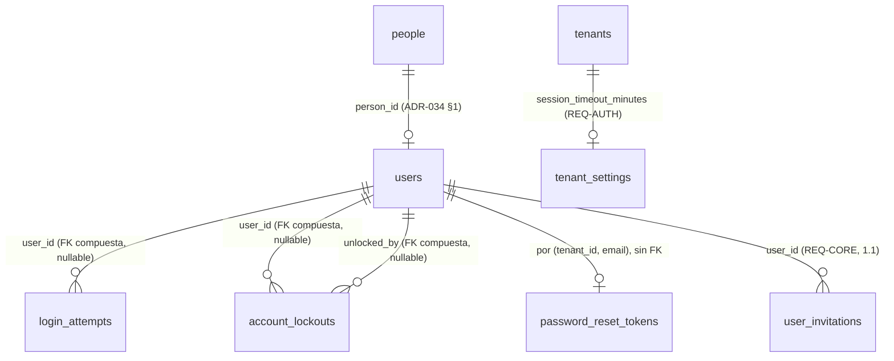
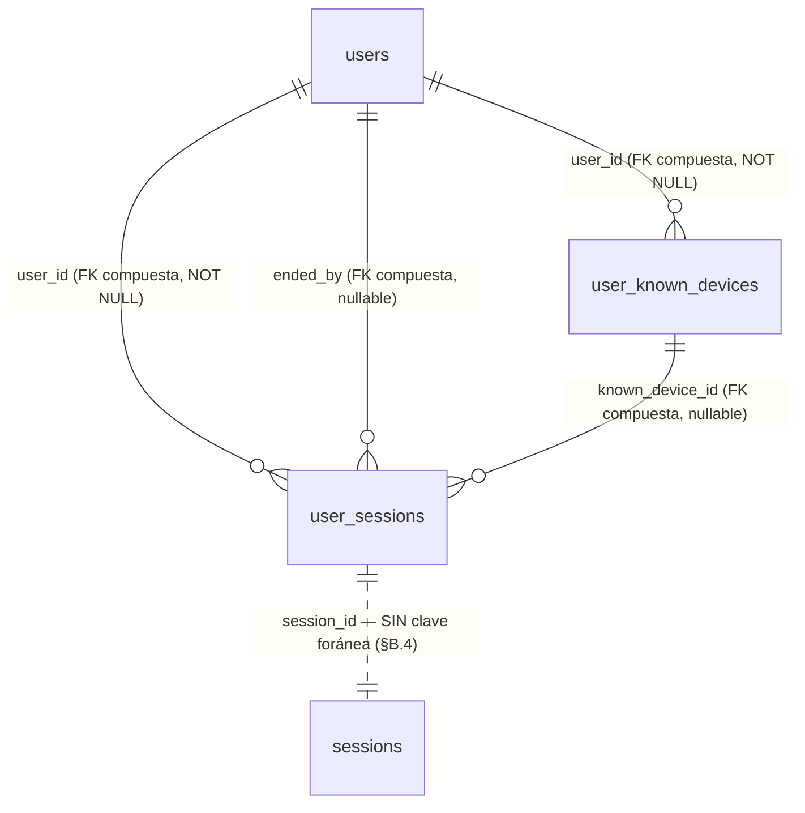

# REQ-AUTH · Modelo de datos

> **Estructura**: las secciones **§A.1 a §A.9** son el paso **1.2**, cerrado el 2026-08-25. La **Parte B** (`§B.1` en adelante) es el paso **1.2b** (`funcional.md` Parte B), **implementada y cerrada** el 2026-08-26 (PR [#91](https://github.com/pirexia/plataforma-educativa/pull/91)/[#92](https://github.com/pirexia/plataforma-educativa/pull/92)).

> Alcance: paso **1.2**. Cubre las **dos tablas nuevas** (§A.1, §A.2), la **modificación** de `password_reset_tokens` que exige el issue [#18](https://github.com/pirexia/plataforma-educativa/issues/18) (§A.3), la **columna nueva** de `tenant_settings` (§A.4) y lo que **no** se toca y por qué (§A.5).
>
> Convenciones de `ADR-029`: `TIMESTAMPTZ` siempre, `text` en vez de `varchar(n)`, `bigint` interno más `public_id` ULID **solo donde se expone en API o URL**. Toda tabla de tenant se crea con `App\Support\Tenancy\TenantMigration` (`ADR-033 §6`), que aporta `id`, `tenant_id` con `DEFAULT app.current_tenant_id()`, RLS `ENABLE`+`FORCE`, la política estándar y `UNIQUE (tenant_id, id)`.
>
> **Estado**: **aprobado** el 2026-08-22 (`funcional.md §14`). El rango 5-480 de `session_timeout_minutes` queda confirmado; la ampliación del `CHECK` de `audit_logs.event` **no** la hace este documento (`OPEN-AUTH-02`, la hace `ADR-039`).

---

## A.1 `login_attempts` — telemetría de intentos de acceso (`REQ-AUTH-001`)

Entidad `LoginAttempt`, nombrada explícitamente en la cabecera de la sección 5.2 del documento de requisitos.

Tabla de tenant **append-only** (`TenantMigration::tenantTableAppendOnly()`): sin `deleted_at` (el borrado lógico en una tabla append-only no significa nada), sin `created_by`/`updated_by` (el actor es el propio sujeto del intento) y con `REVOKE UPDATE, DELETE` para `plataforma_app` y `plataforma_platform`. Es la misma decisión que `audit_logs`, por el mismo motivo: un registro de seguridad que la aplicación puede editar no es un registro de seguridad.

| Columna | Tipo | Nulo | Descripción |
|---------|------|------|-------------|
| `id`, `tenant_id` | `bigint` | No | De `tenantTableAppendOnly()` |
| `email` | `text` | No | Correo **tal como se intentó**, normalizado (recortado y en minúsculas). Se guarda exista o no la cuenta: es lo que sostiene el bloqueo fantasma de `RN-AUTH-15` |
| `user_id` | `bigint` | Sí | FK compuesta `(tenant_id, user_id) → users`, declarada a mano por ser opcional (`tenantForeignId()` es `NOT NULL` siempre). `NULL` cuando el correo no corresponde a ninguna cuenta |
| `outcome` | `text` + `CHECK` | No | `exito`, `credenciales_invalidas`, `cuenta_bloqueada`, `estado_no_activo` |
| `attempted_at` | `TIMESTAMPTZ` | No | Momento del intento. Sustituye a `created_at`, igual que `audit_logs.occurred_at` |
| `ip_address` | `inet` | Sí | Tipo nativo, no `text` |
| `user_agent` | `text` | Sí | |
| `request_id` | `text` | Sí | `INV-013`, correlaciona con el log y con `audit_logs` |

**`login_attempts` vs. `audit_logs.event = 'login'`** (`ADR-039` §9 punto 4): son cosas distintas, no una redundancia. `login_attempts` registra **todo intento**, con éxito o sin él (`outcome`), y existe para sostener el bloqueo por intentos fallidos (`RN-AUTH-14`). `audit_logs` con `event = 'login'` registra solo **accesos consumados** (sesión creada de verdad), con `actor_type = 'user'` porque en ese punto ya hay un usuario autenticado. Un intento fallido nunca genera fila en `audit_logs`; un acceso consumado genera una fila en cada tabla. `request_id` es la columna que correlaciona ambas filas (junto con el log de aplicación) cuando hace falta reconstruir qué pasó en una petición concreta.

**Sin `public_id`.** En 1.2 esta tabla no se expone por ninguna API: no hay endpoint que devuelva un intento. `ADR-029` pide `public_id` en lo que se expone en URL o API, y añadirlo «por si acaso» es lo que `ADR-034 OPEN-13` desaconseja. Si 1.2b o `REQ-BO` construyen la pantalla de accesos, lo añaden entonces (es *expand* puro).

**Sin contraseña ni fragmento suyo**, en ninguna columna ni en ningún caso (`RN-AUTH-05`). No hay «primeros caracteres», ni longitud, ni hash de lo intentado: cualquiera de las tres cosas convierte esta tabla en material de ataque por diccionario si se filtra.

**Los cuatro `outcome` distinguen lo que hay que distinguir**: `credenciales_invalidas` es lo único que incrementa el contador de bloqueo; `estado_no_activo` (credencial correcta sobre usuario `pendiente`/`inactivo`) **no** lo incrementa (`RN-AUTH-24`), y separarlo permite además detectar el caso operativo real de «este profesor no sabe que está dado de baja»; `cuenta_bloqueada` mide la presión sobre una cuenta ya bloqueada, que es la señal de un ataque en curso.

**Política de auditoría**: **no auditable**. Registrarla en `audit_logs` duplicaría cada fila y, en un ataque de fuerza bruta, inundaría la tabla que `REQ-CORE-005` obliga a conservar dos años. Es el mismo criterio con el que `datos.md §A.5` de `REQ-CORE` dejó `idempotency_keys` fuera del *observer*, y está argumentado en `funcional.md §10.2`.

Índices:

| Índice | Consulta que lo necesita |
|--------|---------------------------|
| `(tenant_id, email, attempted_at DESC)` | Recuento de fallos consecutivos desde el último éxito, en **cada** login. Es la consulta caliente del módulo |
| `(tenant_id, attempted_at DESC)` | Purga por retención (§A.7) y pantalla de accesos recientes de 1.2b/1.6 |
| `(tenant_id, user_id, attempted_at DESC)` | «¿Qué accesos ha tenido esta cuenta?», que pedirá 1.2b |

---

## A.2 `account_lockouts` — bloqueo de cuenta (`REQ-AUTH-001`)

Tabla de tenant ordinaria (`TenantMigration::tenantTable()`), con `public_id` ULID porque **sí** se expone: `GET /account-lockouts` y `DELETE /account-lockouts/{public_id}`.

| Columna | Tipo | Nulo | Descripción |
|---------|------|------|-------------|
| `public_id` | ULID | No | `ADR-029` |
| `email` | `text` | No | Correo bloqueado, normalizado. **No** es FK a `users`: el bloqueo fantasma de `RN-AUTH-15` existe para correos sin cuenta |
| `user_id` | `bigint` | Sí | FK compuesta opcional `(tenant_id, user_id) → users`. `NULL` en el bloqueo fantasma |
| `failed_count` | `smallint` | No | Fallos consecutivos que provocaron el bloqueo. Normalmente 5; puede ser mayor si dos peticiones concurrentes cruzan el umbral |
| `locked_at` | `TIMESTAMPTZ` | No | |
| `unlock_token_hash` | `text` | Sí | Hash SHA-256 del token de desbloqueo. `NULL` en el bloqueo fantasma: sin cuenta no hay a quién enviarle el enlace |
| `unlock_token_expires_at` | `TIMESTAMPTZ` | Sí | 24 h por defecto (`RN-AUTH-13`) |
| `unlocked_at` | `TIMESTAMPTZ` | Sí | Informado al levantar el bloqueo, por correo o por administrador |
| `unlocked_by` | `bigint` | Sí | FK compuesta opcional → `users`. `NULL` si el desbloqueo fue por correo del propio titular; informado si fue un administrador |

Restricciones e índices:

- `UNIQUE (tenant_id, email) WHERE unlocked_at IS NULL AND deleted_at IS NULL` — **un solo bloqueo vivo** por correo y tenant (`RN-AUTH-17`), garantizado por índice y no por comprobación de aplicación: dos peticiones que crucen el umbral a la vez lo romperían. Mismo patrón que `user_invitations` en 1.1.
- `UNIQUE (tenant_id, unlock_token_hash)` — total, no parcial: un token de desbloqueo no se reutiliza jamás, igual que un `public_id` (`ADR-034 §6`).
- `CHECK (unlocked_by IS NULL OR unlocked_at IS NOT NULL)` — no se puede registrar quién desbloqueó sin registrar que se desbloqueó.
- Índice `(tenant_id, locked_at DESC)` para el listado de `GET /account-lockouts`.
- Índice `(tenant_id, unlock_token_expires_at)` para la purga de tokens vencidos.

**La fila se conserva tras el desbloqueo** (`RN-AUTH-18`), con `unlocked_at` informado. Es traza: saber que una cuenta estuvo bloqueada tres veces en una semana es una señal de seguridad que se pierde si el desbloqueo borra la fila. El índice único parcial hace que una fila desbloqueada no estorbe a un bloqueo posterior del mismo correo.

**Sin `academic_year_id`**: un bloqueo de cuenta no pertenece a un curso académico (`ADR-034 §4`: o `NOT NULL` o la columna no existe).

**Política de auditoría**: `Selective`.

- Registrados con valor: `failed_count`, `locked_at`, `unlocked_at`, `unlocked_by`, `deleted_at`, `created_by`, `updated_by`.
- `email` se redacta como `identifier`: es un dato personal directo, mismo criterio que `ADR-035` aplicó a `users.email`.
- `unlock_token_hash` lo redacta como `secret` **automáticamente** el patrón `*token*` de `config('audit.secret_attribute_patterns')`, sin declararlo.

Esta política es la que hace que **bloqueo y desbloqueo queden auditados sin ampliar nada**: la creación de la fila es un evento `created` y el desbloqueo un `updated`, ambos del *observer* de 0.9 (`funcional.md §10.1`).

---

## A.3 `password_reset_tokens` — modificación (issue [#18](https://github.com/pirexia/plataforma-educativa/issues/18))

La tabla existe desde 0.8 con `tenant_id`, clave primaria compuesta `(tenant_id, email)`, RLS `ENABLE`+`FORCE` y política de aislamiento. **No es una tabla de `tenantTable()`**: se creó a mano precisamente porque su clave primaria no es `id`.

Estado actual:

| Columna | Tipo | Nulo |
|---------|------|------|
| `tenant_id` | `bigint` | No |
| `email` | `text` | No |
| `token` | `text` | No |
| `created_at` | `TIMESTAMPTZ` | Sí |

### Por qué hay que tocarla

El flujo de §4.5 de `funcional.md` busca **solo por token**, para no meter el correo en el enlace. La columna `token` guarda el hash **bcrypt** que escribe el `DatabaseTokenRepository` de Laravel, y un hash bcrypt no se puede buscar por igualdad: lleva sal aleatoria por diseño. Hace falta una columna consultable.

### Cambio propuesto, en dos entregas (expand/contract, `CLAUDE.md §9`)

**Entrega 1 — *expand*, en 1.2:**

| Columna | Tipo | Nulo | Descripción |
|---------|------|------|-------------|
| `token_hash` | `text` | Sí *(ver abajo)* | **SHA-256** del token en claro. Consultable por igualdad |
| `expires_at` | `TIMESTAMPTZ` | Sí *(ver abajo)* | Caducidad explícita, 60 min por defecto |

Más: `ALTER COLUMN token DROP NOT NULL`, y `CREATE UNIQUE INDEX password_reset_tokens_tenant_token_hash_unique ON password_reset_tokens (tenant_id, token_hash)`.

**Entrega 2 — *contract*, dos versiones después:** `DROP COLUMN token`, y `token_hash`/`expires_at` pasan a `NOT NULL`.

Las dos columnas nuevas nacen **nullable** aunque la aplicación las escriba siempre. Es la disciplina de expand/contract y no una concesión: una columna `NOT NULL` sin valor por defecto en una tabla que la versión anterior sigue escribiendo rompe el despliegue sin interrupción. Que hoy la tabla esté vacía —nunca ha existido un flujo de recuperación que escriba en ella— hace la migración trivial, pero no es motivo para saltarse el patrón: el precedente que se sienta aquí lo copiarán los 51 módulos restantes.

**SHA-256 y no bcrypt**, deliberadamente, y merece el argumento porque parece un debilitamiento y no lo es: bcrypt existe para resistir el ataque por diccionario contra un secreto **elegido por una persona** y de baja entropía. Este token son 32 bytes de un generador criptográfico: 256 bits de entropía real, imposible de atacar por diccionario. Lo que se necesita aquí es un resumen de longitud fija, rápido y **consultable por igualdad**, y SHA-256 lo es. Es exactamente el mismo criterio con el que 1.1 hashea el token de invitación (`IssueUserInvitation`, `hash('sha256', $rawToken)`), y ser coherente con él importa más que la elección concreta.

### Invariantes que se mantienen

- **Clave primaria `(tenant_id, email)` intacta**: garantiza por construcción que hay **como mucho un token vivo por correo y tenant** (`RN-AUTH-11`). Solicitar otro sustituye al anterior con un `UPDATE`/`INSERT ... ON CONFLICT`, sin comprobación de aplicación que alguien pueda olvidar.
- **Un solo uso por desaparición de la fila**: al consumirse, se borra. No hay bandera `used_at` que alguien pueda dejar de comprobar en una consulta futura.
- **Sin `public_id`**: no se expone nunca por API.
- **No auditable por el *observer***: no es un `TenantModel` (su clave primaria no es `id`). Lo que se audita son sus **efectos** sobre `User` (`updated` con `password` redactado como `secret`), y —si se aprueba `OPEN-AUTH-02`— la solicitud como `password_reset_requested`.

---

## A.4 `tenant_settings` — columna nueva (`REQ-AUTH-005` punto 1)

*Expand* puro sobre la tabla de 1.1, anticipado por `REQ-CORE/funcional.md §1.4`.

| Columna | Tipo | Nulo | Defecto | Descripción |
|---------|------|------|---------|-------------|
| `session_timeout_minutes` | `integer` | No | `30` | Minutos de **inactividad** tras los que la sesión expira (`REQ-AUTH-005`) |

- `CHECK (session_timeout_minutes BETWEEN 5 AND 480)`. El rango está pendiente de confirmación en `OPEN-AUTH-06`.
- `NOT NULL DEFAULT 30` es seguro en expand: la versión anterior no conoce la columna y el valor por defecto la rellena para las filas existentes en la misma sentencia.
- Se **añade a la lista de atributos registrados** de la política `Selective` de `TenantSettings`: es una decisión de seguridad del centro y su cambio debe verse en el registro de auditoría con su valor anterior y posterior, no redactado.
- Invalida la caché `tenant:{id}:settings` en la escritura, como cualquier otro campo de la tabla (`RN-CORE-17`).

---

## A.5 Lo que 1.2 **no** toca

| Tabla | Por qué no |
|-------|------------|
| `sessions` | **No se añade `tenant_id` ni RLS.** Es de 1.2b (`funcional.md §1.5`, `OPEN-AUTH-10`). Sigue en `config/tenancy.php` → `shared_tables.framework`. Lo que 1.2 sí hace es guardar el `tenant_id` en el **payload** de la sesión y reverificarlo en cada petición (`RN-AUTH-31`) |
| `users` | Ninguna columna nueva. El bloqueo **no** es una bandera en `users`: si lo fuera, no podría existir para correos sin cuenta y el oráculo de enumeración de `funcional.md §4.4` volvería |
| `users.remember_token` | Se queda como está, sin uso. `OPEN-AUTH-09`: no se implementa «recordarme» y retirar la columna sería una migración destructiva por un beneficio nulo |
| `user_invitations` | Ninguna columna nueva. El canje escribe `accepted_at`, que ya existe desde 1.1 y que 1.1 documentó como *«lo escribe el canje, paso 1.2»* |
| `audit_logs` | Ninguna columna nueva. La ampliación del `CHECK` de `event` está condicionada a `OPEN-AUTH-02` y, si se aprueba, la hace su ADR, no esta especificación |
| **Ninguna tabla de proveedor de identidad** | `identity_providers`, `mfa_factors` y cualquier columna de proveedor externo son 1.3 y 1.4. `ADR-034 OPEN-13`: no se adelanta ninguna columna «por si acaso» |

---

## A.6 Relaciones



Todas las claves foráneas son **compuestas** `(tenant_id, columna) REFERENCES tabla (tenant_id, id)` (`ADR-033 §6`). Las tres de este módulo son **opcionales**, así que se declaran a mano y no con `TenantMigration::tenantForeignId()`, que es `NOT NULL` siempre por decisión de `ADR-034 §4`.

`password_reset_tokens` **no tiene clave foránea a `users`**, y es deliberado: su clave es `(tenant_id, email)`, no `user_id`. Añadir la FK obligaría a resolver el usuario antes de escribir el token y a decidir qué pasa si el correo cambia — cosas que ya resuelven `RN-AUTH-11` y el consumo del evento `UserEmailChanged` (`funcional.md §8.2`), sin acoplar el esquema.

`sessions` no aparece en el diagrama: sigue fuera del sistema de tenancy (§A.5).

---

## A.7 Índices y la consulta que los justifica

| Índice | Consulta |
|--------|----------|
| `login_attempts (tenant_id, email, attempted_at DESC)` | Fallos consecutivos desde el último éxito, en cada intento de login. Es la consulta caliente: se ejecuta antes de verificar ninguna contraseña |
| `login_attempts (tenant_id, attempted_at DESC)` | Purga por retención de 90 días; accesos recientes del centro (1.2b/1.6) |
| `login_attempts (tenant_id, user_id, attempted_at DESC)` | Historial de accesos de una cuenta concreta (1.2b) |
| `account_lockouts (tenant_id, email)` único parcial | Comprobación de bloqueo vivo, en **cada** login, antes de verificar la contraseña. Y la invariante de `RN-AUTH-17` |
| `account_lockouts (tenant_id, unlock_token_hash)` único | Canje del token de desbloqueo: búsqueda exacta por tenant más hash |
| `account_lockouts (tenant_id, locked_at DESC)` | Listado de `GET /account-lockouts`, orden cronológico inverso |
| `account_lockouts (tenant_id, unlock_token_expires_at)` | Purga de tokens de desbloqueo vencidos |
| `password_reset_tokens (tenant_id, token_hash)` único | Restablecimiento: búsqueda **solo por token**, sin correo en la URL (§A.3) |
| `password_reset_tokens (tenant_id, email)` PK | Sustitución del token vivo (`RN-AUTH-11`) y purga por correo al cambiarlo |

**Sin índice sobre `password_reset_tokens.expires_at`**: la tabla tiene, como mucho, una fila por usuario que haya pedido recuperación en la última hora. Un recorrido completo para la purga es más barato que mantener el índice. Se añadirá cuando una medición lo pida, no por anticipación.

**Sin índice nuevo sobre `users`**: la búsqueda de login es por `(tenant_id, email)`, que ya sirve el índice único parcial `users_tenant_email_unique` creado en 0.8.

---

## A.8 Checklist obligatorio

- [x] `tenant_id` presente e indexado como primera columna de las consultas frecuentes — vía `tenantTable()`/`tenantTableAppendOnly()` en las dos tablas nuevas; ya presente en `password_reset_tokens` desde 0.8
- [x] `academic_year_id` — **no aplica** en ninguna: ni un intento de acceso, ni un bloqueo, ni un token de recuperación pertenecen a un curso académico. Por `ADR-034 §4`, la columna no existe (nunca nullable)
- [x] `created_at`/`updated_at`/`deleted_at`/`created_by`/`updated_by` — `account_lockouts` los lleva todos vía `tenantTable()`. `login_attempts` es la excepción deliberada: append-only por `tenantTableAppendOnly()`, con `attempted_at` en lugar de `created_at` y sin autoría de fila (el actor **es** el sujeto). `password_reset_tokens` conserva su forma de 0.8
- [x] Claves foráneas y restricciones declaradas en base de datos — FK compuestas opcionales, `CHECK` de `outcome` y de `session_timeout_minutes`, `CHECK` de coherencia de `unlocked_by`, índices únicos parciales
- [x] Importes en enteros de céntimos — **no aplica**, sin importes
- [x] Fechas en UTC (`TIMESTAMPTZ`) — todas
- [x] Datos de categoría especial en tabla separada y cifrada — **no aplica**: este módulo no trata salud, NEAE ni convivencia (`permisos.md §6`). Sí trata **credenciales**, que van hasheadas y nunca en claro (`RN-AUTH-03`), y **direcciones IP**, que son dato personal y tienen retención acotada (§A.9)
- [x] Particionado evaluado — **`login_attempts` es la única candidata**: es la tabla de mayor crecimiento del módulo y un ataque de fuerza bruta la infla en minutos. Se difiere a propósito con **disparador de revisión escrito**: si supera los 20 millones de filas o si la purga diaria excede su ventana, se convierte a particiones mensuales por rango sobre `attempted_at`, con ADR propio — mismo criterio que `ADR-034 §3` fijó para `audit_logs`. Las otras dos son de bajo crecimiento (una fila por bloqueo, una por solicitud de recuperación viva)
- [x] Toda restricción de unicidad sobre tabla con borrado lógico es **parcial** (`WHERE deleted_at IS NULL`) — cierto en `account_lockouts (tenant_id, email)`. `(tenant_id, unlock_token_hash)` y `(tenant_id, token_hash)` son **totales** a propósito: un token no se reutiliza jamás
- [x] Migraciones aditivas y compatibles con la versión anterior — las dos tablas son nuevas; los dos `ALTER` son *expand* con su *contract* planificado (§A.3, §A.4)

---

## A.9 Retención y supresión

| Tabla | Plazo | Base y mecanismo |
|-------|-------|------------------|
| `login_attempts` | **90 días** | Contiene correo e IP: dato personal tratado por **interés legítimo en la seguridad del tratamiento** (art. 32 RGPD, `RSEC-OWASP-009`). Noventa días es el plazo que permite investigar un incidente detectado tarde sin conservar un mapa indefinido de los horarios de trabajo de la plantilla. `PurgeLoginAttempts` borra físicamente **con el rol propietario**, porque `tenantTableAppendOnly()` revoca `DELETE` a los dos roles de aplicación — igual que la purga de `audit_logs` de `REQ-PRIV-006` |
| `account_lockouts` | **Fila permanente; token a las 24 h** | La traza de que una cuenta estuvo bloqueada es información de seguridad y se conserva. `PurgeUnlockTokens` pone a `NULL` el `unlock_token_hash` y su caducidad cuando vencen, para no acumular material de token sin uso. La fila se elimina con la persona en el flujo de supresión de `ADR-004` |
| `password_reset_tokens` | **1 hora** (la caducidad del token) | Artefacto transitorio. Se borra al consumirse; `PurgeExpiredPasswordResetTokens` retira los vencidos a diario. No se conserva traza de que se pidió recuperación: eso lo registra la auditoría, no esta tabla |
| `tenant_settings.session_timeout_minutes` | Vida del tenant | Configuración de la organización, no dato personal |

**Derecho de supresión** (`ADR-004`, `REQ-PRIV-006`): la anonimización de una persona (nivel 2) afecta a `people`/`users`. Sobre estas tablas el efecto hay que mirarlo de frente, porque **dos de ellas guardan una copia desnormalizada del correo**, que es precisamente el patrón que `ADR-034 §3` evitó en `audit_logs`:

- `login_attempts.email` y `account_lockouts.email` **no** se resuelven por FK. Es inevitable: existen para correos que no corresponden a ninguna cuenta (`RN-AUTH-15`), así que no hay entidad a la que apuntar.
- La consecuencia es que anonimizar a una persona **no** borra su correo de estas dos tablas. Se compensa con la retención: `login_attempts` desaparece sola en 90 días, y la supresión de `account_lockouts` entra en el flujo de supresión de la persona como borrado de fila, no como anonimización de columna.
- Es la misma solución que `ADR-035` dio para `audit_logs.changes`: **la supresión no se ejerce editando la fila, se ejerce por retención**. Se anota aquí explícitamente para que `REQ-PRIV-006` la encuentre escrita y no la descubra.

---
---

# Parte B · Paso 1.2b · Modelo de datos

> Alcance: paso **1.2b** (`funcional.md` Parte B). Cubre **dos tablas de tenant nuevas** (§B.1, §B.2), lo que **no** se toca y por qué (§B.3), y la consecuencia de todo ello sobre retención y supresión (§B.7).
>
> Mismas convenciones de `ADR-029` y `ADR-033 §6` que la Parte A: `TIMESTAMPTZ`, `text`, `bigint` interno más `public_id` ULID **solo donde se expone en API o URL**, y creación por `App\Support\Tenancy\TenantMigration`.
>
> **Estado**: implementada, aprobada el 2026-08-25 (`funcional.md §B.14`), cerrada el 2026-08-26.

---

## B.1 `user_known_devices` — dispositivos reconocidos de una cuenta (`REQ-AUTH-005` punto 4)

Entidad `UserKnownDevice`. Tabla de tenant ordinaria (`TenantMigration::tenantTable()`).

**Se crea antes que `user_sessions`**, porque esa la referencia por clave foránea.

| Columna | Tipo | Nulo | Descripción |
|---------|------|------|-------------|
| `id`, `tenant_id` | `bigint` | No | De `tenantTable()` |
| `user_id` | `bigint` | No | `tenantForeignId()`: FK compuesta `(tenant_id, user_id) → users`, **obligatoria**. Un dispositivo sin cuenta no significa nada |
| `device_token_hash` | `text` | No | **SHA-256** del valor de la cookie `pge_device`. El valor en claro **no está en base de datos** (`RN-AUTH-45`, hereda `RN-AUTH-09`) |
| `first_seen_at` | `TIMESTAMPTZ` | No | Primer acceso desde este dispositivo |
| `last_seen_at` | `TIMESTAMPTZ` | No | Último. Se actualiza en cada login desde él |
| `login_count` | `integer` | No | Accesos desde este dispositivo. Por defecto `1` |
| `label` | `text` | Sí | Descripción legible del primer avistamiento («Chrome · Windows · escritorio»). Solo para mostrar |
| `last_ip_address` | `inet` | Sí | Tipo nativo, no `text`, igual que `login_attempts.ip_address` |
| `alerted_at` | `TIMESTAMPTZ` | Sí | Cuándo se avisó al titular. `NULL` si el tope diario de `RN-AUTH-46` impidió el aviso — y esa distinción importa: un dispositivo registrado sin avisar es exactamente lo que hay que poder auditar después |

**Sin `public_id`.** Ningún endpoint de 1.2b devuelve un dispositivo: el panel lista **sesiones**, y la descripción del dispositivo viaja dentro de la sesión, no como recurso propio. `ADR-029` pide `public_id` en lo que se expone en URL o API, y `ADR-034 OPEN-13` desaconseja añadirlo «por si acaso». Es el mismo criterio con el que §A.1 lo negó a `login_attempts`. Si 1.3 construye «dispositivos de confianza» como recurso propio, lo añade entonces: es *expand* puro.

**Sin `academic_year_id`**: un dispositivo no pertenece a un curso académico (`ADR-034 §4`: o `NOT NULL` o la columna no existe).

Restricciones e índices:

- `UNIQUE (tenant_id, user_id, device_token_hash) WHERE deleted_at IS NULL` — **parcial**, no total, y a propósito. La regla general de §A.8 es que toda unicidad sobre tabla con borrado lógico es parcial; la excepción que §A.2 hizo para los hashes de token no aplica aquí, porque un dispositivo **sí puede volver**: si un día se decide «olvidar» un dispositivo y la misma cookie reaparece, tiene que poder registrarse otra vez —y disparar su aviso, que es lo correcto— en vez de chocar contra un índice.
- `CHECK (login_count >= 1)`.
- Índice `(tenant_id, user_id, last_seen_at DESC)` — «¿qué dispositivos tiene esta cuenta?», y el camino de la purga por usuario.
- Índice `(tenant_id, last_seen_at)` — purga por antigüedad (§B.7).

**La consulta caliente es la del índice único**: en **cada** login con cookie presente se busca por `(tenant_id, user_id, device_token_hash)`. El índice único parcial la sirve entera; no hace falta otro.

**Política de auditoría**: `Selective`.

- Registrados con valor: `first_seen_at`, `last_seen_at`, `login_count`, `alerted_at`, `label`, `deleted_at`, `created_by`, `updated_by`.
- `device_token_hash` lo redacta como `secret` **automáticamente** el patrón `*token*` de `config('audit.secret_attribute_patterns')`, sin declararlo. Es el motivo real de que la columna se llame así y no `device_id`: el nombre es lo que dispara la defensa en profundidad.
- `last_ip_address` se redacta como `identifier`: es dato personal directo, mismo criterio que `account_lockouts.email` (§A.2) y que `users.email` en `ADR-035`.

Con eso, **el alta de un dispositivo y el aviso al titular quedan auditados sin una sola llamada manual** (`funcional.md §B.10`): el alta es un `created` y el aviso un `updated`, los dos del *observer* de 0.9.

---

## B.2 `user_sessions` — sesiones de usuario con metadatos (`REQ-AUTH-005` puntos 2 y 3)

Entidad `UserSession`. Tabla de tenant ordinaria (`TenantMigration::tenantTable()`), con `public_id` ULID porque **sí** se expone: `GET /auth/sessions` y `DELETE /auth/sessions/{public_id}`.

Es la tabla del módulo, **complementaria** de la `sessions` del framework y deliberadamente separada de ella. El argumento entero está en `funcional.md §B.2.2` y no se repite; el resumen es que el identificador de sesión es una credencial portadora y el `public_id` es su nombre público, y las dos cosas no van en la misma fila.

| Columna | Tipo | Nulo | Descripción |
|---------|------|------|-------------|
| `id`, `tenant_id` | `bigint` | No | De `tenantTable()` |
| `public_id` | ULID | No | `ADR-029`. **El único identificador que sale por la API** (`RN-AUTH-40`) |
| `user_id` | `bigint` | No | `tenantForeignId()`, obligatoria. Una sesión anónima **no tiene fila aquí** (`funcional.md §B.4.1`) |
| `session_id` | `text` | No | Identificador de sesión del framework, **posterior** a la regeneración de `RN-AUTH-32`. Sin FK (§B.4) |
| `started_at` | `TIMESTAMPTZ` | No | Momento del login que la creó |
| `ip_address` | `inet` | Sí | IP de origen del login. Tipo nativo |
| `user_agent` | `text` | Sí | Cabecera cruda, **truncada a 1024 caracteres**. Sin truncado, una cabecera hostil de 64 KB entra tal cual en una tabla de tenant |
| `client_browser` | `text` | Sí | Derivado del `User-Agent`. Solo para mostrar (`funcional.md §B.6.4`) |
| `client_platform` | `text` | Sí | Ídem |
| `client_device_type` | `text` + `CHECK` | Sí | `escritorio`, `movil`, `tableta`, `bot`, `desconocido` |
| `location_label` | `text` | Sí | **Siempre `NULL` en 1.2b** (`RN-AUTH-47`, `OPEN-AUTH-13`). El hueco del requisito, escrito en el esquema para que se vea que está a medias |
| `known_device_id` | `bigint` | Sí | FK compuesta **opcional** `(tenant_id, known_device_id) → user_known_devices`, declarada a mano. `NULL` cuando el navegador no admitió la cookie |
| `ended_at` | `TIMESTAMPTZ` | Sí | Momento en que dejó de estar viva |
| `end_reason` | `text` + `CHECK` | Sí | Las **siete** razones de `funcional.md §B.4.6` |
| `ended_by` | `bigint` | Sí | FK compuesta opcional → `users`. Quién la cerró; `NULL` en los cierres automáticos |

**Sin `academic_year_id`**, por el mismo motivo que las tres tablas de la Parte A.

**Sin columna de última actividad.** Es la decisión de rendimiento del paso y merece el argumento: sería lo evidente —el panel muestra «última actividad»— y sería un `UPDATE` **en cada petición autenticada del sistema**. `sessions.last_activity` ya guarda ese dato, lo mantiene el framework sin coste añadido, y el listado (`api.md §B.2`) lo lee de allí uniendo por `session_id`. Duplicarlo aquí compraría una columna a cambio de convertir cada lectura de cualquier endpoint del producto en una escritura.

Restricciones e índices:

| Restricción / índice | Qué garantiza o qué consulta sirve |
|----------------------|------------------------------------|
| `UNIQUE (tenant_id, session_id) WHERE ended_at IS NULL AND deleted_at IS NULL` | **Una sola fila viva por sesión** (`RN-AUTH-39`), por índice y no por comprobación de aplicación. Mismo patrón que `account_lockouts` en §A.2 |
| `UNIQUE (public_id)` | `ADR-029`, igual que `account_lockouts` |
| `CHECK ((ended_at IS NULL) = (end_reason IS NULL))` | No hay cierre sin razón ni razón sin cierre (`RN-AUTH-44`). Es más fuerte que el `CHECK` equivalente de `account_lockouts`, que solo cubre una dirección — y esa asimetría fue precisamente lo que dejó pasar la ausencia de `unlock_reason` hasta la implementación |
| `CHECK (ended_by IS NULL OR ended_at IS NOT NULL)` | No se registra quién cerró sin registrar que se cerró |
| `CHECK (end_reason IN ('logout', 'revocada_usuario', 'inactividad', 'caducidad', 'cambio_credencial', 'baja_usuario', 'tenant_incoherente'))` | Siete valores, **cada uno con un productor real** (`funcional.md §B.4.6`). Ni uno de más: el issue [#61](https://github.com/pirexia/plataforma-educativa/issues/61) es lo que pasa cuando se reutiliza un valor por no tener el correcto |
| `CHECK (client_device_type IN ('escritorio', 'movil', 'tableta', 'bot', 'desconocido'))` | |
| `(tenant_id, user_id, started_at DESC) WHERE ended_at IS NULL AND deleted_at IS NULL` | **La consulta del panel** (`GET /auth/sessions`). Es la única caliente de esta tabla |
| `(tenant_id, ended_at)` | Purga por retención (§B.7) y la tarea `CloseOrphanedUserSessions` |
| `(tenant_id, known_device_id)` | Integridad referencial y «¿qué sesiones vinieron de este dispositivo?» |

**Política de auditoría**: `Selective`, y aquí hay que ser explícito porque un descuido es una fuga.

- Registrados con valor: `started_at`, `ended_at`, `end_reason`, `ended_by`, `deleted_at`, `created_by`, `updated_by`.
- **`session_id` se declara en `auditSecretAttributes`, explícitamente.** No encaja en ningún patrón de `config('audit.secret_attribute_patterns')` —no contiene `token`, ni `password`, ni `secret`—, así que la defensa automática **no lo cubre**. Y es la credencial portadora de la sesión. Sin esa declaración, cada cierre de sesión escribiría el identificador de sesión en una tabla *append-only* con **dos años** de retención y exportable a CSV por `REQ-CORE-005`. Es el punto de este documento que la revisión de seguridad debe comprobar línea a línea.
- `ip_address` y `user_agent` se redactan como `identifier`: son datos personales, y en el caso del `User-Agent` también un vector de huella.
- `location_label` se redactaría como `identifier` el día que deje de ser `NULL`. Se declara desde ya para no depender de que alguien se acuerde al resolver `OPEN-AUTH-13`.

**Sobre el evento `created`**: `UserSession` declara `auditExcludedEvents(): ['created']` (`ADR-040 §4.1`/`§4.3`) — el nacimiento de la fila, siempre dentro de la transacción del login (`§B.4.1`), ya lo registra el evento `login` sobre `User` (`ADR-039`). No cambia nada de este esquema: la exclusión vive en el modelo, no en la tabla ni en su política de redacción.

---

## B.3 Lo que 1.2b **no** toca

| Tabla | Por qué no |
|-------|------------|
| **`sessions`** | **Ni una columna.** Ni `tenant_id`, ni RLS, ni `public_id`, ni metadatos. Sigue en `config/tenancy.php → shared_tables.framework`. Argumento entero en `funcional.md §B.2.2`; la decisión sobre `OPEN-AUTH-10` se replantea en `OPEN-AUTH-15` y **no la toma esta especificación** |
| `users` | Ninguna columna nueva. `remember_token` sigue sin uso (`OPEN-AUTH-09`), y 1.2b no lo cambia: la cookie `pge_device` **no es** «recordarme» — no autentica a nadie, no crea sesión y no alarga ninguna |
| `login_attempts` | Ninguna columna nueva, **y sigue sin `public_id`**. §A.1 lo condicionó a que 1.2b o `REQ-BO` construyeran la pantalla de accesos; 1.2b **no la construye** (`funcional.md §B.1.2`), así que la columna no entra |
| `account_lockouts`, `password_reset_tokens` | Sin cambios |
| `tenant_settings` | **Ninguna columna nueva.** 1.2b no añade ninguna configuración por centro: el tope de alertas y las retenciones son de plataforma (variables de entorno, `operacion.md §B.2`), no decisiones del centro. Si algún día un centro quiere desactivar la alerta de dispositivo nuevo, eso es un requisito nuevo y su sitio es `REQ-COM` |
| `audit_logs` | **Ninguna columna y ningún valor nuevo de `event`.** `funcional.md §B.10`: los dos hechos que hay que registrar son CRUD sobre entidades reales, que es justo lo que `ADR-039 §5.3` pide demostrar antes de ampliar nada |
| **Ninguna tabla de MFA ni de proveedor de identidad** | 1.3 y 1.4. `ADR-034 OPEN-13`: ni una columna «por si acaso», tampoco un `is_trusted` en `user_known_devices` pensando en el segundo factor |

---

## B.4 Relaciones



Todas las claves foráneas son **compuestas** `(tenant_id, columna) REFERENCES tabla (tenant_id, id)` (`ADR-033 §6`). Las dos obligatorias (`user_id`) usan `TenantMigration::tenantForeignId()`; las dos opcionales (`ended_by`, `known_device_id`) se declaran a mano, porque ese helper es `NOT NULL` siempre por decisión de `ADR-034 §4`.

**`user_sessions.session_id` no tiene clave foránea a `sessions`, y no puede tenerla.** Tres motivos independientes, cualquiera de ellos suficiente:

1. `sessions` está fuera del sistema de tenancy: su clave primaria es `id` a secas, sin `(tenant_id, id)`, así que no hay nada a lo que apuntar con una FK compuesta.
2. **El orden de escritura lo impide.** La fila de `user_sessions` se crea dentro de la transacción del login; la de `sessions` la escribe el `StartSession` del framework **al terminar la petición**. Una FK fallaría en cada login.
3. La fila de `sessions` la borra el recolector del framework por su cuenta. Una FK obligaría a elegir entre `ON DELETE CASCADE` —que borraría la traza justo cuando interesa conservarla— o `RESTRICT`, que rompería el recolector.

La consecuencia es la desincronización posible en una sola dirección, y su tratamiento está en `funcional.md §B.4.7`: cierre perezoso en el listado más una tarea programada. Es exactamente el mismo patrón —y el mismo motivo— que el cierre perezoso de los bloqueos vencidos de §4.4.

---

## B.5 Checklist obligatorio

- [x] `tenant_id` presente e indexado como primera columna de las consultas frecuentes — vía `tenantTable()` en las dos tablas nuevas, con RLS `ENABLE`+`FORCE` y política estándar
- [x] `academic_year_id` — **no aplica** en ninguna: ni una sesión ni un dispositivo pertenecen a un curso académico. Por `ADR-034 §4`, la columna no existe
- [x] `created_at`/`updated_at`/`deleted_at`/`created_by`/`updated_by` — las dos los llevan vía `tenantTable()`. **Ninguna es append-only**: las dos se actualizan por diseño (cierre de sesión, último avistamiento del dispositivo), así que `tenantTableAppendOnly()` no aplica
- [x] Claves foráneas y restricciones declaradas en base de datos — cuatro FK compuestas, cinco `CHECK`, dos índices únicos parciales
- [x] Importes en enteros de céntimos — **no aplica**
- [x] Fechas en UTC (`TIMESTAMPTZ`) — todas
- [x] Datos de categoría especial en tabla separada y cifrada — **no aplica**: este módulo no trata salud, NEAE ni convivencia (`permisos.md §6`). Sí trata **direcciones IP, cabeceras de cliente y un identificador persistente de navegador**, que son datos personales con retención acotada (§B.7) y con redacción en auditoría (§B.1, §B.2)
- [x] Particionado evaluado — **ninguna de las dos es candidata**. `user_sessions` tiene una fila por login **viva mientras la sesión lo esté**, y la purga la mantiene acotada; `user_known_devices` tiene una fila por dispositivo y usuario, del orden de unidades por persona. El disparador de revisión escrito de §A.8 sigue siendo `login_attempts`, no estas. **El crecimiento que sí hay que vigilar por culpa de este paso está en `audit_logs`**, y es `OPEN-AUTH-16`
- [x] Toda restricción de unicidad sobre tabla con borrado lógico es **parcial** — cierto en las dos, incluida la de `device_token_hash`, que **no** toma la excepción de §A.2 (§B.1)
- [x] Migraciones aditivas y compatibles con la versión anterior — §B.6

---

## B.6 Migraciones: por qué aquí no hay fase de contracción

Dos tablas nuevas y nada más. **Es *expand* puro, y el ciclo termina ahí** — igual que `ADR-039 §4.6` argumentó para su `CHECK`, y por el mismo motivo: expand/contract describe el ciclo completo de un cambio **destructivo**, y aquí no se retira, renombra ni deja de usar nada.

Concretamente, y en este orden:

1. `create_user_known_devices_table` — primera, porque la siguiente la referencia.
2. `create_user_sessions_table` — con las cuatro FK compuestas, los dos índices únicos parciales y los cinco `CHECK`.

Propiedades que hay que poder afirmar en la revisión (`db-reviewer`):

- **La versión anterior de la aplicación sigue funcionando contra el esquema nuevo**: no conoce las dos tablas y no las escribe. Login, logout, restablecimiento y cambio de contraseña siguen operando exactamente igual, solo que sin dejar rastro en ellas.
- **La versión nueva contra el esquema antiguo no se da**: la migración precede al despliegue, que es el orden normal (`operacion.md §B.6`).
- **La reversión es limpia**: `down()` elimina dos tablas que nada más referencia. A diferencia de la migración de `ADR-039`, esta sí se puede revertir de verdad; se pierde el historial de sesiones y dispositivos, que es información de seguridad y no de negocio.
- **Ninguna migración de 1.2b toca una tabla existente**, así que ninguna puede romper a nadie por bloqueo de escritura durante el despliegue.

---

## B.7 Retención y supresión

| Tabla | Plazo | Base y mecanismo |
|-------|-------|------------------|
| `user_sessions` | **Vive mientras la sesión viva; 90 días desde el cierre** | Contiene IP y `User-Agent`: dato personal tratado por **interés legítimo en la seguridad del tratamiento** (art. 32 RGPD, `RSEC-OWASP-009`). Noventa días es el mismo plazo de `login_attempts` (§A.9) **y por el mismo argumento**: permite investigar un incidente detectado tarde sin conservar un mapa indefinido de cuándo y desde dónde trabaja cada persona del centro. `PurgeUserSessions` borra físicamente las filas con `ended_at` anterior al plazo |
| `user_known_devices` | **12 meses sin uso** | Un dispositivo que lleva un año sin aparecer ya no sirve para reconocer nada: su cookie caducó (365 días, `RN-AUTH-45`) y volverá a presentarse como nuevo de todos modos. Conservarlo más tiempo es guardar un identificador de navegador sin finalidad, que es lo que el principio de minimización prohíbe. `PurgeUserKnownDevices` borra las filas con `last_seen_at` anterior al plazo |

Las dos son tablas de tenant ordinarias, así que la purga la ejecuta el **rol de aplicación** sin ceremonia: a diferencia de `PurgeLoginAttempts` (§A.9), aquí no hay `REVOKE DELETE` que sortear, porque ninguna de las dos es *append-only*.

**Derecho de supresión (`ADR-004`, `REQ-PRIV-006`): estas dos tablas son el caso fácil, y conviene decir por qué lo son.**

§A.9 tuvo que admitir que anonimizar a una persona **no** borra su correo de `login_attempts` ni de `account_lockouts`, porque esas dos se llevan por correo —tienen que hacerlo, para sostener el bloqueo fantasma de `RN-AUTH-15`— y no hay entidad a la que apuntar. La compensación era la retención.

Aquí no hace falta compensación: **`user_sessions` y `user_known_devices` cuelgan de un `user_id` real por clave foránea compuesta obligatoria** (`RN-AUTH-48`). La supresión de la persona las arrastra como borrado de fila, sin columnas desnormalizadas que queden atrás y sin depender de que pase un plazo. Se anota explícitamente para que `REQ-PRIV-006` lo encuentre escrito, igual que §A.9 anotó lo contrario para las otras dos — y porque la diferencia no es casual: es la consecuencia de que estas tablas describan sesiones **de un usuario que existe**, mientras que las de la Parte A describen intentos contra **un correo que puede no existir**.

**La cookie `pge_device` en el navegador del usuario no la borra nadie con la supresión**, y no puede: está en su equipo, no en el sistema. Pierde todo significado en cuanto desaparece su fila —no hay con qué compararla—, así que no queda ningún dato personal tratado por nosotros. Se anota porque la pregunta se hace sola al revisar una supresión.

---
---

# Parte C · Paso 1.3 · Modelo de datos (`REQ-AUTH-003`)

> **Estructura**: `§A.1`-`§A.9` son 1.2 (cerrado). `§B.1`-`§B.7` son 1.2b (cerrado). Esta **Parte C** es el paso **1.3**, **implementada y cerrada** el 2026-08-27 (PR [#107](https://github.com/pirexia/plataforma-educativa/pull/107), commit `cd13e8a`).
>
> Convenciones de `ADR-029` sin excepción: `TIMESTAMPTZ`, `text` en vez de `varchar(n)`, `bigint` interno más `public_id` ULID **solo donde se expone en API o URL**. Toda tabla de tenant se crea con `App\Support\Tenancy\TenantMigration::tenantTable()` (`ADR-033 §6`), que aporta `id`, `tenant_id` con `DEFAULT app.current_tenant_id()`, RLS `ENABLE`+`FORCE`, la política estándar, `UNIQUE (tenant_id, id)`, marcas de tiempo, borrado lógico y autoría.

---

## C.0 Lo que **ya existe** y este paso no crea

Antes del inventario de tablas nuevas, la parte que más ahorra: **el atributo central de `REQ-AUTH-003` ya está en el esquema desde 0.8.**

| Objeto | Estado | Consecuencia para 1.3 |
|--------|--------|------------------------|
| `roles.mfa_required` `boolean NOT NULL DEFAULT false` | **Existe** (`2026_08_18_100400_create_roles_table.php`, línea 24) | **No hay migración que lo cree.** `RPERM-014` está satisfecho a nivel de datos |
| Valores sembrados: `true` en `administrador_centro` y `soporte_plataforma` | **Existen** (`ProvisionTenantDefaults::ROLE_ATTRIBUTES`) | Hacer efectivo el atributo **activa la obligación en todos los tenants existentes** el día del despliegue. Es un dato de operación, no de esquema: `operacion.md §C.6` |
| `roles.is_system`, `name_key` *xor* `name`, único parcial `(tenant_id, code)` | **Existen** | El esquema de roles personalizados (`RPERM-005`) está puesto; falta quien escriba las filas (1.5) |
| `role_user` con FK compuestas y único parcial | **Existe** | La consulta de `RN-AUTH-62` se resuelve con los índices que ya hay |
| `config('audit.secret_attribute_patterns')` con `*totp*`, `*secret*` y `*recovery_code*` | **Existen** desde 0.9 | La redacción automática ya cubre los nombres de columna de este paso. Se declara igualmente a mano (`§C.2`, `§C.3`) |

---

## C.1 Resumen del cambio

**Seis tablas nuevas y dos modificaciones de tablas existentes.**

| # | Objeto | Tipo |
|---|--------|------|
| 1 | `user_mfa_factors` | Tabla nueva (`§C.2`) |
| 2 | `user_mfa_recovery_codes` | Tabla nueva (`§C.3`) |
| 3 | `mfa_challenges` | Tabla nueva (`§C.4`) |
| 4 | `user_mfa_obligations` | Tabla nueva (`§C.5`) |
| 5 | `user_mfa_exemptions` | Tabla nueva (`§C.6`) |
| 6 | `mfa_resets` | Tabla nueva de traza (`§C.6.1`) |
| 7 | `login_attempts.outcome` — `CHECK` de 4 a 6 valores | Modificación (`§C.7.1`) |
| 8 | `tenant_settings` — dos columnas nuevas | Modificación (`§C.7.2`) |

`funcional.md §C.1.3` ya avisa de que es entre dos y tres veces el tamaño de 1.2 o 1.2b, y `OPEN-AUTH-24` propone partir el paso.

**`roles.mfa_required` no aparece en esta lista**, y es el punto que más ahorra de todo el paso: **la columna ya existe** (`§C.0`).

---

## C.2 `user_mfa_factors` — factores de segundo paso de una cuenta

Entidad `MfaFactor`, **nombrada explícitamente en la cabecera de la sección 5.2 del documento de requisitos**. Tabla de tenant ordinaria, con `public_id` ULID porque se expone (`DELETE /auth/mfa-factors/{public_id}`).

| Columna | Tipo | Nulo | Descripción |
|---------|------|------|-------------|
| `id`, `tenant_id` | `bigint` | No | De `tenantTable()` |
| `public_id` | ULID | No | `ADR-029` |
| `user_id` | `bigint` | No | `tenantForeignId()`, obligatoria. Un factor sin titular no existe |
| `method` | `text` + `CHECK` | No | `totp`, `email`, `sms`. **`sms` está en el enumerado y no se puede usar** (`RN-AUTH-69`, `funcional.md §C.7`) |
| `secret_encrypted` | `text` | Sí | **Solo `totp`.** Secreto de 20 bytes en base32, **cifrado con `APP_KEY`** (cast `encrypted`). `NULL` en los métodos de entrega |
| `last_used_step` | `bigint` | Sí | **Solo `totp`.** Último paso de tiempo consumido, para rechazar la reutilización dentro de la ventana (`RN-AUTH-58`) |
| `confirmed_at` | `TIMESTAMPTZ` | Sí | `NULL` mientras el alta es provisional. **Un factor sin confirmar no protege, no cumple la obligación y no aparece como factor** (`RN-AUTH-59`) |
| `expires_at` | `TIMESTAMPTZ` | Sí | Caducidad del alta provisional. Se pone a `NULL` al confirmar |
| `confirmation_attempts` | `smallint` | No | Intentos de confirmación consumidos. `DEFAULT 0` |
| `last_used_at` | `TIMESTAMPTZ` | Sí | Último login superado con este factor. Solo informativo |
| `is_preferred` | `boolean` | No | Método que se propone primero cuando hay varios. `DEFAULT false` |

**Un solo tipo de fila para el alta provisional y para el factor confirmado, y no dos tablas.** La alternativa —una tabla `user_mfa_enrollments` aparte— duplica columnas (método, secreto, titular) y obliga a mover la fila al confirmar, que es una operación que puede fallar a mitad. Una fila con `confirmed_at NULL` es la misma entidad en un estado anterior, igual que una invitación no aceptada en `REQ-CORE`. Lo que hace que esto sea seguro y no un descuido es el índice único parcial de abajo, que solo se aplica a las confirmadas.

Restricciones e índices:

| Restricción / índice | Qué garantiza o qué consulta sirve |
|----------------------|-------------------------------------|
| `UNIQUE (tenant_id, user_id, method) WHERE confirmed_at IS NOT NULL AND deleted_at IS NULL` | **Un solo factor confirmado por método y usuario.** Parcial, así que conviven varias altas provisionales sin chocar |
| `UNIQUE (public_id)` | `ADR-029` |
| `CHECK (method IN ('totp','email','sms'))` | |
| `CHECK ((method = 'totp') = (secret_encrypted IS NOT NULL))` | Un TOTP sin secreto no verifica nada, y un factor de entrega con secreto guarda material que no le corresponde. Las dos direcciones, no una |
| `CHECK (last_used_step IS NULL OR method = 'totp')` | |
| `CHECK ((confirmed_at IS NULL) OR (expires_at IS NULL))` | Un factor confirmado no caduca como alta |
| `CHECK (confirmed_at IS NOT NULL OR expires_at IS NOT NULL)` | Un alta provisional **siempre** tiene caducidad. Sin esto, una fila sin confirmar vive para siempre con un secreto dentro |
| `(tenant_id, user_id) WHERE confirmed_at IS NOT NULL AND deleted_at IS NULL` | **La consulta caliente**: «¿tiene este usuario factor utilizable?», en cada login y en cada evaluación de `MfaPolicy` |
| `(tenant_id, expires_at) WHERE confirmed_at IS NULL` | Purga de altas caducadas (`§C.9`) |

**Política de auditoría**: `Selective`.

- Registrados con valor: `method`, `confirmed_at`, `is_preferred`, `deleted_at`, `created_by`, `updated_by`.
- **`secret_encrypted` se declara en `auditSecretAttributes()`, explícitamente**, aunque el patrón `*secret*` de `config('audit.secret_attribute_patterns')` ya lo cubra. Es exactamente el mismo argumento con el que `§B.2` obligó a declarar `session_id` a mano, con una diferencia: allí el patrón **no** cubría la columna y aquí sí. Se declara igual porque **depender de que un nombre de columna siga encajando en un `fnmatch` tras un refactor es depender de una coincidencia**, y lo que hay al otro lado es una credencial en una tabla *append-only* con dos años de retención.
- `last_used_step` y `last_used_at` **no se registran**: cambian en cada login y llenarían el registro de ruido sin decir nada que `login` no diga ya.

---

## C.3 `user_mfa_recovery_codes` — códigos de respaldo de un solo uso

Entidad `MfaRecoveryCode`. Tabla de tenant ordinaria. **Sin `public_id`**: no se expone individualmente por ninguna API (`ADR-029`; se identifican por su valor, que solo conoce el titular).

| Columna | Tipo | Nulo | Descripción |
|---------|------|------|-------------|
| `id`, `tenant_id` | `bigint` | No | De `tenantTable()` |
| `user_id` | `bigint` | No | `tenantForeignId()` |
| `code_hash` | `text` | No | **SHA-256 del código**, nunca el código (`RN-AUTH-56`) |
| `used_at` | `TIMESTAMPTZ` | Sí | Consumo. **La fila no se borra al usarse** (`RN-AUTH-57`) |
| `used_ip` | `inet` | Sí | Desde dónde se consumió. Tipo nativo, no `text` |
| `batch_id` | ULID | No | Identifica la tanda generada a la vez. Permite decir «este código es del juego que regeneraste el 3 de marzo» sin guardar nada más |

**Una fila por código y no un `jsonb` en el factor.** El array sería una columna menos y tres cosas peores: no se puede indexar la búsqueda (habría que traer las diez y comparar en PHP), no se puede marcar el consumo de uno solo sin reescribir toda la columna —con su condición de carrera— y el *observer* de auditoría registraría el array entero en cada consumo en vez de un `updated` sobre la fila que se gastó.

**Cuelgan del usuario y no del factor.** Un código de respaldo vale para cualquier método (`funcional.md §C.4.5`), y si colgara del factor, desactivar un factor y activar otro dejaría los códigos huérfanos o los borraría sin motivo.

Restricciones e índices:

| Restricción / índice | Qué garantiza o qué consulta sirve |
|----------------------|-------------------------------------|
| `UNIQUE (tenant_id, code_hash)` | **Total, no parcial** — igual que los tokens de `§A.7`: un código no se reutiliza jamás, ni siquiera tras un borrado lógico |
| `(tenant_id, user_id, code_hash) WHERE used_at IS NULL AND deleted_at IS NULL` | **La consulta del canje**: búsqueda exacta por titular y hash entre los no usados. Una sola consulta, trabajo constante |
| `(tenant_id, user_id) WHERE used_at IS NULL AND deleted_at IS NULL` | «¿Cuántos le quedan?», para `GET /auth/mfa` |

**Política de auditoría**: `Selective`. Se registran `used_at` y `batch_id`. **`code_hash` se declara secreto explícitamente** (además de encajar en `*recovery_code*`): un hash SHA-256 de un valor de 50 bits es material atacable por fuerza bruta si se filtra, y `audit_logs` es exportable a CSV por `REQ-CORE-005`.

---

## C.4 `mfa_challenges` — segundo paso pendiente de un login

Entidad `MfaChallenge`. Tabla de tenant ordinaria, con `public_id` **solo para poder referirla en respuestas y registros**; presentarlo **no autoriza nada** (`RN-AUTH-53`).

| Columna | Tipo | Nulo | Descripción |
|---------|------|------|-------------|
| `id`, `tenant_id` | `bigint` | No | De `tenantTable()` |
| `public_id` | ULID | No | `ADR-029`. **No es una credencial** |
| `user_id` | `bigint` | No | `tenantForeignId()` |
| `session_id` | `text` | No | Identificador de la sesión **anónima** que abrió el desafío. **Es la única credencial que lo autoriza** |
| `method` | `text` + `CHECK` | No | `totp`, `email`, `sms`. El método en curso; puede cambiar (`funcional.md §C.4.4.1`) |
| `code_hash` | `text` | Sí | SHA-256 del código entregado. `NULL` en `totp`, que no entrega nada |
| `code_expires_at` | `TIMESTAMPTZ` | Sí | Caducidad del código entregado, distinta de la del desafío |
| `expires_at` | `TIMESTAMPTZ` | No | Caducidad del desafío (`AUTH_MFA_CHALLENGE_TTL_MINUTES`). **No la prolonga un reenvío** |
| `attempts` | `smallint` | No | `DEFAULT 0`. Tope `AUTH_MFA_MAX_ATTEMPTS` |
| `deliveries` | `smallint` | No | `DEFAULT 0`. Reenvíos consumidos |
| `consumed_at` | `TIMESTAMPTZ` | Sí | Superado o agotado. **Un desafío consumido no revive** |
| `ip_address` | `inet` | Sí | |

**Por qué una tabla y no el *payload* de la sesión**: `funcional.md §C.6.2`, entero. El resumen es que el método por correo exige estado del servidor con vida propia (hash del código entregado, caducidad, contador de reenvíos) y tener dos mecanismos según el método es peor que tener uno.

**`session_id` sin FK**, igual que en `§B.2` y por el mismo motivo: `sessions` es del framework, no lleva `tenant_id` y no admite una FK compuesta (`OPEN-AUTH-15`, issue [#81](https://github.com/pirexia/plataforma-educativa/issues/81)).

Restricciones e índices:

| Restricción / índice | Qué garantiza o qué consulta sirve |
|----------------------|-------------------------------------|
| `UNIQUE (tenant_id, session_id) WHERE consumed_at IS NULL AND deleted_at IS NULL` | **Un solo desafío vivo por sesión**, por índice y no por comprobación de aplicación. Mismo patrón que `account_lockouts` y `user_sessions` |
| `UNIQUE (public_id)` | `ADR-029` |
| `CHECK ((method = 'totp') = (code_hash IS NULL))` | Un desafío de entrega sin código no verifica; un TOTP con código guarda material que no le corresponde |
| `CHECK ((code_hash IS NULL) = (code_expires_at IS NULL))` | |
| `CHECK (method IN ('totp','email','sms'))` | |
| `(tenant_id, session_id) WHERE consumed_at IS NULL` | **La consulta del paso 2**, en cada verificación |
| `(tenant_id, expires_at)` | Purga (`§C.9`) |

**Política de auditoría**: **la tabla no es auditable**, y hay que decir por qué porque es la única excepción del paso.

Un desafío es un artefacto transitorio de cinco minutos, exactamente como `password_reset_tokens`, que `§A.5` ya dejó fuera del *observer*. Registrar su creación y su consumo escribiría **dos filas de `audit_logs` por cada login con MFA**, en una tabla con dos años de retención, para decir algo que el evento `login` ya dice mejor y una sola vez (`funcional.md §C.10`). El intento fallido, que es lo que sí interesa, va a `login_attempts` con su propio `outcome` (`§C.7`).

Es el mismo criterio de `datos.md §A.5` de `REQ-CORE` con `idempotency_keys` y el de `§A.1` con `login_attempts`: **no todo lo que se escribe se audita; se audita lo que tiene consecuencia.**

**`session_id` no sale nunca por la API** (`RN-AUTH-40`), y esta tabla lo guarda: el *resource* del desafío expone `public_id`, `method`, `expires_at`, métodos alternativos y destino enmascarado, y nada más.

---

## C.5 `user_mfa_obligations` — el plazo de gracia de un usuario

Entidad `MfaObligation`. Tabla de tenant ordinaria. **Sin `public_id`**: no se expone individualmente; el estado agregado sale por `GET /mfa-compliance` y el propio por `GET /me`.

| Columna | Tipo | Nulo | Descripción |
|---------|------|------|-------------|
| `id`, `tenant_id` | `bigint` | No | De `tenantTable()` |
| `user_id` | `bigint` | No | `tenantForeignId()` |
| `obligated_since` | `TIMESTAMPTZ` | No | Cuándo empezó la obligación (`RN-AUTH-65`) |
| `grace_deadline_at` | `TIMESTAMPTZ` | No | `obligated_since + mfa_grace_period_days`, **congelado al crear**. No se recalcula si el centro cambia el plazo después: mover la fecha límite de alguien que ya está contando es cambiar las reglas a mitad |
| `resolved_at` | `TIMESTAMPTZ` | Sí | Cuándo la cumplió (confirmó un factor) |
| `trigger` | `text` + `CHECK` | No | `rol_modificado`, `rol_asignado`, `metodo_retirado`, `restablecimiento`, `exencion_vencida`. **Los cinco disparadores de `funcional.md §C.4.8` y `§C.4.10`-`§C.4.11`**, cada uno con un productor real |

**Una fila por período de obligación, no una por usuario.** Cumplir cierra la fila; volver a quedar sin factor abre otra con plazo completo (`RN-AUTH-65`). El historial queda, y es lo que permite responder «¿cuántas veces se le ha exigido a esta persona y cuánto tardó?» sin reconstruirlo de `audit_logs`.

Restricciones e índices:

| Restricción / índice | Qué garantiza o qué consulta sirve |
|----------------------|-------------------------------------|
| `UNIQUE (tenant_id, user_id) WHERE resolved_at IS NULL AND deleted_at IS NULL` | **Una sola obligación abierta por usuario.** Sin esto, dos peticiones concurrentes crean dos plazos distintos y gana el que se lea primero |
| `CHECK (grace_deadline_at > obligated_since)` | |
| `CHECK (resolved_at IS NULL OR resolved_at >= obligated_since)` | |
| `CHECK (trigger IN ('rol_modificado','rol_asignado','metodo_retirado','restablecimiento','exencion_vencida'))` | |
| `(tenant_id, user_id) WHERE resolved_at IS NULL` | Evaluación de `MfaPolicy`, en cada petición autenticada de un usuario obligado |
| `(tenant_id, grace_deadline_at) WHERE resolved_at IS NULL` | **La consulta de cumplimiento**: quién está pendiente y quién ha pasado del plazo (`GET /mfa-compliance`) |

**Política de auditoría**: `Full`. No contiene ningún dato personal más allá de la relación con el usuario, y el registro de cuándo se exigió y cuándo se cumplió es exactamente lo que `REQ-AUTH-003` obliga a poder consultar.

---

## C.6 `user_mfa_exemptions` — excepción temporal nominal

Entidad `MfaExemption`. Tabla de tenant ordinaria, con `public_id` **para cuando se exponga**: `1.3` crea el esquema y lo consulta (`MfaPolicy::hasLiveExemption()`, paso 1 de `resolve()`, `RN-AUTH-61`) porque la condición de exención tiene que existir desde el primer día para que «último factor utilizable» se calcule bien, pero **los endpoints `GET`/`POST`/`DELETE /mfa-exemptions[/{public_id}]` que la administran son `1.3b`** (`OPEN-AUTH-24`, `api.md §C.1`). Sin ellos, la tabla existe pero nadie puede escribir una fila salvo por consola — documentado así para que no se lea como un hueco de datos.

| Columna | Tipo | Nulo | Descripción |
|---------|------|------|-------------|
| `id`, `tenant_id` | `bigint` | No | De `tenantTable()` |
| `public_id` | ULID | No | `ADR-029` |
| `user_id` | `bigint` | No | `tenantForeignId()` |
| `reason` | `text` | No | **Obligatorio**, mínimo 10 caracteres (`RN-AUTH-66`). Contenido del centro |
| `expires_at` | `TIMESTAMPTZ` | **No** | **`NOT NULL` es la implementación literal de «no existe la exención permanente»** (`RN-AUTH-68`). Lo garantiza el motor, no una validación de aplicación que alguien pueda saltarse desde una consola |
| `granted_by` | `bigint` | No | FK compuesta → `users`. Quién la concedió |
| `revoked_at` | `TIMESTAMPTZ` | Sí | Revocación anticipada |
| `revoked_by` | `bigint` | Sí | FK compuesta opcional → `users` |

Restricciones e índices:

| Restricción / índice | Qué garantiza o qué consulta sirve |
|----------------------|-------------------------------------|
| `UNIQUE (tenant_id, user_id) WHERE revoked_at IS NULL AND deleted_at IS NULL` | Una sola excepción vigente por usuario |
| `CHECK (expires_at > created_at)` | Una excepción que nace caducada es un error de entrada, no un caso de uso |
| `CHECK ((revoked_at IS NULL) = (revoked_by IS NULL))` | Las dos direcciones — la lección del `CHECK` asimétrico de `account_lockouts` (`§B.2`) |
| `(tenant_id, user_id) WHERE revoked_at IS NULL` | Paso 1 de `MfaPolicy::resolve()`, en cada evaluación |
| `(tenant_id, expires_at) WHERE revoked_at IS NULL` | Tarea que reabre la obligación al caducar (`operacion.md §C.4`) |

**El tope de `AUTH_MFA_MAX_EXEMPTION_DAYS` (90) es de aplicación, no de motor**, y merece decirse: un `CHECK` no puede comparar contra `now() + interval`, igual que el índice único parcial de `account_lockouts` no podía depender de `now()` (`§4.4`). Lo que el motor sí garantiza es que la caducidad **existe**, que es la parte que el requisito exige. El tope se valida en el `FormRequest` y tiene su test.

**Política de auditoría**: `Full`. `reason` es contenido del centro, no dato personal (`ADR-035 §8`, mismo criterio que `roles.name`). Todo el ciclo —concesión, revocación— lo registra el *observer* sin una sola llamada manual, **porque la excepción es una entidad y no un evento**. Es el precedente de `AccountLockout` de `funcional.md §10.1` aplicado otra vez.

### C.6.1 `mfa_resets` — traza del restablecimiento por el administrador

Entidad `MfaReset`. Tabla de tenant **append-only** (`tenantTableAppendOnly()`), sin `deleted_at` y con `REVOKE UPDATE, DELETE` para los dos roles de aplicación. Mismo trato que `login_attempts` y `audit_logs`, y por el mismo motivo.

| Columna | Tipo | Nulo | Descripción |
|---------|------|------|-------------|
| `id`, `tenant_id` | `bigint` | No | De `tenantTableAppendOnly()` |
| `user_id` | `bigint` | No | Usuario cuyo MFA se restableció |
| `reason` | `text` | No | **Obligatorio**, mínimo 10 caracteres (`RN-AUTH-66`) |
| `factors_removed` | `smallint` | No | Cuántos factores se retiraron. Dice si el restablecimiento tuvo efecto real |
| `performed_by` | `bigint` | No | FK compuesta → `users`. El administrador |
| `performed_at` | `TIMESTAMPTZ` | No | Sustituye a `created_at`, igual que `login_attempts.attempted_at` |
| `request_id` | `text` | Sí | `INV-013`, correlaciona con `audit_logs` y con el log |

**Por qué una tabla y no solo `audit_logs`.** El motivo del restablecimiento es un texto libre escrito por una persona, y `ADR-035` obliga a clasificar todo valor que entre en `audit_logs.changes`, con **fallo en cerrado** y con el tope de `max_value_length` que redacta como `oversized` cualquier valor largo. Un motivo de tres frases entraría redactado, es decir: **el registro de auditoría guardaría que hubo un restablecimiento pero no por qué**, que es justo lo que `REQ-AUTH-003` exige conservar.

Con la entidad, el *observer* registra el `created` sobre `MfaReset` —y el motivo vive en su propia columna, íntegro, en una tabla que la aplicación no puede editar— además del `deleted` de cada factor. Es el mismo razonamiento que llevó a modelar el bloqueo como `AccountLockout` en vez de como un evento suelto (`funcional.md §10.1`), y la misma consecuencia agradable: **no hace falta ampliar el vocabulario de `audit_logs`** (`RN-AUTH-74`).

Índices: `(tenant_id, user_id, performed_at DESC)` y `(tenant_id, performed_at DESC)`.

**Política de auditoría**: `Full`, salvo `reason`, que se registra con valor **a propósito** — es contenido del centro y es la información que se quiere conservar.

---

## C.7 Modificaciones de tablas existentes

### C.7.1 `login_attempts.outcome` — de cuatro valores a seis

```sql
ALTER TABLE login_attempts DROP CONSTRAINT login_attempts_outcome_check;
ALTER TABLE login_attempts ADD CONSTRAINT login_attempts_outcome_check
    CHECK (outcome IN (
        'exito', 'credenciales_invalidas', 'cuenta_bloqueada', 'estado_no_activo',
        'pendiente_segundo_factor', 'segundo_factor_invalido'
    ));
```

Los cuatro existentes se conservan **literalmente**, con el mismo nombre de restricción. Es *expand* puro: ninguna fila escrita hasta hoy deja de ser válida, y la versión anterior de la aplicación nunca escribirá los dos nuevos porque su código no los produce. Mismo argumento y misma forma que `ADR-039 §4.6`, **y con la diferencia importante de que este `CHECK` es de una tabla de un solo módulo**, no de la tabla polimórfica de los 53: no hace falta ADR (`ADR-039 §5.3` acota el procedimiento a `audit_logs.event`).

Los dos valores nuevos, cada uno con su productor real y su consecuencia distinta (`funcional.md §C.4.4.2`):

| Valor | Cuándo | Efecto sobre el contador de `RN-AUTH-14` |
|-------|--------|-------------------------------------------|
| `pendiente_segundo_factor` | La contraseña era correcta y se abrió desafío | **Ninguno.** No lo incrementa y, sobre todo, **no lo pone a cero** |
| `segundo_factor_invalido` | Código o código de respaldo incorrecto | **Lo incrementa**, igual que `credenciales_invalidas` |

**Y una corrección de comportamiento que no es de esquema pero se anota aquí porque nace de esta tabla**: `exito` deja de escribirse al verificar la contraseña y pasa a escribirse **solo cuando la sesión se ha creado** (`RN-AUTH-63`). Sin ese cambio, cada paso 1 repetido pondría el contador a cero y el bloqueo nunca dispararía contra un ataque al segundo factor. Es la trampa concreta de este paso y tiene dos criterios de aceptación propios (`CA-AUTH-124`, `CA-AUTH-125`).

### C.7.2 `tenant_settings` — dos columnas nuevas

```sql
ALTER TABLE tenant_settings
    ADD COLUMN mfa_allowed_methods jsonb NOT NULL DEFAULT '["totp"]'::jsonb,
    ADD COLUMN mfa_grace_period_days integer NOT NULL DEFAULT 7;

ALTER TABLE tenant_settings ADD CONSTRAINT tenant_settings_mfa_allowed_methods_check
    CHECK (
        jsonb_typeof(mfa_allowed_methods) = 'array'
        AND jsonb_array_length(mfa_allowed_methods) > 0
        AND mfa_allowed_methods @> '["totp"]'::jsonb
        AND NOT (mfa_allowed_methods @> '["sms"]'::jsonb)
    );

ALTER TABLE tenant_settings ADD CONSTRAINT tenant_settings_mfa_grace_period_days_check
    CHECK (mfa_grace_period_days BETWEEN 1 AND 90);
```

- **`NOT NULL DEFAULT` es seguro en *expand***, exactamente por el motivo que ya documentó la migración de `session_timeout_minutes` (`§A.4`): la versión anterior no conoce las columnas y el valor por defecto rellena las filas existentes en la misma sentencia.
- **El `CHECK` de `mfa_allowed_methods` implementa `RN-AUTH-69` en el motor**, no en la aplicación: array no vacío, `totp` siempre presente, `sms` nunca. La prohibición de `sms` es una restricción **temporal por diseño** y así queda escrita: el día que exista proveedor, se retira ese conjunto del `CHECK` en una migración propia con su ADR de dependencia (`funcional.md §C.7`, `OPEN-AUTH-18`).
- El rango `1-90` de `mfa_grace_period_days` acota lo evidente: un plazo de cero convierte la gracia en el muro directo, sin aviso, y uno de dos años convierte la obligación en una sugerencia.

### C.7.3 `roles.mfa_required` — **ninguna modificación**

Se repite aquí porque es lo primero que un revisor busca: **la columna ya existe y este paso no la toca** (`§C.0`). Lo que cambia es que empieza a leerse.

---

## C.8 Relaciones

```
users (REQ-CORE, 0.8)
  ├─1:N→ user_mfa_factors        (tenant_id, user_id)  ON DELETE se resuelve por supresión, §C.9
  ├─1:N→ user_mfa_recovery_codes (tenant_id, user_id)
  ├─1:N→ mfa_challenges          (tenant_id, user_id)
  ├─1:N→ user_mfa_obligations    (tenant_id, user_id)
  ├─1:N→ user_mfa_exemptions     (tenant_id, user_id) + granted_by, revoked_by → users
  └─1:N→ mfa_resets              (tenant_id, user_id) + performed_by → users

roles (REQ-CORE, 0.8) ──mfa_required (columna existente) ──▶ leída por MfaPolicy vía role_user
sessions (framework) ◀── mfa_challenges.session_id (sin FK, §C.4)
tenant_settings (REQ-CORE, 1.1) ──mfa_allowed_methods, mfa_grace_period_days
```

**Todas las claves foráneas son compuestas `(tenant_id, …)`** (`ADR-033 §7`). Ninguna tabla de este paso tiene FK hacia otra tabla de este paso: los códigos de respaldo cuelgan del usuario y no del factor (`§C.3`), y el desafío cuelga del usuario y no del factor porque el método puede cambiar a mitad (`funcional.md §C.4.4.1`).

---

## C.9 Checklist obligatorio

- [x] **`tenant_id` presente e indexado como primera columna de las consultas frecuentes** — vía `tenantTable()`/`tenantTableAppendOnly()` en las seis tablas, con RLS `ENABLE`+`FORCE` y política estándar. Los diez índices de consulta lo llevan en primera posición
- [x] **`academic_year_id`** — **no aplica** en ninguna. Ni un factor, ni un código, ni un desafío, ni una obligación, ni una excepción pertenecen a un curso académico. Por `ADR-034 §4` la columna **no existe**, nunca nullable
- [x] **`created_at`/`updated_at`/`deleted_at`/`created_by`/`updated_by`** — las cinco ordinarias los llevan vía `tenantTable()`. **`mfa_resets` es la excepción deliberada**: *append-only*, con `performed_at` en lugar de `created_at` y `performed_by` como autoría explícita, igual que `login_attempts`
- [x] **Claves foráneas y restricciones declaradas en base de datos** — 11 FK compuestas, 14 `CHECK`, 6 índices únicos parciales o totales. Nada de esto vive solo en la aplicación
- [x] **Importes en enteros de céntimos** — **no aplica**, sin importes
- [x] **Fechas en UTC (`TIMESTAMPTZ`)** — todas
- [x] **Datos de categoría especial en tabla separada y cifrada** — **no aplica**: este módulo sigue sin tratar salud, NEAE ni convivencia (`permisos.md §6`). **Sí trata credenciales de segundo factor**, y por primera vez en el proyecto hay una **columna cifrada en reposo** (`user_mfa_factors.secret_encrypted`). Consecuencia de operación en `§C.11` y en `operacion.md §C.10`
- [x] **Particionado evaluado** — **ninguna de las seis es candidata**. `mfa_challenges` es la de mayor rotación (una fila por login con MFA, vida de cinco minutos) pero la purga la mantiene en el orden de los logins de una hora; las demás son de unidades de filas por persona. **El disparador de revisión escrito sigue siendo `login_attempts`** (`§A.8`), y este paso **le añade presión**: cada login con MFA escribe ahora dos filas en vez de una, y un ataque contra el segundo factor la infla igual que uno contra la contraseña. **Se revisa el umbral de 20 millones antes que por 1.2**
- [x] **Toda restricción de unicidad sobre tabla con borrado lógico es parcial** — cierto en las cinco ordinarias. `user_mfa_recovery_codes (tenant_id, code_hash)` es **total a propósito**, misma excepción y mismo motivo que los tokens de `§A.2`: un código no se reutiliza jamás
- [x] **Migraciones aditivas y compatibles con la versión anterior** — `§C.10`

---

## C.10 Migraciones: orden y compatibilidad

Ocho migraciones, en este orden:

1. `create_user_mfa_factors_table`
2. `create_user_mfa_recovery_codes_table`
3. `create_mfa_challenges_table`
4. `create_user_mfa_obligations_table`
5. `create_user_mfa_exemptions_table`
6. `create_mfa_resets_table`
7. `widen_login_attempts_outcome_for_mfa` — `DROP`+`ADD CONSTRAINT` con `pgsql_owner`
8. `add_mfa_settings_to_tenant_settings` — dos columnas y dos `CHECK`

Ninguna depende de otra por FK (todas cuelgan de `users` y de `tenant_settings`, que ya existen), así que el orden es de legibilidad y no de necesidad, salvo que la 7 y la 8 tocan tablas existentes y van al final por costumbre.

Propiedades que hay que poder afirmar en la revisión (`db-reviewer`):

- **Es *expand* puro y el ciclo termina ahí.** No se retira, renombra ni deja de usar nada. `CLAUDE.md §9` describe el ciclo completo de un cambio destructivo; aquí no lo hay. Mismo argumento que `§B.6` y que `ADR-039 §4.6`.
- **La versión anterior de la aplicación sigue funcionando contra el esquema nuevo.** No conoce las seis tablas y no las escribe; no escribe los dos `outcome` nuevos porque su código no los produce; y no conoce las dos columnas de `tenant_settings`, que tienen valor por defecto. **Login, logout, restablecimiento, cambio de contraseña y panel de sesiones siguen operando exactamente igual**, sin segundo factor, que es el comportamiento de 1.2b.
- **La versión nueva contra el esquema antiguo no se da**: la migración precede al despliegue (`operacion.md §C.7`).
- **Ningún `ALTER` bloquea escrituras de forma apreciable.** Las dos columnas de `tenant_settings` con `DEFAULT` no reescriben la tabla en PostgreSQL 11+, y `tenant_settings` tiene una fila por tenant. El `DROP`/`ADD CONSTRAINT` de `login_attempts` **sí exige una validación completa de la tabla**, que es la más grande del módulo: si en el momento del despliegue tiene volumen, se añade `NOT VALID` y un `VALIDATE CONSTRAINT` posterior. Se anota porque es la única migración de este paso con un riesgo de bloqueo real.
- **La reversión es limpia para seis de las ocho.** Las seis tablas nuevas se eliminan sin que nada las referencie. La 8 revierte sin problema. **La 7 falla si ya existe alguna fila con los dos `outcome` nuevos**, exactamente como la de `ADR-039 §4.6`, y por el mismo motivo: `login_attempts` es *append-only* y no admite `DELETE` desde la aplicación. En la práctica es de un solo sentido, y revertir la *aplicación* no requiere revertir la migración.

---

## C.11 Retención y supresión

| Tabla | Plazo | Base y mecanismo |
|-------|-------|------------------|
| `user_mfa_factors` (confirmados) | **Vida del factor** | Es una credencial activa. Se retira cuando el usuario lo desactiva o el administrador lo restablece |
| `user_mfa_factors` (sin confirmar) | **Su `expires_at`** (10 min) | Artefacto transitorio **que contiene un secreto**. `PurgeMfaEnrollments` borra físicamente las filas sin confirmar y vencidas, a diario. No basta con que caduque: un secreto cifrado que nadie va a usar es material sin finalidad |
| `user_mfa_factors` (borrados lógicamente) | **30 días** | El borrado lógico de `INV-004` conserva la fila **con el secreto cifrado dentro**. Treinta días es el margen para deshacer un borrado por error; pasados, `PurgeMfaFactors` la retira físicamente. **Es la única tabla del producto donde el borrado lógico conserva una credencial viva**, y por eso tiene plazo corto y propio |
| `user_mfa_recovery_codes` | **Vida del juego** | Se borran al regenerar y al desactivar el último factor. Los usados se conservan **dentro del juego vigente** como traza; al regenerar desaparecen todos |
| `mfa_challenges` | **24 horas** | Artefacto transitorio, igual que `password_reset_tokens` (`§A.9`). Se conserva un día —no cinco minutos— porque es lo que permite investigar «¿por qué no pudo entrar ayer por la tarde?». `PurgeMfaChallenges`, a diario |
| `user_mfa_obligations` | **Fila permanente** | Historial de cumplimiento, del mismo carácter que `account_lockouts`. Se elimina con la persona |
| `user_mfa_exemptions` | **Fila permanente** | Traza de una decisión administrativa con motivo. Se elimina con la persona |
| `mfa_resets` | **Fila permanente** | *Append-only*. Es la traza de que alguien devolvió el acceso a una cuenta protegida, y es exactamente lo que hay que poder mirar dos años después. Se elimina con la persona en el flujo de supresión, con el rol propietario (hay `REVOKE DELETE`) |
| `tenant_settings.mfa_*` | Vida del tenant | Configuración de la organización, no dato personal |

**Derecho de supresión (`ADR-004`, `REQ-PRIV-006`): las seis son el caso fácil**, y por el mismo motivo que `user_sessions` y `user_known_devices` en `§B.7`: **todas cuelgan de un `user_id` real por clave foránea compuesta obligatoria**. La supresión de la persona las arrastra como borrado de fila, sin columnas desnormalizadas que queden atrás y sin depender de que pase un plazo. No hay aquí nada equivalente al problema de `login_attempts.email`/`account_lockouts.email` de `§A.9`.

**Dos matices que sí hay que escribir:**

1. **`mfa_resets` y `mfa_exemptions.reason` contienen texto libre escrito por un administrador sobre otra persona.** No es categoría especial, pero puede contener información sensible según lo que el administrador escriba («perdió el móvil en el hospital»). Se borra con la persona, se muestra solo a quien tiene el permiso, y el manual de administración debe decir que el motivo se registra y quién puede leerlo. Es un caso para `REQ-PRIV-006`, y queda anotado aquí para que lo encuentre escrito.
2. **El secreto TOTP sobrevive en el dispositivo del usuario a la supresión**, igual que la cookie `pge_device` de `§B.7`. Pierde todo significado en cuanto desaparece su fila —no hay contra qué verificarlo—, así que no queda ningún dato personal tratado por nosotros. Se anota porque la pregunta se hace sola.

### C.11.1 La consecuencia de operación que este paso introduce: `APP_KEY`

**Hasta hoy `APP_KEY` cifraba cosas regenerables**: el *payload* de sesión y los cursores de paginación. Perderla obligaba a que todo el mundo volviera a entrar, y nada más.

**A partir de 1.3 cifra credenciales de usuario.** Perder la clave, o restaurar una copia de la base de datos sin ella, significa que **todos los factores TOTP del sistema dejan de verificar a la vez** y hay que restablecer el MFA de todo el mundo a mano — con la ironía de que el restablecimiento masivo lo tiene que hacer un administrador que tampoco puede entrar si su rol exige MFA.

`ADR-037 §7.2` punto 4 ya obliga a custodiar `APP_KEY` **separada** de la copia de la base de datos y `0.10d` lo recoge. Lo que cambia con este paso es que deja de ser una buena práctica y pasa a ser **un requisito de recuperación con consecuencia visible y catastrófica**. `operacion.md §C.10` y `OPEN-AUTH-26`.

---

# Parte D · Paso 1.3b · Modelo de datos (`REQ-AUTH-003`)

> **Estructura**: `§A.1`-`§A.9` son 1.2 (cerrado). `§B.1`-`§B.7` son 1.2b (cerrado). `§C.0`-`§C.11` son 1.3 (cerrado y mezclado, commit `cd13e8a`). Esta **Parte D** es el paso **1.3b**, **implementada y cerrada** el 2026-08-31 (PR [#123](https://github.com/pirexia/plataforma-educativa/pull/123), commit `dd68f48`).
>
> Convenciones de `ADR-029` sin excepción. Migración segura según `CLAUDE.md §9` (*expand/contract*) y la lección del hallazgo Media de `db-reviewer` en 1.3 —la migración de `login_attempts` sin `NOT VALID`/`VALIDATE CONSTRAINT`, uno de los issues [#98](https://github.com/pirexia/plataforma-educativa/issues/98)-[#105](https://github.com/pirexia/plataforma-educativa/issues/105)—: **toda restricción añadida a una tabla existente se crea `NOT VALID` y se valida después**.

---

## D.0 Lo que **ya existe** y este paso no crea

Es, con diferencia, la sección que más ahorra de este paso: **1.3 dejó puesto casi todo el esquema que 1.3b necesita.**

| Objeto | Estado | Consecuencia para 1.3b |
|--------|--------|------------------------|
| `user_mfa_exemptions` **entera**: `public_id`, `user_id`, `reason`, `expires_at NOT NULL`, `granted_by`, `revoked_at`, `revoked_by`, FK compuestas, único parcial de una viva por usuario, dos índices y tres `CHECK` | **Existe** (`2026_08_26_100500_create_user_mfa_exemptions_table.php`) | **Ninguna migración.** `RN-AUTH-68` («no existe la exención permanente») ya está garantizado por el motor |
| Modelo `UserMfaExemption`: `Auditable`, política `Full`, `HasPublicId`, `TenantModel`, `isLive()`, tres relaciones | **Existe** (`Domain/Models/UserMfaExemption.php`) | Tampoco hay modelo que crear |
| `mfa_challenges.code_hash`, `code_expires_at` y `deliveries`, con `CHECK ((method='totp') = (code_hash IS NULL))` y `CHECK ((code_hash IS NULL) = (code_expires_at IS NULL))` | **Existen** (`§C.4`) | **El desafío por correo no necesita esquema nuevo** |
| `user_mfa_factors.method` con `email` en su `CHECK`, y `CHECK ((method='totp') = (secret_encrypted IS NOT NULL))` | **Existen** (`§C.2`) | Un factor de correo cabe tal cual… salvo por `§D.2` |
| `user_mfa_obligations.trigger` con `exencion_vencida` en su `CHECK` | **Existe** (`§C.5`) | La reapertura de obligación **no amplía ningún enumerado** |
| `tenant_settings.mfa_allowed_methods` con `email` admitido y `sms` prohibido en el motor | **Existe** (`§C.7.2`) | `RN-AUTH-69` implementado. 1.3b **no toca** `tenant_settings` |

---

## D.1 Resumen del cambio

**Una sola modificación aditiva de una tabla existente. Cero tablas nuevas.**

| # | Objeto | Tipo |
|---|--------|------|
| 1 | `user_mfa_factors` — dos columnas y dos restricciones nuevas | Modificación aditiva (`§D.2`) |

Compárese con 1.3 (seis tablas nuevas y dos modificaciones) o con 1.2b (dos tablas nuevas). **El peso de 1.3b no está en los datos**, está en la lógica, la superficie HTTP y las pantallas (`funcional.md §D.1.4`).

**Las tres decisiones del usuario del 2026-08-27 no cambian ni una línea de esquema**, y conviene decirlo porque dos de ellas amplían el paso: la pantalla de administración (`OPEN-AUTH-28`) consume endpoints existentes, y las cuatro tareas de mantenimiento recuperadas (`OPEN-AUTH-29`, issue [#109](https://github.com/pirexia/plataforma-educativa/issues/109)) **borran filas, no crean columnas** — ninguna necesita una marca de «ya procesado» (`§D.4`, `funcional.md §D.4.9`). Si al implementarlas aparece la tentación de añadir una columna de control, hay que parar: es señal de que se está resolviendo con esquema algo que el índice único parcial y la idempotencia ya resuelven.

---

## D.2 `user_mfa_factors` — dos columnas para el código de un alta por correo

El hallazgo que lo motiva está en `funcional.md §D.2.1`: **hoy no hay dónde guardar el hash del código enviado en el alta de un factor de entrega**, porque `secret_encrypted` está prohibido en esos métodos por el `CHECK` y `expires_at` es la caducidad del alta, no la del código — una distinción que `mfa_challenges` sí hace y que `§C.4.2` describe explícitamente.

```sql
ALTER TABLE user_mfa_factors
    ADD COLUMN code_hash text NULL,
    ADD COLUMN code_expires_at timestamptz NULL;

ALTER TABLE user_mfa_factors ADD CONSTRAINT user_mfa_factors_code_only_delivery_check
    CHECK (code_hash IS NULL OR method <> 'totp') NOT VALID;

ALTER TABLE user_mfa_factors ADD CONSTRAINT user_mfa_factors_code_hash_expires_check
    CHECK ((code_hash IS NULL) = (code_expires_at IS NULL)) NOT VALID;

ALTER TABLE user_mfa_factors VALIDATE CONSTRAINT user_mfa_factors_code_only_delivery_check;
ALTER TABLE user_mfa_factors VALIDATE CONSTRAINT user_mfa_factors_code_hash_expires_check;
```

| Columna | Tipo | Nulo | Descripción |
|---------|------|------|-------------|
| `code_hash` | `text` | Sí | **SHA-256 del código entregado en el alta** (`RN-AUTH-56`, `RN-AUTH-75`). `NULL` en `totp` **y** en cualquier factor ya confirmado |
| `code_expires_at` | `TIMESTAMPTZ` | Sí | Caducidad **del código**, distinta de la del alta. `AUTH_MFA_CODE_TTL_MINUTES` (10) |

**Las dos se ponen a `NULL` al confirmar el factor**, en la misma transacción que escribe `confirmed_at` (`funcional.md §D.4.1` punto 8). Un factor confirmado que conservara el hash guardaría material vivo sin función, que es lo que `§C.11` llama minimización y lo que `PurgeMfaFactors` existe para evitar en el otro extremo del ciclo.

**Por qué `NOT VALID` y después `VALIDATE`** (`CLAUDE.md §9`, `migracion-segura`): añadir un `CHECK` validado bloquea la tabla en `ACCESS EXCLUSIVE` mientras recorre todas las filas. `user_mfa_factors` es pequeña hoy, pero **la lección ya costó un hallazgo Media en la revisión de 1.3** —la misma omisión, sobre `login_attempts`— y no se repite. Con `NOT VALID` la comprobación aplica solo a filas nuevas y la validación posterior toma un candado que **no bloquea lecturas ni escrituras**.

**Por qué las dos columnas son `NULL` y no `NOT NULL DEFAULT`**: no tienen valor sensato para las filas existentes, que son todas TOTP. Es *expand* puro: la versión anterior de la aplicación no las conoce, no las escribe y sigue funcionando; la nueva las usa solo en el camino del correo.

**Por qué no se añade un `deliveries` al factor**: no hay reenvío en el alta (`funcional.md §D.4.1`). Repetir `POST /auth/mfa-enrollments` crea un alta nueva e invalida la anterior (`RN-AUTH-76`), y el límite de tasa `mfa_enrollment_user` (10/hora) es lo que acota el abuso. Una columna que nadie incrementa es una columna que sobra.

**Índices: ninguno nuevo.** La búsqueda del alta al confirmar es por `(user_id, public_id)` con `confirmed_at IS NULL`, servida por el `UNIQUE (public_id)` que ya existe. `code_hash` **no se busca**: se compara con el hash de la fila ya localizada, a diferencia de `user_mfa_recovery_codes.code_hash`, que sí es criterio de búsqueda y por eso sí está indexado (`§C.3`).

**Política de auditoría**: `Selective`, sin cambios. **`code_hash` se declara explícitamente en `auditSecretAttributes()` del modelo `MfaFactor`**, junto a `secret_encrypted`. El patrón global `*secret*` de `config('audit.secret_attribute_patterns')` **no** cubre este nombre, así que aquí la declaración manual no es redundancia defensiva como en `§C.2`: es la única protección. `code_expires_at` **no se registra**: es ruido de un artefacto de diez minutos.

---

## D.3 `user_mfa_exemptions` — la tabla que 1.3 creó y 1.3b empieza a usar

**Sin cambios de esquema.** `§C.6` la describe entera y sigue siendo exacta. Lo que este paso añade es **quién escribe sus filas** y qué garantiza cada restricción en la práctica:

| Restricción / índice existente | Qué garantiza ahora que hay endpoints |
|--------------------------------|----------------------------------------|
| `expires_at NOT NULL` | *«No existe la exención permanente»* del requisito, **en el motor**. Ni un `FormRequest` mal escrito ni una consola pueden crear una excepción sin caducidad (`RN-AUTH-68`) |
| `UNIQUE (tenant_id, user_id) WHERE revoked_at IS NULL AND deleted_at IS NULL` | Una sola excepción vigente por usuario. **La aplicación comprueba antes y responde `409`** (`RN-AUTH-81`): el índice es la red, no el mensaje de error. Un `500` por violación de unicidad no es una respuesta |
| `CHECK (expires_at > created_at)` | Una excepción que nace caducada es un error de entrada. La validación de aplicación es más estrecha (futuro **y** ≤ 90 días); el motor garantiza el mínimo |
| `CHECK ((revoked_at IS NULL) = (revoked_by IS NULL))` | Las dos direcciones. Revocar sin dejar quién revocó, o al revés, es imposible |
| `(tenant_id, user_id) WHERE revoked_at IS NULL` | Paso 1 de `MfaPolicy::resolve()`, **en cada petición autenticada**. Ya se usa desde 1.3 |
| `(tenant_id, expires_at) WHERE revoked_at IS NULL` | **La consulta de `ReopenExpiredMfaExemptions`** (`funcional.md §D.4.9`), que 1.3b construye. El índice se creó en 1.3 anticipando exactamente esta tarea |

**El tope de `AUTH_MFA_MAX_EXEMPTION_DAYS` (90) sigue siendo de aplicación**, no de motor, por el motivo que `§C.6` ya explicó: un `CHECK` no puede comparar contra `now() + interval`. Lo que el motor garantiza es que la caducidad **existe**, que es la parte que el requisito exige.

**`revoked_by` no usa el *helper* `tenantForeignId()`** (es `unsignedBigInteger` con la FK compuesta añadida a mano, porque es *nullable*). Es una de las dos columnas del hallazgo **Baja** de `db-reviewer` en 1.3 sobre el uso del *helper*. **1.3b no lo cambia**: alterar la definición de una columna existente para usar un *helper* no aporta comportamiento y sí una migración de riesgo innecesario.

---

## D.4 `user_mfa_obligations` — sin cambios de esquema, con un uso nuevo de `resolved_at`

**Ninguna columna nueva**, y merece decirse porque es donde estaba la tentación.

`resolved_at` pasa a escribirse también cuando se **concede una excepción**, no solo cuando el usuario confirma un factor (`RN-AUTH-82`). `§C.5` describía la columna como *«cuándo la cumplió (confirmó un factor)»*, y este paso la usa para cerrar un período que no se cumplió.

**Por qué no se añade una columna `resolution`**, que sería más precisa: el historial sigue siendo legible sin ella —la fila siguiente lleva `trigger = 'exencion_vencida'` y la excepción que la provocó está en su propia tabla, con `reason`, `granted_by` y fechas—, y añadir una columna a una tabla existente para una distinción que se puede derivar es exactamente lo que `ADR-034 OPEN-13` («no se anticipan columnas») desaconseja. Queda anotado como punto de extensión (`funcional.md §D.11`), con el coste dicho en voz alta (`funcional.md §D.4.6`).

**Por qué no se amplía el `CHECK` de `trigger` con un `exencion_revocada`**: caducidad y revocación producen el mismo estado —la excepción dejó de proteger— y quién la revocó y cuándo está en `user_mfa_exemptions`, íntegro. Ampliar de cinco a seis valores para distinguir dos caminos hacia el mismo sitio es el error contrario al del issue [#61](https://github.com/pirexia/plataforma-educativa/issues/61), y `§C.4.10` punto 4 ya fijó ese criterio con `cambio_credencial`.

---

## D.5 Relaciones

Sin relaciones nuevas. El diagrama de `§C.8` sigue siendo válido; lo único que cambia es que **dos aristas dejan de estar muertas**:

```
users (REQ-CORE, 0.8)
  ├─1:N→ user_mfa_exemptions.user_id       ← escrita por primera vez en 1.3b
  └─1:N→ user_mfa_exemptions.granted_by    ← ídem
         user_mfa_exemptions.revoked_by    ← ídem (nullable)
```

**Supresión de una persona**: sin cambios respecto de `§C.11`. Las excepciones cuelgan del usuario y se van con él; `granted_by`/`revoked_by` apuntan a **otro** usuario (el administrador), y la supresión de ese administrador sigue el mismo tratamiento que `mfa_resets.performed_by` — que es una decisión de `REQ-PRIV` y no de este paso.

---

## D.6 Migraciones: orden y compatibilidad

**Una sola migración**, en `app/Modules/Auth/Database/migrations/`, con el sello temporal correspondiente a este paso:

| # | Migración | Tipo | Reversible |
|---|-----------|------|------------|
| 1 | `…_add_delivery_code_to_user_mfa_factors.php` | *Expand* aditiva: dos columnas *nullable* y dos `CHECK` `NOT VALID` + `VALIDATE` | Sí: `down()` retira las dos restricciones y las dos columnas |

Compatibilidad **hacia atrás**, verificada punto por punto contra `CLAUDE.md §9`:

1. **La versión anterior de la aplicación sigue funcionando** con el esquema nuevo: no conoce las dos columnas, no las escribe, y los dos `CHECK` solo se activan sobre valores que solo la versión nueva produce.
2. **La versión nueva funciona con el esquema anterior** salvo en el camino del correo, que es el camino que este paso estrena. **No hay ventana en la que un usuario existente pierda una capacidad que tenía.**
3. **Ninguna columna se renombra ni se borra.** No hay fase *contract* pendiente para una versión posterior.
4. **Los trabajos encolados por la versión anterior siguen procesándose**: ninguno de los `payload` cambia de forma.

**Reversión probada**: `php artisan migrate:rollback --step=1` deja la tabla exactamente como está hoy. Las filas de factores `email` que existieran al revertir quedarían con `confirmed_at` informado y sin sus dos columnas — es decir, **factores válidos que la versión anterior no sabe verificar**. Es la única consecuencia real de una reversión y hay que escribirla en `operacion.md §D.6`: revertir después de que alguien haya activado el correo **deja a esa persona sin poder usar su factor**, y la salida es un restablecimiento por administrador.

---

## D.7 Retención y supresión

Amplía `§C.11`, sin cambiar ninguno de sus plazos.

| Dato | Retención | Quién la aplica |
|------|-----------|-----------------|
| `user_mfa_factors.code_hash` / `code_expires_at` de un alta **confirmada** | **Cero**: se ponen a `NULL` en la transacción que confirma | La aplicación (`funcional.md §D.4.1`) |
| Los mismos de un alta **no confirmada** | `AUTH_MFA_ENROLLMENT_TTL_MINUTES` de vida útil, y borrado **físico** de la fila por `PurgeMfaEnrollments` | La tarea programada, **que este paso construye** (pieza 4, `funcional.md §D.1.1`; issue [#109](https://github.com/pirexia/plataforma-educativa/issues/109)) |
| `user_mfa_factors.secret_encrypted` de un factor **borrado lógicamente** | `AUTH_MFA_FACTOR_PURGE_DAYS` (30), y borrado **físico** por `PurgeMfaFactors` | Ídem. **El plazo estaba escrito desde 1.3 y no lo aplicaba nadie** (`§C.11`, `operacion.md §D.4.2`) |
| `mfa_challenges` consumidos | `AUTH_MFA_CHALLENGE_RETENTION_HOURS` (24), por `PurgeMfaChallenges` | Ídem |
| `user_mfa_exemptions` (revocadas y caducadas) | **Sin purga, a propósito.** Son la traza de por qué alguien quedó exento de una obligación de seguridad, con nombre del administrador y motivo. Se van con la supresión de la persona, como `mfa_resets` | El flujo de supresión de `REQ-PRIV` |
| `user_mfa_exemptions.reason` | Texto libre escrito por un administrador **sobre otra persona**. No es categoría especial por sí mismo, pero puede contenerla («no tiene teléfono porque está ingresado») | `permisos.md §D.6`. **El manual de administración debe advertirlo**, igual que con `mfa_resets.reason` |

**El punto que hay que mirar dos veces**: **las tres primeras filas de esta tabla no se cumplen hoy**, porque las tres purgas están declaradas desde 1.3 y **no existen en el código** (`funcional.md §D.2.2`, issue [#109](https://github.com/pirexia/plataforma-educativa/issues/109)). Sin ellas, un secreto TOTP cifrado sobrevive indefinidamente a su borrado lógico y el hash de un código de seis dígitos vive para siempre en la tabla.

**Decisión del usuario (2026-08-27, `OPEN-AUTH-29`): las tres purgas y el `MaterializeMfaObligations` horario se construyen en esta misma rama**, como pieza 4 del alcance. A partir de este paso, esta tabla de retención **describe el comportamiento real y no una intención**, que es lo que `RN-AUTH-85` exige y lo que `CA-AUTH-170`-`CA-AUTH-174` comprueban. **Una tarea escrita y no registrada en el *scheduler* deja esta tabla igual de incumplida que hoy** (`operacion.md §D.4`).

---

# Parte E · Paso 1.4 · Modelo de datos (`REQ-AUTH-002`)

> **Estructura**: `§A.*` es 1.2, `§B.*` es 1.2b, `§C.*` es 1.3 y `§D.*` es 1.3b, los cuatro cerrados. Esta **Parte E** es el paso **1.4**, implementado (2026-09-01, `feature/REQ-AUTH-002-google-login-fusion-cuentas`).
>
> Convenciones de `ADR-029` sin excepción: `TIMESTAMPTZ`, `text` en vez de `varchar(n)`, `bigint` interno más `public_id` ULID **solo donde se expone en API o URL**. Toda tabla de tenant se crea con `TenantMigration::tenantTable()` (`ADR-033 §6`), que aporta `id`, `tenant_id` con `DEFAULT app.current_tenant_id()`, RLS `ENABLE`+`FORCE`, la política estándar, `UNIQUE (tenant_id, id)`, marcas de tiempo, borrado lógico y autoría.
>
> Escrita sobre la **opción A** de `funcional.md §E.3` (una URI de redirección por tenant), **decidida por el usuario el 2026-08-31**. La dependencia externa del cliente OAuth y la forma de su envoltorio los fija `ADR-042`.

---

## E.0 Lo que **ya existe** y este paso no crea

| Objeto | Estado | Consecuencia para 1.4 |
|--------|--------|------------------------|
| `users.email` con `UNIQUE (tenant_id, email) WHERE deleted_at IS NULL` | **Existe** desde 0.8 | Es el eje de la fusión, y `ADR-034 §56` ya lo describe así: *«Es lo que se teclea en el login y lo que fusiona `REQ-AUTH-002`»*. **No se toca ni una columna de `users`** |
| `users.email_verified_at`, rellenado por el canje | **Existe** y **funciona** (`RN-AUTH-20`) | La nota de seguridad de `REQ-AUTH-002` depende de que el correo local esté verificado, y lo está. `funcional.md §9` ya lo dejó anotado para este paso |
| `login_attempts` con `outcome` de seis valores | **Existe** (`§A.1`, ampliada en `§C.7.1`) | Este paso la amplía con **una columna y un valor**, no la rehace (`§E.3`) |
| `mfa_challenges`, `MfaPolicy`, muro de alta | **Existen** (1.3/1.3b) | El *callback* federado **reutiliza el desafío tal cual**. Ni una columna nueva (`funcional.md §E.4.2` paso 8.3) |
| `user_sessions`, `user_known_devices` | **Existen** (1.2b) | El login federado registra la sesión y detecta el dispositivo por el **mismo** camino |
| El *payload* de la sesión del servidor, cifrado (`SESSION_ENCRYPT`) | **Existe** | Es donde viven el `state` y el verificador PKCE. **Ninguna tabla nueva para eso** (`funcional.md §E.3.2`) |
| `config('audit.secret_attribute_patterns')` | **Existe** desde 0.9 | **No cubre** los nombres de columna de este paso: `subject` no encaja en ningún patrón. Hay que declararlo a mano (`§E.2`) |

---

## E.1 Resumen del cambio

**Una tabla nueva y una modificación.** Es el paso más pequeño del módulo en datos desde 1.2b.

| # | Objeto | Tipo |
|---|--------|------|
| 1 | `user_identities` | Tabla nueva (`§E.2`) |
| 2 | `login_attempts` — columna `method` y un valor más en el `CHECK` de `outcome` | Modificación (`§E.3`) |

**Lo que este paso decide y no es una tabla**: el `state` de OAuth y el verificador PKCE viven en el *payload* de la sesión del servidor, **no en base de datos**. El *callback* aterriza en el mismo host que arrancó el flujo (opción A de `funcional.md §E.3`), así que la sesión sirve y no hace falta nada más.

**Eso no salió gratis: fue el argumento de datos que decidió la opción A.** La alternativa exigía una tabla `oauth_authorization_requests` **sin `tenant_id`**, fuera del sistema de tenancy y con RLS imposible — la clase de objeto que `INV-001` y `ADR-033` existen para evitar. Queda escrito aquí, y no solo en `funcional.md`, porque es el coste que hay que volver a pesar el día que el tope de URIs registradas obligue a migrar a la opción B (`operacion.md §E.12.2`).

### E.1.1 El nombre: `user_identities`, y no `identity_providers`

`funcional.md §1.2` y `§A.5` de este documento anticiparon el nombre **`identity_providers`** al cerrar 1.2. **Se cambia, y hay que justificarlo porque estaba escrito.**

`identity_providers` nombra un **catálogo de proveedores configurados**: qué IdP admite este centro, con qué metadatos, qué certificado, qué mapeo de atributos. Eso es exactamente `REQ-AUTH-004`, y es el paso **1.4b**. Lo que 1.4 necesita es otra cosa: **el vínculo entre un usuario y una cuenta externa concreta**. Son dos entidades distintas con dos ciclos de vida distintos, y ponerles el mismo nombre obligaría a 1.4b a renombrar una tabla en producción —lo que `CLAUDE.md §9` describe como el cambio caro— o a inventarse un nombre peor para lo suyo.

`user_identities` sigue además la convención que el propio módulo ya usa cuatro veces para lo que cuelga de una persona: `user_sessions`, `user_known_devices`, `user_mfa_factors`, `user_mfa_obligations`.

**`identity_providers` queda reservado y sin ocupar** para 1.4b (`funcional.md §E.12`).

---

## E.2 `user_identities` — cuentas externas vinculadas a un usuario

Entidad `UserIdentity`. Tabla de tenant ordinaria, con `public_id` ULID porque se expone (`DELETE /auth/identities/{public_id}`).

| Columna | Tipo | Nulo | Descripción |
|---------|------|------|-------------|
| `id`, `tenant_id` | `bigint` | No | De `tenantTable()` |
| `public_id` | ULID | No | `ADR-029`. **No es una credencial**: presentarlo no autoriza nada |
| `user_id` | `bigint` | No | `tenantForeignId()`, obligatoria. Un vínculo sin titular no existe |
| `provider` | `text` + `CHECK` | No | **`google`**, único valor hoy. 1.4b amplía el `CHECK`, no la tabla |
| `subject` | `text` | No | El `sub` del proveedor. **Es la identidad** (`RN-AUTH-86`). Nunca el correo |
| `email_at_link` | `text` | Sí | El correo que el proveedor devolvió **al vincular**. Informativo: se muestra en el perfil («vinculada con `x@gmail.com`») y sirve para explicar de dónde salió la fusión. **No se usa para resolver nada** |
| `email_verified_at_link` | `boolean` | No | El valor del *claim* `email_verified` en el momento del vínculo. Es la prueba, dentro de dos años, de que la fusión automática cumplió `RN-AUTH-87` |
| `link_method` | `text` + `CHECK` | No | `fusion_automatica` o `perfil`. **Por qué existe este vínculo.** **Dos valores y no tres**: el `alta` no existe porque el login federado no crea usuarios (`RN-AUTH-99`, `OPEN-AUTH-31` resuelta en restrictivo el 2026-08-31). Si `1.4b` trae *just-in-time provisioning*, amplía el `CHECK`, que es aditivo |
| `linked_at` | `TIMESTAMPTZ` | No | Momento del vínculo. Distinto de `created_at`, que es de auditoría técnica |
| `last_login_at` | `TIMESTAMPTZ` | Sí | Último acceso completado con este vínculo. Solo informativo |

**Ninguna columna de token.** No hay `access_token`, no hay `refresh_token`, no hay `id_token` (`RN-AUTH-95`). Es la ausencia más importante de esta tabla y por eso se dice: la tentación de guardarlos «por si un día llamamos a Calendar» convertiría esta tabla en un almacén de llaves a cuentas personales de Google, con su propia base legal, su propio cifrado en reposo y su propia superficie de fuga. Cuando se necesite, será un requisito nuevo con su análisis.

**Tampoco hay columna de fotografía ni de nombre.** `funcional.md §E.0.2` (contradicción 2) y `RN-AUTH-88`: **Google nunca sobrescribe datos del centro**, y guardar una copia de sus datos de perfil sería guardarlos para no usarlos.

Restricciones e índices:

| Restricción / índice | Qué garantiza o qué consulta sirve |
|----------------------|-------------------------------------|
| `UNIQUE (tenant_id, provider, subject) WHERE deleted_at IS NULL` | **Una cuenta externa está vinculada como mucho a un usuario del tenant.** Es la mitad de `RN-AUTH-89`, en el motor y no en un `if` |
| `UNIQUE (tenant_id, user_id, provider) WHERE deleted_at IS NULL` | **Un usuario tiene como mucho un vínculo vivo por proveedor.** La otra mitad de `RN-AUTH-89`. Sustituir exige desvincular antes (`funcional.md §E.4.4` punto 6) |
| `UNIQUE (public_id)` | `ADR-029` |
| `CHECK (provider IN ('google'))` | Se amplía en 1.4b. Aditivo |
| `CHECK (link_method IN ('fusion_automatica','perfil'))` | |
| `CHECK (link_method <> 'fusion_automatica' OR email_verified_at_link)` | **Una fusión automática solo puede existir si el correo venía verificado.** `RN-AUTH-87` garantizada por el esquema, no solo por el servicio. Es la restricción más importante de la tabla |
| `(tenant_id, provider, subject) WHERE deleted_at IS NULL` | **La consulta caliente**: el paso 7a del *callback*, una vez por login federado. La cubre el índice único de arriba |
| `(tenant_id, user_id) WHERE deleted_at IS NULL` | El listado del perfil (`GET /auth/identities`) |

**Los dos únicos son parciales sobre `deleted_at IS NULL`**, y eso es deliberado: desvincular y volver a vincular deja **dos filas**, no una revivida (`funcional.md §E.4.5` punto 6). Un único total impediría volver a vincular la misma cuenta jamás, que es justo lo contrario de lo que se quiere.

**Política de auditoría**: `Selective`.

- Registrados con valor: `provider`, `link_method`, `linked_at`, `email_verified_at_link`, `deleted_at`, `created_by`, `updated_by`.
- **`subject` se declara en los atributos no registrables por `ADR-035`** (identificador personal), **explícitamente y a mano**: `config('audit.secret_attribute_patterns')` **no** lo cubre —no encaja en `*password*`, `*secret*`, `*token*` ni `*recovery_code*`— y es el identificador estable de una persona en un proveedor externo, en una tabla *append-only*, con dos años de retención y exportable a CSV por `REQ-CORE-005`. Se registra **el atributo, no su valor**, que es lo que `INV-003` admite por `ADR-035`.
- **`email_at_link` también** (`ADR-035`, identificador personal), por el mismo motivo con el que `login_attempts.email` tiene retención propia: es un correo, y a menudo el personal, no el del centro.
- `last_login_at` **no se registra**: cambia en cada acceso y llenaría el registro de ruido sin decir nada que el evento `login` no diga ya. Mismo criterio que `user_mfa_factors.last_used_at` (`§C.2`).

---

## E.3 `login_attempts` — una columna y un valor más

### E.3.1 `method`: columna nueva

| Columna | Tipo | Nulo | Descripción |
|---------|------|------|-------------|
| `method` | `text` + `CHECK` | No | `local` o `google`. `DEFAULT 'local'` |

**Por qué una columna y no valores de `outcome` duplicados.** La alternativa era `exito_federado`, `cuenta_bloqueada_federado`… — el producto cartesiano de dos dimensiones metido en un enumerado. Con una columna, los seis `outcome` que ya existen siguen significando exactamente lo mismo, las consultas de telemetría de 1.2 y 1.3 siguen funcionando sin tocarlas, y separar por vía de acceso es un `WHERE` más.

**`DEFAULT 'local'`** hace la migración *expand* pura: las filas existentes quedan correctamente clasificadas sin reescribirlas, porque todas ellas **son** locales.

### E.3.2 `outcome`: un valor más, de seis a siete

```
'exito', 'credenciales_invalidas', 'cuenta_bloqueada', 'estado_no_activo',
'pendiente_segundo_factor', 'segundo_factor_invalido',
'federado_sin_vinculo'                                    ← nuevo
```

`federado_sin_vinculo` cubre el caso en que el flujo termina sin poder resolver un usuario: **no hay vínculo y, o el correo no venía verificado, o no hay cuenta local con ese correo**.

**Un solo valor para los dos casos, y es a propósito.** `funcional.md §E.4.6` obliga a que la **respuesta** sea indistinguible entre «no tienes cuenta» y «tu correo no viene verificado», porque distinguirlas convierte una cuenta de Google no verificada en un comprobador de altas del centro. Poner dos valores en la telemetría no rompería esa propiedad —`login_attempts` no se expone por ninguna API— pero sí crearía **dos formas de contar el mismo hecho** y la tentación de mostrarlas en una pantalla futura. Desde nuestro lado el hecho es uno: no hay vínculo utilizable.

**Este resultado no incrementa el contador de fallos consecutivos** (`RN-AUTH-14`): no se ha probado ninguna credencial nuestra, así que no hay nada que contar. Es la misma distinción que `pendiente_segundo_factor` hizo en `§C.7.1`, por el motivo contrario.

**Los cuatro resultados que sí reutiliza el camino federado, sin valor nuevo**: `exito` (con `method = 'google'`), `cuenta_bloqueada`, `estado_no_activo` y `pendiente_segundo_factor`. Y `segundo_factor_invalido` llega por el mismo `POST /auth/mfa-verifications` de siempre.

**`credenciales_invalidas` no lo usa nunca el camino federado**, y hay un sitio donde sí aparece con `method = 'local'` por culpa de este paso: los fallos de **contraseña actual** en `DELETE /auth/identities/{public_id}` (`funcional.md §E.4.5` punto 2), igual que ya ocurre con `POST /auth/password-changes` desde 1.2.

### E.3.3 `email` en un intento federado

Se guarda el correo que devolvió el proveedor, normalizado (`RN-AUTH-100`). Es dato personal con la retención de 90 días que `§A.9` ya fijó, y no cambia nada: la tabla ya guarda correos de personas que ni siquiera tienen cuenta (bloqueo fantasma, `RN-AUTH-15`).

---

## E.4 Lo que 1.4 **no** toca

| Objeto | Por qué |
|--------|---------|
| **`users`** | **Ni una columna.** La fusión escribe la fila de vínculo y nada más (`RN-AUTH-88`). En particular **no** se añade `password` *nullable* «por si algún día se crean cuentas sin contraseña»: en 1.4 no se crean cuentas (`RN-AUTH-99`), y si `1.4b` las crea será ese paso quien lo decida. `ADR-034 OPEN-13` prohíbe anticipar columnas |
| **`people`** | **Ni una columna**, y menos la de fotografía. **No hay nada que ubicar**: sin creación de usuarios no llega ningún dato de perfil de Google, y `RN-AUTH-88` prohíbe que lo escriba en cualquier caso (`funcional.md §E.0.2` contradicción 2, `OPEN-AUTH-37` resuelta el 2026-08-31). El mapeo de atributos es problema de `1.4b` |
| **`tenant_settings`** | **Ninguna columna nueva.** El conmutador por tenant y la restricción por dominio de Workspace son `OPEN-AUTH-33`, sin decidir. No se anticipa |
| **`sessions`** | Sin cambios. Sigue sin `tenant_id` (`OPEN-AUTH-10`/`OPEN-AUTH-15`), y este paso **no lo agrava**: lo que guarda de más en el *payload* es un `state` y un verificador PKCE con diez minutos de vida, no material de credencial permanente |
| **`mfa_challenges`** | **Ni una columna.** El desafío federado es el mismo desafío. En particular **no** se añade un `purpose` ni un `origin` para distinguir de dónde vino el login: no hay ningún camino de código que lo lea (`ADR-034 OPEN-13`) |
| **`identity_providers`** | **No se crea.** Reservada para 1.4b (`§E.1.1`) |
| **`audit_logs`** | El vocabulario **no se amplía** (`RN-AUTH-74`). Todo lo de este paso es `created`/`deleted` sobre una entidad real, más el `login` que `ADR-039` ya creó |

---

## E.5 Relaciones

```
users (REQ-CORE, 0.8)
  └─1:N→ user_identities   (tenant_id, user_id)   — vínculos vivos y borrados
                            + created_by, updated_by → users

login_attempts (1.2)  ──method (columna nueva)──▶  clasifica la vía de acceso
mfa_challenges (1.3)  ◀── reutilizado tal cual por el callback federado, sin FK nueva
sessions (framework)  ◀── payload: state + code_verifier PKCE, 10 min, sin tabla
```

**Todas las claves foráneas son compuestas `(tenant_id, …)`** (`ADR-033 §7`). `user_identities` **no tiene FK hacia ninguna tabla de este paso** —solo hacia `users`—, y no hay ninguna tabla nueva que dependa de otra nueva.

---

## E.6 Checklist obligatorio

- [x] **`tenant_id` presente e indexado como primera columna de las consultas frecuentes** — `user_identities` vía `tenantTable()`, con RLS `ENABLE`+`FORCE` y política estándar. Sus cuatro índices lo llevan en primera posición
- [x] **`academic_year_id`** — **no aplica**. Un vínculo con una cuenta externa no pertenece a un curso académico. Por `ADR-034 §4` la columna **no existe**, nunca *nullable*
- [x] **`created_at`/`updated_at`/`deleted_at`/`created_by`/`updated_by`** — los cinco, vía `tenantTable()`. `login_attempts` sigue siendo la excepción *append-only* que ya era (`§A.1`), y este paso no la cambia
- [x] **Claves foráneas y restricciones declaradas en base de datos** — 3 FK compuestas, 4 `CHECK` (dos de enumerado, uno de coherencia `link_method`/`email_verified_at_link`, uno de `method` en `login_attempts`), 3 índices únicos. **Nada de esto vive solo en la aplicación**, y en particular `RN-AUTH-87` y `RN-AUTH-89` son restricciones del motor
- [x] **Importes en enteros de céntimos** — **no aplica**, sin importes
- [x] **Fechas en UTC (`TIMESTAMPTZ`)** — `linked_at`, `last_login_at` y las de `tenantTable()`
- [x] **Datos de categoría especial en tabla separada y cifrada** — **no aplica**: `REQ-AUTH` sigue sin tratar salud, NEAE ni convivencia (`permisos.md §E.5`). **Este paso no añade ninguna columna cifrada en reposo**: a diferencia de 1.3, aquí no hay secreto que guardar, porque no se guardan tokens (`RN-AUTH-95`). `APP_KEY` no gana responsabilidad nueva
- [x] **Particionado evaluado** — `user_identities` es de **unidades de filas por persona**: no es candidata ni lo será. El disparador de revisión sigue siendo `login_attempts` (`§A.8`, `§C.9`), y este paso **le añade una columna, no volumen**: un login federado escribe las mismas filas que uno local
- [x] **Toda restricción de unicidad sobre tabla con borrado lógico es parcial** — los dos únicos de `user_identities` lo son, y `§E.2` explica por qué **no** pueden ser totales
- [x] **Migraciones aditivas y compatibles con la versión anterior** — `§E.7`

---

## E.7 Migraciones: orden y compatibilidad

Dos migraciones, en este orden:

1. `create_user_identities_table`
2. `add_method_and_federated_outcome_to_login_attempts` — la columna con `DEFAULT`, y `DROP`+`ADD CONSTRAINT` sobre `outcome` con `pgsql_owner`

Propiedades que hay que poder afirmar en la revisión (`db-reviewer`):

- **Es *expand* puro y el ciclo termina ahí.** No se retira, renombra ni deja de usar nada. `CLAUDE.md §9` describe el ciclo completo de un cambio destructivo; aquí no lo hay. Mismo caso que `§B.6`, `§C.10` y `§D.6`.
- **La versión anterior de la aplicación sigue funcionando contra el esquema nuevo.** No conoce `user_identities` y no la escribe; no escribe `login_attempts.method`, que tiene `DEFAULT`; y no produce el `outcome` nuevo porque su código no lo genera. **Login local, logout, restablecimiento, cambio de contraseña, panel de sesiones y MFA siguen operando exactamente igual.**
- **La versión nueva contra el esquema antiguo no se da**: la migración precede al despliegue (`operacion.md §E.12`).
- **El `ALTER` de la columna con `DEFAULT` no reescribe la tabla** en PostgreSQL 11+. **El `DROP`/`ADD CONSTRAINT` de `outcome` sí exige una validación completa de `login_attempts`, que es la tabla más grande del módulo**: si en el momento del despliegue tiene volumen, se añade `NOT VALID` y un `VALIDATE CONSTRAINT` posterior. Es exactamente la misma nota que `§C.10` dejó para la ampliación anterior del mismo `CHECK`, y por el mismo motivo.
- **La reversión es limpia para la primera y de un solo sentido para la segunda.** `user_identities` se elimina sin que nada la referencie. La segunda **falla si ya existe alguna fila con `outcome = 'federado_sin_vinculo'`**, igual que la de `§C.10` y la de `ADR-039 §4.6`, y por el mismo motivo: `login_attempts` es *append-only* y no admite `DELETE` desde la aplicación. Revertir la **aplicación** no requiere revertir esta migración.

---

## E.8 Retención y supresión

| Tabla | Plazo | Base y mecanismo |
|-------|-------|------------------|
| `user_identities` (vivas) | **Vida del vínculo** | Es una vía de acceso activa. Se retira cuando el titular la desvincula |
| `user_identities` (borradas lógicamente) | **Fila permanente** | Traza de que la cuenta estuvo vinculada, del mismo carácter que un bloqueo levantado (`§A.2`) o una excepción de MFA revocada (`§C.11`). **No hay aquí el motivo que obligó a los 30 días de `user_mfa_factors`**: esa fila conserva un secreto cifrado dentro, y esta **no conserva ninguna credencial** — el `subject` no sirve para entrar, solo para reconocer |
| `login_attempts` | **90 días**, sin cambios | `AUTH_LOGIN_ATTEMPT_RETENTION_DAYS`, `PurgeLoginAttempts` (`§A.9`). La columna `method` no altera nada |

**Ninguna tarea de mantenimiento nueva** (`operacion.md §E.4`). Este paso no crea ningún artefacto transitorio en base de datos: el `state` vive en la sesión y muere con ella, y no hay altas a medio confirmar que purgar.

**Derecho de supresión (`ADR-004`, `REQ-PRIV-006`): es el caso fácil**, por el mismo motivo que `user_sessions` y las seis tablas de MFA: `user_identities` cuelga de un `user_id` real por clave foránea compuesta obligatoria, y la supresión de la persona la arrastra como borrado de fila, sin columnas desnormalizadas que queden atrás. No hay aquí nada equivalente al problema de `login_attempts.email` de `§A.9`.

**Dos matices que sí hay que escribir:**

1. **`subject` y `email_at_link` son identificadores de esa persona en un sistema de un tercero.** No son categoría especial y no son credenciales, pero sí permiten correlacionar a alguien fuera de este producto. Por eso van declarados como no registrables por `ADR-035` (`§E.2`), y por eso la fila se borra con la persona.
2. **Desvincular no es suprimir.** La fila borrada lógicamente conserva `subject` y `email_at_link` como traza. Si alguien ejerce el derecho de supresión, lo que la borra es el flujo de `REQ-PRIV-006`, no la desvinculación. Se anota porque la pregunta se hace sola y porque la respuesta correcta es la que hoy tienen todas las tablas de traza de este módulo.

---

# Parte F · Paso 1.4b · Modelo de datos (`REQ-AUTH-004`)

> **Estructura**: `§A.*` es 1.2, `§B.*` es 1.2b, `§C.*` es 1.3, `§D.*` es 1.3b y `§E.*` es 1.4, los cinco cerrados. Esta **Parte F** es el paso **1.4b**, **implementada** (pendiente de revisión independiente y de mezclar a `develop`).
>
> Convenciones de `ADR-029` sin excepción: `TIMESTAMPTZ`, `text` en vez de `varchar(n)`, `bigint` interno más `public_id` ULID **solo donde se expone en API o URL**. Toda tabla de tenant se crea con `TenantMigration::tenantTable()` (`ADR-033 §5`, `§6`), que aporta `id`, `tenant_id` con `DEFAULT app.current_tenant_id()`, RLS `ENABLE`+`FORCE`, la política estándar, `UNIQUE (tenant_id, id)`, marcas de tiempo, borrado lógico y autoría.
>
> Escrita sobre `ADR-043` (**ACEPTADA**) y sobre las tres decisiones del usuario del 2026-09-01: **solo emparejamiento**, **credencial cifrada en tabla propia**, **configuración en autoservicio del centro**.
>
> **SAML no se anticipa.** El único punto donde este paso mira a `1.4c` es la clave de `user_identities`, y lo hace porque `ADR-043 §3.6` lo pide expresamente: el defecto que corrige **ya existe hoy** y afecta a los dos protocolos.

---

## F.0 Lo que **ya existe** y este paso no crea

| Objeto | Estado | Consecuencia para 1.4b |
|--------|--------|-------------------------|
| `user_identities` con sus dos únicos parciales | **Existe** (`§E.2`) | **La forma sirve; la clave no** (`ADR-043 §3.6`). Este paso añade una columna, cuatro índices y tres `CHECK`, y retira los dos únicos antiguos (`§F.4`). **La tabla no se rehace** |
| `identity_providers` como nombre **reservado y sin ocupar** | **Reservado** desde `§E.1.1` | **Este paso lo ocupa** (`§F.2`), y con el significado exacto con el que se reservó: *«catálogo de proveedores configurados: qué IdP admite este centro, con qué metadatos»* |
| `users` con `password` `NOT NULL`, `status` con tres valores y `UNIQUE (tenant_id, person_id)` | **Existe** desde 0.8 | **No se toca ni una columna** (`§F.6`). Con emparejamiento y sin creación, la tensión de `ADR-043 §4.6` no se materializa — comprobado, no supuesto (`funcional.md §F.0.3` punto 3) |
| `people` con nueve columnas y sin fotografía | **Existe** desde 0.8 | **No se toca ni una columna** (`§F.6`). El mapeo de atributos no tiene mitad de escritura en este paso (`funcional.md §F.5.2`) |
| `login_attempts` con `outcome` de siete valores y `method` de dos | **Existe** (`§E.3`) | Este paso añade **un valor a `method`**, y ninguno a `outcome` (`§F.5`) |
| `mfa_challenges`, `MfaPolicy`, muro de alta | **Existen** (1.3/1.3b) | El *callback* institucional **reutiliza el desafío tal cual**. Ni una columna nueva |
| `user_sessions`, `user_known_devices` | **Existen** (1.2b) | El login institucional registra la sesión y detecta el dispositivo por el **mismo** camino |
| El *payload* de la sesión del servidor, cifrado (`SESSION_ENCRYPT`) | **Existe** | Es donde viven el `state`, el verificador PKCE y **el `nonce` nuevo**. **Ninguna tabla para eso** (`funcional.md §F.3.3`) |
| `tenant_settings` con sus grupos | **Existe** | **Ninguna columna nueva.** La configuración del SSO es una entidad con ciclo de vida propio, no un ajuste del centro (`§F.6`) |
| `config('audit.secret_attribute_patterns')` | **Existe** desde 0.9 | Cubriría `client_secret` por `*secret*`, y **eso no basta**: `ADR-043 §3.5.5` exige declaración explícita en el modelo, que es el paso 1 del orden de `ADR-035 §4` (`funcional.md §F.0.4`) |

---

## F.1 Resumen del cambio

**Dos tablas nuevas y cuatro modificaciones.** Es el mayor cambio de datos del módulo desde 1.3.

| # | Objeto | Tipo |
|---|--------|------|
| 1 | `identity_providers` | Tabla nueva (`§F.2`) |
| 2 | `identity_provider_secrets` | Tabla nueva (`§F.3`) |
| 3 | `user_identities` — columna `identity_provider_id`, cinco índices nuevos, dos retirados, cuatro `CHECK` nuevos y dos ampliados | Modificación (`§F.4`) |
| 4 | `login_attempts` — un valor más en el `CHECK` de `method` | Modificación (`§F.5`) |

**Lo que este paso decide y no es una tabla**, igual que 1.4 en su `§E.1`: el `state`, el verificador PKCE y **el `nonce`** viven en el *payload* de la sesión del servidor, **no en base de datos**. El *callback* aterriza en el mismo host que arrancó el flujo, así que la sesión sirve y no hace falta nada más. **La tabla de correlación de peticiones que `ADR-043 §2.1` describe es de SAML y no se crea aquí** — ni siquiera vacía, ni siquiera «preparada».

---

## F.2 `identity_providers` — el catálogo de proveedores del centro

Entidad `IdentityProvider`. Tabla de tenant ordinaria, con `public_id` ULID porque se expone en URL.

| Columna | Tipo | Nulo | Descripción |
|---------|------|------|-------------|
| `id`, `tenant_id` | `bigint` | No | De `tenantTable()` |
| `public_id` | ULID | No | `ADR-029`. **No es una credencial**: presentarlo no autoriza nada. Es lo que la SPA echa de vuelta en `POST /auth/oauth-authorizations` |
| `display_name` | `text` | No | El nombre que el centro le pone y que se pinta en el botón de login. **No se traduce**, con el mismo criterio que `tenant_settings.legal_name`: es un nombre propio de una institución (`funcional.md §F.9`) |
| `discovery_url` | `text` | No | Lo que el administrador pega. **Se conserva tal cual** para poder refrescar y para que la pantalla muestre lo que él escribió, no lo que nosotros dedujimos |
| `issuer` | `text` | No | **Del documento de descubrimiento, no de la URL.** Es contra este valor que se compara el `iss` de cada `id_token` (`RN-AUTH-104`) |
| `authorization_endpoint` | `text` | No | Del descubrimiento. Sobre él se construye la URL de autorización |
| `token_endpoint` | `text` | No | Del descubrimiento. Contra él se canjea el código |
| `userinfo_endpoint` | `text` | Sí | Del descubrimiento, **si viene**: es opcional en OpenID Connect Discovery 1.0 |
| `claims_source` | `text` + `CHECK` | No | `id_token` (por defecto) o `userinfo`. **Conmutador explícito, no respaldo silencioso** (`funcional.md §F.3.2`) |
| `email_claim` | `text` + `CHECK` | No | `email` (por defecto), `preferred_username` o `upn`. **Lista blanca cerrada de tres valores**, nunca texto libre (`funcional.md §F.5.1`) |
| `scopes` | `jsonb` | No | Por defecto `["openid","email","profile"]`. `CHECK` de array no vacío que **contiene `openid`** |
| `client_id` | `text` | No | **No es secreto**, pero identifica el despliegue frente al IdP del centro |
| `allowed_email_domains` | `jsonb` | No | Array, por defecto `[]` = **sin restricción**. Con contenido, el dominio del correo tiene que estar en la lista, y si el emisor es Google, también el *claim* `hd` (`RN-AUTH-107`) |
| `provisioning_mode` | `text` + `CHECK` | No | `desactivado` (por defecto) o `emparejamiento`. **No existe `creacion`**, y no se deja el valor preparado: `ADR-043 §8.1` y `CLAUDE.md §11` |
| `is_enabled` | `boolean` | No | `false` por defecto. Un proveedor no activo no se pinta **y no arranca el flujo** (`RN-AUTH-102`) |
| `discovery_fetched_at` | `TIMESTAMPTZ` | No | Cuándo se validó el documento por última vez. Lo lee la pantalla y lo escribe la tarea de refresco |
| `discovery_failed_at` | `TIMESTAMPTZ` | Sí | Último refresco fallido. **No invalida los *endpoints* guardados** (`funcional.md §F.4.2`): un emisor momentáneamente inalcanzable no deja a un centro sin SSO |

**Ninguna columna de `protocol`.** SAML es `1.4c` y añadirla ahora es anticipar una columna que ningún camino de código lee (`ADR-034 OPEN-13`, `CLAUDE.md §11`). `1.4c` la añade en *expand* con `DEFAULT 'oidc'`, que es aditivo y barato.

**Ninguna columna de `jwks_uri`.** No se verifica la firma del `id_token` (`funcional.md §F.3.2`), y no se guarda lo que no se usa.

**Ninguna columna de mapeo de atributos hacia `people`.** `funcional.md §F.5.2`: no hay escritura que configurar, y guardar configuración desconectada es la clase de columna que un día alguien conecta sin revisar por qué estaba desconectada.

**Ninguna columna de credencial.** Está en su propia tabla, por decisión del usuario sobre `ADR-043 §8.2` (`§F.3`).

Restricciones e índices:

| Restricción / índice | Qué garantiza o qué consulta sirve |
|----------------------|-------------------------------------|
| `UNIQUE (public_id)` | `ADR-029` |
| `UNIQUE (tenant_id, issuer) WHERE deleted_at IS NULL` | **Un centro no cataloga dos veces el mismo emisor.** Dos filas para el mismo `issuer` producirían dos botones idénticos y dos identidades distintas para la misma persona. Parcial sobre `deleted_at IS NULL` porque borrar y volver a dar de alta tiene que ser posible |
| `(tenant_id, is_enabled) WHERE deleted_at IS NULL` | **La consulta caliente**: los proveedores activos del tenant, una vez por carga de la pantalla de login |
| `CHECK (claims_source IN ('id_token','userinfo'))` | |
| `CHECK (claims_source <> 'userinfo' OR userinfo_endpoint IS NOT NULL)` | **Coherencia**: no se puede pedir que los *claims* vengan de un *endpoint* que el emisor no publica |
| `CHECK (email_claim IN ('email','preferred_username','upn'))` | La lista blanca de `funcional.md §F.5.1`, **en el motor** y no solo en el `FormRequest` |
| `CHECK (provisioning_mode IN ('desactivado','emparejamiento'))` | Se amplía si alguna vez hay creación. Aditivo |
| `CHECK (jsonb_typeof(scopes) = 'array' AND scopes @> '["openid"]'::jsonb)` | **`openid` es lo que hace que el flujo sea OIDC y no OAuth2 a secas.** Sin él no hay `id_token`, y sin `id_token` no hay `sub` |
| `CHECK (jsonb_typeof(allowed_email_domains) = 'array')` | Vacío es válido y significa «sin restricción» |
| ~~`CHECK (issuer LIKE 'https://%')`~~ y sus equivalentes para los dos *endpoints* | **No se crean, y hay que decirlo en vez de omitirlo.** La exigencia de `https` es real y no negociable en producción (`funcional.md §F.4.2` guarda 1), pero **no puede vivir en el esquema**: el emisor simulado de desarrollo (`operacion.md §F.10`) sirve sobre `http` en `local`/`testing`, y un `CHECK` que hay que retirar en desarrollo no es una garantía, es una molestia que alguien acabará quitando también en producción. **La comprobación vive en la validación de servidor**, que es donde puede consultar `APP_ENV` y `AUTH_SSO_ALLOW_INSECURE_DISCOVERY`, y la cubre `CA-AUTH-264` |

**Política de auditoría**: `Full`.

Y es la decisión de auditoría del paso, así que va con su argumento: **`identity_providers` no contiene ningún dato personal**. Contiene la configuración técnica del emisor de un centro: URLs, un `client_id`, una lista de dominios y tres conmutadores. Es exactamente el perfil de `AcademicYear`, `Role`, `ModuleSubscription` y la configuración del centro, que `ADR-035 §2` enumera como los modelos de `Full`. **`Full` está sujeto a registro explícito con test** (`ADR-035 §2`): añadir este modelo a la lista fija del test de arquitectura es una edición consciente y aparece en la revisión, que es para lo que existe esa regla.

Que sea `Full` importa: la pregunta que un auditor hará dentro de dos años es *«¿quién activó este proveedor, cuándo, y con qué dominios admitidos?»*, y con `Full` la respuesta está en `audit_logs` con sus valores. Con `Selective` habría que enumerar ocho columnas para conseguir lo mismo y la novena se olvidaría.

---

## F.3 `identity_provider_secrets` — la credencial de cliente, cifrada

Entidad `IdentityProviderSecret`. Tabla de tenant ordinaria, con `public_id` ULID porque se expone en URL (`DELETE .../secrets/{public_id}`).

**Por qué es una tabla y no una columna de `identity_providers`.** Dos motivos independientes, y el segundo es un hallazgo que `ADR-043` no pesó:

1. **Decisión del usuario sobre `ADR-043 §8.2`**: *«cifrado en tabla propia»*. Separar el material sensible en su propia tabla permite que `identity_providers` sea `Full` y legible con normalidad, y concentra en una sola tabla todo lo que no puede salir.
2. **La credencial caduca, y una sola columna produce una caída total sin aviso.** `ADR-043 §2.4` dio ese argumento para los certificados de SAML y afirmó que *«OIDC no tiene este problema porque el JWKS del emisor se descubre y rota solo»*. Eso es cierto del material **del emisor**; no lo es de **nuestra credencial en el emisor**: un secreto de cliente de Entra ID caduca con un máximo de 24 meses. **Es el mismo modo de fallo, en el otro extremo de la relación**, y se resuelve con lo mismo: varias filas y una ventana de rotación (`funcional.md §F.3.5`).

| Columna | Tipo | Nulo | Descripción |
|---------|------|------|-------------|
| `id`, `tenant_id` | `bigint` | No | De `tenantTable()` |
| `public_id` | ULID | No | `ADR-029` |
| `identity_provider_id` | `bigint` | No | `tenantForeignId()`, obligatoria. Una credencial sin proveedor no existe |
| `client_secret` | `text` | No | **Cifrado con la clave de aplicación** (`encrypted` de Laravel, `APP_KEY`). Nunca se lee fuera del canje de código (`RN-AUTH-112`) |
| `expires_at` | `TIMESTAMPTZ` | Sí | **Lo declara el administrador al cargarla**, copiándolo de su IdP. Nulo si su IdP no caduca las credenciales. Es lo que dispara el aviso de 30 días |
| `activated_at` | `TIMESTAMPTZ` | No | Desde cuándo se usa. **Ordena la elección**: se usa la activa de `activated_at` más reciente |
| `retired_at` | `TIMESTAMPTZ` | Sí | Retirada a mano por el administrador. Una fila retirada **no se usa jamás**, aunque no haya vencido |

**La columna se llama `client_secret` a propósito.** Encaja con el patrón global `*secret*` de `config('audit.secret_attribute_patterns')`, que es **defensa en profundidad** y no la garantía: la garantía es la declaración explícita en `$auditSecretAttributes` del modelo, que es el paso 1 del orden de evaluación de `ADR-035 §4` y es absoluto, anterior a la política del modelo. **Las dos cosas, no una** (`funcional.md §F.0.4`, `ADR-043 §3.5.5`).

Restricciones e índices:

| Restricción / índice | Qué garantiza o qué consulta sirve |
|----------------------|-------------------------------------|
| `UNIQUE (public_id)` | `ADR-029` |
| `(tenant_id, identity_provider_id, activated_at DESC) WHERE deleted_at IS NULL AND retired_at IS NULL` | **La consulta caliente**: la credencial vigente de un proveedor, una vez por canje de código |
| `CHECK (retired_at IS NULL OR retired_at >= activated_at)` | Coherencia temporal, mismo criterio que `user_mfa_exemptions` (`§C.6`) |
| FK compuesta `(tenant_id, identity_provider_id)` → `identity_providers (tenant_id, id)` | `ADR-033 §6` |

**No hay `UNIQUE` de «una sola credencial activa por proveedor», y es deliberado**: la ventana de rotación exige que haya dos a la vez. Lo que garantiza que se use una sola es la regla de elección —la activa más reciente—, que es determinista y está en el índice.

**Política de auditoría**: `Selective`.

- Registrados con valor: `identity_provider_id`, `expires_at`, `activated_at`, `retired_at`, `deleted_at`, `created_by`, `updated_by`. Es lo que un auditor necesita: quién cargó una credencial, cuándo, hasta cuándo valía y cuándo se retiró.
- **`client_secret` en `$auditSecretAttributes`**, declarado a mano. Se registra **que cambió, no su valor** (`ADR-035 §4`, orden de evaluación paso 1, `{"redacted":"secret"}` sin banderas de vacío).

**Retención**: la fila retirada **se conserva**. Es traza de qué credencial estuvo vigente en qué ventana, del mismo carácter que un bloqueo levantado (`§A.2`) o una excepción de MFA revocada (`§C.11`). **Y a diferencia de `user_mfa_factors`, no se purga a los 30 días**, aunque siga conteniendo un secreto cifrado: una credencial retirada del IdP **ya no abre nada**, porque el administrador la revocó allí; lo que queda aquí es una cadena cifrada sin contraparte. Se anota porque la pregunta se hace sola después de `§C.11`, y porque la respuesta correcta depende de que el administrador la revoque **también en su IdP** — cosa que la pantalla dice al retirarla (`funcional.md §F.9`).

---

## F.4 `user_identities` — el re-tecleado por proveedor concreto

**Es el punto que `ADR-043 §3.6` marcó como error de corrección, no como preferencia**, y se corrige ahora porque hoy la tabla tiene **cero filas institucionales**. Encontrado después, sería un re-tecleado con vínculos reales dentro.

### F.4.1 Qué está mal hoy, en una frase

Los dos únicos de `§E.2` —`UNIQUE (tenant_id, provider, subject)` y `UNIQUE (tenant_id, user_id, provider)`— **suponen que `provider` identifica al emisor**. Con `provider = 'google'` es cierto: hay un solo Google. Con un catálogo por tenant es **falso**, por dos motivos independientes que `ADR-043 §3.6` desarrolla: un centro puede tener **más de un IdP a la vez** (una migración de ADFS a Entra ID convive meses con los dos), y **`subject` solo es único dentro de su emisor**, así que dos emisores pueden emitir legítimamente el mismo `sub` para **dos personas distintas**. Con la clave actual, el segundo quedaría vinculado al usuario del primero: **apropiación de cuenta por colisión de configuración**.

### F.4.2 El cambio

| Columna | Tipo | Nulo | Descripción |
|---------|------|------|-------------|
| `identity_provider_id` | `bigint` | **Sí** | **Nueva.** FK compuesta `(tenant_id, identity_provider_id)` → `identity_providers (tenant_id, id)`. **Nullable a propósito**: las filas de `provider = 'google'` que 1.4 pudo crear **no tienen catálogo detrás**, porque su proveedor es un *driver* global de despliegue |

**La FK se declara a mano, no con `tenantForeignId()`**, precisamente porque ese ayudante crea la columna `NOT NULL` (`ADR-034 §4`: *«`academic_year_id` es `NOT NULL` o no existe la columna, nunca nullable»*, y el mismo criterio para toda referencia **obligatoria**). Aquí la referencia **no es obligatoria** y la nulabilidad es la que distingue los dos mundos, así que se declara igual que `created_by`/`updated_by`: columna + índice + `FOREIGN KEY (tenant_id, identity_provider_id) REFERENCES identity_providers (tenant_id, id)`. **Se escribe porque un revisor lo va a preguntar.**

**Sin `ON DELETE CASCADE`, y sin `ON DELETE SET NULL`.** Borrar un proveedor del catálogo **no borra ni desconecta** los vínculos que se crearon con él: el borrado del catálogo es lógico (`INV-004`), la fila padre sigue existiendo, y la traza de quién entró por ese emisor tiene que sobrevivir (`funcional.md §F.4.5`). Un `CASCADE` aquí borraría historial de acceso al desactivar una integración.

Índices, en orden de creación:

| # | Índice | Qué garantiza |
|---|--------|---------------|
| 1 | `UNIQUE (tenant_id, identity_provider_id, subject) WHERE deleted_at IS NULL AND identity_provider_id IS NOT NULL` | **Una identidad de un emisor catalogado está vinculada como mucho a un usuario del tenant.** Es la mitad institucional de `RN-AUTH-89` |
| 2 | `UNIQUE (tenant_id, user_id, identity_provider_id) WHERE deleted_at IS NULL AND identity_provider_id IS NOT NULL` | **Un usuario tiene como mucho un vínculo vivo por proveedor catalogado.** La otra mitad |
| 3 | `UNIQUE (tenant_id, provider, subject) WHERE deleted_at IS NULL AND identity_provider_id IS NULL` | La garantía **de 1.4**, estrechada al mundo sin catálogo: el *driver* global |
| 4 | `UNIQUE (tenant_id, user_id, provider) WHERE deleted_at IS NULL AND identity_provider_id IS NULL` | Ídem |
| — | **Se retiran** `user_identities_tenant_provider_subject_unique` y `user_identities_tenant_user_provider_unique` | Sustituidos por 3 y 4, que dicen lo mismo para las filas que aquellos cubrían |
| 5 | `(tenant_id, identity_provider_id) WHERE deleted_at IS NULL` | El listado de administración por proveedor y la comprobación previa a desactivar uno |

El índice `(tenant_id, user_id) WHERE deleted_at IS NULL` de `§E.2` **sigue sirviendo sin cambios** al listado del perfil.

`CHECK` nuevos y ampliados:

| Restricción | Qué garantiza |
|-------------|---------------|
| `CHECK (provider IN ('google','oidc'))` | **Ampliación aditiva** del de `§E.2`. `oidc` significa «emisor catalogado de este tenant»; **quién es** lo dice `identity_provider_id`, que es el re-tecleado que pide `ADR-043 §3.6`. `1.4c` añadirá `saml` con el mismo patrón |
| `CHECK (provider <> 'google' OR identity_provider_id IS NULL)` | El *driver* global **nunca** tiene catálogo detrás |
| `CHECK (provider <> 'oidc' OR identity_provider_id IS NOT NULL)` | Un vínculo catalogado **nunca** existe sin su fila de catálogo. **Se escribe así, en dos `CHECK` por valor, y no como una equivalencia**, para que `1.4c` añada el suyo sin tocar los existentes |
| `CHECK (link_method IN ('fusion_automatica','perfil','emparejamiento_sso'))` | **Ampliación aditiva** del de `§E.2` |
| `CHECK (link_method <> 'emparejamiento_sso' OR identity_provider_id IS NOT NULL)` | **La restricción más importante que añade este paso**, y la respuesta concreta a lo que `ADR-043 §3.6` exigía resolver: la garantía de un vínculo institucional **no es un `email_verified`**, es que **hay un emisor catalogado por el centro detrás**. Está en el motor, no en el servicio (`funcional.md §F.4.3.1`) |
| `CHECK (link_method <> 'fusion_automatica' OR email_verified_at_link)` | **No se toca, no se debilita y no se reutiliza.** Sigue diciendo exactamente lo que decía de `fusion_automatica`, que es un vínculo con un proveedor de consumo cuyo correo venía verificado. `ADR-043 §3.6` advertía de que se rellenara con *«un `true` de conveniencia que vacíe la garantía sin que se note»*: **eso no ocurre aquí porque el camino institucional no pasa por ese `link_method`** |
| `CHECK (link_method <> 'fusion_automatica' OR identity_provider_id IS NULL)` | Hallazgo de `db-reviewer` (defensa en profundidad, revisión independiente de 1.4b): sin este `CHECK`, `fusion_automatica` con `identity_provider_id` informado satisfacía los demás `CHECK` y solo lo evitaba el código de aplicación, no el motor. Simétrico a `provider <> 'google' OR identity_provider_id IS NULL` |

**`email_verified_at_link` sigue siendo `NOT NULL` y se rellena con el valor real del *claim***, o `false` si el emisor no lo manda —lo normal fuera de Google—. Queda como telemetría de lo que dijo el emisor y **no sostiene ninguna decisión** en el camino institucional (`RN-AUTH-106`).

**Política de auditoría: sin cambios.** `Selective`, con `subject` y `email_at_link` declarados secretos a mano. La columna nueva `identity_provider_id` **se añade a `$auditRecordedAttributes`**: es un identificador interno de una entidad de configuración, no un dato personal, y es exactamente lo que hace falta para responder *«¿por qué proveedor entró esta persona?»*.

---

## F.5 `login_attempts` — un valor más en `method`

```
'local', 'google', 'sso'   ← nuevo
```

**Un solo valor para todo el SSO institucional, y no el identificador del proveedor.** Es la decisión, y va con su motivo:

- `login_attempts` es **telemetría *append-only* con 90 días de retención** (`§A.1`, `§A.9`). Poner una FK a `identity_providers` obligaría a una clave foránea compuesta desde una tabla que nunca se actualiza hacia una que se borra lógicamente, y a decidir qué pasa con las filas cuyo proveedor ya no existe. **Coste alto, beneficio ninguno**: la pregunta que esta tabla responde es *«¿por qué vía entró?»*, no *«¿por cuál de los dos IdP del centro?»*.
- La segunda pregunta **sí tiene respuesta**, y está en `user_identities.identity_provider_id`, que es donde vive el vínculo y no caduca a los 90 días.

**`outcome` no gana ningún valor.** Los siete de `§E.3.2` cubren el camino institucional sin excepción: `exito` con `method = 'sso'`, `cuenta_bloqueada`, `estado_no_activo`, `pendiente_segundo_factor`, `segundo_factor_invalido` y **`federado_sin_vinculo`**, que ya significa exactamente lo que aquí hace falta: *«el flujo termina sin poder resolver un usuario»*. En este paso cubre además el caso del dominio no admitido y el del `sub` ausente — y **un solo valor para todos ellos es lo correcto por el mismo motivo que en `§E.3.2`**: desde nuestro lado el hecho es uno, no hay vínculo utilizable. La causa concreta va a la telemetría de aplicación y al aviso operativo (`operacion.md §F.8`), no a un valor de enumerado que un día alguien pinte en una pantalla.

**`DEFAULT 'local'` sigue en la columna** y sigue haciendo que nada haya que reescribir.

---

## F.6 Lo que 1.4b **no** toca

| Objeto | Por qué |
|--------|---------|
| **`users`** | **Ni una columna.** En particular **`password` sigue `NOT NULL`**: la tensión de `ADR-043 §4.6` no se materializa porque este paso no crea cuentas (`RN-AUTH-108`) y no activa las `pendiente` (`funcional.md §F.0.3` punto 3, `OPEN-AUTH-39`). Si `OPEN-AUTH-39` cambia de signo, será ese cambio quien lo decida, con `RN-AUTH-96` delante |
| **`people`** | **Ni una columna**, y menos la de fotografía (`funcional.md §F.0.3` punto 1). El mapeo de atributos no tiene mitad de escritura en este paso. **`locale` tampoco se toca**, ni siquiera para añadirle el `CHECK` que le falta: es columna de `REQ-CORE` y su corrección va por issue propio, [#145](https://github.com/pirexia/plataforma-educativa/issues/145) (`funcional.md §F.0.3` punto 4) |
| **`tenant_settings`** | **Ninguna columna nueva.** Un proveedor de identidad es una entidad con ciclo de vida propio —metadatos, credencial con caducidad, activación, dominios— y varias instancias por centro; un ajuste del centro es un valor escalar. Es el mismo criterio con el que `user_mfa_exemptions` fue tabla y no un campo de `users` (`permisos.md §D.2`) |
| **`sessions`** | Sin cambios. Sigue sin `tenant_id` (`OPEN-AUTH-10`/`OPEN-AUTH-15`), y este paso **no lo agrava**: lo que guarda de más en el *payload* es un `nonce` de diez minutos |
| **`mfa_challenges`** | **Ni una columna.** El desafío institucional es el mismo desafío. En particular **no** se añade nada para saber de qué proveedor vino: ningún camino de código lo leería (`ADR-034 OPEN-13`) |
| **`audit_logs`** | El vocabulario **no se amplía** (`RN-AUTH-74`). Todo es `created`/`updated`/`deleted` sobre entidades reales, más el `login` que `ADR-039` ya creó |
| **`config/audit.php`** | **No se toca.** El patrón global ya cubre `*secret*` como red; la garantía es la declaración en el modelo (`§F.3`) |
| **Ninguna tabla de correlación de peticiones** | Es de SAML (`ADR-043 §2.1`). **No se crea, ni vacía, ni «preparada»** |

---

## F.7 Migraciones: orden y compatibilidad

Cuatro migraciones, en este orden:

1. `create_identity_providers_table`
2. `create_identity_provider_secrets_table`
3. `add_identity_provider_to_user_identities` — la columna con su FK compuesta, los índices 1-5, la retirada de los dos antiguos, y los seis `CHECK` nuevos o ampliados
4. `add_sso_method_to_login_attempts` — `DROP`+`ADD CONSTRAINT` sobre `method` con `pgsql_owner`

Propiedades que hay que poder afirmar en la revisión (`db-reviewer`):

- **Las dos primeras son *expand* puras.** No tocan nada existente.
- **La tercera es *expand* con una retirada de índice en el mismo despliegue, y hay que argumentarlo**, porque `CLAUDE.md §9` describe el ciclo largo. El orden dentro de la migración es **crear los cuatro nuevos primero y retirar los dos antiguos después**, de modo que **en ningún instante hay una ventana sin garantía de unicidad**. Y la retirada es segura porque los índices 3 y 4 dicen **exactamente lo mismo** que los antiguos para **todas** las filas que existen: hoy no hay ni una con `identity_provider_id` informado, porque la columna se acaba de crear. No es un cambio destructivo diferible: es la sustitución de dos índices por cuatro que los cubren.
- **La versión anterior de la aplicación sigue funcionando contra el esquema nuevo.** No conoce `identity_provider_id` y no la escribe, así que todas sus filas caen en los índices 3 y 4, que le dan la garantía que tenía; no conoce `provider = 'oidc'` ni `link_method = 'emparejamiento_sso'` y no los genera; no escribe `login_attempts.method = 'sso'`; y no conoce las dos tablas nuevas. **Login local, login con Google, logout, restablecimiento, cambio de contraseña, panel de sesiones, MFA y los seis *endpoints* de 1.4 siguen operando exactamente igual** (`CA-AUTH-297`).
- **La versión nueva contra el esquema antiguo no se da**: las migraciones preceden al despliegue (`operacion.md §F.12`).
- **El `ALTER TABLE ... ADD COLUMN` nullable sin `DEFAULT` no reescribe la tabla** en PostgreSQL. `user_identities` recibe una fila en cada login/vínculo de Google desde que `1.4` se desplegó — es tabla viva, no vacía —, así que los cinco índices se crean con `CREATE INDEX CONCURRENTLY` y la `FK`/los seis `CHECK` nuevos o ampliados con `NOT VALID` + `VALIDATE CONSTRAINT` posterior, **de forma incondicional, no solo «si en el momento del despliegue tuviera volumen»**: es seguro también con la tabla vacía y nunca es incorrecto, así que no hace falta ramificar sobre un volumen que una migración —código estático— no puede evaluar en tiempo de ejecución. Hallazgo de `db-reviewer` en la revisión independiente de 1.4b: la primera versión de la migración no seguía este patrón y bloqueaba lecturas y escrituras durante todo el recorrido. La migración usa `$withinTransaction = false`, con la salvedad conocida de que un `CONCURRENTLY` fallido deja un índice inválido que hay que retirar a mano.
- **El `DROP`/`ADD CONSTRAINT` de `login_attempts.method` exige una validación completa de la tabla más grande del módulo**: usa `NOT VALID` y un `VALIDATE CONSTRAINT` posterior, de forma incondicional por el mismo motivo. **Es la tercera vez que este documento deja la misma nota** (`§C.10`, `§E.7`) y por el mismo motivo.
- **La reversión es limpia para 1, 2 y 3, y de un solo sentido para la 4.** Las dos tablas se eliminan sin que nada las referencie una vez retirada la columna de `user_identities`; la cuarta **falla si ya existe alguna fila con `method = 'sso'`**, igual que las de `§C.10`, `§E.7` y `ADR-039 §4.6`, porque `login_attempts` es *append-only* y no admite `DELETE` desde la aplicación. **Revertir la aplicación no requiere revertir esta migración.**
- **Orden de reversión de la 3**, si hiciera falta: recrear los dos índices antiguos **antes** de retirar los cuatro nuevos y la columna. Recrearlos falla si existiera alguna fila institucional — que es la señal correcta: revertir con vínculos institucionales vivos **no es seguro** y tiene que fallar ruidosamente, no en silencio.

---

## F.8 Checklist obligatorio

- [x] **`tenant_id` presente e indexado como primera columna de las consultas frecuentes** — las dos tablas nuevas vía `tenantTable()`, con RLS `ENABLE`+`FORCE` y política estándar. Todos sus índices lo llevan en primera posición, y también los cinco nuevos de `user_identities`
- [x] **`academic_year_id`** — **no aplica** en ninguna de las dos. Un proveedor de identidad y su credencial no pertenecen a un curso académico. Por `ADR-034 §4` la columna **no existe**, nunca *nullable*
- [x] **`created_at`/`updated_at`/`deleted_at`/`created_by`/`updated_by`** — los cinco en las dos tablas, vía `tenantTable()`. `login_attempts` sigue siendo la excepción *append-only* que ya era
- [x] **Claves foráneas y restricciones declaradas en base de datos** — 5 FK compuestas nuevas (`identity_provider_secrets.identity_provider_id`, `user_identities.identity_provider_id` y las de autoría de las dos tablas), 14 `CHECK` nuevos o ampliados (6 en `identity_providers`, 1 en `identity_provider_secrets`, 6 en `user_identities`, 1 en `login_attempts`), 8 índices nuevos de los cuales 4 únicos. **Nada de esto vive solo en la aplicación**, y en particular la garantía de `ADR-043 §3.6` (`CA-AUTH-294`) y la de `funcional.md §F.4.3.1` (`CA-AUTH-298`) son restricciones del motor. Incluye `user_identities_fusion_no_provider_check` (hallazgo de `db-reviewer`, 1.4b): sin él, `link_method = 'fusion_automatica'` con `identity_provider_id` informado satisfacía los demás `CHECK` y solo lo evitaba `UserIdentityLinkingService`, no el motor — simétrico a `user_identities_google_no_provider_check`
- [x] **Importes en enteros de céntimos** — **no aplica**, sin importes
- [x] **Fechas en UTC (`TIMESTAMPTZ`)** — `discovery_fetched_at`, `discovery_failed_at`, `expires_at`, `activated_at`, `retired_at` y las de `tenantTable()`
- [x] **Datos de categoría especial en tabla separada y cifrada** — **no aplica**: `REQ-AUTH` sigue sin tratar salud, NEAE ni convivencia (`permisos.md §F.8`). **Lo que sí aparece es la segunda columna cifrada en reposo del módulo**, `identity_provider_secrets.client_secret`, después de los secretos TOTP de 1.3. **`APP_KEY` gana responsabilidad** y hay que decirlo (`operacion.md §F.2.2`)
- [x] **Particionado evaluado** — `identity_providers` es de **unidades de filas por tenant** y `identity_provider_secrets` de unidades por proveedor: no son candidatas y no lo serán. El disparador de revisión sigue siendo `login_attempts` (`§A.8`, `§C.9`, `§E.6`), y este paso **le añade un valor de enumerado, no volumen**
- [x] **Toda restricción de unicidad sobre tabla con borrado lógico es parcial** — los cinco únicos nuevos lo son, y los dos que se retiran también lo eran
- [x] **Migraciones aditivas y compatibles con la versión anterior** — `§F.7`, con la retirada de índices argumentada

---

## F.9 Relaciones

```
identity_providers  (1.4b, tenant)
  ├─1:N→ identity_provider_secrets   (tenant_id, identity_provider_id)  — rotación
  └─1:N→ user_identities             (tenant_id, identity_provider_id)  — NULLABLE, sin cascada

users (REQ-CORE, 0.8)
  └─1:N→ user_identities             (tenant_id, user_id)               — sin cambios

login_attempts (1.2)  ──method: un valor más──▶  clasifica la vía de acceso
mfa_challenges (1.3)  ◀── reutilizado tal cual por el callback institucional, sin FK nueva
sessions (framework)  ◀── payload: state + code_verifier PKCE + nonce, 10 min, sin tabla
```

**Todas las claves foráneas son compuestas `(tenant_id, …)`** (`ADR-033 §6`). La única cadena nueva entre tablas nuevas es `identity_providers → identity_provider_secrets`, y su borrado **no cascadea** hacia `user_identities` (`§F.4.2`).

---

## F.10 Retención y supresión

| Tabla | Plazo | Base y mecanismo |
|-------|-------|------------------|
| `identity_providers` (vivos) | **Vida de la integración** | Configuración del centro. Se retira cuando el centro deja de usar ese IdP |
| `identity_providers` (borrados lógicamente) | **Fila permanente** | Traza de qué emisor estuvo catalogado. **Sin datos personales dentro** (`§F.2`), así que no hay tensión con el derecho de supresión |
| `identity_provider_secrets` (vigentes y retiradas) | **Fila permanente** | Traza de qué credencial estuvo vigente en qué ventana. **No se purga a los 30 días como `user_mfa_factors`**, con el argumento de `§F.3`: una credencial retirada en el IdP ya no abre nada |
| `user_identities` | **Sin cambios** (`§E.8`) | La columna nueva no altera nada |
| `login_attempts` | **90 días**, sin cambios | `AUTH_LOGIN_ATTEMPT_RETENTION_DAYS`, `PurgeLoginAttempts` (`§A.9`) |

**Ninguna tarea de mantenimiento de purga nueva.** Este paso no crea artefactos transitorios en base de datos: el `state`, el verificador PKCE y el `nonce` viven en la sesión y mueren con ella. Las **dos** tareas programadas que sí introduce —refresco del descubrimiento y aviso de caducidad de credenciales— **no borran nada** (`operacion.md §F.4`).

**Derecho de supresión (`ADR-004`, `REQ-PRIV-006`)**: sin novedad y sigue siendo el caso fácil. `user_identities` cuelga de un `user_id` real por clave foránea compuesta obligatoria y la supresión de la persona la arrastra. **Las dos tablas nuevas no contienen ningún dato personal**: `identity_providers` es configuración técnica y `identity_provider_secrets` es una credencial de la plataforma frente a un tercero, **no de una persona**. Es la primera vez en este módulo que una tabla nueva no aparece en el análisis de supresión, y conviene decirlo para que la revisión no lo tome por omisión.

**Un matiz de protección de datos que sí hay que escribir**: `identity_providers.allowed_email_domains` contiene el dominio de correo de una institución. **No es dato personal** —es el dominio de un centro, no de una persona— pero sí es información sobre la organización, y por eso la tabla no sale por ninguna API anónima: `GET /auth/identity-providers` devuelve `public_id` y `display_name`, nunca el emisor, los dominios ni el `client_id` (`api.md §F.6`).

---

# Parte G · Paso 1.4c · SSO institucional (SAML 2.0) — Modelo de datos (`REQ-AUTH-004`)

> **Estructura**: `§A.*` es 1.2, `§B.*` es 1.2b, `§C.*` es 1.3, `§D.*` es 1.3b, `§E.*` es 1.4 y `§F.*` es 1.4b, los seis cerrados. Esta **Parte G** es el paso **1.4c**, **especificada y pendiente de aprobación**.
>
> Convenciones de `ADR-029` sin excepción: `TIMESTAMPTZ`, `text` en vez de `varchar(n)`, `bigint` interno más `public_id` ULID **solo donde se expone en API o URL**. Toda tabla de tenant se crea con `TenantMigration::tenantTable()` (`ADR-033 §5`, `§6`).
>
> Escrita sobre `ADR-043 §10` (**ocho decisiones del usuario, 2026-09-02**), y en particular sobre su **decisión 2**: discriminador `protocol` en el padre más tabla hija 1:1, **sin mover ni tocar las columnas OIDC existentes**.
>
> **Tres puntos del boceto de `ADR-043 §10.4`/`§10.6` no sobreviven al contraste con lo que 1.4b construyó de verdad.** Están declarados en `funcional.md §G.0.3` y no se repiten aquí; sus consecuencias de esquema sí, en `§G.2` y `§G.3`.

---

## G.0 Lo que **ya existe** y este paso no crea

| Objeto | Estado | Consecuencia para 1.4c |
|--------|--------|-------------------------|
| `identity_providers` con quince columnas, dos índices y seis `CHECK` | **Existe** (`§F.2`, migración `2026_09_01_100300`) | **Es el objeto que este paso modifica**, y es una **tabla viva**: hay centros con proveedores OIDC catalogados desde que 1.4b se desplegó. De ahí *expand/contract* y el patrón `CONCURRENTLY`/`NOT VALID` (`§G.7`) |
| `identity_provider_secrets` | **Existe** (`§F.3`) | **No se toca ni una columna.** SAML **no tiene secreto de cliente** (`ADR-043 §8.2`, y `§10.10` lo señala como un problema que *«se reduce en vez de resolverse»*): usa certificados, y el privado es nuestro y uno solo. Un proveedor SAML **no tiene ninguna fila aquí**, y eso es correcto, no un hueco |
| `user_identities` con la columna `identity_provider_id`, cinco índices y seis `CHECK` | **Existe** (`§F.4`) | **La clave ya está bien re-tecleada y no se vuelve a tocar.** Este paso añade **dos** `CHECK` y ni un índice: los cuatro únicos parciales de `§F.4.2` ya cubren SAML sin cambio, porque están tecleados por `identity_provider_id`, no por protocolo (`§G.6`) |
| `users` con `password` `NOT NULL` y `status` de tres valores | **Existe** desde 0.8 | **No se toca ni una columna.** La tensión de `ADR-043 §4.6` no se materializa, exactamente igual que en 1.4b y por el mismo motivo: **solo emparejamiento** — impuesto además por el `CHECK` de `provisioning_mode`, que este paso **no toca** (`ADR-043 §10.9`) |
| `people` con nueve columnas y sin fotografía | **Existe** desde 0.8 | **No se toca ni una columna.** El mapeo de atributos no tiene mitad de escritura (`funcional.md §G.5.2`, `OPEN-AUTH-38` salida A) |
| `login_attempts` con `method` de tres valores | **Existe** (`§F.5`) | **Ningún valor nuevo** (`§G.6`) |
| `mfa_challenges`, `MfaPolicy`, muro de alta | **Existen** (1.3/1.3b) | El ACS **reutiliza el desafío tal cual**. Ni una columna nueva |
| `user_sessions`, `user_known_devices` | **Existen** (1.2b) | El acceso SAML registra la sesión y detecta el dispositivo por el **mismo** camino |
| El *payload* de la sesión del servidor | **Existe** | **Aquí no sirve, y esa es la diferencia estructural del paso.** El ACS llega sin cookie (`ADR-043 §2.1`), así que la correlación **tiene que vivir en base de datos** (`§G.4`). Es la tabla que `§F.1` dijo expresamente que **no** creaba en 1.4b |
| `config('audit.secret_attribute_patterns')` | **Existe** desde 0.9 | **No cubre `certificate` ni `private_key`.** `ADR-043 §3.5.5` exige declaración explícita en el modelo, paso 1 del orden de `ADR-035 §4` (`§G.3`, `§G.5`) |

---

## G.1 Resumen del cambio

**Cuatro tablas nuevas y dos modificaciones.** Es el mayor cambio de datos del módulo desde 1.3, y mayor que el de 1.4b.

| # | Objeto | Tipo |
|---|--------|------|
| 1 | `identity_providers` — columna `protocol`, **siete** columnas que pasan a *nullable*, **cuatro** `CHECK` reescritos y **nueve** `CHECK` nuevos | Modificación (`§G.2`) |
| 2 | `saml_identity_provider_settings` | Tabla nueva (`§G.3`) |
| 3 | `saml_auth_requests` | Tabla nueva (`§G.4`) |
| 4 | `saml_consumed_assertions` | Tabla nueva (`§G.4`) |
| 5 | `identity_provider_certificates` | Tabla nueva (`§G.5`) |
| 6 | `user_identities` — **dos** `CHECK`, uno ampliado y uno nuevo | Modificación (`§G.6`) |

**Lo que este paso decide y no es una tabla**: la **clave privada de firma del SP no vive en base de datos**. Es una clave de **plataforma**, no por tenant, así que cabe en el mecanismo de `ADR-037 §7` (`EnvironmentFile=` y fichero montado) y **no repite el camino del `client_secret` de 1.4b**, cuyo argumento —*«cambiaría con cada alta de tenant»*— aquí no aplica. Es `OPEN-AUTH-44`, **bloqueante**.

**Y una tabla que deliberadamente no se crea**: `saml_identity_providers` paralela. `ADR-043 §10.4` la descarta con el argumento bueno, que no es el de las columnas: `user_identities` lleva `FOREIGN KEY (tenant_id, identity_provider_id) REFERENCES identity_providers (tenant_id, id)` con cuatro índices únicos parciales y seis `CHECK` colgando. Un catálogo aparte obligaría a una segunda FK *nullable* con exclusión mutua, o a una referencia polimórfica **sin clave foránea** — integridad referencial renunciada en la tabla que decide quién es quién. **La pieza reutilizable es la clave foránea, no el conjunto de columnas.**

---

## G.2 `identity_providers` — el discriminador y las siete columnas condicionadas

**Aditivo en el padre, sin mover un solo dato.** `ADR-043 §10.9` decisión 2 descartó a conciencia la forma «de libro» —mover las columnas OIDC a una hija `oidc_identity_provider_settings` simétrica— porque exige reescribir una tabla viva y el código de 1.4b ya desplegado **a cambio de cero invariantes ganadas** (`CLAUDE.md §0`: lo reversible antes que lo óptimo).

### G.2.1 La columna nueva

| Columna | Tipo | Nulo | Descripción |
|---------|------|------|-------------|
| `protocol` | `text` + `CHECK` | No | **Nueva.** `oidc` (por defecto) o `saml`. `ADD COLUMN` con `DEFAULT` **no volátil** no reescribe la tabla en PostgreSQL 11+, así que es barato sobre una tabla viva. **Toda fila existente queda `oidc`**, que es lo que es (`CA-AUTH-314`) |

**`protocol` es inmutable tras el alta** (`RN-AUTH-114`), y **eso no se impone con un `CHECK`** —un `CHECK` no ve el valor anterior— sino en el servicio y con `CA-AUTH-316`. Se escribe porque un revisor lo va a preguntar: la alternativa sería un disparador, y este proyecto no usa disparadores para reglas de aplicación.

### G.2.2 Las siete columnas que pasan a *nullable*

`ADR-043 §10.4` punto 2 enumera **seis**. Son **siete**: falta `claims_source`, igual de específica de OIDC, que el ADR no listó.

| Columna | Hoy | Tras 1.4c | Por qué una fila SAML no la puede rellenar |
|---------|-----|-----------|---------------------------------------------|
| `discovery_url` | `NOT NULL` | *nullable* | SAML no tiene documento de descubrimiento; tiene metadatos XML, que no son lo mismo ni se refrescan igual |
| `token_endpoint` | `NOT NULL` | *nullable* | **No existe** en el perfil Web Browser SSO. No hay canje de código ni canal trasero: la aserción llega firmada en el `POST` |
| `client_id` | `NOT NULL` | *nullable* | No existe. El identificador es nuestro `entityId` de SP, que es **nuestro** y no del proveedor |
| `scopes` | `NOT NULL` | *nullable* | No existe, y el `CHECK` obliga literalmente al valor `openid` |
| `discovery_fetched_at` | `NOT NULL` | *nullable* | Consecuencia de la primera |
| `email_claim` | `NOT NULL` | *nullable* | El `CHECK IN ('email','preferred_username','upn')` prohíbe los nombres de atributo SAML, que son URN |
| `claims_source` | `NOT NULL` | *nullable* | **La séptima, que el ADR no listó.** `id_token`/`userinfo` son artefactos de OIDC; ninguno de los dos existe en SAML |

`userinfo_endpoint` y `discovery_failed_at` **ya son *nullable*** y no se tocan.

**`issuer` y `authorization_endpoint` siguen `NOT NULL`, y una fila SAML los rellena.** Es la desviación 2 de `funcional.md §G.0.3` y la pregunta abierta **`OPEN-AUTH-42`, bloqueante**: `issuer` = `entityID` del IdP, `authorization_endpoint` = URL del `SingleSignOnService` con *binding* HTTP-Redirect. **Lo que se gana y no es estético**: `UNIQUE (tenant_id, issuer) WHERE deleted_at IS NULL` —que ya existe desde 1.4b— pasa a valer **entre protocolos**, sin un índice nuevo. Un centro no puede catalogar dos veces el mismo emisor ni aunque lo intente una vez como OIDC y otra como SAML (`CA-AUTH-315`).

### G.2.3 Los `DEFAULT` que se retiran, y por qué es el punto que más fácil se olvida

**Se retiran los `DEFAULT` de `scopes`, `claims_source` y `email_claim`.**

Con el `DEFAULT` puesto, una fila SAML insertada sin nombrar esas columnas **se rellena sola con valores OIDC de conveniencia** — exactamente el patrón que `ADR-043` rechazó dos veces por su nombre (`§3.6`, *«un `true` de conveniencia que vacíe la garantía sin que se note»*; `§4.6`, *«formalmente cierta y materialmente falsa»*). El `CHECK` de `§G.2.4` lo atraparía, pero entonces el fallo sería un error de inserción incomprensible en vez de una columna vacía.

**Es seguro retirarlos**, y esto está verificado contra el código desplegado, no supuesto: `IdentityProviderService::create()` fija las tres explícitamente en todas sus rutas. Ninguna inserción existente depende del `DEFAULT`.

### G.2.4 Restricciones: cuatro reescritas y nueve nuevas

**Cuatro `CHECK` existentes se reescriben** prefijándolos con `protocol <> 'oidc' OR`. La garantía **no se pierde: cambia de sitio**.

| `CHECK` | Forma tras 1.4c |
|---------|-----------------|
| `identity_providers_claims_source_check` | `CHECK (protocol <> 'oidc' OR claims_source IN ('id_token','userinfo'))` |
| `identity_providers_claims_source_userinfo_check` | `CHECK (protocol <> 'oidc' OR claims_source <> 'userinfo' OR userinfo_endpoint IS NOT NULL)` |
| `identity_providers_email_claim_check` | `CHECK (protocol <> 'oidc' OR email_claim IN ('email','preferred_username','upn'))` |
| `identity_providers_scopes_check` | `CHECK (protocol <> 'oidc' OR (jsonb_typeof(scopes) = 'array' AND scopes @> '["openid"]'::jsonb))` |

**Dos `CHECK` existentes no se tocan**, y merece decirse cuáles y por qué: `identity_providers_provisioning_mode_check` —`CHECK (provisioning_mode IN ('desactivado','emparejamiento'))`, que es **lo que impide crear `Person`/`User` desde SAML por construcción y no por política** (`ADR-043 §10.9`)— y `identity_providers_allowed_domains_check`, que es protocolo-agnóstico.

**Nueve `CHECK` nuevos:**

| # | Restricción | Qué garantiza |
|---|-------------|---------------|
| 1 | `CHECK (protocol IN ('oidc','saml'))` | El discriminador. Se amplía si algún día hay un tercer protocolo: aditivo |
| 2-8 | `CHECK (protocol <> 'oidc' OR <columna> IS NOT NULL)`, **una por cada una de las siete** de `§G.2.2` | **La obligatoriedad que se perdió al hacerlas *nullable*.** Siete `CHECK` separados y no uno compuesto, siguiendo la forma literal de `ADR-043 §10.4` punto 2 y porque un fallo señala **qué** columna falta (`CA-AUTH-312`) |
| 9 | `CHECK (protocol <> 'saml' OR (discovery_url IS NULL AND token_endpoint IS NULL AND client_id IS NULL AND scopes IS NULL AND email_claim IS NULL AND claims_source IS NULL AND userinfo_endpoint IS NULL AND discovery_fetched_at IS NULL AND discovery_failed_at IS NULL))` | **La garantía simétrica, que no estaba en el ADR y que la revisión de 1.4b enseñó a pedir.** Es la hermana exacta de `user_identities_fusion_no_provider_check`, hallazgo de `db-reviewer`: sin ella, *«una fila SAML no rellena columnas OIDC»* viviría **solo en el servicio y no en el motor**, contradiciendo `§F.8` (*«nada de esto vive solo en la aplicación»*). Cubre las **nueve** columnas OIDC, incluidas las dos que ya eran *nullable* (`CA-AUTH-311`) |

**Ningún índice nuevo sobre el padre.** `(tenant_id, is_enabled) WHERE deleted_at IS NULL` sigue siendo la consulta caliente y **no se teclea por `protocol`**: la pantalla de login pide *todos* los proveedores activos del centro, sin distinguir protocolo (`funcional.md §G.4.3` punto 1), y un centro tiene proveedores de un dígito. Un índice por `protocol` sería coste de escritura sin lectura que lo justifique.

**Política de auditoría: `Full`, sin cambios.** `protocol` queda registrado con su valor, y es la primera pregunta que hará un auditor (`funcional.md §G.8`).

---

## G.3 `saml_identity_provider_settings` — la hija 1:1

Entidad `SamlIdentityProviderSettings`. Tabla de tenant ordinaria. **Sin `public_id`**, y es deliberado: **no se expone nunca en una URL propia**. Se crea, se lee y se modifica siempre a través del `public_id` del padre (`api.md §G.2`), así que un identificador público propio sería superficie sin consumidor — el criterio de `ADR-029` («`public_id` solo donde se expone»).

| Columna | Tipo | Nulo | Descripción |
|---------|------|------|-------------|
| `id`, `tenant_id` | `bigint` | No | De `tenantTable()` |
| `identity_provider_id` | `bigint` | No | `tenantForeignId()`, **obligatoria**: una configuración SAML sin proveedor no existe. FK compuesta `(tenant_id, identity_provider_id)` → `identity_providers (tenant_id, id)` |
| `metadata_source` | `text` + `CHECK` | No | `url` o `xml`. **Conmutador explícito, no deducido de qué columna está informada** — mismo criterio que `claims_source` en `§F.2`: un respaldo silencioso es lo que se rechazó allí |
| `metadata_url` | `text` | Sí | Lo que el administrador pegó, **conservado tal cual** para poder refrescar y para que la pantalla muestre lo que él escribió. `NULL` si el origen fue XML |
| `metadata_xml` | `text` | Sí | El XML pegado, **conservado tal cual** por el mismo motivo: es lo que hay que volver a analizar si cambia una guarda. `NULL` si el origen fue URL |
| `name_id_format` | `text` + `CHECK` | No | El `NameIDFormat` que pedimos y que se exige en la aserción. **`transient` no está en la lista** (`RN-AUTH-123`) |
| `email_attribute` | `text` | **Sí** | El nombre del atributo del que sale el correo de emparejamiento. *Nullable* a propósito: si el `name_id_format` es `emailAddress`, **el propio `NameID` es el correo** y no hace falta atributo (`funcional.md §G.4.5`). Su forma es `OPEN-AUTH-43`, **bloqueante** |
| `sign_authn_requests` | `boolean` | No | `false` por defecto. Si es `true`, el `AuthnRequest` va firmado con la **clave única de plataforma** (`ADR-043 §10.9` decisión 6) |
| `metadata_fetched_at` | `TIMESTAMPTZ` | Sí | Cuándo se validaron los metadatos por última vez. `NULL` mientras el origen sea XML pegado y no se haya refrescado nunca |
| `metadata_failed_at` | `TIMESTAMPTZ` | Sí | Último refresco fallido. **No invalida nada de lo guardado** (`funcional.md §G.4.2`): un IdP momentáneamente inalcanzable no deja a un centro sin SSO |

**Tres columnas que el boceto de `ADR-043 §10.4` punto 3 esbozaba y que no se crean**, cada una con su argumento en `funcional.md §G.0.3` y ninguna por simplificar:

- **`sso_binding`** (desviación 1): 1.4c implementa **solo HTTP-Redirect** para el `AuthnRequest`. Una columna cuyo único valor posible es `redirect` es configuración que ningún camino de código ramifica — la clase de columna que `ADR-034 OPEN-13` prohíbe y que un día alguien conecta sin revisar por qué estaba desconectada. La guarda equivalente está en la validación de metadatos (`CA-AUTH-321`).
- **`idp_entity_id`** y **`sso_service_url`** (desviación 2): viven en `issuer` y `authorization_endpoint` del padre. Duplicarlas es dos fuentes de verdad para el mismo dato, **con la garantía de que un día divergen**. `OPEN-AUTH-42`.
- **Nombres de atributo de nombre y apellidos** (desviación 3): `RN-AUTH-109` prohíbe que un proveedor institucional escriba en `people`, y `§F.2` ya dejó el padre sin ninguna columna de mapeo hacia `people` por el mismo motivo. **Guardar en 1.4c lo que 1.4b se negó a guardar sería reintroducir por la hija lo que se cerró en el padre.**

Restricciones e índices:

| Restricción / índice | Qué garantiza |
|----------------------|---------------|
| `UNIQUE (tenant_id, identity_provider_id)` | **La relación es 1:1**, no 1:N. Está en el motor, no en el servicio |
| FK compuesta `(tenant_id, identity_provider_id)` → `identity_providers (tenant_id, id)` | `ADR-033 §6` |
| `CHECK (metadata_source IN ('url','xml'))` | |
| `CHECK (metadata_source <> 'url' OR metadata_url IS NOT NULL)` | **Coherencia**: el origen declarado y el dato guardado no pueden contradecirse |
| `CHECK (metadata_source <> 'xml' OR metadata_xml IS NOT NULL)` | Ídem |
| `CHECK (name_id_format IN ('emailAddress','persistent','unspecified'))` | **Lista blanca cerrada en el motor.** `transient` **no está**, y esa ausencia es la regla `RN-AUTH-123`: un identificador que cambia en cada acceso no puede sostener un vínculo (`CA-AUTH-323`) |
| `CHECK (email_attribute IS NOT NULL OR name_id_format = 'emailAddress')` | **La garantía de que siempre hay de dónde sacar un correo de emparejamiento.** Sin ella, un proveedor con `persistent` y sin atributo se cataloga sin problemas y **no empareja a nadie nunca**, con un síntoma que no apunta a la causa |

**Sin `CHECK (metadata_url LIKE 'https://%')`**, y por el mismo motivo exacto que `§F.2` no lo puso sobre `discovery_url`: el IdP simulado de desarrollo (`operacion.md §G.10`) sirve sobre `http` en `local`/`testing`, y **un `CHECK` que hay que retirar en desarrollo no es una garantía, es una molestia que alguien acabará quitando también en producción**. Vive en la validación de servidor, donde puede consultar `APP_ENV`.

**Política de auditoría: `Full`.**

Y va con su argumento, igual que `§F.2` tuvo que darlo: **esta tabla no contiene ningún dato personal**. Contiene la configuración técnica del IdP de un centro — un formato de identificador, un nombre de atributo, dos conmutadores y unos metadatos públicos. Es el mismo perfil que `identity_providers`, y `Full` responde de un tirón la pregunta que un auditor hará: *«¿quién activó la firma de peticiones y cuándo?»*.

**Con una salvedad declarada a mano** (`ADR-043 §3.5.5`, paso 1 del orden de `ADR-035 §4`): **`metadata_xml` va en `$auditSecretAttributes`**. No porque sea secreto —son metadatos públicos— sino porque es un documento de decenas de kilobytes con certificados dentro, y `Full` lo copiaría entero en `audit_logs` en cada modificación. Se registra **que cambió, no su valor**. Es la misma decisión de proporción que `subject` en `§E.2`, con motivo distinto, y por eso se escribe en vez de darse por hecha.

---

## G.4 La correlación: `saml_auth_requests` y `saml_consumed_assertions`

**Dos tablas, no una.** `ADR-043 §10.7` es explícito: *«hacen falta las dos protecciones (…) cubren ataques distintos»*. Es la pieza que sostiene la excepción de CSRF del ACS (`funcional.md §G.3.2`), así que cada columna va con el ataque que cierra.

**Y es la tabla que `§F.1` dijo expresamente que 1.4b no creaba**, *«ni siquiera vacía, ni siquiera preparada»*. Aquí sí, y con la diferencia que `ADR-043 §2.1` argumentó: a diferencia de la `oauth_authorization_requests` que `OPEN-AUTH-30` rechazó en 1.4 —que iba **fuera del sistema de tenancy, sin `tenant_id` y con RLS imposible**—, **esta lleva `tenant_id` y RLS ordinaria**, porque el ACS es una URL del host del tenant y `ResolveTenant` corre en primera posición (`ADR-033 §2`). **No es la misma tabla ni el mismo problema.**

### G.4.1 `saml_auth_requests`

Entidad `SamlAuthRequest`. Tabla de tenant ordinaria. **Sin `public_id`**: no se expone en ninguna URL ni en ninguna respuesta de API. El identificador que viaja es `request_id`, que es el `ID` del `AuthnRequest` y va **dentro del mensaje SAML**, no en una ruta nuestra.

| Columna | Tipo | Nulo | Descripción |
|---------|------|------|-------------|
| `id`, `tenant_id` | `bigint` | No | De `tenantTable()` |
| `identity_provider_id` | `bigint` | No | `tenantForeignId()`, obligatoria. FK compuesta |
| `request_id` | `text` | No | El `ID` del `AuthnRequest` que **nosotros** emitimos. Un `ID` de SAML es un `NCName`: **no puede empezar por dígito**, así que lleva prefijo (`funcional.md §G.4.3` punto 3.4) |
| `intent` | `text` + `CHECK` | No | `login` o `link` |
| `linking_user_id` | `bigint` | Sí | El usuario a vincular cuando `intent = 'link'`. **Es la columna que 1.4b no necesitó** |
| `expires_at` | `TIMESTAMPTZ` | No | Ventana corta, la misma `state_ttl_minutes` que 1.4b ya tiene configurada para OIDC |
| `consumed_at` | `TIMESTAMPTZ` | Sí | Marca de un solo uso |

**Qué protege cada pieza**, que es lo que hay que justificar y no dar por obvio:

- **`request_id` + `consumed_at`**: la fila es de **un solo uso**, consumida en la **misma transacción** en que se valida, con `UPDATE … WHERE consumed_at IS NULL` comprobando **filas afectadas** — nunca leer y luego escribir. Dos ACS simultáneos con la misma aserción no pueden ganar los dos (`RN-AUTH-121`, `CA-AUTH-343`). Es lo que cierra la repetición y, con `funcional.md §G.3.2`, el ***login CSRF***.
- **`expires_at`**: acota la ventana de robo de una aserción en vuelo.
- **`intent` + `linking_user_id`**: en OIDC, `intent` y usuario viven en el *payload* de la sesión y siguen ahí en el *callback*. **En SAML el ACS no tiene sesión**, así que se capturan **al emitir la petición** —donde sí hay sesión autenticada— y viajan en la fila. **Sin esto, `intent = 'link'` en SAML es irrealizable** (`funcional.md §G.4.4`).

Restricciones e índices:

| Restricción / índice | Qué garantiza o qué consulta sirve |
|----------------------|-------------------------------------|
| `UNIQUE (tenant_id, request_id)` | **Un `request_id` no se repite dentro de un centro.** No es parcial sobre `deleted_at`: la unicidad tiene que valer también sobre filas ya consumidas, o la repetición se reabre por la puerta del borrado lógico |
| `(tenant_id, expires_at) WHERE consumed_at IS NULL` | **La purga programada** (`operacion.md §G.4`), con el precedente de `2026_08_31_100100_add_purge_indexes_to_mfa_tables.php` e issues #118/#119 sobre cómo hacerla sin bloquear |
| FK compuesta `(tenant_id, identity_provider_id)` → `identity_providers (tenant_id, id)` | `ADR-033 §6` |
| FK compuesta `(tenant_id, linking_user_id)` → `users (tenant_id, id)` | Declarada **a mano**, no con `tenantForeignId()`, porque la referencia **no es obligatoria** — mismo criterio y mismo argumento que `user_identities.identity_provider_id` en `§F.4.2` (`ADR-034 §4`) |
| `CHECK (intent IN ('login','link'))` | |
| `CHECK (intent <> 'link' OR linking_user_id IS NOT NULL)` | Un `intent` de vinculación **sin usuario a vincular** no es una petición, es un error de programación que llegaría al ACS |
| `CHECK (intent <> 'login' OR linking_user_id IS NULL)` | El simétrico. Sin él, una petición de login con `linking_user_id` informado satisface todo lo demás y **solo lo evita el código de aplicación** — el hallazgo de `db-reviewer` de 1.4b, aplicado antes de que ocurra |
| `CHECK (consumed_at IS NULL OR consumed_at >= created_at)` | Coherencia temporal, mismo criterio que `user_mfa_exemptions` (`§C.6`) y `identity_provider_secrets` (`§F.3`) |

**Política de auditoría: `None`.** Y va con su argumento porque es la única tabla de este paso que no se audita: **es estado transitorio de protocolo con vida de cinco minutos**, del mismo carácter exacto que el `state` de OIDC, que vive en la sesión y tampoco se audita. Auditarla llenaría `audit_logs` de filas que nadie consultará jamás y que caducan antes de ser útiles (`funcional.md §G.8`). **Su traza operativa vive en la telemetría** (`operacion.md §G.8`).

### G.4.2 `saml_consumed_assertions`

Entidad `SamlConsumedAssertion`. Tabla de tenant ordinaria, sin `public_id`.

**Por qué es una tabla aparte y no dos columnas más en la anterior**, que es la pregunta que se hace sola: porque **cubre un ataque distinto**. `saml_auth_requests` impide que una petición se use dos veces. No impide que **una misma aserción se reenvíe contra otra petición viva** — un atacante que capture una aserción legítima puede arrancar un flujo nuevo y entregarla contra el `InResponseTo` de esa segunda petición. Lo que lo cierra es registrar el `ID` de cada aserción consumida y rechazar la repetida mientras siga dentro de su ventana de validez (`RN-AUTH-122`, `CA-AUTH-344`).

| Columna | Tipo | Nulo | Descripción |
|---------|------|------|-------------|
| `id`, `tenant_id` | `bigint` | No | De `tenantTable()` |
| `identity_provider_id` | `bigint` | No | `tenantForeignId()`, obligatoria. FK compuesta |
| `assertion_id` | `text` | No | El `ID` de la aserción, tal como lo emitió el IdP |
| `not_on_or_after` | `TIMESTAMPTZ` | No | **De la propia aserción.** Define hasta cuándo hay que recordarla: pasada esa marca, la aserción ya se rechaza por ventana temporal y la fila deja de aportar nada |

| Restricción / índice | Qué garantiza o qué consulta sirve |
|----------------------|-------------------------------------|
| `UNIQUE (tenant_id, identity_provider_id, assertion_id)` | **Es la protección, no un índice de apoyo.** El rechazo de la repetición lo produce **la violación de este índice único**, no una lectura previa (`CA-AUTH-344`). Tecleado por proveedor y no solo por tenant porque dos IdP distintos pueden emitir legítimamente el mismo `ID` |
| `(tenant_id, not_on_or_after)` | La purga programada (`operacion.md §G.4`) |
| FK compuesta `(tenant_id, identity_provider_id)` → `identity_providers (tenant_id, id)` | `ADR-033 §6` |

**No se guarda el XML de la aserción, ni ningún fragmento suyo.** De una aserción solo sobreviven su `ID` y su `NotOnOrAfter` (`CA-AUTH-363`, `RN-AUTH-95` ampliado). Guardarla sería persistir el nombre, el correo y los atributos de una persona en una tabla de mecánica de protocolo, sin ninguna pregunta que eso responda.

**Política de auditoría: `None`**, por el mismo argumento de `§G.4.1`.

---

## G.5 `identity_provider_certificates` — la ventana de rotación

Entidad `IdentityProviderCertificate`. Tabla de tenant ordinaria, **con `public_id` ULID** porque **sí** se expone en URL (`DELETE .../certificates/{public_id}`).

`ADR-043 §2.4` lo anticipó sin verlo y `§10.6` lo concretó: **un certificado de firma caduca**, típicamente entre uno y tres años, y se rota. Un diseño con una columna `certificate` produce, el día del vencimiento, **una caída del SSO de ese centro sin ningún aviso previo** y con un mensaje que no apunta al certificado.

| Columna | Tipo | Nulo | Descripción |
|---------|------|------|-------------|
| `id`, `tenant_id` | `bigint` | No | De `tenantTable()` |
| `public_id` | ULID | No | `ADR-029` |
| `identity_provider_id` | `bigint` | No | `tenantForeignId()`, obligatoria. FK compuesta |
| `certificate` | `text` | No | El X.509 en PEM. **Material público**: no se cifra en reposo (`RN-AUTH-127`) |
| `fingerprint_sha256` | `text` | No | Huella del certificado, **calculada por nosotros al cargarlo**. Sirve para la pantalla y para detectar en el refresco que un certificado ya está catalogado sin comparar PEM completos |
| `not_before` | `TIMESTAMPTZ` | No | **Extraída del propio certificado**, nunca tecleada (`RN-AUTH-126`, `CA-AUTH-328`) |
| `not_after` | `TIMESTAMPTZ` | No | Ídem. Es lo que dispara el aviso de vencimiento |
| `source` | `text` + `CHECK` | No | `metadata` (llegó en los metadatos del IdP) o `manual` (lo subió el administrador). **Traza de procedencia**, y lo que permite que el refresco añada sin pisar lo que alguien subió a mano |
| `retired_at` | `TIMESTAMPTZ` | Sí | Retirado **a mano por el administrador**. Una fila retirada **no se usa jamás**, aunque siga vigente |

**Varias filas activas a la vez, y es el requisito que obliga a la tabla**: durante una rotación el IdP firma con la nueva mientras algunas aserciones en vuelo llevan la vieja. **La validación se intenta contra todas las activas y vigentes** (`RN-AUTH-125`, `CA-AUTH-327`).

**No hay columna `is_active`**, y es deliberado: «activo» es exactamente `retired_at IS NULL AND deleted_at IS NULL`, y `not_before`/`not_after` deciden la vigencia. Una columna booleana que duplica lo que dos marcas de tiempo ya dicen es un tercer estado que un día contradice a los otros dos. `ADR-043 §10.6` la nombraba en su boceto; se prefiere el estado derivado, con el mismo criterio con el que `identity_provider_secrets` usa `activated_at`/`retired_at` y no un booleano (`§F.3`).

| Restricción / índice | Qué garantiza o qué consulta sirve |
|----------------------|-------------------------------------|
| `UNIQUE (public_id)` | `ADR-029` |
| `UNIQUE (tenant_id, identity_provider_id, fingerprint_sha256) WHERE deleted_at IS NULL` | **El mismo certificado no se cataloga dos veces** en un proveedor. Es lo que hace que el refresco de metadatos sea idempotente: vuelve a ver los mismos certificados cada día y no crea filas (`CA-AUTH-325`) |
| `(tenant_id, identity_provider_id) WHERE deleted_at IS NULL AND retired_at IS NULL` | **La consulta caliente**: los certificados admisibles de un proveedor, una vez por aserción validada |
| `(tenant_id, not_after) WHERE deleted_at IS NULL AND retired_at IS NULL` | La tarea diaria de aviso de vencimiento (`operacion.md §G.4`) |
| FK compuesta `(tenant_id, identity_provider_id)` → `identity_providers (tenant_id, id)` | `ADR-033 §6` |
| `CHECK (source IN ('metadata','manual'))` | |
| `CHECK (not_after > not_before)` | Coherencia temporal |
| `CHECK (retired_at IS NULL OR retired_at >= created_at)` | Ídem, mismo criterio que `§F.3` |

**No hay `UNIQUE` de «un solo certificado activo por proveedor», y es deliberado**, exactamente por el mismo motivo que en `identity_provider_secrets`: **la ventana de rotación exige que haya varios a la vez**. Y a diferencia de las credenciales, aquí no hay siquiera una regla de elección: se intentan **todos**.

**Política de auditoría: `Selective`.**

- Registrados con valor: `identity_provider_id`, `not_before`, `not_after`, `source`, `retired_at`, `deleted_at`, `created_by`, `updated_by`. Es lo que un auditor necesita: quién cargó un certificado, cuándo, hasta cuándo valía y cuándo se retiró.
- **`certificate` y `fingerprint_sha256`, los dos en `$auditSecretAttributes`**, declarados a mano (`ADR-043 §3.5.5`, `§10.6`, `RN-AUTH-127`, `CA-AUTH-333`). **Ninguno de los dos es secreto** —un certificado es una clave pública, y tratarlo como secreto solo añadiría ceremonia— pero `ADR-043` es explícito en dos sitios distintos: *«ni el PEM ni ninguna huella entran en `audit_logs`»*. No es una decisión de proporción como con `metadata_xml`: es que la huella identifica de forma única un certificado concreto, y exponerla en `audit_logs` (accesible a un conjunto de roles más amplio que quien administra el proveedor) sería reconstruir fuera de la tabla el mismo identificador que `datos.md §G.5` protege dentro de ella. **Corrección** (revisión independiente, `test-writer` de 1.4c, issue [#157](https://github.com/pirexia/plataforma-educativa/issues/157)): esta sección decía antes que la huella *sí* se registraba, contradiciendo `funcional.md §G.11` `CA-AUTH-333` y el propio `ADR-043` que citaba en la misma frase. Era `datos.md` el equivocado, no `funcional.md`.
- **`config('audit.secret_attribute_patterns')` no cubre ni `certificate` ni `fingerprint_sha256`**, y por eso la declaración explícita **no es defensa en profundidad aquí, es la única barrera**. `ADR-043 §3.5.5` lo dijo con estas palabras: *«no lo cubre el patrón; se declara a mano»*.

**Retención**: la fila retirada **se conserva**. Es traza de qué certificado estuvo vigente en qué ventana, del mismo carácter que una credencial retirada (`§F.3`). No contiene ningún dato personal.

---

## G.6 `login_attempts` y `user_identities` — lo que cambia y lo que no

### G.6.1 `login_attempts`: **ningún valor nuevo**

`method` sigue siendo `local`, `google`, `sso`. **Un acceso SAML registra `method = 'sso'`**, el mismo valor que un acceso OIDC institucional (`CA-AUTH-359`).

Es una decisión, así que va con su argumento, y es el mismo de `§F.5` llevado un paso más allá: la pregunta que esta tabla responde es *«¿por qué vía entró?»*, y la vía es **el SSO institucional del centro** — que sea SAML u OIDC es un detalle de protocolo que no cambia la respuesta. Añadir `saml` sería meter **el producto cartesiano de dos dimensiones** —vía de acceso × protocolo— en un enumerado de una sola, que es exactamente lo que esa columna existe para evitar. La segunda pregunta sí tiene respuesta y está donde tiene que estar: `user_identities.identity_provider_id`, que apunta al proveedor concreto y **no caduca a los 90 días**.

### G.6.2 `user_identities`: dos `CHECK`, ni un índice

**Los cuatro únicos parciales de `§F.4.2` cubren SAML sin cambio alguno**, y esa es la comprobación de que el re-tecleado de 1.4b se hizo bien: están tecleados por `identity_provider_id`, no por protocolo. Un vínculo SAML es una fila más con su `identity_provider_id` informado, y los índices 1 y 2 le aplican tal cual.

| Restricción | Cambio |
|-------------|--------|
| `user_identities_provider_check` | **Ampliación aditiva**: `CHECK (provider IN ('google','oidc','saml'))`. `§F.4.2` lo dejó previsto por escrito — *«`1.4c` añadirá `saml` con el mismo patrón»* |
| `user_identities_saml_requires_provider_check` | **Nuevo**: `CHECK (provider <> 'saml' OR identity_provider_id IS NOT NULL)`. Un vínculo SAML **nunca** existe sin su fila de catálogo. Se escribe como un `CHECK` por valor, exactamente igual que `user_identities_oidc_requires_provider_check`, **y por eso no hay que tocar ninguno de los existentes** |

**Cuatro `CHECK` de `user_identities` que no se tocan, no se debilitan y no se reutilizan**, y hay que decirlo explícitamente porque es donde `ADR-043 §3.6` temía un `true` de conveniencia:

- `user_identities_fusion_requires_verified_check` — `CHECK (link_method <> 'fusion_automatica' OR email_verified_at_link)`.
- `user_identities_fusion_no_provider_check` — `CHECK (link_method <> 'fusion_automatica' OR identity_provider_id IS NULL)`.
- `user_identities_google_no_provider_check` y `user_identities_emparejamiento_requires_provider_check`.

**El temor de `ADR-043 §3.6` ya no aplica, y 1.4b lo cerró estructuralmente sin saberlo** (`ADR-043 §10.8`): con `fusion_no_provider_check` en su sitio, **la fusión automática es imposible por esquema para cualquier proveedor catalogado**. Un vínculo SAML usa `emparejamiento_sso`, que exige `identity_provider_id IS NOT NULL` y **no está sujeto al `CHECK` de correo verificado**. Es decir: **SAML nunca consume `email_verified_at_link` para nada.**

**`email_verified_at_link` sigue siendo `NOT NULL` y se rellena con `false`** en todo vínculo SAML — **SAML no tiene ese concepto** (`ADR-043 §2.2`: *«no hay `email_verified` en absoluto»*). Queda como lo que es, un dato de telemetría sobre lo que dijo el emisor, y **no sostiene ninguna decisión** (`RN-AUTH-130`, `CA-AUTH-351`). La confianza de un vínculo institucional viene de que el centro catalogó ese IdP, cargó su certificado de firma y lo activó — que es el argumento distinto que `ADR-043 §3.6` pedía que se escribiera **como tal** en vez de dejar que el `CHECK` se rellenara con conveniencia.

**Política de auditoría: sin cambios.** `Selective`, con `subject` y `email_at_link` declarados secretos a mano.

---

## G.7 Migraciones: orden y compatibilidad

**Seis migraciones**, en este orden. `CLAUDE.md §9` (*expand/contract*) y la *skill* `migracion-segura` sin excepción.

| # | Migración | Qué hace | `withinTransaction` |
|---|-----------|----------|---------------------|
| 1 | `…_add_protocol_to_identity_providers` | `ADD COLUMN protocol` con `DEFAULT 'oidc'`; las siete columnas a *nullable*; retirada de tres `DEFAULT`; cuatro `CHECK` reescritos y nueve nuevos | **`false`** |
| 2 | `…_create_saml_identity_provider_settings_table` | Tabla nueva | `true` |
| 3 | `…_create_identity_provider_certificates_table` | Tabla nueva | `true` |
| 4 | `…_create_saml_auth_requests_table` | Tabla nueva | `true` |
| 5 | `…_create_saml_consumed_assertions_table` | Tabla nueva | `true` |
| 6 | `…_add_saml_to_user_identities` | `CHECK` de `provider` ampliado y `CHECK` nuevo | **`false`** |

**Las cuatro tablas nuevas van en transacción y las dos modificaciones no.** No es una preferencia de estilo: crear una tabla que nadie usa todavía no bloquea a nadie, mientras que tocar `identity_providers` y `user_identities` —**dos tablas vivas, con filas de centros reales**— exige `NOT VALID` + `VALIDATE CONSTRAINT` fuera de transacción, que es lo que corrigió `2026_08_31_100100_add_purge_indexes_to_mfa_tables.php` (issues #118/#119) y lo que `db-reviewer` exigió en la revisión de 1.4b.

### G.7.1 La migración 1, en detalle: es donde un error no se ve desde la interfaz

**El orden dentro de la migración importa y no es intercambiable:**

1. **`ADD COLUMN protocol text NOT NULL DEFAULT 'oidc'`.** Va **primero** porque los `CHECK` de los pasos siguientes lo mencionan. `DEFAULT` no volátil ⇒ **no reescribe la tabla** en PostgreSQL 11+; toda fila existente queda `'oidc'`, que es lo que es (`CA-AUTH-314`).
2. **`ALTER COLUMN … DROP NOT NULL`** en las siete. **Es metadato puro**: no escanea la tabla, no bloquea escrituras de forma apreciable.
3. **`ALTER COLUMN … DROP DEFAULT`** en `scopes`, `claims_source` y `email_claim`. Metadato puro (`§G.2.3`).
4. **Los cuatro `CHECK` reescritos**: `DROP CONSTRAINT IF EXISTS` + `ADD CONSTRAINT … NOT VALID` + `VALIDATE CONSTRAINT`. `DROP`+`ADD` de un `CHECK` es metadato; **solo la validación posterior toca cada fila**, y por eso va separada.
5. **Los nueve `CHECK` nuevos**, con el mismo patrón `NOT VALID` + `VALIDATE CONSTRAINT`, y **`DROP CONSTRAINT IF EXISTS` delante de cada `ADD`**: sin él, un reintento tras un fallo parcial se atasca en *«constraint already exists»* — el segundo hallazgo de `db-reviewer` en 1.4b, aplicado aquí de entrada en vez de descubierto otra vez.

**El paso 4 tiene una ventana y hay que decirlo**, porque es la única de la migración: entre el `DROP CONSTRAINT` y el `ADD CONSTRAINT` de cada uno de los cuatro, esa garantía **no está vigente**. Dura microsegundos, es metadato puro, y lo que podría colarse es una fila OIDC con `email_claim` fuera de la lista — que solo puede insertar nuestro propio servicio, que no lo hace. **Se acepta y se declara**; la alternativa (crear el `CHECK` nuevo con otro nombre, validarlo y luego retirar el viejo) es una migración de dos entregas para cerrar una ventana que ningún camino de código puede atravesar.

### G.7.2 Compatibilidad con la versión anterior — la propiedad que hay que poder afirmar

`CLAUDE.md §9`: *«el esquema debe ser compatible con la versión anterior y la nueva simultáneamente»*. **Se cumple, y es comprobable** (`CA-AUTH-314`):

- **La aplicación de 1.4b no conoce `protocol`.** No la nombra en ningún `INSERT`, y el `DEFAULT 'oidc'` la rellena: sus altas siguen funcionando y producen filas OIDC correctas.
- **Las siete columnas pasando a *nullable* no rompen nada**: relajar una restricción nunca invalida una escritura que antes era válida. La aplicación de 1.4b sigue rellenándolas todas.
- **Los `DEFAULT` retirados tampoco**, y esto es lo único que hubo que verificar contra el código en vez de razonar: `IdentityProviderService::create()` fija `scopes`, `claims_source` y `email_claim` **explícitamente en todas sus rutas**. Si dependiera del `DEFAULT`, retirarlo rompería a la versión anterior durante el despliegue continuo.
- **Los nueve `CHECK` nuevos no afectan a ninguna fila que la versión anterior pueda escribir**: ocho están condicionados a `protocol = 'oidc'` y reproducen exactamente lo que ya era `NOT NULL`; el noveno solo se activa con `protocol = 'saml'`, valor que la versión anterior **no sabe escribir**.
- **Las cuatro tablas nuevas son invisibles** para la versión anterior.
- **El `CHECK` de `provider` en `user_identities`** se amplía, que es aditivo: la versión anterior sigue escribiendo `google` y `oidc` sin problema.

### G.7.3 Reversión

**`down()` en las seis, y con una salvedad ruidosa a propósito.** Revertir la migración 1 exige devolver las siete columnas a `NOT NULL`, y eso **falla si existe alguna fila con `protocol = 'saml'`** — porque una fila SAML las tiene todas a `NULL`, que es justamente lo que este paso permite.

**Es el comportamiento correcto y no se suaviza**: revertir con proveedores SAML catalogados **no es seguro**, y un fallo ruidoso es mejor que un `UPDATE` de conveniencia que rellene las columnas OIDC de una fila SAML para que la reversión pase. Mismo criterio y mismo argumento que `§F.7` aplicó a los vínculos institucionales vivos.

**La reversión práctica, entonces, tiene dos escalones** (`operacion.md §G.12`): mientras no haya ninguna fila SAML, revertir es limpio y completo; en cuanto un centro cataloga un proveedor SAML, revertir el esquema deja de ser una operación de despliegue y pasa a ser una decisión con pérdida de datos.

---

## G.8 Checklist obligatorio

- [x] **`tenant_id` en todas las tablas nuevas**, con RLS `ENABLE`+`FORCE` y política estándar (`ADR-033 §6`). Las cuatro por `TenantMigration::tenantTable()`, sin una sola excepción de tenancy — incluida `saml_auth_requests`, que es precisamente la que `ADR-043 §2.1` señaló que **sí puede** llevarla, a diferencia de la que 1.4 rechazó.
- [x] **`academic_year_id`**: **ninguna tabla lo lleva**, y es correcto. La configuración de un IdP y el estado de un flujo de autenticación **no pertenecen a un curso académico** (`ADR-034 §4`: es `NOT NULL` o no existe la columna).
- [x] **`TIMESTAMPTZ` siempre**, `text` en vez de `varchar(n)` (`ADR-029`).
- [x] **`public_id` ULID solo donde se expone**: lo lleva `identity_provider_certificates`; **no** lo llevan las otras tres, y el motivo está escrito en cada una.
- [x] **Borrado lógico** (`INV-004`) en las cuatro, de `tenantTable()`.
- [x] **Claves foráneas compuestas declaradas en base de datos**: seis nuevas, las cinco obligatorias con `tenantForeignId()` y la de `linking_user_id` a mano por ser *nullable* (`ADR-034 §4`).
- [x] **Restricciones en el motor, no solo en la aplicación** (`§F.8`): el `CHECK` 9 de `§G.2.4` existe exactamente por esto, y es el hallazgo que la revisión de 1.4b enseñó a pedir por adelantado.
- [x] **Auditoría declarada en los cuatro modelos** (`INV-003`), con `certificate` y `metadata_xml` en `$auditSecretAttributes` a mano (`ADR-043 §3.5.5`).
- [x] **Índices para las consultas calientes y para las purgas**, no solo para las unicidades.
- [x] **Ninguna columna de dato personal en ninguna tabla nueva** (`§G.10`).
- [x] **Ningún secreto en base de datos**: la clave privada del SP **no vive aquí** (`§G.1`, `OPEN-AUTH-44`).

---

## G.9 Relaciones

```
tenants ──< identity_providers ──1:1── saml_identity_provider_settings   (solo protocol='saml')
                    │
                    ├──< identity_provider_secrets        (solo protocol='oidc', de 1.4b)
                    ├──< identity_provider_certificates   (solo protocol='saml', varias vigentes a la vez)
                    ├──< saml_auth_requests ──?──> users  (linking_user_id, nullable)
                    ├──< saml_consumed_assertions
                    └──< user_identities ──> users ──> people
```

**Una asimetría que conviene ver dibujada**: `identity_provider_secrets` e `identity_provider_certificates` cuelgan del mismo padre y **son excluyentes por protocolo**, pero **esa exclusión no está en el motor** y no se impone. Ponerla exigiría un `CHECK` que consultara la fila padre —lo que un `CHECK` no puede hacer— o un disparador. Lo que sí garantiza el motor es que **una fila SAML no tiene columnas OIDC informadas** (`CHECK` 9), y lo que garantiza el servicio es que no se carga una credencial en un proveedor SAML (`api.md §G.5`, `409`). **Se declara porque es la única garantía de este paso que no vive en el esquema**, y un revisor tiene que saber que es deliberado y no un olvido.

---

## G.10 Retención y supresión

| Tabla | Retención | Mecanismo |
|-------|-----------|-----------|
| `saml_identity_provider_settings` (vivas) | **Vida de la integración** | Configuración del centro |
| `saml_identity_provider_settings` (borradas lógicamente) | **Fila permanente** | Traza de qué configuración estuvo vigente. **Sin datos personales dentro** |
| `identity_provider_certificates` (vigentes y retirados) | **Fila permanente** | Traza de qué certificado estuvo vigente en qué ventana, mismo criterio que `identity_provider_secrets` (`§F.10`) |
| **`saml_auth_requests`** | **Purga programada** | **Es la primera tabla del módulo con artefactos transitorios en base de datos**, y por eso trae purga: filas caducadas o consumidas con más de 24 horas. `operacion.md §G.4` |
| **`saml_consumed_assertions`** | **Purga programada** | Filas con `not_on_or_after` en el pasado con margen: pasada esa marca la aserción ya se rechaza por ventana temporal y la fila no protege nada |
| `user_identities` | **Sin cambios** (`§E.8`) | Los dos `CHECK` no alteran nada |
| `login_attempts` | **90 días**, sin cambios | `AUTH_LOGIN_ATTEMPT_RETENTION_DAYS` |

**Dos tareas de purga nuevas, y es el contraste exacto con 1.4b**, cuyo `§F.10` pudo escribir *«ninguna tarea de mantenimiento de purga nueva»* precisamente porque el `state` de OIDC vive en la sesión y muere con ella. **En SAML el estado equivalente vive en base de datos** (`ADR-043 §2.1`), y lo que se persiste hay que purgarlo. Las dos siguen el patrón sin bloqueo de los issues #118/#119.

**Derecho de supresión (`ADR-004`, `REQ-PRIV-006`)**: **ninguna de las cuatro tablas nuevas contiene un dato personal.**

- `saml_identity_provider_settings` e `identity_provider_certificates` son configuración técnica y material criptográfico **público de una institución**, no de una persona.
- **`saml_auth_requests` merece un párrafo, porque es la que más se parece a una excepción y no lo es.** Contiene `linking_user_id`, que es una referencia a un usuario — pero es una **clave foránea a `users`**, no un dato personal copiado, así que la supresión de la persona la arrastra por la vía ordinaria. No guarda ni correo, ni `NameID`, ni nada de la aserción. Y la fila vive cinco minutos y se purga a las 24 horas.
- **`saml_consumed_assertions` guarda un `assertion_id`**, que es un identificador opaco generado por el IdP para un mensaje, **no para una persona**: no es estable entre accesos, no identifica a nadie y no se puede cruzar con nada. Se anota porque la pregunta se hace sola al ver la palabra «aserción».

**Y lo que sigue sin cambiar**: `user_identities` cuelga de un `user_id` real por clave foránea compuesta obligatoria y la supresión de la persona la arrastra.
