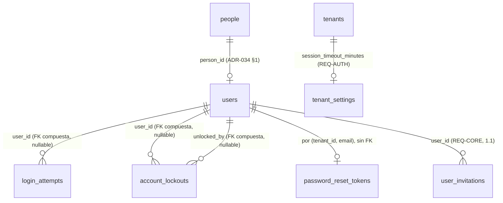
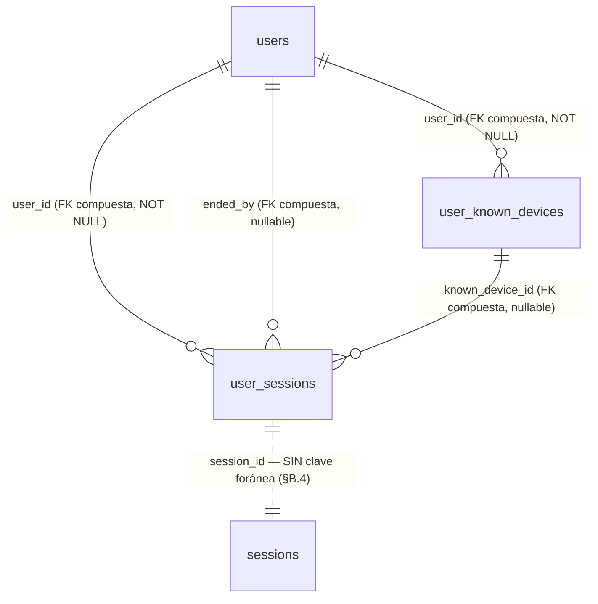

# REQ-AUTH · Modelo de datos

> **Estructura**: las secciones **§A.1 a §A.9** son el paso **1.2**, cerrado el 2026-08-25. La **Parte B** (`§B.1` en adelante) es el paso **1.2b** (`funcional.md` Parte B), **pendiente de aprobación**.

> Alcance: paso **1.2**. Cubre las **dos tablas nuevas** (§A.1, §A.2), la **modificación** de `password_reset_tokens` que exige el issue [#18](https://github.com/pirexia/plataforma-educativa/issues/18) (§A.3), la **columna nueva** de `tenant_settings` (§A.4) y lo que **no** se toca y por qué (§A.5).
>
> Convenciones de `ADR-029`: `TIMESTAMPTZ` siempre, `text` en vez de `varchar(n)`, `bigint` interno más `public_id` ULID **solo donde se expone en API o URL**. Toda tabla de tenant se crea con `App\Support\Tenancy\TenantMigration` (`ADR-033 §6`), que aporta `id`, `tenant_id` con `DEFAULT app.current_tenant_id()`, RLS `ENABLE`+`FORCE`, la política estándar y `UNIQUE (tenant_id, id)`.
>
> **Estado**: **aprobado** el 2026-08-22 (`funcional.md §14`). El rango 5-480 de `session_timeout_minutes` queda confirmado; la ampliación del `CHECK` de `audit_logs.event` **no** la hace este documento (`OPEN-AUTH-02`, la hace `ADR-039`).

---

## A.1 `login_attempts` — telemetría de intentos de acceso (`REQ-AUTH-001`)

Entidad `LoginAttempt`, nombrada explícitamente en la cabecera de la sección 5.2 del documento de requisitos.

Tabla de tenant **append-only** (`TenantMigration::tenantTableAppendOnly()`): sin `deleted_at` (el borrado lógico en una tabla append-only no significa nada), sin `created_by`/`updated_by` (el actor es el propio sujeto del intento) y con `REVOKE UPDATE, DELETE` para `plataforma_app` y `plataforma_platform`. Es la misma decisión que `audit_logs`, por el mismo motivo: un registro de seguridad que la aplicación puede editar no es un registro de seguridad.

| Columna | Tipo | Nulo | Descripción |
|---------|------|------|-------------|
| `id`, `tenant_id` | `bigint` | No | De `tenantTableAppendOnly()` |
| `email` | `text` | No | Correo **tal como se intentó**, normalizado (recortado y en minúsculas). Se guarda exista o no la cuenta: es lo que sostiene el bloqueo fantasma de `RN-AUTH-15` |
| `user_id` | `bigint` | Sí | FK compuesta `(tenant_id, user_id) → users`, declarada a mano por ser opcional (`tenantForeignId()` es `NOT NULL` siempre). `NULL` cuando el correo no corresponde a ninguna cuenta |
| `outcome` | `text` + `CHECK` | No | `exito`, `credenciales_invalidas`, `cuenta_bloqueada`, `estado_no_activo` |
| `attempted_at` | `TIMESTAMPTZ` | No | Momento del intento. Sustituye a `created_at`, igual que `audit_logs.occurred_at` |
| `ip_address` | `inet` | Sí | Tipo nativo, no `text` |
| `user_agent` | `text` | Sí | |
| `request_id` | `text` | Sí | `INV-013`, correlaciona con el log y con `audit_logs` |

**`login_attempts` vs. `audit_logs.event = 'login'`** (`ADR-039` §9 punto 4): son cosas distintas, no una redundancia. `login_attempts` registra **todo intento**, con éxito o sin él (`outcome`), y existe para sostener el bloqueo por intentos fallidos (`RN-AUTH-14`). `audit_logs` con `event = 'login'` registra solo **accesos consumados** (sesión creada de verdad), con `actor_type = 'user'` porque en ese punto ya hay un usuario autenticado. Un intento fallido nunca genera fila en `audit_logs`; un acceso consumado genera una fila en cada tabla. `request_id` es la columna que correlaciona ambas filas (junto con el log de aplicación) cuando hace falta reconstruir qué pasó en una petición concreta.

**Sin `public_id`.** En 1.2 esta tabla no se expone por ninguna API: no hay endpoint que devuelva un intento. `ADR-029` pide `public_id` en lo que se expone en URL o API, y añadirlo «por si acaso» es lo que `ADR-034 OPEN-13` desaconseja. Si 1.2b o `REQ-BO` construyen la pantalla de accesos, lo añaden entonces (es *expand* puro).

**Sin contraseña ni fragmento suyo**, en ninguna columna ni en ningún caso (`RN-AUTH-05`). No hay «primeros caracteres», ni longitud, ni hash de lo intentado: cualquiera de las tres cosas convierte esta tabla en material de ataque por diccionario si se filtra.

**Los cuatro `outcome` distinguen lo que hay que distinguir**: `credenciales_invalidas` es lo único que incrementa el contador de bloqueo; `estado_no_activo` (credencial correcta sobre usuario `pendiente`/`inactivo`) **no** lo incrementa (`RN-AUTH-24`), y separarlo permite además detectar el caso operativo real de «este profesor no sabe que está dado de baja»; `cuenta_bloqueada` mide la presión sobre una cuenta ya bloqueada, que es la señal de un ataque en curso.

**Política de auditoría**: **no auditable**. Registrarla en `audit_logs` duplicaría cada fila y, en un ataque de fuerza bruta, inundaría la tabla que `REQ-CORE-005` obliga a conservar dos años. Es el mismo criterio con el que `datos.md §A.5` de `REQ-CORE` dejó `idempotency_keys` fuera del *observer*, y está argumentado en `funcional.md §10.2`.

Índices:

| Índice | Consulta que lo necesita |
|--------|---------------------------|
| `(tenant_id, email, attempted_at DESC)` | Recuento de fallos consecutivos desde el último éxito, en **cada** login. Es la consulta caliente del módulo |
| `(tenant_id, attempted_at DESC)` | Purga por retención (§A.7) y pantalla de accesos recientes de 1.2b/1.6 |
| `(tenant_id, user_id, attempted_at DESC)` | «¿Qué accesos ha tenido esta cuenta?», que pedirá 1.2b |

---

## A.2 `account_lockouts` — bloqueo de cuenta (`REQ-AUTH-001`)

Tabla de tenant ordinaria (`TenantMigration::tenantTable()`), con `public_id` ULID porque **sí** se expone: `GET /account-lockouts` y `DELETE /account-lockouts/{public_id}`.

| Columna | Tipo | Nulo | Descripción |
|---------|------|------|-------------|
| `public_id` | ULID | No | `ADR-029` |
| `email` | `text` | No | Correo bloqueado, normalizado. **No** es FK a `users`: el bloqueo fantasma de `RN-AUTH-15` existe para correos sin cuenta |
| `user_id` | `bigint` | Sí | FK compuesta opcional `(tenant_id, user_id) → users`. `NULL` en el bloqueo fantasma |
| `failed_count` | `smallint` | No | Fallos consecutivos que provocaron el bloqueo. Normalmente 5; puede ser mayor si dos peticiones concurrentes cruzan el umbral |
| `locked_at` | `TIMESTAMPTZ` | No | |
| `unlock_token_hash` | `text` | Sí | Hash SHA-256 del token de desbloqueo. `NULL` en el bloqueo fantasma: sin cuenta no hay a quién enviarle el enlace |
| `unlock_token_expires_at` | `TIMESTAMPTZ` | Sí | 24 h por defecto (`RN-AUTH-13`) |
| `unlocked_at` | `TIMESTAMPTZ` | Sí | Informado al levantar el bloqueo, por correo o por administrador |
| `unlocked_by` | `bigint` | Sí | FK compuesta opcional → `users`. `NULL` si el desbloqueo fue por correo del propio titular; informado si fue un administrador |

Restricciones e índices:

- `UNIQUE (tenant_id, email) WHERE unlocked_at IS NULL AND deleted_at IS NULL` — **un solo bloqueo vivo** por correo y tenant (`RN-AUTH-17`), garantizado por índice y no por comprobación de aplicación: dos peticiones que crucen el umbral a la vez lo romperían. Mismo patrón que `user_invitations` en 1.1.
- `UNIQUE (tenant_id, unlock_token_hash)` — total, no parcial: un token de desbloqueo no se reutiliza jamás, igual que un `public_id` (`ADR-034 §6`).
- `CHECK (unlocked_by IS NULL OR unlocked_at IS NOT NULL)` — no se puede registrar quién desbloqueó sin registrar que se desbloqueó.
- Índice `(tenant_id, locked_at DESC)` para el listado de `GET /account-lockouts`.
- Índice `(tenant_id, unlock_token_expires_at)` para la purga de tokens vencidos.

**La fila se conserva tras el desbloqueo** (`RN-AUTH-18`), con `unlocked_at` informado. Es traza: saber que una cuenta estuvo bloqueada tres veces en una semana es una señal de seguridad que se pierde si el desbloqueo borra la fila. El índice único parcial hace que una fila desbloqueada no estorbe a un bloqueo posterior del mismo correo.

**Sin `academic_year_id`**: un bloqueo de cuenta no pertenece a un curso académico (`ADR-034 §4`: o `NOT NULL` o la columna no existe).

**Política de auditoría**: `Selective`.

- Registrados con valor: `failed_count`, `locked_at`, `unlocked_at`, `unlocked_by`, `deleted_at`, `created_by`, `updated_by`.
- `email` se redacta como `identifier`: es un dato personal directo, mismo criterio que `ADR-035` aplicó a `users.email`.
- `unlock_token_hash` lo redacta como `secret` **automáticamente** el patrón `*token*` de `config('audit.secret_attribute_patterns')`, sin declararlo.

Esta política es la que hace que **bloqueo y desbloqueo queden auditados sin ampliar nada**: la creación de la fila es un evento `created` y el desbloqueo un `updated`, ambos del *observer* de 0.9 (`funcional.md §10.1`).

---

## A.3 `password_reset_tokens` — modificación (issue [#18](https://github.com/pirexia/plataforma-educativa/issues/18))

La tabla existe desde 0.8 con `tenant_id`, clave primaria compuesta `(tenant_id, email)`, RLS `ENABLE`+`FORCE` y política de aislamiento. **No es una tabla de `tenantTable()`**: se creó a mano precisamente porque su clave primaria no es `id`.

Estado actual:

| Columna | Tipo | Nulo |
|---------|------|------|
| `tenant_id` | `bigint` | No |
| `email` | `text` | No |
| `token` | `text` | No |
| `created_at` | `TIMESTAMPTZ` | Sí |

### Por qué hay que tocarla

El flujo de §4.5 de `funcional.md` busca **solo por token**, para no meter el correo en el enlace. La columna `token` guarda el hash **bcrypt** que escribe el `DatabaseTokenRepository` de Laravel, y un hash bcrypt no se puede buscar por igualdad: lleva sal aleatoria por diseño. Hace falta una columna consultable.

### Cambio propuesto, en dos entregas (expand/contract, `CLAUDE.md §9`)

**Entrega 1 — *expand*, en 1.2:**

| Columna | Tipo | Nulo | Descripción |
|---------|------|------|-------------|
| `token_hash` | `text` | Sí *(ver abajo)* | **SHA-256** del token en claro. Consultable por igualdad |
| `expires_at` | `TIMESTAMPTZ` | Sí *(ver abajo)* | Caducidad explícita, 60 min por defecto |

Más: `ALTER COLUMN token DROP NOT NULL`, y `CREATE UNIQUE INDEX password_reset_tokens_tenant_token_hash_unique ON password_reset_tokens (tenant_id, token_hash)`.

**Entrega 2 — *contract*, dos versiones después:** `DROP COLUMN token`, y `token_hash`/`expires_at` pasan a `NOT NULL`.

Las dos columnas nuevas nacen **nullable** aunque la aplicación las escriba siempre. Es la disciplina de expand/contract y no una concesión: una columna `NOT NULL` sin valor por defecto en una tabla que la versión anterior sigue escribiendo rompe el despliegue sin interrupción. Que hoy la tabla esté vacía —nunca ha existido un flujo de recuperación que escriba en ella— hace la migración trivial, pero no es motivo para saltarse el patrón: el precedente que se sienta aquí lo copiarán los 51 módulos restantes.

**SHA-256 y no bcrypt**, deliberadamente, y merece el argumento porque parece un debilitamiento y no lo es: bcrypt existe para resistir el ataque por diccionario contra un secreto **elegido por una persona** y de baja entropía. Este token son 32 bytes de un generador criptográfico: 256 bits de entropía real, imposible de atacar por diccionario. Lo que se necesita aquí es un resumen de longitud fija, rápido y **consultable por igualdad**, y SHA-256 lo es. Es exactamente el mismo criterio con el que 1.1 hashea el token de invitación (`IssueUserInvitation`, `hash('sha256', $rawToken)`), y ser coherente con él importa más que la elección concreta.

### Invariantes que se mantienen

- **Clave primaria `(tenant_id, email)` intacta**: garantiza por construcción que hay **como mucho un token vivo por correo y tenant** (`RN-AUTH-11`). Solicitar otro sustituye al anterior con un `UPDATE`/`INSERT ... ON CONFLICT`, sin comprobación de aplicación que alguien pueda olvidar.
- **Un solo uso por desaparición de la fila**: al consumirse, se borra. No hay bandera `used_at` que alguien pueda dejar de comprobar en una consulta futura.
- **Sin `public_id`**: no se expone nunca por API.
- **No auditable por el *observer***: no es un `TenantModel` (su clave primaria no es `id`). Lo que se audita son sus **efectos** sobre `User` (`updated` con `password` redactado como `secret`), y —si se aprueba `OPEN-AUTH-02`— la solicitud como `password_reset_requested`.

---

## A.4 `tenant_settings` — columna nueva (`REQ-AUTH-005` punto 1)

*Expand* puro sobre la tabla de 1.1, anticipado por `REQ-CORE/funcional.md §1.4`.

| Columna | Tipo | Nulo | Defecto | Descripción |
|---------|------|------|---------|-------------|
| `session_timeout_minutes` | `integer` | No | `30` | Minutos de **inactividad** tras los que la sesión expira (`REQ-AUTH-005`) |

- `CHECK (session_timeout_minutes BETWEEN 5 AND 480)`. El rango está pendiente de confirmación en `OPEN-AUTH-06`.
- `NOT NULL DEFAULT 30` es seguro en expand: la versión anterior no conoce la columna y el valor por defecto la rellena para las filas existentes en la misma sentencia.
- Se **añade a la lista de atributos registrados** de la política `Selective` de `TenantSettings`: es una decisión de seguridad del centro y su cambio debe verse en el registro de auditoría con su valor anterior y posterior, no redactado.
- Invalida la caché `tenant:{id}:settings` en la escritura, como cualquier otro campo de la tabla (`RN-CORE-17`).

---

## A.5 Lo que 1.2 **no** toca

| Tabla | Por qué no |
|-------|------------|
| `sessions` | **No se añade `tenant_id` ni RLS.** Es de 1.2b (`funcional.md §1.5`, `OPEN-AUTH-10`). Sigue en `config/tenancy.php` → `shared_tables.framework`. Lo que 1.2 sí hace es guardar el `tenant_id` en el **payload** de la sesión y reverificarlo en cada petición (`RN-AUTH-31`) |
| `users` | Ninguna columna nueva. El bloqueo **no** es una bandera en `users`: si lo fuera, no podría existir para correos sin cuenta y el oráculo de enumeración de `funcional.md §4.4` volvería |
| `users.remember_token` | Se queda como está, sin uso. `OPEN-AUTH-09`: no se implementa «recordarme» y retirar la columna sería una migración destructiva por un beneficio nulo |
| `user_invitations` | Ninguna columna nueva. El canje escribe `accepted_at`, que ya existe desde 1.1 y que 1.1 documentó como *«lo escribe el canje, paso 1.2»* |
| `audit_logs` | Ninguna columna nueva. La ampliación del `CHECK` de `event` está condicionada a `OPEN-AUTH-02` y, si se aprueba, la hace su ADR, no esta especificación |
| **Ninguna tabla de proveedor de identidad** | `identity_providers`, `mfa_factors` y cualquier columna de proveedor externo son 1.3 y 1.4. `ADR-034 OPEN-13`: no se adelanta ninguna columna «por si acaso» |

---

## A.6 Relaciones



Todas las claves foráneas son **compuestas** `(tenant_id, columna) REFERENCES tabla (tenant_id, id)` (`ADR-033 §6`). Las tres de este módulo son **opcionales**, así que se declaran a mano y no con `TenantMigration::tenantForeignId()`, que es `NOT NULL` siempre por decisión de `ADR-034 §4`.

`password_reset_tokens` **no tiene clave foránea a `users`**, y es deliberado: su clave es `(tenant_id, email)`, no `user_id`. Añadir la FK obligaría a resolver el usuario antes de escribir el token y a decidir qué pasa si el correo cambia — cosas que ya resuelven `RN-AUTH-11` y el consumo del evento `UserEmailChanged` (`funcional.md §8.2`), sin acoplar el esquema.

`sessions` no aparece en el diagrama: sigue fuera del sistema de tenancy (§A.5).

---

## A.7 Índices y la consulta que los justifica

| Índice | Consulta |
|--------|----------|
| `login_attempts (tenant_id, email, attempted_at DESC)` | Fallos consecutivos desde el último éxito, en cada intento de login. Es la consulta caliente: se ejecuta antes de verificar ninguna contraseña |
| `login_attempts (tenant_id, attempted_at DESC)` | Purga por retención de 90 días; accesos recientes del centro (1.2b/1.6) |
| `login_attempts (tenant_id, user_id, attempted_at DESC)` | Historial de accesos de una cuenta concreta (1.2b) |
| `account_lockouts (tenant_id, email)` único parcial | Comprobación de bloqueo vivo, en **cada** login, antes de verificar la contraseña. Y la invariante de `RN-AUTH-17` |
| `account_lockouts (tenant_id, unlock_token_hash)` único | Canje del token de desbloqueo: búsqueda exacta por tenant más hash |
| `account_lockouts (tenant_id, locked_at DESC)` | Listado de `GET /account-lockouts`, orden cronológico inverso |
| `account_lockouts (tenant_id, unlock_token_expires_at)` | Purga de tokens de desbloqueo vencidos |
| `password_reset_tokens (tenant_id, token_hash)` único | Restablecimiento: búsqueda **solo por token**, sin correo en la URL (§A.3) |
| `password_reset_tokens (tenant_id, email)` PK | Sustitución del token vivo (`RN-AUTH-11`) y purga por correo al cambiarlo |

**Sin índice sobre `password_reset_tokens.expires_at`**: la tabla tiene, como mucho, una fila por usuario que haya pedido recuperación en la última hora. Un recorrido completo para la purga es más barato que mantener el índice. Se añadirá cuando una medición lo pida, no por anticipación.

**Sin índice nuevo sobre `users`**: la búsqueda de login es por `(tenant_id, email)`, que ya sirve el índice único parcial `users_tenant_email_unique` creado en 0.8.

---

## A.8 Checklist obligatorio

- [x] `tenant_id` presente e indexado como primera columna de las consultas frecuentes — vía `tenantTable()`/`tenantTableAppendOnly()` en las dos tablas nuevas; ya presente en `password_reset_tokens` desde 0.8
- [x] `academic_year_id` — **no aplica** en ninguna: ni un intento de acceso, ni un bloqueo, ni un token de recuperación pertenecen a un curso académico. Por `ADR-034 §4`, la columna no existe (nunca nullable)
- [x] `created_at`/`updated_at`/`deleted_at`/`created_by`/`updated_by` — `account_lockouts` los lleva todos vía `tenantTable()`. `login_attempts` es la excepción deliberada: append-only por `tenantTableAppendOnly()`, con `attempted_at` en lugar de `created_at` y sin autoría de fila (el actor **es** el sujeto). `password_reset_tokens` conserva su forma de 0.8
- [x] Claves foráneas y restricciones declaradas en base de datos — FK compuestas opcionales, `CHECK` de `outcome` y de `session_timeout_minutes`, `CHECK` de coherencia de `unlocked_by`, índices únicos parciales
- [x] Importes en enteros de céntimos — **no aplica**, sin importes
- [x] Fechas en UTC (`TIMESTAMPTZ`) — todas
- [x] Datos de categoría especial en tabla separada y cifrada — **no aplica**: este módulo no trata salud, NEAE ni convivencia (`permisos.md §6`). Sí trata **credenciales**, que van hasheadas y nunca en claro (`RN-AUTH-03`), y **direcciones IP**, que son dato personal y tienen retención acotada (§A.9)
- [x] Particionado evaluado — **`login_attempts` es la única candidata**: es la tabla de mayor crecimiento del módulo y un ataque de fuerza bruta la infla en minutos. Se difiere a propósito con **disparador de revisión escrito**: si supera los 20 millones de filas o si la purga diaria excede su ventana, se convierte a particiones mensuales por rango sobre `attempted_at`, con ADR propio — mismo criterio que `ADR-034 §3` fijó para `audit_logs`. Las otras dos son de bajo crecimiento (una fila por bloqueo, una por solicitud de recuperación viva)
- [x] Toda restricción de unicidad sobre tabla con borrado lógico es **parcial** (`WHERE deleted_at IS NULL`) — cierto en `account_lockouts (tenant_id, email)`. `(tenant_id, unlock_token_hash)` y `(tenant_id, token_hash)` son **totales** a propósito: un token no se reutiliza jamás
- [x] Migraciones aditivas y compatibles con la versión anterior — las dos tablas son nuevas; los dos `ALTER` son *expand* con su *contract* planificado (§A.3, §A.4)

---

## A.9 Retención y supresión

| Tabla | Plazo | Base y mecanismo |
|-------|-------|------------------|
| `login_attempts` | **90 días** | Contiene correo e IP: dato personal tratado por **interés legítimo en la seguridad del tratamiento** (art. 32 RGPD, `RSEC-OWASP-009`). Noventa días es el plazo que permite investigar un incidente detectado tarde sin conservar un mapa indefinido de los horarios de trabajo de la plantilla. `PurgeLoginAttempts` borra físicamente **con el rol propietario**, porque `tenantTableAppendOnly()` revoca `DELETE` a los dos roles de aplicación — igual que la purga de `audit_logs` de `REQ-PRIV-006` |
| `account_lockouts` | **Fila permanente; token a las 24 h** | La traza de que una cuenta estuvo bloqueada es información de seguridad y se conserva. `PurgeUnlockTokens` pone a `NULL` el `unlock_token_hash` y su caducidad cuando vencen, para no acumular material de token sin uso. La fila se elimina con la persona en el flujo de supresión de `ADR-004` |
| `password_reset_tokens` | **1 hora** (la caducidad del token) | Artefacto transitorio. Se borra al consumirse; `PurgeExpiredPasswordResetTokens` retira los vencidos a diario. No se conserva traza de que se pidió recuperación: eso lo registra la auditoría, no esta tabla |
| `tenant_settings.session_timeout_minutes` | Vida del tenant | Configuración de la organización, no dato personal |

**Derecho de supresión** (`ADR-004`, `REQ-PRIV-006`): la anonimización de una persona (nivel 2) afecta a `people`/`users`. Sobre estas tablas el efecto hay que mirarlo de frente, porque **dos de ellas guardan una copia desnormalizada del correo**, que es precisamente el patrón que `ADR-034 §3` evitó en `audit_logs`:

- `login_attempts.email` y `account_lockouts.email` **no** se resuelven por FK. Es inevitable: existen para correos que no corresponden a ninguna cuenta (`RN-AUTH-15`), así que no hay entidad a la que apuntar.
- La consecuencia es que anonimizar a una persona **no** borra su correo de estas dos tablas. Se compensa con la retención: `login_attempts` desaparece sola en 90 días, y la supresión de `account_lockouts` entra en el flujo de supresión de la persona como borrado de fila, no como anonimización de columna.
- Es la misma solución que `ADR-035` dio para `audit_logs.changes`: **la supresión no se ejerce editando la fila, se ejerce por retención**. Se anota aquí explícitamente para que `REQ-PRIV-006` la encuentre escrita y no la descubra.

---
---

# Parte B · Paso 1.2b · Modelo de datos

> Alcance: paso **1.2b** (`funcional.md` Parte B). Cubre **dos tablas de tenant nuevas** (§B.1, §B.2), lo que **no** se toca y por qué (§B.3), y la consecuencia de todo ello sobre retención y supresión (§B.7).
>
> Mismas convenciones de `ADR-029` y `ADR-033 §6` que la Parte A: `TIMESTAMPTZ`, `text`, `bigint` interno más `public_id` ULID **solo donde se expone en API o URL**, y creación por `App\Support\Tenancy\TenantMigration`.
>
> **Estado**: **propuesta**, pendiente de `funcional.md §B.14`. Cinco preguntas abiertas; ninguna cambia estas dos tablas salvo `OPEN-AUTH-13`, que solo decide si `location_label` nace ahora o después.

---

## B.1 `user_known_devices` — dispositivos reconocidos de una cuenta (`REQ-AUTH-005` punto 4)

Entidad `UserKnownDevice`. Tabla de tenant ordinaria (`TenantMigration::tenantTable()`).

**Se crea antes que `user_sessions`**, porque esa la referencia por clave foránea.

| Columna | Tipo | Nulo | Descripción |
|---------|------|------|-------------|
| `id`, `tenant_id` | `bigint` | No | De `tenantTable()` |
| `user_id` | `bigint` | No | `tenantForeignId()`: FK compuesta `(tenant_id, user_id) → users`, **obligatoria**. Un dispositivo sin cuenta no significa nada |
| `device_token_hash` | `text` | No | **SHA-256** del valor de la cookie `pge_device`. El valor en claro **no está en base de datos** (`RN-AUTH-45`, hereda `RN-AUTH-09`) |
| `first_seen_at` | `TIMESTAMPTZ` | No | Primer acceso desde este dispositivo |
| `last_seen_at` | `TIMESTAMPTZ` | No | Último. Se actualiza en cada login desde él |
| `login_count` | `integer` | No | Accesos desde este dispositivo. Por defecto `1` |
| `label` | `text` | Sí | Descripción legible del primer avistamiento («Chrome · Windows · escritorio»). Solo para mostrar |
| `last_ip_address` | `inet` | Sí | Tipo nativo, no `text`, igual que `login_attempts.ip_address` |
| `alerted_at` | `TIMESTAMPTZ` | Sí | Cuándo se avisó al titular. `NULL` si el tope diario de `RN-AUTH-46` impidió el aviso — y esa distinción importa: un dispositivo registrado sin avisar es exactamente lo que hay que poder auditar después |

**Sin `public_id`.** Ningún endpoint de 1.2b devuelve un dispositivo: el panel lista **sesiones**, y la descripción del dispositivo viaja dentro de la sesión, no como recurso propio. `ADR-029` pide `public_id` en lo que se expone en URL o API, y `ADR-034 OPEN-13` desaconseja añadirlo «por si acaso». Es el mismo criterio con el que §A.1 lo negó a `login_attempts`. Si 1.3 construye «dispositivos de confianza» como recurso propio, lo añade entonces: es *expand* puro.

**Sin `academic_year_id`**: un dispositivo no pertenece a un curso académico (`ADR-034 §4`: o `NOT NULL` o la columna no existe).

Restricciones e índices:

- `UNIQUE (tenant_id, user_id, device_token_hash) WHERE deleted_at IS NULL` — **parcial**, no total, y a propósito. La regla general de §A.8 es que toda unicidad sobre tabla con borrado lógico es parcial; la excepción que §A.2 hizo para los hashes de token no aplica aquí, porque un dispositivo **sí puede volver**: si un día se decide «olvidar» un dispositivo y la misma cookie reaparece, tiene que poder registrarse otra vez —y disparar su aviso, que es lo correcto— en vez de chocar contra un índice.
- `CHECK (login_count >= 1)`.
- Índice `(tenant_id, user_id, last_seen_at DESC)` — «¿qué dispositivos tiene esta cuenta?», y el camino de la purga por usuario.
- Índice `(tenant_id, last_seen_at)` — purga por antigüedad (§B.7).

**La consulta caliente es la del índice único**: en **cada** login con cookie presente se busca por `(tenant_id, user_id, device_token_hash)`. El índice único parcial la sirve entera; no hace falta otro.

**Política de auditoría**: `Selective`.

- Registrados con valor: `first_seen_at`, `last_seen_at`, `login_count`, `alerted_at`, `label`, `deleted_at`, `created_by`, `updated_by`.
- `device_token_hash` lo redacta como `secret` **automáticamente** el patrón `*token*` de `config('audit.secret_attribute_patterns')`, sin declararlo. Es el motivo real de que la columna se llame así y no `device_id`: el nombre es lo que dispara la defensa en profundidad.
- `last_ip_address` se redacta como `identifier`: es dato personal directo, mismo criterio que `account_lockouts.email` (§A.2) y que `users.email` en `ADR-035`.

Con eso, **el alta de un dispositivo y el aviso al titular quedan auditados sin una sola llamada manual** (`funcional.md §B.10`): el alta es un `created` y el aviso un `updated`, los dos del *observer* de 0.9.

---

## B.2 `user_sessions` — sesiones de usuario con metadatos (`REQ-AUTH-005` puntos 2 y 3)

Entidad `UserSession`. Tabla de tenant ordinaria (`TenantMigration::tenantTable()`), con `public_id` ULID porque **sí** se expone: `GET /auth/sessions` y `DELETE /auth/sessions/{public_id}`.

Es la tabla del módulo, **complementaria** de la `sessions` del framework y deliberadamente separada de ella. El argumento entero está en `funcional.md §B.2.2` y no se repite; el resumen es que el identificador de sesión es una credencial portadora y el `public_id` es su nombre público, y las dos cosas no van en la misma fila.

| Columna | Tipo | Nulo | Descripción |
|---------|------|------|-------------|
| `id`, `tenant_id` | `bigint` | No | De `tenantTable()` |
| `public_id` | ULID | No | `ADR-029`. **El único identificador que sale por la API** (`RN-AUTH-40`) |
| `user_id` | `bigint` | No | `tenantForeignId()`, obligatoria. Una sesión anónima **no tiene fila aquí** (`funcional.md §B.4.1`) |
| `session_id` | `text` | No | Identificador de sesión del framework, **posterior** a la regeneración de `RN-AUTH-32`. Sin FK (§B.4) |
| `started_at` | `TIMESTAMPTZ` | No | Momento del login que la creó |
| `ip_address` | `inet` | Sí | IP de origen del login. Tipo nativo |
| `user_agent` | `text` | Sí | Cabecera cruda, **truncada a 1024 caracteres**. Sin truncado, una cabecera hostil de 64 KB entra tal cual en una tabla de tenant |
| `client_browser` | `text` | Sí | Derivado del `User-Agent`. Solo para mostrar (`funcional.md §B.6.4`) |
| `client_platform` | `text` | Sí | Ídem |
| `client_device_type` | `text` + `CHECK` | Sí | `escritorio`, `movil`, `tableta`, `bot`, `desconocido` |
| `location_label` | `text` | Sí | **Siempre `NULL` en 1.2b** (`RN-AUTH-47`, `OPEN-AUTH-13`). El hueco del requisito, escrito en el esquema para que se vea que está a medias |
| `known_device_id` | `bigint` | Sí | FK compuesta **opcional** `(tenant_id, known_device_id) → user_known_devices`, declarada a mano. `NULL` cuando el navegador no admitió la cookie |
| `ended_at` | `TIMESTAMPTZ` | Sí | Momento en que dejó de estar viva |
| `end_reason` | `text` + `CHECK` | Sí | Las **siete** razones de `funcional.md §B.4.6` |
| `ended_by` | `bigint` | Sí | FK compuesta opcional → `users`. Quién la cerró; `NULL` en los cierres automáticos |

**Sin `academic_year_id`**, por el mismo motivo que las tres tablas de la Parte A.

**Sin columna de última actividad.** Es la decisión de rendimiento del paso y merece el argumento: sería lo evidente —el panel muestra «última actividad»— y sería un `UPDATE` **en cada petición autenticada del sistema**. `sessions.last_activity` ya guarda ese dato, lo mantiene el framework sin coste añadido, y el listado (`api.md §B.2`) lo lee de allí uniendo por `session_id`. Duplicarlo aquí compraría una columna a cambio de convertir cada lectura de cualquier endpoint del producto en una escritura.

Restricciones e índices:

| Restricción / índice | Qué garantiza o qué consulta sirve |
|----------------------|------------------------------------|
| `UNIQUE (tenant_id, session_id) WHERE ended_at IS NULL AND deleted_at IS NULL` | **Una sola fila viva por sesión** (`RN-AUTH-39`), por índice y no por comprobación de aplicación. Mismo patrón que `account_lockouts` en §A.2 |
| `UNIQUE (public_id)` | `ADR-029`, igual que `account_lockouts` |
| `CHECK ((ended_at IS NULL) = (end_reason IS NULL))` | No hay cierre sin razón ni razón sin cierre (`RN-AUTH-44`). Es más fuerte que el `CHECK` equivalente de `account_lockouts`, que solo cubre una dirección — y esa asimetría fue precisamente lo que dejó pasar la ausencia de `unlock_reason` hasta la implementación |
| `CHECK (ended_by IS NULL OR ended_at IS NOT NULL)` | No se registra quién cerró sin registrar que se cerró |
| `CHECK (end_reason IN ('logout', 'revocada_usuario', 'inactividad', 'caducidad', 'cambio_credencial', 'baja_usuario', 'tenant_incoherente'))` | Siete valores, **cada uno con un productor real** (`funcional.md §B.4.6`). Ni uno de más: el issue [#61](https://github.com/pirexia/plataforma-educativa/issues/61) es lo que pasa cuando se reutiliza un valor por no tener el correcto |
| `CHECK (client_device_type IN ('escritorio', 'movil', 'tableta', 'bot', 'desconocido'))` | |
| `(tenant_id, user_id, started_at DESC) WHERE ended_at IS NULL AND deleted_at IS NULL` | **La consulta del panel** (`GET /auth/sessions`). Es la única caliente de esta tabla |
| `(tenant_id, ended_at)` | Purga por retención (§B.7) y la tarea `CloseOrphanedUserSessions` |
| `(tenant_id, known_device_id)` | Integridad referencial y «¿qué sesiones vinieron de este dispositivo?» |

**Política de auditoría**: `Selective`, y aquí hay que ser explícito porque un descuido es una fuga.

- Registrados con valor: `started_at`, `ended_at`, `end_reason`, `ended_by`, `deleted_at`, `created_by`, `updated_by`.
- **`session_id` se declara en `auditSecretAttributes`, explícitamente.** No encaja en ningún patrón de `config('audit.secret_attribute_patterns')` —no contiene `token`, ni `password`, ni `secret`—, así que la defensa automática **no lo cubre**. Y es la credencial portadora de la sesión. Sin esa declaración, cada cierre de sesión escribiría el identificador de sesión en una tabla *append-only* con **dos años** de retención y exportable a CSV por `REQ-CORE-005`. Es el punto de este documento que la revisión de seguridad debe comprobar línea a línea.
- `ip_address` y `user_agent` se redactan como `identifier`: son datos personales, y en el caso del `User-Agent` también un vector de huella.
- `location_label` se redactaría como `identifier` el día que deje de ser `NULL`. Se declara desde ya para no depender de que alguien se acuerde al resolver `OPEN-AUTH-13`.

**Sobre el evento `created`**: `UserSession` declara `auditExcludedEvents(): ['created']` (`ADR-040 §4.1`/`§4.3`) — el nacimiento de la fila, siempre dentro de la transacción del login (`§B.4.1`), ya lo registra el evento `login` sobre `User` (`ADR-039`). No cambia nada de este esquema: la exclusión vive en el modelo, no en la tabla ni en su política de redacción.

---

## B.3 Lo que 1.2b **no** toca

| Tabla | Por qué no |
|-------|------------|
| **`sessions`** | **Ni una columna.** Ni `tenant_id`, ni RLS, ni `public_id`, ni metadatos. Sigue en `config/tenancy.php → shared_tables.framework`. Argumento entero en `funcional.md §B.2.2`; la decisión sobre `OPEN-AUTH-10` se replantea en `OPEN-AUTH-15` y **no la toma esta especificación** |
| `users` | Ninguna columna nueva. `remember_token` sigue sin uso (`OPEN-AUTH-09`), y 1.2b no lo cambia: la cookie `pge_device` **no es** «recordarme» — no autentica a nadie, no crea sesión y no alarga ninguna |
| `login_attempts` | Ninguna columna nueva, **y sigue sin `public_id`**. §A.1 lo condicionó a que 1.2b o `REQ-BO` construyeran la pantalla de accesos; 1.2b **no la construye** (`funcional.md §B.1.2`), así que la columna no entra |
| `account_lockouts`, `password_reset_tokens` | Sin cambios |
| `tenant_settings` | **Ninguna columna nueva.** 1.2b no añade ninguna configuración por centro: el tope de alertas y las retenciones son de plataforma (variables de entorno, `operacion.md §B.2`), no decisiones del centro. Si algún día un centro quiere desactivar la alerta de dispositivo nuevo, eso es un requisito nuevo y su sitio es `REQ-COM` |
| `audit_logs` | **Ninguna columna y ningún valor nuevo de `event`.** `funcional.md §B.10`: los dos hechos que hay que registrar son CRUD sobre entidades reales, que es justo lo que `ADR-039 §5.3` pide demostrar antes de ampliar nada |
| **Ninguna tabla de MFA ni de proveedor de identidad** | 1.3 y 1.4. `ADR-034 OPEN-13`: ni una columna «por si acaso», tampoco un `is_trusted` en `user_known_devices` pensando en el segundo factor |

---

## B.4 Relaciones



Todas las claves foráneas son **compuestas** `(tenant_id, columna) REFERENCES tabla (tenant_id, id)` (`ADR-033 §6`). Las dos obligatorias (`user_id`) usan `TenantMigration::tenantForeignId()`; las dos opcionales (`ended_by`, `known_device_id`) se declaran a mano, porque ese helper es `NOT NULL` siempre por decisión de `ADR-034 §4`.

**`user_sessions.session_id` no tiene clave foránea a `sessions`, y no puede tenerla.** Tres motivos independientes, cualquiera de ellos suficiente:

1. `sessions` está fuera del sistema de tenancy: su clave primaria es `id` a secas, sin `(tenant_id, id)`, así que no hay nada a lo que apuntar con una FK compuesta.
2. **El orden de escritura lo impide.** La fila de `user_sessions` se crea dentro de la transacción del login; la de `sessions` la escribe el `StartSession` del framework **al terminar la petición**. Una FK fallaría en cada login.
3. La fila de `sessions` la borra el recolector del framework por su cuenta. Una FK obligaría a elegir entre `ON DELETE CASCADE` —que borraría la traza justo cuando interesa conservarla— o `RESTRICT`, que rompería el recolector.

La consecuencia es la desincronización posible en una sola dirección, y su tratamiento está en `funcional.md §B.4.7`: cierre perezoso en el listado más una tarea programada. Es exactamente el mismo patrón —y el mismo motivo— que el cierre perezoso de los bloqueos vencidos de §4.4.

---

## B.5 Checklist obligatorio

- [x] `tenant_id` presente e indexado como primera columna de las consultas frecuentes — vía `tenantTable()` en las dos tablas nuevas, con RLS `ENABLE`+`FORCE` y política estándar
- [x] `academic_year_id` — **no aplica** en ninguna: ni una sesión ni un dispositivo pertenecen a un curso académico. Por `ADR-034 §4`, la columna no existe
- [x] `created_at`/`updated_at`/`deleted_at`/`created_by`/`updated_by` — las dos los llevan vía `tenantTable()`. **Ninguna es append-only**: las dos se actualizan por diseño (cierre de sesión, último avistamiento del dispositivo), así que `tenantTableAppendOnly()` no aplica
- [x] Claves foráneas y restricciones declaradas en base de datos — cuatro FK compuestas, cinco `CHECK`, dos índices únicos parciales
- [x] Importes en enteros de céntimos — **no aplica**
- [x] Fechas en UTC (`TIMESTAMPTZ`) — todas
- [x] Datos de categoría especial en tabla separada y cifrada — **no aplica**: este módulo no trata salud, NEAE ni convivencia (`permisos.md §6`). Sí trata **direcciones IP, cabeceras de cliente y un identificador persistente de navegador**, que son datos personales con retención acotada (§B.7) y con redacción en auditoría (§B.1, §B.2)
- [x] Particionado evaluado — **ninguna de las dos es candidata**. `user_sessions` tiene una fila por login **viva mientras la sesión lo esté**, y la purga la mantiene acotada; `user_known_devices` tiene una fila por dispositivo y usuario, del orden de unidades por persona. El disparador de revisión escrito de §A.8 sigue siendo `login_attempts`, no estas. **El crecimiento que sí hay que vigilar por culpa de este paso está en `audit_logs`**, y es `OPEN-AUTH-16`
- [x] Toda restricción de unicidad sobre tabla con borrado lógico es **parcial** — cierto en las dos, incluida la de `device_token_hash`, que **no** toma la excepción de §A.2 (§B.1)
- [x] Migraciones aditivas y compatibles con la versión anterior — §B.6

---

## B.6 Migraciones: por qué aquí no hay fase de contracción

Dos tablas nuevas y nada más. **Es *expand* puro, y el ciclo termina ahí** — igual que `ADR-039 §4.6` argumentó para su `CHECK`, y por el mismo motivo: expand/contract describe el ciclo completo de un cambio **destructivo**, y aquí no se retira, renombra ni deja de usar nada.

Concretamente, y en este orden:

1. `create_user_known_devices_table` — primera, porque la siguiente la referencia.
2. `create_user_sessions_table` — con las cuatro FK compuestas, los dos índices únicos parciales y los cinco `CHECK`.

Propiedades que hay que poder afirmar en la revisión (`db-reviewer`):

- **La versión anterior de la aplicación sigue funcionando contra el esquema nuevo**: no conoce las dos tablas y no las escribe. Login, logout, restablecimiento y cambio de contraseña siguen operando exactamente igual, solo que sin dejar rastro en ellas.
- **La versión nueva contra el esquema antiguo no se da**: la migración precede al despliegue, que es el orden normal (`operacion.md §B.6`).
- **La reversión es limpia**: `down()` elimina dos tablas que nada más referencia. A diferencia de la migración de `ADR-039`, esta sí se puede revertir de verdad; se pierde el historial de sesiones y dispositivos, que es información de seguridad y no de negocio.
- **Ninguna migración de 1.2b toca una tabla existente**, así que ninguna puede romper a nadie por bloqueo de escritura durante el despliegue.

---

## B.7 Retención y supresión

| Tabla | Plazo | Base y mecanismo |
|-------|-------|------------------|
| `user_sessions` | **Vive mientras la sesión viva; 90 días desde el cierre** | Contiene IP y `User-Agent`: dato personal tratado por **interés legítimo en la seguridad del tratamiento** (art. 32 RGPD, `RSEC-OWASP-009`). Noventa días es el mismo plazo de `login_attempts` (§A.9) **y por el mismo argumento**: permite investigar un incidente detectado tarde sin conservar un mapa indefinido de cuándo y desde dónde trabaja cada persona del centro. `PurgeUserSessions` borra físicamente las filas con `ended_at` anterior al plazo |
| `user_known_devices` | **12 meses sin uso** | Un dispositivo que lleva un año sin aparecer ya no sirve para reconocer nada: su cookie caducó (365 días, `RN-AUTH-45`) y volverá a presentarse como nuevo de todos modos. Conservarlo más tiempo es guardar un identificador de navegador sin finalidad, que es lo que el principio de minimización prohíbe. `PurgeUserKnownDevices` borra las filas con `last_seen_at` anterior al plazo |

Las dos son tablas de tenant ordinarias, así que la purga la ejecuta el **rol de aplicación** sin ceremonia: a diferencia de `PurgeLoginAttempts` (§A.9), aquí no hay `REVOKE DELETE` que sortear, porque ninguna de las dos es *append-only*.

**Derecho de supresión (`ADR-004`, `REQ-PRIV-006`): estas dos tablas son el caso fácil, y conviene decir por qué lo son.**

§A.9 tuvo que admitir que anonimizar a una persona **no** borra su correo de `login_attempts` ni de `account_lockouts`, porque esas dos se llevan por correo —tienen que hacerlo, para sostener el bloqueo fantasma de `RN-AUTH-15`— y no hay entidad a la que apuntar. La compensación era la retención.

Aquí no hace falta compensación: **`user_sessions` y `user_known_devices` cuelgan de un `user_id` real por clave foránea compuesta obligatoria** (`RN-AUTH-48`). La supresión de la persona las arrastra como borrado de fila, sin columnas desnormalizadas que queden atrás y sin depender de que pase un plazo. Se anota explícitamente para que `REQ-PRIV-006` lo encuentre escrito, igual que §A.9 anotó lo contrario para las otras dos — y porque la diferencia no es casual: es la consecuencia de que estas tablas describan sesiones **de un usuario que existe**, mientras que las de la Parte A describen intentos contra **un correo que puede no existir**.

**La cookie `pge_device` en el navegador del usuario no la borra nadie con la supresión**, y no puede: está en su equipo, no en el sistema. Pierde todo significado en cuanto desaparece su fila —no hay con qué compararla—, así que no queda ningún dato personal tratado por nosotros. Se anota porque la pregunta se hace sola al revisar una supresión.

---
---

# Parte C · Paso 1.3 · Modelo de datos (`REQ-AUTH-003`)

> **Estructura**: `§A.1`-`§A.9` son 1.2 (cerrado). `§B.1`-`§B.7` son 1.2b (cerrado). Esta **Parte C** es el paso **1.3**, **pendiente de aprobación** (`funcional.md §C.15`).
>
> Convenciones de `ADR-029` sin excepción: `TIMESTAMPTZ`, `text` en vez de `varchar(n)`, `bigint` interno más `public_id` ULID **solo donde se expone en API o URL**. Toda tabla de tenant se crea con `App\Support\Tenancy\TenantMigration::tenantTable()` (`ADR-033 §6`), que aporta `id`, `tenant_id` con `DEFAULT app.current_tenant_id()`, RLS `ENABLE`+`FORCE`, la política estándar, `UNIQUE (tenant_id, id)`, marcas de tiempo, borrado lógico y autoría.

---

## C.0 Lo que **ya existe** y este paso no crea

Antes del inventario de tablas nuevas, la parte que más ahorra: **el atributo central de `REQ-AUTH-003` ya está en el esquema desde 0.8.**

| Objeto | Estado | Consecuencia para 1.3 |
|--------|--------|------------------------|
| `roles.mfa_required` `boolean NOT NULL DEFAULT false` | **Existe** (`2026_08_18_100400_create_roles_table.php`, línea 24) | **No hay migración que lo cree.** `RPERM-014` está satisfecho a nivel de datos |
| Valores sembrados: `true` en `administrador_centro` y `soporte_plataforma` | **Existen** (`ProvisionTenantDefaults::ROLE_ATTRIBUTES`) | Hacer efectivo el atributo **activa la obligación en todos los tenants existentes** el día del despliegue. Es un dato de operación, no de esquema: `operacion.md §C.6` |
| `roles.is_system`, `name_key` *xor* `name`, único parcial `(tenant_id, code)` | **Existen** | El esquema de roles personalizados (`RPERM-005`) está puesto; falta quien escriba las filas (1.5) |
| `role_user` con FK compuestas y único parcial | **Existe** | La consulta de `RN-AUTH-62` se resuelve con los índices que ya hay |
| `config('audit.secret_attribute_patterns')` con `*totp*`, `*secret*` y `*recovery_code*` | **Existen** desde 0.9 | La redacción automática ya cubre los nombres de columna de este paso. Se declara igualmente a mano (`§C.2`, `§C.3`) |

---

## C.1 Resumen del cambio

**Seis tablas nuevas y dos modificaciones de tablas existentes.**

| # | Objeto | Tipo |
|---|--------|------|
| 1 | `user_mfa_factors` | Tabla nueva (`§C.2`) |
| 2 | `user_mfa_recovery_codes` | Tabla nueva (`§C.3`) |
| 3 | `mfa_challenges` | Tabla nueva (`§C.4`) |
| 4 | `user_mfa_obligations` | Tabla nueva (`§C.5`) |
| 5 | `user_mfa_exemptions` | Tabla nueva (`§C.6`) |
| 6 | `mfa_resets` | Tabla nueva de traza (`§C.6.1`) |
| 7 | `login_attempts.outcome` — `CHECK` de 4 a 6 valores | Modificación (`§C.7.1`) |
| 8 | `tenant_settings` — dos columnas nuevas | Modificación (`§C.7.2`) |

`funcional.md §C.1.3` ya avisa de que es entre dos y tres veces el tamaño de 1.2 o 1.2b, y `OPEN-AUTH-24` propone partir el paso.

**`roles.mfa_required` no aparece en esta lista**, y es el punto que más ahorra de todo el paso: **la columna ya existe** (`§C.0`).

---

## C.2 `user_mfa_factors` — factores de segundo paso de una cuenta

Entidad `MfaFactor`, **nombrada explícitamente en la cabecera de la sección 5.2 del documento de requisitos**. Tabla de tenant ordinaria, con `public_id` ULID porque se expone (`DELETE /auth/mfa-factors/{public_id}`).

| Columna | Tipo | Nulo | Descripción |
|---------|------|------|-------------|
| `id`, `tenant_id` | `bigint` | No | De `tenantTable()` |
| `public_id` | ULID | No | `ADR-029` |
| `user_id` | `bigint` | No | `tenantForeignId()`, obligatoria. Un factor sin titular no existe |
| `method` | `text` + `CHECK` | No | `totp`, `email`, `sms`. **`sms` está en el enumerado y no se puede usar** (`RN-AUTH-69`, `funcional.md §C.7`) |
| `secret_encrypted` | `text` | Sí | **Solo `totp`.** Secreto de 20 bytes en base32, **cifrado con `APP_KEY`** (cast `encrypted`). `NULL` en los métodos de entrega |
| `last_used_step` | `bigint` | Sí | **Solo `totp`.** Último paso de tiempo consumido, para rechazar la reutilización dentro de la ventana (`RN-AUTH-58`) |
| `confirmed_at` | `TIMESTAMPTZ` | Sí | `NULL` mientras el alta es provisional. **Un factor sin confirmar no protege, no cumple la obligación y no aparece como factor** (`RN-AUTH-59`) |
| `expires_at` | `TIMESTAMPTZ` | Sí | Caducidad del alta provisional. Se pone a `NULL` al confirmar |
| `confirmation_attempts` | `smallint` | No | Intentos de confirmación consumidos. `DEFAULT 0` |
| `last_used_at` | `TIMESTAMPTZ` | Sí | Último login superado con este factor. Solo informativo |
| `is_preferred` | `boolean` | No | Método que se propone primero cuando hay varios. `DEFAULT false` |

**Un solo tipo de fila para el alta provisional y para el factor confirmado, y no dos tablas.** La alternativa —una tabla `user_mfa_enrollments` aparte— duplica columnas (método, secreto, titular) y obliga a mover la fila al confirmar, que es una operación que puede fallar a mitad. Una fila con `confirmed_at NULL` es la misma entidad en un estado anterior, igual que una invitación no aceptada en `REQ-CORE`. Lo que hace que esto sea seguro y no un descuido es el índice único parcial de abajo, que solo se aplica a las confirmadas.

Restricciones e índices:

| Restricción / índice | Qué garantiza o qué consulta sirve |
|----------------------|-------------------------------------|
| `UNIQUE (tenant_id, user_id, method) WHERE confirmed_at IS NOT NULL AND deleted_at IS NULL` | **Un solo factor confirmado por método y usuario.** Parcial, así que conviven varias altas provisionales sin chocar |
| `UNIQUE (public_id)` | `ADR-029` |
| `CHECK (method IN ('totp','email','sms'))` | |
| `CHECK ((method = 'totp') = (secret_encrypted IS NOT NULL))` | Un TOTP sin secreto no verifica nada, y un factor de entrega con secreto guarda material que no le corresponde. Las dos direcciones, no una |
| `CHECK (last_used_step IS NULL OR method = 'totp')` | |
| `CHECK ((confirmed_at IS NULL) OR (expires_at IS NULL))` | Un factor confirmado no caduca como alta |
| `CHECK (confirmed_at IS NOT NULL OR expires_at IS NOT NULL)` | Un alta provisional **siempre** tiene caducidad. Sin esto, una fila sin confirmar vive para siempre con un secreto dentro |
| `(tenant_id, user_id) WHERE confirmed_at IS NOT NULL AND deleted_at IS NULL` | **La consulta caliente**: «¿tiene este usuario factor utilizable?», en cada login y en cada evaluación de `MfaPolicy` |
| `(tenant_id, expires_at) WHERE confirmed_at IS NULL` | Purga de altas caducadas (`§C.9`) |

**Política de auditoría**: `Selective`.

- Registrados con valor: `method`, `confirmed_at`, `is_preferred`, `deleted_at`, `created_by`, `updated_by`.
- **`secret_encrypted` se declara en `auditSecretAttributes()`, explícitamente**, aunque el patrón `*secret*` de `config('audit.secret_attribute_patterns')` ya lo cubra. Es exactamente el mismo argumento con el que `§B.2` obligó a declarar `session_id` a mano, con una diferencia: allí el patrón **no** cubría la columna y aquí sí. Se declara igual porque **depender de que un nombre de columna siga encajando en un `fnmatch` tras un refactor es depender de una coincidencia**, y lo que hay al otro lado es una credencial en una tabla *append-only* con dos años de retención.
- `last_used_step` y `last_used_at` **no se registran**: cambian en cada login y llenarían el registro de ruido sin decir nada que `login` no diga ya.

---

## C.3 `user_mfa_recovery_codes` — códigos de respaldo de un solo uso

Entidad `MfaRecoveryCode`. Tabla de tenant ordinaria. **Sin `public_id`**: no se expone individualmente por ninguna API (`ADR-029`; se identifican por su valor, que solo conoce el titular).

| Columna | Tipo | Nulo | Descripción |
|---------|------|------|-------------|
| `id`, `tenant_id` | `bigint` | No | De `tenantTable()` |
| `user_id` | `bigint` | No | `tenantForeignId()` |
| `code_hash` | `text` | No | **SHA-256 del código**, nunca el código (`RN-AUTH-56`) |
| `used_at` | `TIMESTAMPTZ` | Sí | Consumo. **La fila no se borra al usarse** (`RN-AUTH-57`) |
| `used_ip` | `inet` | Sí | Desde dónde se consumió. Tipo nativo, no `text` |
| `batch_id` | ULID | No | Identifica la tanda generada a la vez. Permite decir «este código es del juego que regeneraste el 3 de marzo» sin guardar nada más |

**Una fila por código y no un `jsonb` en el factor.** El array sería una columna menos y tres cosas peores: no se puede indexar la búsqueda (habría que traer las diez y comparar en PHP), no se puede marcar el consumo de uno solo sin reescribir toda la columna —con su condición de carrera— y el *observer* de auditoría registraría el array entero en cada consumo en vez de un `updated` sobre la fila que se gastó.

**Cuelgan del usuario y no del factor.** Un código de respaldo vale para cualquier método (`funcional.md §C.4.5`), y si colgara del factor, desactivar un factor y activar otro dejaría los códigos huérfanos o los borraría sin motivo.

Restricciones e índices:

| Restricción / índice | Qué garantiza o qué consulta sirve |
|----------------------|-------------------------------------|
| `UNIQUE (tenant_id, code_hash)` | **Total, no parcial** — igual que los tokens de `§A.7`: un código no se reutiliza jamás, ni siquiera tras un borrado lógico |
| `(tenant_id, user_id, code_hash) WHERE used_at IS NULL AND deleted_at IS NULL` | **La consulta del canje**: búsqueda exacta por titular y hash entre los no usados. Una sola consulta, trabajo constante |
| `(tenant_id, user_id) WHERE used_at IS NULL AND deleted_at IS NULL` | «¿Cuántos le quedan?», para `GET /auth/mfa` |

**Política de auditoría**: `Selective`. Se registran `used_at` y `batch_id`. **`code_hash` se declara secreto explícitamente** (además de encajar en `*recovery_code*`): un hash SHA-256 de un valor de 50 bits es material atacable por fuerza bruta si se filtra, y `audit_logs` es exportable a CSV por `REQ-CORE-005`.

---

## C.4 `mfa_challenges` — segundo paso pendiente de un login

Entidad `MfaChallenge`. Tabla de tenant ordinaria, con `public_id` **solo para poder referirla en respuestas y registros**; presentarlo **no autoriza nada** (`RN-AUTH-53`).

| Columna | Tipo | Nulo | Descripción |
|---------|------|------|-------------|
| `id`, `tenant_id` | `bigint` | No | De `tenantTable()` |
| `public_id` | ULID | No | `ADR-029`. **No es una credencial** |
| `user_id` | `bigint` | No | `tenantForeignId()` |
| `session_id` | `text` | No | Identificador de la sesión **anónima** que abrió el desafío. **Es la única credencial que lo autoriza** |
| `method` | `text` + `CHECK` | No | `totp`, `email`, `sms`. El método en curso; puede cambiar (`funcional.md §C.4.4.1`) |
| `code_hash` | `text` | Sí | SHA-256 del código entregado. `NULL` en `totp`, que no entrega nada |
| `code_expires_at` | `TIMESTAMPTZ` | Sí | Caducidad del código entregado, distinta de la del desafío |
| `expires_at` | `TIMESTAMPTZ` | No | Caducidad del desafío (`AUTH_MFA_CHALLENGE_TTL_MINUTES`). **No la prolonga un reenvío** |
| `attempts` | `smallint` | No | `DEFAULT 0`. Tope `AUTH_MFA_MAX_ATTEMPTS` |
| `deliveries` | `smallint` | No | `DEFAULT 0`. Reenvíos consumidos |
| `consumed_at` | `TIMESTAMPTZ` | Sí | Superado o agotado. **Un desafío consumido no revive** |
| `ip_address` | `inet` | Sí | |

**Por qué una tabla y no el *payload* de la sesión**: `funcional.md §C.6.2`, entero. El resumen es que el método por correo exige estado del servidor con vida propia (hash del código entregado, caducidad, contador de reenvíos) y tener dos mecanismos según el método es peor que tener uno.

**`session_id` sin FK**, igual que en `§B.2` y por el mismo motivo: `sessions` es del framework, no lleva `tenant_id` y no admite una FK compuesta (`OPEN-AUTH-15`, issue [#81](https://github.com/pirexia/plataforma-educativa/issues/81)).

Restricciones e índices:

| Restricción / índice | Qué garantiza o qué consulta sirve |
|----------------------|-------------------------------------|
| `UNIQUE (tenant_id, session_id) WHERE consumed_at IS NULL AND deleted_at IS NULL` | **Un solo desafío vivo por sesión**, por índice y no por comprobación de aplicación. Mismo patrón que `account_lockouts` y `user_sessions` |
| `UNIQUE (public_id)` | `ADR-029` |
| `CHECK ((method = 'totp') = (code_hash IS NULL))` | Un desafío de entrega sin código no verifica; un TOTP con código guarda material que no le corresponde |
| `CHECK ((code_hash IS NULL) = (code_expires_at IS NULL))` | |
| `CHECK (method IN ('totp','email','sms'))` | |
| `(tenant_id, session_id) WHERE consumed_at IS NULL` | **La consulta del paso 2**, en cada verificación |
| `(tenant_id, expires_at)` | Purga (`§C.9`) |

**Política de auditoría**: **la tabla no es auditable**, y hay que decir por qué porque es la única excepción del paso.

Un desafío es un artefacto transitorio de cinco minutos, exactamente como `password_reset_tokens`, que `§A.5` ya dejó fuera del *observer*. Registrar su creación y su consumo escribiría **dos filas de `audit_logs` por cada login con MFA**, en una tabla con dos años de retención, para decir algo que el evento `login` ya dice mejor y una sola vez (`funcional.md §C.10`). El intento fallido, que es lo que sí interesa, va a `login_attempts` con su propio `outcome` (`§C.7`).

Es el mismo criterio de `datos.md §A.5` de `REQ-CORE` con `idempotency_keys` y el de `§A.1` con `login_attempts`: **no todo lo que se escribe se audita; se audita lo que tiene consecuencia.**

**`session_id` no sale nunca por la API** (`RN-AUTH-40`), y esta tabla lo guarda: el *resource* del desafío expone `public_id`, `method`, `expires_at`, métodos alternativos y destino enmascarado, y nada más.

---

## C.5 `user_mfa_obligations` — el plazo de gracia de un usuario

Entidad `MfaObligation`. Tabla de tenant ordinaria. **Sin `public_id`**: no se expone individualmente; el estado agregado sale por `GET /mfa-compliance` y el propio por `GET /me`.

| Columna | Tipo | Nulo | Descripción |
|---------|------|------|-------------|
| `id`, `tenant_id` | `bigint` | No | De `tenantTable()` |
| `user_id` | `bigint` | No | `tenantForeignId()` |
| `obligated_since` | `TIMESTAMPTZ` | No | Cuándo empezó la obligación (`RN-AUTH-65`) |
| `grace_deadline_at` | `TIMESTAMPTZ` | No | `obligated_since + mfa_grace_period_days`, **congelado al crear**. No se recalcula si el centro cambia el plazo después: mover la fecha límite de alguien que ya está contando es cambiar las reglas a mitad |
| `resolved_at` | `TIMESTAMPTZ` | Sí | Cuándo la cumplió (confirmó un factor) |
| `trigger` | `text` + `CHECK` | No | `rol_modificado`, `rol_asignado`, `metodo_retirado`, `restablecimiento`, `exencion_vencida`. **Los cinco disparadores de `funcional.md §C.4.8` y `§C.4.10`-`§C.4.11`**, cada uno con un productor real |

**Una fila por período de obligación, no una por usuario.** Cumplir cierra la fila; volver a quedar sin factor abre otra con plazo completo (`RN-AUTH-65`). El historial queda, y es lo que permite responder «¿cuántas veces se le ha exigido a esta persona y cuánto tardó?» sin reconstruirlo de `audit_logs`.

Restricciones e índices:

| Restricción / índice | Qué garantiza o qué consulta sirve |
|----------------------|-------------------------------------|
| `UNIQUE (tenant_id, user_id) WHERE resolved_at IS NULL AND deleted_at IS NULL` | **Una sola obligación abierta por usuario.** Sin esto, dos peticiones concurrentes crean dos plazos distintos y gana el que se lea primero |
| `CHECK (grace_deadline_at > obligated_since)` | |
| `CHECK (resolved_at IS NULL OR resolved_at >= obligated_since)` | |
| `CHECK (trigger IN ('rol_modificado','rol_asignado','metodo_retirado','restablecimiento','exencion_vencida'))` | |
| `(tenant_id, user_id) WHERE resolved_at IS NULL` | Evaluación de `MfaPolicy`, en cada petición autenticada de un usuario obligado |
| `(tenant_id, grace_deadline_at) WHERE resolved_at IS NULL` | **La consulta de cumplimiento**: quién está pendiente y quién ha pasado del plazo (`GET /mfa-compliance`) |

**Política de auditoría**: `Full`. No contiene ningún dato personal más allá de la relación con el usuario, y el registro de cuándo se exigió y cuándo se cumplió es exactamente lo que `REQ-AUTH-003` obliga a poder consultar.

---

## C.6 `user_mfa_exemptions` — excepción temporal nominal

Entidad `MfaExemption`. Tabla de tenant ordinaria, con `public_id` porque se expone (`DELETE /mfa-exemptions/{public_id}`).

| Columna | Tipo | Nulo | Descripción |
|---------|------|------|-------------|
| `id`, `tenant_id` | `bigint` | No | De `tenantTable()` |
| `public_id` | ULID | No | `ADR-029` |
| `user_id` | `bigint` | No | `tenantForeignId()` |
| `reason` | `text` | No | **Obligatorio**, mínimo 10 caracteres (`RN-AUTH-66`). Contenido del centro |
| `expires_at` | `TIMESTAMPTZ` | **No** | **`NOT NULL` es la implementación literal de «no existe la exención permanente»** (`RN-AUTH-68`). Lo garantiza el motor, no una validación de aplicación que alguien pueda saltarse desde una consola |
| `granted_by` | `bigint` | No | FK compuesta → `users`. Quién la concedió |
| `revoked_at` | `TIMESTAMPTZ` | Sí | Revocación anticipada |
| `revoked_by` | `bigint` | Sí | FK compuesta opcional → `users` |

Restricciones e índices:

| Restricción / índice | Qué garantiza o qué consulta sirve |
|----------------------|-------------------------------------|
| `UNIQUE (tenant_id, user_id) WHERE revoked_at IS NULL AND deleted_at IS NULL` | Una sola excepción vigente por usuario |
| `CHECK (expires_at > created_at)` | Una excepción que nace caducada es un error de entrada, no un caso de uso |
| `CHECK ((revoked_at IS NULL) = (revoked_by IS NULL))` | Las dos direcciones — la lección del `CHECK` asimétrico de `account_lockouts` (`§B.2`) |
| `(tenant_id, user_id) WHERE revoked_at IS NULL` | Paso 1 de `MfaPolicy::resolve()`, en cada evaluación |
| `(tenant_id, expires_at) WHERE revoked_at IS NULL` | Tarea que reabre la obligación al caducar (`operacion.md §C.4`) |

**El tope de `AUTH_MFA_MAX_EXEMPTION_DAYS` (90) es de aplicación, no de motor**, y merece decirse: un `CHECK` no puede comparar contra `now() + interval`, igual que el índice único parcial de `account_lockouts` no podía depender de `now()` (`§4.4`). Lo que el motor sí garantiza es que la caducidad **existe**, que es la parte que el requisito exige. El tope se valida en el `FormRequest` y tiene su test.

**Política de auditoría**: `Full`. `reason` es contenido del centro, no dato personal (`ADR-035 §8`, mismo criterio que `roles.name`). Todo el ciclo —concesión, revocación— lo registra el *observer* sin una sola llamada manual, **porque la excepción es una entidad y no un evento**. Es el precedente de `AccountLockout` de `funcional.md §10.1` aplicado otra vez.

### C.6.1 `mfa_resets` — traza del restablecimiento por el administrador

Entidad `MfaReset`. Tabla de tenant **append-only** (`tenantTableAppendOnly()`), sin `deleted_at` y con `REVOKE UPDATE, DELETE` para los dos roles de aplicación. Mismo trato que `login_attempts` y `audit_logs`, y por el mismo motivo.

| Columna | Tipo | Nulo | Descripción |
|---------|------|------|-------------|
| `id`, `tenant_id` | `bigint` | No | De `tenantTableAppendOnly()` |
| `user_id` | `bigint` | No | Usuario cuyo MFA se restableció |
| `reason` | `text` | No | **Obligatorio**, mínimo 10 caracteres (`RN-AUTH-66`) |
| `factors_removed` | `smallint` | No | Cuántos factores se retiraron. Dice si el restablecimiento tuvo efecto real |
| `performed_by` | `bigint` | No | FK compuesta → `users`. El administrador |
| `performed_at` | `TIMESTAMPTZ` | No | Sustituye a `created_at`, igual que `login_attempts.attempted_at` |
| `request_id` | `text` | Sí | `INV-013`, correlaciona con `audit_logs` y con el log |

**Por qué una tabla y no solo `audit_logs`.** El motivo del restablecimiento es un texto libre escrito por una persona, y `ADR-035` obliga a clasificar todo valor que entre en `audit_logs.changes`, con **fallo en cerrado** y con el tope de `max_value_length` que redacta como `oversized` cualquier valor largo. Un motivo de tres frases entraría redactado, es decir: **el registro de auditoría guardaría que hubo un restablecimiento pero no por qué**, que es justo lo que `REQ-AUTH-003` exige conservar.

Con la entidad, el *observer* registra el `created` sobre `MfaReset` —y el motivo vive en su propia columna, íntegro, en una tabla que la aplicación no puede editar— además del `deleted` de cada factor. Es el mismo razonamiento que llevó a modelar el bloqueo como `AccountLockout` en vez de como un evento suelto (`funcional.md §10.1`), y la misma consecuencia agradable: **no hace falta ampliar el vocabulario de `audit_logs`** (`RN-AUTH-74`).

Índices: `(tenant_id, user_id, performed_at DESC)` y `(tenant_id, performed_at DESC)`.

**Política de auditoría**: `Full`, salvo `reason`, que se registra con valor **a propósito** — es contenido del centro y es la información que se quiere conservar.

---

## C.7 Modificaciones de tablas existentes

### C.7.1 `login_attempts.outcome` — de cuatro valores a seis

```sql
ALTER TABLE login_attempts DROP CONSTRAINT login_attempts_outcome_check;
ALTER TABLE login_attempts ADD CONSTRAINT login_attempts_outcome_check
    CHECK (outcome IN (
        'exito', 'credenciales_invalidas', 'cuenta_bloqueada', 'estado_no_activo',
        'pendiente_segundo_factor', 'segundo_factor_invalido'
    ));
```

Los cuatro existentes se conservan **literalmente**, con el mismo nombre de restricción. Es *expand* puro: ninguna fila escrita hasta hoy deja de ser válida, y la versión anterior de la aplicación nunca escribirá los dos nuevos porque su código no los produce. Mismo argumento y misma forma que `ADR-039 §4.6`, **y con la diferencia importante de que este `CHECK` es de una tabla de un solo módulo**, no de la tabla polimórfica de los 53: no hace falta ADR (`ADR-039 §5.3` acota el procedimiento a `audit_logs.event`).

Los dos valores nuevos, cada uno con su productor real y su consecuencia distinta (`funcional.md §C.4.4.2`):

| Valor | Cuándo | Efecto sobre el contador de `RN-AUTH-14` |
|-------|--------|-------------------------------------------|
| `pendiente_segundo_factor` | La contraseña era correcta y se abrió desafío | **Ninguno.** No lo incrementa y, sobre todo, **no lo pone a cero** |
| `segundo_factor_invalido` | Código o código de respaldo incorrecto | **Lo incrementa**, igual que `credenciales_invalidas` |

**Y una corrección de comportamiento que no es de esquema pero se anota aquí porque nace de esta tabla**: `exito` deja de escribirse al verificar la contraseña y pasa a escribirse **solo cuando la sesión se ha creado** (`RN-AUTH-63`). Sin ese cambio, cada paso 1 repetido pondría el contador a cero y el bloqueo nunca dispararía contra un ataque al segundo factor. Es la trampa concreta de este paso y tiene dos criterios de aceptación propios (`CA-AUTH-124`, `CA-AUTH-125`).

### C.7.2 `tenant_settings` — dos columnas nuevas

```sql
ALTER TABLE tenant_settings
    ADD COLUMN mfa_allowed_methods jsonb NOT NULL DEFAULT '["totp"]'::jsonb,
    ADD COLUMN mfa_grace_period_days integer NOT NULL DEFAULT 7;

ALTER TABLE tenant_settings ADD CONSTRAINT tenant_settings_mfa_allowed_methods_check
    CHECK (
        jsonb_typeof(mfa_allowed_methods) = 'array'
        AND jsonb_array_length(mfa_allowed_methods) > 0
        AND mfa_allowed_methods @> '["totp"]'::jsonb
        AND NOT (mfa_allowed_methods @> '["sms"]'::jsonb)
    );

ALTER TABLE tenant_settings ADD CONSTRAINT tenant_settings_mfa_grace_period_days_check
    CHECK (mfa_grace_period_days BETWEEN 1 AND 90);
```

- **`NOT NULL DEFAULT` es seguro en *expand***, exactamente por el motivo que ya documentó la migración de `session_timeout_minutes` (`§A.4`): la versión anterior no conoce las columnas y el valor por defecto rellena las filas existentes en la misma sentencia.
- **El `CHECK` de `mfa_allowed_methods` implementa `RN-AUTH-69` en el motor**, no en la aplicación: array no vacío, `totp` siempre presente, `sms` nunca. La prohibición de `sms` es una restricción **temporal por diseño** y así queda escrita: el día que exista proveedor, se retira ese conjunto del `CHECK` en una migración propia con su ADR de dependencia (`funcional.md §C.7`, `OPEN-AUTH-18`).
- El rango `1-90` de `mfa_grace_period_days` acota lo evidente: un plazo de cero convierte la gracia en el muro directo, sin aviso, y uno de dos años convierte la obligación en una sugerencia.

### C.7.3 `roles.mfa_required` — **ninguna modificación**

Se repite aquí porque es lo primero que un revisor busca: **la columna ya existe y este paso no la toca** (`§C.0`). Lo que cambia es que empieza a leerse.

---

## C.8 Relaciones

```
users (REQ-CORE, 0.8)
  ├─1:N→ user_mfa_factors        (tenant_id, user_id)  ON DELETE se resuelve por supresión, §C.9
  ├─1:N→ user_mfa_recovery_codes (tenant_id, user_id)
  ├─1:N→ mfa_challenges          (tenant_id, user_id)
  ├─1:N→ user_mfa_obligations    (tenant_id, user_id)
  ├─1:N→ user_mfa_exemptions     (tenant_id, user_id) + granted_by, revoked_by → users
  └─1:N→ mfa_resets              (tenant_id, user_id) + performed_by → users

roles (REQ-CORE, 0.8) ──mfa_required (columna existente) ──▶ leída por MfaPolicy vía role_user
sessions (framework) ◀── mfa_challenges.session_id (sin FK, §C.4)
tenant_settings (REQ-CORE, 1.1) ──mfa_allowed_methods, mfa_grace_period_days
```

**Todas las claves foráneas son compuestas `(tenant_id, …)`** (`ADR-033 §7`). Ninguna tabla de este paso tiene FK hacia otra tabla de este paso: los códigos de respaldo cuelgan del usuario y no del factor (`§C.3`), y el desafío cuelga del usuario y no del factor porque el método puede cambiar a mitad (`funcional.md §C.4.4.1`).

---

## C.9 Checklist obligatorio

- [x] **`tenant_id` presente e indexado como primera columna de las consultas frecuentes** — vía `tenantTable()`/`tenantTableAppendOnly()` en las seis tablas, con RLS `ENABLE`+`FORCE` y política estándar. Los diez índices de consulta lo llevan en primera posición
- [x] **`academic_year_id`** — **no aplica** en ninguna. Ni un factor, ni un código, ni un desafío, ni una obligación, ni una excepción pertenecen a un curso académico. Por `ADR-034 §4` la columna **no existe**, nunca nullable
- [x] **`created_at`/`updated_at`/`deleted_at`/`created_by`/`updated_by`** — las cinco ordinarias los llevan vía `tenantTable()`. **`mfa_resets` es la excepción deliberada**: *append-only*, con `performed_at` en lugar de `created_at` y `performed_by` como autoría explícita, igual que `login_attempts`
- [x] **Claves foráneas y restricciones declaradas en base de datos** — 11 FK compuestas, 14 `CHECK`, 6 índices únicos parciales o totales. Nada de esto vive solo en la aplicación
- [x] **Importes en enteros de céntimos** — **no aplica**, sin importes
- [x] **Fechas en UTC (`TIMESTAMPTZ`)** — todas
- [x] **Datos de categoría especial en tabla separada y cifrada** — **no aplica**: este módulo sigue sin tratar salud, NEAE ni convivencia (`permisos.md §6`). **Sí trata credenciales de segundo factor**, y por primera vez en el proyecto hay una **columna cifrada en reposo** (`user_mfa_factors.secret_encrypted`). Consecuencia de operación en `§C.11` y en `operacion.md §C.10`
- [x] **Particionado evaluado** — **ninguna de las seis es candidata**. `mfa_challenges` es la de mayor rotación (una fila por login con MFA, vida de cinco minutos) pero la purga la mantiene en el orden de los logins de una hora; las demás son de unidades de filas por persona. **El disparador de revisión escrito sigue siendo `login_attempts`** (`§A.8`), y este paso **le añade presión**: cada login con MFA escribe ahora dos filas en vez de una, y un ataque contra el segundo factor la infla igual que uno contra la contraseña. **Se revisa el umbral de 20 millones antes que por 1.2**
- [x] **Toda restricción de unicidad sobre tabla con borrado lógico es parcial** — cierto en las cinco ordinarias. `user_mfa_recovery_codes (tenant_id, code_hash)` es **total a propósito**, misma excepción y mismo motivo que los tokens de `§A.2`: un código no se reutiliza jamás
- [x] **Migraciones aditivas y compatibles con la versión anterior** — `§C.10`

---

## C.10 Migraciones: orden y compatibilidad

Ocho migraciones, en este orden:

1. `create_user_mfa_factors_table`
2. `create_user_mfa_recovery_codes_table`
3. `create_mfa_challenges_table`
4. `create_user_mfa_obligations_table`
5. `create_user_mfa_exemptions_table`
6. `create_mfa_resets_table`
7. `widen_login_attempts_outcome_for_mfa` — `DROP`+`ADD CONSTRAINT` con `pgsql_owner`
8. `add_mfa_settings_to_tenant_settings` — dos columnas y dos `CHECK`

Ninguna depende de otra por FK (todas cuelgan de `users` y de `tenant_settings`, que ya existen), así que el orden es de legibilidad y no de necesidad, salvo que la 7 y la 8 tocan tablas existentes y van al final por costumbre.

Propiedades que hay que poder afirmar en la revisión (`db-reviewer`):

- **Es *expand* puro y el ciclo termina ahí.** No se retira, renombra ni deja de usar nada. `CLAUDE.md §9` describe el ciclo completo de un cambio destructivo; aquí no lo hay. Mismo argumento que `§B.6` y que `ADR-039 §4.6`.
- **La versión anterior de la aplicación sigue funcionando contra el esquema nuevo.** No conoce las seis tablas y no las escribe; no escribe los dos `outcome` nuevos porque su código no los produce; y no conoce las dos columnas de `tenant_settings`, que tienen valor por defecto. **Login, logout, restablecimiento, cambio de contraseña y panel de sesiones siguen operando exactamente igual**, sin segundo factor, que es el comportamiento de 1.2b.
- **La versión nueva contra el esquema antiguo no se da**: la migración precede al despliegue (`operacion.md §C.7`).
- **Ningún `ALTER` bloquea escrituras de forma apreciable.** Las dos columnas de `tenant_settings` con `DEFAULT` no reescriben la tabla en PostgreSQL 11+, y `tenant_settings` tiene una fila por tenant. El `DROP`/`ADD CONSTRAINT` de `login_attempts` **sí exige una validación completa de la tabla**, que es la más grande del módulo: si en el momento del despliegue tiene volumen, se añade `NOT VALID` y un `VALIDATE CONSTRAINT` posterior. Se anota porque es la única migración de este paso con un riesgo de bloqueo real.
- **La reversión es limpia para seis de las ocho.** Las seis tablas nuevas se eliminan sin que nada las referencie. La 8 revierte sin problema. **La 7 falla si ya existe alguna fila con los dos `outcome` nuevos**, exactamente como la de `ADR-039 §4.6`, y por el mismo motivo: `login_attempts` es *append-only* y no admite `DELETE` desde la aplicación. En la práctica es de un solo sentido, y revertir la *aplicación* no requiere revertir la migración.

---

## C.11 Retención y supresión

| Tabla | Plazo | Base y mecanismo |
|-------|-------|------------------|
| `user_mfa_factors` (confirmados) | **Vida del factor** | Es una credencial activa. Se retira cuando el usuario lo desactiva o el administrador lo restablece |
| `user_mfa_factors` (sin confirmar) | **Su `expires_at`** (10 min) | Artefacto transitorio **que contiene un secreto**. `PurgeMfaEnrollments` borra físicamente las filas sin confirmar y vencidas, a diario. No basta con que caduque: un secreto cifrado que nadie va a usar es material sin finalidad |
| `user_mfa_factors` (borrados lógicamente) | **30 días** | El borrado lógico de `INV-004` conserva la fila **con el secreto cifrado dentro**. Treinta días es el margen para deshacer un borrado por error; pasados, `PurgeMfaFactors` la retira físicamente. **Es la única tabla del producto donde el borrado lógico conserva una credencial viva**, y por eso tiene plazo corto y propio |
| `user_mfa_recovery_codes` | **Vida del juego** | Se borran al regenerar y al desactivar el último factor. Los usados se conservan **dentro del juego vigente** como traza; al regenerar desaparecen todos |
| `mfa_challenges` | **24 horas** | Artefacto transitorio, igual que `password_reset_tokens` (`§A.9`). Se conserva un día —no cinco minutos— porque es lo que permite investigar «¿por qué no pudo entrar ayer por la tarde?». `PurgeMfaChallenges`, a diario |
| `user_mfa_obligations` | **Fila permanente** | Historial de cumplimiento, del mismo carácter que `account_lockouts`. Se elimina con la persona |
| `user_mfa_exemptions` | **Fila permanente** | Traza de una decisión administrativa con motivo. Se elimina con la persona |
| `mfa_resets` | **Fila permanente** | *Append-only*. Es la traza de que alguien devolvió el acceso a una cuenta protegida, y es exactamente lo que hay que poder mirar dos años después. Se elimina con la persona en el flujo de supresión, con el rol propietario (hay `REVOKE DELETE`) |
| `tenant_settings.mfa_*` | Vida del tenant | Configuración de la organización, no dato personal |

**Derecho de supresión (`ADR-004`, `REQ-PRIV-006`): las seis son el caso fácil**, y por el mismo motivo que `user_sessions` y `user_known_devices` en `§B.7`: **todas cuelgan de un `user_id` real por clave foránea compuesta obligatoria**. La supresión de la persona las arrastra como borrado de fila, sin columnas desnormalizadas que queden atrás y sin depender de que pase un plazo. No hay aquí nada equivalente al problema de `login_attempts.email`/`account_lockouts.email` de `§A.9`.

**Dos matices que sí hay que escribir:**

1. **`mfa_resets` y `mfa_exemptions.reason` contienen texto libre escrito por un administrador sobre otra persona.** No es categoría especial, pero puede contener información sensible según lo que el administrador escriba («perdió el móvil en el hospital»). Se borra con la persona, se muestra solo a quien tiene el permiso, y el manual de administración debe decir que el motivo se registra y quién puede leerlo. Es un caso para `REQ-PRIV-006`, y queda anotado aquí para que lo encuentre escrito.
2. **El secreto TOTP sobrevive en el dispositivo del usuario a la supresión**, igual que la cookie `pge_device` de `§B.7`. Pierde todo significado en cuanto desaparece su fila —no hay contra qué verificarlo—, así que no queda ningún dato personal tratado por nosotros. Se anota porque la pregunta se hace sola.

### C.11.1 La consecuencia de operación que este paso introduce: `APP_KEY`

**Hasta hoy `APP_KEY` cifraba cosas regenerables**: el *payload* de sesión y los cursores de paginación. Perderla obligaba a que todo el mundo volviera a entrar, y nada más.

**A partir de 1.3 cifra credenciales de usuario.** Perder la clave, o restaurar una copia de la base de datos sin ella, significa que **todos los factores TOTP del sistema dejan de verificar a la vez** y hay que restablecer el MFA de todo el mundo a mano — con la ironía de que el restablecimiento masivo lo tiene que hacer un administrador que tampoco puede entrar si su rol exige MFA.

`ADR-037 §7.2` punto 4 ya obliga a custodiar `APP_KEY` **separada** de la copia de la base de datos y `0.10d` lo recoge. Lo que cambia con este paso es que deja de ser una buena práctica y pasa a ser **un requisito de recuperación con consecuencia visible y catastrófica**. `operacion.md §C.10` y `OPEN-AUTH-26`.
