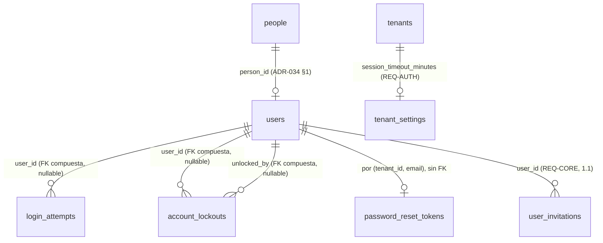

# REQ-AUTH · Modelo de datos

> Alcance: paso **1.2**. Cubre las **dos tablas nuevas** (§A.1, §A.2), la **modificación** de `password_reset_tokens` que exige el issue [#18](https://github.com/pirexia/plataforma-educativa/issues/18) (§A.3), la **columna nueva** de `tenant_settings` (§A.4) y lo que **no** se toca y por qué (§A.5).
>
> Convenciones de `ADR-029`: `TIMESTAMPTZ` siempre, `text` en vez de `varchar(n)`, `bigint` interno más `public_id` ULID **solo donde se expone en API o URL**. Toda tabla de tenant se crea con `App\Support\Tenancy\TenantMigration` (`ADR-033 §6`), que aporta `id`, `tenant_id` con `DEFAULT app.current_tenant_id()`, RLS `ENABLE`+`FORCE`, la política estándar y `UNIQUE (tenant_id, id)`.
>
> **Estado**: **aprobado** el 2026-08-22 (`funcional.md §14`). El rango 5-480 de `session_timeout_minutes` queda confirmado; la ampliación del `CHECK` de `audit_logs.event` **no** la hace este documento (`OPEN-AUTH-02`, la hace `ADR-039`).

---

## A.1 `login_attempts` — telemetría de intentos de acceso (`REQ-AUTH-001`)

Entidad `LoginAttempt`, nombrada explícitamente en la cabecera de la sección 5.2 del documento de requisitos.

Tabla de tenant **append-only** (`TenantMigration::tenantTableAppendOnly()`): sin `deleted_at` (el borrado lógico en una tabla append-only no significa nada), sin `created_by`/`updated_by` (el actor es el propio sujeto del intento) y con `REVOKE UPDATE, DELETE` para `plataforma_app` y `plataforma_platform`. Es la misma decisión que `audit_logs`, por el mismo motivo: un registro de seguridad que la aplicación puede editar no es un registro de seguridad.

| Columna | Tipo | Nulo | Descripción |
|---------|------|------|-------------|
| `id`, `tenant_id` | `bigint` | No | De `tenantTableAppendOnly()` |
| `email` | `text` | No | Correo **tal como se intentó**, normalizado (recortado y en minúsculas). Se guarda exista o no la cuenta: es lo que sostiene el bloqueo fantasma de `RN-AUTH-15` |
| `user_id` | `bigint` | Sí | FK compuesta `(tenant_id, user_id) → users`, declarada a mano por ser opcional (`tenantForeignId()` es `NOT NULL` siempre). `NULL` cuando el correo no corresponde a ninguna cuenta |
| `outcome` | `text` + `CHECK` | No | `exito`, `credenciales_invalidas`, `cuenta_bloqueada`, `estado_no_activo` |
| `attempted_at` | `TIMESTAMPTZ` | No | Momento del intento. Sustituye a `created_at`, igual que `audit_logs.occurred_at` |
| `ip_address` | `inet` | Sí | Tipo nativo, no `text` |
| `user_agent` | `text` | Sí | |
| `request_id` | `text` | Sí | `INV-013`, correlaciona con el log y con `audit_logs` |

**Sin `public_id`.** En 1.2 esta tabla no se expone por ninguna API: no hay endpoint que devuelva un intento. `ADR-029` pide `public_id` en lo que se expone en URL o API, y añadirlo «por si acaso» es lo que `ADR-034 OPEN-13` desaconseja. Si 1.2b o `REQ-BO` construyen la pantalla de accesos, lo añaden entonces (es *expand* puro).

**Sin contraseña ni fragmento suyo**, en ninguna columna ni en ningún caso (`RN-AUTH-05`). No hay «primeros caracteres», ni longitud, ni hash de lo intentado: cualquiera de las tres cosas convierte esta tabla en material de ataque por diccionario si se filtra.

**Los cuatro `outcome` distinguen lo que hay que distinguir**: `credenciales_invalidas` es lo único que incrementa el contador de bloqueo; `estado_no_activo` (credencial correcta sobre usuario `pendiente`/`inactivo`) **no** lo incrementa (`RN-AUTH-24`), y separarlo permite además detectar el caso operativo real de «este profesor no sabe que está dado de baja»; `cuenta_bloqueada` mide la presión sobre una cuenta ya bloqueada, que es la señal de un ataque en curso.

**Política de auditoría**: **no auditable**. Registrarla en `audit_logs` duplicaría cada fila y, en un ataque de fuerza bruta, inundaría la tabla que `REQ-CORE-005` obliga a conservar dos años. Es el mismo criterio con el que `datos.md §A.5` de `REQ-CORE` dejó `idempotency_keys` fuera del *observer*, y está argumentado en `funcional.md §10.2`.

Índices:

| Índice | Consulta que lo necesita |
|--------|---------------------------|
| `(tenant_id, email, attempted_at DESC)` | Recuento de fallos consecutivos desde el último éxito, en **cada** login. Es la consulta caliente del módulo |
| `(tenant_id, attempted_at DESC)` | Purga por retención (§A.7) y pantalla de accesos recientes de 1.2b/1.6 |
| `(tenant_id, user_id, attempted_at DESC)` | «¿Qué accesos ha tenido esta cuenta?», que pedirá 1.2b |

---

## A.2 `account_lockouts` — bloqueo de cuenta (`REQ-AUTH-001`)

Tabla de tenant ordinaria (`TenantMigration::tenantTable()`), con `public_id` ULID porque **sí** se expone: `GET /account-lockouts` y `DELETE /account-lockouts/{public_id}`.

| Columna | Tipo | Nulo | Descripción |
|---------|------|------|-------------|
| `public_id` | ULID | No | `ADR-029` |
| `email` | `text` | No | Correo bloqueado, normalizado. **No** es FK a `users`: el bloqueo fantasma de `RN-AUTH-15` existe para correos sin cuenta |
| `user_id` | `bigint` | Sí | FK compuesta opcional `(tenant_id, user_id) → users`. `NULL` en el bloqueo fantasma |
| `failed_count` | `smallint` | No | Fallos consecutivos que provocaron el bloqueo. Normalmente 5; puede ser mayor si dos peticiones concurrentes cruzan el umbral |
| `locked_at` | `TIMESTAMPTZ` | No | |
| `unlock_token_hash` | `text` | Sí | Hash SHA-256 del token de desbloqueo. `NULL` en el bloqueo fantasma: sin cuenta no hay a quién enviarle el enlace |
| `unlock_token_expires_at` | `TIMESTAMPTZ` | Sí | 24 h por defecto (`RN-AUTH-13`) |
| `unlocked_at` | `TIMESTAMPTZ` | Sí | Informado al levantar el bloqueo, por correo o por administrador |
| `unlocked_by` | `bigint` | Sí | FK compuesta opcional → `users`. `NULL` si el desbloqueo fue por correo del propio titular; informado si fue un administrador |

Restricciones e índices:

- `UNIQUE (tenant_id, email) WHERE unlocked_at IS NULL AND deleted_at IS NULL` — **un solo bloqueo vivo** por correo y tenant (`RN-AUTH-17`), garantizado por índice y no por comprobación de aplicación: dos peticiones que crucen el umbral a la vez lo romperían. Mismo patrón que `user_invitations` en 1.1.
- `UNIQUE (tenant_id, unlock_token_hash)` — total, no parcial: un token de desbloqueo no se reutiliza jamás, igual que un `public_id` (`ADR-034 §6`).
- `CHECK (unlocked_by IS NULL OR unlocked_at IS NOT NULL)` — no se puede registrar quién desbloqueó sin registrar que se desbloqueó.
- Índice `(tenant_id, locked_at DESC)` para el listado de `GET /account-lockouts`.
- Índice `(tenant_id, unlock_token_expires_at)` para la purga de tokens vencidos.

**La fila se conserva tras el desbloqueo** (`RN-AUTH-18`), con `unlocked_at` informado. Es traza: saber que una cuenta estuvo bloqueada tres veces en una semana es una señal de seguridad que se pierde si el desbloqueo borra la fila. El índice único parcial hace que una fila desbloqueada no estorbe a un bloqueo posterior del mismo correo.

**Sin `academic_year_id`**: un bloqueo de cuenta no pertenece a un curso académico (`ADR-034 §4`: o `NOT NULL` o la columna no existe).

**Política de auditoría**: `Selective`.

- Registrados con valor: `failed_count`, `locked_at`, `unlocked_at`, `unlocked_by`, `deleted_at`, `created_by`, `updated_by`.
- `email` se redacta como `identifier`: es un dato personal directo, mismo criterio que `ADR-035` aplicó a `users.email`.
- `unlock_token_hash` lo redacta como `secret` **automáticamente** el patrón `*token*` de `config('audit.secret_attribute_patterns')`, sin declararlo.

Esta política es la que hace que **bloqueo y desbloqueo queden auditados sin ampliar nada**: la creación de la fila es un evento `created` y el desbloqueo un `updated`, ambos del *observer* de 0.9 (`funcional.md §10.1`).

---

## A.3 `password_reset_tokens` — modificación (issue [#18](https://github.com/pirexia/plataforma-educativa/issues/18))

La tabla existe desde 0.8 con `tenant_id`, clave primaria compuesta `(tenant_id, email)`, RLS `ENABLE`+`FORCE` y política de aislamiento. **No es una tabla de `tenantTable()`**: se creó a mano precisamente porque su clave primaria no es `id`.

Estado actual:

| Columna | Tipo | Nulo |
|---------|------|------|
| `tenant_id` | `bigint` | No |
| `email` | `text` | No |
| `token` | `text` | No |
| `created_at` | `TIMESTAMPTZ` | Sí |

### Por qué hay que tocarla

El flujo de §4.5 de `funcional.md` busca **solo por token**, para no meter el correo en el enlace. La columna `token` guarda el hash **bcrypt** que escribe el `DatabaseTokenRepository` de Laravel, y un hash bcrypt no se puede buscar por igualdad: lleva sal aleatoria por diseño. Hace falta una columna consultable.

### Cambio propuesto, en dos entregas (expand/contract, `CLAUDE.md §9`)

**Entrega 1 — *expand*, en 1.2:**

| Columna | Tipo | Nulo | Descripción |
|---------|------|------|-------------|
| `token_hash` | `text` | Sí *(ver abajo)* | **SHA-256** del token en claro. Consultable por igualdad |
| `expires_at` | `TIMESTAMPTZ` | Sí *(ver abajo)* | Caducidad explícita, 60 min por defecto |

Más: `ALTER COLUMN token DROP NOT NULL`, y `CREATE UNIQUE INDEX password_reset_tokens_tenant_token_hash_unique ON password_reset_tokens (tenant_id, token_hash)`.

**Entrega 2 — *contract*, dos versiones después:** `DROP COLUMN token`, y `token_hash`/`expires_at` pasan a `NOT NULL`.

Las dos columnas nuevas nacen **nullable** aunque la aplicación las escriba siempre. Es la disciplina de expand/contract y no una concesión: una columna `NOT NULL` sin valor por defecto en una tabla que la versión anterior sigue escribiendo rompe el despliegue sin interrupción. Que hoy la tabla esté vacía —nunca ha existido un flujo de recuperación que escriba en ella— hace la migración trivial, pero no es motivo para saltarse el patrón: el precedente que se sienta aquí lo copiarán los 51 módulos restantes.

**SHA-256 y no bcrypt**, deliberadamente, y merece el argumento porque parece un debilitamiento y no lo es: bcrypt existe para resistir el ataque por diccionario contra un secreto **elegido por una persona** y de baja entropía. Este token son 32 bytes de un generador criptográfico: 256 bits de entropía real, imposible de atacar por diccionario. Lo que se necesita aquí es un resumen de longitud fija, rápido y **consultable por igualdad**, y SHA-256 lo es. Es exactamente el mismo criterio con el que 1.1 hashea el token de invitación (`IssueUserInvitation`, `hash('sha256', $rawToken)`), y ser coherente con él importa más que la elección concreta.

### Invariantes que se mantienen

- **Clave primaria `(tenant_id, email)` intacta**: garantiza por construcción que hay **como mucho un token vivo por correo y tenant** (`RN-AUTH-11`). Solicitar otro sustituye al anterior con un `UPDATE`/`INSERT ... ON CONFLICT`, sin comprobación de aplicación que alguien pueda olvidar.
- **Un solo uso por desaparición de la fila**: al consumirse, se borra. No hay bandera `used_at` que alguien pueda dejar de comprobar en una consulta futura.
- **Sin `public_id`**: no se expone nunca por API.
- **No auditable por el *observer***: no es un `TenantModel` (su clave primaria no es `id`). Lo que se audita son sus **efectos** sobre `User` (`updated` con `password` redactado como `secret`), y —si se aprueba `OPEN-AUTH-02`— la solicitud como `password_reset_requested`.

---

## A.4 `tenant_settings` — columna nueva (`REQ-AUTH-005` punto 1)

*Expand* puro sobre la tabla de 1.1, anticipado por `REQ-CORE/funcional.md §1.4`.

| Columna | Tipo | Nulo | Defecto | Descripción |
|---------|------|------|---------|-------------|
| `session_timeout_minutes` | `integer` | No | `30` | Minutos de **inactividad** tras los que la sesión expira (`REQ-AUTH-005`) |

- `CHECK (session_timeout_minutes BETWEEN 5 AND 480)`. El rango está pendiente de confirmación en `OPEN-AUTH-06`.
- `NOT NULL DEFAULT 30` es seguro en expand: la versión anterior no conoce la columna y el valor por defecto la rellena para las filas existentes en la misma sentencia.
- Se **añade a la lista de atributos registrados** de la política `Selective` de `TenantSettings`: es una decisión de seguridad del centro y su cambio debe verse en el registro de auditoría con su valor anterior y posterior, no redactado.
- Invalida la caché `tenant:{id}:settings` en la escritura, como cualquier otro campo de la tabla (`RN-CORE-17`).

---

## A.5 Lo que 1.2 **no** toca

| Tabla | Por qué no |
|-------|------------|
| `sessions` | **No se añade `tenant_id` ni RLS.** Es de 1.2b (`funcional.md §1.5`, `OPEN-AUTH-10`). Sigue en `config/tenancy.php` → `shared_tables.framework`. Lo que 1.2 sí hace es guardar el `tenant_id` en el **payload** de la sesión y reverificarlo en cada petición (`RN-AUTH-31`) |
| `users` | Ninguna columna nueva. El bloqueo **no** es una bandera en `users`: si lo fuera, no podría existir para correos sin cuenta y el oráculo de enumeración de `funcional.md §4.4` volvería |
| `users.remember_token` | Se queda como está, sin uso. `OPEN-AUTH-09`: no se implementa «recordarme» y retirar la columna sería una migración destructiva por un beneficio nulo |
| `user_invitations` | Ninguna columna nueva. El canje escribe `accepted_at`, que ya existe desde 1.1 y que 1.1 documentó como *«lo escribe el canje, paso 1.2»* |
| `audit_logs` | Ninguna columna nueva. La ampliación del `CHECK` de `event` está condicionada a `OPEN-AUTH-02` y, si se aprueba, la hace su ADR, no esta especificación |
| **Ninguna tabla de proveedor de identidad** | `identity_providers`, `mfa_factors` y cualquier columna de proveedor externo son 1.3 y 1.4. `ADR-034 OPEN-13`: no se adelanta ninguna columna «por si acaso» |

---

## A.6 Relaciones

Todas las claves foráneas son **compuestas** `(tenant_id, columna) REFERENCES tabla (tenant_id, id)` (`ADR-033 §6`). Las tres de este módulo son **opcionales**, así que se declaran a mano y no con `TenantMigration::tenantForeignId()`, que es `NOT NULL` siempre por decisión de `ADR-034 §4`.

`password_reset_tokens` **no tiene clave foránea a `users`**, y es deliberado: su clave es `(tenant_id, email)`, no `user_id`. Añadir la FK obligaría a resolver el usuario antes de escribir el token y a decidir qué pasa si el correo cambia — cosas que ya resuelven `RN-AUTH-11` y el consumo del evento `UserEmailChanged` (`funcional.md §8.2`), sin acoplar el esquema.

`sessions` no aparece en el diagrama: sigue fuera del sistema de tenancy (§A.5).

---

## A.7 Índices y la consulta que los justifica

| Índice | Consulta |
|--------|----------|
| `login_attempts (tenant_id, email, attempted_at DESC)` | Fallos consecutivos desde el último éxito, en cada intento de login. Es la consulta caliente: se ejecuta antes de verificar ninguna contraseña |
| `login_attempts (tenant_id, attempted_at DESC)` | Purga por retención de 90 días; accesos recientes del centro (1.2b/1.6) |
| `login_attempts (tenant_id, user_id, attempted_at DESC)` | Historial de accesos de una cuenta concreta (1.2b) |
| `account_lockouts (tenant_id, email)` único parcial | Comprobación de bloqueo vivo, en **cada** login, antes de verificar la contraseña. Y la invariante de `RN-AUTH-17` |
| `account_lockouts (tenant_id, unlock_token_hash)` único | Canje del token de desbloqueo: búsqueda exacta por tenant más hash |
| `account_lockouts (tenant_id, locked_at DESC)` | Listado de `GET /account-lockouts`, orden cronológico inverso |
| `account_lockouts (tenant_id, unlock_token_expires_at)` | Purga de tokens de desbloqueo vencidos |
| `password_reset_tokens (tenant_id, token_hash)` único | Restablecimiento: búsqueda **solo por token**, sin correo en la URL (§A.3) |
| `password_reset_tokens (tenant_id, email)` PK | Sustitución del token vivo (`RN-AUTH-11`) y purga por correo al cambiarlo |

**Sin índice sobre `password_reset_tokens.expires_at`**: la tabla tiene, como mucho, una fila por usuario que haya pedido recuperación en la última hora. Un recorrido completo para la purga es más barato que mantener el índice. Se añadirá cuando una medición lo pida, no por anticipación.

**Sin índice nuevo sobre `users`**: la búsqueda de login es por `(tenant_id, email)`, que ya sirve el índice único parcial `users_tenant_email_unique` creado en 0.8.

---

## A.8 Checklist obligatorio

- [x] `tenant_id` presente e indexado como primera columna de las consultas frecuentes — vía `tenantTable()`/`tenantTableAppendOnly()` en las dos tablas nuevas; ya presente en `password_reset_tokens` desde 0.8
- [x] `academic_year_id` — **no aplica** en ninguna: ni un intento de acceso, ni un bloqueo, ni un token de recuperación pertenecen a un curso académico. Por `ADR-034 §4`, la columna no existe (nunca nullable)
- [x] `created_at`/`updated_at`/`deleted_at`/`created_by`/`updated_by` — `account_lockouts` los lleva todos vía `tenantTable()`. `login_attempts` es la excepción deliberada: append-only por `tenantTableAppendOnly()`, con `attempted_at` en lugar de `created_at` y sin autoría de fila (el actor **es** el sujeto). `password_reset_tokens` conserva su forma de 0.8
- [x] Claves foráneas y restricciones declaradas en base de datos — FK compuestas opcionales, `CHECK` de `outcome` y de `session_timeout_minutes`, `CHECK` de coherencia de `unlocked_by`, índices únicos parciales
- [x] Importes en enteros de céntimos — **no aplica**, sin importes
- [x] Fechas en UTC (`TIMESTAMPTZ`) — todas
- [x] Datos de categoría especial en tabla separada y cifrada — **no aplica**: este módulo no trata salud, NEAE ni convivencia (`permisos.md §6`). Sí trata **credenciales**, que van hasheadas y nunca en claro (`RN-AUTH-03`), y **direcciones IP**, que son dato personal y tienen retención acotada (§A.9)
- [x] Particionado evaluado — **`login_attempts` es la única candidata**: es la tabla de mayor crecimiento del módulo y un ataque de fuerza bruta la infla en minutos. Se difiere a propósito con **disparador de revisión escrito**: si supera los 20 millones de filas o si la purga diaria excede su ventana, se convierte a particiones mensuales por rango sobre `attempted_at`, con ADR propio — mismo criterio que `ADR-034 §3` fijó para `audit_logs`. Las otras dos son de bajo crecimiento (una fila por bloqueo, una por solicitud de recuperación viva)
- [x] Toda restricción de unicidad sobre tabla con borrado lógico es **parcial** (`WHERE deleted_at IS NULL`) — cierto en `account_lockouts (tenant_id, email)`. `(tenant_id, unlock_token_hash)` y `(tenant_id, token_hash)` son **totales** a propósito: un token no se reutiliza jamás
- [x] Migraciones aditivas y compatibles con la versión anterior — las dos tablas son nuevas; los dos `ALTER` son *expand* con su *contract* planificado (§A.3, §A.4)

---

## A.9 Retención y supresión

| Tabla | Plazo | Base y mecanismo |
|-------|-------|------------------|
| `login_attempts` | **90 días** | Contiene correo e IP: dato personal tratado por **interés legítimo en la seguridad del tratamiento** (art. 32 RGPD, `RSEC-OWASP-009`). Noventa días es el plazo que permite investigar un incidente detectado tarde sin conservar un mapa indefinido de los horarios de trabajo de la plantilla. `PurgeLoginAttempts` borra físicamente **con el rol propietario**, porque `tenantTableAppendOnly()` revoca `DELETE` a los dos roles de aplicación — igual que la purga de `audit_logs` de `REQ-PRIV-006` |
| `account_lockouts` | **Fila permanente; token a las 24 h** | La traza de que una cuenta estuvo bloqueada es información de seguridad y se conserva. `PurgeUnlockTokens` pone a `NULL` el `unlock_token_hash` y su caducidad cuando vencen, para no acumular material de token sin uso. La fila se elimina con la persona en el flujo de supresión de `ADR-004` |
| `password_reset_tokens` | **1 hora** (la caducidad del token) | Artefacto transitorio. Se borra al consumirse; `PurgeExpiredPasswordResetTokens` retira los vencidos a diario. No se conserva traza de que se pidió recuperación: eso lo registra la auditoría, no esta tabla |
| `tenant_settings.session_timeout_minutes` | Vida del tenant | Configuración de la organización, no dato personal |

**Derecho de supresión** (`ADR-004`, `REQ-PRIV-006`): la anonimización de una persona (nivel 2) afecta a `people`/`users`. Sobre estas tablas el efecto hay que mirarlo de frente, porque **dos de ellas guardan una copia desnormalizada del correo**, que es precisamente el patrón que `ADR-034 §3` evitó en `audit_logs`:

- `login_attempts.email` y `account_lockouts.email` **no** se resuelven por FK. Es inevitable: existen para correos que no corresponden a ninguna cuenta (`RN-AUTH-15`), así que no hay entidad a la que apuntar.
- La consecuencia es que anonimizar a una persona **no** borra su correo de estas dos tablas. Se compensa con la retención: `login_attempts` desaparece sola en 90 días, y la supresión de `account_lockouts` entra en el flujo de supresión de la persona como borrado de fila, no como anonimización de columna.
- Es la misma solución que `ADR-035` dio para `audit_logs.changes`: **la supresión no se ejerce editando la fila, se ejerce por retención**. Se anota aquí explícitamente para que `REQ-PRIV-006` la encuentre escrita y no la descubra.
