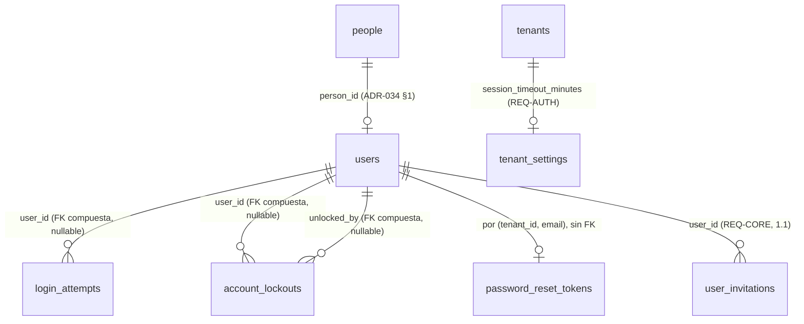
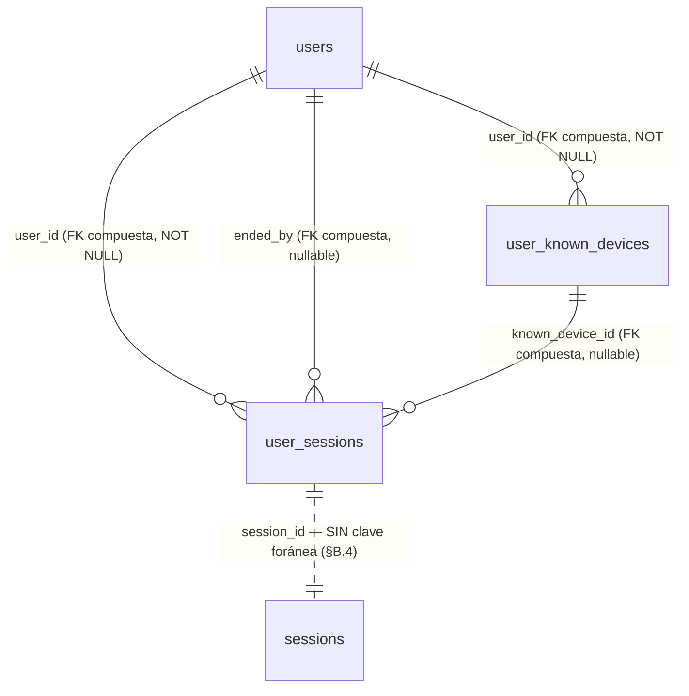

# REQ-AUTH · Modelo de datos

> **Estructura**: las secciones **§A.1 a §A.9** son el paso **1.2**, cerrado el 2026-08-25. La **Parte B** (`§B.1` en adelante) es el paso **1.2b** (`funcional.md` Parte B), **pendiente de aprobación**.

> Alcance: paso **1.2**. Cubre las **dos tablas nuevas** (§A.1, §A.2), la **modificación** de `password_reset_tokens` que exige el issue [#18](https://github.com/pirexia/plataforma-educativa/issues/18) (§A.3), la **columna nueva** de `tenant_settings` (§A.4) y lo que **no** se toca y por qué (§A.5).
>
> Convenciones de `ADR-029`: `TIMESTAMPTZ` siempre, `text` en vez de `varchar(n)`, `bigint` interno más `public_id` ULID **solo donde se expone en API o URL**. Toda tabla de tenant se crea con `App\Support\Tenancy\TenantMigration` (`ADR-033 §6`), que aporta `id`, `tenant_id` con `DEFAULT app.current_tenant_id()`, RLS `ENABLE`+`FORCE`, la política estándar y `UNIQUE (tenant_id, id)`.
>
> **Estado**: **aprobado** el 2026-08-22 (`funcional.md §14`). El rango 5-480 de `session_timeout_minutes` queda confirmado; la ampliación del `CHECK` de `audit_logs.event` **no** la hace este documento (`OPEN-AUTH-02`, la hace `ADR-039`).

---

## A.1 `login_attempts` — telemetría de intentos de acceso (`REQ-AUTH-001`)

Entidad `LoginAttempt`, nombrada explícitamente en la cabecera de la sección 5.2 del documento de requisitos.

Tabla de tenant **append-only** (`TenantMigration::tenantTableAppendOnly()`): sin `deleted_at` (el borrado lógico en una tabla append-only no significa nada), sin `created_by`/`updated_by` (el actor es el propio sujeto del intento) y con `REVOKE UPDATE, DELETE` para `plataforma_app` y `plataforma_platform`. Es la misma decisión que `audit_logs`, por el mismo motivo: un registro de seguridad que la aplicación puede editar no es un registro de seguridad.

| Columna | Tipo | Nulo | Descripción |
|---------|------|------|-------------|
| `id`, `tenant_id` | `bigint` | No | De `tenantTableAppendOnly()` |
| `email` | `text` | No | Correo **tal como se intentó**, normalizado (recortado y en minúsculas). Se guarda exista o no la cuenta: es lo que sostiene el bloqueo fantasma de `RN-AUTH-15` |
| `user_id` | `bigint` | Sí | FK compuesta `(tenant_id, user_id) → users`, declarada a mano por ser opcional (`tenantForeignId()` es `NOT NULL` siempre). `NULL` cuando el correo no corresponde a ninguna cuenta |
| `outcome` | `text` + `CHECK` | No | `exito`, `credenciales_invalidas`, `cuenta_bloqueada`, `estado_no_activo` |
| `attempted_at` | `TIMESTAMPTZ` | No | Momento del intento. Sustituye a `created_at`, igual que `audit_logs.occurred_at` |
| `ip_address` | `inet` | Sí | Tipo nativo, no `text` |
| `user_agent` | `text` | Sí | |
| `request_id` | `text` | Sí | `INV-013`, correlaciona con el log y con `audit_logs` |

**`login_attempts` vs. `audit_logs.event = 'login'`** (`ADR-039` §9 punto 4): son cosas distintas, no una redundancia. `login_attempts` registra **todo intento**, con éxito o sin él (`outcome`), y existe para sostener el bloqueo por intentos fallidos (`RN-AUTH-14`). `audit_logs` con `event = 'login'` registra solo **accesos consumados** (sesión creada de verdad), con `actor_type = 'user'` porque en ese punto ya hay un usuario autenticado. Un intento fallido nunca genera fila en `audit_logs`; un acceso consumado genera una fila en cada tabla. `request_id` es la columna que correlaciona ambas filas (junto con el log de aplicación) cuando hace falta reconstruir qué pasó en una petición concreta.

**Sin `public_id`.** En 1.2 esta tabla no se expone por ninguna API: no hay endpoint que devuelva un intento. `ADR-029` pide `public_id` en lo que se expone en URL o API, y añadirlo «por si acaso» es lo que `ADR-034 OPEN-13` desaconseja. Si 1.2b o `REQ-BO` construyen la pantalla de accesos, lo añaden entonces (es *expand* puro).

**Sin contraseña ni fragmento suyo**, en ninguna columna ni en ningún caso (`RN-AUTH-05`). No hay «primeros caracteres», ni longitud, ni hash de lo intentado: cualquiera de las tres cosas convierte esta tabla en material de ataque por diccionario si se filtra.

**Los cuatro `outcome` distinguen lo que hay que distinguir**: `credenciales_invalidas` es lo único que incrementa el contador de bloqueo; `estado_no_activo` (credencial correcta sobre usuario `pendiente`/`inactivo`) **no** lo incrementa (`RN-AUTH-24`), y separarlo permite además detectar el caso operativo real de «este profesor no sabe que está dado de baja»; `cuenta_bloqueada` mide la presión sobre una cuenta ya bloqueada, que es la señal de un ataque en curso.

**Política de auditoría**: **no auditable**. Registrarla en `audit_logs` duplicaría cada fila y, en un ataque de fuerza bruta, inundaría la tabla que `REQ-CORE-005` obliga a conservar dos años. Es el mismo criterio con el que `datos.md §A.5` de `REQ-CORE` dejó `idempotency_keys` fuera del *observer*, y está argumentado en `funcional.md §10.2`.

Índices:

| Índice | Consulta que lo necesita |
|--------|---------------------------|
| `(tenant_id, email, attempted_at DESC)` | Recuento de fallos consecutivos desde el último éxito, en **cada** login. Es la consulta caliente del módulo |
| `(tenant_id, attempted_at DESC)` | Purga por retención (§A.7) y pantalla de accesos recientes de 1.2b/1.6 |
| `(tenant_id, user_id, attempted_at DESC)` | «¿Qué accesos ha tenido esta cuenta?», que pedirá 1.2b |

---

## A.2 `account_lockouts` — bloqueo de cuenta (`REQ-AUTH-001`)

Tabla de tenant ordinaria (`TenantMigration::tenantTable()`), con `public_id` ULID porque **sí** se expone: `GET /account-lockouts` y `DELETE /account-lockouts/{public_id}`.

| Columna | Tipo | Nulo | Descripción |
|---------|------|------|-------------|
| `public_id` | ULID | No | `ADR-029` |
| `email` | `text` | No | Correo bloqueado, normalizado. **No** es FK a `users`: el bloqueo fantasma de `RN-AUTH-15` existe para correos sin cuenta |
| `user_id` | `bigint` | Sí | FK compuesta opcional `(tenant_id, user_id) → users`. `NULL` en el bloqueo fantasma |
| `failed_count` | `smallint` | No | Fallos consecutivos que provocaron el bloqueo. Normalmente 5; puede ser mayor si dos peticiones concurrentes cruzan el umbral |
| `locked_at` | `TIMESTAMPTZ` | No | |
| `unlock_token_hash` | `text` | Sí | Hash SHA-256 del token de desbloqueo. `NULL` en el bloqueo fantasma: sin cuenta no hay a quién enviarle el enlace |
| `unlock_token_expires_at` | `TIMESTAMPTZ` | Sí | 24 h por defecto (`RN-AUTH-13`) |
| `unlocked_at` | `TIMESTAMPTZ` | Sí | Informado al levantar el bloqueo, por correo o por administrador |
| `unlocked_by` | `bigint` | Sí | FK compuesta opcional → `users`. `NULL` si el desbloqueo fue por correo del propio titular; informado si fue un administrador |

Restricciones e índices:

- `UNIQUE (tenant_id, email) WHERE unlocked_at IS NULL AND deleted_at IS NULL` — **un solo bloqueo vivo** por correo y tenant (`RN-AUTH-17`), garantizado por índice y no por comprobación de aplicación: dos peticiones que crucen el umbral a la vez lo romperían. Mismo patrón que `user_invitations` en 1.1.
- `UNIQUE (tenant_id, unlock_token_hash)` — total, no parcial: un token de desbloqueo no se reutiliza jamás, igual que un `public_id` (`ADR-034 §6`).
- `CHECK (unlocked_by IS NULL OR unlocked_at IS NOT NULL)` — no se puede registrar quién desbloqueó sin registrar que se desbloqueó.
- Índice `(tenant_id, locked_at DESC)` para el listado de `GET /account-lockouts`.
- Índice `(tenant_id, unlock_token_expires_at)` para la purga de tokens vencidos.

**La fila se conserva tras el desbloqueo** (`RN-AUTH-18`), con `unlocked_at` informado. Es traza: saber que una cuenta estuvo bloqueada tres veces en una semana es una señal de seguridad que se pierde si el desbloqueo borra la fila. El índice único parcial hace que una fila desbloqueada no estorbe a un bloqueo posterior del mismo correo.

**Sin `academic_year_id`**: un bloqueo de cuenta no pertenece a un curso académico (`ADR-034 §4`: o `NOT NULL` o la columna no existe).

**Política de auditoría**: `Selective`.

- Registrados con valor: `failed_count`, `locked_at`, `unlocked_at`, `unlocked_by`, `deleted_at`, `created_by`, `updated_by`.
- `email` se redacta como `identifier`: es un dato personal directo, mismo criterio que `ADR-035` aplicó a `users.email`.
- `unlock_token_hash` lo redacta como `secret` **automáticamente** el patrón `*token*` de `config('audit.secret_attribute_patterns')`, sin declararlo.

Esta política es la que hace que **bloqueo y desbloqueo queden auditados sin ampliar nada**: la creación de la fila es un evento `created` y el desbloqueo un `updated`, ambos del *observer* de 0.9 (`funcional.md §10.1`).

---

## A.3 `password_reset_tokens` — modificación (issue [#18](https://github.com/pirexia/plataforma-educativa/issues/18))

La tabla existe desde 0.8 con `tenant_id`, clave primaria compuesta `(tenant_id, email)`, RLS `ENABLE`+`FORCE` y política de aislamiento. **No es una tabla de `tenantTable()`**: se creó a mano precisamente porque su clave primaria no es `id`.

Estado actual:

| Columna | Tipo | Nulo |
|---------|------|------|
| `tenant_id` | `bigint` | No |
| `email` | `text` | No |
| `token` | `text` | No |
| `created_at` | `TIMESTAMPTZ` | Sí |

### Por qué hay que tocarla

El flujo de §4.5 de `funcional.md` busca **solo por token**, para no meter el correo en el enlace. La columna `token` guarda el hash **bcrypt** que escribe el `DatabaseTokenRepository` de Laravel, y un hash bcrypt no se puede buscar por igualdad: lleva sal aleatoria por diseño. Hace falta una columna consultable.

### Cambio propuesto, en dos entregas (expand/contract, `CLAUDE.md §9`)

**Entrega 1 — *expand*, en 1.2:**

| Columna | Tipo | Nulo | Descripción |
|---------|------|------|-------------|
| `token_hash` | `text` | Sí *(ver abajo)* | **SHA-256** del token en claro. Consultable por igualdad |
| `expires_at` | `TIMESTAMPTZ` | Sí *(ver abajo)* | Caducidad explícita, 60 min por defecto |

Más: `ALTER COLUMN token DROP NOT NULL`, y `CREATE UNIQUE INDEX password_reset_tokens_tenant_token_hash_unique ON password_reset_tokens (tenant_id, token_hash)`.

**Entrega 2 — *contract*, dos versiones después:** `DROP COLUMN token`, y `token_hash`/`expires_at` pasan a `NOT NULL`.

Las dos columnas nuevas nacen **nullable** aunque la aplicación las escriba siempre. Es la disciplina de expand/contract y no una concesión: una columna `NOT NULL` sin valor por defecto en una tabla que la versión anterior sigue escribiendo rompe el despliegue sin interrupción. Que hoy la tabla esté vacía —nunca ha existido un flujo de recuperación que escriba en ella— hace la migración trivial, pero no es motivo para saltarse el patrón: el precedente que se sienta aquí lo copiarán los 51 módulos restantes.

**SHA-256 y no bcrypt**, deliberadamente, y merece el argumento porque parece un debilitamiento y no lo es: bcrypt existe para resistir el ataque por diccionario contra un secreto **elegido por una persona** y de baja entropía. Este token son 32 bytes de un generador criptográfico: 256 bits de entropía real, imposible de atacar por diccionario. Lo que se necesita aquí es un resumen de longitud fija, rápido y **consultable por igualdad**, y SHA-256 lo es. Es exactamente el mismo criterio con el que 1.1 hashea el token de invitación (`IssueUserInvitation`, `hash('sha256', $rawToken)`), y ser coherente con él importa más que la elección concreta.

### Invariantes que se mantienen

- **Clave primaria `(tenant_id, email)` intacta**: garantiza por construcción que hay **como mucho un token vivo por correo y tenant** (`RN-AUTH-11`). Solicitar otro sustituye al anterior con un `UPDATE`/`INSERT ... ON CONFLICT`, sin comprobación de aplicación que alguien pueda olvidar.
- **Un solo uso por desaparición de la fila**: al consumirse, se borra. No hay bandera `used_at` que alguien pueda dejar de comprobar en una consulta futura.
- **Sin `public_id`**: no se expone nunca por API.
- **No auditable por el *observer***: no es un `TenantModel` (su clave primaria no es `id`). Lo que se audita son sus **efectos** sobre `User` (`updated` con `password` redactado como `secret`), y —si se aprueba `OPEN-AUTH-02`— la solicitud como `password_reset_requested`.

---

## A.4 `tenant_settings` — columna nueva (`REQ-AUTH-005` punto 1)

*Expand* puro sobre la tabla de 1.1, anticipado por `REQ-CORE/funcional.md §1.4`.

| Columna | Tipo | Nulo | Defecto | Descripción |
|---------|------|------|---------|-------------|
| `session_timeout_minutes` | `integer` | No | `30` | Minutos de **inactividad** tras los que la sesión expira (`REQ-AUTH-005`) |

- `CHECK (session_timeout_minutes BETWEEN 5 AND 480)`. El rango está pendiente de confirmación en `OPEN-AUTH-06`.
- `NOT NULL DEFAULT 30` es seguro en expand: la versión anterior no conoce la columna y el valor por defecto la rellena para las filas existentes en la misma sentencia.
- Se **añade a la lista de atributos registrados** de la política `Selective` de `TenantSettings`: es una decisión de seguridad del centro y su cambio debe verse en el registro de auditoría con su valor anterior y posterior, no redactado.
- Invalida la caché `tenant:{id}:settings` en la escritura, como cualquier otro campo de la tabla (`RN-CORE-17`).

---

## A.5 Lo que 1.2 **no** toca

| Tabla | Por qué no |
|-------|------------|
| `sessions` | **No se añade `tenant_id` ni RLS.** Es de 1.2b (`funcional.md §1.5`, `OPEN-AUTH-10`). Sigue en `config/tenancy.php` → `shared_tables.framework`. Lo que 1.2 sí hace es guardar el `tenant_id` en el **payload** de la sesión y reverificarlo en cada petición (`RN-AUTH-31`) |
| `users` | Ninguna columna nueva. El bloqueo **no** es una bandera en `users`: si lo fuera, no podría existir para correos sin cuenta y el oráculo de enumeración de `funcional.md §4.4` volvería |
| `users.remember_token` | Se queda como está, sin uso. `OPEN-AUTH-09`: no se implementa «recordarme» y retirar la columna sería una migración destructiva por un beneficio nulo |
| `user_invitations` | Ninguna columna nueva. El canje escribe `accepted_at`, que ya existe desde 1.1 y que 1.1 documentó como *«lo escribe el canje, paso 1.2»* |
| `audit_logs` | Ninguna columna nueva. La ampliación del `CHECK` de `event` está condicionada a `OPEN-AUTH-02` y, si se aprueba, la hace su ADR, no esta especificación |
| **Ninguna tabla de proveedor de identidad** | `identity_providers`, `mfa_factors` y cualquier columna de proveedor externo son 1.3 y 1.4. `ADR-034 OPEN-13`: no se adelanta ninguna columna «por si acaso» |

---

## A.6 Relaciones

Todas las claves foráneas son **compuestas** `(tenant_id, columna) REFERENCES tabla (tenant_id, id)` (`ADR-033 §6`). Las tres de este módulo son **opcionales**, así que se declaran a mano y no con `TenantMigration::tenantForeignId()`, que es `NOT NULL` siempre por decisión de `ADR-034 §4`.

`password_reset_tokens` **no tiene clave foránea a `users`**, y es deliberado: su clave es `(tenant_id, email)`, no `user_id`. Añadir la FK obligaría a resolver el usuario antes de escribir el token y a decidir qué pasa si el correo cambia — cosas que ya resuelven `RN-AUTH-11` y el consumo del evento `UserEmailChanged` (`funcional.md §8.2`), sin acoplar el esquema.

`sessions` no aparece en el diagrama: sigue fuera del sistema de tenancy (§A.5).

---

## A.7 Índices y la consulta que los justifica

| Índice | Consulta |
|--------|----------|
| `login_attempts (tenant_id, email, attempted_at DESC)` | Fallos consecutivos desde el último éxito, en cada intento de login. Es la consulta caliente: se ejecuta antes de verificar ninguna contraseña |
| `login_attempts (tenant_id, attempted_at DESC)` | Purga por retención de 90 días; accesos recientes del centro (1.2b/1.6) |
| `login_attempts (tenant_id, user_id, attempted_at DESC)` | Historial de accesos de una cuenta concreta (1.2b) |
| `account_lockouts (tenant_id, email)` único parcial | Comprobación de bloqueo vivo, en **cada** login, antes de verificar la contraseña. Y la invariante de `RN-AUTH-17` |
| `account_lockouts (tenant_id, unlock_token_hash)` único | Canje del token de desbloqueo: búsqueda exacta por tenant más hash |
| `account_lockouts (tenant_id, locked_at DESC)` | Listado de `GET /account-lockouts`, orden cronológico inverso |
| `account_lockouts (tenant_id, unlock_token_expires_at)` | Purga de tokens de desbloqueo vencidos |
| `password_reset_tokens (tenant_id, token_hash)` único | Restablecimiento: búsqueda **solo por token**, sin correo en la URL (§A.3) |
| `password_reset_tokens (tenant_id, email)` PK | Sustitución del token vivo (`RN-AUTH-11`) y purga por correo al cambiarlo |

**Sin índice sobre `password_reset_tokens.expires_at`**: la tabla tiene, como mucho, una fila por usuario que haya pedido recuperación en la última hora. Un recorrido completo para la purga es más barato que mantener el índice. Se añadirá cuando una medición lo pida, no por anticipación.

**Sin índice nuevo sobre `users`**: la búsqueda de login es por `(tenant_id, email)`, que ya sirve el índice único parcial `users_tenant_email_unique` creado en 0.8.

---

## A.8 Checklist obligatorio

- [x] `tenant_id` presente e indexado como primera columna de las consultas frecuentes — vía `tenantTable()`/`tenantTableAppendOnly()` en las dos tablas nuevas; ya presente en `password_reset_tokens` desde 0.8
- [x] `academic_year_id` — **no aplica** en ninguna: ni un intento de acceso, ni un bloqueo, ni un token de recuperación pertenecen a un curso académico. Por `ADR-034 §4`, la columna no existe (nunca nullable)
- [x] `created_at`/`updated_at`/`deleted_at`/`created_by`/`updated_by` — `account_lockouts` los lleva todos vía `tenantTable()`. `login_attempts` es la excepción deliberada: append-only por `tenantTableAppendOnly()`, con `attempted_at` en lugar de `created_at` y sin autoría de fila (el actor **es** el sujeto). `password_reset_tokens` conserva su forma de 0.8
- [x] Claves foráneas y restricciones declaradas en base de datos — FK compuestas opcionales, `CHECK` de `outcome` y de `session_timeout_minutes`, `CHECK` de coherencia de `unlocked_by`, índices únicos parciales
- [x] Importes en enteros de céntimos — **no aplica**, sin importes
- [x] Fechas en UTC (`TIMESTAMPTZ`) — todas
- [x] Datos de categoría especial en tabla separada y cifrada — **no aplica**: este módulo no trata salud, NEAE ni convivencia (`permisos.md §6`). Sí trata **credenciales**, que van hasheadas y nunca en claro (`RN-AUTH-03`), y **direcciones IP**, que son dato personal y tienen retención acotada (§A.9)
- [x] Particionado evaluado — **`login_attempts` es la única candidata**: es la tabla de mayor crecimiento del módulo y un ataque de fuerza bruta la infla en minutos. Se difiere a propósito con **disparador de revisión escrito**: si supera los 20 millones de filas o si la purga diaria excede su ventana, se convierte a particiones mensuales por rango sobre `attempted_at`, con ADR propio — mismo criterio que `ADR-034 §3` fijó para `audit_logs`. Las otras dos son de bajo crecimiento (una fila por bloqueo, una por solicitud de recuperación viva)
- [x] Toda restricción de unicidad sobre tabla con borrado lógico es **parcial** (`WHERE deleted_at IS NULL`) — cierto en `account_lockouts (tenant_id, email)`. `(tenant_id, unlock_token_hash)` y `(tenant_id, token_hash)` son **totales** a propósito: un token no se reutiliza jamás
- [x] Migraciones aditivas y compatibles con la versión anterior — las dos tablas son nuevas; los dos `ALTER` son *expand* con su *contract* planificado (§A.3, §A.4)

---

## A.9 Retención y supresión

| Tabla | Plazo | Base y mecanismo |
|-------|-------|------------------|
| `login_attempts` | **90 días** | Contiene correo e IP: dato personal tratado por **interés legítimo en la seguridad del tratamiento** (art. 32 RGPD, `RSEC-OWASP-009`). Noventa días es el plazo que permite investigar un incidente detectado tarde sin conservar un mapa indefinido de los horarios de trabajo de la plantilla. `PurgeLoginAttempts` borra físicamente **con el rol propietario**, porque `tenantTableAppendOnly()` revoca `DELETE` a los dos roles de aplicación — igual que la purga de `audit_logs` de `REQ-PRIV-006` |
| `account_lockouts` | **Fila permanente; token a las 24 h** | La traza de que una cuenta estuvo bloqueada es información de seguridad y se conserva. `PurgeUnlockTokens` pone a `NULL` el `unlock_token_hash` y su caducidad cuando vencen, para no acumular material de token sin uso. La fila se elimina con la persona en el flujo de supresión de `ADR-004` |
| `password_reset_tokens` | **1 hora** (la caducidad del token) | Artefacto transitorio. Se borra al consumirse; `PurgeExpiredPasswordResetTokens` retira los vencidos a diario. No se conserva traza de que se pidió recuperación: eso lo registra la auditoría, no esta tabla |
| `tenant_settings.session_timeout_minutes` | Vida del tenant | Configuración de la organización, no dato personal |

**Derecho de supresión** (`ADR-004`, `REQ-PRIV-006`): la anonimización de una persona (nivel 2) afecta a `people`/`users`. Sobre estas tablas el efecto hay que mirarlo de frente, porque **dos de ellas guardan una copia desnormalizada del correo**, que es precisamente el patrón que `ADR-034 §3` evitó en `audit_logs`:

- `login_attempts.email` y `account_lockouts.email` **no** se resuelven por FK. Es inevitable: existen para correos que no corresponden a ninguna cuenta (`RN-AUTH-15`), así que no hay entidad a la que apuntar.
- La consecuencia es que anonimizar a una persona **no** borra su correo de estas dos tablas. Se compensa con la retención: `login_attempts` desaparece sola en 90 días, y la supresión de `account_lockouts` entra en el flujo de supresión de la persona como borrado de fila, no como anonimización de columna.
- Es la misma solución que `ADR-035` dio para `audit_logs.changes`: **la supresión no se ejerce editando la fila, se ejerce por retención**. Se anota aquí explícitamente para que `REQ-PRIV-006` la encuentre escrita y no la descubra.

---
---

# Parte B · Paso 1.2b · Modelo de datos

> Alcance: paso **1.2b** (`funcional.md` Parte B). Cubre **dos tablas de tenant nuevas** (§B.1, §B.2), lo que **no** se toca y por qué (§B.3), y la consecuencia de todo ello sobre retención y supresión (§B.7).
>
> Mismas convenciones de `ADR-029` y `ADR-033 §6` que la Parte A: `TIMESTAMPTZ`, `text`, `bigint` interno más `public_id` ULID **solo donde se expone en API o URL**, y creación por `App\Support\Tenancy\TenantMigration`.
>
> **Estado**: **propuesta**, pendiente de `funcional.md §B.14`. Cinco preguntas abiertas; ninguna cambia estas dos tablas salvo `OPEN-AUTH-13`, que solo decide si `location_label` nace ahora o después.

---

## B.1 `user_known_devices` — dispositivos reconocidos de una cuenta (`REQ-AUTH-005` punto 4)

Entidad `UserKnownDevice`. Tabla de tenant ordinaria (`TenantMigration::tenantTable()`).

**Se crea antes que `user_sessions`**, porque esa la referencia por clave foránea.

| Columna | Tipo | Nulo | Descripción |
|---------|------|------|-------------|
| `id`, `tenant_id` | `bigint` | No | De `tenantTable()` |
| `user_id` | `bigint` | No | `tenantForeignId()`: FK compuesta `(tenant_id, user_id) → users`, **obligatoria**. Un dispositivo sin cuenta no significa nada |
| `device_token_hash` | `text` | No | **SHA-256** del valor de la cookie `pge_device`. El valor en claro **no está en base de datos** (`RN-AUTH-45`, hereda `RN-AUTH-09`) |
| `first_seen_at` | `TIMESTAMPTZ` | No | Primer acceso desde este dispositivo |
| `last_seen_at` | `TIMESTAMPTZ` | No | Último. Se actualiza en cada login desde él |
| `login_count` | `integer` | No | Accesos desde este dispositivo. Por defecto `1` |
| `label` | `text` | Sí | Descripción legible del primer avistamiento («Chrome · Windows · escritorio»). Solo para mostrar |
| `last_ip_address` | `inet` | Sí | Tipo nativo, no `text`, igual que `login_attempts.ip_address` |
| `alerted_at` | `TIMESTAMPTZ` | Sí | Cuándo se avisó al titular. `NULL` si el tope diario de `RN-AUTH-46` impidió el aviso — y esa distinción importa: un dispositivo registrado sin avisar es exactamente lo que hay que poder auditar después |

**Sin `public_id`.** Ningún endpoint de 1.2b devuelve un dispositivo: el panel lista **sesiones**, y la descripción del dispositivo viaja dentro de la sesión, no como recurso propio. `ADR-029` pide `public_id` en lo que se expone en URL o API, y `ADR-034 OPEN-13` desaconseja añadirlo «por si acaso». Es el mismo criterio con el que §A.1 lo negó a `login_attempts`. Si 1.3 construye «dispositivos de confianza» como recurso propio, lo añade entonces: es *expand* puro.

**Sin `academic_year_id`**: un dispositivo no pertenece a un curso académico (`ADR-034 §4`: o `NOT NULL` o la columna no existe).

Restricciones e índices:

- `UNIQUE (tenant_id, user_id, device_token_hash) WHERE deleted_at IS NULL` — **parcial**, no total, y a propósito. La regla general de §A.8 es que toda unicidad sobre tabla con borrado lógico es parcial; la excepción que §A.2 hizo para los hashes de token no aplica aquí, porque un dispositivo **sí puede volver**: si un día se decide «olvidar» un dispositivo y la misma cookie reaparece, tiene que poder registrarse otra vez —y disparar su aviso, que es lo correcto— en vez de chocar contra un índice.
- `CHECK (login_count >= 1)`.
- Índice `(tenant_id, user_id, last_seen_at DESC)` — «¿qué dispositivos tiene esta cuenta?», y el camino de la purga por usuario.
- Índice `(tenant_id, last_seen_at)` — purga por antigüedad (§B.7).

**La consulta caliente es la del índice único**: en **cada** login con cookie presente se busca por `(tenant_id, user_id, device_token_hash)`. El índice único parcial la sirve entera; no hace falta otro.

**Política de auditoría**: `Selective`.

- Registrados con valor: `first_seen_at`, `last_seen_at`, `login_count`, `alerted_at`, `label`, `deleted_at`, `created_by`, `updated_by`.
- `device_token_hash` lo redacta como `secret` **automáticamente** el patrón `*token*` de `config('audit.secret_attribute_patterns')`, sin declararlo. Es el motivo real de que la columna se llame así y no `device_id`: el nombre es lo que dispara la defensa en profundidad.
- `last_ip_address` se redacta como `identifier`: es dato personal directo, mismo criterio que `account_lockouts.email` (§A.2) y que `users.email` en `ADR-035`.

Con eso, **el alta de un dispositivo y el aviso al titular quedan auditados sin una sola llamada manual** (`funcional.md §B.10`): el alta es un `created` y el aviso un `updated`, los dos del *observer* de 0.9.

---

## B.2 `user_sessions` — sesiones de usuario con metadatos (`REQ-AUTH-005` puntos 2 y 3)

Entidad `UserSession`. Tabla de tenant ordinaria (`TenantMigration::tenantTable()`), con `public_id` ULID porque **sí** se expone: `GET /auth/sessions` y `DELETE /auth/sessions/{public_id}`.

Es la tabla del módulo, **complementaria** de la `sessions` del framework y deliberadamente separada de ella. El argumento entero está en `funcional.md §B.2.2` y no se repite; el resumen es que el identificador de sesión es una credencial portadora y el `public_id` es su nombre público, y las dos cosas no van en la misma fila.

| Columna | Tipo | Nulo | Descripción |
|---------|------|------|-------------|
| `id`, `tenant_id` | `bigint` | No | De `tenantTable()` |
| `public_id` | ULID | No | `ADR-029`. **El único identificador que sale por la API** (`RN-AUTH-40`) |
| `user_id` | `bigint` | No | `tenantForeignId()`, obligatoria. Una sesión anónima **no tiene fila aquí** (`funcional.md §B.4.1`) |
| `session_id` | `text` | No | Identificador de sesión del framework, **posterior** a la regeneración de `RN-AUTH-32`. Sin FK (§B.4) |
| `started_at` | `TIMESTAMPTZ` | No | Momento del login que la creó |
| `ip_address` | `inet` | Sí | IP de origen del login. Tipo nativo |
| `user_agent` | `text` | Sí | Cabecera cruda, **truncada a 1024 caracteres**. Sin truncado, una cabecera hostil de 64 KB entra tal cual en una tabla de tenant |
| `client_browser` | `text` | Sí | Derivado del `User-Agent`. Solo para mostrar (`funcional.md §B.6.4`) |
| `client_platform` | `text` | Sí | Ídem |
| `client_device_type` | `text` + `CHECK` | Sí | `escritorio`, `movil`, `tableta`, `bot`, `desconocido` |
| `location_label` | `text` | Sí | **Siempre `NULL` en 1.2b** (`RN-AUTH-47`, `OPEN-AUTH-13`). El hueco del requisito, escrito en el esquema para que se vea que está a medias |
| `known_device_id` | `bigint` | Sí | FK compuesta **opcional** `(tenant_id, known_device_id) → user_known_devices`, declarada a mano. `NULL` cuando el navegador no admitió la cookie |
| `ended_at` | `TIMESTAMPTZ` | Sí | Momento en que dejó de estar viva |
| `end_reason` | `text` + `CHECK` | Sí | Las **siete** razones de `funcional.md §B.4.6` |
| `ended_by` | `bigint` | Sí | FK compuesta opcional → `users`. Quién la cerró; `NULL` en los cierres automáticos |

**Sin `academic_year_id`**, por el mismo motivo que las tres tablas de la Parte A.

**Sin columna de última actividad.** Es la decisión de rendimiento del paso y merece el argumento: sería lo evidente —el panel muestra «última actividad»— y sería un `UPDATE` **en cada petición autenticada del sistema**. `sessions.last_activity` ya guarda ese dato, lo mantiene el framework sin coste añadido, y el listado (`api.md §B.2`) lo lee de allí uniendo por `session_id`. Duplicarlo aquí compraría una columna a cambio de convertir cada lectura de cualquier endpoint del producto en una escritura.

Restricciones e índices:

| Restricción / índice | Qué garantiza o qué consulta sirve |
|----------------------|------------------------------------|
| `UNIQUE (tenant_id, session_id) WHERE ended_at IS NULL AND deleted_at IS NULL` | **Una sola fila viva por sesión** (`RN-AUTH-39`), por índice y no por comprobación de aplicación. Mismo patrón que `account_lockouts` en §A.2 |
| `UNIQUE (public_id)` | `ADR-029`, igual que `account_lockouts` |
| `CHECK ((ended_at IS NULL) = (end_reason IS NULL))` | No hay cierre sin razón ni razón sin cierre (`RN-AUTH-44`). Es más fuerte que el `CHECK` equivalente de `account_lockouts`, que solo cubre una dirección — y esa asimetría fue precisamente lo que dejó pasar la ausencia de `unlock_reason` hasta la implementación |
| `CHECK (ended_by IS NULL OR ended_at IS NOT NULL)` | No se registra quién cerró sin registrar que se cerró |
| `CHECK (end_reason IN ('logout', 'revocada_usuario', 'inactividad', 'caducidad', 'cambio_credencial', 'baja_usuario', 'tenant_incoherente'))` | Siete valores, **cada uno con un productor real** (`funcional.md §B.4.6`). Ni uno de más: el issue [#61](https://github.com/pirexia/plataforma-educativa/issues/61) es lo que pasa cuando se reutiliza un valor por no tener el correcto |
| `CHECK (client_device_type IN ('escritorio', 'movil', 'tableta', 'bot', 'desconocido'))` | |
| `(tenant_id, user_id, started_at DESC) WHERE ended_at IS NULL AND deleted_at IS NULL` | **La consulta del panel** (`GET /auth/sessions`). Es la única caliente de esta tabla |
| `(tenant_id, ended_at)` | Purga por retención (§B.7) y la tarea `CloseOrphanedUserSessions` |
| `(tenant_id, known_device_id)` | Integridad referencial y «¿qué sesiones vinieron de este dispositivo?» |

**Política de auditoría**: `Selective`, y aquí hay que ser explícito porque un descuido es una fuga.

- Registrados con valor: `started_at`, `ended_at`, `end_reason`, `ended_by`, `deleted_at`, `created_by`, `updated_by`.
- **`session_id` se declara en `auditSecretAttributes`, explícitamente.** No encaja en ningún patrón de `config('audit.secret_attribute_patterns')` —no contiene `token`, ni `password`, ni `secret`—, así que la defensa automática **no lo cubre**. Y es la credencial portadora de la sesión. Sin esa declaración, cada cierre de sesión escribiría el identificador de sesión en una tabla *append-only* con **dos años** de retención y exportable a CSV por `REQ-CORE-005`. Es el punto de este documento que la revisión de seguridad debe comprobar línea a línea.
- `ip_address` y `user_agent` se redactan como `identifier`: son datos personales, y en el caso del `User-Agent` también un vector de huella.
- `location_label` se redactaría como `identifier` el día que deje de ser `NULL`. Se declara desde ya para no depender de que alguien se acuerde al resolver `OPEN-AUTH-13`.

**Sobre el evento `created`**: `UserSession` declara `auditExcludedEvents(): ['created']` (`ADR-040 §4.1`/`§4.3`) — el nacimiento de la fila, siempre dentro de la transacción del login (`§B.4.1`), ya lo registra el evento `login` sobre `User` (`ADR-039`). No cambia nada de este esquema: la exclusión vive en el modelo, no en la tabla ni en su política de redacción.

---

## B.3 Lo que 1.2b **no** toca

| Tabla | Por qué no |
|-------|------------|
| **`sessions`** | **Ni una columna.** Ni `tenant_id`, ni RLS, ni `public_id`, ni metadatos. Sigue en `config/tenancy.php → shared_tables.framework`. Argumento entero en `funcional.md §B.2.2`; la decisión sobre `OPEN-AUTH-10` se replantea en `OPEN-AUTH-15` y **no la toma esta especificación** |
| `users` | Ninguna columna nueva. `remember_token` sigue sin uso (`OPEN-AUTH-09`), y 1.2b no lo cambia: la cookie `pge_device` **no es** «recordarme» — no autentica a nadie, no crea sesión y no alarga ninguna |
| `login_attempts` | Ninguna columna nueva, **y sigue sin `public_id`**. §A.1 lo condicionó a que 1.2b o `REQ-BO` construyeran la pantalla de accesos; 1.2b **no la construye** (`funcional.md §B.1.2`), así que la columna no entra |
| `account_lockouts`, `password_reset_tokens` | Sin cambios |
| `tenant_settings` | **Ninguna columna nueva.** 1.2b no añade ninguna configuración por centro: el tope de alertas y las retenciones son de plataforma (variables de entorno, `operacion.md §B.2`), no decisiones del centro. Si algún día un centro quiere desactivar la alerta de dispositivo nuevo, eso es un requisito nuevo y su sitio es `REQ-COM` |
| `audit_logs` | **Ninguna columna y ningún valor nuevo de `event`.** `funcional.md §B.10`: los dos hechos que hay que registrar son CRUD sobre entidades reales, que es justo lo que `ADR-039 §5.3` pide demostrar antes de ampliar nada |
| **Ninguna tabla de MFA ni de proveedor de identidad** | 1.3 y 1.4. `ADR-034 OPEN-13`: ni una columna «por si acaso», tampoco un `is_trusted` en `user_known_devices` pensando en el segundo factor |

---

## B.4 Relaciones

Todas las claves foráneas son **compuestas** `(tenant_id, columna) REFERENCES tabla (tenant_id, id)` (`ADR-033 §6`). Las dos obligatorias (`user_id`) usan `TenantMigration::tenantForeignId()`; las dos opcionales (`ended_by`, `known_device_id`) se declaran a mano, porque ese helper es `NOT NULL` siempre por decisión de `ADR-034 §4`.

**`user_sessions.session_id` no tiene clave foránea a `sessions`, y no puede tenerla.** Tres motivos independientes, cualquiera de ellos suficiente:

1. `sessions` está fuera del sistema de tenancy: su clave primaria es `id` a secas, sin `(tenant_id, id)`, así que no hay nada a lo que apuntar con una FK compuesta.
2. **El orden de escritura lo impide.** La fila de `user_sessions` se crea dentro de la transacción del login; la de `sessions` la escribe el `StartSession` del framework **al terminar la petición**. Una FK fallaría en cada login.
3. La fila de `sessions` la borra el recolector del framework por su cuenta. Una FK obligaría a elegir entre `ON DELETE CASCADE` —que borraría la traza justo cuando interesa conservarla— o `RESTRICT`, que rompería el recolector.

La consecuencia es la desincronización posible en una sola dirección, y su tratamiento está en `funcional.md §B.4.7`: cierre perezoso en el listado más una tarea programada. Es exactamente el mismo patrón —y el mismo motivo— que el cierre perezoso de los bloqueos vencidos de §4.4.

---

## B.5 Checklist obligatorio

- [x] `tenant_id` presente e indexado como primera columna de las consultas frecuentes — vía `tenantTable()` en las dos tablas nuevas, con RLS `ENABLE`+`FORCE` y política estándar
- [x] `academic_year_id` — **no aplica** en ninguna: ni una sesión ni un dispositivo pertenecen a un curso académico. Por `ADR-034 §4`, la columna no existe
- [x] `created_at`/`updated_at`/`deleted_at`/`created_by`/`updated_by` — las dos los llevan vía `tenantTable()`. **Ninguna es append-only**: las dos se actualizan por diseño (cierre de sesión, último avistamiento del dispositivo), así que `tenantTableAppendOnly()` no aplica
- [x] Claves foráneas y restricciones declaradas en base de datos — cuatro FK compuestas, cinco `CHECK`, dos índices únicos parciales
- [x] Importes en enteros de céntimos — **no aplica**
- [x] Fechas en UTC (`TIMESTAMPTZ`) — todas
- [x] Datos de categoría especial en tabla separada y cifrada — **no aplica**: este módulo no trata salud, NEAE ni convivencia (`permisos.md §6`). Sí trata **direcciones IP, cabeceras de cliente y un identificador persistente de navegador**, que son datos personales con retención acotada (§B.7) y con redacción en auditoría (§B.1, §B.2)
- [x] Particionado evaluado — **ninguna de las dos es candidata**. `user_sessions` tiene una fila por login **viva mientras la sesión lo esté**, y la purga la mantiene acotada; `user_known_devices` tiene una fila por dispositivo y usuario, del orden de unidades por persona. El disparador de revisión escrito de §A.8 sigue siendo `login_attempts`, no estas. **El crecimiento que sí hay que vigilar por culpa de este paso está en `audit_logs`**, y es `OPEN-AUTH-16`
- [x] Toda restricción de unicidad sobre tabla con borrado lógico es **parcial** — cierto en las dos, incluida la de `device_token_hash`, que **no** toma la excepción de §A.2 (§B.1)
- [x] Migraciones aditivas y compatibles con la versión anterior — §B.6

---

## B.6 Migraciones: por qué aquí no hay fase de contracción

Dos tablas nuevas y nada más. **Es *expand* puro, y el ciclo termina ahí** — igual que `ADR-039 §4.6` argumentó para su `CHECK`, y por el mismo motivo: expand/contract describe el ciclo completo de un cambio **destructivo**, y aquí no se retira, renombra ni deja de usar nada.

Concretamente, y en este orden:

1. `create_user_known_devices_table` — primera, porque la siguiente la referencia.
2. `create_user_sessions_table` — con las cuatro FK compuestas, los dos índices únicos parciales y los cinco `CHECK`.

Propiedades que hay que poder afirmar en la revisión (`db-reviewer`):

- **La versión anterior de la aplicación sigue funcionando contra el esquema nuevo**: no conoce las dos tablas y no las escribe. Login, logout, restablecimiento y cambio de contraseña siguen operando exactamente igual, solo que sin dejar rastro en ellas.
- **La versión nueva contra el esquema antiguo no se da**: la migración precede al despliegue, que es el orden normal (`operacion.md §B.6`).
- **La reversión es limpia**: `down()` elimina dos tablas que nada más referencia. A diferencia de la migración de `ADR-039`, esta sí se puede revertir de verdad; se pierde el historial de sesiones y dispositivos, que es información de seguridad y no de negocio.
- **Ninguna migración de 1.2b toca una tabla existente**, así que ninguna puede romper a nadie por bloqueo de escritura durante el despliegue.

---

## B.7 Retención y supresión

| Tabla | Plazo | Base y mecanismo |
|-------|-------|------------------|
| `user_sessions` | **Vive mientras la sesión viva; 90 días desde el cierre** | Contiene IP y `User-Agent`: dato personal tratado por **interés legítimo en la seguridad del tratamiento** (art. 32 RGPD, `RSEC-OWASP-009`). Noventa días es el mismo plazo de `login_attempts` (§A.9) **y por el mismo argumento**: permite investigar un incidente detectado tarde sin conservar un mapa indefinido de cuándo y desde dónde trabaja cada persona del centro. `PurgeUserSessions` borra físicamente las filas con `ended_at` anterior al plazo |
| `user_known_devices` | **12 meses sin uso** | Un dispositivo que lleva un año sin aparecer ya no sirve para reconocer nada: su cookie caducó (365 días, `RN-AUTH-45`) y volverá a presentarse como nuevo de todos modos. Conservarlo más tiempo es guardar un identificador de navegador sin finalidad, que es lo que el principio de minimización prohíbe. `PurgeUserKnownDevices` borra las filas con `last_seen_at` anterior al plazo |

Las dos son tablas de tenant ordinarias, así que la purga la ejecuta el **rol de aplicación** sin ceremonia: a diferencia de `PurgeLoginAttempts` (§A.9), aquí no hay `REVOKE DELETE` que sortear, porque ninguna de las dos es *append-only*.

**Derecho de supresión (`ADR-004`, `REQ-PRIV-006`): estas dos tablas son el caso fácil, y conviene decir por qué lo son.**

§A.9 tuvo que admitir que anonimizar a una persona **no** borra su correo de `login_attempts` ni de `account_lockouts`, porque esas dos se llevan por correo —tienen que hacerlo, para sostener el bloqueo fantasma de `RN-AUTH-15`— y no hay entidad a la que apuntar. La compensación era la retención.

Aquí no hace falta compensación: **`user_sessions` y `user_known_devices` cuelgan de un `user_id` real por clave foránea compuesta obligatoria** (`RN-AUTH-48`). La supresión de la persona las arrastra como borrado de fila, sin columnas desnormalizadas que queden atrás y sin depender de que pase un plazo. Se anota explícitamente para que `REQ-PRIV-006` lo encuentre escrito, igual que §A.9 anotó lo contrario para las otras dos — y porque la diferencia no es casual: es la consecuencia de que estas tablas describan sesiones **de un usuario que existe**, mientras que las de la Parte A describen intentos contra **un correo que puede no existir**.

**La cookie `pge_device` en el navegador del usuario no la borra nadie con la supresión**, y no puede: está en su equipo, no en el sistema. Pierde todo significado en cuanto desaparece su fila —no hay con qué compararla—, así que no queda ningún dato personal tratado por nosotros. Se anota porque la pregunta se hace sola al revisar una supresión.
