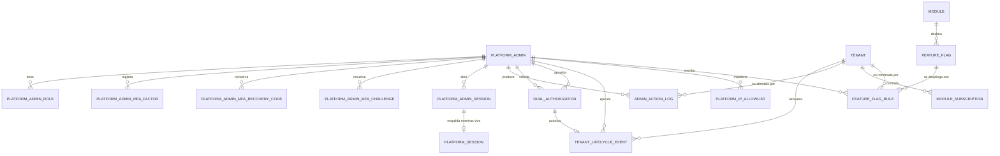

# REQ-BO · Modelo de datos

> Paso **1.6**, dividido en cinco sub-pasos (`funcional.md §12`). **Entradas obligatorias: `ADR-046`**, cuyo `§5` fija el almacén de sesión de plataforma (§2.6) y cuyo `§10.2` corrige una premisa falsa de la revisión anterior de este documento — la de que `sessions` lleva `tenant_id` (§2.6.1) —; y **`ADR-047`** (ACEPTADA, 2026-09-08), que **resuelve `OPEN-BO-10`**, crea la categoría «plataforma con visibilidad por tenant afectado» (§4.3, §5.3), impone el nombre `affected_tenant_id` para toda referencia a un tenant desde una tabla de plataforma (§5.2, §9.3) y decide que `platform_admin_sessions.session_id` **no lleva clave foránea** (§2.7). Todas las convenciones de `ADR-029` aplican **sin excepción**: `TIMESTAMPTZ` siempre, `text` nunca `varchar(n)`, enumerados como `text` con `CHECK`, importes en enteros de céntimos, clave primaria `bigint` interna más `public_id` ULID en todo lo expuesto. La única desviación propuesta, y **propuesta, no decidida**, es direccionar un *feature flag* por su `key`: `OPEN-BO-11`.
>
> **Lo primero, porque es lo que distingue a este módulo de los cinco anteriores**: **todas** sus tablas son **de plataforma**, no de tenant. No llevan `tenant_id` como propiedad, no llevan la política `tenant_isolation`, y **por eso mismo cada una tiene que declararse en el registro de tablas compartidas de `config/tenancy.php`** o el test de esquema #8 de `ADR-033 §10` fallará — que es exactamente lo que ese test existe para hacer. Ninguna omisión aquí es inofensiva.

---

## 1. Panorama: qué tabla es de qué tipo

| Tabla | Tipo | `tenant_id` | RLS | Escriben |
|-------|------|-------------|-----|----------|
| `platform_admins` | Plataforma | — | No | `plataforma_platform`, `plataforma_owner` |
| `platform_admin_roles` | Plataforma | — | No | Ídem |
| `platform_admin_mfa_factors` | Plataforma | — | No | Ídem |
| `platform_admin_mfa_recovery_codes` | Plataforma | — | No | Ídem |
| `platform_admin_mfa_challenges` | Plataforma | — | No | Ídem |
| `platform_ip_allowlist` | Plataforma | — | No | Ídem |
| `platform_sessions` | Plataforma | — | No | `plataforma_platform`. **`REVOKE ALL … FROM plataforma_app`** (§2.6) |
| `platform_admin_sessions` | Plataforma | — | No | Ídem (§2.7) |
| `dual_authorizations` | Plataforma | — | No | Ídem |
| `admin_action_logs` | **Plataforma con visibilidad por tenant afectado** (`ADR-047 §4.1`) | `affected_tenant_id` (referencia, **no** propiedad) | **Sí, propia**: `tenant_visibility` (§4.3) | `plataforma_platform` inserta; nadie actualiza ni borra |
| `tenant_lifecycle_events` | **Plataforma con visibilidad por tenant afectado** (`ADR-047 §4.1`) | `affected_tenant_id` (referencia, **no** propiedad) | **Sí, propia**: `tenant_visibility` (§5.3) | `plataforma_platform` |
| `feature_flags` | Plataforma | — | No | `plataforma_owner` materializa el catálogo; `plataforma_platform` escribe estado; `plataforma_app` **sólo `SELECT`** (§9.6) |
| `feature_flag_rules` | Plataforma **con referencia opcional a tenant** | `affected_tenant_id` (referencia, sólo en reglas nominales). **No adopta la categoría de `ADR-047 §4.1`** (§9.3) | No | Ídem |
| `tenants` | Ya existe | — | Ya tiene la suya (`id = app.current_tenant_id()`) | Gana columnas (§6) |
| `module_subscriptions` | Ya existe, **de tenant** | Sí | Ya la tiene | **Gana una migración de privilegios** (§7), sin cambio de esquema |

**Trece tablas nuevas**: nueve del chasis, del ciclo de vida y de la auditoría; **las dos de la sesión de plataforma** que trae `ADR-046 §5` (§2.6, §2.7); y las dos del motor de *feature flags* que entró en alcance por decisión del usuario del 2026-09-08 (§9). Es el dato que sostiene la división del paso en cinco (`funcional.md §12`).

---

## 2. Identidad de plataforma

### 2.1 `platform_admins`

| Campo | Tipo | Nulo | Defecto | Descripción |
|-------|------|------|---------|-------------|
| `id` | `bigserial` | No | | Clave interna |
| `public_id` | `text` | No | | ULID, `UNIQUE`. Único identificador expuesto (`ADR-029`) |
| `email` | `text` | No | | Correo de acceso. `UNIQUE` sobre `lower(email)` entre los vivos |
| `name` | `text` | No | | Nombre para mostrar y para la auditoría |
| `password` | `text` | No | | Hash. Nunca viaja en ninguna respuesta |
| `status` | `text` | No | `'activo'` | `CHECK IN ('activo','suspendido')` |
| `locale` | `text` | No | `'es-ES'` | Uno de los cuatro de `ADR-021` |
| `last_login_at` | `timestamptz` | Sí | | |
| `password_changed_at` | `timestamptz` | No | | Alimenta la política de contraseñas |
| `mfa_enrolled_at` | `timestamptz` | Sí | | Nulo = sin segundo factor confirmado ⇒ acceso restringido (`RN-BO-05`) |
| `created_at`, `updated_at` | `timestamptz` | No | | |
| `deleted_at` | `timestamptz` | Sí | | Borrado lógico (`INV-004`) |
| `created_by`, `updated_by` | `bigint` | Sí | | FK a `platform_admins.id`. Nulos en la fila de arranque, que crea la consola |

**Índices**

| Índice | Consulta que lo necesita |
|--------|--------------------------|
| `UNIQUE (lower(email)) WHERE deleted_at IS NULL` | Login y alta. Es la unicidad de negocio, no un índice de rendimiento |
| `UNIQUE (public_id)` | Toda ruta `/{public_id}` |
| `(status) WHERE deleted_at IS NULL` | Listado del panel de administradores. Decenas de filas: **se declara sólo si el listado lo pide de verdad**; un índice sin consulta que lo necesite es deuda |

**Lo que esta tabla deliberadamente no tiene**, y conviene que quede escrito para que nadie lo añada por simetría con `users`:

- **No tiene `person_id`.** `Person` es una tabla de tenant (`ADR-034 §1`). Un administrador de plataforma no es una persona **de ningún centro**, y colgarlo de `people` le daría un `tenant_id` — el mismo error que `ADR-034 §2` evitó al no meter `super_administrador` en `roles`.
- **No tiene `tenant_id`, ni nulo ni de ningún tipo** (`RN-BO-01`).
- **No tiene `mfa_required`.** Es obligatorio para todos, sin excepción: una columna que sólo puede valer `true` es una columna que alguien pondrá a `false`.

### 2.2 `platform_admin_roles`

Pivote entre administrador y rol interno. Los roles son **cuatro y fijos** (`REQ-BO-007`) y viven en un `CHECK`, no en una tabla de catálogo: no hay requisito que pida roles de plataforma personalizados, y una tabla de catálogo con cuatro filas inmutables sólo añade un `JOIN` y la posibilidad de que alguien inserte una quinta.

| Campo | Tipo | Nulo | Descripción |
|-------|------|------|-------------|
| `id` | `bigserial` | No | |
| `platform_admin_id` | `bigint` | No | FK → `platform_admins.id`, `ON DELETE CASCADE` |
| `role` | `text` | No | `CHECK IN ('soporte','operaciones','comercial','superadministrador')` |
| `granted_by` | `bigint` | Sí | FK → `platform_admins.id` |
| `created_at`, `updated_at` | `timestamptz` | No | |
| `deleted_at` | `timestamptz` | Sí | |

`UNIQUE (platform_admin_id, role) WHERE deleted_at IS NULL`.

**Por qué pivote y no una columna `role` en `platform_admins`**: `funcional.md §4.3`. Un administrador puede acumular roles; lo que la doble autorización separa son **personas**, no roles.

> **`RN-BO-11` no se puede expresar con un `CHECK`.** «Siempre al menos un `superadministrador` vivo y activo» es una restricción sobre el conjunto de filas, no sobre una fila. Se implementa en el servicio con bloqueo de fila (`SELECT … FOR UPDATE`) y se verifica con `CA-BO-010`, igual que `RN-CORE-07` en `REQ-CORE`. Se dice explícitamente porque el resto de este documento sí empuja las reglas al motor, y esta es la excepción razonada.

### 2.3 MFA de plataforma: tres tablas propias

**Por qué no se reutilizan las de 1.3.** Las seis tablas `mfa_*`/`user_mfa_*` llevan `tenant_id`, política `tenant_isolation` y FK a `users`; `EloquentMfaPolicy` llama a `TenantContext::tenantId()` y lanza `TenantContextMissing` sin contexto (verificado, `funcional.md §1.2`). Hacerlas servir a un sujeto sin tenant exigiría `tenant_id` anulable y una política RLS con una excepción — precisamente lo que `ADR-033 §5` prohíbe en voz alta: *«queda terminantemente prohibido añadir `OR app.current_tenant_id() IS NULL` a una política»*.

**Qué sí se reutiliza**: el mecanismo. `MfaVerifier` y `TotpProvisioner` son interfaces propias desde `ADR-041`, y el backoffice consume **las mismas**. Se duplica el almacenamiento, no la criptografía ni la dependencia.

| Tabla | Campos, con el mismo diseño que sus homólogas de 1.3 |
|-------|-------------------------------------------------------|
| `platform_admin_mfa_factors` | `id`, `public_id`, `platform_admin_id`, `type` (`CHECK IN ('totp')` — **sólo TOTP**, §2.4), `secret` (cifrado), `confirmed_at`, `last_used_at`, timestamps, `deleted_at` |
| `platform_admin_mfa_recovery_codes` | `id`, `platform_admin_id`, `code_hash` (sólo el hash, nunca el código), `used_at`, timestamps |
| `platform_admin_mfa_challenges` | `id`, `public_id`, `platform_admin_id`, `challenge_hash`, `expires_at`, `consumed_at`, `attempts`, timestamps |

**No hay equivalente de `user_mfa_obligations` ni de `user_mfa_exemptions`**, y es una decisión, no un olvido: la obligación no tiene estados porque es incondicional, y la exención no existe porque `REQ-BO-007` dice «sin excepción» (`CA-BO-006`).

### 2.4 El correo **no** es segundo factor en el backoffice

1.3b añadió el correo como segundo factor para los usuarios de los centros. Aquí **no se ofrece**, y por un motivo concreto: el correo es un canal fuera de nuestro control cuyo compromiso es el vector más común de escalada, y la cuenta que protege es la que puede eliminar cualquier centro. `type` admite un solo valor hoy; el `CHECK` se puede ampliar por migración aditiva si algún día se decide otra cosa.

### 2.5 `platform_ip_allowlist`

| Campo | Tipo | Nulo | Descripción |
|-------|------|------|-------------|
| `id` | `bigserial` | No | |
| `public_id` | `text` | No | ULID, `UNIQUE` |
| `cidr` | `cidr` | No | Rango permitido. **Tipo nativo de PostgreSQL**, no `text` |
| `description` | `text` | No | «Oficina», «VPN». Obligatorio: una entrada sin descripción nadie se atreve a retirarla |
| `enabled` | `boolean` | No | `DEFAULT true` |
| `created_at`, `updated_at`, `deleted_at` | `timestamptz` | | |
| `created_by`, `updated_by` | `bigint` | Sí | FK → `platform_admins.id` |

**Sobre el tipo `cidr` frente a `text`**: `ADR-029` prohíbe `varchar(n)` y el tipo `ENUM` de PostgreSQL; no prohíbe los tipos de red nativos. `cidr` da el operador de contención `>>=`, que **es** la comprobación que hay que hacer, validado por el motor. Con `text` habría que analizar la máscara en PHP en cada petición y aceptar que una entrada mal escrita se descubra en ejecución. Se elige el tipo que hace imposible el dato inválido.

`ip_address` de `admin_action_logs` se mantiene con el mismo tipo que ya usa `audit_logs`, para que las dos tablas se lean igual.

### 2.6 `platform_sessions` (`ADR-046 §5`)

#### 2.6.1 Primero, la premisa falsa que esta tabla sustituye

La revisión anterior de esta especificación afirmaba —en `funcional.md §1.2` y `§14`— que **`sessions` es tabla de tenant y lleva `tenant_id`**, y planteaba como alternativa que esa columna «dejara de ser obligatoria». **Es falso, y `ADR-046 §1.1` lo verificó contra el código:**

- `sessions` se crea en `database/migrations/0001_01_01_000000_create_users_table.php` con `{id, user_id, ip_address, user_agent, payload, last_activity}`, y **ninguna migración posterior la altera**.
- Está declarada en `config/tenancy.php` bajo **`shared_tables.framework`**, junto a `migrations`, `job_batches`, `cache`, `cache_locks` y `jobs`: **sin `tenant_id` y sin RLS**, por declaración explícita.
- Lo confirman los *docblocks* de `DatabaseSessionRevoker` y de la migración de `mfa_challenges`, y el issue [#81](https://github.com/pirexia/plataforma-educativa/issues/81) —*«`tenant_id` + RLS en `sessions` del framework, paso propio de endurecimiento»*—, que sigue **abierto**.
- El vínculo sesión↔tenant lo producen hoy **tres cosas y ninguna es una columna**: la cookie *host-only*, la clave `pge_tenant_id` del *payload*, y `VerifySessionTenant`, que la reverifica en cada petición. La tabla de tenant con RLS que sí es fuente de verdad de «qué sesiones hay vivas» es `user_sessions`, no `sessions`.

**Este documento no adelanta el issue #81 ni lo bloquea. `sessions` se queda exactamente como está.**

#### 2.6.2 El motivo real de que la sesión de plataforma tenga tabla propia

`sessions` es **legible por `plataforma_app`**, que es el rol con el que corre el *runtime* que sirve las peticiones de los centros. Y en el *driver* `database` de Laravel, **`sessions.id` es el identificador de sesión**.

Si las sesiones de plataforma vivieran ahí, cualquier camino que consiguiera leer esa tabla desde el *runtime* de un tenant —una inyección SQL, una consulta descuidada, un volcado de depuración— obtendría **identificadores de sesión vivos de administradores de plataforma**: una escalada de tenant a backoffice **que no pasa por la autenticación**, y por tanto lo contrario exacto de «un usuario de un tenant nunca puede alcanzar este backoffice, ni siquiera con el rol máximo de su centro».

Que `plataforma_app` pueda leer hoy las sesiones de todos los tenants es una debilidad **preexistente y aceptada**, con issue propio. `ADR-046` **no la arregla** —está fuera de su alcance— pero **prohíbe heredarla**: la superficie más sensible del producto no nace dentro de un problema conocido y sin cerrar.

#### 2.6.3 Esquema

Es el almacén del *driver* `database` de Laravel para el *guard* `platform`: **misma forma que `sessions`**, y a propósito, para que el driver estándar funcione sin adaptador propio.

| Campo | Tipo | Nulo | Descripción |
|---|---|---|---|
| `id` | `text` | No | **Clave primaria: es el identificador de sesión.** Lo genera el framework, no es un ULID nuestro y **no se expone en ninguna API** |
| `platform_admin_id` | `bigint` | Sí | Equivalente de `sessions.user_id`. Nulo antes de autenticarse. Índice |
| `ip_address` | Igual que en `admin_action_logs` | Sí | |
| `user_agent` | `text` | Sí | |
| `payload` | `text` | No | Serializado por el framework |
| `last_activity` | `integer` | No | Marca UNIX, como en `sessions`: **la impone el driver y no se cambia a `timestamptz`** |

> **Dos desviaciones de `ADR-029` que son del framework y no mías, y que por eso se declaran en vez de corregirse**: `id` es `text` y no `bigint`+`public_id`, y `last_activity` es `integer` y no `TIMESTAMPTZ`. Cambiar cualquiera de las dos exigiría un manejador de sesión propio para no ganar nada: esta tabla no se expone, no se direcciona por URL y no la lee ninguna consulta de negocio. La forma la fija el *driver* `database`, y apartarse de ella es sustituir una convención de esquema por un adaptador que hay que mantener.

**Privilegios — es la mitad de la decisión y no un detalle de despliegue:**

```sql
REVOKE ALL ON platform_sessions FROM plataforma_app;
-- Sin REVOKE de secuencia: la clave primaria es `text` y esta tabla no tiene ninguna.
-- Es la única exención declarada del punto de checklist de §12.1.
-- plataforma_platform conserva SELECT, INSERT, UPDATE, DELETE: es el runtime del backoffice.
```

Precedente literal en el repositorio: `2026_08_17_180000_harden_failed_jobs_grants.php` y `2026_08_18_100900_harden_audit_logs_platform_grants.php`. **Que el *runtime* de un centro no pueda leer una sesión de plataforma deja de ser disciplina y pasa a ser un `GRANT`**, que es la forma que este proyecto le da a `INV-001` desde `ADR-033 §5`. Verificado por `CA-BO-018`, y con la lección de `ADR-045 §4.4` aplicada: *«un `REVOKE` que no se prueba no existe»*.

**Debe quedar declarada en `config/tenancy.php` bajo `shared_tables.platform`**, o el test de esquema #8 de `ADR-033 §10` falla — **y debe fallar** si alguien la crea sin declararla (`CA-BO-075`).

**Cómo se selecciona este almacén**: por **grupo de rutas**, con un *middleware* que fija la configuración de sesión de plataforma —conexión, tabla, nombre de cookie y vida— **antes** de `start-session` (`api.md §1.1`). No es un mecanismo nuevo: `TenantContext::applyCachePrefix()` ya hace exactamente esta forma de cosa con `cache.prefix` y `Cache::forgetDriver()`, y está probada desde `0.7`.

**La conexión que se fija es `session.connection = 'pgsql_platform'`, y sólo esa clave** (`ADR-047 §11`, punto 2). Hay que escribirlo con el nombre exacto porque hasta ahora este documento decía «conexión» sin nombrarla, y porque la frase siguiente es la que de verdad importa:

> **El *middleware* fija configuración de *sesión* y nunca la conexión de base de datos por defecto.** No toca `database.default`, no llama a `DB::setDefaultConnection()` y no deja `pgsql_platform` puesta de fondo para el resto de la petición. Sólo el manejador de sesión del framework usa esa conexión, y sólo para leer y escribir su propia fila.
>
> **Por qué es la línea que hay que defender.** `pgsql_platform` es el rol con `BYPASSRLS` (`ADR-033 §5`). Si el grupo de rutas de plataforma acabara corriendo entero sobre esa conexión —por comodidad, o porque alguien «unificó» la configuración—, todo el backoffice tendría `BYPASSRLS` **sin pasar por `runAsPlatform()`**, y con él se perderían de golpe las tres garantías de `ADR-046 §6`: el propósito declarado, la prohibición de tenant activo y la comprobación de auditoría al cierre del bloque. **Es la única forma identificada de vaciar `ADR-046 §6` sin que nadie lo note**: no produce error, no cambia ninguna respuesta y no aparece en ninguna revisión de código que mire sólo el módulo. Por eso lleva criterio de aceptación propio, `CA-BO-105`, y no una nota.

El acceso deliberado a `pgsql_platform` desde el código de este módulo sigue teniendo un solo camino con nombre —`runAsPlatform()`, con su propósito— y el hecho de que el almacén de sesión use esa misma conexión **no es una excepción a esa regla**: no es código de aplicación pidiendo `BYPASSRLS`, es el manejador del framework escribiendo en una tabla que `plataforma_app` no puede tocar (§2.6.2).

**Cookie**: nombre propio, distinto del de la cookie del producto, y ***host-only*** igual que aquella (`SESSION_DOMAIN` sigue sin valor, `ADR-033 §2`). Con el enrutado por `Host()` y la restricción de `RN-BO-49`, `RMT-009` se cumple **por construcción y por partida triple**: dominios distintos, cookies distintas, tablas distintas.

**Vida**: propia y configurable, **más corta** que la del tenant (`RN-BO-09`), en su propia variable de entorno (`operacion.md §2`).

### 2.7 `platform_admin_sessions`

`ADR-046 §5.2` deja escrito que el equivalente de `user_sessions` para el backoffice —**la fuente de verdad de qué sesiones de plataforma hay vivas, necesaria para revocar**— es tabla de plataforma también, y **encarga su diseño a este documento**. Lo que sigue es ese diseño; el ADR no fija nada sobre él, así que es una propuesta mía y está en la lista de §15 de `funcional.md`.

**Por qué hacen falta dos tablas y no una.** Es la misma separación que 1.2 hizo entre `sessions` y `user_sessions`, y por el mismo motivo: `platform_sessions` la escribe el *driver* del framework y su forma no es nuestra (§2.6.3); `platform_admin_sessions` es **dato de negocio** —qué sesiones hay abiertas, desde dónde, desde cuándo, y por qué terminó cada una— que la aplicación lee y muestra, y que sobrevive al cierre de la sesión para poder auditarlo. Meter lo segundo en la tabla del driver significaría que un `DELETE` del recolector de sesiones borra el rastro.

| Campo | Tipo | Nulo | Descripción |
|---|---|---|---|
| `id` | `bigserial` | No | |
| `platform_admin_id` | `bigint` | No | FK → `platform_admins.id` |
| `session_id` | `text` | Sí | Referencia a `platform_sessions.id`, **sin clave foránea** (§2.7.1). **Se pone a nulo al terminar la sesión**, para no conservar un identificador de sesión más de lo necesario |
| `ip_address` | Igual que en `admin_action_logs` | Sí | |
| `user_agent` | `text` | Sí | |
| `started_at` | `timestamptz` | No | |
| `last_seen_at` | `timestamptz` | No | |
| `reauthenticated_at` | `timestamptz` | Sí | Última reautenticación superada. **No es la marca que gobierna `RN-BO-08`** — esa vive en la sesión (`funcional.md §5.2`) — sino su reflejo consultable |
| `ended_at` | `timestamptz` | Sí | Nulo ⇒ viva |
| `end_reason` | `text` | Sí | `CHECK IN ('cierre_usuario','caducidad','revocada_admin','admin_suspendido','mfa_restablecido')`. **Vocabulario propio**, no el `SessionEndReason` de tenant: son dos sujetos distintos y compartir el *enum* ataría dos ciclos de vida que no tienen por qué evolucionar juntos |
| `created_at`, `updated_at` | `timestamptz` | No | |

```sql
CHECK ((ended_at IS NULL) = (end_reason IS NULL))
```

**Índices**: `(platform_admin_id, started_at DESC) WHERE ended_at IS NULL` —«qué sesiones tiene abiertas esta persona», que es la consulta de la revocación—; `(session_id) WHERE session_id IS NOT NULL`.

#### 2.7.1 `session_id` **no lleva clave foránea**, y el motivo es el orden de escritura (`ADR-047 §5.1`)

La revisión conjunta de `architect` y `db-reviewer` propuso `FOREIGN KEY (session_id) REFERENCES platform_sessions (id) ON DELETE SET NULL`. **`ADR-047 §5.1` la descarta**, y no por el argumento de `CASCADE`/`RESTRICT` —que estaba bien resuelto— sino por uno verificado sobre el código:

- El registro de la sesión de negocio se escribe **dentro de una transacción, durante la petición**, con el identificador que `session()->getId()` ya conoce tras `regenerate()`. Es lo que hace `SessionRegistrationService::register()` para `user_sessions`, y la sesión de plataforma reproduce la misma mecánica con otro *guard*.
- La fila de `platform_sessions` la escribe el *driver* al **final** de la petición, cuando el manejador de sesión guarda.

**En el instante del `INSERT`, la fila referenciada todavía no existe.** Una clave foránea fallaría en **cada inicio de sesión** y, como la escritura va en transacción —deliberadamente: si algo falla, el login falla—, el fallo sería el login: ningún administrador de plataforma podría entrar. `ON DELETE SET NULL` gobierna el borrado del padre y no dice nada sobre su ausencia al insertar el hijo, y `DEFERRABLE INITIALLY DEFERRED` tampoco salva el caso, porque la transacción confirma antes de que el *driver* escriba.

Es literalmente el segundo de los tres motivos que la migración de `user_sessions` de `1.2` dejó escritos en su *docblock* para no poner esa clave foránea. **Se dice explícitamente, con su motivo, precisamente porque su ausencia parece un descuido**: es la misma forma en que `1.2` lo dejó dicho.

#### 2.7.2 Lo que sustituye a la clave foránea: barrido de sesiones huérfanas

`ADR-047 §5.1` pone en su lugar algo que la clave foránea no podía hacer: un **barrido de sesiones huérfanas de plataforma**, `CloseOrphanedPlatformSessions` (*job* y comando, `app/Modules/Backoffice/Infrastructure/`), con el precedente exacto de `CloseOrphanedUserSessions` del módulo `Auth`. Para **toda fila viva** —`ended_at IS NULL`— cuyo `session_id` ya no exista en `platform_sessions`:

1. anula `session_id`,
2. fija `ended_at`,
3. escribe `end_reason = 'caducidad'`.

**No es una purga**: no borra ni redacta ninguna fila. Su entrada en el planificador está en `operacion.md §6.2`.

**Por qué no es opcional, y por qué no lo resolvía la clave foránea:**

- **`end_reason = 'caducidad'` está en el `CHECK` de esta tabla y hoy no tiene ningún escritor.** El recolector del *driver* borra de `platform_sessions` y no toca esta tabla. Sin el barrido, **toda sesión caducada queda con `ended_at IS NULL` para siempre**, y el índice `(platform_admin_id, started_at DESC) WHERE ended_at IS NULL` —que es **la consulta de la revocación**— devuelve sesiones muertas. Suspender a alguien por un incidente pasaría a mostrar datos falsos, que es justo el caso de uso con el que esta tabla se justifica.
- **Una clave foránea no escribe columnas ajenas.** `ON DELETE SET NULL` sólo actúa cuando el recolector borra, y nunca podría fijar `ended_at` ni `end_reason`. Resuelve menos, y sólo en un caso.

Verificado por `CA-BO-104`.

**No lleva `public_id`**, igual que `platform_admin_roles`, y por el mismo motivo: **en 1.6 no se direcciona por URL**. La revocación no es un *endpoint* propio, es el **efecto** de operaciones que ya existen —suspender, eliminar, retirar roles, restablecer el segundo factor— y que se identifican por el `public_id` **del administrador**, no por el de cada sesión. Si algún día hace falta revocar una sesión concreta desde una pantalla, ese *endpoint* traerá consigo su `public_id` en una migración aditiva; **no se adelanta la columna** (`ADR-034 OPEN-13`).

**Privilegios**: los mismos que §2.6 — `REVOKE ALL … FROM plataforma_app` —, **más el `REVOKE ALL ON SEQUENCE platform_admin_sessions_id_seq FROM plataforma_app`** que su clave `bigserial` exige y que el `REVOKE` de tabla no cubre (§12.1). Y **la misma declaración obligatoria** en `shared_tables.platform`.

**Qué obliga a revocar**, y por eso la tabla no es opcional en `1.6`: suspender o eliminar un `platform_admin` (`admin.suspendido`, `admin.eliminado`), retirarle roles, y restablecerle el segundo factor (`admin.mfa_restablecido`). Sin esta tabla, «suspendido» significaría «no puede volver a entrar» y no «está fuera ahora», que es lo que hace falta cuando se suspende a alguien por un incidente. Cada revocación deja entrada en `admin_action_logs` con `action = 'sesion.cerrada'` (§4.2).

---

## 3. `dual_authorizations`

La tabla que sostiene «ninguna acción destructiva en un solo paso» (`REQ-BO-007`).

| Campo | Tipo | Nulo | Descripción |
|-------|------|------|-------------|
| `id` | `bigserial` | No | |
| `public_id` | `text` | No | ULID, `UNIQUE` |
| `action` | `text` | No | Vocabulario **cerrado** por `CHECK`: `tenant.eliminar`, `tenant.baja`, `modulo.descontratar_masivo`. Se amplía por migración, nunca por dato |
| `payload` | `jsonb` | No | La operación **congelada**: sus parámetros exactos, resueltos a `public_id` |
| `payload_fingerprint` | `text` | No | Hash de `payload` normalizado. Es lo que ata la aprobación a **esta** operación (`RN-BO-20`) |
| `reason` | `text` | No | Motivo de la solicitud. `CHECK (length(btrim(reason)) > 0)` |
| `requested_by` | `bigint` | No | FK → `platform_admins.id` |
| `requested_at` | `timestamptz` | No | |
| `expires_at` | `timestamptz` | No | `CHECK (expires_at > requested_at)` |
| `status` | `text` | No | `CHECK IN ('pendiente','aprobada','rechazada','caducada','ejecutada','fallida')` |
| `approved_by` | `bigint` | Sí | FK → `platform_admins.id` |
| `approved_at` | `timestamptz` | Sí | |
| `resolution_reason` | `text` | Sí | Motivo de la aprobación o del rechazo |
| `executed_at` | `timestamptz` | Sí | |
| `execution_error` | `text` | Sí | |
| `created_at`, `updated_at` | `timestamptz` | No | |

### 3.1 La restricción que define el módulo

```sql
CONSTRAINT dual_authorizations_distinct_approver
    CHECK (approved_by IS NULL OR approved_by <> requested_by)
```

**Va en el motor, no en el controlador**, por el mismo argumento con el que `ADR-045 §4.4` sacó de `ModulesController` la escritura de `enabled`: un `if` en PHP protege el camino que alguien recordó; un `CHECK` protege todos los caminos, incluidos los que todavía no existen. `CA-BO-062` lo verifica **escribiendo por SQL directo**, no por la API — un test que pase por el controlador comprobaría el `if`, no la restricción.

### 3.2 Restricciones adicionales

```sql
-- Coherencia de estado: no hay aprobación sin aprobador, ni ejecución sin aprobación
CHECK ((status = 'aprobada') = (approved_by IS NOT NULL AND approved_at IS NOT NULL))
CHECK (status <> 'ejecutada' OR executed_at IS NOT NULL)

-- Una sola solicitud viva por operación idéntica
UNIQUE (action, payload_fingerprint) WHERE status = 'pendiente'
```

**Índices**: `(status, expires_at) WHERE status = 'pendiente'` para el barrido de caducidad (§ `operacion.md`), y `(requested_by)` para «mis solicitudes».

---

## 4. `admin_action_logs`

La tabla que `ADR-033 §7` reservó y `ADR-036` fechó en este paso.

### 4.1 Columnas

| Campo | Tipo | Nulo | Descripción |
|-------|------|------|-------------|
| `id` | `bigserial` | No | |
| `public_id` | `text` | No | ULID, `UNIQUE` |
| `occurred_at` | `timestamptz` | No | Cuándo. **No hay `created_at`**: la fila no se crea después del hecho, mismo criterio que `audit_logs` |
| `actor_type` | `text` | No | `CHECK IN ('platform_admin','console','system')`. Vocabulario **propio y cerrado**, distinto del de `audit_logs` (`ADR-039`) |
| `actor_platform_admin_id` | `bigint` | Sí | FK → `platform_admins.id`. Nulo para `console` y `system`. `CHECK ((actor_type = 'platform_admin') = (actor_platform_admin_id IS NOT NULL))` |
| `affected_tenant_id` | `bigint` | Sí | FK → `tenants.id`. **Referencia, no propiedad** (§4.3). Nulo en acciones de alcance global |
| `subject_type` | `text` | No | Del *morph map*, nunca el FQCN (`ADR-034 §3`) |
| `subject_id` | `bigint` | Sí | |
| `subject_public_id` | `text` | Sí | Sobrevive al borrado del sujeto |
| `action` | `text` | No | Vocabulario cerrado por `CHECK` (§4.2) |
| `reason` | `text` | Sí | Motivo. **Obligatorio en las acciones que lo exigen**, y esa obligación es del servicio, no de un `CHECK` — depende de `action` |
| `changes` | `jsonb` | Sí | Antes/después, con la redacción de `ADR-035` (`RN-BO-32`) |
| `ip_address` | Igual que en `audit_logs` | Sí | |
| `user_agent` | `text` | Sí | |
| `request_id` | `text` | Sí | `INV-013` |
| `context` | `jsonb` | Sí | Datos de la operación que no son antes/después: `dual_authorization_id`, número de centros afectados en una masiva… |

### 4.2 Vocabulario de `action`

Cerrado, con `CHECK`, siguiendo el precedente de `audit_logs.event` (`ADR-034 §3`, ampliado por `ADR-039`). Ampliarlo es una migración, y eso es deliberado: un vocabulario abierto se convierte en texto libre y deja de ser consultable.

| Grupo | Valores |
|-------|---------|
| Acceso | `acceso.concedido`, `acceso.rechazado`, `acceso.rechazado_por_ip`, `sesion.cerrada`, `reautenticacion.superada` |
| Administradores | `admin.creado`, `admin.actualizado`, `admin.suspendido`, `admin.reactivado`, `admin.eliminado`, `admin.rol_concedido`, `admin.rol_retirado`, `admin.mfa_restablecido` |
| Lista blanca | `ip.permitida_anadida`, `ip.permitida_retirada` |
| Doble autorización | `autorizacion.solicitada`, `autorizacion.aprobada`, `autorizacion.rechazada`, `autorizacion.caducada`, `autorizacion.ejecutada`, `autorizacion.fallida` |
| Tenants | `tenant.creado`, `tenant.actualizado`, `tenant.suspendido`, `tenant.reactivado`, `tenant.baja_iniciada`, `tenant.rescatado`, `tenant.eliminado`, `tenant.clonado` |
| Módulos | `modulo.contratado`, `modulo.descontratado`, `modulo.masivo_ejecutado` |
| Diagnóstico | `job.reintentado` |

### 4.3 `affected_tenant_id` no es `tenant_id`, y la diferencia importa (`ADR-047`)

`ADR-033 §7` clasifica esta tabla como de plataforma, «sin `tenant_id`». Se respeta: **la tabla no pertenece a ningún centro**, sus filas no las crea la actividad de un centro y no se borran cuando un centro se va. `affected_tenant_id` dice **a quién afectó** una acción del proveedor, que es información distinta de la propiedad de la fila.

Esa columna es lo que hace posible el requisito de `REQ-BO-007`: auditoría «consultable por el propio centro en lo que le afecte».

> **`OPEN-BO-10` está resuelta.** Lo que este apartado sometía al visto bueno conjunto de `architect` y `db-reviewer` lo decide **`ADR-047`** (ACEPTADA, 2026-09-08): las dos piezas quedan aprobadas **con cambios**, ninguna rechazada, y la forma que sigue es la canónica de `ADR-047 §4.3` y `§4.4`, no una propuesta. La tabla pertenece a la categoría nueva **«plataforma con visibilidad por tenant afectado»** (`ADR-047 §4.1`), que amplía el cuadro de `ADR-033 §7` sin modificar ninguna de sus cuatro categorías.

```sql
ALTER TABLE admin_action_logs ENABLE ROW LEVEL SECURITY;
ALTER TABLE admin_action_logs FORCE  ROW LEVEL SECURITY;

CREATE POLICY tenant_visibility ON admin_action_logs
    FOR SELECT
    USING (affected_tenant_id = app.current_tenant_id());

-- 1. Punto de partida limpio. El REVOKE de tabla NO cubre la secuencia:
--    01-tenancy.sql.tpl concede USAGE, SELECT sobre las secuencias por defecto.
REVOKE ALL ON admin_action_logs                 FROM plataforma_app;
REVOKE ALL ON SEQUENCE admin_action_logs_id_seq FROM plataforma_app;

-- 2. Lo imprescindible, y sólo eso: columnas enumeradas, nunca la tabla.
GRANT SELECT (
    public_id,
    occurred_at,
    action,
    affected_tenant_id,
    subject_type,
    subject_public_id
) ON admin_action_logs TO plataforma_app;

-- 3. Inmutabilidad también para el rol que escribe
--    (precedente literal: harden_audit_logs_platform_grants).
REVOKE UPDATE, DELETE ON admin_action_logs FROM plataforma_platform;
```

**Las cinco reglas de la política** (`ADR-047 §4.3`), ninguna negociable:

1. **`FOR SELECT` únicamente.** No hay política de `INSERT`, `UPDATE` ni `DELETE`, y **su ausencia no es un olvido**: bajo `FORCE`, la ausencia de política permisiva es lo que cierra la escritura para todo rol sin `BYPASSRLS`, incluido el propietario del esquema. **Es el cierre de verdad**; el `REVOKE` del paso 3 es la capa de encima. Quien algún día quite una de las dos tiene que quitar la redundante, no ésta.
2. **Sin `WITH CHECK`.** En una política de solo lectura no hace nada y sugiere que la tabla admite escritura desde el tenant.
3. **Sin `OR app.current_tenant_id() IS NULL`**, ni ninguna variante: `ADR-033 §5` lo prohíbe terminantemente y aquí rige idéntico.
4. **La política se llama `tenant_visibility`**, no `tenant_isolation`. Dos nombres porque son dos cosas: quien lea un volcado del esquema tiene que distinguirlas sin leer el predicado.
5. **Las filas de alcance global son invisibles desde un tenant.** Con `affected_tenant_id` nula, `NULL = <algo>` no es verdadero. Sin contexto de tenant, `app.current_tenant_id()` es nula y no se devuelve ninguna fila. Falla en cerrado en los dos sentidos, sin código que lo recuerde.

**Por qué el `GRANT` es de columnas y no de tabla** (`ADR-047 §4.4`): **RLS filtra filas, no columnas.** Con `GRANT SELECT` sobre la tabla completa, el *runtime* de un centro podría leer, en las filas que le corresponden, el motivo interno del operador, el `context` —que según §13 lleva el nombre del empleado del proveedor— y la IP y el agente de usuario del personal de plataforma: datos personales de empleados nuestros expuestos a un cliente. **Que el *endpoint* proyecte sólo lo debido no basta: la superficie es el `GRANT`**, y una consulta descuidada o una inyección ve lo que el `GRANT` permita. Además falla ruidosamente: un `SELECT *` desde el tenant da error de privilegios en vez de devolver de más.

**Qué entra y qué no**, aplicando el criterio de `ADR-047 §4.4`:

| Columna | ¿La ve el centro? | Motivo |
|---|:---:|---|
| `public_id` | Sí | Identidad expuesta y desempate del cursor |
| `occurred_at` | Sí | El «cuándo» |
| `action` | Sí | El «qué», con vocabulario cerrado (§4.2): dice lo ocurrido sin texto libre |
| `affected_tenant_id` | Sí | Es la referencia al propio centro |
| `subject_type`, `subject_public_id` | Sí | Sobre qué se actuó, en el vocabulario público del *morph map* y con el identificador que ya conoce |
| `id`, `subject_id` | No | Claves internas. No se exponen nunca (`ADR-029`) |
| `actor_type` | No | Describe la maquinaria interna del proveedor —consola, sistema o persona— y es el primer paso hacia identificar a quién. No responde a «qué le pasó a este centro» |
| `actor_platform_admin_id` | **No** | Identifica al empleado del proveedor. Excluido por nombre en `ADR-047 §4.4` |
| `ip_address`, `user_agent` | **No** | Datos personales del personal del proveedor. Ídem |
| `context` | **No** | Ídem, y además información operativa interna |
| `changes` | **No** | Antes/después con la redacción de `ADR-035`, pensada para la investigación, no para el cliente |
| `request_id` | No | Identificador de correlación interno (`INV-013`). No significa nada fuera de nuestros logs |
| `reason` | **No** | §4.3.1 |

#### 4.3.1 `reason` **no** cruza el `GRANT`

`ADR-047 §2.1` y `§4.4` declinan decidirlo y lo remiten a este documento: *«el `reason` es la única frontera discutible y la decide el producto»*. La decisión es **excluirlo**, y con **un solo criterio para las dos tablas de esta categoría** (§5.3.1 lo aplica igual): **ningún texto libre escrito por un operador del proveedor cruza el `GRANT`.** Un criterio distinto por tabla sería justo el vocabulario de excepciones que `ADR-047` viene a impedir.

Tres motivos, en orden de peso:

1. **No hay nada que garantice que ese texto sea apto para el cliente.** `reason` es texto libre, sin longitud acotada y sin la redacción de `ADR-035` que sí lleva `changes`. Un motivo real puede nombrar a personas, a terceros, a otro centro o a una negociación comercial. Nada de eso es «lo que le afecta» en el sentido de `REQ-BO-007`: es *por qué* lo hizo el proveedor, que es otra pregunta.
2. **La asimetría de coste es total.** Añadir una columna al `GRANT` más adelante es una migración de una línea. Quitarla después de que los centros la hayan leído no deshace nada: el dato ya salió. Ante una frontera discutible, la dirección reversible es la cerrada.
3. **Sin `reason`, la respuesta al centro sigue siendo completa.** `action`, `occurred_at`, `subject_type` y `subject_public_id` responden enteras a «qué le pasó a este centro y cuándo». Se le niega el comentario interno, no el hecho.

Y aquí el argumento es, si acaso, más fuerte que en `tenant_lifecycle_events`: el `reason` de una acción de plataforma es la nota que un operador escribe **para la investigación futura**, y su valor depende de que se escriba sin pensar en quién la lee. Un `reason` que el cliente puede leer deja de ser esa nota y pasa a ser un texto redactado — es decir, deja de servir para lo que existe.

> **Si el producto decide que el centro debe recibir un motivo**, el camino correcto **no** es abrir esta columna: es un campo propio, escrito a sabiendas de que lo lee el cliente, distinto de la nota interna. Es la distinción que `tenants.suspension_message` (§6) ya hace para la suspensión —un texto redactado *para* el centro— frente al `reason` de la transición, que se redacta para el registro. Queda escrito para que nadie resuelva la petición ampliando el `GRANT`.

- `plataforma_platform` tiene `BYPASSRLS` y ve la tabla entera: es el backoffice, y es quien sirve `GET /admin-action-logs` (`api.md §2.9`).
- **Nadie tiene `UPDATE` ni `DELETE`**, ni siquiera `plataforma_owner` en tiempo de ejecución (`RN-BO-29`). Consecuencia que hay que conocer antes de escribir cualquier migración futura sobre esta tabla: **queda fuera del ciclo *expand/contract* para siempre** (`ADR-047 §5.2`, §12).

**Verificación** (`ADR-047 §4.4`, «un `REVOKE` que no se prueba no existe»): `CA-BO-098`, `CA-BO-099` y `CA-BO-100` (`funcional.md §13.8`), además de `CA-BO-021`, que comprueba el rechazo de `UPDATE`/`DELETE` por el motor, y de `CA-BO-022`, que comprueba el mismo aislamiento desde el *endpoint* del tenant.

### 4.4 Particionado: **no**, y con el disparador escrito

`audit_logs` está particionada por `tenant_id` porque su volumen crece con la actividad de todos los centros. `admin_action_logs` crece con la actividad **del personal del proveedor**, que son unidades por día, no miles por minuto. Particionar hoy sería complejidad sin consulta que la justifique.

**Disparador de revisión**, para que la decisión no se herede sin pensarla: si la tabla supera los **10 millones de filas** o el listado por rango de fechas deja de responder por debajo de 200 ms (`RNF-PERF-001`), se reevalúa el particionado por rango de `occurred_at`. Es el mismo mecanismo con el que `ADR-034 §3` dejó anotado el umbral de `audit_logs`.

### 4.5 Índices

| Índice | Consulta |
|--------|----------|
| `(occurred_at DESC, id DESC)` | Listado general del backoffice, por cursor. **El desempate por `id` no es opcional**: sin él, dos filas con el mismo `occurred_at` en el límite de página se pierden o se repiten (`ADR-038 §4.4`) |
| `(affected_tenant_id, occurred_at DESC, id DESC)` | Ficha de un centro **desde el backoffice**, que corre con `plataforma_platform` y ve la tabla entera |
| `(actor_platform_admin_id, occurred_at DESC, id DESC)` | «Qué ha hecho esta persona»: la primera pregunta de cualquier investigación |
| `(action, occurred_at DESC)` | Filtro por tipo de acción |
| `UNIQUE (public_id)` | |

> **La consulta del propio centro (`GET /api/v1/platform-actions`) necesita comprobación aparte, y se anota aquí para que no se descubra al escribir la migración.** Esa consulta corre con `plataforma_app`, que tiene concedidas seis columnas y **`id` no es una de ellas** (§4.3). No puede ordenar ni desempatar por `id`, así que el orden total estricto que `ADR-038 §4.4` exige tiene que apoyarse en `public_id` — ULID, único y monótono— y el índice `(affected_tenant_id, occurred_at DESC, id DESC)` **no la sirve**. **No decido aquí el índice**: es exactamente el tipo de trabajo que `ADR-047 §7` reserva a `db-reviewer` —«la lista de columnas hay que verificarla, no suponerla», y su corolario es que hay que verificar también qué consultas quedan servidas—. Lo que sí queda decidido es que **no se resuelve ampliando el `GRANT` con `id`**: `id` es una clave interna que `ADR-029` no expone nunca, y abrirla para ahorrar un índice sería pagar una convención con un índice.

---

## 5. `tenant_lifecycle_events`

### 5.1 Por qué existe además de `admin_action_logs`

Es una entidad principal de §5.51 y **no es una duplicación**:

| | `admin_action_logs` | `tenant_lifecycle_events` |
|---|---|---|
| Qué es | **Auditoría**: qué hizo el personal de plataforma | **Dato de negocio**: la historia de la máquina de estados de un centro |
| Quién lo lee | Investigación, cumplimiento | **La aplicación**, en cada petición: cuándo vence la gracia, desde cuándo está suspendido |
| Se puede reconstruir del otro | — | Sí, analizando texto — y ahí está el problema |

Leer el vencimiento de un período de gracia de una tabla de auditoría significaría que **la lógica de negocio depende del formato del registro de auditoría**, y que un cambio en el vocabulario de auditoría rompe una regla de negocio. Son dos tablas porque son dos usos, no porque falte normalización.

### 5.2 Columnas

| Campo | Tipo | Nulo | Descripción |
|-------|------|------|-------------|
| `id` | `bigserial` | No | |
| `public_id` | `text` | No | ULID, `UNIQUE` |
| `affected_tenant_id` | `bigint` | **No** | FK → `tenants.id`. **Referencia, no propiedad** (`ADR-047 §4.2`). Se llamaba `tenant_id` hasta la aplicación de `ADR-047`: ese nombre queda reservado a la columna de propiedad —la que lleva `DEFAULT app.current_tenant_id()`, la política `tenant_isolation` y la clave foránea compuesta de `ADR-033 §6`—, y usarlo aquí hacía fallar **dos** tests de esquema (`ADR-047 §1.1`, puntos 1 y 2) |
| `from_status` | `text` | Sí | Nulo sólo en el alta. `CHECK` contra los cinco valores de `TenantStatus` |
| `to_status` | `text` | No | Ídem |
| `reason` | `text` | No | `CHECK (length(btrim(reason)) > 0)` — `RN-BO-13` en el motor |
| `occurred_at` | `timestamptz` | No | |
| `performed_by` | `bigint` | Sí | FK → `platform_admins.id`. Nulo para transiciones de `system` |
| `dual_authorization_id` | `bigint` | Sí | FK → `dual_authorizations.id`. **No nulo** cuando `to_status = 'eliminado'`, garantizado por `CHECK` |
| `grace_period_ends_at` | `timestamptz` | Sí | Sólo cuando `to_status = 'en_baja'`. `CHECK ((to_status = 'en_baja') = (grace_period_ends_at IS NOT NULL))` |

```sql
-- Eliminar exige doble autorización, y lo dice el esquema
CHECK (to_status <> 'eliminado' OR dual_authorization_id IS NOT NULL)
```

**Append-only**, como `admin_action_logs`, y por la misma vía: lo que cierra la escritura es `FORCE ROW LEVEL SECURITY` sin política permisiva de escritura; el `REVOKE UPDATE, DELETE` es la capa de encima (§5.3). La historia de estados de un centro no se corrige, se continúa.

> **`affected_tenant_id` es `NOT NULL` aquí y anulable en `admin_action_logs`, y la diferencia es de significado, no de descuido.** `ADR-047 §4.2` describe la columna de la categoría como anulable porque «nula ⇒ alcance global», y eso tiene sentido en una tabla de auditoría, donde el proveedor hace cosas que no afectan a ningún centro. **En esta tabla no existe el evento de ciclo de vida sin centro**: la fila *es* una transición de la máquina de estados de un centro concreto. Anularla admitiría una fila sin significado. La restricción es más estricta que la del ADR y no contradice ninguna de sus cinco reglas: la política sigue fallando en cerrado en los dos sentidos (§5.3).

### 5.3 Visibilidad por tenant afectado y privilegios (`ADR-047 §4.3`, `§4.4`)

Misma forma canónica que §4.3, adaptada a las columnas de esta tabla, y con el mismo fin: que el propio centro pueda consultar su historia de estados sin que la fila deje de ser del proveedor.

```sql
ALTER TABLE tenant_lifecycle_events ENABLE ROW LEVEL SECURITY;
ALTER TABLE tenant_lifecycle_events FORCE  ROW LEVEL SECURITY;

CREATE POLICY tenant_visibility ON tenant_lifecycle_events
    FOR SELECT
    USING (affected_tenant_id = app.current_tenant_id());

-- 1. Punto de partida limpio. El REVOKE de tabla NO cubre la secuencia:
--    01-tenancy.sql.tpl concede USAGE, SELECT sobre las secuencias por defecto.
REVOKE ALL ON tenant_lifecycle_events                   FROM plataforma_app;
REVOKE ALL ON SEQUENCE tenant_lifecycle_events_id_seq   FROM plataforma_app;

-- 2. Lo imprescindible, y sólo eso: columnas enumeradas, nunca la tabla.
GRANT SELECT (
    public_id,
    affected_tenant_id,
    from_status,
    to_status,
    occurred_at,
    grace_period_ends_at
) ON tenant_lifecycle_events TO plataforma_app;

-- 3. Inmutabilidad también para el rol que escribe.
REVOKE UPDATE, DELETE ON tenant_lifecycle_events FROM plataforma_platform;
```

**Por qué esas seis columnas y no otras**, aplicando el criterio de `ADR-047 §4.4` («entra lo que responde a *qué le pasó a este centro y cuándo*»):

| Columna | ¿La ve el centro? | Motivo |
|---|:---:|---|
| `public_id` | Sí | Identidad expuesta y desempate del cursor |
| `affected_tenant_id` | Sí | Es la referencia al propio centro. No le dice nada que no sepa |
| `from_status`, `to_status` | Sí | **Son literalmente «qué le pasó»**: la transición es el hecho |
| `occurred_at` | Sí | El «cuándo» |
| `grace_period_ends_at` | Sí | Es una fecha que le concierne directamente y sobre la que tiene que actuar. Negársela sería negarle el plazo del que depende |
| `id` | No | Clave interna. No se expone nunca (`ADR-029`) |
| `reason` | **No** | §5.3.1 |
| `performed_by` | **No** | Identifica a una persona del proveedor. `ADR-047 §4.4` lo excluye por nombre en su criterio: nada que identifique al empleado del proveedor cruza el `GRANT` |
| `dual_authorization_id` | **No** | Referencia a una tabla de plataforma que el centro no puede leer, y una ventana al proceso interno de aprobación. Devolvería un identificador que no resuelve nada y describiría maquinaria del proveedor |

#### 5.3.1 `reason` **no** cruza el `GRANT`, aquí tampoco

**Mismo criterio y mismos tres motivos que en §4.3.1**, que es donde se razonan: ningún texto libre escrito por un operador del proveedor cruza el `GRANT`. Se aplica igual aquí, y a propósito — un criterio distinto por tabla sería el vocabulario de excepciones que `ADR-047` viene a impedir.

Lo que cambia es sólo la comprobación del tercer motivo, porque hay que hacerla sobre estas columnas y no sobre las otras: **sin `reason`, la respuesta al centro sigue siendo completa.** `from_status`, `to_status`, `occurred_at` y `grace_period_ends_at` responden enteras a «qué le pasó a este centro y cuándo» — de hecho la transición **es** el hecho. Se le niega el comentario interno del operador, no la historia de estados.

Y una tentación concreta que conviene desactivar por escrito: `reason` es aquí `NOT NULL`, lo que hace pensar que «siempre hay algo que enseñar». **Que la columna sea obligatoria dice que el proveedor tiene que justificar la transición ante su propio registro, no que el centro tenga derecho a leer esa justificación.** Si el producto decide que el centro debe recibir un motivo, el camino es el de §4.3.1: un campo propio redactado para el cliente, no abrir éste.

**Verificación** (`ADR-047 §4.4`, «un `REVOKE` que no se prueba no existe»): `CA-BO-101`, `CA-BO-102` y `CA-BO-103` (`funcional.md §13.8`).

### 5.4 Índices

`(affected_tenant_id, occurred_at DESC, id DESC)` para la ficha del centro y para la consulta del propio centro sobre su historia; `(to_status, grace_period_ends_at) WHERE to_status = 'en_baja'` para el barrido de vencimientos de `RN-BO-17`; `UNIQUE (public_id)`.

---

## 6. Columnas que gana `tenants`

Migración **aditiva pura**, sin renombrados y sin ciclo *contract* (`CLAUDE.md §9`).

| Campo | Tipo | Nulo | Descripción |
|-------|------|------|-------------|
| `suspension_message` | `text` | Sí | Mensaje que ven los usuarios del centro cuando el acceso está bloqueado. **Nulo ⇒ mensaje por defecto del catálogo de traducción**, en el idioma resuelto (`CA-BO-053`) |
| `suspended_at` | `timestamptz` | Sí | Redundante con `tenant_lifecycle_events`, y a propósito: `ResolveTenant` la lee **en cada petición** y no puede permitirse un `JOIN` con una tabla de historial en el camino más caliente del sistema |
| `grace_period_ends_at` | `timestamptz` | Sí | Ídem: la lee el barrido diario y la ficha del centro |
| `early_adopter_since` | `timestamptz` | Sí | Designación de *early adopter* (`REQ-BO-005` punto 2). **Nulo ⇒ no lo es.** §6.1 |

### 6.1 `early_adopter_since`: por qué una marca de tiempo, y por qué en `tenants`

**Por qué una marca de tiempo anulable y no un `boolean`.** Un `boolean` obligaría a una segunda columna para saber desde cuándo, que es la pregunta que de verdad se hace («¿cuánto lleva este centro recibiendo novedades antes que el resto?»). Un `timestamptz` anulable codifica las dos cosas en una columna, con el mismo patrón que `suspended_at`. Quién lo designó y por qué está en `admin_action_logs`, que es donde va el actor y el motivo de toda acción de plataforma (`RN-BO-43`).

**Por qué en `tenants` y no en `tenant_settings`.** `tenant_settings` existe y sería un sitio cómodo, pero es **tabla de tenant y el propio centro la escribe**: ahí viven su idioma, su zona horaria, sus colores y su marca. Ser *early adopter* es una **designación del proveedor sobre el centro**, no una preferencia del centro — un colegio no se declara *early adopter* a sí mismo, y menos aún debería poder hacerlo desde su propia pantalla de configuración. La columna va en `tenants`, que es tabla de plataforma, escrita por `plataforma_platform`, exactamente como `status` y `suspended_at`.

**Y no es una columna «por si acaso»** (`ADR-034 OPEN-13`): la escribe un *endpoint* de este mismo paso y la lee el evaluador de `funcional.md §5.11.5` en el punto 3.2.

**Lo que `tenants` no gana**, y hay que decirlo porque el requisito lo nombra: **`plan_id` no se añade** (`funcional.md §1.3`). No existe `plans`, no existe modelo comercial (`ADR-045 §2`) y `ADR-034 OPEN-13` es explícito: no se adelanta ninguna columna «por si acaso».

**El mensaje de suspensión es contenido, no literal de código** (`INV-009`): lo escribe una persona, no el programa. Un solo texto por centro, no cuatro; si el centro tiene familias en cuatro idiomas, el operador escribe el que corresponda o deja el valor nulo y sirve el catálogo traducido.

---

## 7. `module_subscriptions`: privilegios, no esquema (`ADR-045 §4.4`)

**`ADR-045` no cambia ni una columna de esta tabla.** Lo único que cambia es quién puede escribir qué:

```sql
REVOKE UPDATE, INSERT ON module_subscriptions FROM plataforma_app;

GRANT UPDATE (settings, updated_at, updated_by, deleted_at)
    ON module_subscriptions TO plataforma_app;

-- plataforma_platform conserva INSERT y UPDATE completos: es la conexión del backoffice.
```

### 7.1 La lista de columnas hay que verificarla, no suponerla

`ADR-045 §4.4` es explícito: la lista debe incluir **las columnas de infraestructura que Eloquent escribe en todo `UPDATE`**. Sobre el modelo real (`app/Models/ModuleSubscription.php`, que usa `TenantModel` con `HasAuditableAttributes` y `SoftDeletes`) eso es al menos `updated_at`, `updated_by` y `deleted_at`.

> **Una lista incompleta no falla en la revisión: falla en producción**, como error de privilegios en una operación que el usuario cree rutinaria. Antes de escribir la migración hay que enumerar lo que Eloquent envía en un `UPDATE` real de `settings` —capturándolo del log de consultas, no leyendo el modelo— y contrastarlo. Es trabajo de `db-reviewer`.

### 7.2 Un test por revocación

`ADR-045 §4.4`: *«un `REVOKE` que no se prueba no existe»* (lección del bug 6 de 0.7 con `failed_jobs`, citada en `TenantMigration`). Tres tests, no dos:

| Test | Comprueba |
|------|-----------|
| `CA-BO-030` | `plataforma_app` **no** puede escribir `enabled` |
| `CA-BO-031` | `plataforma_app` **no** puede insertar filas |
| `CA-BO-031` (segunda mitad) | `plataforma_app` **sí** puede seguir escribiendo `settings` por el camino normal de la aplicación — el que atrapa una lista de columnas incompleta |

### 7.3 Consecuencia inmediata sobre un test existente

`ModuleSubscriptionsSchemaTest` inserta hoy por la conexión `pgsql`. Con el `REVOKE INSERT` **debe pasar a `pgsql_platform`**. `ADR-045 §4.4` lo marca como no cosmético: *«es la comprobación de que la restricción funciona»*. Si el test se puede ajustar sin cambiar de conexión, el `REVOKE` no se ha aplicado.

### 7.4 Orden de despliegue: indiferente, y por qué

`ADR-045 §6`: hoy **ninguna línea de código de aplicación escribe `enabled`** (el `PATCH` lo rechaza con `422`), así que la ventana en la que un `REVOKE` desplegado antes que el código nuevo rompería la versión anterior **está vacía**. Queda escrito para que se sepa que es por análisis y no por casualidad.

---

## 8. `depends_on` y `essential`: **no son columnas** (`ADR-045 §4.5`, `§4.9`)

Van en `moduleDescriptor()`, en el código de cada `ServiceProvider`, junto a `code`, `name_key` y `phase`. **No se materializan en `modules`**, y `ADR-034 §5` ya razonó por qué y `ADR-045 §9` se niega a reabrirlo: *«una copia en base de datos de algo que declara el código se desincroniza en el primer despliegue en que alguien olvide correr el comando, y falla en silencio»*.

| Clave nueva | Tipo | Defecto | Efecto |
|-------------|------|---------|--------|
| `depends_on` | `list<string>` | `[]` | Códigos de módulo de los que este depende |
| `essential` | `bool` | `false` | `isEnabled()` devuelve `true` sin necesidad de fila; el backoffice no puede descontratarlo |

**`SyncModuleRegistry` gana dos validaciones que abortan el despliegue** (`CA-BO-034`, `CA-BO-035`), con el precedente exacto de la validación de `applicable_scopes` que ese mismo comando ya ejecuta desde 1.5:

1. Todo código de `depends_on` existe en el catálogo declarado.
2. El grafo **no tiene ciclos**.

Y `ALWAYS_ENABLED = ['core','auth']` **desaparece** de `EloquentModuleAvailability` (`CA-BO-036`): con dos listas, la de la constante y la del descriptor, la divergencia es cuestión de tiempo.

---

## 9. *Feature flags* (`REQ-BO-005` puntos 1-2 · sub-paso `1.6e`)

> Entra por decisión del usuario del 2026-09-08 (`funcional.md §14`, `OPEN-BO-07`). El diseño funcional completo —los tres ejes, el orden de evaluación y por qué el porcentaje es una función y no un sorteo— está en `funcional.md §5.11`; aquí sólo el esquema.
>
> **Verificado el 2026-09-08**: no existe nada de esto en el código. Ni tabla, ni modelo, ni configuración, ni dependencia (`laravel/pennant`, Unleash y Flagsmith buscados y ausentes de `composer.json` y `package.json`). Se construye entero, y **sin añadir dependencia externa**: el motor son estas dos tablas y una función hash determinista.

### 9.1 Reparto: el catálogo en el código, las reglas en la tabla

Mismo reparto que el catálogo de módulos (`ADR-034 §5`, `ADR-045 §9`) y que el mapa de capacidades del backoffice (`permisos.md §2`), y por el mismo motivo. Concretamente:

| Clave del descriptor | Tipo | Defecto | Efecto |
|---|---|---|---|
| `key` | `string` | — | Identificador estable del *flag*. Formato `[a-z][a-z0-9_]*(\.[a-z][a-z0-9_]*)*`, validado por el comando |
| `module_code` | `?string` | `null` | Módulo dueño. Nulo si el *flag* es del núcleo o transversal |
| `name_key`, `description_key` | `string` | — | Claves de traducción (`INV-009`), nunca literales |
| `rollout_unit` | `'tenant'\|'user'` | `'tenant'` | **Lo declara quien programa la funcionalidad, no el operador** (`RN-BO-36`, `funcional.md §5.11.2`) |

`platform:sync-registry` —el mismo comando, no uno nuevo: un solo punto de aborto en el despliegue— materializa el catálogo en `feature_flags` y **aborta** si dos módulos declaran la misma clave, si una clave no cumple el formato, o si `module_code` referencia un módulo inexistente. Es el precedente literal de la validación de `applicable_scopes` que ese comando ya ejecuta desde 1.5 y de la de `depends_on` que gana en `1.6c` (`CA-BO-089`).

### 9.2 `feature_flags`

| Campo | Tipo | Nulo | Defecto | Descripción |
|-------|------|------|---------|-------------|
| `id` | `bigserial` | No | | |
| `public_id` | `text` | No | | ULID, `UNIQUE` |
| `key` | `text` | No | | `UNIQUE`. Es el identificador que usa el código: `flag('comedor.reserva_v2')` |
| `module_code` | `text` | Sí | | FK → `modules.code`. Nulo para *flags* del núcleo |
| `name_key`, `description_key` | `text` | No | | Claves de traducción |
| `rollout_unit` | `text` | No | `'tenant'` | `CHECK IN ('tenant','user')`. **Materializado del descriptor**, no editable por API |
| `status` | `text` | No | `'activo'` | `CHECK IN ('activo','forced_off')`. `forced_off` es el interruptor de emergencia de `RNF-MANT-005`: **lo único de esta tabla que sí escribe el backoffice** |
| `status_reason` | `text` | Sí | | Motivo del último cambio de `status` |
| `rules_version` | `bigint` | No | `0` | Se incrementa en **toda** escritura de estado o de reglas (`RN-BO-42`). §9.5 |
| `retired_at` | `timestamptz` | Sí | | El catálogo **nunca borra** (`RN-BO-44`), igual que `modules` |
| `created_at`, `updated_at` | `timestamptz` | No | | |

**Índices**: `UNIQUE (key)`, `UNIQUE (public_id)`, `(module_code) WHERE retired_at IS NULL`.

> **Esta tabla tiene dos escritores con dos alcances distintos, y hay que separarlos en los privilegios**: `platform:sync-registry` (por `plataforma_owner`) escribe el catálogo —`key`, `module_code`, textos, `rollout_unit`, `retired_at`—; el backoffice (por `plataforma_platform`) escribe **sólo** `status`, `status_reason` y `rules_version`. Si el backoffice pudiera escribir `rollout_unit`, la decisión que `RN-BO-36` pone deliberadamente en manos de quien programa volvería a manos del operador por la puerta de atrás. Se resuelve con privilegio de columna, con el mismo patrón que `ADR-045 §4.4` aplica a `module_subscriptions` (§9.6).

### 9.3 `feature_flag_rules`

Una sola tabla con discriminador, y no cuatro tablas por eje. Motivo: **la precedencia de `funcional.md §5.11.5` es una propiedad del conjunto de reglas de un *flag***, y resolverla con cuatro tablas obligaría a cuatro consultas y a que el orden viviera repartido. Con una tabla, el evaluador lee el conjunto de una vez y aplica el orden en un sitio.

| Campo | Tipo | Nulo | Descripción |
|-------|------|------|-------------|
| `id` | `bigserial` | No | |
| `public_id` | `text` | No | ULID, `UNIQUE` |
| `feature_flag_id` | `bigint` | No | FK → `feature_flags.id`, `ON DELETE CASCADE` |
| `scope_type` | `text` | No | `CHECK IN ('global','tenant','early_adopters','percentage','role')`. Vocabulario **cerrado**, se amplía por migración |
| `affected_tenant_id` | `bigint` | Sí | FK → `tenants.id`. **Sólo** con `scope_type = 'tenant'`. **Referencia, no propiedad** (mismo criterio que §4.3). Se llamaba `tenant_id` hasta la aplicación de `ADR-047 §4.2`; §9.3.1 explica por qué lleva el nombre de la categoría sin llevar su política |
| `role_code` | `text` | Sí | **Sólo** con `scope_type = 'role'`. Es el **código** del rol, no una FK a `roles`: `roles` es tabla de tenant y una regla de plataforma no puede apuntar a la fila de un centro concreto (`RN-BO-40`) |
| `percentage` | `smallint` | Sí | **Sólo** con `scope_type = 'percentage'`. `CHECK (percentage BETWEEN 0 AND 100)` |
| `enabled` | `boolean` | No | `DEFAULT true`. Con `scope_type = 'tenant'` puede ser `false`: es la forma de **excluir** a un centro de un despliegue por porcentaje |
| `reason` | `text` | No | `CHECK (length(btrim(reason)) > 0)` — `RN-BO-43` en el motor |
| `created_at`, `updated_at` | `timestamptz` | No | |
| `deleted_at` | `timestamptz` | Sí | |
| `created_by`, `updated_by` | `bigint` | Sí | FK → `platform_admins.id` |

**Las restricciones que hacen imposible una regla incoherente**, en el motor y no en el `FormRequest`:

```sql
-- Cada eje lleva exactamente su columna, y ninguna otra
CHECK ((scope_type = 'tenant')     = (affected_tenant_id IS NOT NULL))
CHECK ((scope_type = 'role')       = (role_code          IS NOT NULL))
CHECK ((scope_type = 'percentage') = (percentage         IS NOT NULL))

-- Un solo cubo por eje y por objetivo: no hay dos porcentajes contradictorios
CREATE UNIQUE INDEX ON feature_flag_rules (feature_flag_id, scope_type)
    WHERE deleted_at IS NULL AND scope_type IN ('global','early_adopters','percentage');
CREATE UNIQUE INDEX ON feature_flag_rules (feature_flag_id, affected_tenant_id)
    WHERE deleted_at IS NULL AND scope_type = 'tenant';
CREATE UNIQUE INDEX ON feature_flag_rules (feature_flag_id, role_code)
    WHERE deleted_at IS NULL AND scope_type = 'role';
```

#### 9.3.1 Por qué se llama `affected_tenant_id` sin tener la política de `ADR-047`

Es la única aparente inconsistencia de este documento y por eso lleva su apartado: esta tabla adopta **el nombre** de la categoría de `ADR-047 §4.1` y **no** su política RLS ni su `GRANT` de columnas.

- **El nombre es obligatorio.** `ADR-047 §4.2` es una regla sobre la **columna**, no sobre la política: *«el nombre `tenant_id` queda reservado, sin excepción, a la columna de propiedad»*. Aquí la columna es una referencia —a qué centro nombra la regla—, no propiedad: la fila no la crea el centro, no la escribe su *runtime* y no se borra con él.
- **Y además es lo que evita dos fallos de *build*.** Con `tenant_id` literal, el test de esquema #8 de `ADR-033 §10` clasifica la tabla como de tenant por el nombre de la columna y exige `ENABLE`+`FORCE`, que esta tabla no tiene; y `SchemaInvariantsTest` exigiría la clave foránea compuesta `(tenant_id, feature_flag_id) REFERENCES feature_flags (tenant_id, id)`, imposible porque `feature_flags` no tiene `tenant_id` (`ADR-047 §1.1`, puntos 1 y 2). Con `affected_tenant_id` la tabla cae en la rama «sin `tenant_id`» y su declaración en `shared_tables.platform` pasa a ser lo que la verifica.
- **La política no se adopta, y el motivo es §9.6**, que `ADR-047 §9` ratifica expresamente al descartar la alternativa: el contenido de esta tabla **no es de ningún centro** —es el catálogo de despliegue del producto—, `plataforma_app` la lee entera y es correcto, y la barrera está en el *endpoint*, que devuelve sólo las claves que evalúan verdadero para quien pregunta (`api.md §2.14`, `CA-BO-097`). Darle RLS sería aislar por tenant un dato que no es de ningún tenant.

> **La regla general, para que nadie deduzca la equivocada de este caso**: `affected_tenant_id` significa «esta columna referencia a un centro y no le pertenece». Que la tabla tenga además política `tenant_visibility` depende de si su contenido concierne al centro, y eso lo decide cada tabla. El nombre no implica la política; la política sí implica el nombre.

**Este apartado corrige la especificación, no el sub-paso.** El renombrado pertenece a `1.6e` junto con el resto de la tabla; se escribe hoy porque hoy no existe la migración y cambiarlo cuesta cero (`ADR-047 §3`, `§11` punto 4).

> **Los tres índices únicos parciales son el corazón de la coherencia de este modelo.** Sin ellos, «al 20 %» y «al 60 %» podrían coexistir sobre el mismo *flag* y el resultado dependería del orden de las filas — que es la clase de fallo que no se reproduce en desarrollo y que nadie sabe explicar en producción. La precedencia de `funcional.md §5.11.5` sólo es determinista si el conjunto de reglas no admite ambigüedad, y eso lo garantiza el motor.

**Índices de consulta**: `(feature_flag_id) WHERE deleted_at IS NULL` —el evaluador siempre lee el conjunto completo de un *flag*, nunca una regla suelta— y `(affected_tenant_id) WHERE deleted_at IS NULL AND scope_type = 'tenant'`, para la pregunta inversa: «¿qué reglas nominales tiene este centro?», que es la de `GET /tenants/{id}/feature-flags`.

**No hay `academic_year_id`.** Un despliegue progresivo no pertenece a ningún curso escolar.

### 9.4 Lo que estas tablas deliberadamente **no** tienen

- **No hay tabla de asignaciones de porcentaje.** El cubo es `hash(key ⊕ public_id) mod 100`, calculado, no almacenado (`RN-BO-38`, `funcional.md §5.11.6`). Una tabla de asignaciones necesitaría una fila por (*flag* × centro) y un relleno cada vez que se da de alta un colegio, y perdería la monotonía al subir el porcentaje.
- **No hay tabla de historial de cambios de *flag***, y es la decisión que más se parece a un olvido. `REQ-OPS-002` pide «registro de cambios de *flag*» y se cumple con `admin_action_logs`. La razón por la que aquí **no** se hace lo que sí se hizo con `tenant_lifecycle_events` (§5.1) es exactamente la que aquella sección argumenta: allí **la aplicación lee** el historial en cada petición —cuándo vence una gracia—, y aquí no lo lee nadie desde el código. Una segunda tabla que sólo se consulta en una investigación **es** auditoría, y la auditoría ya tiene su tabla.
- **No hay `default_enabled`.** Un *flag* encendido por defecto para todos no es un *flag*, es código entregado (`RN-BO-35`). La exposición nace sólo de una regla, y así el valor por defecto —falso— no puede divergir entre el descriptor y la tabla.
- **No hay fecha de activación programada.** Es `REQ-OPS-001`, fuera de alcance (`funcional.md §2.2`).

### 9.5 `rules_version`: por qué el mecanismo de caché es distinto al de los módulos

La caché de evaluación no puede vivir sólo bajo el prefijo `t{tenant_id}:`, como `modules:{code}:enabled`. La diferencia está en el **patrón de escritura**, y por eso la solución tiene que ser distinta:

| | `module_subscriptions` (`1.6c`) | Reglas de *flag* (`1.6e`) |
|---|---|---|
| Una escritura afecta a… | **Un** centro | **Todos** los centros, si la regla es `global`, de cohorte o de porcentaje |
| Invalidar cuesta… | Entrar en el contexto de un tenant | Entrar en el contexto de **N** tenants, en la petición HTTP |

`ADR-045 §8.3` resuelve el primer caso entrando en el contexto del tenant afectado, y eso sigue siendo correcto **para ese caso**. Para el segundo no sirve: recorrer doscientos prefijos dentro de una petición de escritura es exactamente lo que `INV-012` prohíbe, y hacerlo en cola dejaría una ventana en la que unos centros ven el valor nuevo y otros el viejo.

**Solución: `rules_version` forma parte de la clave de caché de evaluación.** Incrementarla en la misma transacción que la escritura deja **inalcanzables** de golpe todas las entradas anteriores, en todos los prefijos, sin tocar ninguna. Las entradas huérfanas caducan solas por TTL.

> **Que estos dos mecanismos sean distintos es deliberado y hay que dejarlo escrito**, porque la reacción natural de una revisión posterior será unificarlos. No se unifican: uno resuelve «una escritura, un centro» y el otro «una escritura, todos los centros», y aplicar el primero al segundo produce una invalidación que no termina dentro de la petición.

### 9.6 Privilegios

Mismo patrón `REVOKE`/`GRANT` de `ADR-045 §4.4` y de las dos migraciones de endurecimiento que ya existen (`funcional.md §1.1`):

```sql
-- El catálogo lo materializa el comando, no el backoffice
REVOKE INSERT, UPDATE, DELETE ON feature_flags FROM plataforma_platform;
GRANT  UPDATE (status, status_reason, rules_version, updated_at)
    ON feature_flags TO plataforma_platform;

-- La aplicación de los centros sólo evalúa: lee y nada más
REVOKE INSERT, UPDATE, DELETE ON feature_flags, feature_flag_rules FROM plataforma_app;
GRANT  SELECT ON feature_flags, feature_flag_rules TO plataforma_app;

-- Y las secuencias, que el REVOKE de tabla no toca (§11, §12.1)
REVOKE ALL ON SEQUENCE feature_flags_id_seq      FROM plataforma_app;
REVOKE ALL ON SEQUENCE feature_flag_rules_id_seq FROM plataforma_app;
```

**Y aquí aplica, sin descuento, la advertencia de §7.1**: la lista de columnas del `GRANT UPDATE` debe **verificarse capturando lo que Eloquent envía en un `UPDATE` real**, no leyendo el modelo. Una lista incompleta no falla en la revisión, falla en producción, y falla justo en la operación más urgente que tiene este módulo —apagar un *flag* roto—. Es trabajo de `db-reviewer`, y `CA-BO-094`/`CA-BO-095` no lo cubren: hace falta un test que pruebe que el camino normal de escritura **funciona**, igual que la segunda mitad de `CA-BO-031`.

> **`plataforma_app` lee estas dos tablas sin RLS y es correcto.** No llevan datos de ningún centro: son el catálogo de funcionalidades del producto y sus reglas de despliegue. Un centro que consultara la tabla entera vería qué se está desplegando y a qué ritmo, y por eso **la API del tenant no la expone**: devuelve sólo las claves que evalúan verdadero para quien pregunta (`api.md §2.14`, `CA-BO-097`). La barrera está en el *endpoint*, no en la fila, y se dice explícitamente porque es una excepción al reflejo de este proyecto de empujar toda restricción al motor — aquí no hay nada que aislar por tenant, porque el dato no es de ningún tenant.

---

## 10. Relaciones



**El *flag* no se relaciona con `USER` ni con `ROLE`, y en un modelo de *feature flags* eso llama la atención**: la regla de rol guarda un **código** (`RN-BO-40`), no una FK, porque `roles` es tabla de tenant y esta es de plataforma. Es la misma frontera que el resto del diagrama respeta: los dos subgrafos sólo se tocan a través de `TENANT`, y siempre como referencia.

**No hay ninguna relación entre `PLATFORM_ADMIN` y `USER`, `PERSON` o `ROLE`.** Es la propiedad central del modelo (`RN-BO-01`, `RN-BO-02`), y el diagrama la muestra por ausencia: los dos subgrafos sólo se tocan a través de `TENANT`, y siempre como referencia, nunca como pertenencia.

**Y tampoco hay ninguna entre `PLATFORM_SESSION` y `sessions`**, que es la otra ausencia deliberada del diagrama: son dos almacenes de sesión sin nada en común salvo la forma que les impone el mismo *driver*, y `plataforma_app` sólo alcanza uno de los dos (§2.6.2).

---

## 11. Checklist obligatorio

- [x] **`tenant_id`**: ninguna tabla nueva es de tenant. **Ninguna tabla nueva de este módulo lleva una columna llamada `tenant_id`**, y eso es ahora una afirmación literal y no una aproximación: las tres que referencian a un centro la llaman `affected_tenant_id` (§4.3, §5.2, §9.3), porque `ADR-047 §4.2` reserva el nombre `tenant_id` a la columna de propiedad, sin excepción.
- [x] **Declaración en `shared_tables.platform`**: **las trece se declaran** en el registro de tablas compartidas de `config/tenancy.php`, **o el test #8 de `ADR-033 §10` falla**. **Esta afirmación depende del renombrado del punto anterior y antes no era cierta.** El test #8 decide por el nombre literal de la columna: con `tenant_id` literal, `tenant_lifecycle_events` habría caído en la rama «tabla de tenant» —que sólo exige `ENABLE`+`FORCE` y **no mira** el registro de tablas compartidas—, de modo que su declaración no la habría comprobado nadie (`ADR-047 §4.2`, `§11` punto 5). Con `affected_tenant_id` cae en la rama «sin `tenant_id`» y su declaración pasa a ser **verificada**. Es cobertura recuperada, no cobertura nueva: el guardarraíl creía tenerla.
- [x] **Política de RLS declarada para cada tabla nueva**: las nueve de plataforma pura —incluidas `platform_sessions` y `platform_admin_sessions`—, ninguna, y en el caso de las dos de sesión **no por descuido sino porque la barrera es más fuerte**: `REVOKE ALL … FROM plataforma_app` (§2.6.3), que no deja fila que filtrar. `admin_action_logs` y `tenant_lifecycle_events`, política propia **`tenant_visibility`** de solo lectura, en la forma canónica de `ADR-047 §4.3` — **`OPEN-BO-10` está resuelta**. `feature_flags` y `feature_flag_rules`, **ninguna, y razonado en §9.6** y en §9.3.1: `plataforma_app` sí las lee, pero su contenido no es de ningún centro; la restricción vive en el *endpoint*, que devuelve sólo lo que evalúa verdadero para quien pregunta.
- [x] **`REVOKE ALL` sobre la secuencia, no sólo sobre la tabla, en las trece** (`ADR-047 §4.4`, `§11` punto 1). `infra/containers/postgres/init/01-tenancy.sql.tpl` concede por defecto `USAGE, SELECT ON SEQUENCES` a `plataforma_app` y a `plataforma_platform`, y **un `REVOKE ALL ON <tabla>` no toca la secuencia** de una clave `bigserial`: el rol de tenant conserva `nextval()` y la lectura de `last_value`. **Toda migración de tabla nueva de este módulo con clave `bigserial` lleva `REVOKE ALL ON SEQUENCE <tabla>_id_seq FROM plataforma_app` junto al `REVOKE` de tabla**, no en una migración de endurecimiento posterior. Aplica a las **trece**, no sólo a `admin_action_logs` y `tenant_lifecycle_events`: también a las siete del chasis, a `platform_admin_sessions`, a `dual_authorizations`, a `feature_flags` y a `feature_flag_rules`. **`platform_sessions` es la única exenta, y por una razón y no por olvido**: su clave primaria es `text` y no tiene secuencia (§2.6.3). Es la misma clase de `REVOKE` incompleto que produjo el bug 6 de `0.7` con `failed_jobs`.
- [x] **`academic_year_id`**: ninguna entidad de este módulo depende del curso académico. Un tenant, un administrador de plataforma y una acción del proveedor existen fuera del calendario escolar.
- [x] **`created_at`, `updated_at`, `deleted_at`, `created_by`, `updated_by`** (`INV-005`) en las tablas mutables. **Las dos append-only no llevan `updated_at`, `deleted_at` ni `updated_by` a propósito**: son columnas que sugieren que la fila se puede cambiar, y no se puede. **`platform_sessions` no lleva ninguna de las cinco**: su forma la fija el *driver* (§2.6.3), y `last_activity` cumple el papel de `updated_at`. **`platform_admin_sessions` no lleva `deleted_at`**: una sesión no se borra lógicamente, termina — y eso lo dicen `ended_at` y `end_reason` (§2.7).
- [x] **Claves foráneas, `CHECK` y restricciones en la base de datos**, no sólo en la aplicación. En particular `dual_authorizations_distinct_approver` (§3.1), los `CHECK` de coherencia de estado (§3.2, §5.2) y el vocabulario cerrado de `action` (§4.2).
- [x] **`TIMESTAMPTZ` siempre** (`timestampsTz()`, `timestampTz()`), nunca los `timestamps()` por defecto de Laravel. **Excepción declarada, no elegida**: `platform_sessions.last_activity` es `integer` porque lo impone el *driver* `database` del framework (§2.6.3).
- [x] **`text`, nunca `varchar(n)`**. Excepción razonada: `cidr` en `platform_ip_allowlist` (§2.5).
- [x] **Importes en enteros de céntimos**: no hay ningún importe en este módulo. `REQ-BO-003` está fuera de alcance (`funcional.md §2.2`).
- [x] **Enumerados como `text` con `CHECK`**, nunca el tipo `ENUM` de PostgreSQL: `status`, `role`, `action`, `actor_type`, `from_status`/`to_status`, `end_reason` (§2.7), `rollout_unit`, `scope_type`. Única excepción de tipo: `percentage` es `smallint` con `CHECK (0..100)`, porque es un número y no un enumerado.
- [x] **`public_id` ULID** en toda entidad expuesta en API: `platform_admins`, `platform_ip_allowlist`, `dual_authorizations`, `admin_action_logs`, `tenant_lifecycle_events`, `feature_flags`, `feature_flag_rules`. `platform_admin_roles`, `platform_admin_sessions` (§2.7) y las tablas de códigos de recuperación **no lo llevan**: no se direccionan por URL. **`platform_sessions` tampoco, y ahí es una propiedad y no una omisión**: su clave primaria **es** el identificador de sesión, no se expone en ninguna respuesta y darle un `public_id` sería añadir un segundo identificador a una tabla que nadie debe poder nombrar (§2.6.3). **`api.md §2.11` propone direccionar `feature_flags` por su `key` además de por `public_id`** —es lo que el código escribe y lo que un operador reconoce; un ULID no significa nada para nadie—, y la `key` cumple lo que `ADR-029` busca en un identificador expuesto: es única, estable, inmutable y no filtra cardinalidad. **Pero es una desviación de la letra de `ADR-029` y no la decido yo**: queda como `OPEN-BO-11` (`funcional.md §14`), no bloqueante, y si se rechaza la ruta pasa a `public_id` sin ningún otro cambio de este documento.
- [x] **`NULLS NOT DISTINCT`**: no lo exige ninguna regla de este módulo.
- [x] **Datos de categoría especial**: este módulo **no trata ninguno** — ni salud, ni NEAE, ni convivencia. Y no debe: `RN-BO-33` prohíbe que el backoffice exponga datos personales de los centros.
- [x] **Particionado**: evaluado y descartado para `admin_action_logs`, con disparador de revisión escrito (§4.4).

---

## 12. Migraciones

| # | Sub-paso | Qué | Bloqueo | Nota |
|---|---|-----|---------|------|
| 1 | `1.6` | Las siete tablas de plataforma pura del chasis (§2.1-§2.5, §3) | Ninguno: tablas nuevas | Con sus `GRANT`/`REVOKE` **de tabla y de secuencia** desde el principio, no en una migración posterior |
| 1b | `1.6` | `platform_sessions` y `platform_admin_sessions`, **con su `REVOKE ALL … FROM plataforma_app`** y su entrada en `shared_tables.platform` (§2.6, §2.7) | Ninguno: tablas nuevas | Migración propia y **anterior** a la del *guard*: sin almacén no hay sesión de plataforma que emitir. El `REVOKE` va **en esta misma migración**, no en una de endurecimiento posterior — el precedente de `harden_failed_jobs_grants` es el patrón, no la secuencia. `platform_admin_sessions` lleva además el `REVOKE` de su secuencia; `platform_sessions` no tiene (`id` es `text`). **`session_id` sin clave foránea** (§2.7.1) |
| 2 | `1.6` | `admin_action_logs` con su política `tenant_visibility`, su `GRANT SELECT` de columnas enumeradas y sus `REVOKE` de tabla, secuencia y `UPDATE`/`DELETE` (§4.3) | Ninguno | **`OPEN-BO-10` resuelta por `ADR-047`**: se escribe en la forma canónica de `ADR-047 §4.3`/`§4.4`, **sin `TenantMigration::tenantTable*()`** (`ADR-047 §4.5`) |
| 3 | `1.6b` | `tenant_lifecycle_events`, ídem con sus propias columnas (§5.3) | Ninguno | Ídem |
| 4 | `1.6b` | `tenants` gana tres columnas anulables (`suspension_message`, `suspended_at`, `grace_period_ends_at`) | **Instantáneo**: `ADD COLUMN` anulable sin defecto no reescribe la tabla en PostgreSQL 17 | Aditivo puro |
| 5 | `1.6c` | Privilegios de `module_subscriptions` (§7) | Ninguno sobre datos; toma bloqueo breve de catálogo | La lista de columnas **verificada**, no supuesta |
| 6 | `1.6e` | `feature_flags` y `feature_flag_rules`, con sus `CHECK`, sus tres índices únicos parciales y sus `GRANT`/`REVOKE` (§9.6) | Ninguno: tablas nuevas | La lista de columnas del `GRANT UPDATE` a `plataforma_platform`, **verificada igual que la de §7.1** |
| 7 | `1.6e` | `tenants` gana `early_adopter_since` anulable (§6.1) | **Instantáneo** | Aditivo puro. Va en su propia migración, no mezclada con la #4: son dos sub-pasos distintos |

**Todas aditivas. No hay fase *contract* y no hay nada que revertir en dos entregas** (`CLAUDE.md §9`).

> **Recordatorio de `db-reviewer` que ya costó un hallazgo Alta en 1.4b, 1.4c y 1.5**: las migraciones que ejecutan DDL fuera de transacción —y las que tocan privilegios lo son— necesitan `$withinTransaction = false`. Es el issue [#166](https://github.com/pirexia/plataforma-educativa/issues/166) repitiéndose por cuarta vez si nadie lo mira.

### 12.1 El `REVOKE` de secuencia: obligatorio en las trece, no sólo en las dos de `ADR-047`

Punto de checklist de esta tabla, y por tanto de cada una de sus filas (`ADR-047 §11`, punto 1):

- [ ] **Toda migración de este módulo que cree una tabla con clave `bigserial` ejecuta, junto al `REVOKE` de tabla, `REVOKE ALL ON SEQUENCE <tabla>_id_seq FROM plataforma_app`.** No basta el `REVOKE ALL ON <tabla>`: los privilegios por defecto de `infra/containers/postgres/init/01-tenancy.sql.tpl` conceden `USAGE, SELECT ON SEQUENCES`, y sin revocarlos el *runtime* de un centro conserva `nextval()` sobre la secuencia de una tabla que no puede ni leer, y `last_value` le filtra la cardinalidad. Severidad **media**, y afecta a **las trece tablas nuevas de `1.6`** — chasis incluido—, no sólo a las dos de la categoría de `ADR-047`.
- [ ] **Única exención, declarada**: `platform_sessions`, cuya clave primaria es `text` y no tiene secuencia (§2.6.3).
- [ ] **Y se prueba.** `ADR-045 §4.4`: un `REVOKE` que no se prueba no existe. Para las dos tablas de la categoría de `ADR-047` lo cubren `CA-BO-098` y `CA-BO-101`; para las once restantes, el mismo tipo de aserción sobre privilegios que ya exige `CA-BO-018` para `platform_sessions`.

> **Recomendación de `ADR-047 §4.5`, que es recomendación y no decisión**: trece tablas escribiendo a mano su juego de `GRANT`/`REVOKE` es el reparto que motivó la existencia de `TenantMigration`. Un `TenantMigration::platformTable()` que aplique el `REVOKE` de tabla **y de secuencia** en un solo sitio convertiría esta omisión en imposible en vez de en probable. **La toma quien implemente**; no bloquea `1.6` y esta especificación no la decide.

---

## 13. Retención y supresión

| Tabla | Retención | Supresión |
|-------|-----------|-----------|
| `platform_admins` | Mientras dure la relación con el proveedor, más el plazo de la obligación laboral | Borrado lógico. La anonimización de un ex-empleado **no puede** romper las referencias de `admin_action_logs`: por eso el registro guarda `subject_public_id` y el nombre del actor en `context`, no sólo el FK |
| `admin_action_logs` | **Sin decidir** — `OPEN-BO-06`. `REQ-BO-007` la exige independiente de la del tenant; `REQ-CORE-005` fija 2 años para `audit_logs`. Argumentaría por más, no por menos | Purga por retención cuando `REQ-PRIV-006` exista. **1.6 no crea ningún ajuste de retención** (`ADR-034 OPEN-13`) |
| `tenant_lifecycle_events` | Vida del tenant más su plazo de conservación | Sigue la suerte del tenant |
| `dual_authorizations` | Igual que `admin_action_logs`: son la prueba de quién autorizó qué | Ídem |
| `platform_admin_mfa_*` | Vida de la cuenta | Se borran con ella. Los secretos **cifrados**, nunca en claro |
| `platform_sessions` | Vida de la sesión (`BO_SESSION_LIFETIME`) | Las recoge el recolector del *driver*. **No es un registro y no se conserva**: el rastro está en §2.7 y en `admin_action_logs` |
| `platform_admin_sessions` | Igual que `admin_action_logs`: es la prueba de desde dónde y cuándo entró el personal del proveedor | Al terminar la sesión se pone `session_id` a nulo —no se conserva un identificador de sesión más de lo necesario— y la fila **se queda**. Purga por retención cuando `REQ-PRIV-006` exista |
| `feature_flags` | Indefinida | **Nunca se borra**: `retired_at` (`RN-BO-44`). Son unas decenas de filas y son el catálogo de lo que el producto ha desplegado alguna vez |
| `feature_flag_rules` | Vida del *flag* | Borrado lógico. **No se purgan al retirar el *flag***: son la prueba de a qué centros se expuso qué y cuándo, y esa es justamente la pregunta que se hace cuando un centro reclama por un comportamiento que ya no existe |

**Ni `feature_flags` ni `feature_flag_rules` contienen datos personales.** Los únicos identificadores de persona son `created_by`/`updated_by`, que apuntan a `platform_admins` —personal del proveedor— y se rigen por lo dicho en la primera fila de esta tabla. Un `role_code` es un código de rol, no una persona; un `affected_tenant_id` es un centro, no un interesado.

**Interacción con `ADR-004`**: nada de este módulo entra en el derecho de supresión de un interesado de un centro, porque no contiene datos de alumnos ni de familias. Los datos personales que sí contiene —los del personal del proveedor— se rigen por la relación laboral, y su tratamiento se documenta en `PRIVACY.md` como tratamiento propio, no como encargado.
