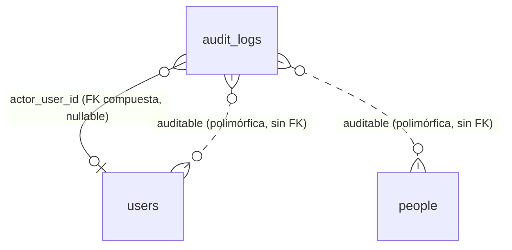
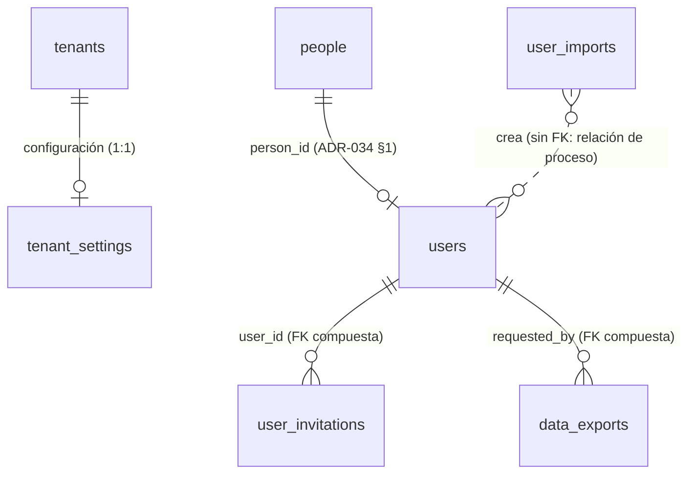

# REQ-CORE · Modelo de datos

> Cubre `audit_logs` (registro automático desde el paso 0.9, esquema fijado en `ADR-034` §3, política de valores en `ADR-035`/`ADR-036`) y las **cuatro tablas nuevas del paso 1.1** (§A). El resto de entidades núcleo (`Person`, `User`, `Role`, `Permission`, `AcademicYear`, `ModuleSubscription`) se documentaron en el cierre de 0.8 (`docs/historial/0.8-modelo-de-datos-nucleo.md`); este fichero no las repite.

> **Estado**: los otros cuatro documentos del módulo (`funcional.md`, `api.md`, `permisos.md`, `operacion.md`) se escribieron en el paso **1.1** y están **pendientes de aprobación**. La parte de `audit_logs` de este fichero es de 0.9 y no se ha reescrito.

> **El paso 1.1 no altera ninguna tabla de 0.8.** Todas sus migraciones son aditivas: cuatro tablas nuevas y ningún `ALTER` sobre `people`, `users`, `roles`, `permission_role`, `module_subscriptions` ni `audit_logs`. La única excepción propuesta es la normalización de `people.locale` de `'es'` a `'es-ES'`, que es *expand* y está condicionada a la decisión pendiente descrita en `funcional.md` §10 (observación final).

---

# Parte 0.9 · `audit_logs`

## Entidades

`audit_logs` es la única tabla que introduce 0.9 (append-only, `tenantTableAppendOnly()`, `ADR-034 §3`):

| Columna | Tipo | Nulo | Descripción |
|---------|------|------|-------------|
| `id`, `tenant_id` | `bigint` | No | De `tenantTableAppendOnly()` |
| `public_id` | ULID | No | `ADR-029` |
| `occurred_at` | `TIMESTAMPTZ` | No | Momento del hecho, no de la escritura |
| `actor_user_id` | `bigint` | Sí | FK compuesta `(tenant_id, actor_user_id) → users` |
| `actor_type` | `text` + `CHECK` | No | `user`, `system`, `console`, `import`, `platform` |
| `auditable_type` | `text` | No | Alias del *morph map*, nunca el FQCN de PHP |
| `auditable_id` | `bigint` | No | Clave interna del sujeto auditado; sin FK, es polimórfica |
| `auditable_public_id` | ULID | Sí | Permite listar sin *join* y sobrevive a la purga de la entidad |
| `event` | `text` + `CHECK` | No | `created`, `updated`, `deleted`, `restored`, `read`, `exported` |
| `changes` | `jsonb` | Sí | Solo atributos modificados, con redacción — ver más abajo |
| `ip_address` | `inet` | Sí | Del actor, no del sujeto |
| `user_agent` | `text` | Sí | |
| `request_id` | `text` | Sí | `INV-013` |
| `context` | `jsonb` | Sí | Extensión por módulo sin migrar; solo identificadores y códigos, nunca valores de atributos |

## Relaciones

Polimórfica, sin clave foránea hacia el sujeto (`auditable_type`/`auditable_id` se resuelven en aplicación, no en base de datos — la fila debe sobrevivir a la purga física de la entidad auditada):



## Índices

Los tres de `ADR-034 §3`, todos con `tenant_id` primero (`RDB`, RLS):

| Índice | Consulta que lo necesita |
|--------|---------------------------|
| `(tenant_id, occurred_at DESC, id DESC)` | Pantalla de auditoría general de `REQ-CORE-005`, orden cronológico inverso. Desempatado por `id` desde `ADR-038 §4.4`: el orden por cursor exige una tupla con desempate único, o dos filas con el mismo `occurred_at` en el límite de página se pierden o se repiten |
| `(tenant_id, auditable_type, auditable_id, occurred_at DESC)` | Historial de una entidad concreta ("¿qué le pasó a este alumno?") |
| `(tenant_id, actor_user_id, occurred_at DESC)` | Historial de un actor concreto ("¿qué hizo este usuario?") |

Sin GIN sobre `changes`: se añade cuando exista una consulta real que lo pida (`ADR-034 §3`).

## Checklist obligatorio

- [x] `tenant_id` presente e indexado como primera columna de las tres consultas frecuentes
- [ ] `academic_year_id` — no aplica: la auditoría no depende del curso académico
- [x] `created_at`/`updated_at`/`deleted_at`/`created_by`/`updated_by` — no aplica en su forma estándar: la tabla es *append-only* (`tenantTableAppendOnly()`), `occurred_at` sustituye a `created_at` y no hay `updated_at`/`deleted_at` posibles por diseño
- [x] Claves foráneas y restricciones declaradas en base de datos (FK compuesta de `actor_user_id`, `CHECK` de `actor_type`/`event`)
- [ ] Importes en enteros de céntimos — no aplica, sin importes
- [x] Fechas en UTC (`TIMESTAMPTZ`)
- [x] Datos de categoría especial en tabla separada y cifrada — por diseño, `changes` nunca contiene su valor (política `Redacted`), no hace falta tabla separada para esta tabla en concreto
- [ ] Particionado evaluado — evaluado y diferido a propósito (`ADR-034 §3`: disparador de revisión a 50M filas o purga que exceda ventana de mantenimiento)

## `audit_logs.changes`: formato exacto

Columna `jsonb`, nullable (`NULL` en los eventos `read`/`exported`). Cada clave es el nombre de un atributo que cambió; cada valor es **siempre un objeto**, nunca un escalar, para que ningún consumidor tenga que ramificar por tipo.

Dos formas posibles de entrada, según si el valor se registra o se redacta (`ADR-035` §3/§4):

```jsonc
{
  // Se registra: el atributo está en Full, o en Selective y en la lista
  // de inclusión del modelo.
  "locale": { "from": "es-ES", "to": "en" },

  // Se redacta: el motivo va en "redacted", nunca el valor.
  "document_number": { "redacted": "identifier", "from_empty": false, "to_empty": false },
  "password":        { "redacted": "secret" },
  "diagnosis":        { "redacted": "special", "from_empty": true, "to_empty": false },
  "observations":     { "redacted": "oversized", "from_empty": false, "to_empty": false }
}
```

Los cuatro motivos de redacción, en el orden exacto en que se evalúan (`AuditChangeBuilder`, `app/Support/Audit/AuditChangeBuilder.php`):

| Motivo | Cuándo | Banderas de vacío |
|--------|--------|--------------------|
| `secret` | El atributo está en `auditSecretAttributes()` del modelo, o su nombre encaja con `config('audit.secret_attribute_patterns')` (`*password*`, `*token*`, `*secret*`, `*_key`, `*totp*`, `*recovery_code*`) | No lleva `from_empty`/`to_empty` — ni siquiera se insinúa si había algo antes |
| `special` | El modelo declara política `Redacted` (categoría especial: salud, NEAE, convivencia) | Sí |
| `identifier` | El modelo declara política `Selective` y el atributo no está en su lista de inclusión (`auditRecordedAttributes()`) — fallo en cerrado | Sí |
| `oversized` | El valor codificado en JSON supera `config('audit.max_value_length')` (256 por defecto). Nunca se trunca | Sí |

`from_empty`/`to_empty` son `true` cuando el valor anterior/nuevo es `null` o cadena vacía. Permiten responder "¿se rellenó/borró este campo?" sin conservar el valor.

## Política de valor por modelo (`AuditValuePolicy`)

Todo modelo auditable implementa `App\Support\Audit\Auditable` y declara `auditValuePolicy()` sin valor por defecto:

| Política | Efecto | Modelos del núcleo (0.9) |
|----------|--------|---------------------------|
| `Full` | Se registra el valor de todos los atributos (salvo secretos, siempre absolutos) | `AcademicYear`, `Role`, `ModuleSubscription` |
| `Selective` | Solo se registra el valor de `auditRecordedAttributes()`; el resto se redacta como `identifier` | `Person` (`locale`, `deleted_at`, `created_by`, `updated_by`), `User` (`status`, `email_verified_at`, `deleted_at`, `created_by`, `updated_by`) |
| `Redacted` | Nunca se registra ningún valor | Ningún modelo del núcleo todavía — reservada a categoría especial (salud, NEAE, convivencia), que llega con sus propios módulos |

`Tenant` y `Permission`/`Module` **no son auditables en 0.9** (`docs/adr/ADR-036-tenant-fuera-del-observer-de-auditoria-de-tenant.md`, que sustituye la fila `Tenant` de `ADR-035 §8`): `Tenant` es una entidad de plataforma sin `tenant_id` propio, y `audit_logs` es una tabla de tenant — su auditoría corresponde a `admin_action_logs` (paso 1.6, `ADR-033` §7), no a este mecanismo. `Permission`/`Module` son catálogos de referencia gestionados por `platform:sync-registry`, fuera del ámbito de auditoría por tenant.

## Columnas estructurales excluidas de `changes`

`id`, `tenant_id` y `public_id` nunca aparecen dentro de `changes`, aunque estén "sucios" en el momento del evento: ya están representados en las columnas propias de la fila (`auditable_id`, el `tenant_id` de la propia fila de `audit_logs`, `auditable_public_id`). Incluirlos añadiría entradas `redacted: identifier` sin ninguna información nueva.

## Eventos y su relación con `changes`

| `event` | `changes` |
|---------|-----------|
| `created` | Todos los atributos asignados en el alta (política de redacción aplicada igual que en `updated`) |
| `updated` | Solo los atributos que cambiaron. El `updated` interno que dispara el borrado/restauración lógicos (`SoftDeletes`) **se suprime**: lo registran `deleted`/`restored` para no duplicar fila |
| `deleted` | `{"deleted_at": {"from": null, "to": "<timestamp>"}}` |
| `restored` | `{"deleted_at": {"from": "<timestamp>", "to": null}}` |
| `read`, `exported` | `NULL` — la auditoría de lectura de categoría especial registra que se leyó, nunca lo que decía |

## Retención y supresión

Ver `PRIVACY.md` §5 y `docs/adr/ADR-035-datos-personales-en-el-registro-de-auditoria.md`. Resumen: el derecho de supresión no se ejerce editando una fila de `audit_logs` (la tabla es inmutable sin excepciones); se ejerce evitando que el valor identificativo entre en la fila desde el origen, y la supresión efectiva llega por vencimiento del plazo de retención (`REQ-CORE-005`, mínimo dos años). La purga por retención es trabajo de `REQ-PRIV-006`, no implementado todavía.

---

# Parte A · Tablas nuevas del paso 1.1

Cuatro tablas, todas de tenant (`TenantMigration::tenantTable()`, con `id`, `tenant_id`, RLS `ENABLE`+`FORCE`, política estándar, `UNIQUE (tenant_id, id)`, `created_at`/`updated_at`/`deleted_at`/`created_by`/`updated_by`). Solo se listan las columnas propias.

## A.1 `tenant_settings` — configuración del centro (`REQ-CORE-002`)

Una fila por tenant. `public_id` ULID (`ADR-029`).

| Columna | Tipo | Nulo | Defecto | Descripción |
|---------|------|------|---------|-------------|
| `public_id` | ULID | No | — | Identificador expuesto |
| `default_locale` | `text` + `CHECK` | No | `'es-ES'` | Idioma por defecto del centro (`ADR-021`) |
| `active_locales` | `jsonb` | No | `["es-ES"]` | Array de idiomas activos, subconjunto no vacío de `{es-ES,en,de,fr}` |
| `timezone` | `text` | No | `'Europe/Madrid'` | Identificador IANA |
| `currency` | `text` + `CHECK` | No | `'EUR'` | ISO 4217 |
| `autonomous_community` | `text` + `CHECK` | Sí | — | Código de comunidad autónoma (`REQ-CORE-001`) |
| `legal_name` | `text` | Sí | — | Razón social |
| `tax_id` | `text` | Sí | — | NIF/CIF |
| `fiscal_address` | `text` | Sí | — | Vía y número |
| `fiscal_postal_code` | `text` | Sí | — | |
| `fiscal_city` | `text` | Sí | — | |
| `fiscal_province` | `text` | Sí | — | |
| `fiscal_country_code` | `text` | Sí | `'ES'` | ISO 3166-1 alfa-2 |
| `color_primary` | `text` + `CHECK` | Sí | — | `^#[0-9A-Fa-f]{6}$` (`RUX-BRAND-002`) |
| `color_secondary` | `text` + `CHECK` | Sí | — | Ídem |
| `logo_object_key` | `text` | Sí | — | Clave en el bucket (`RUX-BRAND-001`) |
| `favicon_object_key` | `text` | Sí | — | `RUX-BRAND-003` |
| `login_background_object_key` | `text` | Sí | — | `RUX-BRAND-004` |

Restricciones:

- `UNIQUE (tenant_id) WHERE deleted_at IS NULL` — una sola configuración viva por centro.
- `CHECK (default_locale IN ('es-ES','en','de','fr'))`. La pertenencia de `default_locale` a `active_locales` se valida en el servicio (`INV-010`): expresarla como `CHECK` sobre `jsonb` es posible pero ilegible, y no es una invariante que una condición de carrera pueda romper.
- `CHECK (jsonb_typeof(active_locales) = 'array' AND jsonb_array_length(active_locales) > 0)`.

**Por qué una tabla propia y no columnas en `tenants`.** `tenants` es la raíz del aislamiento, no lleva `tenant_id`, y **no es auditable** (`ADR-036`: su auditoría corresponde a `admin_action_logs`, paso 1.6). Toda esta configuración la edita el Administrador de Centro, así que sin tabla propia sus cambios quedarían **sin registro de auditoría hasta 1.6**, incumpliendo `INV-003`. Con `tenant_settings` como tabla de tenant, el *observer* de 0.9 la audita sin escribir una línea nueva de mecanismo. Además evita reabrir `ADR-036`, que exigiría un ADR sustitutivo (`CLAUDE.md §11`).

`tenants.name`, `tenants.slug` y `tenants.status` **no se tocan en 1.1**: son ciclo de vida de plataforma (paso 1.6, `funcional.md` §1.1).

**Política de auditoría**: `Selective`. Atributos registrados: `default_locale`, `active_locales`, `timezone`, `currency`, `autonomous_community`, `color_primary`, `color_secondary`, `deleted_at`, `created_by`, `updated_by`. Se redactan como `identifier` los datos fiscales (`legal_name`, `tax_id` y la dirección): en un centro que sea persona física o sociedad unipersonal, el NIF y el domicilio fiscal son datos personales. Las claves de objeto quedan también fuera por no aportar nada legible.

## A.2 `user_invitations` — invitación con enlace caducable (`REQ-CORE-003`)

| Columna | Tipo | Nulo | Descripción |
|---------|------|------|-------------|
| `public_id` | ULID | No | |
| `user_id` | `bigint` | No | `tenantForeignId()` → `users`. La invitación siempre apunta a un usuario ya creado en estado `pendiente` |
| `token_hash` | `text` | No | **Hash** del token. El valor en claro solo viaja en el correo (`RN-CORE-19`) |
| `expires_at` | `TIMESTAMPTZ` | No | `RN-CORE-10` |
| `accepted_at` | `TIMESTAMPTZ` | Sí | Lo escribe el canje, paso **1.2** |
| `revoked_at` | `TIMESTAMPTZ` | Sí | Revocación manual, reemisión o cambio de correo |

Restricciones e índices:

- `UNIQUE (tenant_id, token_hash)` — la búsqueda del canje es por tenant más hash. El tenant ya está resuelto por el host antes de tocar datos (`ADR-033 §2`), así que **no hace falta ni se permite** una búsqueda global por token.
- `UNIQUE (tenant_id, user_id) WHERE accepted_at IS NULL AND revoked_at IS NULL AND deleted_at IS NULL` — una sola invitación viva por usuario (`RN-CORE-09`), garantizada por índice y no por comprobación de aplicación: dos peticiones simultáneas de reenvío la romperían.
- Índice `(tenant_id, expires_at)` para la purga programada.

**Sin columna con el correo de destino.** Se podría guardar «a qué dirección se envió», pero es un dato personal duplicado que se puede derivar de `users.email`, y su única utilidad —detectar que el correo cambió— ya la resuelve `RN-CORE-11` revocando la invitación en ese momento. Minimización por defecto, mismo criterio que `ADR-034 §1` aplicó a `people`.

**Política de auditoría**: `Selective`. Registrados: `expires_at`, `accepted_at`, `revoked_at`, `deleted_at`, `created_by`, `updated_by`. `token_hash` queda redactado como `secret` **automáticamente** por el patrón `*token*` de `config('audit.secret_attribute_patterns')`, sin necesidad de declararlo.

## A.3 `user_imports` — importación masiva de usuarios (`REQ-CORE-003`)

| Columna | Tipo | Nulo | Descripción |
|---------|------|------|-------------|
| `public_id` | ULID | No | |
| `original_filename` | `text` | No | Nombre con el que subió el fichero, para que el administrador reconozca el lote |
| `source_object_key` | `text` | Sí | Clave del CSV en el bucket. A `null` tras la purga |
| `report_object_key` | `text` | Sí | Clave del informe de errores. A `null` tras la purga |
| `status` | `text` + `CHECK` | No | `subido`, `validando`, `validado`, `fallido`, `ejecutando`, `completado` |
| `row_count` | `integer` | Sí | Filas de datos del fichero |
| `error_count` | `integer` | Sí | Filas con al menos un error |
| `created_count` | `integer` | Sí | Usuarios creados en la ejecución |
| `error_summary` | `jsonb` | Sí | Primeras 50 incidencias, para pintar sin descargar el informe |
| `send_invitations` | `boolean` | No | Si la ejecución emite invitaciones |
| `validated_at`, `executed_at` | `TIMESTAMPTZ` | Sí | |

Restricciones e índices:

- Índice `(tenant_id, created_at DESC)` para el listado.

**Sin columna `idempotency_key` propia**: la idempotencia de `POST /user-imports/{id}/execute` la resuelve la tabla transversal `idempotency_keys` (§A.5, `ADR-038 §8.3`), común a los 53 módulos. Duplicar el mecanismo aquí con una columna y un índice propios habría sido exactamente lo que el ADR decidió evitar.

**Sin tabla de filas de importación.** Se consideró `user_import_rows` para paginar los errores desde la interfaz. Se descarta: es una tabla de alto crecimiento para un artefacto **transitorio** que se purga a los 30 días, y que además contendría datos personales de todo el personal del centro replicados fuera de `people`. El informe completo vive como objeto CSV y las 50 primeras incidencias en `error_summary` cubren el caso de uso real (corregir el fichero y reintentar). Si `REQ-ONB-002` (1.24) necesita un modelo por fila para su reversibilidad, es decisión suya y con su propio problema delante.

**`error_summary` no contiene valores de celda**, solo número de línea, nombre de columna, clave de error y, cuando ayuda, un fragmento normalizado no identificativo. Volcar el valor rechazado replicaría datos personales en `jsonb` y, a través del *observer*, en `audit_logs`.

**Política de auditoría**: `Selective`. Registrados: `status`, `row_count`, `error_count`, `created_count`, `validated_at`, `executed_at`, `deleted_at`, `created_by`, `updated_by`. `original_filename`, las claves de objeto y `error_summary` se redactan como `identifier`.

## A.4 `data_exports` — exportación asíncrona (`REQ-CORE-005`)

Primitiva compartida: la introduce `REQ-CORE` para la exportación CSV del registro de auditoría, y la exponen a otros módulos por la interfaz pública `ExportRequestService` (`INV-007`: interfaz, no importación de código interno).

| Columna | Tipo | Nulo | Descripción |
|---------|------|------|-------------|
| `public_id` | ULID | No | |
| `kind` | `text` + `CHECK` | No | `audit_logs` en 1.1. Cada módulo añade su valor al `CHECK` por *expand* |
| `format` | `text` + `CHECK` | No | `csv` en 1.1. `pdf` diferido a 1.17 |
| `filters` | `jsonb` | Sí | Filtros con los que se pidió, para poder reproducirla y auditar qué se extrajo |
| `status` | `text` + `CHECK` | No | `pendiente`, `generando`, `completada`, `fallida` |
| `object_key` | `text` | Sí | Clave del artefacto en el bucket |
| `row_count` | `integer` | Sí | |
| `error_code` | `text` | Sí | Clave de traducción, no texto (`INV-009`) |
| `requested_by` | `bigint` | No | `tenantForeignId()` → `users`. Redundante con `created_by`, y a propósito: `created_by` es autoría de fila, `requested_by` es **quién puede descargar** |
| `expires_at` | `TIMESTAMPTZ` | No | Caducidad del artefacto |
| `completed_at` | `TIMESTAMPTZ` | Sí | |

Índices: `(tenant_id, requested_by, created_at DESC)` para el listado propio y `(tenant_id, expires_at)` para la purga.

**Sin `academic_year_id`**: una exportación no pertenece a un curso académico (`ADR-034 §4`: o `NOT NULL` o no existe la columna; ante la duda, no existe).

**Política de auditoría**: `Full`. No contiene datos personales: solo qué se pidió, cuándo y por quién. `filters` puede incluir el `public_id` de un actor, que es un identificador opaco ya presente en `audit_logs`.

## A.5 `idempotency_keys` — primitiva transversal de idempotencia (`ADR-038 §8.3`)

Introducida aquí por ser 1.1 el primer módulo que necesita idempotencia (`POST /user-imports/{id}/execute`), pero **no es de `REQ-CORE`**: es infraestructura de plataforma que los 53 módulos comparten, igual que `audit_logs` o `data_exports`. Cualquier módulo con una escritura idempotente escribe en esta tabla, nunca en una columna propia.

| Columna | Tipo | Nulo | Descripción |
|---------|------|------|-------------|
| `id`, `tenant_id` | `bigint` | No | `tenantTable()` |
| `endpoint` | `text` | No | Identificador estable del endpoint (p. ej. `user-imports.execute`), no la ruta con parámetros |
| `idempotency_key` | `text` | No | ULID enviado por el cliente en la cabecera `Idempotency-Key` |
| `request_body_hash` | `text` | No | Hash del cuerpo normalizado, para detectar reutilización de la clave con un cuerpo distinto (`409`) |
| `status` | `text` + `CHECK` | No | `en_curso`, `completado` |
| `response_status` | `smallint` | Sí | Código HTTP de la respuesta original, a `null` mientras está `en_curso` |
| `response_body` | `jsonb` | Sí | Cuerpo de la respuesta original, para reproducirlo íntegro en la repetición |
| `expires_at` | `TIMESTAMPTZ` | No | `created_at` + 24 horas (`ADR-038 §8.2`) |

Restricciones e índices: `UNIQUE (tenant_id, endpoint, idempotency_key)` — hace de cerrojo natural contra dos peticiones concurrentes con la misma clave, sin mecanismo adicional; `(tenant_id, expires_at)` para la purga diaria.

**Por qué en PostgreSQL y no en Redis** (`ADR-038 §8.3`): Redis es la caché del sistema (`CLAUDE.md §1`) y un `FLUSHALL`, un reinicio sin persistencia o un desalojo por memoria borrarían la clave — el modo de fallo sería exactamente lo que `INV-011` existe para impedir (un cobro o un envío duplicado). Una clave de idempotencia que no sobrevive a un reinicio no es idempotencia.

**Política de auditoría**: no auditable. No es una entidad de negocio, es un registro técnico de deduplicación sin datos personales.

## A.6 Relaciones



`idempotency_keys` no aparece en el diagrama: es una tabla técnica sin relación de dominio con ninguna entidad, solo con el `tenant_id` de quien la escribió.

Todas las claves foráneas son **compuestas** `(tenant_id, columna) REFERENCES tabla (tenant_id, id)` mediante `TenantMigration::tenantForeignId()` (`ADR-033 §6`). `tenant_settings` referencia al tenant por su propio `tenant_id`, que ya es la columna del helper.

## A.7 Índices y la consulta que los justifica

| Índice | Consulta |
|--------|----------|
| `tenant_settings (tenant_id)` único parcial | Lectura de la configuración en cada petición cacheada y en el endpoint público de branding |
| `user_invitations (tenant_id, token_hash)` único | Canje de la invitación (paso 1.2): búsqueda exacta por tenant más hash |
| `user_invitations (tenant_id, user_id)` único parcial | Invariante de una sola invitación viva, y listado de invitaciones de un usuario |
| `user_invitations (tenant_id, expires_at)` | Purga programada de invitaciones caducadas |
| `user_imports (tenant_id, created_at DESC)` | Listado de importaciones, orden cronológico inverso |
| `data_exports (tenant_id, requested_by, created_at DESC)` | «Mis exportaciones» |
| `data_exports (tenant_id, expires_at)` | Purga de artefactos vencidos |
| `idempotency_keys (tenant_id, endpoint, idempotency_key)` único | Resolución de la ejecución repetida (`INV-011`, `ADR-038 §8.3`) |
| `idempotency_keys (tenant_id, expires_at)` | Purga diaria de claves vencidas |

Índices del listado de usuarios: **ninguno nuevo**. `GET /users` ordena por `family_name_1` y filtra por `status` y por rol sobre `people`/`users`/`role_user`, tablas de 0.8 que ya llevan `tenant_id` como primera columna de sus índices. Si la medición con volumen real (`REQ-SEED`, 1.15b) muestra que hace falta un índice de apoyo para la búsqueda por texto, se añade entonces **con la consulta delante**, no ahora por anticipación.

## A.8 Checklist obligatorio (tablas del paso 1.1)

- [x] `tenant_id` presente e indexado como primera columna de las consultas frecuentes — vía `tenantTable()` en las cinco
- [x] `academic_year_id` — **no aplica** en ninguna: ninguna depende del curso académico. Por `ADR-034 §4`, la columna no existe (nunca nullable)
- [x] `created_at`/`updated_at`/`deleted_at`/`created_by`/`updated_by` — las cuatro de negocio, vía `tenantTable()`. `idempotency_keys` es la excepción deliberada: es un registro técnico de vida corta (24 h) sin autoría de negocio que registrar, vía `tenantTable()` sin los campos de auditoría de autoría
- [x] Claves foráneas y restricciones declaradas en base de datos — FK compuestas, `CHECK` de todos los enumerados, índices únicos parciales
- [x] Importes en enteros de céntimos — **no aplica**, sin importes. `tenant_settings.currency` es la moneda del centro, no un importe
- [x] Fechas en UTC (`TIMESTAMPTZ`) — todas
- [x] Datos de categoría especial en tabla separada y cifrada — **no aplica**: este módulo no trata salud, NEAE ni convivencia (`permisos.md` §6)
- [x] Particionado evaluado — **no procede**: las cinco son de bajo crecimiento (una fila por tenant, una invitación por alta, una importación o exportación por acción manual, una clave de idempotencia purgada a las 24 h). La única de alto crecimiento del módulo es `audit_logs`, con su disparador de revisión ya escrito en `ADR-034 §3`
- [x] Toda restricción de unicidad sobre tabla con borrado lógico es **parcial** (`WHERE deleted_at IS NULL`), salvo `UNIQUE (tenant_id, token_hash)` y `UNIQUE (tenant_id, endpoint, idempotency_key)` — deliberadamente totales: un token no se reutiliza jamás (igual que `public_id`, `ADR-034 §6`) y una clave de idempotencia no tiene borrado lógico, se purga físicamente

## A.9 Retención y supresión (tablas del paso 1.1)

| Tabla | Plazo | Base y mecanismo |
|-------|-------|------------------|
| `tenant_settings` | Vida del tenant | Datos de la organización, no de personas (salvo el matiz fiscal de A.1). Se elimina con el tenant en el flujo de baja de 1.6 |
| `user_invitations` | Borrado lógico a los 30 días de caducar | El hash no es reversible; lo que se minimiza es la traza de que se invitó a alguien. `PurgeExpiredInvitations` |
| `user_imports` | Fila permanente; **objetos a los 30 días** | El CSV fuente y el informe contienen datos personales de todo el personal (`RN-CORE-21`). `PurgeImportArtifacts` borra los objetos y pone las claves a `null`, conservando la traza de que hubo importación |
| `data_exports` | 7 días | El artefacto es regenerable. `PurgeExpiredExports` borra objeto y fila |
| `idempotency_keys` | 24 horas | Purga física diaria (`ADR-038 §8.2`/§8.3). Sin datos personales que proteger; la ventana corta es para no acumular, no por privacidad |

Ninguna de estas purgas toca `audit_logs`: la retención del registro de auditoría es `REQ-PRIV-006` y se ejecuta con el rol propietario (`ADR-034 §3`).

**Derecho de supresión**: la anonimización de una persona (`ADR-004` nivel 2) afecta a `people`/`users`; sobre estas cuatro tablas el efecto es indirecto y ya correcto, porque ninguna guarda copia desnormalizada de un dato personal — el mismo criterio que `ADR-034 §3` aplicó al no guardar el nombre del actor en `audit_logs`.
