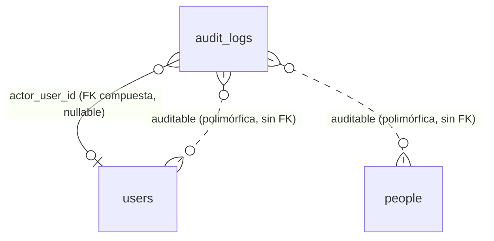

# REQ-CORE · Modelo de datos

> Cubre `audit_logs` (registro automático desde el paso 0.9, esquema fijado en `ADR-034` §3, política de valores en `ADR-035`/`ADR-036`). El resto de entidades núcleo (`Person`, `User`, `Role`, `Permission`, `AcademicYear`, `ModuleSubscription`) se documentaron en el cierre de 0.8 (`docs/historial/0.8-modelo-de-datos-nucleo.md`); este fichero no las repite.

> **Solo `datos.md`, a propósito.** `REQ-CORE` como módulo con endpoints y permisos propios (`funcional.md`/`api.md`/`permisos.md`/`operacion.md`, `CLAUDE.md §6`) no se cierra en 0.9 ni en 0.8: 0.9 solo añade infraestructura transversal (el *observer* de auditoría) sin superficie HTTP nueva. Esos cuatro documentos se completan en el paso **1.1**, cuando `REQ-CORE` exponga de verdad tenants y usuarios como módulo con endpoints. Dejarlos vacíos ahora sería inventar contenido sobre una API que no existe todavía (`CLAUDE.md §11`).

## Entidades

`audit_logs` es la única tabla que introduce 0.9 (append-only, `tenantTableAppendOnly()`, `ADR-034 §3`):

| Columna | Tipo | Nulo | Descripción |
|---------|------|------|-------------|
| `id`, `tenant_id` | `bigint` | No | De `tenantTableAppendOnly()` |
| `public_id` | ULID | No | `ADR-029` |
| `occurred_at` | `TIMESTAMPTZ` | No | Momento del hecho, no de la escritura |
| `actor_user_id` | `bigint` | Sí | FK compuesta `(tenant_id, actor_user_id) → users` |
| `actor_type` | `text` + `CHECK` | No | `user`, `system`, `console`, `import`, `platform` |
| `auditable_type` | `text` | No | Alias del *morph map*, nunca el FQCN de PHP |
| `auditable_id` | `bigint` | No | Clave interna del sujeto auditado; sin FK, es polimórfica |
| `auditable_public_id` | ULID | Sí | Permite listar sin *join* y sobrevive a la purga de la entidad |
| `event` | `text` + `CHECK` | No | `created`, `updated`, `deleted`, `restored`, `read`, `exported` |
| `changes` | `jsonb` | Sí | Solo atributos modificados, con redacción — ver más abajo |
| `ip_address` | `inet` | Sí | Del actor, no del sujeto |
| `user_agent` | `text` | Sí | |
| `request_id` | `text` | Sí | `INV-013` |
| `context` | `jsonb` | Sí | Extensión por módulo sin migrar; solo identificadores y códigos, nunca valores de atributos |

## Relaciones

Polimórfica, sin clave foránea hacia el sujeto (`auditable_type`/`auditable_id` se resuelven en aplicación, no en base de datos — la fila debe sobrevivir a la purga física de la entidad auditada):



## Índices

Los tres de `ADR-034 §3`, todos con `tenant_id` primero (`RDB`, RLS):

| Índice | Consulta que lo necesita |
|--------|---------------------------|
| `(tenant_id, occurred_at DESC)` | Pantalla de auditoría general de `REQ-CORE-005`, orden cronológico inverso |
| `(tenant_id, auditable_type, auditable_id, occurred_at DESC)` | Historial de una entidad concreta ("¿qué le pasó a este alumno?") |
| `(tenant_id, actor_user_id, occurred_at DESC)` | Historial de un actor concreto ("¿qué hizo este usuario?") |

Sin GIN sobre `changes`: se añade cuando exista una consulta real que lo pida (`ADR-034 §3`).

## Checklist obligatorio

- [x] `tenant_id` presente e indexado como primera columna de las tres consultas frecuentes
- [ ] `academic_year_id` — no aplica: la auditoría no depende del curso académico
- [x] `created_at`/`updated_at`/`deleted_at`/`created_by`/`updated_by` — no aplica en su forma estándar: la tabla es *append-only* (`tenantTableAppendOnly()`), `occurred_at` sustituye a `created_at` y no hay `updated_at`/`deleted_at` posibles por diseño
- [x] Claves foráneas y restricciones declaradas en base de datos (FK compuesta de `actor_user_id`, `CHECK` de `actor_type`/`event`)
- [ ] Importes en enteros de céntimos — no aplica, sin importes
- [x] Fechas en UTC (`TIMESTAMPTZ`)
- [x] Datos de categoría especial en tabla separada y cifrada — por diseño, `changes` nunca contiene su valor (política `Redacted`), no hace falta tabla separada para esta tabla en concreto
- [ ] Particionado evaluado — evaluado y diferido a propósito (`ADR-034 §3`: disparador de revisión a 50M filas o purga que exceda ventana de mantenimiento)

## `audit_logs.changes`: formato exacto

Columna `jsonb`, nullable (`NULL` en los eventos `read`/`exported`). Cada clave es el nombre de un atributo que cambió; cada valor es **siempre un objeto**, nunca un escalar, para que ningún consumidor tenga que ramificar por tipo.

Dos formas posibles de entrada, según si el valor se registra o se redacta (`ADR-035` §3/§4):

```jsonc
{
  // Se registra: el atributo está en Full, o en Selective y en la lista
  // de inclusión del modelo.
  "locale": { "from": "es-ES", "to": "en" },

  // Se redacta: el motivo va en "redacted", nunca el valor.
  "document_number": { "redacted": "identifier", "from_empty": false, "to_empty": false },
  "password":        { "redacted": "secret" },
  "diagnosis":        { "redacted": "special", "from_empty": true, "to_empty": false },
  "observations":     { "redacted": "oversized", "from_empty": false, "to_empty": false }
}
```

Los cuatro motivos de redacción, en el orden exacto en que se evalúan (`AuditChangeBuilder`, `app/Support/Audit/AuditChangeBuilder.php`):

| Motivo | Cuándo | Banderas de vacío |
|--------|--------|--------------------|
| `secret` | El atributo está en `auditSecretAttributes()` del modelo, o su nombre encaja con `config('audit.secret_attribute_patterns')` (`*password*`, `*token*`, `*secret*`, `*_key`, `*totp*`, `*recovery_code*`) | No lleva `from_empty`/`to_empty` — ni siquiera se insinúa si había algo antes |
| `special` | El modelo declara política `Redacted` (categoría especial: salud, NEAE, convivencia) | Sí |
| `identifier` | El modelo declara política `Selective` y el atributo no está en su lista de inclusión (`auditRecordedAttributes()`) — fallo en cerrado | Sí |
| `oversized` | El valor codificado en JSON supera `config('audit.max_value_length')` (256 por defecto). Nunca se trunca | Sí |

`from_empty`/`to_empty` son `true` cuando el valor anterior/nuevo es `null` o cadena vacía. Permiten responder "¿se rellenó/borró este campo?" sin conservar el valor.

## Política de valor por modelo (`AuditValuePolicy`)

Todo modelo auditable implementa `App\Support\Audit\Auditable` y declara `auditValuePolicy()` sin valor por defecto:

| Política | Efecto | Modelos del núcleo (0.9) |
|----------|--------|---------------------------|
| `Full` | Se registra el valor de todos los atributos (salvo secretos, siempre absolutos) | `AcademicYear`, `Role`, `ModuleSubscription` |
| `Selective` | Solo se registra el valor de `auditRecordedAttributes()`; el resto se redacta como `identifier` | `Person` (`locale`, `deleted_at`, `created_by`, `updated_by`), `User` (`status`, `email_verified_at`, `deleted_at`, `created_by`, `updated_by`) |
| `Redacted` | Nunca se registra ningún valor | Ningún modelo del núcleo todavía — reservada a categoría especial (salud, NEAE, convivencia), que llega con sus propios módulos |

`Tenant` y `Permission`/`Module` **no son auditables en 0.9** (`docs/adr/ADR-036-tenant-fuera-del-observer-de-auditoria-de-tenant.md`, que sustituye la fila `Tenant` de `ADR-035 §8`): `Tenant` es una entidad de plataforma sin `tenant_id` propio, y `audit_logs` es una tabla de tenant — su auditoría corresponde a `admin_action_logs` (paso 1.6, `ADR-033` §7), no a este mecanismo. `Permission`/`Module` son catálogos de referencia gestionados por `platform:sync-registry`, fuera del ámbito de auditoría por tenant.

## Columnas estructurales excluidas de `changes`

`id`, `tenant_id` y `public_id` nunca aparecen dentro de `changes`, aunque estén "sucios" en el momento del evento: ya están representados en las columnas propias de la fila (`auditable_id`, el `tenant_id` de la propia fila de `audit_logs`, `auditable_public_id`). Incluirlos añadiría entradas `redacted: identifier` sin ninguna información nueva.

## Eventos y su relación con `changes`

| `event` | `changes` |
|---------|-----------|
| `created` | Todos los atributos asignados en el alta (política de redacción aplicada igual que en `updated`) |
| `updated` | Solo los atributos que cambiaron. El `updated` interno que dispara el borrado/restauración lógicos (`SoftDeletes`) **se suprime**: lo registran `deleted`/`restored` para no duplicar fila |
| `deleted` | `{"deleted_at": {"from": null, "to": "<timestamp>"}}` |
| `restored` | `{"deleted_at": {"from": "<timestamp>", "to": null}}` |
| `read`, `exported` | `NULL` — la auditoría de lectura de categoría especial registra que se leyó, nunca lo que decía |

## Retención y supresión

Ver `PRIVACY.md` §5 y `docs/adr/ADR-035-datos-personales-en-el-registro-de-auditoria.md`. Resumen: el derecho de supresión no se ejerce editando una fila de `audit_logs` (la tabla es inmutable sin excepciones); se ejerce evitando que el valor identificativo entre en la fila desde el origen, y la supresión efectiva llega por vencimiento del plazo de retención (`REQ-CORE-005`, mínimo dos años). La purga por retención es trabajo de `REQ-PRIV-006`, no implementado todavía.
