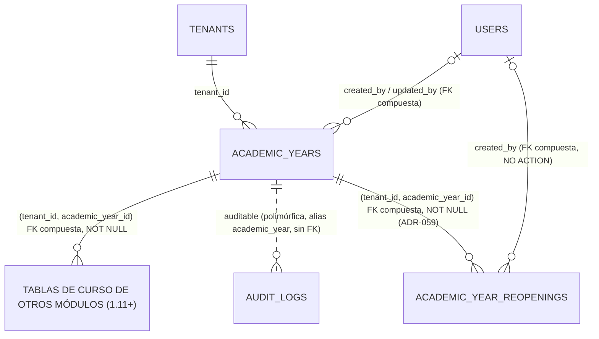

# REQ-CURSO · Modelo de datos

> **Estado**: **APROBADA** (2026-10-07), paso **1.10**, con los ajustes de `ADR-057` (aceptado). Ver `funcional.md` para alcance y preguntas abiertas.
>
> **Resumen**: 1.10 **no crea ninguna tabla ni altera ninguna columna**. `academic_years` existe desde 0.8.2 (`ADR-034 §4`) con la forma que `REQ-CURSO-001` necesita, y las entidades de `REQ-CURSO-002` a `-005` (`YearRollover`, `PromotionDecision`, `RenewalCampaign`, `YearArchive`) quedan fuera de alcance (`funcional.md §1.2`). **Sí trae una migración**: la que crea la función `app.assert_academic_year_writable()` del bloqueo de escritura (`ADR-057 §5.2`, §1.4). Lo que además añade este documento es el contrato de datos que deben cumplir **las tablas de los demás módulos** que dependen del curso, y el traslado del modelo al módulo (que no es esquema, `OPEN-CURSO-03`).
>
> **Ampliación por `ADR-059`** (aceptado el 2026-10-08, reapertura de un curso cerrado, `OPEN-CURSO-08`): **una tabla nueva**, `academic_year_reopenings` (§1.5), *append-only* y con `academic_year_id`. **No altera** `academic_years`, la función del bloqueo ni ningún disparador. El paso de implementación lo fija `PLAN-IMPLEMENTACION.md`.

---

## 1. Entidades

### 1.1 `academic_years` (existente, 0.8.2; sin cambios en 1.10)

Migración: `apps/api/database/migrations/2026_08_18_100100_create_academic_years_table.php`. Tabla de tenant ordinaria (`TenantMigration::tenantTable()`, RLS `ENABLE`+`FORCE`, `UNIQUE (tenant_id, id)`).

| Columna | Tipo | Nulo | Por defecto | Descripción |
|---------|------|------|-------------|-------------|
| `id` | `bigint` | No | secuencia | Clave interna. No sale de la API (`ADR-029`) |
| `tenant_id` | `bigint` | No | `app.current_tenant_id()` | `ADR-033` |
| `public_id` | `character(26)` | No | — | ULID, único (`AR-05`) |
| `code` | `text` | No | — | Código del curso, p. ej. `2026-2027`. Contenido del centro, no se traduce. Único por centro entre no borrados |
| `starts_on` | `date` | No | — | Primer día del curso. `date`, no `timestamptz`: es una fecha civil sin hora, sin conversión de zona |
| `ends_on` | `date` | No | — | Último día del curso. `CHECK (ends_on > starts_on)` |
| `status` | `text` | No | `'planificacion'` | `CHECK IN ('planificacion','activo','cerrado','archivado')`. Lo escribe solo el servicio de transiciones (`RN-CURSO-10`) |
| `created_at`, `updated_at`, `deleted_at` | `timestamptz` | `deleted_at` sí | — | `INV-005`, de `tenantTable()` |
| `created_by`, `updated_by` | `bigint` | Sí | — | FK compuesta a `users` (`ADR-034 §6`) |

**Por qué no se añade nada en 1.10:**

- **Fechas de transición** (`activated_at`, `closed_at`): las registra `audit_logs` (`RN-CURSO-13`). Añadirlas después es *expand* puro (columna anulable).
- **Motivo de cierre**, **usuario que cerró**: no los pide ningún requisito; la auditoría guarda el actor.
- **Restricción de exclusión contra solapes**: `ADR-034 §4` la descartó (exige `btree_gist`); la regla de `RN-CURSO-05` (aprobada) se valida en el servicio.
- **`CHECK` de código no vacío**: la validación de servidor basta para el único escritor (`RN-CURSO-10`); si se quiere en el motor, es un `ADD CONSTRAINT … NOT VALID` + `VALIDATE` en una entrega posterior, sin bloqueo. No lo propongo porque la tabla solo tiene un escritor.

### 1.2 Modelo y enumerado (`OPEN-CURSO-03`, aprobada)

| Antes de 1.10 | Resultado (hecho) |
|-----|-----------|
| `App\Models\AcademicYear` (`TenantModel`, `Auditable`, `AuditValuePolicy::Full`, `HasPublicId`) | `App\Modules\Curso\Domain\Models\AcademicYear`, sin cambiar nada más |
| `App\Models\AcademicYearStatus` | `App\Modules\Curso\Domain\AcademicYearStatus` (fuera de `Domain\Models`, para que otros módulos puedan usar el vocabulario sin tocar el modelo, `AR-01`) |
| Alias `academic_year` en `AppServiceProvider` | El **mismo** alias, ya registrado en `CursoServiceProvider::boot()` con `Relation::enforceMorphMap` (precedente `CoreServiceProvider`) |

Mover el modelo **no es un cambio de esquema** y no toca `audit_logs` (que guarda el alias, nunca el FQCN, `ADR-034 §3`). La migración **no se mueve**.

### 1.3 Tabla sonda de test (solo en la suite, nunca en producción)

Para probar el contrato transversal sin consumidor real (`funcional.md §1.3`): tabla creada dentro del test con `TenantMigration::tenantTable()` + `tenantForeignId($table, 'academic_year_id', 'academic_years')`, con su modelo de test. Al crearse con el ayudante, **recibe el disparador `academic_year_write_guard`** (§1.4). Precedente: `tenant_model_probes` (0.7/0.8, bug 4 de `docs/historial/0.8-modelo-de-datos-nucleo.md`: crear el *fixture* con el ayudante real, no con `Schema::create()` a mano). Ojo al bug 3 de 0.7 (crear y borrar por la misma conexión que la usa).

Una **segunda sonda, creada a propósito sin el ayudante** (`Schema::create` con columna `academic_year_id`), sirve a los casos fijos de `AR-13`: su presencia debe hacer fallar la regla (`CA-CURSO-043`, `CA-057-06`).

### 1.4 Función `app.assert_academic_year_writable()` y disparador `academic_year_write_guard` (`ADR-057`)

**Única migración de 1.10**, en `apps/api/database/migrations/` (esquema del núcleo, junto a la de `academic_years`), con `down()` que elimina la función. Es la **primera función PL/pgSQL** del proyecto; revisión obligatoria de `db-reviewer`. El texto exacto de la función es de la implementación; lo que sigue es lo que fija `ADR-057 §5.1`-`§5.3`.

| Aspecto | Decisión |
|---------|----------|
| Ubicación y propiedad | Esquema `app` (junto a `app.current_tenant_id()`), propiedad del rol propietario, `SECURITY INVOKER` (sujeta a RLS como quien escribe; nunca `SECURITY DEFINER`), nombres totalmente cualificados |
| Qué bloquea | Si el curso es de solo lectura (`status` ∈ {`cerrado`, `archivado`}): `INSERT` con ese curso (`NEW`); `UPDATE` de una fila de ese curso (`OLD`) o que pase a él (`NEW`) —incluidos borrado lógico y restauración—; `DELETE` (`OLD`). `planificacion` y `activo` admiten escritura |
| Exención | El **propietario real de la tabla** (comparado con `pg_class.relowner` de `TG_RELID`, no con un nombre de rol escrito en SQL) no está sujeto: migraciones de relleno, purga física de un tenant (issue #371), archivado |
| Serialización | Lee la fila de `academic_years` del curso afectado con `FOR SHARE` (filtrando por `tenant_id` e `id`); choca con el `FOR UPDATE` del cierre (`funcional.md RN-CURSO-32`) |
| Error | `RAISE EXCEPTION` con `SQLSTATE` propio **`YC001`** (nunca `P0001` ni `42501`) y mensaje `academic_year_closed:<public_id del curso>`, compuesto por el producto, independiente de `lc_messages`. La implementación comprueba que la clase `CY` no la usa la versión instalada de PostgreSQL |
| Curso inexistente | No lo decide la función: lo rechaza la FK compuesta (`23503`) |
| Vocabulario de estados | Duplicado en SQL y en el enumerado `AcademicYearStatus`, unido por test de paridad (`CA-057-07`). Añadir un estado ya exige migración (`CHECK`), y la función se actualiza en la misma entrega |
| Enganche | `TenantMigration::tenantTable()` y `tenantTableAppendOnly()` crean el disparador `academic_year_write_guard` (`BEFORE INSERT OR UPDATE OR DELETE … FOR EACH ROW EXECUTE FUNCTION app.assert_academic_year_writable()`) si la tabla tiene `academic_year_id`; `TenantMigration::guardAcademicYearWrites(string $table)` cubre añadir la columna a una tabla existente. Las particiones heredan el disparador del padre |
| Privilegios necesarios | `UPDATE` sobre `academic_years` para el `FOR SHARE` (los dos roles de aplicación lo tienen). **Ningún rol de aplicación tiene `TRUNCATE`** sobre tablas de curso (`TRUNCATE` no dispara disparadores de fila); concederlo sería una regresión (`CA-057-10`) |
| Retirar la columna | `DROP TRIGGER academic_year_write_guard ON <tabla>` **antes** de `DROP COLUMN academic_year_id` (y, en *contract*, de `DROP TABLE` no hace falta). Un disparador que sobrevive a la columna leería `NEW.academic_year_id` inexistente y fallaría en cada escritura; `AR-13` lo vigila (tabla con el disparador sin la columna) |
| Requisito previo de despliegue | El rol propietario necesita `CREATE` sobre el esquema `app` (`GRANT CREATE ON SCHEMA app TO <propietario>`, `RUNBOOK.md` paso 0); la migración lo comprueba y aborta con el comando exacto. La función fija `SET search_path = pg_catalog, pg_temp` |
| Excepciones al bloqueo | Ninguna en 1.10. Su forma futura (variable de configuración local a la transacción con pares `tabla:operación`, fijada solo desde `Curso\Domain`) está en `ADR-057 §5.7`; no se construye ahora. La reapertura (`ADR-059`) **no** es una excepción: cambia `academic_years.status`, tabla sin disparador (§1.5) |

### 1.5 `academic_year_reopenings` (nueva, `ADR-059 §5.4`)

Registro *append-only* de cada reapertura de un curso cerrado (`funcional.md §4.6`, `RN-CURSO-43`). Responde «quién reabrió, cuándo y por qué» sin leer `audit_logs` y sin depender de que `AuditRecorder` escriba `audit_logs.context` (no lo hace hoy). Precedente: `mfa_resets`.

Migración del módulo (`apps/api/app/Modules/Curso/Database/migrations/`) con **`TenantMigration::tenantTableAppendOnly()`** y `TenantMigration::tenantForeignId($table, 'academic_year_id', 'academic_years')`: RLS `ENABLE`+`FORCE`, `UNIQUE (tenant_id, id)`, y **el disparador `academic_year_write_guard`**, sin excepción en `AR-13` (es dato del curso).

| Columna | Tipo | Nulo | Por defecto | Descripción |
|---------|------|------|-------------|-------------|
| `id` | `bigint` | No | secuencia | Clave interna. No sale de la API (`ADR-029`) |
| `tenant_id` | `bigint` | No | `app.current_tenant_id()` | `ADR-033` |
| `public_id` | `character(26)` | No | — | ULID, único (`AR-05`) |
| `academic_year_id` | `bigint` | No | — | Curso reabierto. FK compuesta `(tenant_id, academic_year_id) → academic_years (tenant_id, id)`, **`NO ACTION`** (prohibidas las acciones referenciales en tablas con `academic_year_id`, `AR-13`) |
| `reason` | `text` | No | — | Motivo de la reapertura, recortado y no vacío (validado en servidor, `INV-010`). Contenido del centro; el manual advierte de no escribir datos personales |
| `created_by` | `bigint` | **[DERIVADA]** ver nota | — | Usuario que reabrió. FK compuesta a `users`, también **`NO ACTION`**: en una tabla con `academic_year_id` está prohibido `nullOnDelete`/`cascadeOnDelete` (`AR-13`) |
| `created_at` | `timestamptz` | No | — | Momento de la reapertura |

Sin `updated_at`, `updated_by` ni `deleted_at`: es *append-only* (lo que dé `tenantTableAppendOnly()`, igual que `mfa_resets`). No se añade columna de motivo a `academic_years`: se sobrescribiría en la segunda reapertura y mezclaría histórico con estado (`ADR-059 §8`).

**Nota sobre `created_by`**: el único camino de alta es el *endpoint* autenticado, así que en la práctica siempre lleva valor; si se declara `NOT NULL` o anulable lo fija la implementación con el mismo criterio que `mfa_resets`. No se propone `CHECK` de motivo no vacío en el motor: hay un único escritor y la validación de servidor basta (mismo criterio que `code` en §1.1).

**Orden de escritura** (`ADR-059 §5.3`): la fila se inserta **después** de cambiar `academic_years.status` a `activo`, en la misma transacción; el disparador lee el estado ya actualizado por la propia transacción y la admite. Si el curso se vuelve a cerrar, sus filas quedan inmutables, que es lo deseado.

**Modelo**: `Curso\Domain\Models\AcademicYearReopening` **[DERIVADA: nombre]**, `extends TenantModel`, `implements Auditable` con `AuditValuePolicy::Full` (`ADR-035 §8`, criterio de `user_mfa_exemptions.reason`), alias de *morph map* `academic_year_reopening` registrado en `CursoServiceProvider::boot()` (`AR-06`). Su alta queda como `created` en `audit_logs`; sin evento nuevo (`ADR-039 §5.3`).

---

## 2. Contrato de datos para los módulos que dependen del curso

Lo fija `ADR-034 §4` y se repite aquí porque este módulo es su dueño. **Ninguna de estas reglas es nueva salvo las marcadas.**

| Regla | Origen |
|-------|--------|
| `academic_year_id` es `NOT NULL` o no existe. Nunca anulable | `ADR-034 §4`; test de esquema de 0.8.10 |
| Se declara con `TenantMigration::tenantForeignId(Blueprint $blueprint, 'academic_year_id', 'academic_years')` (firma real: `Blueprint $blueprint, string $column, string $referencedTable, ?string $constraintName = null`): columna, índice y FK compuesta `(tenant_id, academic_year_id) → academic_years (tenant_id, id)` | `ADR-034 §7`, `ADR-033 §6` |
| Índice compuesto con `tenant_id` primero y `academic_year_id` segundo en las consultas frecuentes | `RDB-009`, `§16.3` regla 2 |
| «Ante la duda, la entidad no es del curso: su matrícula sí lo es» | `ADR-034 §4`, `§16.3` regla 4 |
| **[Nueva]** Una hija no pertenece a un curso distinto del de su padre; se recomienda imponerlo con FK compuesta que incluya `academic_year_id` | `RN-CURSO-27` |
| **[Nueva]** Toda tabla con `academic_year_id` lleva el disparador `academic_year_write_guard`, que ponen los ayudantes de `TenantMigration` (§1.4); lo comprueba `AR-13` sobre el esquema real. Lista de excepciones de `AR-13` vacía; ampliarla exige especificación aprobada expresamente por el usuario | `RN-CURSO-23`, `ADR-057 §5.3` |
| **[Aviso]** Si la tabla se particiona por curso (`RDB-001`), la clave primaria y los índices únicos deben incluir `academic_year_id`, y las FK que apunten a ella también; se decide en la primera migración de la tabla | `RDB-001`, `funcional.md §12` |
| Ningún otro módulo lee `academic_years` por SQL ni por el modelo: usa las interfaces de `Curso\Domain` | `INV-007`, `RARQ-ARC-003`, `RN-CURSO-26` |

---

## 3. Relaciones

Futuras (fuera de 1.10, todas con `academic_year_id NOT NULL`): `year_rollovers` (`REQ-CURSO-002`), `promotion_decisions` (`-003`), `renewal_campaigns` (`-004`), y lo que decida el ADR de archivado para `YearArchive` (`-005`).

---

## 4. Índices

Existentes, y suficientes para 1.10. **No se propone ninguno nuevo.**

| Índice | Consulta que lo necesita |
|--------|---------------------------|
| `academic_years_tenant_code_unique` — `(tenant_id, code) WHERE deleted_at IS NULL`, único | Unicidad del código (`RN-CURSO-01`) |
| `academic_years_tenant_status_unique` — `(tenant_id, status) WHERE status IN ('activo','planificacion') AND deleted_at IS NULL`, único | Un activo y un en planificación como mucho (`RN-CURSO-04`, `-11`) **y** resolución del curso activo en cada petición (`RN-CURSO-24`: `WHERE tenant_id = ? AND status = 'activo' AND deleted_at IS NULL`, búsqueda por índice único) |
| `UNIQUE (tenant_id, id)` | Destino de las FK compuestas de los demás módulos |
| `UNIQUE (public_id)` | Detalle por `public_id` |

El listado (`ORDER BY starts_on DESC, id DESC`) no lleva índice propio: un centro tiene un curso por año y la tabla tendrá decenas de filas por tenant en toda su vida. Un índice para eso es deuda (plantilla `datos.md`).

**Reapertura (`ADR-059`)**: la condición «es el cerrado más reciente» (`RN-CURSO-41`) es una consulta sobre `academic_years` del centro filtrada por estado y `starts_on`; con decenas de filas por centro no justifica índice. `academic_year_reopenings` lleva el índice `(tenant_id, academic_year_id)` que crea `tenantForeignId()` y el único de `public_id`; ninguno más (pocas filas por curso).

---

## 5. Checklist obligatorio

- [x] `tenant_id` presente e indexado como primera columna de las consultas frecuentes (los dos índices únicos parciales)
- [x] **Política de RLS** declarada (`tenantTable()`, 0.8.2). *Lo comprueba `IsolationBatteryTest` #8.*
- [ ] `academic_year_id` — **no aplica**: es la tabla a la que apunta
- [x] `created_at`, `updated_at`, `deleted_at`, `created_by`, `updated_by` (`INV-005`)
- [x] Claves foráneas, `CHECK` de estado y de fechas e índices únicos en base de datos
- [x] **Política de auditoría**: `Full` (sin datos personales, `ADR-035 §8`). Alias estable `academic_year` en el *morph map* (hoy `AppServiceProvider`; pasa a `CursoServiceProvider`, `OPEN-CURSO-03` aprobada). *`AR-06` comprueba `Auditable`.*

### Convenciones de tipos (`ADR-029`)
- [x] **`TIMESTAMPTZ`** en las marcas de tiempo; `starts_on`/`ends_on` son `date` a propósito (fecha civil). *`AR-04`.*
- [x] **`text`**, sin `varchar`. *`AR-04`.*
- [ ] Importes — **no aplica**, sin importes
- [x] **Enumerado** `status` como `text` + `CHECK`, sin `ENUM`. *`AR-04`.*
- [x] `public_id` `character(26)` con índice único. *`AR-05`.* **Línea de `public_id`: ninguna clave de catálogo expuesta**; `code` **no** se usa como identificador de ruta (fallaría C1 y C2 de `ADR-051`: lo escribe el centro y es único por centro)
- [ ] `NULLS NOT DISTINCT` — no aplica (ninguna columna anulable en las claves únicas)

### `academic_year_reopenings` (`ADR-059`, §1.5)
- [ ] `tenant_id` + RLS por `tenantTableAppendOnly()`; `academic_year_id NOT NULL` con `tenantForeignId()` y disparador `academic_year_write_guard` (*`AR-13`*, sin excepción)
- [ ] Sin acciones referenciales (`NO ACTION`) en ninguna FK, incluida la de `created_by` (*`AR-13`*)
- [ ] `public_id` ULID único (*`AR-05`*), `text`, `timestamptz` (*`AR-04`*)
- [ ] `Auditable`, política `Full`, alias `academic_year_reopening` (*`AR-06`*)
- [ ] *Append-only*: sin `updated_at`/`deleted_at`; ningún *endpoint* de modificación ni de borrado

### Resto
- [ ] Datos de categoría especial — **no aplica**
- [ ] Particionado — **no aplica** a `academic_years` (decenas de filas por centro). Sí condiciona a las tablas de otros módulos (§2, aviso)

---

## 6. Retención y supresión

`academic_years` **no contiene datos personales**. Su retención la gobierna la de los datos que cuelgan de ella: un curso no puede purgarse mientras existan actas, historiales o facturas de ese curso con obligación legal de conservación (`ADR-004` niveles 1 y 3). El catálogo de retención por entidad es de `REQ-PRIV-006` (paso `2.x`, issue #371); esta tabla debe aparecer en él como **«se conserva mientras exista cualquier dato dependiente; sin supresión propia»**. Borrado lógico únicamente (`INV-004`); en 1.10 ni siquiera lógico (`OPEN-CURSO-12`).

Las filas de `academic_years` entran en la purga física de un tenant (issue #371) **después** de todas las tablas que las referencian, por el orden de dependencias de las FK (no hay `ON DELETE CASCADE`, y no puede haberlo: **prohibido `cascadeOnDelete`/`nullOnDelete`/`ON UPDATE CASCADE` en cualquier tabla con `academic_year_id`**, porque PostgreSQL ejecuta las acciones referenciales como propietario de la tabla hija, exento del disparador, y saltarían el bloqueo; lo comprueba `AR-13`). La purga de filas de cursos cerrados la ejecuta el propietario de las tablas, exento del disparador (§1.4).

**`academic_year_reopenings`** (`ADR-059`): dato del curso; se conserva con el curso y entra en la purga física de un tenant antes que `academic_years` (FK). `reason` es texto libre del centro: aunque el manual advierte de no escribir datos personales, si los contuviera quedaría sujeto a lo mismo que el resto de datos de un curso cerrado (siguiente párrafo).

**Pendiente (`OPEN-057-04`)**: suprimir o anonimizar datos personales en tablas de un curso cerrado choca con el bloqueo de escritura. Lo decide `REQ-PRIV-006` (como tarea del propietario o con excepción declarada de `ADR-057 §5.7`) antes de admitir datos reales.
