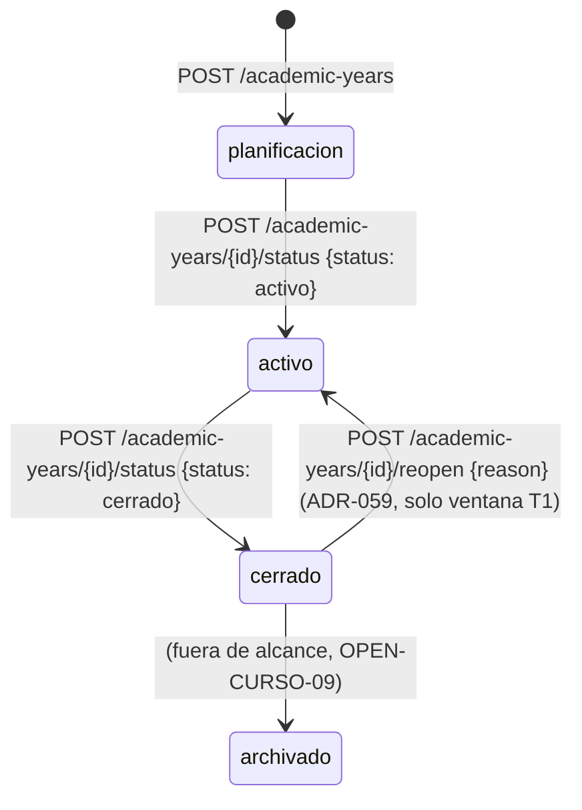

# REQ-CURSO · Ciclo de vida del curso académico · Funcional

| Campo | Valor |
|-------|-------|
| Código | `REQ-CURSO` (sección 5.28 del documento de requisitos; `REQ-CURSO-001` a `REQ-CURSO-005`) |
| Prioridad | MUST |
| Fase | 1 · paso **1.10** del plan (⚠️ paso crítico) |
| Depende de | Según el documento: `ACAD`, `ALUM`. **Ver §0: esa dependencia forma un ciclo con el esquema ya fijado y no puede declararse tal cual**. Decisión aprobada (`OPEN-CURSO-01`): `depends_on: []` |
| Esencial | **`essential: true`** (aprobado, `OPEN-CURSO-01`) |
| Estado | **APROBADA** (2026-10-07). El usuario aprobó las 23 recomendaciones de `OPEN-CURSO-01` a `-23` y aceptó `ADR-057` (`OPEN-057-01` y `-02`), que sustituye la recomendación original de `OPEN-CURSO-04` (rasgo de modelo) por un **disparador de PostgreSQL**. `OPEN-CURSO-06` (resuelta el 2026-10-08) y `OPEN-057-03` quedaron resueltas; `OPEN-057-04` sigue en §15. **Ampliada el 2026-10-08 con `ADR-059` (aceptado)**: `OPEN-CURSO-08` queda resuelta (opción B, reapertura acotada a la ventana T1); se añaden la transición `cerrado → activo` (§4.6, `RN-CURSO-40` a `-48`) y sus criterios (`CA-CURSO-100` a `-107`, de `ADR-059 §9`, y `CA-CURSO-087` de interfaz). El paso del plan en que se implementa la reapertura no lo fija esta especificación (lo anota `PLAN-IMPLEMENTACION.md`) |
| Decisiones vinculantes de partida | `ADR-034 §4` (tabla `academic_years`, regla «obligatorio o ausente», sin *global scope* de curso, `AcademicYearContext` diferido a 1.10), `ADR-029`, `ADR-033`, `ADR-038`, `ADR-044`, `ADR-045`, `ADR-048 §4.9`, `ADR-053`, `ADR-056`, **`ADR-057`** (bloqueo de escritura de cursos cerrados por disparador, error `academic-year-closed`, regla `AR-13`, forma de las excepciones), **`ADR-059`** (reapertura de un curso cerrado: opción B, permiso propio, motivo obligatorio, ventana T1) |

> Donde esta especificación añade algo que ni los requisitos ni un ADR fijan, se marca **[DERIVADA]** y se argumenta. Las preguntas abiertas de §15 están resueltas salvo las señaladas allí. Donde el texto conserva la palabra «propuesta» junto a un `OPEN-CURSO-NN` aprobado, debe leerse como la decisión aprobada.

---

## 0. Contradicciones y huecos detectados antes de especificar (regla 0 de `CLAUDE.md`)

Se señalan aquí, antes del alcance, porque condicionan todo lo demás. Ninguna se resuelve en este documento: cada una tiene su `OPEN-CURSO-NN`.

| # | Hallazgo | Fuentes | Consecuencia | Pregunta |
|---|----------|---------|--------------|----------|
| C1 | **Ciclo de dependencias.** `§5.28` dice que `REQ-CURSO` *depende de* `ACAD` y `ALUM`. Pero `§16.2` (`ACADEMIC_YEAR ||--o{ COURSE`), `§16.1` (`Group/Course/Subject`: «siempre por `AcademicYear`») y `ADR-034 §4` (toda tabla de curso lleva `academic_year_id NOT NULL` con FK compuesta a `academic_years`) hacen que **`ACAD` y `ALUM` dependan de `REQ-CURSO`**. Si ambos declaran `depends_on` literal, el grafo tiene un ciclo y `platform:sync-registry` **aborta el despliegue** (`RMOD-006`, `ADR-045`). El plan ya resolvió el orden a favor del esquema (1.10 antes que 1.11 y 1.15) | `§5.28`, `§16.1`, `§16.2`, `ADR-034 §4`, `RMOD-006`, `PLAN 1.10` | La dependencia del documento describe **funcionalidades** (`REQ-CURSO-002` a `-005`), no el módulo. No puede declararse como `depends_on` del módulo | `OPEN-CURSO-01` |
| C2 | **Alcance del bloqueo de escritura.** `REQ-CURSO-005` enumera tres cosas que el cierre bloquea («calificaciones, asistencia y facturación del período»); `REQ-CURSO-001` dice que los cursos cerrados se consultan «en modo solo lectura», sin enumerar. No son incompatibles, pero dejan sin decidir si el bloqueo es universal (todo dato del curso) o solo de esas tres familias, y qué pasa con lo que en la vida real sigue vivo tras el cierre (cobro de un recibo pendiente de un curso cerrado en `REQ-FIN`) | `REQ-CURSO-001`, `REQ-CURSO-005` | Afecta al contrato transversal que consumirán 50 módulos | `OPEN-CURSO-20` |
| C3 | **Dependencias de fase 2/3 dentro de un requisito MUST de fase 1.** `REQ-CURSO-003` exige «acta de evaluación final **firmada digitalmente**» (firma = `REQ-DOC-002`, fase 2) y exportación a Raíces (`ADR-016`, `REQ-SEC`, fase 2). `REQ-CURSO-004` exige firma digital, servicios de comedor/transporte/extraescolares (`REQ-COMED`, `REQ-TRAN`, `REQ-EXTRA`, fases 2-3) y liberación a lista de espera (`REQ-OFE`, fase 2). `REQ-CURSO-005` incluye «cierre contable» (`REQ-FIN`, fase 2) | `§5.28`, `§17`, `PLAN` fase 2 | `REQ-CURSO-003`/`-004`/`-005` no pueden completarse en fase 1 tal como están escritos | `OPEN-CURSO-21` |
| C4 | **Referencia errónea.** `REQ-CURSO-005` cita `RDB-010` para el archivado en frío; `RDB-010` es «claves foráneas y restricciones declaradas en base de datos». El requisito de archivado es **`RDB-012`** | `REQ-CURSO-005`, `§9` | Errata del documento de requisitos. Severidad Baja. **No la corrige esta especificación** (fuera de su ámbito de escritura); corrección aprobada, la aplica la sesión principal | `OPEN-CURSO-22` |
| C5 | **«Puede coexistir con uno en planificación».** `REQ-CURSO-001` no dice si puede haber **varios** en planificación. `ADR-034 §4` ya lo interpretó como **como mucho uno** y lo impuso con índice único parcial (implementado en 0.8.2). No es contradicción: es una interpretación ya tomada por ADR que esta especificación **respeta** y no reabre | `REQ-CURSO-001`, `ADR-034 §4`, migración `2026_08_18_100100_create_academic_years_table.php` | Ninguna | — |

---

## 1. Alcance

### 1.1 Qué entra en 1.10 (aprobado, `OPEN-CURSO-02`)

**Todo `REQ-CURSO-001` y el contrato transversal que lo hace útil a los módulos posteriores.** Nada de `REQ-CURSO-002` a `-005` salvo los puntos de extensión que evitan migrar después.

| Pieza | Qué se entrega | Requisito |
|-------|----------------|-----------|
| Módulo `curso` | `apps/api/app/Modules/Curso/` con `CursoServiceProvider` (descriptor, catálogo de permisos, migraciones), `Http/routes.php`, `lang/{es,en,de,fr}/curso.php`, entrada `modules.curso` | `RMOD-001`, `ADR-056` (`AR-03`, `AR-12`) |
| Alta y edición de cursos | `POST /academic-years`, `PATCH /academic-years/{id}`, listado y detalle | `REQ-CURSO-001` punto 1 |
| Transiciones de estado | `planificacion → activo` y `activo → cerrado`, con su auditoría (automática por el *observer*, política `Full` ya declarada) | `REQ-CURSO-001` punto 1, `REQ-CURSO-005` (solo la transición; ver §1.2) |
| Un solo activo por tenant | Ya impuesto en base de datos desde 0.8.2 (índice único parcial). 1.10 lo **traduce a errores de API** y lo prueba de punta a punta | `REQ-CURSO-001` punto 2 |
| Contrato transversal | Interfaces públicas en `Curso\Domain` para que los demás módulos: (a) resuelvan el curso activo y un curso por `public_id`, (b) **impidan escribir** en un curso cerrado, (c) **autoricen la lectura** de un curso cerrado. Convención de API para recursos dependientes del curso | `REQ-CURSO-001` puntos 2-3, criterio de aceptación 1 de `§5.28`, `ADR-034 §4` (`AcademicYearContext`) |
| Pantallas de administración | Listado, alta, ficha (con acciones de transición) y edición de cursos | `REQ-CURSO-001` punto 1, `INV-006` |
| Selector de curso | **Aprobado: especificado aquí, construido en 1.11** con su primer consumidor (`OPEN-CURSO-17`) | `REQ-CURSO-001` punto 3 |

### 1.2 Qué NO entra, explícitamente

| Fuera de alcance | Requisito | Por qué | Dónde se retoma (aprobado, `OPEN-CURSO-21`) |
|------------------|-----------|---------|-----------------------------------------------|
| **Rollover** (asistente, copia de estructura, *dry-run*, ejecución asíncrona, reversión) | `REQ-CURSO-002` | Copia «niveles, cursos, grupos, asignaturas, plantillas de horario, tarifas, criterios de evaluación»: **ninguna de esas entidades existe** (`ACAD` 1.11-1.12, `CALIF` 1.16, tarifas `REQ-FIN` fase 2) | Paso nuevo tras `1.12` (horarios), p. ej. **`1.12b · REQ-CURSO-002`**, copiando solo lo que exista entonces; tarifas al llegar `REQ-FIN` |
| **Promoción, repetición y titulación** | `REQ-CURSO-003` | Necesita alumnos y matrícula (`ALUM` 1.15), calificaciones (`CALIF` 1.16), firma digital (`REQ-DOC-002`, fase 2) y exportación a Raíces (`REQ-SEC`, fase 2) | Tras `1.16`/`1.17`, p. ej. **`1.17b · REQ-CURSO-003`** sin firma ni exportación; firma y exportación en fase 2 |
| **Campaña de renovación** | `REQ-CURSO-004` | Necesita portal de familias (1.22), comunicaciones (1.19), firma (fase 2), servicios opcionales (fases 2-3) y lista de espera (`REQ-OFE`, fase 2) | **Fase 2**, tras `REQ-OFE` y `REQ-DOC` |
| **Checklist de cierre con validaciones bloqueantes** | `REQ-CURSO-005` punto 4 | Sus validaciones son de otros módulos («no se puede cerrar con calificaciones sin publicar» es `CALIF`). 1.10 deja el **punto de extensión** (`RN-CURSO-30`) y lo entrega vacío (`OPEN-CURSO-07`) | Cada módulo registra su validación al llegar (`CALIF` en 1.16) |
| **Paquete de cierre** (actas, boletines finales, historiales, cierre contable) | `REQ-CURSO-005` punto 2 | Documentos de `CALIF` (1.17), `ALUM` (1.15) y `REQ-FIN` (fase 2) | Tras `1.17`, junto con `REQ-CURSO-003` |
| **Archivado en frío** (`archivado`) | `REQ-CURSO-005` punto 3, `RDB-012` | Exige decidir qué es «almacenamiento frío» con la base compartida de `ADR-001` (particiones desacopladas, exportación a objeto, réplica) y depende de que existan tablas particionadas por curso (`RDB-001`). El estado existe en el `CHECK` desde 0.8 pero **1.10 no lo hace alcanzable** (`OPEN-CURSO-09`) | Paso propio con ADR (`architect`), no antes del primer curso cerrado real |
| ~~**Reapertura de un curso cerrado**~~ | — | **Resuelta por `ADR-059`** (`OPEN-CURSO-08`): entra en esta especificación, acotada a la ventana T1 (§4.6). Siguen fuera: reabrir con otro curso `activo`, reabrir un curso que no es el cerrado más reciente, y reabrir un curso `archivado` (`ADR-059 §2`, `§3`) | Paso de implementación: lo fija `PLAN-IMPLEMENTACION.md` |
| **Rectificación de datos de un curso cerrado** (p. ej. reclamación de una nota tras el cierre) | — | No está en ningún requisito; es de `CALIF` (`OPEN-CURSO-19`) | `1.16` |
| **`RPERM-008`** (permisos condicionales «solo durante el período de evaluación») | `RPERM-008` | Diferido a `REQ-CALIF` 1.16 por `ADR-044 §4.5`; depende de períodos de evaluación, no del ciclo del curso | `1.16` |
| **Eventos de dominio emitidos** | `INV-007`, `RARQ-ARC-006` | Se **especifican** aquí; aprobado emitirlos con su primer consumidor (`OPEN-CURSO-18`, precedente `ADR-048`) | `1.11` o el primer consumidor |

### 1.3 Dependencias no implementadas y cómo se tratan

1.10 se adelanta a `ACAD` y `ALUM` por diseño (`ADR-034 §4`, plan): **ningún dato de negocio depende todavía del curso**. Eso tiene dos consecuencias que la especificación no esconde:

1. **El contrato transversal (§7) no tiene consumidor real en 1.10.** Se prueba con una tabla sonda de test creada con `TenantMigration::tenantTable()` y `tenantForeignId($table, 'academic_year_id', 'academic_years')` (precedente: `tenant_model_probes` de 0.7/0.8), que **recibe por tanto el disparador `academic_year_write_guard`** de `ADR-057 §5.3`. Una **segunda sonda creada sin el ayudante** (`Schema::create`) sirve a los casos fijos de `AR-13` (debe hacer fallar la regla). Es la única forma de cumplir `INV-015` sin inventar un recurso de negocio. Lo valida de verdad `1.11`.
2. **El selector de curso no tiene nada que seleccionar** hasta que exista un dato por curso. Ver `OPEN-CURSO-17`.

---

## 2. Actores y roles implicados

| Actor | Qué hace en este módulo |
|-------|--------------------------|
| **Administrador de Centro** (`administrador_centro`) | Crea y edita cursos, los activa y los cierra (siembra aprobada, `OPEN-CURSO-14`), y reabre el cerrado más reciente en la ventana T1 (`ADR-059 §5.2`) |
| **Dirección / Jefatura**, **Secretaría** | Consultan cursos y datos de cursos cerrados (aprobado, `OPEN-CURSO-14`) |
| **Cualquier usuario autenticado** | Necesita saber cuál es el curso activo (selector, cabeceras de pantalla). Aprobado: por autoservicio (`OPEN-CURSO-15`) |
| **Roles personalizados** | Ciudadanos de primera: nada de esta especificación compara códigos de rol (`RN-PERM-46`, skill `permisos-y-roles` regla 6) |
| **Módulos de negocio** (`ACAD`, `ALUM`, `CALIF`, `FIN`…) | Consumidores del contrato de §6: asocian sus datos al curso y respetan el bloqueo de escritura |
| **`soporte_plataforma`**, **`super_administrador`** | Sin permisos de este módulo (mismo criterio que `REQ-PERM/permisos.md §5.4`/`§5.5`) |

---

## 3. Conceptos

### 3.1 Estados y máquina de transiciones

| Estado | Significado | ¿Admite escritura de datos del curso? | ¿Quién lo consulta? |
|--------|-------------|----------------------------------------|---------------------|
| `planificacion` | Curso en preparación (el siguiente). Como mucho uno por centro (`ADR-034 §4`) | Sí | Quien tenga el permiso del módulo dueño del dato (`OPEN-CURSO-16`) |
| `activo` | Curso en curso. Como mucho uno por centro (`REQ-CURSO-001`) | Sí | Quien tenga el permiso del módulo dueño del dato |
| `cerrado` | Curso terminado. Solo lectura (`REQ-CURSO-001`, `-005`) | **No** (`RN-CURSO-20`) | Quien tenga además `curso_historico.leer` (`OPEN-CURSO-16`) |
| `archivado` | Curso en almacenamiento frío (`REQ-CURSO-005`, `RDB-012`). **Inalcanzable en 1.10** | **No** | Igual que `cerrado` |

Transiciones admitidas (las dos primeras desde 1.10; la reapertura desde `ADR-059`):

**Reapertura** (`cerrado → activo`, `ADR-059`): es transición **válida**, pero solo por su *endpoint* propio (`POST /academic-years/{id}/reopen`, con motivo obligatorio y permiso `reapertura_curso_academico.actualizar`) y solo dentro de la **ventana T1**: no hay otro curso `activo` en el centro, el curso es el cerrado más reciente y ninguna validación de reapertura registrada la impide (`RN-CURSO-40` a `-45`). Un curso `archivado` no se reabre.

En el *endpoint* de estado (`POST /academic-years/{id}/status`), con destino admitido (`activo`, `cerrado`), toda transición que no sea `planificacion → activo` o `activo → cerrado` responde `409` según el estado de origen: `planificacion → cerrado`, `cerrado → activo` (la reapertura no se ejecuta por este *endpoint*, `RN-CURSO-40`), `activo → activo` y `archivado → activo`/`cerrado` (`RN-CURSO-12`). Un `status` de destino distinto de `activo`/`cerrado` (`planificacion`, `archivado`) **no es una transición**: es `422` de validación (`api.md §2`).

### 3.2 Curso «de referencia» de una petición

`ADR-034 §4` prohíbe el *global scope* de curso y difiere a 1.10 el `AcademicYearContext`. **[DERIVADA]** En esta especificación, el curso de una operación se determina así, en este orden, y nunca a partir del estado de la sesión del usuario (`RARQ-DEP-002`; una selección guardada en sesión rompería con dos pestañas abiertas en cursos distintos):

1. **Escritura sobre una entidad existente**: el curso es el de la propia entidad (`academic_year_id` de la fila), **nunca** uno que envíe el cliente.
2. **Alta de una entidad hija**: el curso es el de su entidad padre (la calificación hereda el de la matrícula). Si la entidad no tiene padre con curso, el cuerpo lo lleva **explícito** como `academic_year` (`public_id`); **no hay curso por omisión en una escritura** (`RN-CURSO-22`).
3. **Lectura de una colección dependiente del curso**: parámetro de consulta `academic_year` (`public_id`). Si se omite, el **curso activo**; si no hay activo, `404` específico (`api.md §4`).

Esto es convención transversal para 50 módulos: **ratificada sin cambios por `ADR-057 §5.8`**.

---

## 4. Flujos principales

### 4.1 Alta de un curso

1. El usuario con `curso_academico.crear` abre «Nuevo curso» y rellena código, fecha de inicio y fecha de fin.
2. `POST /academic-years`. El servidor valida (`RN-CURSO-01` a `-05`).
3. El curso se crea **siempre** en `planificacion` (`RN-CURSO-03`). El cuerpo no admite `status`.
4. Si ya existe un curso en `planificacion`, `409` (`RN-CURSO-04`).
5. El *observer* registra `created` en `audit_logs` con los valores (`Full`).

### 4.2 Edición

1. Con `curso_academico.actualizar`, `PATCH /academic-years/{id}` con las claves a cambiar.
2. Solo se admite en `planificacion` (`RN-CURSO-06`, `OPEN-CURSO-10`). En cualquier otro estado, `409`.
3. Mismas validaciones que el alta, excluyendo el propio curso de la comprobación de unicidad y solape.

### 4.3 Activación (`planificacion → activo`)

1. Con `estado_curso_academico.actualizar`, desde la ficha del curso en `planificacion`, acción «Activar curso», con diálogo de confirmación (`ConfirmDialog`).
2. `POST /academic-years/{id}/status` con `{"status": "activo"}`.
3. Si existe otro curso `activo`, `409` con código `curso.conflict.active_exists` y el `public_id` y código del activo en `params` (`RN-CURSO-11`). **Propuesta: el curso activo hay que cerrarlo antes** (`OPEN-CURSO-06`).
4. En éxito, el curso pasa a `activo` y queda auditado como `updated` con `status` de `planificacion` a `activo`.

### 4.4 Cierre (`activo → cerrado`)

1. Con `estado_curso_academico.actualizar`, desde la ficha del curso activo, acción «Cerrar curso». El diálogo advierte de que bloquea la escritura de todos los datos del curso (`OPEN-CURSO-20`) y de que el cierre **solo puede deshacerse mientras no se active otro curso**, por quien tenga el permiso de reapertura y dejando constancia del motivo (§4.6, `ADR-059`); una vez activado el siguiente curso, no se puede reabrir.
2. `POST /academic-years/{id}/status` con `{"status": "cerrado"}`.
3. El servidor ejecuta la lista de validaciones de cierre registradas por los módulos (`RN-CURSO-30`). **En 1.10 la lista está vacía.** Si alguna falla, `409` con una entrada por validación fallida en `errors.closure[]` y nada cambia.
4. En éxito, el curso pasa a `cerrado`. Desde ese instante toda escritura sobre datos de ese curso la rechaza el disparador de `ADR-057` y responde `409` con `type` propio (`RN-CURSO-21`, `OPEN-CURSO-05`, `ADR-057 §5.5`). Todo lo que el propio cierre tenga que escribir en tablas del curso se escribe **antes** de cambiar `status`, en la misma transacción (`ADR-057 §5.4`).
5. Tras el cierre **no queda ningún curso activo** hasta que se active el de `planificacion`. Las lecturas sin `academic_year` responden `404` específico en ese intervalo (§3.2 punto 3).

### 4.5 Consulta de un curso cerrado (contrato, consumido desde 1.11)

1. Un usuario pide una colección o un recurso de otro módulo perteneciente a un curso `cerrado` o `archivado`.
2. El módulo dueño comprueba su propio permiso (`calificacion.leer`…) **y** pide al contrato de lectura de `curso` que autorice el acceso a ese curso (`RN-CURSO-25`).
3. Sin `curso_historico.leer`: el **mismo `404`** que si no existiera (`OPEN-CURSO-16`). Con él: los datos, y la interfaz los muestra en solo lectura.

### 4.6 Reapertura (`cerrado → activo`, `ADR-059`)

Salida auditada para un **cierre por error**, en la ventana en que ocurre: después de cerrar y antes de activar el curso siguiente (ventana **T1**, `ADR-059 §1.2`). No es un mecanismo de rectificación de datos (`OPEN-CURSO-19`, `RN-CURSO-47`).

1. Con `reapertura_curso_academico.actualizar`, desde la ficha de un curso `cerrado`, acción «Reabrir curso». El diálogo pide el **motivo** (obligatorio) y advierte de que: (a) el curso vuelve a ser el curso activo del centro y **todos** sus datos vuelven a admitir escritura en todos los módulos; (b) no sirve para corregir un dato concreto; (c) el motivo queda registrado y no debe contener datos personales. Sin doble confirmación por otra persona (`OPEN-059-02`, resuelta).
2. `POST /academic-years/{id}/reopen` con `{"reason": "…"}`.
3. El servidor abre transacción y toma `FOR UPDATE` sobre la fila del curso **antes que ningún otro bloqueo** (`RN-CURSO-46`). Comprueba, en este orden **[DERIVADA]**: el curso está en `cerrado` (si no, `409 curso.conflict.invalid_transition`); no hay otro curso `activo` (`409 curso.conflict.active_exists`); el curso es el cerrado más reciente del centro (`409 curso.conflict.reopen_not_latest`); y ejecuta las validaciones de reapertura registradas por otros módulos (vacías hoy; si alguna falla, `409 curso.conflict.reopen_checks_failed` con una entrada por validación). Si algo falla, nada cambia (`RN-CURSO-41`, `RN-CURSO-45`).
4. En éxito, cambia `status` a `activo` y **después**, en la misma transacción, inserta la fila de `academic_year_reopenings` con el motivo (`RN-CURSO-43`). Queda auditado como `updated` del curso (`changes.status = {from: "cerrado", to: "activo"}`) y `created` de la reapertura (`RN-CURSO-44`).
5. Desde la confirmación, el disparador de `ADR-057` deja de rechazar escrituras sobre ese curso, sin ningún cambio en la función ni en el disparador (`RN-CURSO-46`). `GET /academic-years/current` devuelve el curso reabierto.
6. **Volver a cerrarlo** es el cierre ordinario de §4.4, con sus validaciones de cierre. No hay atajo.

---

## 5. Reglas de negocio

### 5.1 Datos del curso

| ID | Regla |
|----|-------|
| `RN-CURSO-01` | `code` es obligatorio, se recorta de espacios en los extremos, no puede quedar vacío y es **único por centro** entre cursos no borrados (`academic_years_tenant_code_unique`, ya existente). El formato es **libre**: el documento solo da un ejemplo (`2026-2027`), no una regla (`OPEN-CURSO-10`). Límite de longitud [DERIVADA]: el mismo que el resto de textos cortos del producto, a fijar en implementación sin inventar un número de negocio |
| `RN-CURSO-02` | `starts_on` y `ends_on` son fechas (`AAAA-MM-DD`, `ADR-038 §3.2`), obligatorias, con `ends_on > starts_on` (`academic_years_dates_check`, ya existente). Se validan en servidor antes de llegar al `CHECK` (`INV-010`) |
| `RN-CURSO-03` | Un curso se crea siempre en `planificacion`. `status` no es un campo de entrada ni en el alta ni en la edición: solo cambia por la transición de §4.3/§4.4 |
| `RN-CURSO-04` | Como mucho **un** curso en `planificacion` por centro (`ADR-034 §4`, índice `academic_years_tenant_status_unique`). Crear otro responde `409 curso.conflict.planning_exists`. Una violación del índice por carrera entre dos peticiones se traduce al mismo `409`, nunca a `500` |
| `RN-CURSO-05` | **Aprobada** (`OPEN-CURSO-11`): las fechas de un curso no se solapan con las de otro curso no borrado del mismo centro; solaparse responde `422 curso.validation.dates_overlap` con el `code` del curso con el que solapa (`OPEN-CURSO-11`). `ADR-034 §4` dejó esta decisión expresamente a 1.10 y no pidió restricción de exclusión en base de datos |
| `RN-CURSO-06` | **Aprobada** (`OPEN-CURSO-10`): un curso solo se edita en `planificacion`. En `activo`, `cerrado` o `archivado` el `PATCH` responde `409 curso.conflict.not_editable` (`OPEN-CURSO-10`). Es la opción más estricta y la única cuya relajación posterior es compatible (`ADR-038 §7.2`: relajar una validación es compatible; endurecerla no) |
| `RN-CURSO-07` | **Aprobada** (`OPEN-CURSO-12`): no hay borrado de cursos en 1.10 (`OPEN-CURSO-12`). Un curso en `planificacion` creado por error se corrige con `PATCH` |

### 5.2 Transiciones

| ID | Regla |
|----|-------|
| `RN-CURSO-10` | Las transiciones válidas son exactamente `planificacion → activo`, `activo → cerrado` y, desde `ADR-059`, `cerrado → activo` (**reapertura**, solo por su *endpoint* propio y con las condiciones de `RN-CURSO-40` a `-45`) (§3.1). Las ejecuta un único servicio de aplicación del módulo; ningún otro código escribe `academic_years.status` |
| `RN-CURSO-11` | Como mucho **un** curso `activo` por centro (`REQ-CURSO-001`). Activar con otro activo responde `409 curso.conflict.active_exists`. La garantía última es el índice único parcial; la carrera se traduce al mismo `409` |
| `RN-CURSO-12` | En `POST /academic-years/{id}/status`, con `status` destino ∈ {`activo`, `cerrado`}, todo par distinto de `planificacion → activo` y `activo → cerrado` (`planificacion → cerrado`, `cerrado → activo`, `activo → activo`, `archivado → activo`, `archivado → cerrado`) responde `409 curso.conflict.invalid_transition` con `params.from` y `params.to`. `cerrado → activo` es transición válida (`RN-CURSO-10`), pero **solo** por `POST /academic-years/{id}/reopen`: por el *endpoint* de estado sigue siendo `409`, porque exige otro permiso y un motivo que ese *endpoint* no autoriza ni admite (`ADR-059 §5.1`, `RN-CURSO-40`). En `POST /academic-years/{id}/reopen`, un curso que no está en `cerrado` (`planificacion`, `activo`, `archivado`) responde el mismo `409 invalid_transition`. Un `status` destino fuera de {`activo`, `cerrado`} es `422` de validación (`api.md §2`), no `409` |
| `RN-CURSO-13` | Toda transición queda en `audit_logs` como evento `updated` con `changes.status` = `{from, to}` (política `Full` de `AcademicYear`, `ADR-035`). No se añade columna de fecha de transición: el registro de auditoría ya la tiene (`occurred_at`), y añadirla sería duplicar lo que `ADR-034 §6` decidió no duplicar. Si una pantalla la necesita, se lee de la auditoría o se añade después (expand) |
| `RN-CURSO-14` | La activación no tiene condición de fecha (no exige haber llegado a `starts_on`) ni se dispara sola por calendario: **ningún requisito lo pide** y una activación automática cambiaría el curso de referencia de todo el centro sin que nadie lo decidiera |

### 5.3 Contrato transversal (para los demás módulos)

| ID | Regla |
|----|-------|
| `RN-CURSO-20` | Un curso en `cerrado` o `archivado` es **de solo lectura**: ningún módulo crea, modifica, borra ni restaura filas cuyo `academic_year_id` sea el de ese curso, ni mueve una fila hacia o desde ese curso (`REQ-CURSO-001`, `-005`, `ADR-057 §5.1`). Alcance **universal** (aprobado, `OPEN-CURSO-20`): todo dato con `academic_year_id`, con excepciones declaradas en la especificación de cada módulo, aprobadas por el usuario y con la forma de `ADR-057 §5.7`. En `1.10` no hay ninguna |
| `RN-CURSO-21` | El intento de escribir en un curso de solo lectura responde **`409`** con `type` **`urn:pge:error:academic-year-closed`** (aprobado, `OPEN-CURSO-05`; amplía el catálogo de `ADR-038 §6.2` por `ADR-057 §5.5`). El módulo `curso` traduce el error de motor con `SQLSTATE` **`YC001`** que lanza el disparador a ese `409`; si no logra resolver el curso, responde igualmente `409` con el mismo `type` y un `detail` sin código de curso. La respuesta lleva `detail` traducido que **indica el motivo** (criterio de aceptación 1 de `§5.28`: «el sistema lo impide e indica el motivo») y el código del curso. No es `403`: el usuario puede tener el permiso; lo que falla es el estado del dato |
| `RN-CURSO-22` | Ninguna escritura usa un curso por omisión. El curso de una escritura sale de la entidad o de su padre; si no hay ninguno, el cliente lo envía explícito (§3.2) |
| `RN-CURSO-23` | El bloqueo de escritura **no depende de que cada controlador se acuerde de comprobarlo**. Lo impone el **motor** (`ADR-057 §5`): toda tabla con `academic_year_id` lleva el disparador `academic_year_write_guard` (`BEFORE INSERT OR UPDATE OR DELETE … FOR EACH ROW`), que ejecuta la función `app.assert_academic_year_writable()`. El disparador lo ponen automáticamente `TenantMigration::tenantTable()`/`tenantTableAppendOnly()` (y `TenantMigration::guardAcademicYearWrites()` al añadir la columna a una tabla existente); ningún módulo escribe el `CREATE TRIGGER` a mano. La regla **`AR-13`** lo comprueba sobre el esquema real (`pg_trigger`). Cubre todo camino de escritura: ORM, actualizaciones y borrados masivos por constructor de consultas o por relación, `DB::table()`, SQL crudo, colas y consola. El **propietario de la tabla** (migraciones, mantenimiento) está exento (`ADR-057 §5.2`, `OPEN-057-02`). Mismo argumento que `INV-001` para el tenant: «a nivel de framework, nunca solo en el controlador» |
| `RN-CURSO-24` | El curso activo se resuelve una vez por petición y se memoiza en la petición; **sin caché entre peticiones** [DERIVADA]. Es una consulta por índice único parcial (`academic_years_tenant_status_unique`), y una caché obligaría a invalidarla en cada transición — el modo de fallo sería escribir en un curso ya cerrado, que es justo lo que este módulo existe para impedir (mismo razonamiento que `ADR-044 §4.7`) |
| `RN-CURSO-25` | Leer datos de un curso `cerrado` o `archivado` exige, además del permiso del módulo dueño, `curso_historico.leer`. Sin él, `404` (no `403`: no se confirma que existan datos de ese curso, `ADR-038 §6.4`). Propuesta en `OPEN-CURSO-16` |
| `RN-CURSO-26` | Los demás módulos acceden al curso **solo** por las interfaces públicas de `Curso\Domain` (§9.2), nunca por el modelo Eloquent ni consultando `academic_years` (`INV-007`, `AR-01`, `RARQ-ARC-003`). La clave foránea en base de datos sí es obligatoria (`ADR-034 §4`, `tenantForeignId`) |
| `RN-CURSO-27` | Una entidad hija no puede pertenecer a un curso distinto del de su padre (la matrícula y su grupo, la calificación y su matrícula). **[DERIVADA]** Es regla para los módulos consumidores, no código de 1.10: se recomienda imponerla con clave foránea compuesta que incluya `academic_year_id` (`(tenant_id, academic_year_id, group_id) → groups (tenant_id, academic_year_id, id)`). Se deja escrita para `ACAD`/`ALUM` |

### 5.4 Cierre

| ID | Regla |
|----|-------|
| `RN-CURSO-30` | **Punto de extensión del checklist de cierre** (`REQ-CURSO-005` punto 4): `curso` expone en su `Domain` un contrato por el que cada módulo registra validaciones bloqueantes del cierre (precedente: `ScopeResolverRegistry` de `ADR-044`). El cierre las ejecuta todas antes de cambiar el estado y, si alguna falla, no cambia nada. **En 1.10 el registro está vacío** y se prueba con una validación falsa en test (`OPEN-CURSO-07`). Contrato síncrono en el módulo propietario, no evento: el cierre necesita el resultado (`ADR-048 §4.9`) |
| `RN-CURSO-31` | Que el checklist sea «configurable» (`REQ-CURSO-005`: «checklist de cierre configurable») —qué validaciones activa cada centro— **no se especifica en 1.10**: con cero validaciones no hay nada que configurar. Se decide con la primera validación real (`CALIF`, 1.16) |
| `RN-CURSO-32` | Una escritura concurrente con el cierre **nunca se confirma después del cierre** (`ADR-057 §5.4`). Mecanismo: el **cierre** abre transacción y toma `SELECT … FOR UPDATE` sobre la fila del curso **antes que ningún otro bloqueo**, ejecuta las validaciones de cierre (`RN-CURSO-30`), cambia `status` y confirma; **toda escritura** sobre una tabla de curso toma, dentro del disparador, `FOR SHARE` sobre la misma fila. Como `FOR SHARE` y `FOR UPDATE` son incompatibles, o la escritura confirma antes de que el cierre obtenga su bloqueo, o espera y falla con `YC001` (en `REPEATABLE READ`, con error de serialización, que también es rechazo). **Prohibido** que una validación de cierre tome bloqueos de filas de otros módulos antes que el del curso (riesgo de interbloqueo). Las validaciones de cierre deben ser acotadas: mientras el cierre retiene el bloqueo, toda escritura del centro en ese curso espera |
| `RN-CURSO-33` | **Criterio de aceptación obligatorio de lectura denegada de curso cerrado** (`OPEN-057-03`, resuelta el 2026-10-08 por decisión del usuario, recomendación aceptada). La especificación de **todo módulo con datos por curso** (tablas con `academic_year_id`) incluye, por cada recurso por curso, un criterio de aceptación con la forma: *dado* un usuario con el permiso de lectura del módulo pero **sin** `curso_historico.leer`, *cuando* pide el **listado** filtrando por un curso `cerrado` o `archivado`, *y cuando* pide por `public_id` el **detalle** de un registro de ese curso, *entonces* recibe `404` (`RN-CURSO-25`), con el mismo cuerpo que si no existiera; con `curso_historico.leer` recibe los datos. Va en listado **y** en detalle, como el ámbito en `ADR-044 §4.2`. Motivo: la lectura se protege invocando el contrato `AcademicYearReadAccess` desde cada *endpoint* (no hay equivalente automático al disparador de escritura: un ámbito global de curso lo prohíbe `ADR-034 §4`), y ningún test estático ve *endpoints*, así que un módulo que se olvide de invocarlo solo se atrapa con este criterio y en revisión. El fallo es una lectura de más dentro del mismo centro, no una fuga entre tenants. `1.11` lo cumple con su primera entidad real |

### 5.5 Reapertura (`ADR-059`, aceptado; resuelve `OPEN-CURSO-08`)

| ID | Regla |
|----|-------|
| `RN-CURSO-40` | La reapertura (`cerrado → activo`) la ejecuta el **mismo** servicio de transiciones (`RN-CURSO-10`), por un *endpoint* propio, `POST /academic-years/{id}/reopen`, con el permiso **`reapertura_curso_academico.actualizar`** (`OPEN-059-02`, resuelta: recurso propio, sin doble confirmación). `estado_curso_academico.actualizar` **no** basta. Ninguna otra transición nueva: `archivado → *` sigue siendo `409` (`ADR-059 §5.1`, `§5.2`) |
| `RN-CURSO-41` | **Ventana T1.** Solo se reabre si, comprobado dentro de la transacción y tras el `FOR UPDATE` sobre la fila del curso: (1) **no hay otro curso `activo`** en el centro —garantía última, el índice único parcial `academic_years_tenant_status_unique`; la carrera con una activación simultánea se traduce al `409 curso.conflict.active_exists` existente—; (2) el curso es el **cerrado más reciente** del centro: no existe otro curso `cerrado` o `archivado` con `starts_on` posterior (bien definido porque las fechas no se solapan, `RN-CURSO-05`); violación, `409 curso.conflict.reopen_not_latest`; (3) ninguna **validación de reapertura** registrada falla (`RN-CURSO-45`) (`ADR-059 §5.1`) |
| `RN-CURSO-42` | **Sin plazo de fecha** (`OPEN-059-03`, resuelta: solo hechos). La ventana la acotan hechos —activación del curso siguiente, cierre de un curso posterior y lo que registren otros módulos—, no un número de días que ningún requisito da |
| `RN-CURSO-43` | **Motivo obligatorio.** El cuerpo lleva `reason`, texto que se recorta de espacios y no puede quedar vacío (`422`, `INV-010`). Se guarda en la entidad *append-only* **`academic_year_reopenings`** (`datos.md §1.5`), insertada **después** de cambiar `status` y en la **misma** transacción (el disparador lee el estado ya actualizado por la propia transacción y la admite). No se añade columna a `academic_years`: un motivo en la fila del curso se sobrescribiría en la segunda reapertura (`ADR-059 §5.3`, `§5.4`). Límite de longitud **[DERIVADA]**: el mismo criterio que `RN-CURSO-01`, a fijar en implementación sin inventar un número de negocio |
| `RN-CURSO-44` | **Auditoría sin evento nuevo** (`ADR-039 §4.5`, `§5.3`): queda como `updated` de `academic_year` con `changes.status = {from: "cerrado", to: "activo"}` (automático, `RN-CURSO-13`) y `created` de `academic_year_reopening` con el motivo, el actor y el curso (política `Full`, criterio de `ADR-035 §8`: contenido del centro). La interfaz y el manual advierten de no escribir datos personales en el motivo |
| `RN-CURSO-45` | **Registro de validaciones bloqueantes de reapertura** (`OPEN-059-04`, resuelta: se construye ya, vacío). `curso` expone en `Curso\Domain` un registro simétrico al de cierre (`RN-CURSO-30`), con las mismas reglas de bloqueo (`RN-CURSO-32`: ninguna validación toma bloqueos de otros módulos antes que el del curso). Se entrega **vacío** y probado con una validación falsa en test. Si alguna falla, `409 curso.conflict.reopen_checks_failed` con una entrada por validación y nada cambia. **Obligación para especificaciones futuras** (no decisión de esta): `1.17b` decide si «promoción aplicada» o «paquete de cierre generado» impiden reabrir y, en su caso, registra la validación; fase 2 (`REQ-DOC-002`, `REQ-SEC`) decide lo mismo para actas firmadas o exportadas a Raíces (`OPEN-059-06`) |
| `RN-CURSO-46` | **Frente al bloqueo de escritura (`ADR-057`, `ADR-058`)**: no hay excepción ni cambio en `app.assert_academic_year_writable()`, en el disparador, en `AR-13` ni en el `SQLSTATE` `YC001`. La reapertura actualiza una fila de `academic_years`, que no tiene `academic_year_id` ni disparador; al confirmar, el disparador deja de rechazar las filas del curso. Concurrencia: la reapertura toma `FOR UPDATE` sobre la fila del curso **antes que ningún otro bloqueo** (como el cierre, `RN-CURSO-32`); una escritura concurrente en una tabla de ese curso, cuyo disparador pide `FOR SHARE`, espera y relee: ve `activo` (se admite) o, si la reapertura se revierte, `cerrado` (`YC001`). Ninguna escritura se confirma con el curso cerrado. **Volver a cerrar** es la transición `activo → cerrado` ordinaria, con sus validaciones de cierre (`RN-CURSO-30`) (`ADR-059 §5.3`) |
| `RN-CURSO-47` | **Prohibido**, se reafirma: reabrir por SQL, con las credenciales del propietario o desactivando el disparador (`ADR-057 §5.7` punto 6, `AR-14`). Fuera de la ventana T1 (curso siguiente ya `activo`, curso no más reciente, curso `archivado`) **no hay vía de reapertura**; un error detectado entonces solo tiene la rectificación por módulo cuando exista (`OPEN-CURSO-19`, `ADR-057 §5.7`). La reapertura **no es** el mecanismo de rectificación de un dato concreto: abre el curso entero a todos los módulos y usuarios con permiso (`ADR-059 §2`, `§7`) |
| `RN-CURSO-48` | **Rollover** (`1.12b`): no se ve afectado. Copia estructura hacia un curso en `planificacion` y no escribe en el curso origen; reabrir el origen después de un rollover no deshace la copia. La interfaz lo **advierte sin bloquear** (obligación para la especificación de `1.12b`, `ADR-059 §5.5`) |

---

## 6. Casos límite y errores

| Caso | Comportamiento |
|------|----------------|
| Centro sin ningún curso | Listado vacío. `GET /academic-years/current` responde `404 urn:pge:error:not-found` con `code` `curso.no_active_year`. Ningún curso se crea solo al dar de alta un centro (`OPEN-CURSO-23`) |
| Centro con curso cerrado y el siguiente aún en `planificacion` | Sin curso activo: igual que el caso anterior. Es un estado legítimo (§4.4 paso 5) |
| Dos activaciones simultáneas de cursos distintos (imposible hoy por el índice de planificación, posible si se relaja) | Una gana; la otra recibe `409 curso.conflict.active_exists` traducido desde la violación del índice |
| Dos altas simultáneas en `planificacion` | Una gana; la otra `409 curso.conflict.planning_exists` |
| Activar un curso cuyo `ends_on` ya pasó | Se permite (`RN-CURSO-14`); la interfaz lo advierte sin impedirlo **[DERIVADA]** |
| `PATCH` con `status` en el cuerpo | `422 curso.validation.status_not_editable` (no se ignora en silencio: un cliente que crea haber cambiado el estado no debe recibir `200`). **Matiz**: `ADR-038 §5.2` ignora parámetros **de consulta** desconocidos; esto es una clave **conocida** del recurso enviada donde no se admite |
| `public_id` de un curso de otro centro | `404` (`INV-001`, `ADR-038 §6.4`) |
| `academic_year` de otro centro como parámetro de un listado de otro módulo | `404`, igual que un curso inexistente |
| Escritura de otro módulo durante el cierre | Serializada por `RN-CURSO-32` (`FOR UPDATE` del cierre frente a `FOR SHARE` del disparador): o entra antes del cierre o recibe `409 academic-year-closed` |
| Usuario con permiso de calificaciones pero sin `curso_historico.leer` pide calificaciones de un curso cerrado | `404` (`RN-CURSO-25`) |
| Módulo consumidor que escribe con `DB::table()`, SQL crudo, `Model::query()->…->update()`/`->delete()` o actualización por relación | **Rechazado por el motor**: el disparador de `ADR-057` actúa en cada fila sea cual sea el camino de escritura (`RN-CURSO-23`), con `SQLSTATE` `YC001` traducido a `409 academic-year-closed` en HTTP. *Corrección respecto a la versión anterior de esta fila*: el «test de DML crudo» que `ADR-034 §3` daba por existente **no existía** (`ADR-057 §1.1` y hallazgo 1 de `§11`), y el bloqueo no se apoya en él. Desde el issue #380 existe **`AR-15`**, con un alcance más acotado que aquel test imaginario: prohíbe la escritura **masiva por modelo** (`Modelo::…->update()/delete()/forceDelete()/upsert()`) sobre modelos `Auditable` porque se salta la auditoría (`INV-003`), **no** el DML crudo. `DB::table()` y `DB::statement` sobre tablas de negocio quedan fuera de `AR-15`; sobre las tablas de curso los cubre únicamente el disparador |
| Escritura con las credenciales del propietario de la tabla | Permitida: el propietario está exento (`ADR-057 §5.2`). Es la vía de las migraciones de relleno, la purga física de un tenant (issue #371) y el archivado. Usarla desde un proceso de aplicación para saltarse el bloqueo está **prohibido** (`ADR-057 §5.7` punto 6) |
| Inserción con un `academic_year_id` inexistente | La rechaza la clave foránea compuesta (`23503`), no el disparador |
| Proceso por lotes (cola, consola) que topa con un curso cerrado | El error llega como `QueryException` con `YC001` y **deja abortada la transacción en curso** (PostgreSQL). El proceso debe comprobar antes con `AcademicYearWriteGuard` (§7.1) o usar un punto de guardado por unidad de trabajo (`ADR-057 §5.5`) |
| Reapertura y activación simultáneas (el curso cerrado X y el de `planificacion` Y) | Exactamente una gana; la otra recibe `409 curso.conflict.active_exists`, traducido desde la violación del índice único parcial; nunca `500` (`RN-CURSO-41`) |
| Reabrir con el curso siguiente ya `activo` (ventana T2) | `409 curso.conflict.active_exists`. No hay vía: se deliberó y se descartó cerrar el curso en curso para reabrir el anterior (`ADR-059 §3`, `RN-CURSO-47`) |
| Reabrir un curso cerrado que no es el más reciente | `409 curso.conflict.reopen_not_latest` (`RN-CURSO-41`) |
| Reabrir un curso `archivado`, `activo` o en `planificacion` | `409 curso.conflict.invalid_transition` (`RN-CURSO-12`) |
| `POST …/status` con `{"status": "activo"}` sobre un curso `cerrado` | `409 curso.conflict.invalid_transition`: la reapertura solo va por `POST …/reopen` (`RN-CURSO-12`, `RN-CURSO-40`) |
| Escritura de otro módulo durante una reapertura | Serializada por `RN-CURSO-46`: espera al `FOR UPDATE` de la reapertura y, al reanudarse, ve `activo` (se admite) o, si la reapertura se revirtió, `cerrado` (`409 academic-year-closed`) |
| Curso reabierto y vuelto a cerrar | Las filas de `academic_year_reopenings` de ese curso quedan inmutables por el disparador, que es lo deseado para un registro *append-only* (`ADR-059 §5.3`). Una segunda reapertura añade otra fila |

---

## 7. Interacción con otros módulos

### 7.1 Interfaces públicas que expone (`Curso\Domain`, nunca `Domain\Models`)

Descripción funcional; la firma exacta es trabajo de implementación dentro de lo que fija `ADR-057`.

| Interfaz | Para qué | Consumidores previstos |
|----------|----------|------------------------|
| `AcademicYearContext` | Curso activo del centro en curso (o ninguno); memoizado por petición (`RN-CURSO-24`). Es la pieza que `ADR-034 §4` encargó a 1.10 | Todos los módulos con datos por curso |
| `AcademicYearDirectory` | Resolver un `public_id` de curso del centro a su identificador interno, código y estado; `null` si no existe o es de otro centro | `ACAD`, `ALUM`, `CALIF`… para traducir el parámetro `academic_year` |
| `AcademicYearWriteGuard` | **Comprobación previa consultiva, no barrera** (`ADR-057 §5.6`): «¿admite escritura este curso?» y «afirma que la admite o lanza la excepción de dominio», que el manejador traduce al mismo `409 academic-year-closed` (`RN-CURSO-21`). No toma bloqueos ni sustituye al disparador: entre la comprobación y la escritura puede cerrarse el curso, y entonces responde el disparador. Su uso **no es obligatorio** | Servicios que quieren fallar antes de efectos laterales (p. ej. antes de generar un PDF), procesos por lotes que saltan filas sin abortar la transacción, y la interfaz para ocultar acciones |
| `AcademicYearReadAccess` | Afirmar que el usuario puede leer datos de ese curso (`RN-CURSO-25`); si no, la excepción que produce `404` | Controladores de lectura de todos los módulos |
| `AcademicYearClosureCheck` (+ registro) | Validación bloqueante de cierre registrada por un módulo (`RN-CURSO-30`) | `CALIF` (1.16) y los que lo necesiten |
| Validación de reapertura (+ registro) — nombre de la interfaz a fijar en implementación, simétrico al de cierre | Validación bloqueante de reapertura registrada por un módulo (`RN-CURSO-45`, `ADR-059 §5.5`). Se entrega vacío | `1.17b` (promoción, paquete de cierre) y fase 2 (actas firmadas, exportación a Raíces), si sus especificaciones lo deciden |
| `AcademicYearStatus` (enumerado) | Vocabulario de estados, hoy `App\Models\AcademicYearStatus`; pasa a `Curso\Domain` (aprobado, `OPEN-CURSO-03`). Declara qué estados son de solo lectura; un test de paridad lo contrasta con el conjunto que bloquea la función del disparador (`ADR-057 §5.2`, `CA-057-07`) | Cualquiera que necesite comparar estados |

### 7.2 Eventos de dominio (especificados; emisión según `OPEN-CURSO-18`)

| Evento | Cuándo | Carga | Consumidores previstos |
|--------|--------|-------|------------------------|
| `AcademicYearActivated` | Tras confirmar `planificacion → activo` | `tenant_id`, `academic_year_public_id`, `code`, `occurred_at` | `REQ-COM` (1.19, aviso al centro), módulos con trabajos programados por curso activo |
| `AcademicYearClosed` | Tras confirmar `activo → cerrado` | Ídem | `ACAD`/`CALIF` (dejar de programar trabajos sobre el curso), `REQ-COM` |
| `AcademicYearReopened` | Tras confirmar `cerrado → activo` (`ADR-059 §5.4`) | Ídem, sin el motivo | Los mismos que `AcademicYearClosed`: todo proceso que trate el cierre como hecho consumado debe tolerar que el curso vuelva a `activo` (`ADR-059 §7`). El aviso a otras personas (dirección, otros administradores) **no se decide aquí**: es `OPEN-059-05`, en `REQ-COM` (`1.19`) |
| `AcademicYearCreated` | **No se propone.** Ningún consumidor previsto; sería la «tercera fuente de verdad» que `ADR-048` rechaza | — | — |

Reglas, si se emiten: tras el *commit* (nunca dentro de la transacción, issue #189), con identificadores públicos y sin datos personales; un consumidor que falla no revierte la transición (es notificación de un hecho consumado, `ADR-048 §4.9`).

### 7.3 Lo que este módulo consume

Nada de otros módulos de negocio. Del núcleo: `TenantModel`, `TenantMigration`, auditoría (`Auditable`), autorización (`RequirePermission`, `PermissionDecision`), `ModuleAvailability` no aplica si es esencial.

---

## 8. Descriptor del módulo (`ADR-045`, `ADR-034 §5`)

| Campo | Valor propuesto | Nota |
|-------|-----------------|------|
| `code` | `curso` | Coincide con el sufijo del requisito, como `core`/`auth` |
| `name_key` | `modules.curso` | es «Curso académico», en «Academic year», de «Schuljahr», fr «Année scolaire» (a revisar por quien valide las traducciones) |
| `phase` | `'1'` | |
| `depends_on` | `[]` | `OPEN-CURSO-01` (C1). `core` es esencial y siempre está activo |
| `essential` | `true` | `OPEN-CURSO-01`. Si fuera no esencial, descontratarlo dejaría a `ACAD`/`ALUM`/`CALIF` (que lo necesitan por clave foránea) sin poder resolver el curso, y ningún módulo de fase 1 funciona sin curso |
| `feature_flags` | Ninguno | `RARQ-DEP-010` no obliga a una *flag* por módulo; nada de 1.10 se despliega apagado |

## 9. Comportamiento con el módulo desactivado

Si `essential: true` (aprobado), **no puede desactivarse**: `module-enabled:` no se aplica a sus rutas (`AR-07b` solo lo exige a los no esenciales) y sus pantallas siempre están disponibles para quien tenga permiso. Si se decidiera `essential: false` (descartado), todas sus rutas llevarían `module-enabled:curso` antes de `permission:` (`AR-07b`), sus pantallas desaparecerían (`RMOD-008`) y **habría que decidir qué hacen los módulos dependientes**, que hoy no tienen respuesta en ningún documento.

---

## 10. Interfaz: *shell* del frontend (`ADR-053`)

Módulo web `apps/web/src/modules/curso/` con `shell.ts`, `api/index.ts`, `types/index.ts`, `locales/{es,en,de,fr}.json`, registrado en `src/navigation/modules.ts` y `src/i18n/index.ts` (`AR-11`).

### 10.1 Rutas

| Nombre | Ruta | `meta.permissions` | Entrada de menú | Contenido |
|--------|------|--------------------|-----------------|-----------|
| `curso-academic-years` | `/administracion/cursos` | `['curso_academico.leer']` | Sí, sección `administracion`, icono de calendario de Lucide (`RUX-ICON-001`) | Listado con el componente de tablas (`src/data-table`, modo `page`, `ADR-054`): código, fechas, estado (etiqueta traducida), orden por defecto `-starts_on`. Filtro por estado (`enum` múltiple). Sin `q` (unos pocos cursos por centro; no hay búsqueda que justificar) ni exportación (`permisos.md §2.1`). Botón «Nuevo curso» si `curso_academico.crear` |
| `curso-academic-year-new` | `/administracion/cursos/nuevo` | `['curso_academico.crear']` | No (acción del listado) | Formulario: código, fecha de inicio, fecha de fin. Muestra los errores de campo de `422` y el `409` de planificación existente con enlace al curso en planificación |
| `curso-academic-year-detail` | `/administracion/cursos/:publicId` | `['curso_academico.leer']` | No | Ficha: datos, estado, y acciones según estado y permiso: «Editar» (`curso_academico.actualizar`, solo `planificacion`), «Activar» (`estado_curso_academico.actualizar`, solo `planificacion`), «Cerrar» (`estado_curso_academico.actualizar`, solo `activo`), «Reabrir» (`reapertura_curso_academico.actualizar`, solo `cerrado`; diálogo con motivo obligatorio, §4.6). Transiciones con `ConfirmDialog`. Muestra el `409` con su motivo y, en `active_exists`, enlace al curso activo. La elegibilidad de la ventana T1 la decide el servidor: la interfaz no la anticipa **[DERIVADA]** |
| `curso-academic-year-edit` | `/administracion/cursos/:publicId/editar` | `['curso_academico.actualizar']` | No | Mismo formulario que el alta. Si el curso no está en `planificacion`, estado propio sin formulario (la API daría `409`) |

Ninguna ruta usa `permissions: []`: la lista cerrada de `RN-CORE-24` no cambia.

### 10.2 Selector de curso (`REQ-CURSO-001` punto 3) — especificado, no construido en 1.10 (`OPEN-CURSO-17`)

Para que `1.11` no tenga que decidirlo:

- Vive en la barra superior del *shell*, visible solo en pantallas de módulos con datos por curso. **`ADR-053` no tiene punto de extensión para la barra superior** (sus tres listas son `routes`, `navigation` y `dashboardBlocks`): hace falta decidir dónde vive (`OPEN-CURSO-17`).
- El curso seleccionado vive en la **URL** de cada pantalla (parámetro `academic_year`), no en `localStorage` ni en sesión, coherente con §3.2 y con `RN-CORE-54` (estado de consulta en la URL).
- Opciones: el curso activo (por defecto), el de `planificacion` y, con `curso_historico.leer`, los `cerrado`/`archivado`.
- Con un curso de solo lectura seleccionado, la pantalla muestra un aviso persistente («Estás consultando el curso 2025-2026, cerrado. Solo lectura.») y oculta o deshabilita toda acción de escritura (`RN-CORE-61`). **La interfaz oculta; el servidor decide** (`INV-002`, `RN-CURSO-21`).
- El estado compartido (curso seleccionado, lista de cursos) **no puede** vivir en `src/modules/curso/` y consumirse desde `acad` como *composable*: `AR-11` solo permite importar `api/`, `types/` y `shell` de otro módulo. Opciones en `OPEN-CURSO-17`.

### 10.3 Bloques del panel

Ninguno en 1.10 (`OPEN-CORE-13`, issue #261 sigue abierto).

### 10.4 Textos (`INV-009`, `ADR-021`)

Todo literal en `lang/{es,en,de,fr}/curso.php` (API: estados, etiquetas de recurso de permiso, `title`/`detail`/`message` de cada error de `api.md §5`) y en `locales/{es,en,de,fr}.json` (web: títulos, campos, acciones, diálogos de confirmación, estados vacíos y de error, `RUX-006`). El **código** del curso es contenido del centro y no se traduce. Los valores de estado viajan sin traducir (`ADR-038 §3.2`); se traduce la etiqueta.

### 10.5 Accesibilidad

WCAG 2.2 AA (`RNF-UX-002`): campos de fecha con etiqueta y formato anunciado, estado no transmitido solo por color, foco devuelto a la acción tras cerrar un diálogo (issue #330 como antecedente), objetivos táctiles de 44 px.

---

## 11. Manual de usuario

`docs/manual-usuario/admin.md` gana una sección «Cursos académicos»: crear, editar mientras está en planificación, activar, cerrar (con la advertencia de que solo se deshace en la ventana de reapertura), reabrir (ventana T1, motivo obligatorio sin datos personales, y advertencia de no usarla como rectificación, `ADR-059 §7` punto 8), y qué significa cada estado. `direccion.md`/`secretaria.md` solo si la siembra de `OPEN-CURSO-14` les da permisos (`CLAUDE.md §6.4`).

---

## 12. Huecos de extensión que deja 1.10 (para no migrar después)

| Necesidad futura | Qué deja 1.10 | Coste de completarlo después |
|------------------|---------------|-------------------------------|
| `archivado` (`REQ-CURSO-005`) | Estado ya en el `CHECK` y en el enumerado desde 0.8; el contrato de lectura ya lo trata como solo lectura | Código y, según el ADR de archivado, tablas nuevas. **Ningún `ALTER` sobre `academic_years`** |
| Rollover (`REQ-CURSO-002`) | Nada en esquema. Recomendación de diseño para su paso: contrato síncrono en `Curso\Domain` que cada módulo implementa para copiar **sus** tablas (precedente exacto: `provisionFromTemplate()` de `ADR-048`, que no deja a un módulo escribir tablas ajenas), en cola (`INV-012`), con tabla `year_rollovers` propia para el log y el *dry-run* | Tabla nueva + contrato nuevo. Aditivo |
| Promoción (`REQ-CURSO-003`), renovación (`-004`) | Nada. `PromotionDecision` y `RenewalCampaign` llevarán `academic_year_id NOT NULL` según `ADR-034 §4` | Tablas nuevas |
| Checklist de cierre (`-005`) | Contrato y registro vacío (`RN-CURSO-30`) | Una clase por validación, en su módulo |
| Condiciones que impidan reabrir (promoción, paquete de cierre, actas firmadas, Raíces) | Registro de validaciones de reapertura, vacío (`RN-CURSO-45`, `ADR-059 §5.5`) | Una clase por validación, en su módulo, si su especificación lo decide (`1.17b`, fase 2) |
| Fechas de transición en pantalla | Auditoría (`RN-CURSO-13`) | Columnas anulables (expand) si se piden |
| Particionado por curso de tablas de alto crecimiento (`RDB-001`) | La regla `academic_year_id NOT NULL` de `ADR-034 §4` es la que hace posible particionar por él. **Aviso para `ACAD`/`CALIF`**: en PostgreSQL la clave primaria y los índices únicos de una tabla particionada deben incluir la clave de partición, y las FK compuestas que apunten a ella también; diseñarlo desde la primera migración de la tabla, no después | Decisión de cada módulo |
| Eventos (`OPEN-CURSO-18`) | Contrato en §7.2 | Código en `curso` cuando llegue el primer consumidor |

---

## 13. Criterios de aceptación

Formato Dado/Cuando/Entonces. Todos los de API con test Pest en `apps/api/tests/Feature/Curso/`; los de interfaz, con Vitest (y Playwright donde se indica). Cada test referencia su `CA-CURSO-NNN` y el requisito (`INV-015`).

### 13.1 Alta y edición (`REQ-CURSO-001`)

- **`CA-CURSO-001`** — *Dado* un usuario con `curso_academico.crear`, *cuando* envía `POST /academic-years` con código, inicio y fin válidos, *entonces* recibe `201` con el recurso en `status: "planificacion"`, `public_id` ULID y fechas en `AAAA-MM-DD`, y existe una entrada `created` en `audit_logs` con `auditable_type = 'academic_year'`.
- **`CA-CURSO-002`** — *Dado* un `POST` con `status: "activo"` en el cuerpo, *entonces* `422` con `code` `curso.validation.status_not_editable` y no se crea nada (`RN-CURSO-03`).
- **`CA-CURSO-003`** — *Dado* un curso en `planificacion` en el centro, *cuando* se crea otro, *entonces* `409` con `code` `curso.conflict.planning_exists` (`RN-CURSO-04`).
- **`CA-CURSO-004`** — *Dado* un código ya usado por un curso del mismo centro, *entonces* `422` `curso.validation.code_taken`; *dado* el mismo código en **otro** centro, *entonces* `201` (`RMT-009`, unicidad por tenant).
- **`CA-CURSO-005`** — *Dado* `ends_on` igual o anterior a `starts_on`, *entonces* `422` `curso.validation.ends_before_start` y el error no llega a ser una violación del `CHECK` (`INV-010`).
- **`CA-CURSO-006`** — *(`RN-CURSO-05`, aprobada)* *Dado* un curso del 2026-09-01 al 2027-08-31, *cuando* se crea otro que empieza el 2027-06-01, *entonces* `422` `curso.validation.dates_overlap` con `params.code` del curso solapado.
- **`CA-CURSO-007`** — *Dado* un curso en `planificacion`, *cuando* `PATCH` cambia código y fechas, *entonces* `200` con el recurso completo y una entrada `updated` con los valores anterior y nuevo.
- **`CA-CURSO-008`** — *Dado* un curso `activo` o `cerrado`, *cuando* se envía `PATCH`, *entonces* `409` `curso.conflict.not_editable` y la fila no cambia (`RN-CURSO-06`).
- **`CA-CURSO-009`** — *Dadas* dos peticiones simultáneas de alta en un centro sin curso en planificación, *entonces* exactamente una obtiene `201` y la otra `409` `curso.conflict.planning_exists`, nunca `500` (prueba con dos procesos reales en `tests/Concurrency/`, precedente issue #351).

### 13.2 Transiciones y un solo activo (`REQ-CURSO-001` punto 2)

- **`CA-CURSO-020`** — *Dado* un curso en `planificacion` y ninguno activo, *cuando* un usuario con `estado_curso_academico.actualizar` envía `{"status": "activo"}`, *entonces* `200`, el curso queda `activo` y `audit_logs` tiene `updated` con `changes.status = {from: "planificacion", to: "activo"}`.
- **`CA-CURSO-021`** — *Dado* un curso `activo` y otro en `planificacion`, *cuando* se activa el segundo, *entonces* `409` `curso.conflict.active_exists` con `params.public_id` y `params.code` del activo, y ninguno cambia (`RN-CURSO-11`).
- **`CA-CURSO-022`** — *Dado* un curso `activo`, *cuando* se envía `{"status": "cerrado"}`, *entonces* `200` y queda `cerrado`; *y* `GET /academic-years/current` responde `404` con `code` `curso.no_active_year`.
- **`CA-CURSO-023`** — *Para cada* par no admitido **en `POST …/status`** con destino `activo`/`cerrado` (`planificacion→cerrado`, `cerrado→activo`, `activo→activo`, `archivado→activo`, `archivado→cerrado`), *entonces* `409` `curso.conflict.invalid_transition` con `params.from`/`params.to` y el curso no cambia (`RN-CURSO-12`); `cerrado→activo` sigue en la lista porque por este *endpoint* no se reabre, aunque el usuario tenga además `reapertura_curso_academico.actualizar` (la reapertura válida la cubren `CA-CURSO-100` a `-107`, `ADR-059`); *y para* un `status` destino `planificacion` o `archivado`, *entonces* `422` de validación (`api.md §2`).
- **`CA-CURSO-024`** — *Dado* un usuario con `curso_academico.actualizar` pero **sin** `estado_curso_academico.actualizar`, *cuando* intenta activar o cerrar, *entonces* `403` (`permisos.md §2`). *Y a la inversa*: con solo `estado_curso_academico.actualizar`, `PATCH` responde `403`.
- **`CA-CURSO-025`** — *Dado* un intento de insertar directamente en base de datos un segundo curso `activo` en el mismo centro, *entonces* el motor lo rechaza (test existente de 0.8.2, se conserva y se referencia desde aquí).
- **`CA-CURSO-026`** — *Dada* una validación de cierre registrada en test que falla, *cuando* se cierra el curso activo, *entonces* `409` con una entrada en `errors.closure[]` con el `code` de la validación, y el curso sigue `activo` (`RN-CURSO-30`). *Y con el registro vacío* (estado de 1.10), el cierre se permite.

### 13.3 Contrato transversal (`REQ-CURSO-001` punto 3, criterio de aceptación 1 de `§5.28`)

Con una **tabla sonda de test** con `academic_year_id NOT NULL` creada con `TenantMigration::tenantTable()` (lleva, por tanto, el disparador) y su modelo de test, y una segunda sonda creada sin el ayudante para `AR-13` (§1.3). Base de datos real (`ADR-033 §10`).

- **`CA-CURSO-040`** — *Dado* un curso `cerrado` y una fila de la tabla sonda de ese curso, *cuando* se intenta escribirla por **cada** uno de estos caminos —`save()` de creación y de modificación, borrado lógico, `restore()`, `forceDelete()`, `Model::query()->…->update()` y `->delete()`, actualización por relación, `DB::table()->insert()`/`->update()`/`->delete()` y `DB::statement`—, *entonces* cada operación falla con `SQLSTATE` `YC001` y la fila no cambia (`RN-CURSO-20`, `RN-CURSO-23`, `ADR-057`). **Es el criterio de aceptación 1 de `§5.28`** («un profesor intenta modificar una calificación de un curso cerrado») trasladado al único recurso por curso que existe en 1.10; `CALIF` lo repetirá con calificaciones reales en 1.16.
- **`CA-CURSO-041`** — *Dada* esa misma escritura atravesando una ruta HTTP de test, *entonces* `409` con `type` `urn:pge:error:academic-year-closed` y `detail` que nombra el curso y el motivo, en los cuatro idiomas según `Accept-Language` (`RN-CURSO-21`).
- **`CA-CURSO-042`** — *Dado* un curso `activo` o en `planificacion`, *entonces* las mismas escrituras se permiten.
- **`CA-CURSO-043`** — *Dada* una tabla con columna `academic_year_id` creada **sin** el ayudante (sin disparador), o una tabla con el disparador **deshabilitado**, *cuando* se ejecuta la regla `AR-13` (`tests/Feature/Architecture/AcademicYearWriteGuardTest.php`, grupo `arch`), *entonces* falla; *con* la sonda creada por el ayudante, pasa (`RN-CURSO-23`, `ADR-057 §5.3`; detalle en `CA-057-06`).
- **`CA-CURSO-044`** — *Dado* un usuario sin `curso_historico.leer`, *cuando* el contrato de lectura evalúa un curso `cerrado`, *entonces* deniega con la excepción que produce `404`; *con* el permiso, permite; *para* un curso `activo` o en `planificacion`, permite sin pedir ese permiso (`RN-CURSO-25`).
- **`CA-CURSO-045`** — *Dado* un `public_id` de curso de otro centro, *entonces* `AcademicYearDirectory` devuelve `null` y una ruta de test que lo use como parámetro `academic_year` responde `404` (`INV-001`).
- **`CA-CURSO-046`** — *Dado* un cierre en curso sobre el curso X (que retiene `FOR UPDATE` sobre su fila) y una escritura concurrente en la tabla sonda del curso X (cuyo disparador pide `FOR SHARE` sobre la misma fila), *entonces* o la escritura se confirma antes del cierre, o espera y recibe `YC001` (`409 academic-year-closed` en HTTP); nunca se confirma una escritura después del cierre (`RN-CURSO-32`, `ADR-057 §5.4`; dos procesos reales, `tests/Concurrency/`; detalle en `CA-057-08`).
- **`CA-CURSO-047`** — *Dentro de una misma petición*, `AcademicYearContext` consulta la base de datos una sola vez aunque se le pregunte varias (`RN-CURSO-24`).

#### 13.3.1 Criterios de `ADR-057` (Anexo A), que se suman a los anteriores

Cada test referencia su `CA-057-NN`, `ADR-057` y el `RN-CURSO-*` correspondiente (`INV-015`).

- **`CA-057-01`** — *Dado* un curso `cerrado` y una fila suya en la sonda, *cuando* se escribe por cada camino de `CA-CURSO-040`, *entonces* falla con `YC001` y la fila no cambia; *dado* el curso en `activo` o `planificacion`, *entonces* los mismos caminos funcionan.
- **`CA-057-02`** — *Dado* un `UPDATE` que mueve una fila de un curso abierto a uno cerrado, *o* de uno cerrado a uno abierto, *entonces* ambos fallan con `YC001` (`ADR-057 §5.1`).
- **`CA-057-03`** — *Dada* la conexión `pgsql_owner`, *cuando* se ejecuta una actualización masiva sobre filas de un curso cerrado (relleno de migración), *entonces* tiene éxito (exención del propietario, `ADR-057 §5.2`).
- **`CA-057-04`** — *Dada* una inserción con un `academic_year_id` inexistente, *entonces* falla con violación de clave foránea (`23503`), no con `YC001`.
- **`CA-057-05`** — *Dada* una escritura bloqueada por una ruta HTTP de test, *entonces* `409` con `type` `urn:pge:error:academic-year-closed`, `errors.academic_year[0].code` = `curso.academic_year_closed`, `params.code` y `params.status` del curso, y `detail` en los cuatro idiomas según `Accept-Language` (equivale a `CA-CURSO-041`).
- **`CA-057-06`** — *Dado* `AR-13`, *entonces* está en verde con la sonda creada por el ayudante; en rojo con una tabla con `academic_year_id` creada sin él y con una tabla cuyo disparador se ha deshabilitado; hace la aserción de no vacuidad sobre la unión de esquema real y sonda; y su lista de excepciones está vacía y solo puede reducirse (`ADR-057 §5.3`).
- **`CA-057-07`** — *Para cada* valor de `AcademicYearStatus`, la función del disparador bloquea **si y solo si** el enumerado lo declara de solo lectura (paridad SQL ↔ PHP).
- **`CA-057-08`** — *Dados* un cierre y una escritura simultáneos sobre el mismo curso en dos procesos reales (`tests/Concurrency/`), *entonces* nunca queda una fila escrita con confirmación posterior a la del cierre, y la escritura que pierde recibe `YC001` (equivale a `CA-CURSO-046`).
- **`CA-057-09`** — *Dada* una inserción masiva del mismo volumen sobre una sonda con y sin disparador, *entonces* se mide la sobrecarga y el número real se anota en `memory.md` y `CHANGELOG.md`; si supera la sobrecarga medida para RLS en `0.8.12`, se registra un issue (no se ajusta la cifra).
- **`CA-057-10`** — *Dado* el esquema, *entonces* ningún rol de aplicación (`plataforma_app`, `plataforma_platform`) tiene privilegio `TRUNCATE` sobre ninguna tabla con `academic_year_id` (`ADR-057 §5.1`).

### 13.4 Permisos y aislamiento (`INV-001`, `INV-002`)

- **`CA-CURSO-060`** — Todo *endpoint* del módulo responde `401` sin sesión y `403` sin su permiso (salvo `GET /academic-years/current`, autoservicio aprobado, `OPEN-CURSO-15`, que responde `200` a un usuario sin ningún permiso).
- **`CA-CURSO-061`** — *Con dos centros* con cursos equivalentes, ningún *endpoint* del módulo devuelve, modifica, cuenta ni activa cursos del otro; `GET/PATCH/POST …/status` sobre un `public_id` ajeno responden `404`, nunca `403`.
- **`CA-CURSO-062`** — *Dado* que todos los permisos del módulo son de ámbito `todos`, no hay recurso con ámbito restringido y `curso` **no** entra en el mapa de `AR-10` (se comprueba que el test sigue en verde sin ampliarlo).
- **`CA-CURSO-063`** — Tras `platform:sync-registry`, `permissions` contiene exactamente los códigos de `permisos.md §2` con `module_code = 'curso'` y `applicable_scopes = ['todos']`, y `modules` contiene `curso` con `essential` según la decisión de `OPEN-CURSO-01`.
- **`CA-CURSO-064`** — Tras `tenant:provision-defaults`, los roles predefinidos tienen exactamente las concesiones de `permisos.md §4`; ninguna regla del módulo compara códigos de rol (un rol personalizado con los mismos permisos obtiene el mismo resultado).
- **`CA-CURSO-065`** — `CA-PERM-134`: las etiquetas de los recursos `curso_academico`, `estado_curso_academico`, `curso_historico` y `reapertura_curso_academico` (`ADR-059`) existen en los cuatro idiomas.

### 13.5 Interfaz (Vitest; Playwright contra la API real en `CA-CURSO-086`)

- **`CA-CURSO-080`** — El módulo web cumple `AR-11` (siete piezas y dos registros).
- **`CA-CURSO-081`** — Sin `curso_academico.leer`, la entrada «Cursos académicos» no aparece y la ruta muestra «sin acceso»; con él, aparece (`ADR-053 §3`).
- **`CA-CURSO-082`** — En la ficha de un curso en `planificacion`, «Editar» y «Activar» aparecen solo con su permiso respectivo; en un curso `activo` solo «Cerrar»; en un curso `cerrado`, solo «Reabrir», y solo con `reapertura_curso_academico.actualizar` (con `estado_curso_academico.actualizar` sin ese permiso, ninguna acción); en un curso `archivado`, ninguna acción.
- **`CA-CURSO-083`** — Al activar con otro curso activo, la ficha muestra el mensaje del `409` y un enlace al curso activo; nada cambia en pantalla hasta recargar.
- **`CA-CURSO-084`** — El diálogo de cierre advierte de que bloquea la escritura de todos los datos del curso y de que **solo puede deshacerse mientras no se active otro curso** (`ADR-059`), y requiere confirmación explícita; cancelar no envía ninguna petición.
- **`CA-CURSO-085`** — Ningún literal visible fuera de los catálogos (`lint:i18n`), y los cuatro `locales` con las mismas claves.
- **`CA-CURSO-086`** — Playwright contra la API real (patrón de `CA-PERM-133`): crear un curso, activarlo, crear el siguiente, intentar activarlo (ver el `409`), cerrar el primero, activar el segundo.
- **`CA-CURSO-087`** — **[DERIVADA]** de §4.6 paso 1 (`ADR-059`). El diálogo de reapertura pide el motivo (obligatorio), advierte de que el curso vuelve a admitir escritura en todos los módulos, de que no sirve para corregir un dato concreto y de que el motivo no debe contener datos personales; con el motivo vacío no envía la petición; cancelar no envía ninguna petición; un `409` (`active_exists`, `reopen_not_latest`, `reopen_checks_failed`, `invalid_transition`) se muestra con su motivo y el curso sigue `cerrado` en pantalla.

### 13.6 Reapertura (`ADR-059 §9`; `RN-CURSO-40` a `-48`)

Cada test referencia su `CA-CURSO-NNN`, el `CA-059-NN` del que procede y `ADR-059` (`INV-015`). Base de datos real (`ADR-033 §10`).

- **`CA-CURSO-100`** (`CA-059-01`) — *Dado* un curso `cerrado` que es el cerrado más reciente del centro, sin ningún curso `activo`, y un usuario con `reapertura_curso_academico.actualizar`, *cuando* envía `POST /academic-years/{id}/reopen` con un motivo no vacío, *entonces* `200` con el recurso en `status: "activo"`; `audit_logs` tiene un `updated` de `academic_year` con `changes.status = {from: "cerrado", to: "activo"}`; existe una fila en `academic_year_reopenings` con ese curso, el motivo recortado y el actor; y `audit_logs` tiene su `created` con `auditable_type = 'academic_year_reopening'` (`RN-CURSO-40`, `-43`, `-44`).
- **`CA-CURSO-101`** (`CA-059-02`) — *Dado* un usuario sin `reapertura_curso_academico.actualizar`, *cuando* intenta reabrir, *entonces* `403`; *y dado* un usuario con `estado_curso_academico.actualizar` pero sin el de reapertura, *entonces* también `403`, y el curso sigue `cerrado` (`RN-CURSO-40`).
- **`CA-CURSO-102`** (`CA-059-03`) — *Dado* un cuerpo sin `reason`, o con `reason` vacío tras recortar espacios, *entonces* `422` con `code` `curso.validation.reason_required`, el curso sigue `cerrado` y no se crea ninguna fila en `academic_year_reopenings` (`RN-CURSO-43`).
- **`CA-CURSO-103`** (`CA-059-04`) — *Dado* otro curso `activo` en el centro, *cuando* se intenta reabrir, *entonces* `409` `curso.conflict.active_exists` y nada cambia. *Y dadas* una reapertura de X y una activación de Y simultáneas en dos procesos reales (`tests/Concurrency/`), *entonces* exactamente una gana y la otra recibe `409` `active_exists`, nunca `500` (`RN-CURSO-41`).
- **`CA-CURSO-104`** (`CA-059-05`) — *Dado* un curso `cerrado` con otro curso `cerrado` de `starts_on` posterior en el centro, *cuando* se intenta reabrir el anterior, *entonces* `409` `curso.conflict.reopen_not_latest` y nada cambia; *dado* un curso `archivado`, *entonces* `409` `curso.conflict.invalid_transition` (`RN-CURSO-12`, `-41`).
- **`CA-CURSO-105`** (`CA-059-06`) — *Dado* un curso reabierto, *entonces* las escrituras de la tabla sonda en ese curso se admiten; *tras* volver a cerrarlo con la transición ordinaria, *entonces* fallan con `YC001`. La función del disparador no ha cambiado: `pg_get_functiondef` de `app.assert_academic_year_writable()` es igual al de `1.10` (`RN-CURSO-46`).
- **`CA-CURSO-106`** (`CA-059-07`) — *Dada* una validación de reapertura registrada en test que falla, *cuando* se intenta reabrir, *entonces* `409` `curso.conflict.reopen_checks_failed` con una entrada por validación fallida, y el curso sigue `cerrado`; *con* el registro vacío, la reapertura se permite (`RN-CURSO-45`).
- **`CA-CURSO-107`** (`CA-059-08`) — *Dado* el `public_id` de un curso de otro centro, *cuando* se intenta reabrir, *entonces* `404`, nunca `403`, y ninguna fila cambia en ninguno de los dos centros (`INV-001`).

---

## 14. Riesgos

| Riesgo | Severidad | Mitigación propuesta |
|--------|-----------|----------------------|
| El mecanismo de bloqueo de escritura se especifica sin consumidor real y `1.11` descubre que no encaja | Media | Tabla sonda en 1.10; `ADR-057` aceptado; `1.11` tiene como criterio repetir `CA-CURSO-040` con su primera entidad y añadir la aserción de no vacuidad de `AR-13` sobre el esquema real solo |
| **Primera función PL/pgSQL del proyecto** (`app.assert_academic_year_writable()`): lógica de negocio en el motor, menos visible al leer PHP, con el vocabulario de estados duplicado en SQL y en el enumerado | Media | Una sola función, documentada en `datos.md §1.4` y `operacion.md`; revisión obligatoria de `db-reviewer`; test de paridad `CA-057-07`; tests de punta a punta sobre base de datos real (`ADR-057 §7`) |
| **Transacción abortada en procesos por lotes**: fuera de HTTP el bloqueo llega como `QueryException` con `YC001` y deja abortada la transacción en curso | Media | Los procesos por lotes comprueban antes con `AcademicYearWriteGuard` o usan un punto de guardado por unidad de trabajo (`ADR-057 §5.5`, §6) |
| Coste por fila escrita del disparador (búsqueda por clave y `FOR SHARE` sobre `academic_years`) | Baja | Se mide en la implementación (`CA-057-09`) y se anota; no se da por bueno sin medir |
| ~~Cierre irreversible sin reapertura (`OPEN-CURSO-08`)~~ | ~~Alta~~ — **baja de Alta** con `ADR-059`: un cierre por error tiene salida auditada en la ventana T1 | Sustituido por el riesgo siguiente. Queda sin vía, deliberadamente, el error detectado con el curso siguiente ya `activo` (T2): solo la rectificación por módulo cuando exista (`RN-CURSO-47`) |
| **Reapertura usada como rectificación** (`ADR-059 §7`): reabrir para corregir un dato concreto abre el curso entero a todos los módulos y usuarios con permiso | Media **[DERIVADA]**: `ADR-059` no la fija | Ventana T1 (en cuanto se activa el curso siguiente deja de ser posible), permiso propio `reapertura_curso_academico.actualizar` solo en `administrador_centro` (con `mfa_required`), motivo obligatorio registrado, advertencia en el diálogo y en el manual. **No lo impide dentro de la ventana.** La rectificación correcta es la excepción de `ADR-057 §5.7` (`OPEN-CURSO-19`, `REQ-CALIF`) |
| **«Cerrado» deja de ser definitivo durante la ventana T1** (`ADR-059 §7`): un proceso que trate el cierre como hecho consumado puede actuar sobre un curso que vuelve a `activo` | Media **[DERIVADA]**: `ADR-059` no la fija | `AcademicYearReopened` especificado junto a `AcademicYearClosed` (§7.2); todo consumidor de `AcademicYearClosed` debe tolerar la reapertura |
| Huecos sin curso activo entre cierre y activación (§4.4 paso 5) rompen pantallas que asumen un activo | Media | `404` específico y estado de pantalla propio desde 1.10; regla para consumidores: tratar «sin curso activo» como estado normal |
| Issue #60: `ValidationErrorFormatter` antepone `core.` al `code` de cualquier módulo; los códigos `curso.*` de esta especificación saldrían como `core.curso.*` o mal formados | Media | Comprobarlo en la implementación; si se reproduce, es el primer módulo de negocio que lo sufre y obliga a resolver #60 antes de mezclar |
| El selector se difiere y 1.11 tiene que decidir su ubicación con prisa | Baja | `OPEN-CURSO-17` decidido (A + X, aprobado 2026-10-07) |
| Las fechas de curso que crucen un cambio de horario se interpretan en UTC | Baja | `starts_on`/`ends_on` son `date`, sin hora: no hay conversión de zona (`§16.3` regla 8 no aplica a fechas sin hora) |

---

## 15. Preguntas abiertas

### 15.1 Resolución (2026-10-07)

El usuario aprobó el 2026-10-07 **las 23 recomendaciones** de la tabla de §15.3 y aceptó `ADR-057` (`OPEN-057-01`: opción C, disparador; `OPEN-057-02`: exención del propietario de la tabla). Ninguna pregunta de esta tabla bloquea ya la implementación de `1.10`.

| ID | Estado | Decisión aprobada |
|----|--------|-------------------|
| `OPEN-CURSO-01` | **APROBADA** | A: `depends_on: []`, `essential: true` |
| `OPEN-CURSO-02` | **APROBADA** | A: alcance de §1.1 |
| `OPEN-CURSO-03` | **APROBADA** | A: modelo y enumerado a `Curso\Domain`; la migración no se mueve |
| `OPEN-CURSO-04` | **APROBADA, con mecanismo sustituido por `ADR-057`** | El bloqueo es un **disparador de PostgreSQL** (opción **C**), no el rasgo de modelo (B) que recomendaba §15.3: B no cumplía `RN-CURSO-23` ni `RN-CURSO-32` (`ADR-057 §4`). `ADR-057` ratifica además la convención de §3.2 y el tipo de error de `OPEN-CURSO-05`. Ver `RN-CURSO-23`, `RN-CURSO-32` |
| `OPEN-CURSO-05` | **APROBADA** | A: `urn:pge:error:academic-year-closed` (409), ampliación de `ADR-038 §6.2` por `ADR-057 §5.5` |
| `OPEN-CURSO-06` | **RESUELTA (2026-10-08, decisión del usuario)** | **A** definitiva: el curso activo se cierra antes de activar el siguiente (dos operaciones). **B** (transición atómica «cerrar actual y activar siguiente») queda **diferida**: se añadiría como operación adicional, sin migración, solo si el uso real la pide (candidata junto a `1.12b`). Con A, entre el cierre y la activación el centro no tiene curso activo: los módulos deben tolerar `GET /academic-years/current` vacío |
| `OPEN-CURSO-07` | **APROBADA** | A: registro y contrato de validaciones de cierre, vacíos |
| `OPEN-CURSO-08` | **RESUELTA por `ADR-059`** (aceptado el 2026-10-08) | **B**: reapertura por la API del centro, acotada a la ventana T1 (sin otro activo, cerrado más reciente, validaciones de reapertura), con permiso propio `reapertura_curso_academico.actualizar` sin doble confirmación (`OPEN-059-02` a), sin plazo de fecha (`OPEN-059-03` a), motivo obligatorio en `academic_year_reopenings` y registro de validaciones de reapertura construido ya, vacío (`OPEN-059-04` a). Sin excepción al bloqueo. Ver §4.6 y `RN-CURSO-40` a `-48`. Siguen abiertas `OPEN-059-05` y `-06` (§15.2) |
| `OPEN-CURSO-09` | **APROBADA** | A: `archivado` inalcanzable; requiere ADR de almacenamiento frío |
| `OPEN-CURSO-10` | **APROBADA** | Edición A (solo en `planificacion`) y código A (texto libre único) |
| `OPEN-CURSO-11` | **APROBADA** | A: solape prohibido (`422`) |
| `OPEN-CURSO-12` | **APROBADA** | A: sin `DELETE` en 1.10 |
| `OPEN-CURSO-13` | **APROBADA** | A: recursos `curso_academico`, `estado_curso_academico`, `curso_historico` |
| `OPEN-CURSO-14` | **APROBADA** | A: siembra de `permisos.md §4` |
| `OPEN-CURSO-15` | **APROBADA** | A: `GET /academic-years/current` por autoservicio; **ampliación expresamente aprobada** de la lista cerrada de excepciones de `AR-07a` con esa única ruta |
| `OPEN-CURSO-16` | **APROBADA** | A: `cerrado`/`archivado` exigen `curso_historico.leer` |
| `OPEN-CURSO-17` | **APROBADA** | A + X: selector en `1.11`, estado en `src/academic-year/` |
| `OPEN-CURSO-18` | **APROBADA** | A: eventos especificados, emitidos con su primer consumidor |
| `OPEN-CURSO-19` | **APROBADA** | Rectificación de `REQ-CALIF`; `ADR-057 §5.7` le deja sitio como excepción declarada, auditada y por módulo |
| `OPEN-CURSO-20` | **APROBADA** | A: bloqueo universal; excepciones por módulo con la forma de `ADR-057 §5.7` |
| `OPEN-CURSO-21` | **APROBADA** | Reparto de §1.2; lo anota en el plan la sesión principal |
| `OPEN-CURSO-22` | **APROBADA** | Corregir la errata `RDB-010` → `RDB-012` en `REQ-CURSO-005` del documento de requisitos (fuera del ámbito de escritura de esta especificación; la aplica la sesión principal) |
| `OPEN-CURSO-23` | **APROBADA** | A: no se crea curso al dar de alta un centro |

### 15.2 Preguntas que siguen abiertas (no bloquean `1.10`)

| ID | Pregunta | Recomendación | Bloquea |
|----|----------|---------------|---------|
| `OPEN-CURSO-06` | ~~Hueco operativo entre el inicio del curso nuevo y el cierre del anterior~~ | **Resuelta 2026-10-08** (A; B diferida) | — |
| `OPEN-CURSO-08` | ~~Reapertura de un curso cerrado: B (por API, con permiso propio y motivo) o C (procedimiento de soporte)~~ | **Resuelta 2026-10-08 por `ADR-059`** (B, ventana T1) | — |
| `OPEN-059-05` | ¿Debe avisarse a alguien (dirección, otros administradores) de una reapertura? (`ADR-059 §10`) | Decidirlo en `REQ-COM` (`1.19`); hasta entonces bastan la auditoría y `academic_year_reopenings` | No |
| `OPEN-059-06` | Implicaciones legales de reabrir tras promoción, actas o exportación a Raíces (T3/T4). ¿Hay norma (Comunidad de Madrid, Raíces) que fije cuándo un curso es definitivo? (`ADR-059 §10`) | Que la especificación de `1.17b` y la de `REQ-SEC` (fase 2) la respondan y registren la validación de reapertura correspondiente (`RN-CURSO-45`). Esta especificación no la presupone | `1.17b` |
| `OPEN-CURSO-24` | **Siembra de `reapertura_curso_academico.actualizar` en los centros ya existentes.** `ADR-059 §5.2` fija la siembra (solo `administrador_centro`) pero no cómo llega a los centros que ya ejecutaron `curso:grant-year-permissions`. Según su descripción en `operacion.md §3` («añade las concesiones de `permisos.md §4` a los roles predefinidos que no las tengan»; no verificado contra el código), volver a ejecutar ese comando con la lista ampliada **re-concedería también los cinco permisos de 1.10** a los roles predefinidos de un centro que los hubiera retirado a propósito, pisando una decisión del centro. Opciones: (a) ampliar el comando existente y aceptar ese efecto; (b) comando o modo que concede **solo** el permiso nuevo, con el mismo patrón (idempotente, solo centros `Activo`, no toca roles personalizados, comprueba antes `platform:sync-registry`) | **(b)**, porque no pisa decisiones del centro; lo decide el usuario | Implementación de la reapertura |
| `OPEN-057-03` | **RESUELTA** (2026-10-08, recomendación aceptada; regla en `RN-CURSO-33`). **Asimetría con la lectura**: `RN-CURSO-25` depende de que cada *endpoint* de lectura invoque `AcademicYearReadAccess`, el modelo que `RN-CURSO-23` rechaza para la escritura (`ADR-057 §10`) | Mantener el contrato invocado y exigir en la especificación de cada módulo con datos por curso un criterio de aceptación de denegación de lectura de curso cerrado en listado y en detalle | Resuelta; la regla obliga a `1.11` y a todo módulo con datos por curso |
| `OPEN-057-04` | Supresión y anonimización de datos personales en tablas de cursos cerrados, que choca con el bloqueo (`ADR-057 §7`) | Decidirlo en `REQ-PRIV-006`, con la forma de `ADR-057 §5.7` o como tarea del propietario | No `1.10`; sí antes de datos reales |

### 15.3 Texto original de las preguntas (conservado como registro)

| ID | Pregunta | Opciones | Recomendación | Bloquea |
|----|----------|----------|---------------|---------|
| `OPEN-CURSO-01` | **Ciclo de dependencias y esencialidad** (C1). ¿Qué declara el descriptor de `curso`? | **A**: `depends_on: []`, `essential: true`; las dependencias de `REQ-CURSO-002`-`005` sobre `ACAD`/`ALUM` se tratan como dependencias de **funcionalidad** dentro del propio módulo cuando se construyan. **B**: `depends_on: ['acad','alum']` como dice el documento: imposible sin romper `ACAD → curso` (ciclo, aborta el despliegue). **C**: partir el módulo en dos códigos (`curso` esencial con `001`; `curso_ciclo` no esencial con `002`-`005` y `depends_on: ['acad','alum']`) | **A** ahora; reevaluar **C** cuando se especifique `REQ-CURSO-002`, si el producto quiere vender el rollover o la renovación por separado (decisión comercial, `RMOD-007`). Corregir la cabecera de `§5.28` del documento de requisitos es trabajo del dueño del documento | Implementación |
| `OPEN-CURSO-02` | **Alcance de 1.10** | **A**: §1.1 (todo `REQ-CURSO-001` + contrato + activar/cerrar). **B**: A sin cierre (solo planificación y activación). **C**: A más el selector visual | **A**. El cierre es la única forma de probar el bloqueo de escritura con un estado real; sin él, el contrato se especifica sin poder demostrarse | Implementación |
| `OPEN-CURSO-03` | **Dónde vive el modelo `AcademicYear`**. Hoy está en `App\Models` (núcleo) con su alias en `AppServiceProvider`, y la migración en `apps/api/database/migrations/` | **A**: mover modelo y enumerado a `Curso\Domain\Models`/`Curso\Domain`, alias `academic_year` (mismo valor) al `boot()` de `CursoServiceProvider`; **la migración no se mueve** (es historia ejecutada; moverla solo cambia de directorio un fichero que nadie volverá a ejecutar). **B**: dejarlo en el núcleo y que `curso` solo aporte servicios | **A**. Con B, cualquier módulo podría usar el modelo directamente (`App\Models` no es un módulo y `AR-01` no lo vigila) y saltarse el bloqueo; con A, `AR-01` prohíbe a los demás tocar `Domain\Models` y les obliga a pasar por las interfaces de §7.1. El alias no cambia, así que `audit_logs` no se toca. Comprobar en implementación quién usa hoy `App\Models\AcademicYear` (al menos los tests de 0.8) | Implementación |
| `OPEN-CURSO-04` | **Mecanismo de bloqueo de escritura transversal** (`RN-CURSO-20`/`-23`/`-32`). Es una decisión que vincula a 50 módulos: **requiere ADR** (`CLAUDE.md §6.3`) | **A**: interfaz `AcademicYearWriteGuard` que cada servicio llama a mano. **B**: rasgo (*trait*) en `Curso\Domain` que todo modelo con `academic_year_id` usa, con *hooks* `creating`/`updating`/`deleting`/`restoring` que consultan el estado del curso; nueva regla `AR-13` que falla si una tabla con `academic_year_id` tiene modelo sin el rasgo. **C**: disparador de PostgreSQL genérico que rechaza DML sobre filas de un curso no escribible (cubre SQL crudo, como RLS para el tenant) | **B**, con ADR-057 escrito por `architect` antes de implementar, que además ratifique la convención de §3.2 y el tipo de error de `OPEN-CURSO-05`. **A** depende de que nadie se olvide nunca (lo que `INV-001` rechaza para el tenant). **C** es la más fuerte, pero `ADR-034 §3` ya descartó disparadores para el caso general por coste en migraciones y por no conocer el contexto de aplicación; queda como salida si un requisito legal lo exige. **[Sustituida por `ADR-057`]**: esa lectura de `ADR-034 §3` era errónea —los disparadores se descartaron **como mecanismo de auditoría**, por necesitar actor, IP y `request_id`, que el bloqueo no necesita, y el coste en migraciones se anula con la exención del propietario—; se adopta **C** (`ADR-057 §4`, hallazgo 3 de `§11`) | Resuelta (`ADR-057`) |
| `OPEN-CURSO-05` | **Tipo de error del curso de solo lectura** | **A**: `type` nuevo `urn:pge:error:academic-year-closed` (409). **B**: el genérico `urn:pge:error:conflict` con `code` `curso.conflict.academic_year_closed` | **A**. Mismo argumento con el que `ADR-038 §6.2` separó `module-disabled` de `forbidden`: el cliente de 50 módulos debe distinguir «este curso es de solo lectura» (pasar la pantalla a modo consulta) de cualquier otro conflicto, sin analizar texto. `ADR-038` permite ampliar el catálogo por especificación de módulo | Implementación |
| `OPEN-CURSO-06` | **Activar el siguiente curso con uno activo** | **A**: hay que cerrar el activo antes (dos operaciones). **B**: transición combinada «cerrar actual y activar siguiente» atómica | **A** en 1.10. Ningún requisito pide la combinada, y B cerraría un curso como efecto lateral de otra acción. **Hueco operativo que dejo escrito**: en la realidad el curso nuevo empieza el 1 de septiembre y el anterior puede no estar listo para cerrar (evaluaciones extraordinarias, actas). Con A, el centro queda sin curso activo o retrasa el inicio del nuevo. Necesita decisión de producto antes de `1.11` | No bloquea 1.10 |
| `OPEN-CURSO-07` | **Checklist de cierre en 1.10** | **A**: registro y contrato ahora, vacíos. **B**: nada hasta `1.16` | **A**: el flujo de cierre ya invoca el registro, de modo que `CALIF` solo añade su validación sin tocar `curso`. Un registro vacío probado con una validación falsa no es andamiaje sin consumidor en el sentido de `ADR-044`: es la costura que el cierre necesita para existir | No |
| `OPEN-CURSO-08` | **Reapertura de un curso cerrado** (`cerrado → activo`). No está en ningún requisito | **A**: no existe. **B**: existe, con permiso propio, motivo obligatorio y solo si no hay otro activo. **C**: no existe por API; procedimiento de soporte documentado | **A** en 1.10, y **decidir B o C antes de 1.11** (en cuanto haya datos, un cierre por error es grave). No la invento porque reabrir un curso cuyas actas pueden estar ya entregadas a la Administración tiene implicaciones legales que no conozco | No 1.10; sí 1.11 |
| `OPEN-CURSO-09` | **`archivado` en 1.10** | **A**: inalcanzable (no hay transición). **B**: transición que solo cambia el estado | **A**. Un estado `archivado` sin archivado real mentiría sobre dónde están los datos (`RDB-012`). Requiere ADR de almacenamiento frío | No |
| `OPEN-CURSO-10` | **Edición por estado y formato del código** | Edición: **A** solo en `planificacion`; **B** también fechas en `activo`. Código: **A** texto libre único; **B** patrón `AAAA-AAAA` consecutivo | Edición **A** y código **A**. Relajar ambas después es compatible (`ADR-038 §7.2`); endurecerlas, no. El patrón no está en el requisito (solo el ejemplo) y la exportación a Raíces, que podría imponerlo, es de fase 2 | No |
| `OPEN-CURSO-11` | **Solapamiento de fechas** entre cursos | **A**: prohibido (`422`). **B**: permitido. **C**: solo se exige que `starts_on` sea posterior al del curso anterior | **A**. Los «solapes legítimos» que mencionaba `ADR-034 §4` (curso que cierra el 31 de agosto, programas de verano) no son solapes de cursos: el primero es contiguo y el segundo es dato de un módulo dentro de un curso. Relajable después | No |
| `OPEN-CURSO-12` | **Borrado de cursos** | **A**: sin `DELETE` en 1.10. **B**: `DELETE` lógico solo en `planificacion` y sin datos dependientes | **A**. B exige saber si otro módulo tiene filas del curso, que es otro contrato entre módulos sin consumidor; y la reversión del rollover (`REQ-CURSO-002`) definirá cómo se deshace un curso en planificación | No |
| `OPEN-CURSO-13` | **Recursos y nombres de permisos** | **A**: `curso_academico` (`leer`, `crear`, `actualizar`), `estado_curso_academico` (`actualizar`) para activar/cerrar, `curso_historico` (`leer`) para datos de cursos cerrados. **B**: un solo recurso `curso_academico` y las transiciones bajo `actualizar` | **A**. Precedente de `rol_datos_especiales`: separar como recurso la capacidad peligrosa en vez de inventar una acción (`RPERM-003` es cerrado). Con B, quien corrige una fecha podría cerrar el curso de todo el centro | Implementación |
| `OPEN-CURSO-14` | **Siembra en roles predefinidos**. El documento no la fija | **A**: `administrador_centro` los cinco; `direccion` y `secretaria`: `curso_academico.leer` y `curso_historico.leer`; el resto, nada. **B**: además `estado_curso_academico.actualizar` a `direccion` | **A**. Mismo criterio que `REQ-PERM/permisos.md §5.1`: las capacidades que afectan al centro entero, solo al administrador; el centro puede repartirlas con un rol personalizado. Dirección y secretaría consultan histórico por la descripción de sus roles en `§11.1` («informes académicos», «documentación oficial, certificados») | Implementación |
| `OPEN-CURSO-15` | **¿Cómo sabe cualquier usuario cuál es el curso activo?** | **A**: `GET /academic-years/current` por **autoservicio** (sin permiso, como `GET /me`), lo que amplía la lista cerrada de excepciones de `AR-07a` y exige aprobación expresa del usuario. **B**: exige `curso_academico.leer` y se concede a todos los roles predefinidos. **C**: incluirlo en `GET /me` (lo sirve `core`, que tendría que depender de `curso`) | **A**. El código y las fechas del curso activo no son datos personales; todo usuario, también familias y alumnado cuando lleguen sus portales, los necesita para entender su propia pantalla; y un permiso que se puede poner a `false` dejaría a un rol sin saber en qué curso está (argumento de `REQ-PERM/permisos.md §2.2`). C invierte la dirección de dependencia entre módulos | Implementación |
| `OPEN-CURSO-16` | **Lectura de cursos no activos** | **A**: `cerrado`/`archivado` exigen `curso_historico.leer` además del permiso del módulo; `planificacion` solo el del módulo. **B**: ningún permiso adicional (el del módulo basta para todos los cursos). **C**: también `planificacion` exige un permiso propio | **A**. Es la lectura literal de «el usuario **con permiso** puede consultar datos de cursos cerrados» (`REQ-CURSO-001`). `planificacion` sin permiso adicional porque quien prepara el curso siguiente es el mismo personal que gestiona el actual. Riesgo de A: un rol de familia que deba ver notas de cursos anteriores necesitará `curso_historico.leer` — a decidir con `REQ-FAM-PORTAL` | Implementación |
| `OPEN-CURSO-17` | **Selector de curso**: ¿en 1.10? ¿dónde vive su estado? | Cuándo: **A** en 1.11 con su primer consumidor; **B** en 1.10. Dónde: **X** carpeta de aplicación `src/academic-year/` (como `src/tenant/`), con el selector en la barra superior; **Y** nueva lista `topbar` en el `ModuleShell` (amplía `ADR-053`) | **A + X**. Sin datos por curso, el selector no cambia nada y no se puede probar de verdad (precedente: issue #261, punto de extensión del panel construido con su primer bloque). X no toca `ADR-053` y sigue el patrón de `src/tenant/` (estado transversal que todos los módulos leen); se decide ahora para que 1.11 no lo improvise | No 1.10; sí 1.11 |
| `OPEN-CURSO-18` | **Emisión de eventos de dominio** | **A**: especificados aquí y emitidos con su primer consumidor. **B**: emitidos ya en 1.10 | **A**, por el precedente de `ADR-048` (rechaza emitir `TenantProvisioned` «para dejar el enganche puesto»: el hecho ya está en la auditoría). Añadirlos después es código aditivo, sin migración | No |
| `OPEN-CURSO-19` | **Rectificación de datos de un curso cerrado** (reclamaciones de notas, correcciones de actas) | Excepción controlada del bloqueo, con permiso y motivo; o reapertura (`OPEN-CURSO-08`); o nada | Sin recomendación de fondo: es de `CALIF` y no hay requisito. Que el ADR de `OPEN-CURSO-04` **deje sitio** para una excepción explícita, auditada y por módulo, nunca un `withoutAcademicYearGuard()` libre | No 1.10 |
| `OPEN-CURSO-20` | **Alcance del bloqueo** (C2) | **A**: universal, todo dato con `academic_year_id`. **B**: solo calificaciones, asistencia y facturación, como enumera `REQ-CURSO-005` | **A** por defecto, con excepciones **declaradas en la especificación de cada módulo** y aprobadas (p. ej. `REQ-FIN` registrando un cobro de un recibo de un curso cerrado). B dejaría escribibles por omisión todos los módulos que el requisito no nombró y contradice el «solo lectura» de `REQ-CURSO-001` | Implementación |
| `OPEN-CURSO-21` | **Reparto de `REQ-CURSO-002`-`005` en el plan** (C3) | Propuesta de §1.2: `1.12b` rollover; `1.17b` promoción y paquete de cierre sin firma ni contable; renovación en fase 2; archivado con ADR propio | Aceptar el reparto y anotar en `PLAN-IMPLEMENTACION.md` que `REQ-CURSO-003`/`-004`/`-005` **no se completan en fase 1** por depender de módulos de fase 2. Lo edita la sesión principal, no yo | No 1.10 |
| `OPEN-CURSO-22` | **Errata `RDB-010` → `RDB-012`** en `REQ-CURSO-005` (C4) | Corregir en el documento de requisitos | Corregir en el cierre de 1.10 como cambio de documentación, con su entrada de historial (Baja) | No |
| `OPEN-CURSO-23` | **¿Se crea un curso al dar de alta un centro?** | **A**: no; lo crea el administrador. **B**: `tenant:provision-defaults` crea uno en `planificacion` con fechas calculadas | **A**. B inventaría fechas que fija cada centro (`ADR-034 §4`) y obligaría a `REQ-CURSO` a entrar en el contrato `TenantProvisioner` de `REQ-CORE` | No |
