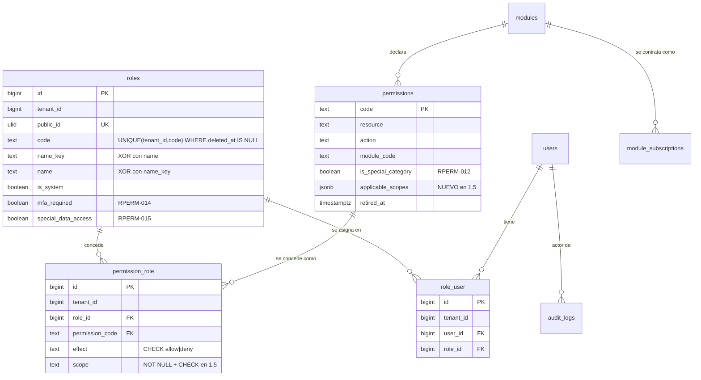

# REQ-PERM · Modelo de datos

> Paso **1.5**. **No se crea ninguna tabla nueva.** Este paso da semántica a cinco tablas que existen desde 0.8 (`ADR-034 §2`) y toca el esquema en **dos** puntos, ambos aditivos y ambos argumentados abajo.
>
> Estado del código verificado sobre la rama `feature/REQ-PERM-nucleo-autorizacion` el 2026-09-04, leyendo las migraciones y los modelos reales, no el historial.

---

## 1. Tablas implicadas y qué cambia en cada una

| Tabla | Ámbito | Cambia en 1.5 | Qué cambia |
|-------|--------|---------------|------------|
| `roles` | Tenant | **No** | Ya tiene todo: `code`, `name_key`/`name`, `is_system`, `mfa_required`, `special_data_access` |
| `role_user` | Tenant | **No** en esquema. **Sí** en cómo se escribe y se audita (§5.3) | — |
| `permissions` | **Referencia compartida** | **Sí** · columna nueva `applicable_scopes` (§3) | Aditivo sobre una tabla de referencia sin datos de tenant |
| `permission_role` | Tenant | **Sí** · `scope` pasa a `NOT NULL` + `CHECK` (§2) | El único cambio sobre datos existentes |
| `modules` | Referencia compartida | **No** | Se consulta, no se toca |
| `audit_logs` | Tenant, *append-only* | **No** en esquema. **Sí** en qué escribe (§5) | Sin ampliar el `CHECK` de `event` |

**Ninguna tabla nueva.** Es una consecuencia buscada de `ADR-044`: los permisos condicionales se difieren **sin columna reservada** (`§4.5`), la herencia de roles se descarta **sin `parent_role_id`** (`§4.6`) y la caché se descarta **sin tabla ni almacén** (`§4.7`).

### 1.1 Diagrama



---

## 2. El cambio sobre datos existentes: `permission_role.scope`

### 2.1 Estado actual, verificado

`apps/api/database/migrations/2026_08_18_100500_create_permissions_table.php` crea la columna así:

```
$table->text('scope')->nullable();
```

**Nullable y sin `CHECK`.** El resolutor provisional la ignora, y esa combinación es exactamente la trampa que `docs/modulos/REQ-CORE/permisos.md §5` tuvo que contener con una regla de seguridad y un test: un ámbito que nadie evalúa convierte una concesión restringida en acceso total.

Todas las filas existentes valen `'todos'`: `ProvisionTenantDefaults::seedPermissionGrants()` escribe literalmente `'scope' => 'todos'` en cada `PermissionRole::create()`, y `CA-CORE-042` lo verifica. **No hay ningún otro escritor de esta tabla en el producto.**

### 2.2 Estado objetivo

| Aspecto | Valor |
|---------|-------|
| Nulabilidad | `NOT NULL` |
| Valor por defecto | **Ninguno** |
| `CHECK` | `scope IN ('todos','propios','departamento','grupo','clase','unidad_familiar')` |

**Sin valor por defecto, y es deliberado.** Un `DEFAULT 'todos'` haría que omitir el ámbito concediera acceso total en silencio, que es literalmente el error que la *skill* `permisos-y-roles` describe: «el ámbito no es opcional: omitirlo equivale a conceder acceso total». Sin defecto, quien no lo escribe recibe un error del motor.

**Enumerado como `text` + `CHECK`, nunca el tipo `ENUM` de PostgreSQL** (`ADR-029`, y ya es el patrón de `effect`, `actor_type` y `event`).

### 2.3 La migración, paso a paso (*skill* `migracion-segura`)

Es **`expand` puro**: no se elimina ni se renombra nada. Pero `SET NOT NULL` y un `CHECK` normal toman `ACCESS EXCLUSIVE` y **recorren la tabla**, y el paso 1.4b ya recibió un hallazgo bloqueante de `db-reviewer` por DDL bloqueante sobre tabla viva. Se hace por el camino que no bloquea:

| # | Sentencia | Bloqueo | Por qué |
|---|-----------|---------|---------|
| 1 | `UPDATE permission_role SET scope = 'todos' WHERE scope IS NULL` | Filas afectadas: **cero hoy** | Idempotente y barato. Es la red por si algún entorno tuviera una fila que `CA-CORE-042` no cubre |
| 2 | `ALTER TABLE permission_role ADD CONSTRAINT permission_role_scope_not_null_check CHECK (scope IS NOT NULL) NOT VALID` | `ACCESS EXCLUSIVE` **instantáneo** (no recorre) | `NOT VALID` sólo comprueba las filas nuevas |
| 3 | `ALTER TABLE permission_role VALIDATE CONSTRAINT permission_role_scope_not_null_check` | `SHARE UPDATE EXCLUSIVE` | **No bloquea lecturas ni escrituras normales** |
| 4 | `ALTER TABLE permission_role ALTER COLUMN scope SET NOT NULL` | `ACCESS EXCLUSIVE` **sin recorrido** | PostgreSQL ≥ 12 **reutiliza** el `CHECK (scope IS NOT NULL)` ya validado y se salta el escaneo. Es la razón entera de los pasos 2 y 3 |
| 5 | `ALTER TABLE permission_role DROP CONSTRAINT permission_role_scope_not_null_check` | Instantáneo | Redundante con el `NOT NULL`. Se retira para no dejar dos comprobaciones de lo mismo |
| 6 | `ALTER TABLE permission_role ADD CONSTRAINT permission_role_scope_check CHECK (scope IN (...)) NOT VALID` | Instantáneo | |
| 7 | `ALTER TABLE permission_role VALIDATE CONSTRAINT permission_role_scope_check` | `SHARE UPDATE EXCLUSIVE` | |

Se ejecuta sobre la conexión `pgsql_owner`, como el resto del DDL de estas tablas.

### 2.4 ¿Hace falta `contract` en una segunda entrega?

**No.** `expand`/`contract` reparte un cambio **destructivo**; aquí no se elimina nada. La comprobación que sí hay que hacer es la de compatibilidad entre versiones durante el despliegue (`CLAUDE.md §9`), y sale bien por un motivo verificable:

> **La versión anterior ya escribe siempre `scope = 'todos'`.** El único escritor de `permission_role` en el código desplegado es `ProvisionTenantDefaults`, y escribe el ámbito de forma literal. Un `NOT NULL` no puede romperle nada porque nunca escribe `NULL`.

Si en el momento de implementar apareciera un segundo escritor que no fija `scope`, **la migración se para y se arregla el escritor primero**. Es una comprobación de una línea (`grep` de `permission_role`) que el implementador debe hacer, no suponer.

### 2.5 Reversión

`down()` retira los dos `CHECK` y devuelve la columna a `NULL`-able. Es reversible sin pérdida de datos: ninguna fila cambia de valor al revertir. **Pero revertir reabre el fallo silencioso**, así que la reversión es para un despliegue fallido, nunca para «desactivar temporalmente la validación».

---

## 3. La columna nueva: `permissions.applicable_scopes`

### 3.1 Por qué hace falta

`ADR-044 §4.1` decide que cada permiso declara qué ámbitos admite, y `§8` dice que **`platform:sync-registry` gana esa responsabilidad**. `SyncModuleRegistry::run()` materializa hoy `resource`, `action`, `module_code` e `is_special_category` en la tabla `permissions` con `updateOrInsert`. Materializar `applicable_scopes` por la misma vía exige una columna.

> **Relación con «el único cambio de esquema» de `ADR-044 §8`** — **resuelta** (decisión del usuario, 2026-09-04; `funcional.md §18`, `OPEN-PERM-06`): **son dos casos de categoría distinta**. «El único» se refiere al único cambio **con riesgo sobre datos existentes de tenant**, que es el contexto de la lista de consecuencias malas en la que aparece. `permission_role` lleva filas vivas de todos los centros, tiene RLS y su `SET NOT NULL` puede bloquear la tabla; `permissions` es tabla de **referencia compartida**, sin `tenant_id`, sin RLS, de unas 35 filas y escrita sólo por un comando de despliegue. Por eso **esta migración es un `ADD COLUMN` simple** y **no** lleva el tratamiento cauteloso `CHECK NOT VALID → VALIDATE` de §2.3.

### 3.2 Forma

| Columna | Tipo | Nulo | Defecto | Descripción |
|---------|------|------|---------|-------------|
| `applicable_scopes` | `jsonb` | **Sí** | `NULL` | Lista de ámbitos que este permiso admite. `NULL` se interpreta como `['todos']` |

Restricciones:

- `CHECK (applicable_scopes IS NULL OR (jsonb_typeof(applicable_scopes) = 'array' AND jsonb_array_length(applicable_scopes) > 0))`.
- **No** se declara un `CHECK` que valide cada elemento contra el vocabulario: expresarlo sobre `jsonb` es ilegible, y el valor no lo escribe un usuario sino `platform:sync-registry` a partir del código. La validación de los elementos va en el comando, que **falla el despliegue** si un módulo declara un ámbito inexistente (`operacion.md §4.2`).

**Anulable y no `NOT NULL DEFAULT '["todos"]'`**, y el motivo aquí **no** es el riesgo de la migración (§3.3), sino que deja explícita la diferencia entre «este módulo todavía no declara ámbitos» y «este módulo declara exactamente `todos`». Las dos se comportan igual; distinguirlas ayuda a saber qué módulos quedan por revisar cuando lleguen `REQ-ACAD` y `REQ-FAM-UNIT`.

### 3.3 La migración: `ADD COLUMN` simple

Dos sentencias sobre la conexión `pgsql_owner`, en la misma migración:

```
ALTER TABLE permissions ADD COLUMN applicable_scopes jsonb NULL;
ALTER TABLE permissions ADD CONSTRAINT permissions_applicable_scopes_check
    CHECK (applicable_scopes IS NULL
           OR (jsonb_typeof(applicable_scopes) = 'array'
               AND jsonb_array_length(applicable_scopes) > 0));
```

**Sin `NOT VALID` ni `VALIDATE`, y sin ninguna de las siete sentencias escalonadas de §2.3.** `ADD COLUMN` de una columna anulable sin defecto es una operación de sólo catálogo desde PostgreSQL 11: no reescribe la tabla. Y el `CHECK` sí recorre las filas al crearse, pero son **unas 35 filas de una tabla de referencia** cuyo único escritor es un comando de despliegue: no hay concurrencia que proteger ni datos de tenant que arriesgar.

Aplicar aquí el patrón cauteloso de §2.3 sería ceremonia sin beneficio, y peor: enseñaría a aplicarlo por costumbre en lugar de por análisis, que es justo lo que lo vuelve inútil el día que de verdad hace falta. La distinción entre las dos migraciones está resuelta y argumentada en §3.1.

`down()` retira el `CHECK` y la columna. Es reversible sin pérdida: el dato se regenera entero con `platform:sync-registry` (`operacion.md §4.2`).

### 3.4 Por qué en la tabla y no sólo en el código

La fuente de verdad **sigue siendo el código** (`INV-007`, `ADR-034 §2`). La columna es su materialización, exactamente igual que `is_special_category`, y se justifica por lo mismo que aquella:

- La validación de una concesión (`§4.1` de `funcional.md`) ocurre en una petición HTTP y necesita el dato **junto a la fila**, no recorriendo `ServiceProvider`.
- `GET /permissions` es una consulta a esta tabla; componer `applicable_scopes` desde el registro de módulos en cada petición convertiría un `SELECT` en una iteración sobre proveedores.
- Si el dato viviera sólo en el código y el catálogo sólo en la tabla, habría **dos fuentes** para responder a la misma pregunta y podrían divergir tras un despliegue a medias. Con `sync-registry` como único escritor, hay una.

---

## 4. Lo que NO cambia, y por qué merece decirse

| Se consideró | Decisión | Motivo |
|--------------|----------|--------|
| `permission_role.conditions jsonb` para `RPERM-008` | **No se crea** | `ADR-044 §4.5`. Una columna sin semántica repetiría exactamente la trampa de `scope` entre 1.1 y 1.5, y esta vez **sin la razón que la justificaba entonces**: nada entre 1.5 y 1.16 escribiría una condición. Añadirla cuando exista el motor es `expand` puro |
| `roles.parent_role_id` para herencia viva | **No se crea** | `ADR-044 §4.6`. Añadirla después es una columna anulable; quitarla después de que los centros monten jerarquías es migración de datos de autorización en producción |
| Tabla o almacén de permisos resueltos | **No se crea** | `ADR-044 §4.7`. El modo de fallo de una caché mal invalidada es **conceder lo ya revocado** |
| `public_id` en `permission_role` | **No se añade** | Una concesión no se direcciona por sí misma: se identifica por el par (rol, código de permiso), que ya es único vivo. `ADR-029` exige `public_id` en lo que aparece en URL o API, y aquí no aparece: la API la direcciona como subrecurso de `/roles/{public_id}` |
| Relajar el único de `permission_role` para permitir varios ámbitos por rol y código | **No se relaja** | `funcional.md §4.5`. Coincide con el modelo de «tres estados por celda» de la matriz (`ADR-044 §6`), y relajarlo después es `expand`; endurecerlo después no lo sería |
| Ampliar el `CHECK` de `audit_logs.event` | **No se amplía** | §5.3: la asignación de roles se registra como `updated`, un valor que ya existe |
| `academic_year_id` en cualquiera de estas tablas | **No aplica** | Un rol no depende del curso académico. Si algún día un centro quisiera roles por curso, sería un requisito nuevo con su propio modelo |

---

## 5. Auditoría (`RPERM-010`, `INV-003`, issue [#165](https://github.com/pirexia/plataforma-educativa/issues/165))

### 5.1 Estado actual, verificado

| Modelo | ¿`Auditable`? | Política | Consecuencia hoy |
|--------|---------------|----------|------------------|
| `Role` | **Sí** | `AuditValuePolicy::Full` | Crear, editar y borrar un rol **sí** deja rastro |
| `PermissionRole` | **No** | — | Conceder y revocar un permiso **no deja rastro** |
| `role_user` | No es modelo propio; se escribe con `sync()` | — | Cambiar los roles de un usuario **no deja rastro** |
| `Permission`, `Module` | No, a propósito | — | Catálogos de referencia gestionados por `platform:sync-registry`, fuera del ámbito de auditoría por tenant (`REQ-CORE/datos.md`) |

### 5.2 `PermissionRole` pasa a `Auditable`

| Declaración | Valor | Motivo |
|-------------|-------|--------|
| `auditValuePolicy()` | `AuditValuePolicy::Full` | Un código de permiso, un código de rol, un efecto y un ámbito **no son datos personales** (`ADR-035 §2`) |
| `auditRecordedAttributes` | `[]` | No aplica con política `Full` |
| `auditSecretAttributes` | `[]` | No hay secretos en esta tabla |
| `auditExcludedEvents()` | **No se declara** | Hereda `[]` de `HasAuditableAttributes`. `ADR-040 §4.4` fija con un test de arquitectura que `UserSession` es la **única** exclusión del repositorio, y ese test debe seguir pasando sin tocarlo |

**Dos consecuencias que hay que ejecutar, no suponer:**

1. **`ADR-035 §2` sujeta `Full` a un registro explícito con test**: el conjunto de modelos que declaran `Full` se compara contra una lista fija en el test de arquitectura. Añadir `PermissionRole` **obliga a editar ese test**, y ese es el efecto buscado: la decisión aparece en el `diff` y en la revisión.
2. **Toda escritura pasa por el modelo.** `PermissionRole::create()`, `->save()` y `->delete()` disparan el *observer*; `attach()`, `detach()` y `sync()` sobre `Role::users()` o cualquier `belongsToMany` **no**. Es lo que hoy deja mudo a `role_user`, y no puede repetirse aquí. `ProvisionTenantDefaults::seedPermissionGrants()` ya usa `PermissionRole::create()`, así que la siembra queda auditada sin tocarla.

**Efecto colateral del punto 2, previsto y aceptado**: el aprovisionamiento de un tenant pasará a escribir una fila de `audit_logs` por concesión sembrada, con `actor_type = 'console'` (la siembra ya se envuelve en `AuditActor::actingAs('console')`). Son unas decenas de filas por alta de centro, es correcto según `INV-003`, y se documenta en `operacion.md §5` para que no se lea como una regresión de rendimiento.

### 5.3 `role_user` se audita con registro explícito

`sync()` no dispara eventos de modelo y no puede hacerlo. `ADR-044 §4.11` fija por tanto **registro explícito con estado anterior y posterior**.

| Aspecto | Decisión |
|---------|----------|
| Sujeto | El **usuario** cuyos roles cambian (`auditable_type = 'user'`) |
| `event` | `updated` — **valor ya existente** del `CHECK` de `audit_logs.event`. **No se amplía el vocabulario** y por tanto no hace falta ADR (`ADR-034 §3`, `ADR-039`) |
| `changes` | `{"roles": {"from": ["docente"], "to": ["docente","tutor_grupo"]}}` — listas de **códigos de rol**, ordenadas de forma estable |
| Momento | Dentro de la misma transacción que el `sync()`, con el estado anterior leído **antes** |
| Condición | Sólo si hay cambio efectivo (`ADR-038 §9.3`) |

#### 5.3.1 El detalle que hace que esto funcione o no funcione

**`User` declara política `Selective`** con la lista de inclusión `['status', 'email_verified_at', 'deleted_at', 'created_by', 'updated_by']`. `AuditChangeBuilder` redacta como `identifier` **todo atributo que no esté en esa lista** (fallo en cerrado, `ADR-035 §2`).

> **Sin acción, la fila de auditoría del cambio de roles quedaría como `{"roles": {"redacted": "identifier", ...}}`**: auditable sobre el papel e inútil en la práctica, que es exactamente el estado del que este paso viene.

**Por tanto, `'roles'` se añade a `User::$auditRecordedAttributes`.** Es correcto y no relaja nada: un código de rol es contenido del centro, no un identificador personal, y la lista es de **inclusión**, así que añadir un nombre no abre ningún otro atributo.

Esta es una modificación de un modelo de `REQ-CORE`. Es admisible por lo mismo que `REQ-AUTH/permisos.md §C.5` argumentó para `rol.actualizar`: el modelo es de `Core`, el cambio se hace **en** `Core`, y no se importa código interno de un módulo desde otro.

### 5.4 Cobertura al cerrar el paso

| Operación | Modelo | `event` | ¿Existe hoy? |
|-----------|--------|---------|--------------|
| Crear rol | `Role` | `created` | Sí |
| Clonar rol | `Role` + `PermissionRole` (n) | `created` | Parcial |
| Editar rol | `Role` | `updated` | Sí |
| Dar de baja rol | `Role` + `PermissionRole` (n) | `deleted` | Parcial |
| Conceder permiso | `PermissionRole` | `created` | **No** |
| Cambiar efecto o ámbito | `PermissionRole` | `updated` | **No** |
| Revocar permiso | `PermissionRole` | `deleted` | **No** |
| Cambiar roles de un usuario | `User` | `updated` | **No** |

### 5.5 La tabla de `ADR-035 §8` queda desfasada

`ADR-035 §8` enumera los modelos auditables y su política; `PermissionRole` no está. **Un ADR es inmutable** (`CLAUDE.md §11`): la actualización se refleja aquí y en `docs/modulos/REQ-CORE/datos.md` (que ya reproduce esa tabla como reflejo documental), **no editando el ADR**.

---

## 6. Índices

**No se crea ningún índice nuevo.** Es una decisión, no un olvido: la *skill* `postgres-rendimiento` y la plantilla exigen justificar cada índice con la consulta que lo necesita, y un índice sin consulta es deuda.

Las consultas que introduce este paso y el índice que ya las sirve:

| Consulta | Índice existente | Nota |
|----------|------------------|------|
| Concesiones de los roles de un sujeto: `WHERE tenant_id = ? AND role_id IN (...)` | `permission_role_tenant_role_permission_unique (tenant_id, role_id, permission_code) WHERE deleted_at IS NULL` | El prefijo `(tenant_id, role_id)` sirve la consulta entera. Es la consulta caliente del resolutor, en cada petición |
| Roles de un usuario: `WHERE tenant_id = ? AND user_id = ?` | `role_user_tenant_user_role_unique (tenant_id, user_id, role_id) WHERE deleted_at IS NULL` | Ídem |
| Catálogo por módulo o recurso: `GET /permissions` | Clave primaria `code` + recorrido de ~35 filas | Tabla de referencia diminuta. Un índice aquí sería peso sin beneficio |
| Recuento de usuarios por rol (`users_count` de `GET /roles`) | Mismo índice de `role_user` | Ya en uso desde 1.1 |
| Auditoría acotada a `propios`: `WHERE tenant_id = ? AND actor_user_id = ? ORDER BY occurred_at DESC` | `(tenant_id, actor_user_id, occurred_at DESC)` de `ADR-034 §3` | **Es exactamente el índice que el resolutor `propios` necesita, y ya existe.** No es casualidad: es parte de por qué `ADR-044 §8` eligió este caso |

**Disparador de revisión**: si con varios centros el resolutor apareciera en las consultas lentas, se mide antes de tocar nada (`ADR-044 §4.7`).

---

## 7. Checklist obligatorio de la plantilla

- [x] **`tenant_id` presente e indexado como primera columna** — en `roles`, `role_user` y `permission_role`, desde 0.8. `permissions` y `modules` son de **referencia compartida** y no lo llevan por diseño (`ADR-033 §7`)
- [x] **Política de RLS declarada** — las tres tablas de tenant se crearon con `TenantMigration::tenantTable()`, que aplica `ENABLE`+`FORCE ROW LEVEL SECURITY` y la política estándar. **1.5 no crea ninguna tabla, así que no introduce ninguna tabla sin RLS**
- [ ] **`academic_year_id`** — no aplica: un rol no depende del curso académico (§4)
- [x] **`created_at`/`updated_at`/`deleted_at`/`created_by`/`updated_by`** — de `tenantTable()`, en las tres tablas de tenant
- [x] **Claves foráneas, `CHECK` y restricciones en base de datos** — FK compuestas por tenant, `CHECK` de `effect`, `CHECK` de `roles_name_source_check`, y los dos `CHECK` que añade este paso
- [x] **`TIMESTAMPTZ` siempre** — `retired_at` es `timestampTz`; los de `tenantTable()` también
- [x] **`text`, nunca `varchar(n)`** — todas las columnas de texto de estas tablas
- [ ] **Importes en céntimos** — no aplica, sin importes
- [x] **Enumerados como `text` + `CHECK`** — `effect` ya, `scope` a partir de este paso. **Nunca el tipo `ENUM` de PostgreSQL**
- [x] **`public_id` ULID en lo expuesto** — `roles` lo tiene. `permission_role` no aparece en URL (§4). `permissions` se direcciona por su `code`, que es su clave natural, pública y estable
- [ ] **`NULLS NOT DISTINCT`** — no aplica: ninguna unicidad de este paso involucra columnas anulables
- [ ] **Categoría especial en tabla separada y cifrada** — no aplica: `REQ-PERM` no almacena datos de categoría especial, **gobierna el acceso a ellos**. La separación la aplicarán los módulos que los expongan (`funcional.md §5.4`)
- [ ] **Particionado** — no aplica: las tres tablas crecen con el tamaño del centro (16 roles predefinidos más los personalizados), no con el tiempo de uso

---

## 8. Retención y supresión

**Ninguna de estas tablas contiene datos personales**, y eso condiciona todo lo demás:

| Dato | Naturaleza | Régimen |
|------|------------|---------|
| `roles.name` | Contenido del centro (`ADR-034 §2`) | Se borra lógicamente con el rol. No es dato personal |
| `roles.code`, `permissions.code` | Identificadores técnicos | Sin plazo |
| `permission_role`, `role_user` | Relaciones entre entidades del centro | Borrado lógico con su rol o su usuario |
| `role_user.user_id` | Referencia a una cuenta | Sigue el ciclo de vida del usuario. Al anonimizar la persona (`ADR-004` nivel 2), la relación deja de identificar a nadie sin necesidad de tocarla |

**Las filas de `audit_logs` que este paso empieza a escribir** siguen el régimen de `ADR-035`: no se editan, no se suprimen dirigidamente, y desaparecen por **vencimiento del plazo de retención** (`REQ-CORE-005`, mínimo dos años). Como su `changes` contiene únicamente códigos de rol y de permiso, **no hay ningún valor que redactar**: es el caso fácil de `ADR-035`, y es la razón por la que la política `Full` es la correcta aquí.

**Sin base legal específica que registrar** (`INV-008`): estas tablas no tratan datos de menores ni de ninguna persona identificada. La base legal del tratamiento de los usuarios a los que se asignan roles es la de `REQ-CORE`, no la de este paso.
